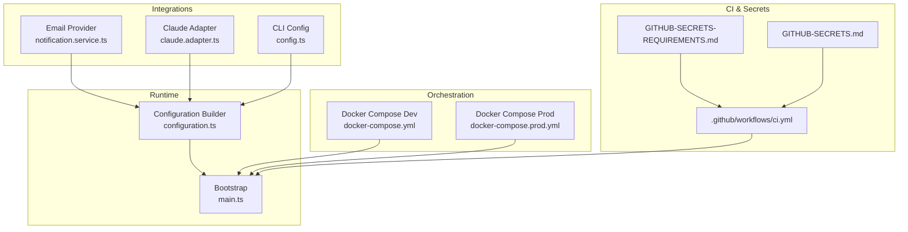
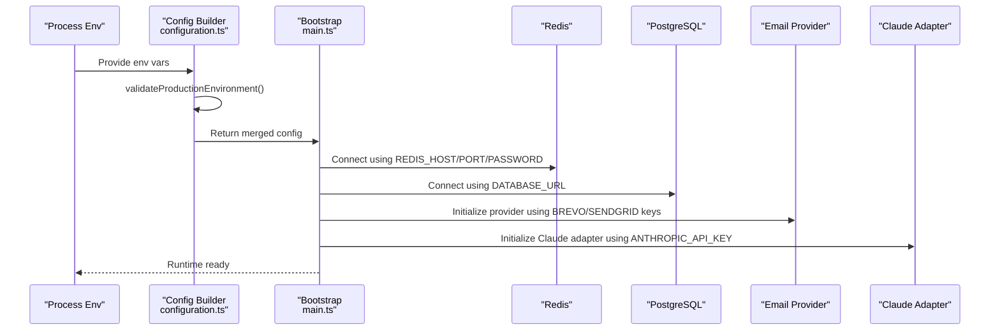
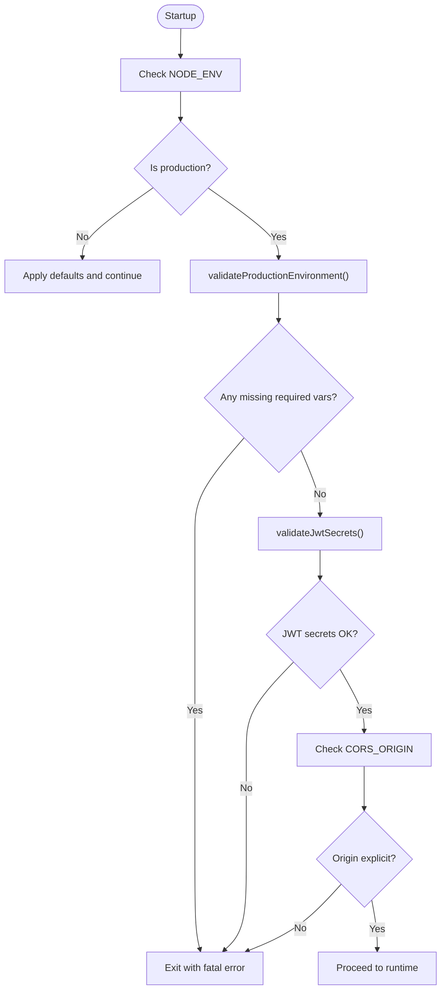
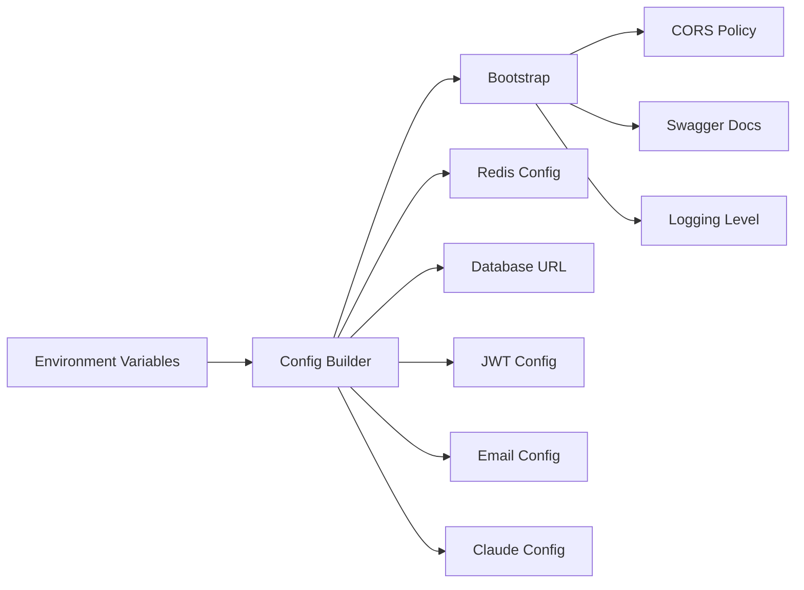

# Environment Variables

<cite>
**Referenced Files in This Document**
- [configuration.ts](file://apps/api/src/config/configuration.ts)
- [main.ts](file://apps/api/src/main.ts)
- [docker-compose.yml](file://docker-compose.yml)
- [docker-compose.prod.yml](file://docker-compose.prod.yml)
- [GITHUB-SECRETS-REQUIREMENTS.md](file://GITHUB-SECRETS-REQUIREMENTS.md)
- [GITHUB-SECRETS.md](file://GITHUB-SECRETS.md)
- [.github/workflows/ci.yml](file://.github/workflows/ci.yml)
- [notification.service.ts](file://apps/api/src/modules/notifications/notification.service.ts)
- [claude.adapter.ts](file://apps/api/src/modules/ai-gateway/adapters/claude.adapter.ts)
- [config.ts](file://apps/cli/src/lib/config.ts)
</cite>

## Table of Contents
1. [Introduction](#introduction)
2. [Project Structure](#project-structure)
3. [Core Components](#core-components)
4. [Architecture Overview](#architecture-overview)
5. [Detailed Component Analysis](#detailed-component-analysis)
6. [Dependency Analysis](#dependency-analysis)
7. [Performance Considerations](#performance-considerations)
8. [Troubleshooting Guide](#troubleshooting-guide)
9. [Conclusion](#conclusion)

## Introduction
This document explains how Quiz-to-Build manages environment variables and configuration across development, CI, and production environments. It catalogs required and optional environment variables for databases, caching, authentication, rate limiting, email providers, and AI services. It also covers production validation requirements, security considerations, development versus production differences, and practical troubleshooting steps.

## Project Structure
The configuration system spans:
- API runtime configuration builder and validator
- Docker Compose for local development and production-like orchestration
- GitHub Actions for CI and deployment secrets
- Email and AI provider integrations that consume environment variables
- CLI configuration manager for local developer settings

**Diagram sources**
- [configuration.ts:87-115](file://apps/api/src/config/configuration.ts#L87-L115)
- [main.ts:28-329](file://apps/api/src/main.ts#L28-L329)
- [docker-compose.yml:118-135](file://docker-compose.yml#L118-L135)
- [docker-compose.prod.yml:49-64](file://docker-compose.prod.yml#L49-L64)
- [.github/workflows/ci.yml:111-125](file://.github/workflows/ci.yml#L111-L125)
- [GITHUB-SECRETS-REQUIREMENTS.md:24-52](file://GITHUB-SECRETS-REQUIREMENTS.md#L24-L52)
- [GITHUB-SECRETS.md:132-176](file://GITHUB-SECRETS.md#L132-L176)
- [notification.service.ts:175-186](file://apps/api/src/modules/notifications/notification.service.ts#L175-L186)
- [claude.adapter.ts:116-139](file://apps/api/src/modules/ai-gateway/adapters/claude.adapter.ts#L116-L139)
- [config.ts:24-37](file://apps/cli/src/lib/config.ts#L24-L37)

**Section sources**
- [configuration.ts:87-115](file://apps/api/src/config/configuration.ts#L87-L115)
- [main.ts:28-329](file://apps/api/src/main.ts#L28-L329)
- [docker-compose.yml:118-135](file://docker-compose.yml#L118-L135)
- [docker-compose.prod.yml:49-64](file://docker-compose.prod.yml#L49-L64)
- [.github/workflows/ci.yml:111-125](file://.github/workflows/ci.yml#L111-L125)
- [GITHUB-SECRETS-REQUIREMENTS.md:24-52](file://GITHUB-SECRETS-REQUIREMENTS.md#L24-L52)
- [GITHUB-SECRETS.md:132-176](file://GITHUB-SECRETS.md#L132-L176)
- [notification.service.ts:175-186](file://apps/api/src/modules/notifications/notification.service.ts#L175-L186)
- [claude.adapter.ts:116-139](file://apps/api/src/modules/ai-gateway/adapters/claude.adapter.ts#L116-L139)
- [config.ts:24-37](file://apps/cli/src/lib/config.ts#L24-L37)

## Core Components
This section enumerates all environment variables used by the system, grouped by category.

- Database
  - DATABASE_URL: Connection string for PostgreSQL (required in production; optional for development)
  - Example usage: [configuration.ts](file://apps/api/src/config/configuration.ts#L99)
  - Example usage: [docker-compose.yml](file://docker-compose.yml#L121)
  - Example usage: [docker-compose.prod.yml](file://docker-compose.prod.yml#L53)

- Caching (Redis)
  - REDIS_HOST: Redis hostname (required in production; optional for development)
  - REDIS_PORT: Redis port (default applied if unset)
  - REDIS_PASSWORD: Redis password (optional; required for production TLS-enabled deployments)
  - Example usage: [configuration.ts:45-50](file://apps/api/src/config/configuration.ts#L45-L50)
  - Example usage: [docker-compose.yml:122-123](file://docker-compose.yml#L122-L123)
  - Example usage: [docker-compose.prod.yml:54-57](file://docker-compose.prod.yml#L54-L57)

- Authentication and Tokens
  - JWT_SECRET: Access token signing secret (required in production; strong secret enforced)
  - JWT_REFRESH_SECRET: Refresh token signing secret (required in production; strong secret enforced)
  - JWT_EXPIRES_IN: Access token lifetime (default applied if unset)
  - JWT_REFRESH_EXPIRES_IN: Refresh token lifetime (default applied if unset)
  - BCRYPT_ROUNDS: Hashing cost for password hashing (default applied if unset)
  - Example usage: [configuration.ts:53-59](file://apps/api/src/config/configuration.ts#L53-L59)
  - Example usage: [configuration.ts:32-42](file://apps/api/src/config/configuration.ts#L32-L42)
  - Example usage: [docker-compose.yml:124-125](file://docker-compose.yml#L124-L125)
  - Example usage: [docker-compose.prod.yml:56-57](file://docker-compose.prod.yml#L56-L57)

- Rate Limiting and Throttling
  - THROTTLE_TTL: Window duration for request counting (default applied if unset)
  - THROTTLE_LIMIT: Max requests per TTL window (default applied if unset)
  - THROTTLE_LOGIN_LIMIT: Max login attempts per window (default applied if unset)
  - Example usage: [configuration.ts:62-68](file://apps/api/src/config/configuration.ts#L62-L68)

- CORS and API
  - CORS_ORIGIN: Comma-separated allowlist of origins; must be explicit in production (not wildcard)
  - API_PREFIX: API route prefix (default applied if unset)
  - PORT: Server port (default applied if unset)
  - NODE_ENV: Environment mode (development/production)
  - FRONTEND_URL: Origin used for frontend links and redirects (default applied if unset)
  - Example usage: [configuration.ts:87-115](file://apps/api/src/config/configuration.ts#L87-L115)
  - Example usage: [main.ts:180-191](file://apps/api/src/main.ts#L180-L191)

- Logging and Observability
  - LOG_LEVEL: Log verbosity (default applied if unset)
  - ENABLE_SWAGGER: Toggle OpenAPI docs (default off in production)
  - Example usage: [configuration.ts:104-105](file://apps/api/src/config/configuration.ts#L104-L105)
  - Example usage: [main.ts:214-298](file://apps/api/src/main.ts#L214-L298)

- Email Providers
  - BREVO_API_KEY: Brevo/Sendinblue SMTP API key (preferred)
  - SENDGRID_API_KEY: SendGrid API key (legacy fallback)
  - EMAIL_FROM: Sender email address (default applied if unset)
  - EMAIL_FROM_NAME: Sender display name (default applied if unset)
  - Example usage: [configuration.ts:70-77](file://apps/api/src/config/configuration.ts#L70-L77)
  - Example usage: [notification.service.ts:175-186](file://apps/api/src/modules/notifications/notification.service.ts#L175-L186)

- AI Services
  - ANTHROPIC_API_KEY: Claude/Anthropic API key (required for Claude adapter)
  - CLAUDE_MODEL: Default model identifier (default applied if unset)
  - CLAUDE_MAX_TOKENS: Default max tokens (default applied if unset)
  - Example usage: [configuration.ts:79-85](file://apps/api/src/config/configuration.ts#L79-L85)
  - Example usage: [claude.adapter.ts:116-139](file://apps/api/src/modules/ai-gateway/adapters/claude.adapter.ts#L116-L139)

- CLI Local Configuration
  - apiUrl, apiToken, defaultSession: CLI persistent settings (stored locally)
  - Example usage: [config.ts:24-37](file://apps/cli/src/lib/config.ts#L24-L37)

**Section sources**
- [configuration.ts:45-115](file://apps/api/src/config/configuration.ts#L45-L115)
- [main.ts:180-191](file://apps/api/src/main.ts#L180-L191)
- [docker-compose.yml:118-135](file://docker-compose.yml#L118-L135)
- [docker-compose.prod.yml:49-64](file://docker-compose.prod.yml#L49-L64)
- [notification.service.ts:175-186](file://apps/api/src/modules/notifications/notification.service.ts#L175-L186)
- [claude.adapter.ts:116-139](file://apps/api/src/modules/ai-gateway/adapters/claude.adapter.ts#L116-L139)
- [config.ts:24-37](file://apps/cli/src/lib/config.ts#L24-L37)

## Architecture Overview
The configuration pipeline enforces production-grade validation early, builds typed configuration objects, and applies environment-driven defaults. Orchestrators and CI supply environment variables, while integrations read from the configuration service.

**Diagram sources**
- [configuration.ts:5-43](file://apps/api/src/config/configuration.ts#L5-L43)
- [configuration.ts:87-115](file://apps/api/src/config/configuration.ts#L87-L115)
- [main.ts:38-213](file://apps/api/src/main.ts#L38-L213)
- [notification.service.ts:175-186](file://apps/api/src/modules/notifications/notification.service.ts#L175-L186)
- [claude.adapter.ts:116-139](file://apps/api/src/modules/ai-gateway/adapters/claude.adapter.ts#L116-L139)

## Detailed Component Analysis

### Production Validation and Security
- Required production variables:
  - JWT_SECRET
  - JWT_REFRESH_SECRET
  - DATABASE_URL
- Validation rules:
  - Wildcard CORS_ORIGIN is rejected in production
  - JWT secrets must be strong and not placeholders
- Enforcement occurs during configuration build in production mode

**Diagram sources**
- [configuration.ts:5-43](file://apps/api/src/config/configuration.ts#L5-L43)
- [configuration.ts:87-115](file://apps/api/src/config/configuration.ts#L87-L115)

**Section sources**
- [configuration.ts:5-43](file://apps/api/src/config/configuration.ts#L5-L43)
- [configuration.ts:87-115](file://apps/api/src/config/configuration.ts#L87-L115)

### Database Connections
- DATABASE_URL is mandatory in production and used to connect to PostgreSQL.
- Development compose sets a default local URL; production compose uses environment substitution.

**Section sources**
- [configuration.ts](file://apps/api/src/config/configuration.ts#L99)
- [docker-compose.yml](file://docker-compose.yml#L121)
- [docker-compose.prod.yml](file://docker-compose.prod.yml#L53)

### Redis Configuration
- Host, port, and optional password are supported.
- Production compose requires a password for TLS-enabled Redis.

**Section sources**
- [configuration.ts:45-50](file://apps/api/src/config/configuration.ts#L45-L50)
- [docker-compose.yml:122-123](file://docker-compose.yml#L122-L123)
- [docker-compose.prod.yml](file://docker-compose.prod.yml#L36)
- [docker-compose.prod.yml:54-57](file://docker-compose.prod.yml#L54-L57)

### JWT and Token Expirations
- Access and refresh secrets are required in production and validated for strength.
- Defaults for expiration windows are applied when unspecified.

**Section sources**
- [configuration.ts:32-42](file://apps/api/src/config/configuration.ts#L32-L42)
- [configuration.ts:53-59](file://apps/api/src/config/configuration.ts#L53-L59)
- [docker-compose.yml:124-125](file://docker-compose.yml#L124-L125)
- [docker-compose.prod.yml:56-57](file://docker-compose.prod.yml#L56-L57)

### Rate Limiting and Throttling
- TTL, limits, and login limits are configurable with safe defaults.

**Section sources**
- [configuration.ts:62-68](file://apps/api/src/config/configuration.ts#L62-L68)

### CORS and API Prefix
- CORS_ORIGIN must be an explicit allowlist in production.
- API_PREFIX and PORT are configurable with defaults.

**Section sources**
- [configuration.ts](file://apps/api/src/config/configuration.ts#L104)
- [configuration.ts:97-98](file://apps/api/src/config/configuration.ts#L97-L98)
- [main.ts:180-191](file://apps/api/src/main.ts#L180-L191)

### Logging and Swagger
- LOG_LEVEL defaults to info in production and debug in development.
- ENABLE_SWAGGER toggles OpenAPI docs visibility.

**Section sources**
- [configuration.ts:104-105](file://apps/api/src/config/configuration.ts#L104-L105)
- [main.ts:214-298](file://apps/api/src/main.ts#L214-L298)

### Email Providers
- Preferred provider uses BREVO_API_KEY; fallback uses SENDGRID_API_KEY.
- From address and name are configurable.

**Section sources**
- [configuration.ts:70-77](file://apps/api/src/config/configuration.ts#L70-L77)
- [notification.service.ts:175-186](file://apps/api/src/modules/notifications/notification.service.ts#L175-L186)

### AI Service Credentials
- Claude adapter requires ANTHROPIC_API_KEY; model and max tokens are configurable.

**Section sources**
- [configuration.ts:79-85](file://apps/api/src/config/configuration.ts#L79-L85)
- [claude.adapter.ts:116-139](file://apps/api/src/modules/ai-gateway/adapters/claude.adapter.ts#L116-L139)

### CLI Configuration
- Local CLI settings (apiUrl, apiToken, defaultSession) are persisted and not exposed to the API runtime.

**Section sources**
- [config.ts:24-37](file://apps/cli/src/lib/config.ts#L24-L37)

## Dependency Analysis
Configuration dependencies across components:

**Diagram sources**
- [configuration.ts:45-115](file://apps/api/src/config/configuration.ts#L45-L115)
- [main.ts:180-298](file://apps/api/src/main.ts#L180-L298)

**Section sources**
- [configuration.ts:45-115](file://apps/api/src/config/configuration.ts#L45-L115)
- [main.ts:180-298](file://apps/api/src/main.ts#L180-L298)

## Performance Considerations
- Keep CORS_ORIGIN precise in production to avoid preflight overhead.
- Tune throttling variables for expected traffic patterns.
- Use production-grade Redis with password and TLS for performance and security.

## Troubleshooting Guide
Common configuration errors and resolutions:

- Missing required production variables
  - Symptom: Startup exits with a fatal error listing missing variables.
  - Resolution: Provide JWT_SECRET, JWT_REFRESH_SECRET, and DATABASE_URL in production.
  - Reference: [configuration.ts:5-27](file://apps/api/src/config/configuration.ts#L5-L27)

- Weak or placeholder JWT secrets
  - Symptom: Startup exits with a fatal error requiring strong secrets.
  - Resolution: Generate and set secure secrets meeting length and entropy requirements.
  - Reference: [configuration.ts:32-42](file://apps/api/src/config/configuration.ts#L32-L42)

- Wildcard CORS_ORIGIN in production
  - Symptom: Startup exits with a fatal error.
  - Resolution: Set CORS_ORIGIN to a specific allowlist; avoid "*".
  - Reference: [configuration.ts:22-26](file://apps/api/src/config/configuration.ts#L22-L26)

- Redis connectivity issues
  - Symptom: Connection failures or timeouts.
  - Resolution: Confirm REDIS_HOST, REDIS_PORT, and REDIS_PASSWORD match your cache service; ensure TLS requirements for production.
  - Reference: [docker-compose.prod.yml](file://docker-compose.prod.yml#L36)
  - Reference: [configuration.ts:45-50](file://apps/api/src/config/configuration.ts#L45-L50)

- Email provider not sending
  - Symptom: Emails not delivered; warnings about console provider.
  - Resolution: Set BREVO_API_KEY or SENDGRID_API_KEY; verify sender address and name.
  - Reference: [notification.service.ts:175-186](file://apps/api/src/modules/notifications/notification.service.ts#L175-L186)
  - Reference: [configuration.ts:70-77](file://apps/api/src/config/configuration.ts#L70-L77)

- Claude adapter unavailable
  - Symptom: AI gateway cannot initialize Claude adapter.
  - Resolution: Set ANTHROPIC_API_KEY; optionally tune model and max tokens.
  - Reference: [claude.adapter.ts:116-139](file://apps/api/src/modules/ai-gateway/adapters/claude.adapter.ts#L116-L139)
  - Reference: [configuration.ts:79-85](file://apps/api/src/config/configuration.ts#L79-L85)

- CI test failures due to missing environment
  - Symptom: Tests fail to start API or require CSRF bypass.
  - Resolution: Provide DATABASE_URL, REDIS_HOST, REDIS_PORT, JWT_SECRET, JWT_REFRESH_SECRET, and CSRF_DISABLED as needed in CI.
  - Reference: [.github/workflows/ci.yml:111-125](file://.github/workflows/ci.yml#L111-L125)

- Deployment secrets mismatch
  - Symptom: Deployment fails due to missing or invalid secrets.
  - Resolution: Ensure GitHub secrets match requirements and are properly formatted; verify Azure Container Apps secrets.
  - Reference: [GITHUB-SECRETS-REQUIREMENTS.md:24-52](file://GITHUB-SECRETS-REQUIREMENTS.md#L24-L52)
  - Reference: [GITHUB-SECRETS.md:132-176](file://GITHUB-SECRETS.md#L132-L176)

**Section sources**
- [configuration.ts:5-43](file://apps/api/src/config/configuration.ts#L5-L43)
- [docker-compose.prod.yml](file://docker-compose.prod.yml#L36)
- [notification.service.ts:175-186](file://apps/api/src/modules/notifications/notification.service.ts#L175-L186)
- [claude.adapter.ts:116-139](file://apps/api/src/modules/ai-gateway/adapters/claude.adapter.ts#L116-L139)
- [.github/workflows/ci.yml:111-125](file://.github/workflows/ci.yml#L111-L125)
- [GITHUB-SECRETS-REQUIREMENTS.md:24-52](file://GITHUB-SECRETS-REQUIREMENTS.md#L24-L52)
- [GITHUB-SECRETS.md:132-176](file://GITHUB-SECRETS.md#L132-L176)

## Conclusion
Quiz-to-Build centralizes configuration in a single builder that validates production requirements, applies sensible defaults, and exposes typed settings to the runtime. By adhering to the environment variable matrix and security guidelines—especially around JWT secrets, CORS, and Redis—you can reliably operate the API in development and production. Use CI and deployment documentation to manage secrets and environment variables consistently across stages.