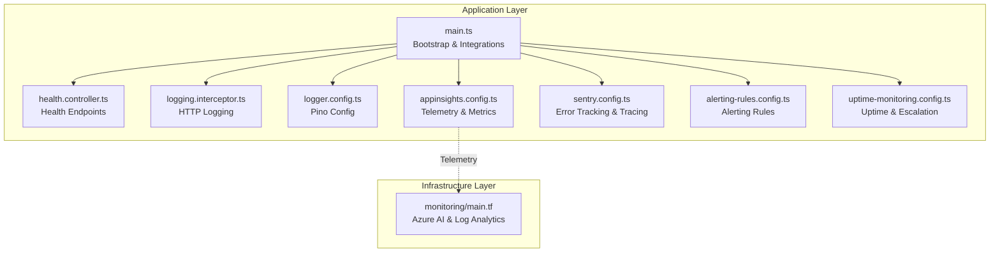
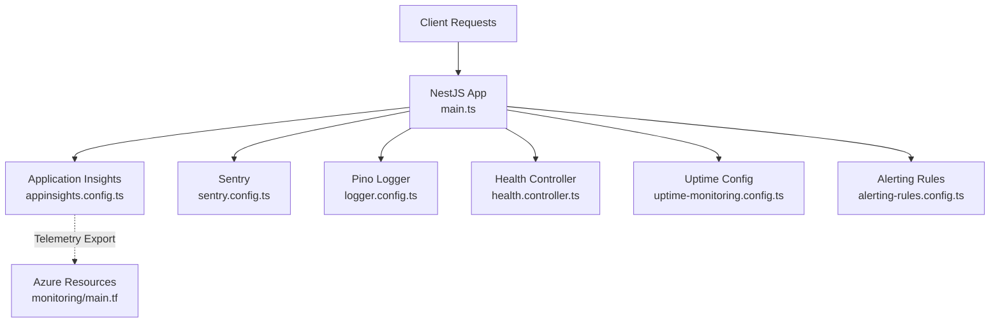
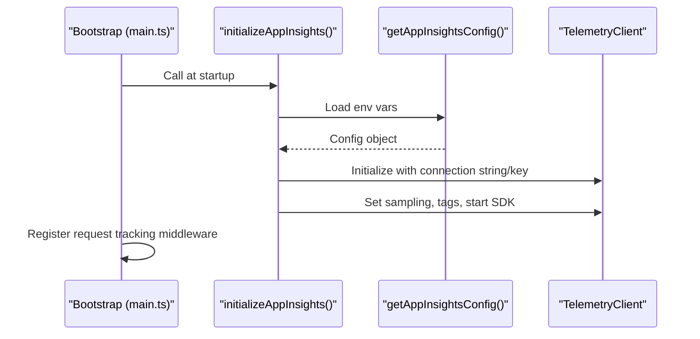
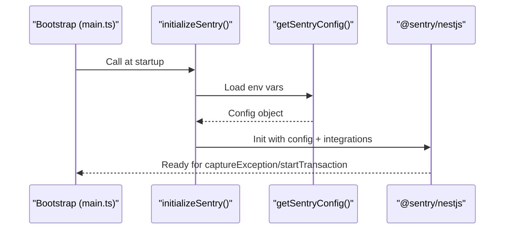
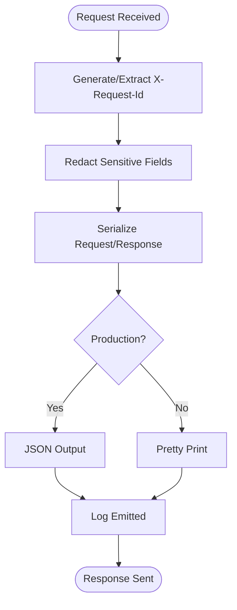
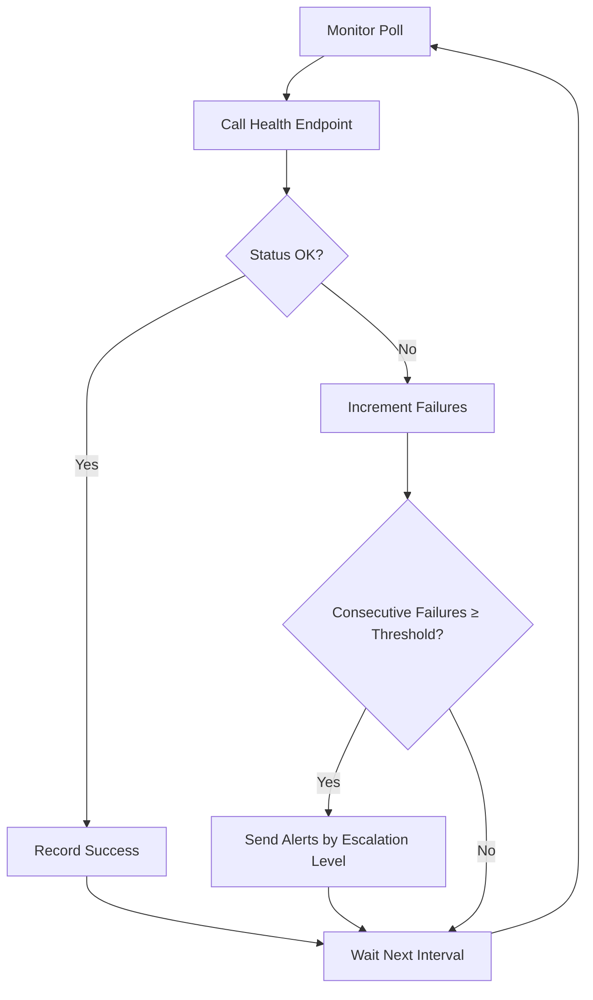
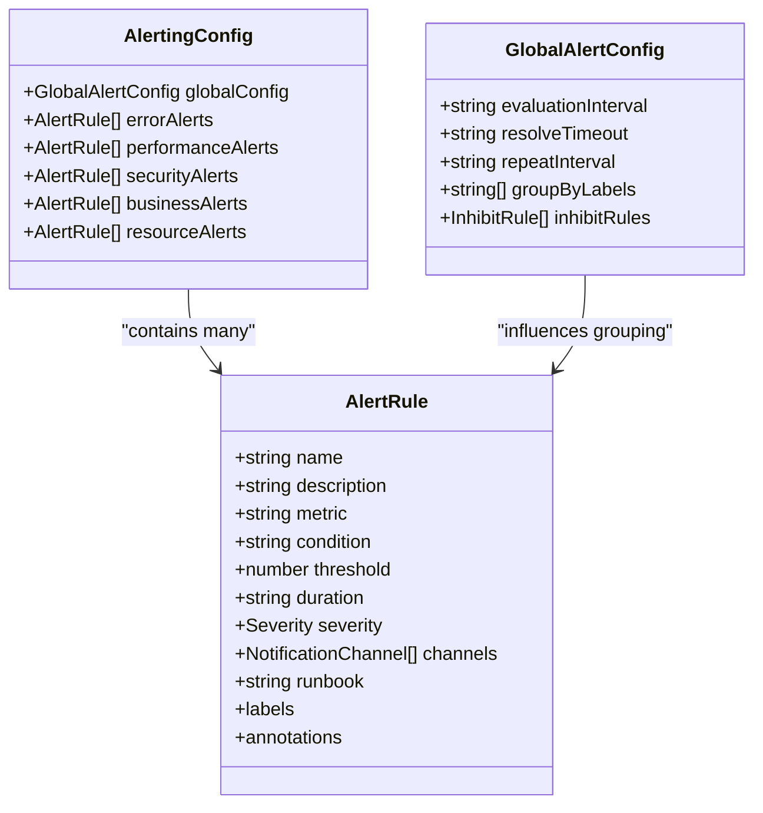
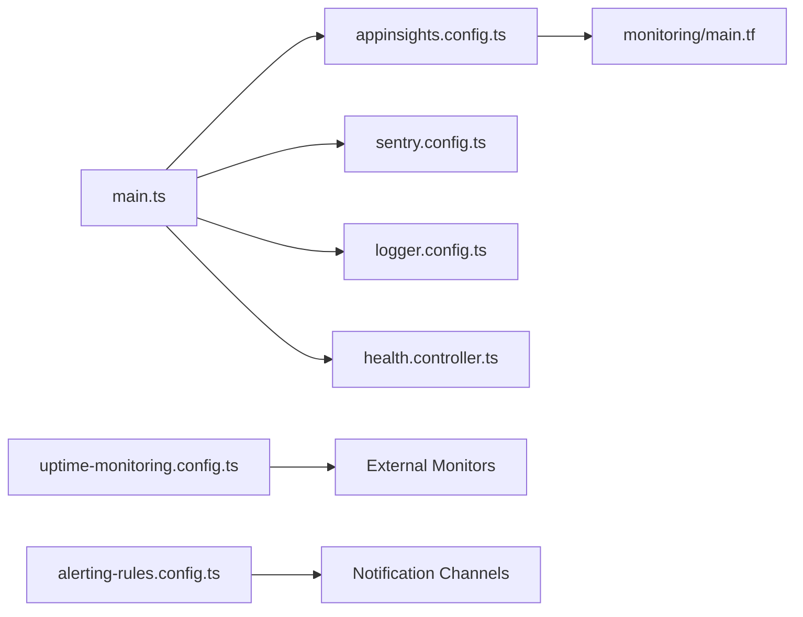

# Monitoring & Observability

<cite>
**Referenced Files in This Document**
- [apps/api/src/main.ts](file://apps/api/src/main.ts)
- [apps/api/src/health.controller.ts](file://apps/api/src/health.controller.ts)
- [apps/api/src/common/interceptors/logging.interceptor.ts](file://apps/api/src/common/interceptors/logging.interceptor.ts)
- [apps/api/src/config/logger.config.ts](file://apps/api/src/config/logger.config.ts)
- [apps/api/src/config/appinsights.config.ts](file://apps/api/src/config/appinsights.config.ts)
- [apps/api/src/config/sentry.config.ts](file://apps/api/src/config/sentry.config.ts)
- [apps/api/src/config/alerting-rules.config.ts](file://apps/api/src/config/alerting-rules.config.ts)
- [apps/api/src/config/uptime-monitoring.config.ts](file://apps/api/src/config/uptime-monitoring.config.ts)
- [infrastructure/terraform/modules/monitoring/main.tf](file://infrastructure/terraform/modules/monitoring/main.tf)
</cite>

## Table of Contents
1. [Introduction](#introduction)
2. [Project Structure](#project-structure)
3. [Core Components](#core-components)
4. [Architecture Overview](#architecture-overview)
5. [Detailed Component Analysis](#detailed-component-analysis)
6. [Dependency Analysis](#dependency-analysis)
7. [Performance Considerations](#performance-considerations)
8. [Troubleshooting Guide](#troubleshooting-guide)
9. [Conclusion](#conclusion)
10. [Appendices](#appendices)

## Introduction
This document provides comprehensive monitoring and observability configuration for Quiz-to-Build. It covers Application Insights setup, Sentry error tracking, custom logging framework integration, uptime monitoring strategies, alerting rule configurations, performance metrics collection, distributed tracing setup, log level configurations, structured logging formats, monitoring dashboard setup, integration with external monitoring services, custom metric collection, and alert escalation procedures.

## Project Structure
The monitoring and observability stack is implemented across three primary layers:
- Application-level telemetry and logging (NestJS + Pino)
- Platform-level infrastructure (Azure Application Insights and Log Analytics)
- Uptime and alerting orchestration (external services and internal rules)

**Diagram sources**
- [apps/api/src/main.ts:28-329](file://apps/api/src/main.ts#L28-L329)
- [apps/api/src/health.controller.ts:52-410](file://apps/api/src/health.controller.ts#L52-L410)
- [apps/api/src/common/interceptors/logging.interceptor.ts:10-56](file://apps/api/src/common/interceptors/logging.interceptor.ts#L10-L56)
- [apps/api/src/config/logger.config.ts:9-62](file://apps/api/src/config/logger.config.ts#L9-L62)
- [apps/api/src/config/appinsights.config.ts:35-117](file://apps/api/src/config/appinsights.config.ts#L35-L117)
- [apps/api/src/config/sentry.config.ts:51-127](file://apps/api/src/config/sentry.config.ts#L51-L127)
- [apps/api/src/config/alerting-rules.config.ts:61-478](file://apps/api/src/config/alerting-rules.config.ts#L61-L478)
- [apps/api/src/config/uptime-monitoring.config.ts:12-379](file://apps/api/src/config/uptime-monitoring.config.ts#L12-L379)
- [infrastructure/terraform/modules/monitoring/main.tf:1-22](file://infrastructure/terraform/modules/monitoring/main.tf#L1-L22)

**Section sources**
- [apps/api/src/main.ts:28-329](file://apps/api/src/main.ts#L28-L329)
- [apps/api/src/health.controller.ts:52-410](file://apps/api/src/health.controller.ts#L52-L410)
- [apps/api/src/common/interceptors/logging.interceptor.ts:10-56](file://apps/api/src/common/interceptors/logging.interceptor.ts#L10-L56)
- [apps/api/src/config/logger.config.ts:9-62](file://apps/api/src/config/logger.config.ts#L9-L62)
- [apps/api/src/config/appinsights.config.ts:35-117](file://apps/api/src/config/appinsights.config.ts#L35-L117)
- [apps/api/src/config/sentry.config.ts:51-127](file://apps/api/src/config/sentry.config.ts#L51-L127)
- [apps/api/src/config/alerting-rules.config.ts:61-478](file://apps/api/src/config/alerting-rules.config.ts#L61-L478)
- [apps/api/src/config/uptime-monitoring.config.ts:12-379](file://apps/api/src/config/uptime-monitoring.config.ts#L12-L379)
- [infrastructure/terraform/modules/monitoring/main.tf:1-22](file://infrastructure/terraform/modules/monitoring/main.tf#L1-L22)

## Core Components
- Application Insights: Centralized telemetry, custom metrics, availability tests, and exception tracking.
- Sentry: Error tracking, performance monitoring, and optional profiling integration.
- Custom Logging Framework: Structured JSON logging via Pino with correlation IDs and redaction.
- Uptime Monitoring: Health endpoints, SLA targets, alert thresholds, and escalation policies.
- Alerting Rules: Comprehensive thresholds across error rates, performance, security, business, and resource categories.
- Infrastructure Telemetry: Azure Application Insights and Log Analytics resources provisioned via Terraform.

**Section sources**
- [apps/api/src/config/appinsights.config.ts:35-117](file://apps/api/src/config/appinsights.config.ts#L35-L117)
- [apps/api/src/config/sentry.config.ts:51-127](file://apps/api/src/config/sentry.config.ts#L51-L127)
- [apps/api/src/config/logger.config.ts:9-62](file://apps/api/src/config/logger.config.ts#L9-L62)
- [apps/api/src/config/uptime-monitoring.config.ts:12-379](file://apps/api/src/config/uptime-monitoring.config.ts#L12-L379)
- [apps/api/src/config/alerting-rules.config.ts:61-478](file://apps/api/src/config/alerting-rules.config.ts#L61-L478)
- [infrastructure/terraform/modules/monitoring/main.tf:1-22](file://infrastructure/terraform/modules/monitoring/main.tf#L1-L22)

## Architecture Overview
The observability architecture integrates application telemetry, platform infrastructure, and external uptime monitoring.

**Diagram sources**
- [apps/api/src/main.ts:28-329](file://apps/api/src/main.ts#L28-L329)
- [apps/api/src/config/appinsights.config.ts:35-117](file://apps/api/src/config/appinsights.config.ts#L35-L117)
- [apps/api/src/config/sentry.config.ts:51-127](file://apps/api/src/config/sentry.config.ts#L51-L127)
- [apps/api/src/config/logger.config.ts:9-62](file://apps/api/src/config/logger.config.ts#L9-L62)
- [apps/api/src/health.controller.ts:52-410](file://apps/api/src/health.controller.ts#L52-L410)
- [apps/api/src/config/uptime-monitoring.config.ts:12-379](file://apps/api/src/config/uptime-monitoring.config.ts#L12-L379)
- [apps/api/src/config/alerting-rules.config.ts:61-478](file://apps/api/src/config/alerting-rules.config.ts#L61-L478)
- [infrastructure/terraform/modules/monitoring/main.tf:1-22](file://infrastructure/terraform/modules/monitoring/main.tf#L1-L22)

## Detailed Component Analysis

### Application Insights Setup
Application Insights is initialized early in the bootstrap process and configured with:
- Connection string or instrumentation key
- Sampling percentages tuned by environment
- Cloud role and role instance tagging
- Auto-collection toggles for requests, performance, exceptions, dependencies, and console
- Telemetry client access for custom metrics, events, exceptions, dependencies, and availability

Key capabilities:
- Custom metrics for questionnaire completion, readiness scores, and response times
- Standardized performance metrics for API, database, and external API latencies
- Endpoint usage tracking and slow request detection
- Availability tests for health checks
- Graceful shutdown with telemetry flush

**Diagram sources**
- [apps/api/src/main.ts:28-329](file://apps/api/src/main.ts#L28-L329)
- [apps/api/src/config/appinsights.config.ts:35-117](file://apps/api/src/config/appinsights.config.ts#L35-L117)

**Section sources**
- [apps/api/src/config/appinsights.config.ts:35-117](file://apps/api/src/config/appinsights.config.ts#L35-L117)
- [apps/api/src/main.ts:28-329](file://apps/api/src/main.ts#L28-L329)

### Sentry Error Tracking and Distributed Tracing
Sentry is initialized early in the bootstrap process with:
- DSN, environment, release, and sampling rates
- Optional profiling integration if available
- Sensitive data redaction in requests and breadcrumbs
- Transaction filtering for health endpoints
- Ignored error patterns
- User context management and breadcrumbs
- Transaction creation for performance monitoring

**Diagram sources**
- [apps/api/src/main.ts:28-329](file://apps/api/src/main.ts#L28-L329)
- [apps/api/src/config/sentry.config.ts:51-127](file://apps/api/src/config/sentry.config.ts#L51-L127)

**Section sources**
- [apps/api/src/config/sentry.config.ts:51-127](file://apps/api/src/config/sentry.config.ts#L51-L127)
- [apps/api/src/main.ts:28-329](file://apps/api/src/main.ts#L28-L329)

### Custom Logging Framework Integration
The logging framework uses Pino with:
- Environment-driven log levels
- Correlation IDs via X-Request-Id header
- Redaction of sensitive headers and cookies
- Structured serializers for request and response objects
- Pretty printing in development, JSON in production

**Diagram sources**
- [apps/api/src/config/logger.config.ts:9-62](file://apps/api/src/config/logger.config.ts#L9-L62)

**Section sources**
- [apps/api/src/config/logger.config.ts:9-62](file://apps/api/src/config/logger.config.ts#L9-L62)
- [apps/api/src/common/interceptors/logging.interceptor.ts:10-56](file://apps/api/src/common/interceptors/logging.interceptor.ts#L10-L56)

### Uptime Monitoring Strategies
Uptime monitoring defines:
- SLA targets and response time goals
- Health endpoints for liveness, readiness, and full health checks
- External monitor configurations (UptimeRobot) with alert contacts
- Alert channels (email, Slack, Teams, PagerDuty)
- Escalation levels with delays and channels
- Severity levels with response time and notification preferences
- Metrics to track (uptime, response time percentiles, availability)
- Helper functions for SLA calculations, maintenance windows, and severity mapping

**Diagram sources**
- [apps/api/src/config/uptime-monitoring.config.ts:12-379](file://apps/api/src/config/uptime-monitoring.config.ts#L12-L379)

**Section sources**
- [apps/api/src/config/uptime-monitoring.config.ts:12-379](file://apps/api/src/config/uptime-monitoring.config.ts#L12-L379)
- [apps/api/src/health.controller.ts:52-410](file://apps/api/src/health.controller.ts#L52-L410)

### Alerting Rule Configurations
Alerting rules define thresholds, durations, severities, and notification channels across:
- Error rate and HTTP error spikes
- Unhandled exceptions
- Response time thresholds (p95/p99)
- Database query latency
- Throughput drops
- Authentication failures and suspicious activity
- Payment and document generation failures
- CPU, memory, disk, and Redis usage
- Database connection pool exhaustion

Notification channels include email, Slack, Teams, PagerDuty, SMS, and webhooks. Escalation policies differ for critical vs. default severity.

**Diagram sources**
- [apps/api/src/config/alerting-rules.config.ts:20-80](file://apps/api/src/config/alerting-rules.config.ts#L20-L80)

**Section sources**
- [apps/api/src/config/alerting-rules.config.ts:61-478](file://apps/api/src/config/alerting-rules.config.ts#L61-L478)

### Performance Metrics Collection
Application Insights exposes standardized performance metrics for:
- API response time
- Database query time
- External API time
- Requests per second and concurrent users
- Questionnaire metrics (answered questions, completion rate, time spent)
- Scoring calculation time and average readiness score
- Document generation time and throughput

These metrics are tracked via custom metrics and availability tests, enabling dashboards and alerting.

**Section sources**
- [apps/api/src/config/appinsights.config.ts:461-498](file://apps/api/src/config/appinsights.config.ts#L461-L498)

### Distributed Tracing Setup
Sentry provides distributed tracing with:
- Transaction sampling and optional profiling integration
- Filtering of health check transactions
- User context and breadcrumbs for debugging
- Optional integration with Application Insights for cross-service correlation

**Section sources**
- [apps/api/src/config/sentry.config.ts:51-127](file://apps/api/src/config/sentry.config.ts#L51-L127)
- [apps/api/src/config/appinsights.config.ts:576-610](file://apps/api/src/config/appinsights.config.ts#L576-L610)

### Log Level Configurations and Structured Logging Formats
- Log levels are environment-driven (production defaults to info, development to debug)
- Correlation IDs are generated or extracted from X-Request-Id
- Sensitive fields are redacted from logs
- Structured serializers normalize request and response objects
- Transport selection switches between pretty print and JSON based on environment

**Section sources**
- [apps/api/src/config/logger.config.ts:9-62](file://apps/api/src/config/logger.config.ts#L9-L62)

### Monitoring Dashboard Setup
Dashboards should include:
- Health endpoint status and response times
- Error rates and HTTP 5xx trends
- Response time percentiles (p95/p99)
- Database and external API latency
- Throughput and resource usage (CPU, memory, Redis)
- Questionnaire and document generation metrics
- Uptime and SLA percentage
- Sentry error volume and top events

These are derived from Application Insights metrics and logs, with optional Azure Log Analytics workspaces for advanced queries.

**Section sources**
- [apps/api/src/config/appinsights.config.ts:461-498](file://apps/api/src/config/appinsights.config.ts#L461-L498)
- [infrastructure/terraform/modules/monitoring/main.tf:1-22](file://infrastructure/terraform/modules/monitoring/main.tf#L1-L22)

### Integration with External Monitoring Services
- UptimeRobot monitors health endpoints and publishes status to a status page
- Alert channels include email, Slack, Teams, and PagerDuty
- Escalation policies define multi-level notifications with delays
- Severity levels map to response time targets and notification channels

**Section sources**
- [apps/api/src/config/uptime-monitoring.config.ts:100-210](file://apps/api/src/config/uptime-monitoring.config.ts#L100-L210)
- [apps/api/src/config/uptime-monitoring.config.ts:216-268](file://apps/api/src/config/uptime-monitoring.config.ts#L216-L268)

### Custom Metric Collection
Application Insights supports:
- Custom metrics for business KPIs (completion percentage, time spent)
- Standardized performance metrics for latency and throughput
- Endpoint usage tracking with duration measurements
- Availability tests for health checks
- Dependency tracking for databases and external APIs

**Section sources**
- [apps/api/src/config/appinsights.config.ts:143-452](file://apps/api/src/config/appinsights.config.ts#L143-L452)

### Alert Escalation Procedures
Escalation levels:
- Level 1: Immediate notification via email and Slack
- Level 2: Escalation after 15 minutes to include Teams
- Level 3: Escalation after 30 minutes to include PagerDuty and SMS

Severity levels:
- P1 (Critical): Immediate response and broad notification channels
- P2 (Major): Significant impact, escalates quickly
- P3 (Minor): Limited impact, slower escalation
- P4 (Low): Cosmetic or minor issues

**Section sources**
- [apps/api/src/config/uptime-monitoring.config.ts:191-210](file://apps/api/src/config/uptime-monitoring.config.ts#L191-L210)
- [apps/api/src/config/uptime-monitoring.config.ts:216-247](file://apps/api/src/config/uptime-monitoring.config.ts#L216-L247)

## Dependency Analysis
The observability stack exhibits clear separation of concerns:
- Bootstrap initializes telemetry and logging before application routes are registered
- Health endpoints provide probes for Kubernetes and uptime monitors
- Alerting rules and uptime configurations are decoupled from application logic
- Infrastructure resources are provisioned separately via Terraform

**Diagram sources**
- [apps/api/src/main.ts:28-329](file://apps/api/src/main.ts#L28-L329)
- [apps/api/src/config/appinsights.config.ts:35-117](file://apps/api/src/config/appinsights.config.ts#L35-L117)
- [apps/api/src/config/sentry.config.ts:51-127](file://apps/api/src/config/sentry.config.ts#L51-L127)
- [apps/api/src/config/logger.config.ts:9-62](file://apps/api/src/config/logger.config.ts#L9-L62)
- [apps/api/src/health.controller.ts:52-410](file://apps/api/src/health.controller.ts#L52-L410)
- [apps/api/src/config/uptime-monitoring.config.ts:12-379](file://apps/api/src/config/uptime-monitoring.config.ts#L12-L379)
- [apps/api/src/config/alerting-rules.config.ts:61-478](file://apps/api/src/config/alerting-rules.config.ts#L61-L478)
- [infrastructure/terraform/modules/monitoring/main.tf:1-22](file://infrastructure/terraform/modules/monitoring/main.tf#L1-L22)

**Section sources**
- [apps/api/src/main.ts:28-329](file://apps/api/src/main.ts#L28-L329)
- [apps/api/src/health.controller.ts:52-410](file://apps/api/src/health.controller.ts#L52-L410)
- [apps/api/src/config/appinsights.config.ts:35-117](file://apps/api/src/config/appinsights.config.ts#L35-L117)
- [apps/api/src/config/sentry.config.ts:51-127](file://apps/api/src/config/sentry.config.ts#L51-L127)
- [apps/api/src/config/logger.config.ts:9-62](file://apps/api/src/config/logger.config.ts#L9-L62)
- [apps/api/src/config/uptime-monitoring.config.ts:12-379](file://apps/api/src/config/uptime-monitoring.config.ts#L12-L379)
- [apps/api/src/config/alerting-rules.config.ts:61-478](file://apps/api/src/config/alerting-rules.config.ts#L61-L478)
- [infrastructure/terraform/modules/monitoring/main.tf:1-22](file://infrastructure/terraform/modules/monitoring/main.tf#L1-L22)

## Performance Considerations
- Application Insights sampling reduces telemetry overhead while maintaining signal quality
- Compression excludes streaming endpoints to preserve real-time performance
- Health checks are optimized for minimal latency and resource usage
- Logging uses structured JSON in production to improve parsing and reduce overhead
- Sentry sampling rates balance visibility with performance

[No sources needed since this section provides general guidance]

## Troubleshooting Guide
Common issues and resolutions:
- Application Insights not initializing: Verify connection string or instrumentation key environment variables and ensure initialization order
- Sentry DSN missing: Confirm DSN is set; Sentry initialization is skipped when absent
- Health endpoint failures: Review database connectivity, Redis availability, and AI gateway health
- Excessive alert noise: Adjust thresholds and durations in alerting rules; configure quiet hours for lower severity alerts
- Uptime monitor misconfiguration: Validate UptimeRobot API key, alert contacts, and endpoint URLs
- Log redaction issues: Ensure sensitive headers are consistently redacted across requests and responses

**Section sources**
- [apps/api/src/config/appinsights.config.ts:65-117](file://apps/api/src/config/appinsights.config.ts#L65-L117)
- [apps/api/src/config/sentry.config.ts:51-127](file://apps/api/src/config/sentry.config.ts#L51-L127)
- [apps/api/src/health.controller.ts:240-410](file://apps/api/src/health.controller.ts#L240-L410)
- [apps/api/src/config/alerting-rules.config.ts:656-740](file://apps/api/src/config/alerting-rules.config.ts#L656-L740)
- [apps/api/src/config/uptime-monitoring.config.ts:100-149](file://apps/api/src/config/uptime-monitoring.config.ts#L100-L149)
- [apps/api/src/config/logger.config.ts:28-31](file://apps/api/src/config/logger.config.ts#L28-L31)

## Conclusion
Quiz-to-Build’s observability stack combines robust application telemetry, structured logging, comprehensive alerting, and uptime monitoring. Application Insights and Sentry provide deep insights into performance and errors, while Pino ensures consistent, machine-readable logs. Uptime monitoring and alerting rules enable rapid incident response with clear escalation paths. Infrastructure provisioning via Terraform ensures scalable telemetry storage and analysis.

[No sources needed since this section summarizes without analyzing specific files]

## Appendices

### Environment Variables Reference
- Application Insights: APPLICATIONINSIGHTS_CONNECTION_STRING, APPINSIGHTS_INSTRUMENTATIONKEY, AZURE_CLOUD_ROLE, HOSTNAME
- Sentry: SENTRY_DSN, NODE_ENV, SENTRY_RELEASE, SENTRY_TRACES_SAMPLE_RATE, SENTRY_PROFILES_SAMPLE_RATE, SENTRY_DEBUG
- Uptime Monitoring: UPTIMEROBOT_API_KEY, UPTIMEROBOT_ALERT_CONTACTS, API_BASE_URL, WEB_BASE_URL, ALERT_EMAIL_RECIPIENTS, SLACK_WEBHOOK_URL, TEAMS_WEBHOOK_URL, PAGERDUTY_SERVICE_KEY
- Logging: LOG_LEVEL, NODE_ENV

**Section sources**
- [apps/api/src/config/appinsights.config.ts:35-52](file://apps/api/src/config/appinsights.config.ts#L35-L52)
- [apps/api/src/config/sentry.config.ts:35-44](file://apps/api/src/config/sentry.config.ts#L35-L44)
- [apps/api/src/config/uptime-monitoring.config.ts:102-112](file://apps/api/src/config/uptime-monitoring.config.ts#L102-L112)
- [apps/api/src/config/logger.config.ts:10-14](file://apps/api/src/config/logger.config.ts#L10-L14)