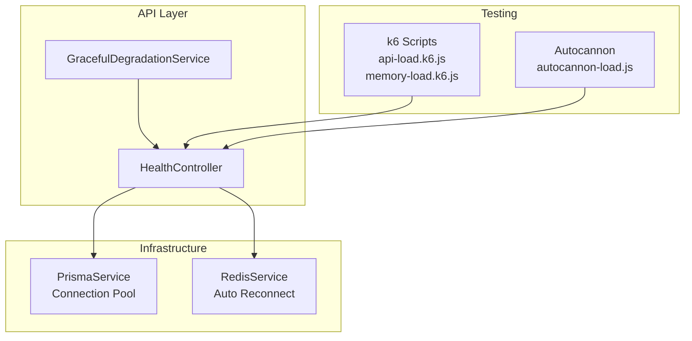
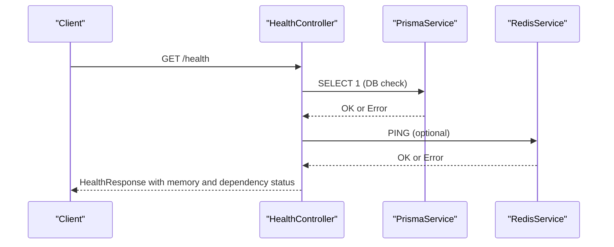
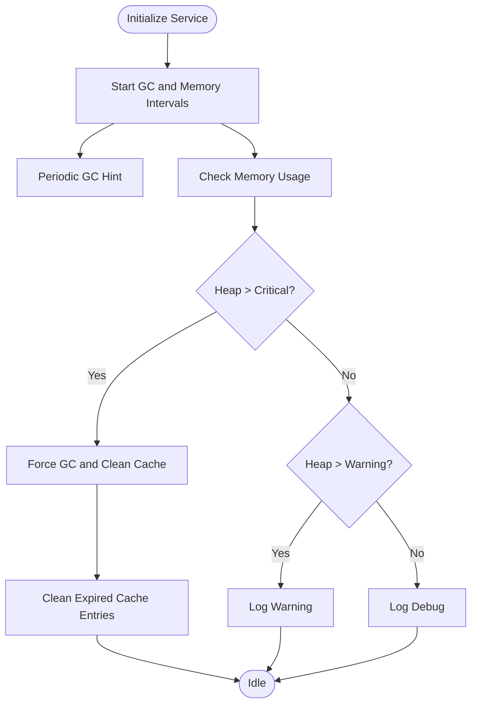
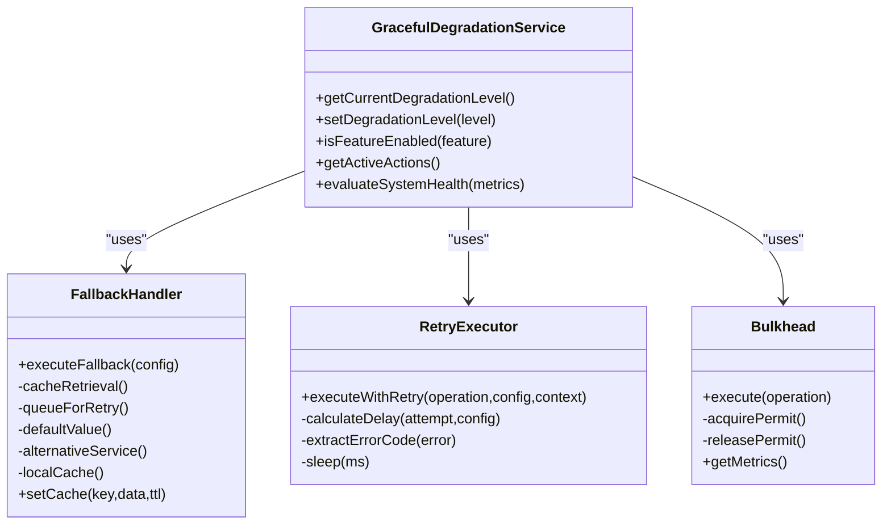
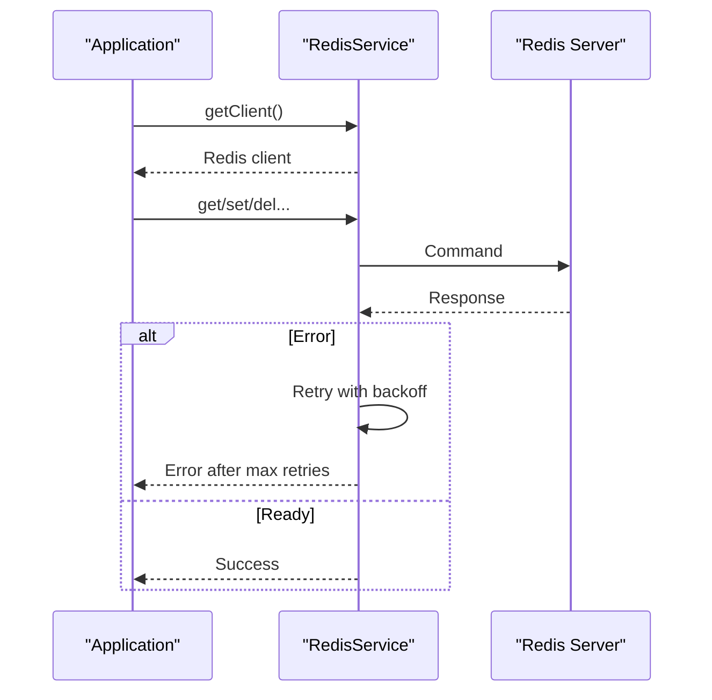
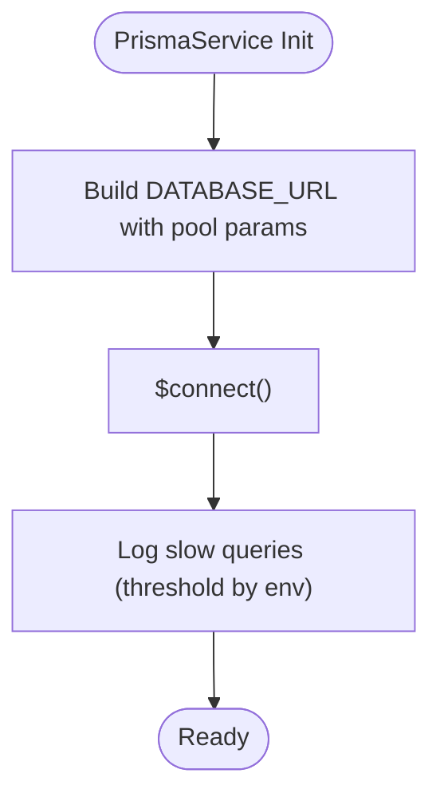
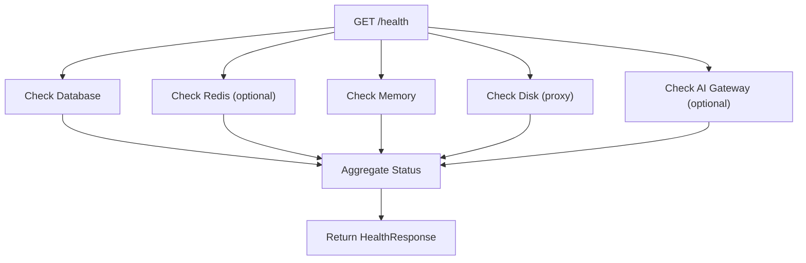
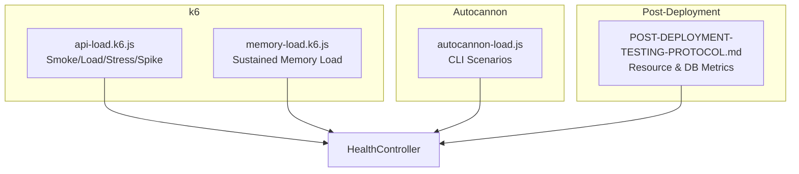
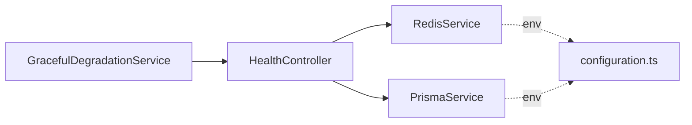

# Performance & Optimization

<cite>
**Referenced Files in This Document**
- [memory-optimization.service.ts](file://apps/api/src/common/services/memory-optimization.service.ts)
- [memory-optimization.service.spec.ts](file://apps/api/src/common/services/memory-optimization.service.spec.ts)
- [graceful-degradation.config.ts](file://apps/api/src/config/graceful-degradation.config.ts)
- [graceful-degradation.config.spec.ts](file://apps/api/src/config/graceful-degradation.config.spec.ts)
- [redis.service.ts](file://libs/redis/src/redis.service.ts)
- [redis.module.ts](file://libs/redis/src/redis.module.ts)
- [prisma.service.ts](file://libs/database/src/prisma.service.ts)
- [configuration.ts](file://apps/api/src/config/configuration.ts)
- [health.controller.ts](file://apps/api/src/health.controller.ts)
- [api-load.k6.js](file://test/performance/api-load.k6.js)
- [memory-load.k6.js](file://test/performance/memory-load.k6.js)
- [autocannon-load.js](file://test/performance/autocannon-load.js)
- [uptime-monitoring.config.ts](file://apps/api/src/config/uptime-monitoring.config.ts)
- [appinsights.config.spec.ts](file://apps/api/src/config/appinsights.config.spec.ts)
- [POST-DEPLOYMENT-TESTING-PROTOCOL.md](file://docs/testing/POST-DEPLOYMENT-TESTING-PROTOCOL.md)
</cite>

## Table of Contents
1. [Introduction](#introduction)
2. [Project Structure](#project-structure)
3. [Core Components](#core-components)
4. [Architecture Overview](#architecture-overview)
5. [Detailed Component Analysis](#detailed-component-analysis)
6. [Dependency Analysis](#dependency-analysis)
7. [Performance Considerations](#performance-considerations)
8. [Troubleshooting Guide](#troubleshooting-guide)
9. [Conclusion](#conclusion)
10. [Appendices](#appendices)

## Introduction
This document provides comprehensive performance optimization and configuration guidance for Quiz-to-Build. It focuses on memory optimization strategies, caching configurations, resource management, graceful degradation, load balancing, horizontal scaling, monitoring, bottleneck identification, database connection pooling, Redis optimization, API response time improvements, and benchmarking/testing frameworks. The goal is to help operators and developers operate the system reliably under load, scale horizontally, and maintain predictable performance.

## Project Structure
The performance-critical parts of the system are organized around:
- Memory optimization utilities for long-running processes
- Graceful degradation and resilience patterns (circuit breakers, retries, bulkheads, rate limiting)
- Redis service with robust reconnection and monitoring
- Database connection pooling via Prisma
- Health endpoints for monitoring and Kubernetes probes
- Performance testing harnesses (k6, Autocannon)

**Diagram sources**
- [health.controller.ts:52-234](file://apps/api/src/health.controller.ts#L52-L234)
- [graceful-degradation.config.ts:814-892](file://apps/api/src/config/graceful-degradation.config.ts#L814-L892)
- [prisma.service.ts:20-81](file://libs/database/src/prisma.service.ts#L20-L81)
- [redis.service.ts:13-84](file://libs/redis/src/redis.service.ts#L13-L84)
- [api-load.k6.js:1-303](file://test/performance/api-load.k6.js#L1-L303)
- [memory-load.k6.js:1-174](file://test/performance/memory-load.k6.js#L1-L174)
- [autocannon-load.js:100-270](file://test/performance/autocannon-load.js#L100-L270)

**Section sources**
- [health.controller.ts:52-234](file://apps/api/src/health.controller.ts#L52-L234)
- [graceful-degradation.config.ts:814-892](file://apps/api/src/config/graceful-degradation.config.ts#L814-L892)
- [prisma.service.ts:20-81](file://libs/database/src/prisma.service.ts#L20-L81)
- [redis.service.ts:13-84](file://libs/redis/src/redis.service.ts#L13-L84)
- [api-load.k6.js:1-303](file://test/performance/api-load.k6.js#L1-L303)
- [memory-load.k6.js:1-174](file://test/performance/memory-load.k6.js#L1-L174)
- [autocannon-load.js:100-270](file://test/performance/autocannon-load.js#L100-L270)

## Core Components
- Memory Optimization Service: Periodic GC hints, memory monitoring, TTL-based request cache with WeakRefs, and cache cleanup.
- Graceful Degradation: Circuit breakers, fallbacks, retry with exponential backoff and jitter, bulkheads, rate limiting, and dynamic degradation levels.
- Redis Service: Automatic retry with exponential backoff, connection lifecycle logging, and ready-state tracking.
- Database Connection Pooling: Configurable pool size and timeouts appended to the database URL.
- Health Controller: Comprehensive health checks including memory, database, Redis, AI gateway, and Kubernetes probes.
- Performance Testing: k6 load and memory tests, Autocannon scenarios, and post-deployment testing protocols.

**Section sources**
- [memory-optimization.service.ts:13-211](file://apps/api/src/common/services/memory-optimization.service.ts#L13-L211)
- [graceful-degradation.config.ts:16-892](file://apps/api/src/config/graceful-degradation.config.ts#L16-L892)
- [redis.service.ts:13-130](file://libs/redis/src/redis.service.ts#L13-L130)
- [prisma.service.ts:8-81](file://libs/database/src/prisma.service.ts#L8-L81)
- [health.controller.ts:11-409](file://apps/api/src/health.controller.ts#L11-L409)
- [api-load.k6.js:1-303](file://test/performance/api-load.k6.js#L1-L303)
- [memory-load.k6.js:1-174](file://test/performance/memory-load.k6.js#L1-L174)
- [autocannon-load.js:100-270](file://test/performance/autocannon-load.js#L100-L270)

## Architecture Overview
The system implements layered resilience and observability:
- Health endpoints expose memory and dependency status for monitoring and orchestration.
- Graceful degradation dynamically adjusts behavior based on system health signals.
- Redis and database operations are protected by circuit breakers and bulkheads.
- Performance tests validate response times, error rates, and memory stability.

**Diagram sources**
- [health.controller.ts:75-141](file://apps/api/src/health.controller.ts#L75-L141)
- [prisma.service.ts:240-279](file://libs/database/src/prisma.service.ts#L240-L279)
- [redis.service.ts:90-104](file://libs/redis/src/redis.service.ts#L90-L104)

## Detailed Component Analysis

### Memory Optimization Service
- Periodic GC hints: Triggers V8 garbage collection when exposed via runtime flag.
- Memory monitoring: Logs heap and RSS usage; escalates to GC at critical thresholds.
- Request cache: TTL-based cache using WeakRefs to avoid memory retention; automatic cleanup of expired entries.
- Batch cleanup: Clears caches and triggers GC after large operations.

**Diagram sources**
- [memory-optimization.service.ts:41-107](file://apps/api/src/common/services/memory-optimization.service.ts#L41-L107)

**Section sources**
- [memory-optimization.service.ts:13-211](file://apps/api/src/common/services/memory-optimization.service.ts#L13-L211)
- [memory-optimization.service.spec.ts:1-157](file://apps/api/src/common/services/memory-optimization.service.spec.ts#L1-L157)

### Graceful Degradation
- Circuit Breakers: Configurable failure/slow-call thresholds, timeouts, and fallbacks (cache, queue, default value, alternative endpoint, local cache).
- Retry: Exponential backoff with jitter; supports retryable/non-retryable error sets.
- Bulkheads: Concurrency limits, queue depth, and wait timeouts with metrics.
- Rate Limiting: Per-user, global, login, email, and file upload limits.
- Degradation Levels: Normal, Degraded, Severely Degraded, Emergency with feature disable lists and actions.

**Diagram sources**
- [graceful-degradation.config.ts:814-892](file://apps/api/src/config/graceful-degradation.config.ts#L814-L892)
- [graceful-degradation.config.ts:240-326](file://apps/api/src/config/graceful-degradation.config.ts#L240-L326)
- [graceful-degradation.config.ts:441-532](file://apps/api/src/config/graceful-degradation.config.ts#L441-L532)
- [graceful-degradation.config.ts:595-679](file://apps/api/src/config/graceful-degradation.config.ts#L595-L679)

**Section sources**
- [graceful-degradation.config.ts:16-892](file://apps/api/src/config/graceful-degradation.config.ts#L16-L892)
- [graceful-degradation.config.spec.ts:1-44](file://apps/api/src/config/graceful-degradation.config.spec.ts#L1-L44)

### Redis Optimization
- Auto-reconnect with exponential backoff and max retries per request.
- Connection lifecycle logging for diagnostics.
- Ready-state tracking to gate operations.
- Environment-driven TLS and credentials.

**Diagram sources**
- [redis.service.ts:13-84](file://libs/redis/src/redis.service.ts#L13-L84)

**Section sources**
- [redis.service.ts:13-130](file://libs/redis/src/redis.service.ts#L13-L130)
- [redis.module.ts:1-9](file://libs/redis/src/redis.module.ts#L1-L9)

### Database Connection Pooling
- Configurable pool size (min 10, max 50, default 20) and pool timeout (default 10s).
- Pool parameters appended to DATABASE_URL if not present.
- Slow query logging tuned by environment.

**Diagram sources**
- [prisma.service.ts:46-81](file://libs/database/src/prisma.service.ts#L46-L81)

**Section sources**
- [prisma.service.ts:8-81](file://libs/database/src/prisma.service.ts#L8-L81)
- [configuration.ts:45-60](file://apps/api/src/config/configuration.ts#L45-L60)

### Health Monitoring and Kubernetes Probes
- Full health endpoint aggregates database, Redis, memory, disk, and AI gateway status.
- Kubernetes liveness/readiness/startup probes for container orchestration.
- Memory thresholds for degraded/unhealthy states.

**Diagram sources**
- [health.controller.ts:75-141](file://apps/api/src/health.controller.ts#L75-L141)

**Section sources**
- [health.controller.ts:11-409](file://apps/api/src/health.controller.ts#L11-L409)

### Performance Testing Frameworks
- k6 scripts:
  - api-load.k6.js: Smoke/load/stress/spike scenarios with thresholds for response time and error rate.
  - memory-load.k6.js: Sustained load with memory usage thresholds.
- Autocannon:
  - Automated CLI scenarios with configurable connections, pipelining, and duration.
- Post-deployment testing protocol:
  - Resource utilization thresholds and database performance metrics.

**Diagram sources**
- [api-load.k6.js:1-303](file://test/performance/api-load.k6.js#L1-L303)
- [memory-load.k6.js:1-174](file://test/performance/memory-load.k6.js#L1-L174)
- [autocannon-load.js:100-270](file://test/performance/autocannon-load.js#L100-L270)
- [POST-DEPLOYMENT-TESTING-PROTOCOL.md:297-347](file://docs/testing/POST-DEPLOYMENT-TESTING-PROTOCOL.md#L297-L347)

**Section sources**
- [api-load.k6.js:1-303](file://test/performance/api-load.k6.js#L1-L303)
- [memory-load.k6.js:1-174](file://test/performance/memory-load.k6.js#L1-L174)
- [autocannon-load.js:100-270](file://test/performance/autocannon-load.js#L100-L270)
- [POST-DEPLOYMENT-TESTING-PROTOCOL.md:297-347](file://docs/testing/POST-DEPLOYMENT-TESTING-PROTOCOL.md#L297-L347)

## Dependency Analysis
- HealthController depends on PrismaService and RedisService for health checks.
- GracefulDegradationService coordinates fallbacks, retries, bulkheads, and degradation levels.
- RedisService and PrismaService are configured via environment variables and injected globally.

**Diagram sources**
- [health.controller.ts:56-62](file://apps/api/src/health.controller.ts#L56-L62)
- [graceful-degradation.config.ts:814-892](file://apps/api/src/config/graceful-degradation.config.ts#L814-L892)
- [configuration.ts:45-60](file://apps/api/src/config/configuration.ts#L45-L60)

**Section sources**
- [health.controller.ts:56-62](file://apps/api/src/health.controller.ts#L56-L62)
- [graceful-degradation.config.ts:814-892](file://apps/api/src/config/graceful-degradation.config.ts#L814-L892)
- [configuration.ts:45-60](file://apps/api/src/config/configuration.ts#L45-L60)

## Performance Considerations
- Memory optimization
  - Use WeakRefs in caches to avoid retention; set TTLs appropriate to workload.
  - Trigger GC hints periodically and upon detecting critical memory usage.
  - Clear caches after large batch operations to reclaim memory.
- Caching
  - Prefer short TTLs for volatile data; use stale-while-revalidate for critical reads.
  - Monitor cache hit rate and eviction; tune TTLs and capacity.
- Database
  - Tune connection pool size and timeouts based on concurrency and latency.
  - Use slow query logging to identify bottlenecks; optimize queries and indexes.
- Redis
  - Enable TLS and strong credentials; monitor reconnection events and latency.
  - Use appropriate key namespaces and TTLs; avoid large payloads.
- API response times
  - Apply circuit breakers and bulkheads to protect downstream services.
  - Use retries with exponential backoff and jitter to smooth transient failures.
  - Implement rate limiting to prevent overload.
- Horizontal scaling
  - Stateless API pods behind a load balancer; ensure sticky sessions are not required.
  - Scale Redis and database independently; monitor pool saturation and replication lag.
- Observability
  - Track response times, error rates, and memory usage; alert on thresholds.
  - Use health endpoints for readiness/liveness probes; surface memory and dependency status.

[No sources needed since this section provides general guidance]

## Troubleshooting Guide
- Health endpoint failures
  - Inspect database connectivity and response times; check for slow queries.
  - Verify Redis availability and ping latency; confirm auto-reconnect logs.
  - Review memory usage and thresholds; trigger GC and cache cleanup if needed.
- Graceful degradation activation
  - Confirm degradation level evaluation based on error rate, response time, CPU/memory, and open circuit breakers.
  - Review fallback actions and disabled features; adjust thresholds accordingly.
- Performance test failures
  - Analyze k6 thresholds for response time and error rate; inspect memory usage.
  - Validate Autocannon scenarios and thresholds; correlate with health metrics.
- Post-deployment checks
  - Monitor resource utilization and database performance; investigate slow queries and connection pool exhaustion.

**Section sources**
- [health.controller.ts:75-141](file://apps/api/src/health.controller.ts#L75-L141)
- [graceful-degradation.config.ts:850-892](file://apps/api/src/config/graceful-degradation.config.ts#L850-L892)
- [api-load.k6.js:85-96](file://test/performance/api-load.k6.js#L85-L96)
- [memory-load.k6.js:33-38](file://test/performance/memory-load.k6.js#L33-L38)
- [POST-DEPLOYMENT-TESTING-PROTOCOL.md:297-347](file://docs/testing/POST-DEPLOYMENT-TESTING-PROTOCOL.md#L297-L347)

## Conclusion
Quiz-to-Build incorporates robust performance and resilience patterns: memory optimization with periodic GC and TTL-based caching, comprehensive graceful degradation with circuit breakers and retries, optimized Redis connectivity, configurable database pooling, and thorough health monitoring. The k6 and Autocannon test suites provide validated baselines for response times, error rates, and memory stability. Operators should continuously monitor health metrics, tune thresholds, and scale resources to maintain predictable performance under varying loads.

[No sources needed since this section summarizes without analyzing specific files]

## Appendices

### Configuration Reference
- Environment variables
  - DATABASE_URL: Database connection string; pool parameters appended automatically.
  - REDIS_HOST, REDIS_PORT, REDIS_PASSWORD: Redis connection settings.
  - JWT_SECRET, JWT_REFRESH_SECRET, JWT_EXPIRES_IN, JWT_REFRESH_EXPIRES_IN: Authentication secrets and expiry.
  - CORS_ORIGIN: Explicit allowlist for production.
  - THROTTLE_TTL, THROTTLE_LIMIT, THROTTLE_LOGIN_LIMIT: Rate limiting configuration.
  - LOG_LEVEL: Logging verbosity.
  - FRONTEND_URL: Frontend origin for redirects.
  - APPLICATIONINSIGHTS_CONNECTION_STRING: Optional for telemetry.

**Section sources**
- [configuration.ts:5-114](file://apps/api/src/config/configuration.ts#L5-L114)

### Monitoring and Alerting
- Uptime metrics: Hourly, daily, weekly, monthly.
- Response time metrics: Average, p50, p95, p99, max.
- Availability metrics: Success/failure rates, MTBF/MTTR.
- Application Insights: Predefined performance metrics and availability tracking.

**Section sources**
- [uptime-monitoring.config.ts:286-311](file://apps/api/src/config/uptime-monitoring.config.ts#L286-L311)
- [appinsights.config.spec.ts:577-616](file://apps/api/src/config/appinsights.config.spec.ts#L577-L616)