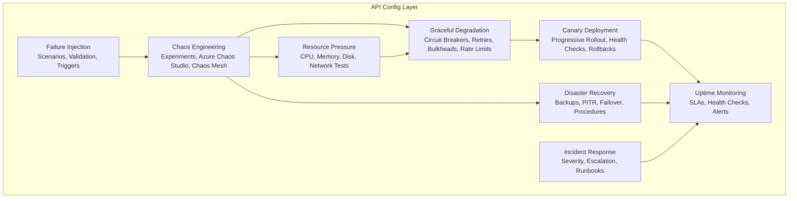
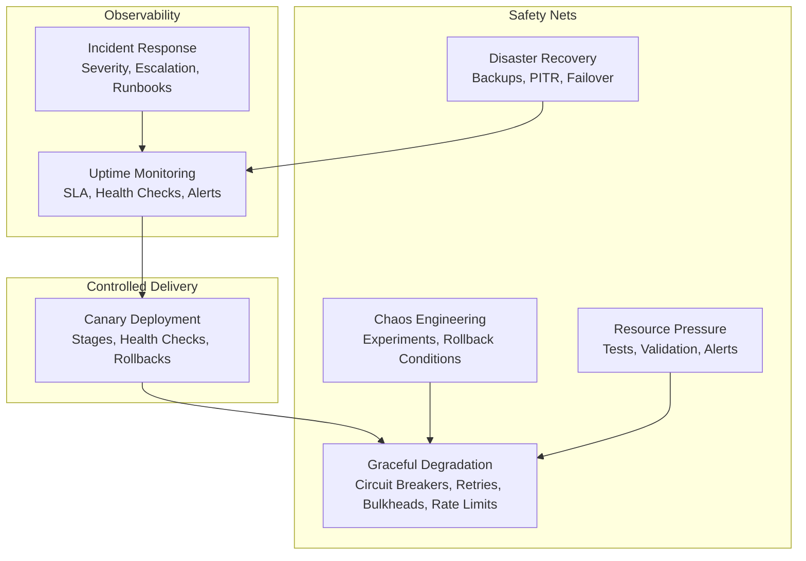
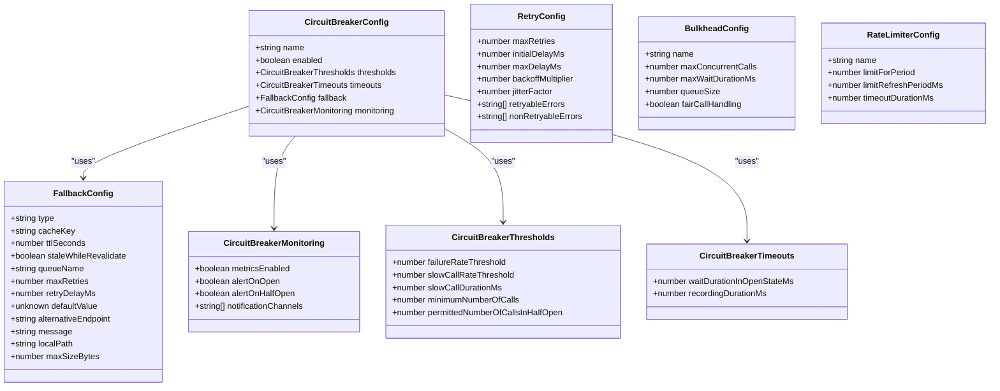
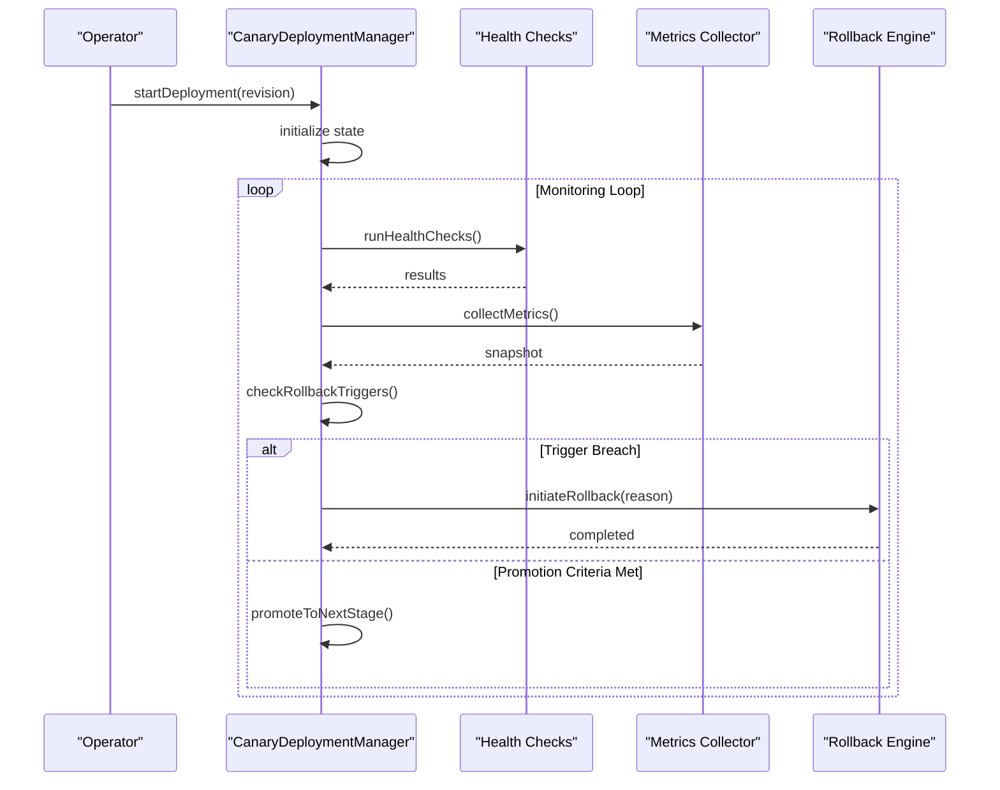
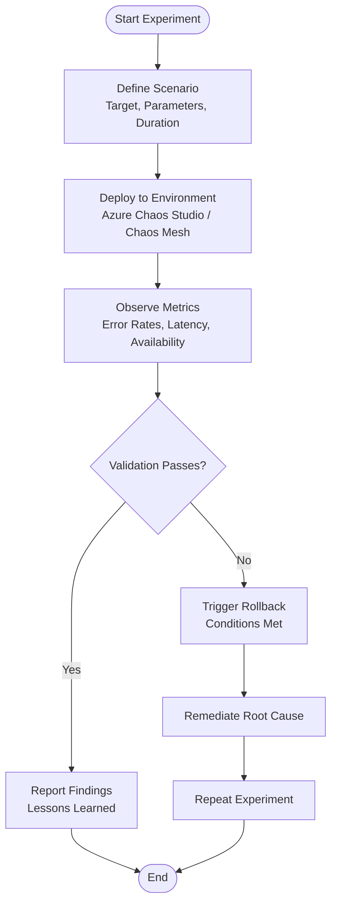
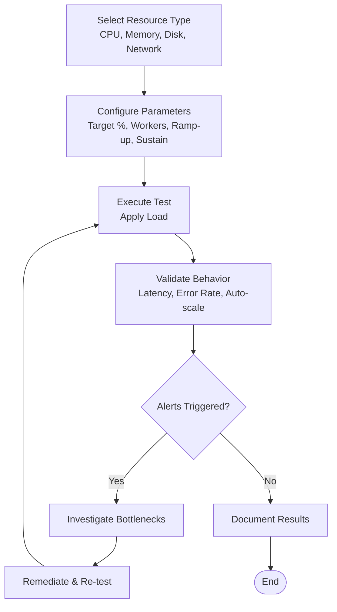
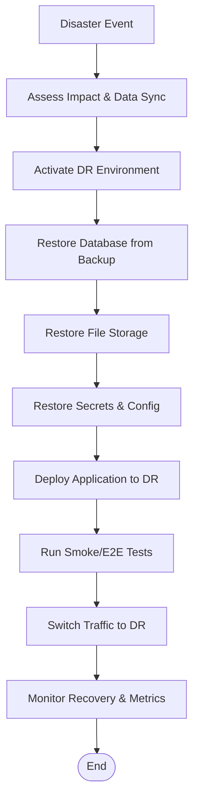
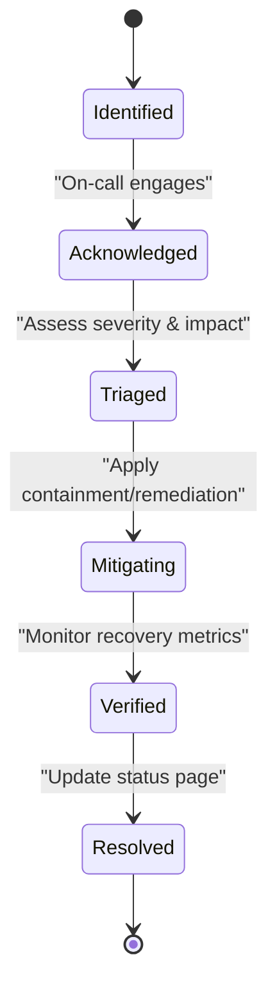
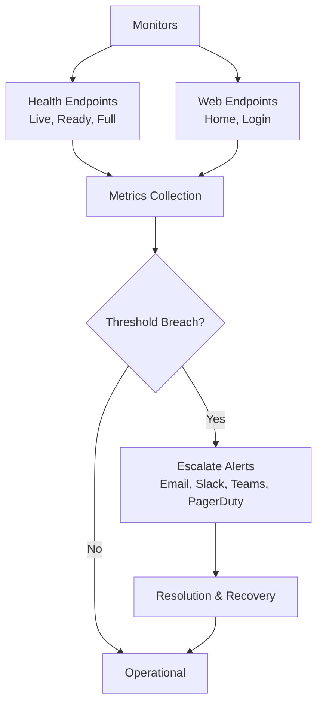
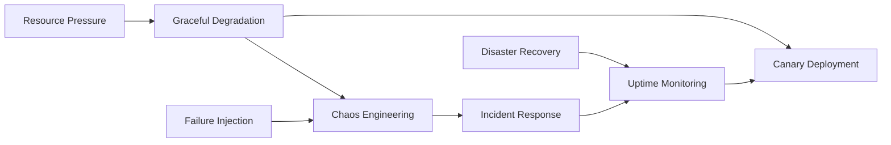

# Resilience & Reliability

<cite>
**Referenced Files in This Document**
- [graceful-degradation.config.ts](file://apps/api/src/config/graceful-degradation.config.ts)
- [canary-deployment.config.ts](file://apps/api/src/config/canary-deployment.config.ts)
- [chaos-engineering.config.ts](file://apps/api/src/config/chaos-engineering.config.ts)
- [failure-injection.config.ts](file://apps/api/src/config/failure-injection.config.ts)
- [resource-pressure.config.ts](file://apps/api/src/config/resource-pressure.config.ts)
- [disaster-recovery.config.ts](file://apps/api/src/config/disaster-recovery.config.ts)
- [incident-response.config.ts](file://apps/api/src/config/incident-response.config.ts)
- [uptime-monitoring.config.ts](file://apps/api/src/config/uptime-monitoring.config.ts)
</cite>

## Table of Contents
1. [Introduction](#introduction)
2. [Project Structure](#project-structure)
3. [Core Components](#core-components)
4. [Architecture Overview](#architecture-overview)
5. [Detailed Component Analysis](#detailed-component-analysis)
6. [Dependency Analysis](#dependency-analysis)
7. [Performance Considerations](#performance-considerations)
8. [Troubleshooting Guide](#troubleshooting-guide)
9. [Conclusion](#conclusion)
10. [Appendices](#appendices)

## Introduction
This document provides comprehensive resilience and reliability configuration guidance for Quiz-to-Build. It covers graceful degradation strategies, canary deployment configurations, chaos engineering experiments, failure injection testing, resource pressure simulation, circuit breaker patterns, fallback mechanisms, rollback procedures, health check configurations, and automatic recovery mechanisms. The goal is to enable safe, observable, and resilient deployments across development, staging, and production environments.

## Project Structure
Resilience and reliability capabilities are centralized in the API application’s configuration module. The relevant files define:
- Graceful degradation (circuit breakers, retries, bulkheads, rate limiting)
- Canary deployment rollout and rollback automation
- Chaos experiments and failure injection scenarios
- Resource pressure tests and validation criteria
- Disaster recovery targets, backups, point-in-time recovery, and failover
- Incident response severity, escalation, and runbooks
- Uptime monitoring, SLAs, and alerting policies

**Diagram sources**
- [graceful-degradation.config.ts:1-910](file://apps/api/src/config/graceful-degradation.config.ts#L1-L910)
- [canary-deployment.config.ts:1-1008](file://apps/api/src/config/canary-deployment.config.ts#L1-L1008)
- [chaos-engineering.config.ts:1-1265](file://apps/api/src/config/chaos-engineering.config.ts#L1-L1265)
- [failure-injection.config.ts:1-1078](file://apps/api/src/config/failure-injection.config.ts#L1-L1078)
- [resource-pressure.config.ts:1-906](file://apps/api/src/config/resource-pressure.config.ts#L1-L906)
- [disaster-recovery.config.ts:1-791](file://apps/api/src/config/disaster-recovery.config.ts#L1-L791)
- [incident-response.config.ts:1-1115](file://apps/api/src/config/incident-response.config.ts#L1-L1115)
- [uptime-monitoring.config.ts:1-379](file://apps/api/src/config/uptime-monitoring.config.ts#L1-L379)

**Section sources**
- [graceful-degradation.config.ts:1-910](file://apps/api/src/config/graceful-degradation.config.ts#L1-L910)
- [canary-deployment.config.ts:1-1008](file://apps/api/src/config/canary-deployment.config.ts#L1-L1008)
- [chaos-engineering.config.ts:1-1265](file://apps/api/src/config/chaos-engineering.config.ts#L1-L1265)
- [failure-injection.config.ts:1-1078](file://apps/api/src/config/failure-injection.config.ts#L1-L1078)
- [resource-pressure.config.ts:1-906](file://apps/api/src/config/resource-pressure.config.ts#L1-L906)
- [disaster-recovery.config.ts:1-791](file://apps/api/src/config/disaster-recovery.config.ts#L1-L791)
- [incident-response.config.ts:1-1115](file://apps/api/src/config/incident-response.config.ts#L1-L1115)
- [uptime-monitoring.config.ts:1-379](file://apps/api/src/config/uptime-monitoring.config.ts#L1-L379)

## Core Components
- Graceful Degradation: Circuit breakers, retry with exponential backoff, bulkhead isolation, and rate limiting.
- Canary Deployment: Linear rollout with health-based promotion and automatic rollback triggers.
- Chaos Engineering: Azure Chaos Studio and Chaos Mesh experiments with rollback conditions.
- Failure Injection: Structured scenarios for databases, external services, network, pods, and resource pressure.
- Resource Pressure: CPU, memory, disk, and network saturation tests with validation and alerts.
- Disaster Recovery: RTO/RPO targets, backup schedules, point-in-time recovery, and failover procedures.
- Incident Response: Severity levels, escalation paths, runbooks, and on-call schedules.
- Uptime Monitoring: SLA targets, health endpoints, alert thresholds, and escalation policies.

**Section sources**
- [graceful-degradation.config.ts:1-910](file://apps/api/src/config/graceful-degradation.config.ts#L1-L910)
- [canary-deployment.config.ts:1-1008](file://apps/api/src/config/canary-deployment.config.ts#L1-L1008)
- [chaos-engineering.config.ts:1-1265](file://apps/api/src/config/chaos-engineering.config.ts#L1-L1265)
- [failure-injection.config.ts:1-1078](file://apps/api/src/config/failure-injection.config.ts#L1-L1078)
- [resource-pressure.config.ts:1-906](file://apps/api/src/config/resource-pressure.config.ts#L1-L906)
- [disaster-recovery.config.ts:1-791](file://apps/api/src/config/disaster-recovery.config.ts#L1-L791)
- [incident-response.config.ts:1-1115](file://apps/api/src/config/incident-response.config.ts#L1-L1115)
- [uptime-monitoring.config.ts:1-379](file://apps/api/src/config/uptime-monitoring.config.ts#L1-L379)

## Architecture Overview
The resilience architecture integrates observability, controlled rollouts, and safety nets across the platform.

**Diagram sources**
- [uptime-monitoring.config.ts:1-379](file://apps/api/src/config/uptime-monitoring.config.ts#L1-L379)
- [incident-response.config.ts:1-1115](file://apps/api/src/config/incident-response.config.ts#L1-L1115)
- [canary-deployment.config.ts:1-1008](file://apps/api/src/config/canary-deployment.config.ts#L1-L1008)
- [graceful-degradation.config.ts:1-910](file://apps/api/src/config/graceful-degradation.config.ts#L1-L910)
- [chaos-engineering.config.ts:1-1265](file://apps/api/src/config/chaos-engineering.config.ts#L1-L1265)
- [resource-pressure.config.ts:1-906](file://apps/api/src/config/resource-pressure.config.ts#L1-L906)
- [disaster-recovery.config.ts:1-791](file://apps/api/src/config/disaster-recovery.config.ts#L1-L791)

## Detailed Component Analysis

### Graceful Degradation Patterns
Graceful degradation ensures the system remains functional under stress by applying circuit breakers, retries, bulkheads, and rate limiting.

**Diagram sources**
- [graceful-degradation.config.ts:20-47](file://apps/api/src/config/graceful-degradation.config.ts#L20-L47)
- [graceful-degradation.config.ts:217-230](file://apps/api/src/config/graceful-degradation.config.ts#L217-L230)
- [graceful-degradation.config.ts:332-340](file://apps/api/src/config/graceful-degradation.config.ts#L332-L340)
- [graceful-degradation.config.ts:538-544](file://apps/api/src/config/graceful-degradation.config.ts#L538-L544)
- [graceful-degradation.config.ts:685-690](file://apps/api/src/config/graceful-degradation.config.ts#L685-L690)

Key capabilities:
- Circuit breaker thresholds and timeouts tailored per service (database, payment, email, storage, OAuth).
- Fallback strategies: cache retrieval, queue for retry, default values, alternative endpoints, local cache.
- Retry with exponential backoff and jitter, with configurable error categories.
- Bulkhead isolation with queueing and wait timeouts.
- Per-service rate limiting for user, global, login, email, and file upload contexts.

**Section sources**
- [graceful-degradation.config.ts:66-211](file://apps/api/src/config/graceful-degradation.config.ts#L66-L211)
- [graceful-degradation.config.ts:240-326](file://apps/api/src/config/graceful-degradation.config.ts#L240-L326)
- [graceful-degradation.config.ts:351-439](file://apps/api/src/config/graceful-degradation.config.ts#L351-L439)
- [graceful-degradation.config.ts:555-593](file://apps/api/src/config/graceful-degradation.config.ts#L555-L593)
- [graceful-degradation.config.ts:692-734](file://apps/api/src/config/graceful-degradation.config.ts#L692-L734)

### Canary Deployment Configuration
Canary deployment automates progressive rollout with health checks and rollback triggers.

**Diagram sources**
- [canary-deployment.config.ts:521-796](file://apps/api/src/config/canary-deployment.config.ts#L521-L796)

Configuration highlights:
- Stages: 5% → 25% → 50% → 100% with strict thresholds for error rate, latency, and resource usage.
- Health checks: live, ready, and full health endpoints with timeouts and expected statuses.
- Rollback triggers: error rate, latency percentiles, restart rate, memory/CPU usage.
- Automatic promotion and manual approval gates.
- Notifications via Teams, Slack, email, and PagerDuty.

**Section sources**
- [canary-deployment.config.ts:144-232](file://apps/api/src/config/canary-deployment.config.ts#L144-L232)
- [canary-deployment.config.ts:237-265](file://apps/api/src/config/canary-deployment.config.ts#L237-L265)
- [canary-deployment.config.ts:270-335](file://apps/api/src/config/canary-deployment.config.ts#L270-L335)
- [canary-deployment.config.ts:356-424](file://apps/api/src/config/canary-deployment.config.ts#L356-L424)
- [canary-deployment.config.ts:429-472](file://apps/api/src/config/canary-deployment.config.ts#L429-L472)
- [canary-deployment.config.ts:521-796](file://apps/api/src/config/canary-deployment.config.ts#L521-L796)

### Chaos Engineering Experiments
Chaos experiments validate resilience under realistic failure modes.

**Diagram sources**
- [chaos-engineering.config.ts:286-642](file://apps/api/src/config/chaos-engineering.config.ts#L286-L642)
- [failure-injection.config.ts:89-222](file://apps/api/src/config/failure-injection.config.ts#L89-L222)

Examples include:
- Database connection timeouts, pool exhaustion, and slow queries.
- External API timeouts and HTTP error injection.
- Network latency, partitions, DNS failures.
- Pod kills, CPU/memory/disk pressure, and OOM scenarios.
- Rollback conditions and monitoring channels.

**Section sources**
- [chaos-engineering.config.ts:286-642](file://apps/api/src/config/chaos-engineering.config.ts#L286-L642)
- [failure-injection.config.ts:89-222](file://apps/api/src/config/failure-injection.config.ts#L89-L222)
- [failure-injection.config.ts:228-368](file://apps/api/src/config/failure-injection.config.ts#L228-L368)
- [failure-injection.config.ts:374-537](file://apps/api/src/config/failure-injection.config.ts#L374-L537)
- [failure-injection.config.ts:543-671](file://apps/api/src/config/failure-injection.config.ts#L543-L671)
- [failure-injection.config.ts:677-842](file://apps/api/src/config/failure-injection.config.ts#L677-L842)

### Resource Pressure Simulation
Resource pressure tests define scenarios and validation criteria for CPU, memory, disk, and network saturation.

**Diagram sources**
- [resource-pressure.config.ts:78-254](file://apps/api/src/config/resource-pressure.config.ts#L78-L254)
- [resource-pressure.config.ts:260-445](file://apps/api/src/config/resource-pressure.config.ts#L260-L445)
- [resource-pressure.config.ts:451-621](file://apps/api/src/config/resource-pressure.config.ts#L451-L621)
- [resource-pressure.config.ts:627-790](file://apps/api/src/config/resource-pressure.config.ts#L627-L790)

Validation includes:
- CPU: moderate/high/critical pressure with HPA and throttling behavior.
- Memory: 80%/90% pressure with GC behavior and OOM protection.
- Disk: 85%/95% fill and I/O saturation with cleanup and emergency modes.
- Network: bandwidth saturation and connection exhaustion with traffic shaping.

**Section sources**
- [resource-pressure.config.ts:78-254](file://apps/api/src/config/resource-pressure.config.ts#L78-L254)
- [resource-pressure.config.ts:260-445](file://apps/api/src/config/resource-pressure.config.ts#L260-L445)
- [resource-pressure.config.ts:451-621](file://apps/api/src/config/resource-pressure.config.ts#L451-L621)
- [resource-pressure.config.ts:627-790](file://apps/api/src/config/resource-pressure.config.ts#L627-L790)

### Disaster Recovery Targets and Procedures
Disaster recovery defines RTO/RPO targets, backup schedules, point-in-time recovery, and failover procedures.

**Diagram sources**
- [disaster-recovery.config.ts:455-689](file://apps/api/src/config/disaster-recovery.config.ts#L455-L689)

Targets and procedures:
- RTO/RPO targets and availability goals.
- Backup types: full, incremental, differential, transaction log, snapshot, continuous replication.
- Point-in-time recovery with retention and geo-redundancy.
- Failover configuration: active-passive, DNS failover, database and storage failover.
- DR runbooks: region failover, database PITR, full system restore.

**Section sources**
- [disaster-recovery.config.ts:40-47](file://apps/api/src/config/disaster-recovery.config.ts#L40-L47)
- [disaster-recovery.config.ts:113-309](file://apps/api/src/config/disaster-recovery.config.ts#L113-L309)
- [disaster-recovery.config.ts:323-331](file://apps/api/src/config/disaster-recovery.config.ts#L323-L331)
- [disaster-recovery.config.ts:386-424](file://apps/api/src/config/disaster-recovery.config.ts#L386-L424)
- [disaster-recovery.config.ts:455-689](file://apps/api/src/config/disaster-recovery.config.ts#L455-L689)

### Incident Response and Severity
Incident response defines severity levels, escalation paths, and runbooks for rapid recovery.

**Diagram sources**
- [incident-response.config.ts:340-753](file://apps/api/src/config/incident-response.config.ts#L340-L753)

Severity levels:
- SEV1–SEV4 with response targets, escalation delays, and on-call requirements.
Escalation paths:
- Multi-level escalation with channels: PagerDuty, phone, Slack, Teams, email.
Runbooks:
- Production outage, high error rate, security incident, database performance/availability.

**Section sources**
- [incident-response.config.ts:136-238](file://apps/api/src/config/incident-response.config.ts#L136-L238)
- [incident-response.config.ts:247-331](file://apps/api/src/config/incident-response.config.ts#L247-L331)
- [incident-response.config.ts:340-753](file://apps/api/src/config/incident-response.config.ts#L340-L753)

### Uptime Monitoring and SLAs
Uptime monitoring defines SLA targets, health endpoints, and alerting policies.

**Diagram sources**
- [uptime-monitoring.config.ts:12-31](file://apps/api/src/config/uptime-monitoring.config.ts#L12-L31)
- [uptime-monitoring.config.ts:36-94](file://apps/api/src/config/uptime-monitoring.config.ts#L36-L94)
- [uptime-monitoring.config.ts:100-149](file://apps/api/src/config/uptime-monitoring.config.ts#L100-L149)
- [uptime-monitoring.config.ts:155-210](file://apps/api/src/config/uptime-monitoring.config.ts#L155-L210)
- [uptime-monitoring.config.ts:216-268](file://apps/api/src/config/uptime-monitoring.config.ts#L216-L268)

SLA and health endpoints:
- SLA target of 99.9% with response time targets.
- Health endpoints for liveness, readiness, and full system checks.
- Alert thresholds and escalation levels with recovery notifications.

**Section sources**
- [uptime-monitoring.config.ts:12-31](file://apps/api/src/config/uptime-monitoring.config.ts#L12-L31)
- [uptime-monitoring.config.ts:36-94](file://apps/api/src/config/uptime-monitoring.config.ts#L36-L94)
- [uptime-monitoring.config.ts:155-210](file://apps/api/src/config/uptime-monitoring.config.ts#L155-L210)
- [uptime-monitoring.config.ts:216-268](file://apps/api/src/config/uptime-monitoring.config.ts#L216-L268)

## Dependency Analysis
Resilience components depend on each other and on external systems:
- Canary deployment depends on uptime monitoring for health signals and incident response for rollback escalation.
- Graceful degradation supports canary rollout by preventing cascading failures.
- Chaos engineering validates graceful degradation and resource pressure configurations.
- Disaster recovery complements uptime monitoring and incident response for long-term continuity.
- Failure injection scenarios feed into chaos experiments and inform graceful degradation tuning.

**Diagram sources**
- [uptime-monitoring.config.ts:1-379](file://apps/api/src/config/uptime-monitoring.config.ts#L1-L379)
- [incident-response.config.ts:1-1115](file://apps/api/src/config/incident-response.config.ts#L1-L1115)
- [canary-deployment.config.ts:1-1008](file://apps/api/src/config/canary-deployment.config.ts#L1-L1008)
- [graceful-degradation.config.ts:1-910](file://apps/api/src/config/graceful-degradation.config.ts#L1-L910)
- [chaos-engineering.config.ts:1-1265](file://apps/api/src/config/chaos-engineering.config.ts#L1-L1265)
- [failure-injection.config.ts:1-1078](file://apps/api/src/config/failure-injection.config.ts#L1-L1078)
- [resource-pressure.config.ts:1-906](file://apps/api/src/config/resource-pressure.config.ts#L1-L906)
- [disaster-recovery.config.ts:1-791](file://apps/api/src/config/disaster-recovery.config.ts#L1-L791)

**Section sources**
- [uptime-monitoring.config.ts:1-379](file://apps/api/src/config/uptime-monitoring.config.ts#L1-L379)
- [incident-response.config.ts:1-1115](file://apps/api/src/config/incident-response.config.ts#L1-L1115)
- [canary-deployment.config.ts:1-1008](file://apps/api/src/config/canary-deployment.config.ts#L1-L1008)
- [graceful-degradation.config.ts:1-910](file://apps/api/src/config/graceful-degradation.config.ts#L1-L910)
- [chaos-engineering.config.ts:1-1265](file://apps/api/src/config/chaos-engineering.config.ts#L1-L1265)
- [failure-injection.config.ts:1-1078](file://apps/api/src/config/failure-injection.config.ts#L1-L1078)
- [resource-pressure.config.ts:1-906](file://apps/api/src/config/resource-pressure.config.ts#L1-L906)
- [disaster-recovery.config.ts:1-791](file://apps/api/src/config/disaster-recovery.config.ts#L1-L791)

## Performance Considerations
- Use exponential backoff with jitter for retries to avoid thundering herds.
- Tune circuit breaker thresholds per service to balance safety and responsiveness.
- Apply bulkheads to isolate high-risk operations and prevent queue overflow.
- Set rate limits to protect downstream systems and maintain SLA targets.
- Validate resource pressure scenarios to inform autoscaling and capacity planning.
- Automate canary promotions with strict health and latency thresholds.

[No sources needed since this section provides general guidance]

## Troubleshooting Guide
Common issues and resolutions:
- Circuit breaker keeps opening: review thresholds, fallback effectiveness, and upstream stability.
- Canary rollout stalls: inspect health check failures, rollback triggers, and manual approval gates.
- Chaos experiment causes prolonged degradation: confirm rollback conditions and experiment scope.
- Resource pressure tests reveal bottlenecks: adjust autoscaling, optimize queries, or increase capacity.
- Disaster recovery drills expose gaps: update runbooks, test restore procedures, and validate RTO/RPO.

**Section sources**
- [graceful-degradation.config.ts:655-712](file://apps/api/src/config/graceful-degradation.config.ts#L655-L712)
- [canary-deployment.config.ts:559-595](file://apps/api/src/config/canary-deployment.config.ts#L559-L595)
- [chaos-engineering.config.ts:307-314](file://apps/api/src/config/chaos-engineering.config.ts#L307-L314)
- [resource-pressure.config.ts:112-138](file://apps/api/src/config/resource-pressure.config.ts#L112-L138)
- [disaster-recovery.config.ts:456-534](file://apps/api/src/config/disaster-recovery.config.ts#L456-L534)

## Conclusion
Quiz-to-Build’s resilience and reliability framework combines observability, controlled rollouts, safety nets, and disaster recovery to ensure dependable service delivery. By leveraging structured canary deployments, chaos experiments, graceful degradation, and robust incident response, teams can confidently introduce changes while maintaining SLAs and user trust.

[No sources needed since this section summarizes without analyzing specific files]

## Appendices

### Configuration Examples by Deployment Stage
- Development: Enable moderate chaos experiments, light canary stages, and basic fallbacks.
- Staging: Increase canary thresholds, add resource pressure tests, and validate DR procedures.
- Production: Enforce strict canary health checks, comprehensive rollback triggers, and full DR runbooks.

[No sources needed since this section provides general guidance]

### Performance Testing Setup
- Use k6 or Autocannon for load tests aligned with resource pressure scenarios.
- Instrument latency percentiles and error rates to validate SLA targets.
- Correlate test results with chaos experiment outcomes to refine resilience controls.

[No sources needed since this section provides general guidance]

### Fault Tolerance Strategies
- Circuit breakers for external dependencies.
- Retries with exponential backoff for transient failures.
- Bulkheads for high-concurrency operations.
- Rate limiting to protect downstream systems.
- Graceful degradation levels to reduce functionality while preserving core services.

[No sources needed since this section provides general guidance]