# Security Configuration

<cite>
**Referenced Files in This Document**
- [security-config.md](file://security/config/security-config.md)
- [security-policy.md](file://security/policies/security-policy.md)
- [feature-flags.config.ts](file://apps/api/src/config/feature-flags.config.ts)
- [incident-response.config.ts](file://apps/api/src/config/incident-response.config.ts)
- [disaster-recovery.config.ts](file://apps/api/src/config/disaster-recovery.config.ts)
- [csrf.guard.ts](file://apps/api/src/common/guards/csrf.guard.ts)
- [subscription.guard.ts](file://apps/api/src/common/guards/subscription.guard.ts)
- [sentry.config.ts](file://apps/api/src/config/sentry.config.ts)
- [configuration.ts](file://apps/api/src/config/configuration.ts)
- [auth.service.ts](file://apps/api/src/modules/auth/auth.service.ts)
- [alerting-rules.config.ts](file://apps/api/src/config/alerting-rules.config.ts)
- [logger.config.ts](file://apps/api/src/config/logger.config.ts)
- [logging.interceptor.ts](file://apps/api/src/common/interceptors/logging.interceptor.ts)
- [transform.interceptor.ts](file://apps/api/src/common/interceptors/transform.interceptor.ts)
- [canary-deployment.config.ts](file://apps/api/src/config/canary-deployment.config.ts)
- [graceful-degradation.config.ts](file://apps/api/src/config/graceful-degradation.config.ts)
- [security-scan.sh](file://scripts/security-scan.sh)
- [SECURITY.md](file://SECURITY.md)
</cite>

## Table of Contents
1. [Introduction](#introduction)
2. [Project Structure](#project-structure)
3. [Core Components](#core-components)
4. [Architecture Overview](#architecture-overview)
5. [Detailed Component Analysis](#detailed-component-analysis)
6. [Dependency Analysis](#dependency-analysis)
7. [Performance Considerations](#performance-considerations)
8. [Troubleshooting Guide](#troubleshooting-guide)
9. [Conclusion](#conclusion)

## Introduction
This document provides comprehensive security configuration documentation for Quiz-to-Build, covering feature flag security controls, incident response procedures, disaster recovery planning, CSRF protection mechanisms, subscription-based access controls, security middleware configuration, authentication guard implementations, security audit configurations, penetration testing setup, and compliance monitoring. It synthesizes the security-related files and configurations across the API application to deliver practical guidance for maintaining robust security posture.

## Project Structure
Security configurations are organized across multiple layers:
- Centralized security policy and configuration
- Feature flag management with privacy and targeting controls
- Incident response and disaster recovery runbooks
- CSRF and subscription access control guards
- Security instrumentation via Sentry
- Production hardening and environment validation
- Observability and alerting rules
- Graceful degradation and canary deployment resilience patterns
- Security scanning automation

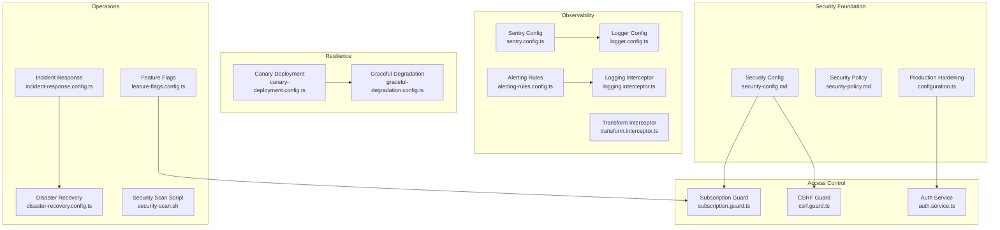

**Diagram sources**
- [security-config.md:1-93](file://security/config/security-config.md#L1-L93)
- [security-policy.md:1-54](file://security/policies/security-policy.md#L1-L54)
- [configuration.ts:1-115](file://apps/api/src/config/configuration.ts#L1-L115)
- [csrf.guard.ts:1-242](file://apps/api/src/common/guards/csrf.guard.ts#L1-L242)
- [subscription.guard.ts:1-289](file://apps/api/src/common/guards/subscription.guard.ts#L1-L289)
- [auth.service.ts:1-507](file://apps/api/src/modules/auth/auth.service.ts#L1-L507)
- [sentry.config.ts:1-228](file://apps/api/src/config/sentry.config.ts#L1-L228)
- [alerting-rules.config.ts:1-772](file://apps/api/src/config/alerting-rules.config.ts#L1-L772)
- [logger.config.ts:1-62](file://apps/api/src/config/logger.config.ts#L1-L62)
- [logging.interceptor.ts:1-56](file://apps/api/src/common/interceptors/logging.interceptor.ts#L1-L56)
- [transform.interceptor.ts:1-32](file://apps/api/src/common/interceptors/transform.interceptor.ts#L1-L32)
- [canary-deployment.config.ts:1-1008](file://apps/api/src/config/canary-deployment.config.ts#L1-L1008)
- [graceful-degradation.config.ts:1-910](file://apps/api/src/config/graceful-degradation.config.ts#L1-L910)
- [incident-response.config.ts:1-1115](file://apps/api/src/config/incident-response.config.ts#L1-L1115)
- [disaster-recovery.config.ts:1-791](file://apps/api/src/config/disaster-recovery.config.ts#L1-L791)
- [feature-flags.config.ts:1-918](file://apps/api/src/config/feature-flags.config.ts#L1-L918)
- [security-scan.sh:1-74](file://scripts/security-scan.sh#L1-L74)

**Section sources**
- [security-config.md:1-93](file://security/config/security-config.md#L1-L93)
- [security-policy.md:1-54](file://security/policies/security-policy.md#L1-L54)
- [configuration.ts:1-115](file://apps/api/src/config/configuration.ts#L1-L115)

## Core Components
This section outlines the primary security components and their configuration:

- **Security Configuration Baseline**: Defines rate limiting, JWT configuration, password policy, CORS, security headers, and audit logging.
- **Feature Flags Security**: LaunchDarkly integration with privacy settings, targeting rules, and environment-specific configurations.
- **Incident Response**: Severity definitions, escalation paths, runbooks, and communication templates.
- **Disaster Recovery**: Targets, backup configurations, point-in-time recovery, failover, and DR procedures.
- **CSRF Protection**: Double submit cookie pattern with constant-time token validation.
- **Subscription Access Control**: Tier-based and feature-based gating with middleware for usage tracking.
- **Security Instrumentation**: Sentry initialization, filtering, and alerting rules.
- **Production Hardening**: Environment validation for secrets and CORS.
- **Observability**: Structured logging, correlation IDs, and standardized response envelopes.
- **Resilience Patterns**: Circuit breakers, fallbacks, retries, bulkheads, and rate limiting.
- **Canary Deployment**: Health checks, rollback triggers, and notification channels.
- **Security Scanning**: Automated Docker image scanning and security checks.

**Section sources**
- [security-config.md:1-93](file://security/config/security-config.md#L1-L93)
- [feature-flags.config.ts:1-918](file://apps/api/src/config/feature-flags.config.ts#L1-L918)
- [incident-response.config.ts:1-1115](file://apps/api/src/config/incident-response.config.ts#L1-L1115)
- [disaster-recovery.config.ts:1-791](file://apps/api/src/config/disaster-recovery.config.ts#L1-L791)
- [csrf.guard.ts:1-242](file://apps/api/src/common/guards/csrf.guard.ts#L1-L242)
- [subscription.guard.ts:1-289](file://apps/api/src/common/guards/subscription.guard.ts#L1-L289)
- [sentry.config.ts:1-228](file://apps/api/src/config/sentry.config.ts#L1-L228)
- [configuration.ts:1-115](file://apps/api/src/config/configuration.ts#L1-L115)
- [logger.config.ts:1-62](file://apps/api/src/config/logger.config.ts#L1-L62)
- [logging.interceptor.ts:1-56](file://apps/api/src/common/interceptors/logging.interceptor.ts#L1-L56)
- [transform.interceptor.ts:1-32](file://apps/api/src/common/interceptors/transform.interceptor.ts#L1-L32)
- [graceful-degradation.config.ts:1-910](file://apps/api/src/config/graceful-degradation.config.ts#L1-L910)
- [canary-deployment.config.ts:1-1008](file://apps/api/src/config/canary-deployment.config.ts#L1-L1008)
- [security-scan.sh:1-74](file://scripts/security-scan.sh#L1-L74)

## Architecture Overview
The security architecture integrates runtime protections, observability, and operational procedures:

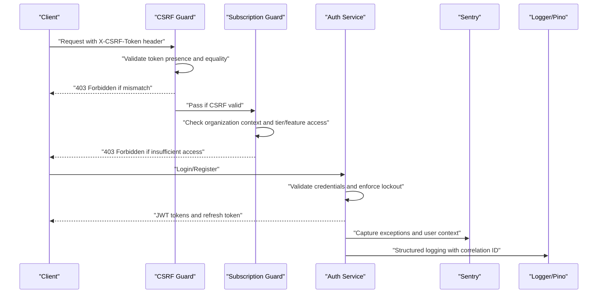

**Diagram sources**
- [csrf.guard.ts:66-148](file://apps/api/src/common/guards/csrf.guard.ts#L66-L148)
- [subscription.guard.ts:65-94](file://apps/api/src/common/guards/subscription.guard.ts#L65-L94)
- [auth.service.ts:104-145](file://apps/api/src/modules/auth/auth.service.ts#L104-L145)
- [sentry.config.ts:51-127](file://apps/api/src/config/sentry.config.ts#L51-L127)
- [logger.config.ts:9-61](file://apps/api/src/config/logger.config.ts#L9-L61)

## Detailed Component Analysis

### Feature Flag Security Controls
Feature flags are centrally configured with privacy and targeting controls:
- LaunchDarkly SDK configuration with private attributes and diagnostic opt-out
- Targeting rules based on user attributes (role, subscription tier)
- Environment-specific toggles and event tracking
- JSON feature flags for dynamic configuration (e.g., rate limits)

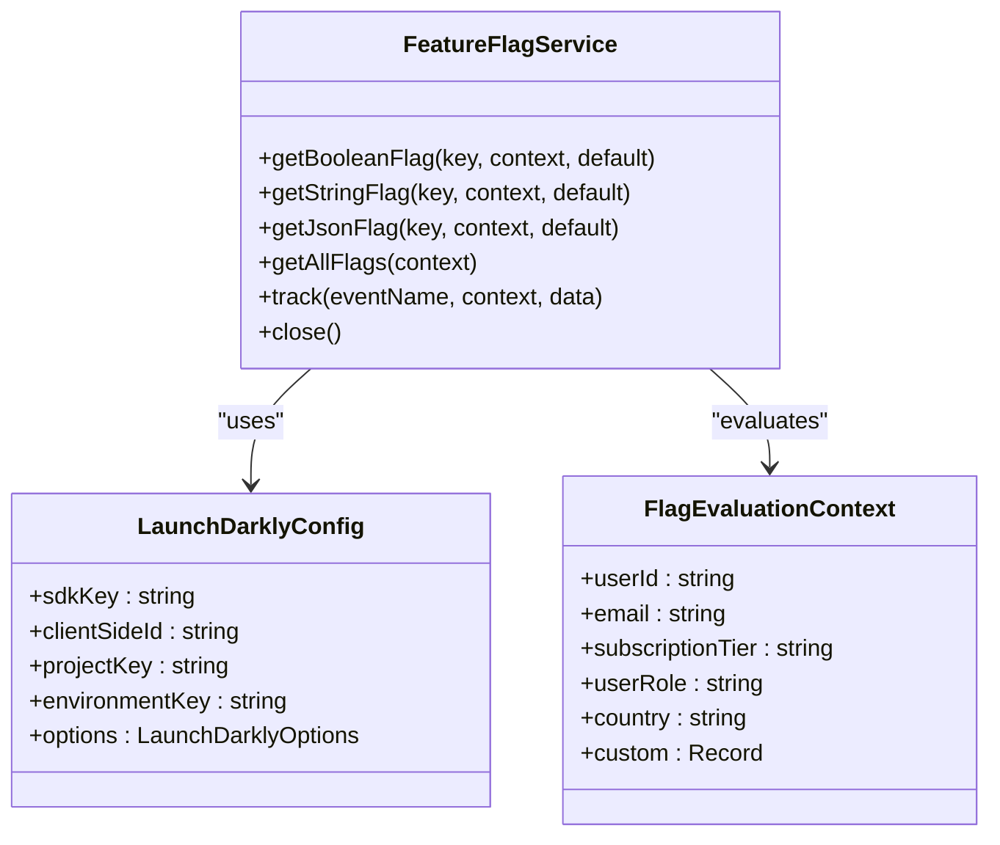

**Diagram sources**
- [feature-flags.config.ts:198-220](file://apps/api/src/config/feature-flags.config.ts#L198-L220)
- [feature-flags.config.ts:709-793](file://apps/api/src/config/feature-flags.config.ts#L709-L793)
- [feature-flags.config.ts:696-703](file://apps/api/src/config/feature-flags.config.ts#L696-L703)

**Section sources**
- [feature-flags.config.ts:1-918](file://apps/api/src/config/feature-flags.config.ts#L1-L918)

### CSRF Protection Mechanisms
CSRF protection follows the double submit cookie pattern:
- Tokens generated with timestamp, random bytes, and HMAC
- Constant-time comparison to prevent timing attacks
- Environment-dependent enforcement (production requires CSRF_SECRET)
- Optional route-level bypass via decorator

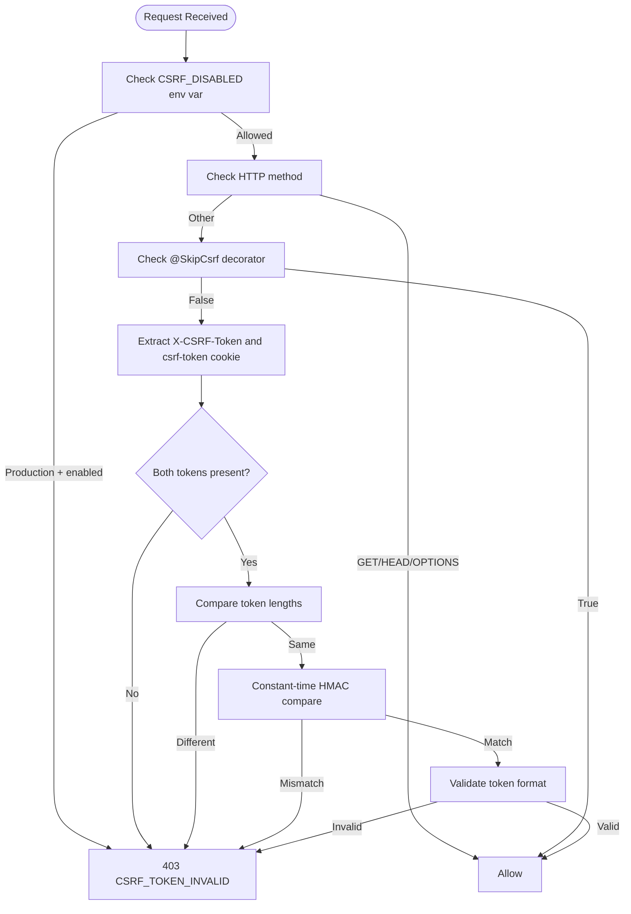

**Diagram sources**
- [csrf.guard.ts:66-148](file://apps/api/src/common/guards/csrf.guard.ts#L66-L148)
- [csrf.guard.ts:154-190](file://apps/api/src/common/guards/csrf.guard.ts#L154-L190)

**Section sources**
- [csrf.guard.ts:1-242](file://apps/api/src/common/guards/csrf.guard.ts#L1-L242)

### Subscription-Based Access Controls
Subscription access control combines tier-based and feature-based gating:
- Route-level decorators for required tiers and feature checks
- Middleware for subscription usage tracking and response headers
- Tier-based rate limits and feature matrices

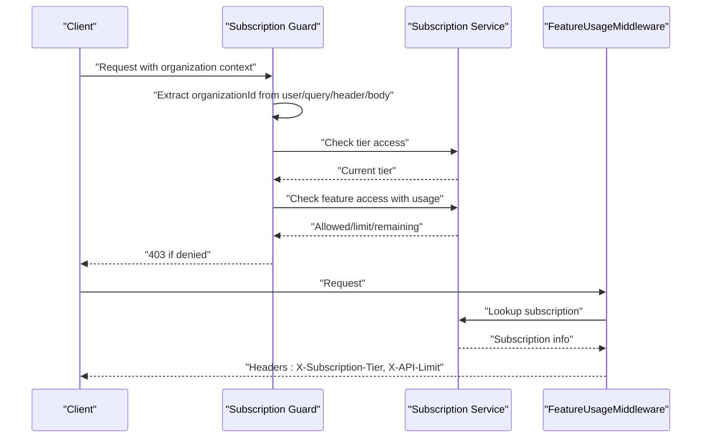

**Diagram sources**
- [subscription.guard.ts:65-94](file://apps/api/src/common/guards/subscription.guard.ts#L65-L94)
- [subscription.guard.ts:187-214](file://apps/api/src/common/guards/subscription.guard.ts#L187-L214)

**Section sources**
- [subscription.guard.ts:1-289](file://apps/api/src/common/guards/subscription.guard.ts#L1-L289)

### Authentication Guard Implementation
Authentication service implements secure credential handling:
- Password hashing with configurable rounds
- Account lockout after failed attempts
- JWT issuance with refresh token rotation
- Secure token storage and invalidation

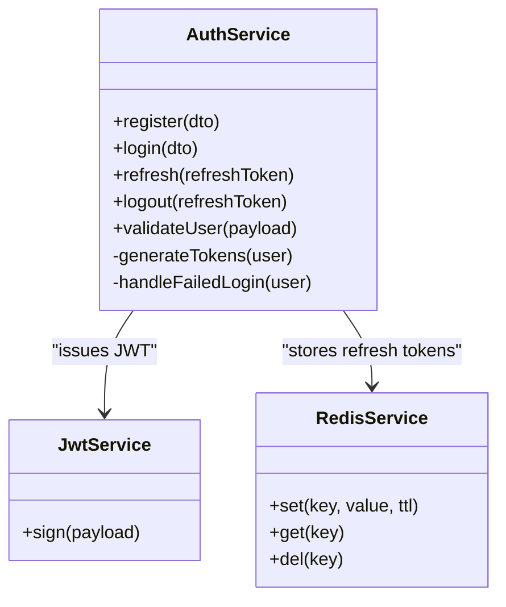

**Diagram sources**
- [auth.service.ts:38-247](file://apps/api/src/modules/auth/auth.service.ts#L38-L247)

**Section sources**
- [auth.service.ts:1-507](file://apps/api/src/modules/auth/auth.service.ts#L1-L507)

### Security Middleware Configuration
Security middleware ensures consistent logging and response formatting:
- Structured HTTP logging with correlation IDs
- Response envelope normalization
- Logger configuration with redaction and serializers

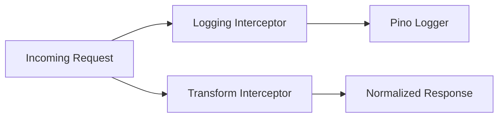

**Diagram sources**
- [logging.interceptor.ts:14-54](file://apps/api/src/common/interceptors/logging.interceptor.ts#L14-L54)
- [transform.interceptor.ts:15-31](file://apps/api/src/common/interceptors/transform.interceptor.ts#L15-L31)
- [logger.config.ts:9-61](file://apps/api/src/config/logger.config.ts#L9-L61)

**Section sources**
- [logging.interceptor.ts:1-56](file://apps/api/src/common/interceptors/logging.interceptor.ts#L1-L56)
- [transform.interceptor.ts:1-32](file://apps/api/src/common/interceptors/transform.interceptor.ts#L1-L32)
- [logger.config.ts:1-62](file://apps/api/src/config/logger.config.ts#L1-L62)

### Incident Response Procedures
Incident response defines severity levels, escalation paths, and runbooks:
- Four severity levels with response and resolution targets
- Escalation paths with notification channels
- Runbooks for production outages, high error rates, security incidents, and database issues

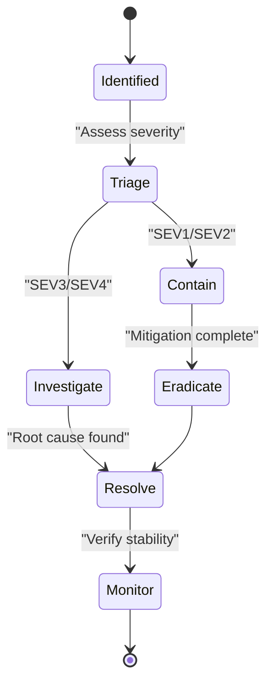

**Diagram sources**
- [incident-response.config.ts:136-237](file://apps/api/src/config/incident-response.config.ts#L136-L237)
- [incident-response.config.ts:247-331](file://apps/api/src/config/incident-response.config.ts#L247-L331)
- [incident-response.config.ts:340-752](file://apps/api/src/config/incident-response.config.ts#L340-L752)

**Section sources**
- [incident-response.config.ts:1-1115](file://apps/api/src/config/incident-response.config.ts#L1-L1115)

### Disaster Recovery Planning
Disaster recovery establishes targets, backup strategies, and failover procedures:
- RTO/RPO targets and availability goals
- Multi-type backups with retention and encryption
- Point-in-time recovery and failover configuration
- DR procedures for region failover, database PITR, and full system restore

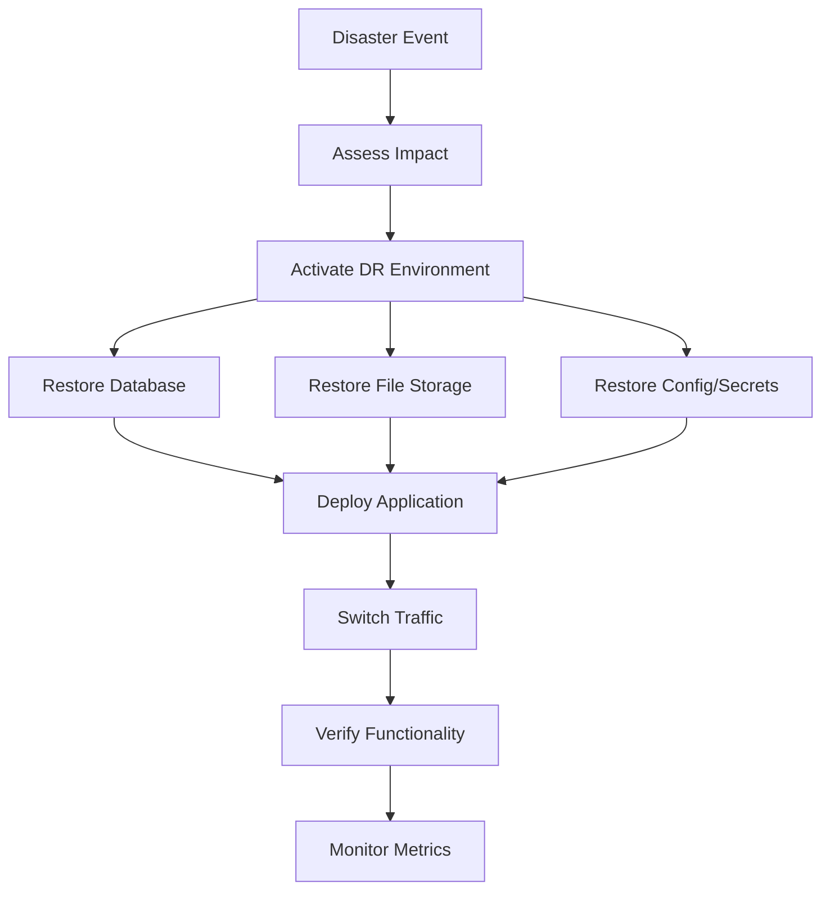

**Diagram sources**
- [disaster-recovery.config.ts:40-47](file://apps/api/src/config/disaster-recovery.config.ts#L40-L47)
- [disaster-recovery.config.ts:113-308](file://apps/api/src/config/disaster-recovery.config.ts#L113-L308)
- [disaster-recovery.config.ts:455-689](file://apps/api/src/config/disaster-recovery.config.ts#L455-L689)

**Section sources**
- [disaster-recovery.config.ts:1-791](file://apps/api/src/config/disaster-recovery.config.ts#L1-L791)

### Security Audit Configurations
Audit logging and security headers are configured centrally:
- Audit logging enabled with retention and excluded paths
- Comprehensive security headers via Helmet
- Production hardening for secrets and CORS

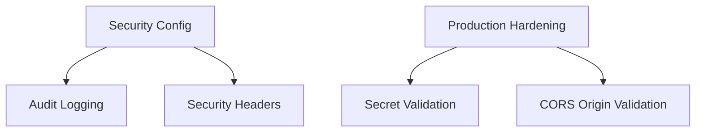

**Diagram sources**
- [security-config.md:77-92](file://security/config/security-config.md#L77-L92)
- [security-config.md:58-75](file://security/config/security-config.md#L58-L75)
- [configuration.ts:5-43](file://apps/api/src/config/configuration.ts#L5-L43)

**Section sources**
- [security-config.md:1-93](file://security/config/security-config.md#L1-L93)
- [configuration.ts:1-115](file://apps/api/src/config/configuration.ts#L1-L115)

### Penetration Testing Setup
Penetration testing is supported by:
- Automated Docker image scanning script
- Security configuration baseline for hardened deployments
- Sentry error tracking and alerting rules

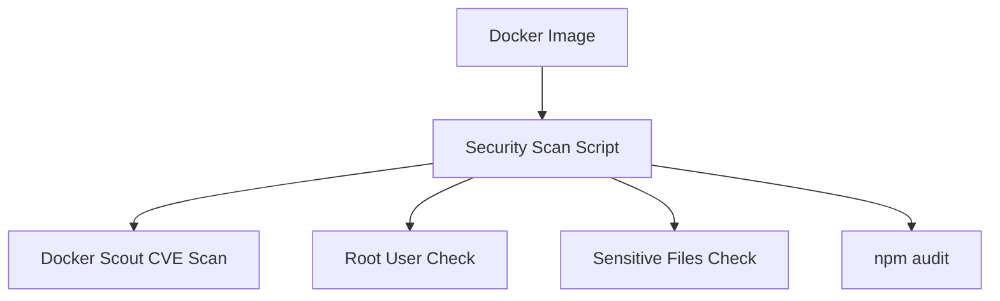

**Diagram sources**
- [security-scan.sh:27-67](file://scripts/security-scan.sh#L27-L67)

**Section sources**
- [security-scan.sh:1-74](file://scripts/security-scan.sh#L1-L74)

### Compliance Monitoring
Compliance is addressed through:
- Security policy with supported versions and reporting process
- Security headers and CORS configuration
- Production environment validation for secrets

**Section sources**
- [security-policy.md:1-54](file://security/policies/security-policy.md#L1-L54)
- [security-config.md:43-56](file://security/config/security-config.md#L43-L56)
- [configuration.ts:5-27](file://apps/api/src/config/configuration.ts#L5-L27)

### Secure Coding Practices
Secure coding practices are embedded in:
- Constant-time comparisons in CSRF guard
- Environment validation for production secrets
- Structured logging with redaction
- JWT configuration with rotation

**Section sources**
- [csrf.guard.ts:124-125](file://apps/api/src/common/guards/csrf.guard.ts#L124-L125)
- [configuration.ts:5-43](file://apps/api/src/config/configuration.ts#L5-L43)
- [logger.config.ts:28-31](file://apps/api/src/config/logger.config.ts#L28-L31)
- [auth.service.ts:218-231](file://apps/api/src/modules/auth/auth.service.ts#L218-L231)

### Vulnerability Assessment Procedures
Vulnerability assessment procedures include:
- Automated Docker image scanning
- npm audit integration
- Security header validation
- Production secret validation

**Section sources**
- [security-scan.sh:64-67](file://scripts/security-scan.sh#L64-L67)
- [security-config.md:58-75](file://security/config/security-config.md#L58-L75)
- [configuration.ts:5-43](file://apps/api/src/config/configuration.ts#L5-L43)

### Security Incident Escalation Workflows
Escalation workflows are defined by:
- Severity-based escalation paths
- Multi-channel notifications
- Runbook-driven response procedures

**Section sources**
- [incident-response.config.ts:247-331](file://apps/api/src/config/incident-response.config.ts#L247-L331)
- [incident-response.config.ts:340-752](file://apps/api/src/config/incident-response.config.ts#L340-L752)

## Dependency Analysis
Security components interact through clear boundaries and shared services:

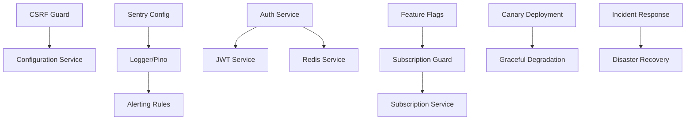

**Diagram sources**
- [csrf.guard.ts:52-64](file://apps/api/src/common/guards/csrf.guard.ts#L52-L64)
- [subscription.guard.ts:59-63](file://apps/api/src/common/guards/subscription.guard.ts#L59-L63)
- [auth.service.ts:46-62](file://apps/api/src/modules/auth/auth.service.ts#L46-L62)
- [sentry.config.ts:51-127](file://apps/api/src/config/sentry.config.ts#L51-L127)
- [alerting-rules.config.ts:61-478](file://apps/api/src/config/alerting-rules.config.ts#L61-L478)
- [canary-deployment.config.ts:144-152](file://apps/api/src/config/canary-deployment.config.ts#L144-L152)
- [graceful-degradation.config.ts:66-211](file://apps/api/src/config/graceful-degradation.config.ts#L66-L211)
- [incident-response.config.ts:247-331](file://apps/api/src/config/incident-response.config.ts#L247-L331)
- [disaster-recovery.config.ts:455-689](file://apps/api/src/config/disaster-recovery.config.ts#L455-L689)
- [feature-flags.config.ts:198-220](file://apps/api/src/config/feature-flags.config.ts#L198-L220)

**Section sources**
- [csrf.guard.ts:1-242](file://apps/api/src/common/guards/csrf.guard.ts#L1-L242)
- [subscription.guard.ts:1-289](file://apps/api/src/common/guards/subscription.guard.ts#L1-L289)
- [auth.service.ts:1-507](file://apps/api/src/modules/auth/auth.service.ts#L1-L507)
- [sentry.config.ts:1-228](file://apps/api/src/config/sentry.config.ts#L1-L228)
- [alerting-rules.config.ts:1-772](file://apps/api/src/config/alerting-rules.config.ts#L1-L772)
- [canary-deployment.config.ts:1-1008](file://apps/api/src/config/canary-deployment.config.ts#L1-L1008)
- [graceful-degradation.config.ts:1-910](file://apps/api/src/config/graceful-degradation.config.ts#L1-L910)
- [incident-response.config.ts:1-1115](file://apps/api/src/config/incident-response.config.ts#L1-L1115)
- [disaster-recovery.config.ts:1-791](file://apps/api/src/config/disaster-recovery.config.ts#L1-L791)
- [feature-flags.config.ts:1-918](file://apps/api/src/config/feature-flags.config.ts#L1-L918)

## Performance Considerations
- CSRF guard uses constant-time comparisons to prevent timing attacks without significant overhead.
- Subscription guard leverages middleware for lightweight usage tracking.
- Sentry sampling reduces overhead in production while preserving critical telemetry.
- Graceful degradation components (circuit breakers, retries, bulkheads) improve resilience under load.

## Troubleshooting Guide
Common security issues and resolutions:
- CSRF validation failures: Ensure both X-CSRF-Token header and csrf-token cookie are present and match.
- Subscription access denials: Verify organization context and tier/feature limits.
- Production environment errors: Confirm JWT secrets, refresh secrets, and CORS origin are properly configured.
- Sentry initialization warnings: Provide DSN and ensure debug settings are appropriate for environment.
- Security scan failures: Address Docker Scout availability, root user detection, and sensitive files in images.

**Section sources**
- [csrf.guard.ts:99-145](file://apps/api/src/common/guards/csrf.guard.ts#L99-L145)
- [subscription.guard.ts:135-173](file://apps/api/src/common/guards/subscription.guard.ts#L135-L173)
- [configuration.ts:5-43](file://apps/api/src/config/configuration.ts#L5-L43)
- [sentry.config.ts:51-127](file://apps/api/src/config/sentry.config.ts#L51-L127)
- [security-scan.sh:46-67](file://scripts/security-scan.sh#L46-L67)

## Conclusion
Quiz-to-Build implements a comprehensive security framework encompassing feature flag governance, access control, runtime protections, observability, and operational readiness. The configuration files demonstrate strong practices in production hardening, resilient design, and incident management, providing a solid foundation for secure operations and continuous improvement.