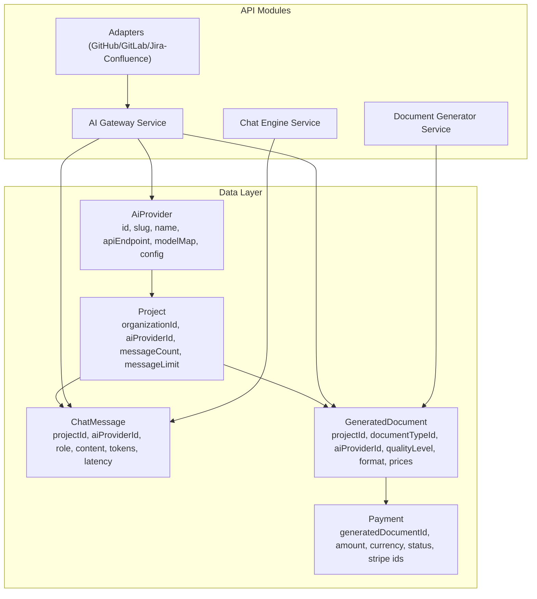
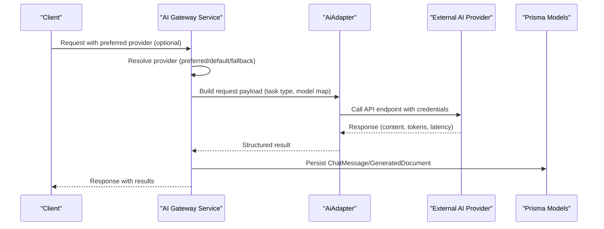
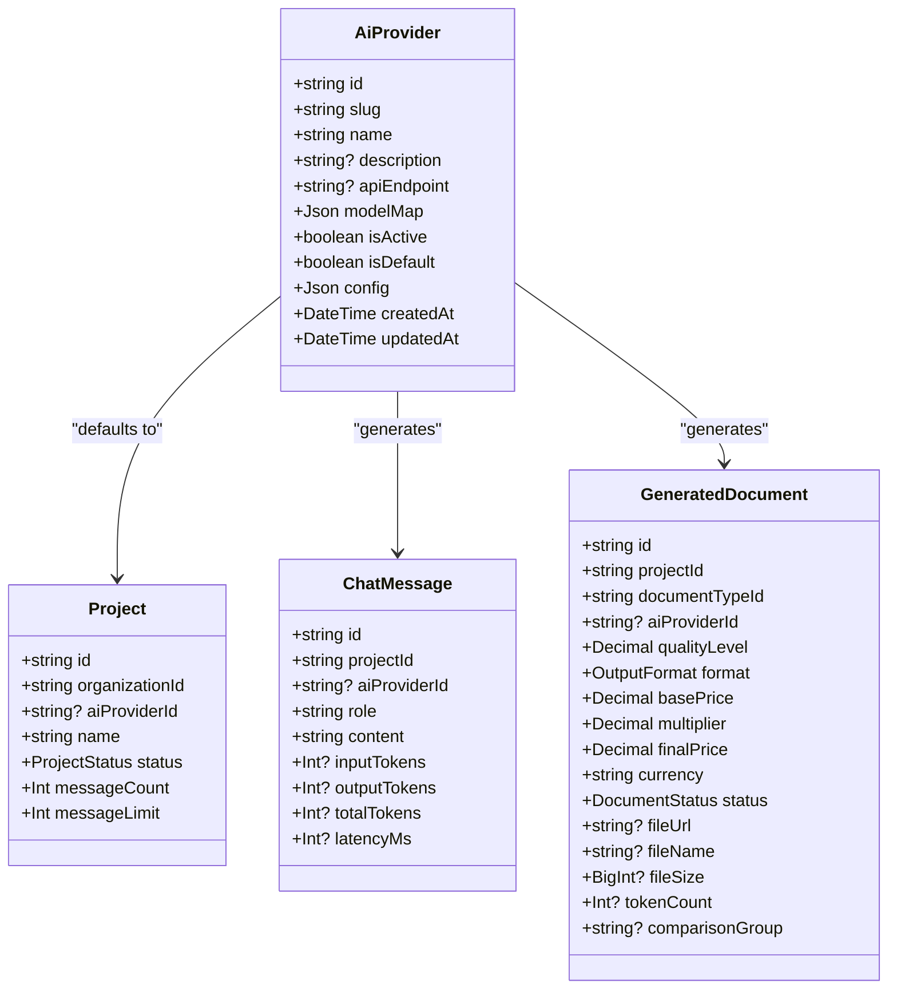
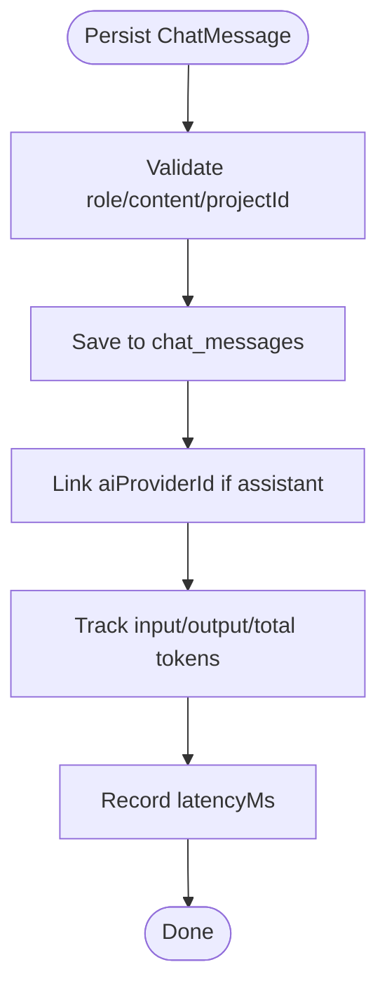
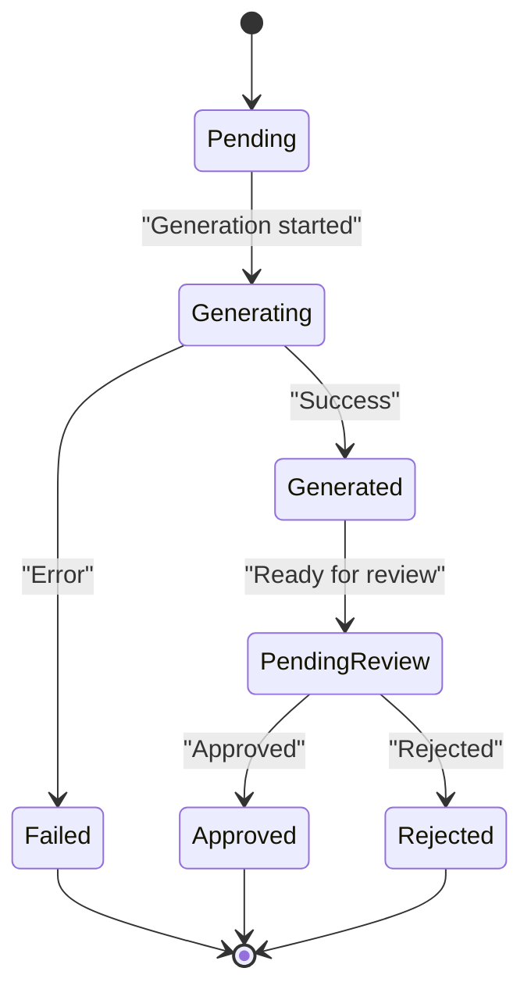
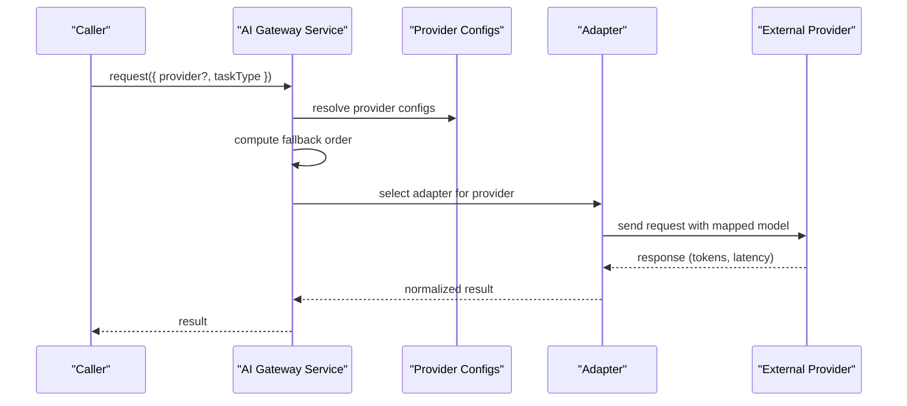
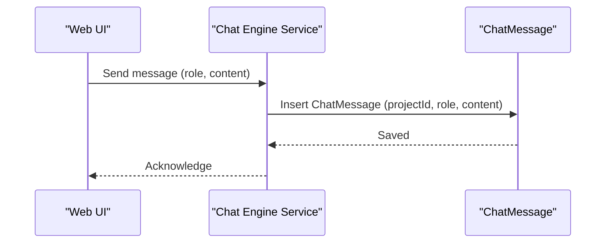
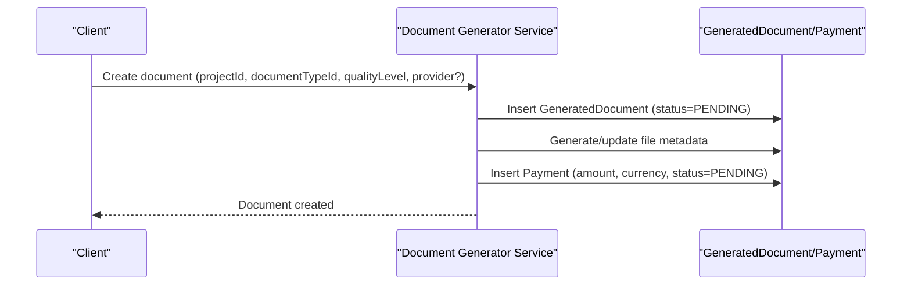
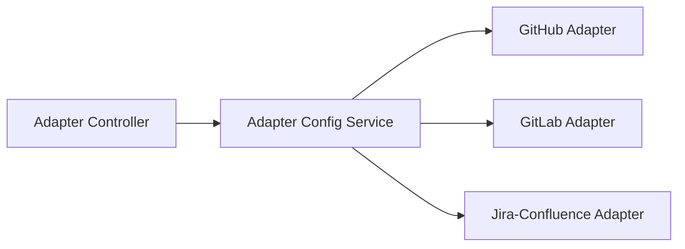
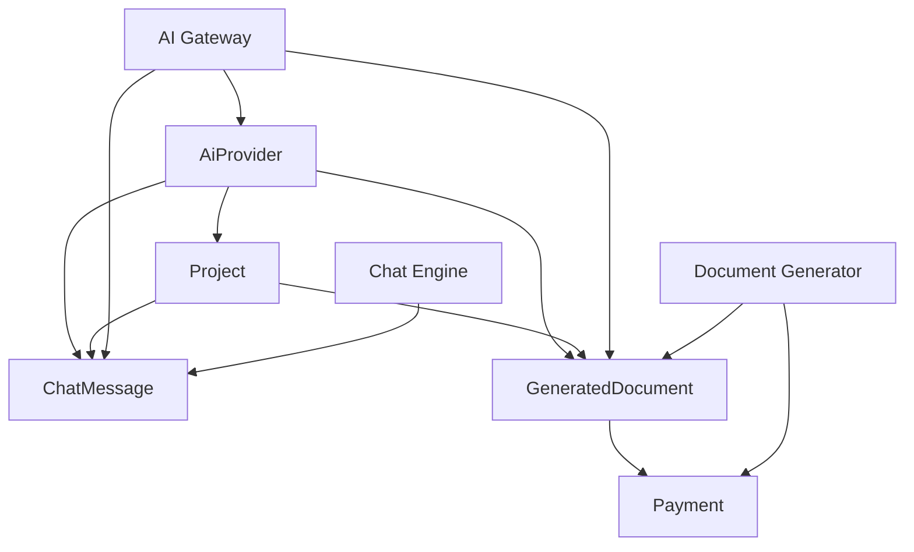

# AI Provider Models

<cite>
**Referenced Files in This Document**
- [schema.prisma](file://prisma/schema.prisma)
- [ai-gateway.service.ts.html](file://apps/api/coverage/lcov-report/src/modules/ai-gateway/ai-gateway.service.ts.html)
- [ai-gateway.interface.ts.html](file://apps/api/coverage/lcov-report/src/modules/ai-gateway/interfaces/ai-gateway.interface.ts.html)
- [cost-tracker.service.ts.html](file://apps/api/coverage/lcov-report/src/modules/ai-gateway/services/cost-tracker.service.ts.html)
- [ai-gateway.controller.ts](file://apps/api/src/modules/ai-gateway/ai-gateway.controller.ts)
- [ai-gateway.service.ts](file://apps/api/src/modules/ai-gateway/ai-gateway.service.ts)
- [chat-engine.service.ts](file://apps/api/src/modules/chat-engine/chat-engine.service.ts)
- [chat-engine.controller.ts](file://apps/api/src/modules/chat-engine/chat-engine.controller.ts)
- [document-generator.service.ts](file://apps/api/src/modules/document-generator/services/document-generator.service.ts)
- [document-generator.controller.ts](file://apps/api/src/modules/document-generator/controllers/document-generator.controller.ts)
- [adapter.controller.ts](file://apps/api/src/modules/adapters/adapter.controller.ts)
- [adapter-config.service.ts](file://apps/api/src/modules/adapters/adapter-config.service.ts)
- [github.adapter.ts](file://apps/api/src/modules/adapters/github.adapter.ts)
- [gitlab.adapter.ts](file://apps/api/src/modules/adapters/gitlab.adapter.ts)
- [jira-confluence.adapter.ts](file://apps/api/src/modules/adapters/jira-confluence.adapter.ts)
- [ai-providers.seed.ts](file://prisma/seeds/ai-providers.seed.ts)
</cite>

## Table of Contents
1. [Introduction](#introduction)
2. [Project Structure](#project-structure)
3. [Core Components](#core-components)
4. [Architecture Overview](#architecture-overview)
5. [Detailed Component Analysis](#detailed-component-analysis)
6. [Dependency Analysis](#dependency-analysis)
7. [Performance Considerations](#performance-considerations)
8. [Troubleshooting Guide](#troubleshooting-guide)
9. [Conclusion](#conclusion)
10. [Appendices](#appendices)

## Introduction
This document explains the AI provider and integration models that power the Quiz2Biz system. It focuses on three core entities: AiProvider, ChatMessage, and GeneratedDocument. It covers AI provider configuration, model mapping, API endpoint management, chat message storage and conversation history, provider-specific configurations, and the relationships among providers, projects, and generated content. It also outlines provider selection strategies, cost tracking, and quality assessment integration, and provides examples of provider configuration, message routing, and document generation workflows.

## Project Structure
The AI provider models are defined in the Prisma schema and are used across several API modules:
- Data models: AiProvider, Project, ChatMessage, ExtractedFact, GeneratedDocument, Payment
- AI Gateway: provider selection, adapter orchestration, fallback strategies, and cost tracking
- Chat Engine: chat message persistence and retrieval
- Document Generator: document creation linked to providers and quality settings
- Adapters: integrations with external AI providers

**Diagram sources**
- [schema.prisma:177-197](file://prisma/schema.prisma#L177-L197)
- [schema.prisma:204-243](file://prisma/schema.prisma#L204-L243)
- [schema.prisma:931-959](file://prisma/schema.prisma#L931-L959)
- [schema.prisma:1037-1081](file://prisma/schema.prisma#L1037-L1081)
- [schema.prisma:1084-1111](file://prisma/schema.prisma#L1084-L1111)

**Section sources**
- [schema.prisma:177-197](file://prisma/schema.prisma#L177-L197)
- [schema.prisma:204-243](file://prisma/schema.prisma#L204-L243)
- [schema.prisma:931-959](file://prisma/schema.prisma#L931-L959)
- [schema.prisma:1037-1081](file://prisma/schema.prisma#L1037-L1081)
- [schema.prisma:1084-1111](file://prisma/schema.prisma#L1084-L1111)

## Core Components
This section describes the three primary entities and their roles.

- AiProvider
  - Purpose: Central configuration for AI providers used by the AI Gateway.
  - Key attributes: slug, name, description, apiEndpoint, modelMap, isActive, isDefault, config.
  - Relationships: Projects (default provider), ChatMessage (assistant messages), GeneratedDocument (generation provider).
  - Indexes: slug, isActive.

- ChatMessage
  - Purpose: Stores conversation messages for projects with token and latency tracking.
  - Key attributes: projectId, aiProviderId, role, content, inputTokens, outputTokens, totalTokens, latencyMs, metadata.
  - Relationships: Project, AiProvider.
  - Indexes: projectId, createdAt, role.

- GeneratedDocument
  - Purpose: Represents documents generated from a project via a provider.
  - Key attributes: projectId, documentTypeId, aiProviderId, qualityLevel, format, pricing fields, status, fileUrl, fileName, fileSize, tokenCount, comparisonGroup, generatedAt.
  - Relationships: Project, DocumentType, AiProvider, Payment.
  - Indexes: projectId, documentTypeId, status, comparisonGroup.

**Section sources**
- [schema.prisma:177-197](file://prisma/schema.prisma#L177-L197)
- [schema.prisma:931-959](file://prisma/schema.prisma#L931-L959)
- [schema.prisma:1037-1081](file://prisma/schema.prisma#L1037-L1081)

## Architecture Overview
The AI provider ecosystem integrates configuration, selection, and execution across modules:

**Diagram sources**
- [ai-gateway.service.ts.html:822-848](file://apps/api/coverage/lcov-report/src/modules/ai-gateway/ai-gateway.service.ts.html#L822-L848)
- [ai-gateway.service.ts.html:989-1045](file://apps/api/coverage/lcov-report/src/modules/ai-gateway/ai-gateway.service.ts.html#L989-L1045)
- [schema.prisma:177-197](file://prisma/schema.prisma#L177-L197)
- [schema.prisma:931-959](file://prisma/schema.prisma#L931-L959)
- [schema.prisma:1037-1081](file://prisma/schema.prisma#L1037-L1081)

## Detailed Component Analysis

### AiProvider Model
- Configuration fields
  - slug: Unique identifier for the provider (e.g., "claude", "openai", "gemini").
  - apiEndpoint: Base URL for API calls.
  - modelMap: JSON mapping for tasks (e.g., "chat", "extract", "generate") to model identifiers.
  - config: Provider-specific configuration (e.g., rate limits, feature flags).
  - isActive/isDefault: Flags controlling availability and default selection.
- Relationships
  - Projects: Projects can default to an AiProvider.
  - ChatMessage: Assistant messages are attributed to a provider.
  - GeneratedDocument: Documents can be generated by a specific provider.

**Diagram sources**
- [schema.prisma:177-197](file://prisma/schema.prisma#L177-L197)
- [schema.prisma:204-243](file://prisma/schema.prisma#L204-L243)
- [schema.prisma:931-959](file://prisma/schema.prisma#L931-L959)
- [schema.prisma:1037-1081](file://prisma/schema.prisma#L1037-L1081)

**Section sources**
- [schema.prisma:177-197](file://prisma/schema.prisma#L177-L197)
- [schema.prisma:204-243](file://prisma/schema.prisma#L204-L243)
- [schema.prisma:931-959](file://prisma/schema.prisma#L931-L959)
- [schema.prisma:1037-1081](file://prisma/schema.prisma#L1037-L1081)

### ChatMessage Model
- Purpose: Store chat messages for a project with provider attribution and token/latency metrics.
- Storage and retrieval: Indexed by project and creation time; role-filtered queries supported.
- Provider attribution: aiProviderId links assistant messages to AiProvider.

**Diagram sources**
- [schema.prisma:931-959](file://prisma/schema.prisma#L931-L959)

**Section sources**
- [schema.prisma:931-959](file://prisma/schema.prisma#L931-L959)

### GeneratedDocument Model
- Purpose: Represent generated documents with quality level, pricing, and provider attribution.
- Status lifecycle: PENDING → GENERATING → GENERATED → PENDING_REVIEW → APPROVED/REJECTED/FAILED.
- Pricing: basePrice, multiplier (1.00–5.00), finalPrice, currency.
- Token accounting: tokenCount for cost tracking.
- Comparison: optional comparisonGroup for provider comparisons.

**Diagram sources**
- [schema.prisma:1037-1081](file://prisma/schema.prisma#L1037-L1081)

**Section sources**
- [schema.prisma:1037-1081](file://prisma/schema.prisma#L1037-L1081)

### AI Gateway Service and Provider Selection
- Provider types: claude, openai, gemini.
- Provider configuration: loaded from AiProvider.config and modelMap.
- Selection strategy:
  - Preferred provider override.
  - Fallback order when preferred is unavailable.
  - Default provider selection.
- Model mapping: resolves task types (chat/extract/generate) to provider-specific model IDs.
- Cost tracking: tracks token usage per provider and task type.

**Diagram sources**
- [ai-gateway.interface.ts.html:502-502](file://apps/api/coverage/lcov-report/src/modules/ai-gateway/interfaces/ai-gateway.interface.ts.html#L502-L502)
- [ai-gateway.service.ts.html:822-848](file://apps/api/coverage/lcov-report/src/modules/ai-gateway/ai-gateway.service.ts.html#L822-L848)
- [ai-gateway.service.ts.html:989-1045](file://apps/api/coverage/lcov-report/src/modules/ai-gateway/ai-gateway.service.ts.html#L989-L1045)
- [cost-tracker.service.ts.html:599-630](file://apps/api/coverage/lcov-report/src/modules/ai-gateway/services/cost-tracker.service.ts.html#L599-L630)

**Section sources**
- [ai-gateway.interface.ts.html:502-502](file://apps/api/coverage/lcov-report/src/modules/ai-gateway/interfaces/ai-gateway.interface.ts.html#L502-L502)
- [ai-gateway.service.ts.html:736-805](file://apps/api/coverage/lcov-report/src/modules/ai-gateway/ai-gateway.service.ts.html#L736-L805)
- [ai-gateway.service.ts.html:822-848](file://apps/api/coverage/lcov-report/src/modules/ai-gateway/ai-gateway.service.ts.html#L822-L848)
- [ai-gateway.service.ts.html:989-1045](file://apps/api/coverage/lcov-report/src/modules/ai-gateway/ai-gateway.service.ts.html#L989-L1045)
- [cost-tracker.service.ts.html:599-630](file://apps/api/coverage/lcov-report/src/modules/ai-gateway/services/cost-tracker.service.ts.html#L599-L630)

### Chat Engine Integration
- ChatMessage persistence: Chat engine writes user/assistant/system messages to the database.
- Conversation history: Queries messages by project/session with ordering by creation time.
- Provider attribution: Assistant messages link to AiProvider via aiProviderId.

**Diagram sources**
- [chat-engine.service.ts](file://apps/api/src/modules/chat-engine/chat-engine.service.ts)
- [chat-engine.controller.ts](file://apps/api/src/modules/chat-engine/chat-engine.controller.ts)
- [schema.prisma:931-959](file://prisma/schema.prisma#L931-L959)

**Section sources**
- [chat-engine.service.ts](file://apps/api/src/modules/chat-engine/chat-engine.service.ts)
- [chat-engine.controller.ts](file://apps/api/src/modules/chat-engine/chat-engine.controller.ts)
- [schema.prisma:931-959](file://prisma/schema.prisma#L931-L959)

### Document Generator Integration
- GeneratedDocument creation: Uses project context, document type, quality level, and selected provider.
- Pricing and currency: Final price computed from base price and multiplier; stored with currency.
- File metadata: fileUrl, fileName, fileSize tracked post-generation.
- Payment linkage: Payment entity references GeneratedDocument.

**Diagram sources**
- [document-generator.service.ts](file://apps/api/src/modules/document-generator/services/document-generator.service.ts)
- [document-generator.controller.ts](file://apps/api/src/modules/document-generator/controllers/document-generator.controller.ts)
- [schema.prisma:1037-1081](file://prisma/schema.prisma#L1037-L1081)
- [schema.prisma:1084-1111](file://prisma/schema.prisma#L1084-L1111)

**Section sources**
- [document-generator.service.ts](file://apps/api/src/modules/document-generator/services/document-generator.service.ts)
- [document-generator.controller.ts](file://apps/api/src/modules/document-generator/controllers/document-generator.controller.ts)
- [schema.prisma:1037-1081](file://prisma/schema.prisma#L1037-L1081)
- [schema.prisma:1084-1111](file://prisma/schema.prisma#L1084-L1111)

### Adapters and External Integrations
- Adapter controller: Exposes endpoints for adapter operations.
- Adapter configuration service: Loads provider-specific settings.
- GitHub/GitLab/Jira-Confluence adapters: Implement provider-specific logic for external systems.

**Diagram sources**
- [adapter.controller.ts](file://apps/api/src/modules/adapters/adapter.controller.ts)
- [adapter-config.service.ts](file://apps/api/src/modules/adapters/adapter-config.service.ts)
- [github.adapter.ts](file://apps/api/src/modules/adapters/github.adapter.ts)
- [gitlab.adapter.ts](file://apps/api/src/modules/adapters/gitlab.adapter.ts)
- [jira-confluence.adapter.ts](file://apps/api/src/modules/adapters/jira-confluence.adapter.ts)

**Section sources**
- [adapter.controller.ts](file://apps/api/src/modules/adapters/adapter.controller.ts)
- [adapter-config.service.ts](file://apps/api/src/modules/adapters/adapter-config.service.ts)
- [github.adapter.ts](file://apps/api/src/modules/adapters/github.adapter.ts)
- [gitlab.adapter.ts](file://apps/api/src/modules/adapters/gitlab.adapter.ts)
- [jira-confluence.adapter.ts](file://apps/api/src/modules/adapters/jira-confluence.adapter.ts)

## Dependency Analysis
- AiProvider depends on Project (default provider), ChatMessage (assistant attribution), and GeneratedDocument (generation attribution).
- ChatMessage depends on Project and optionally AiProvider.
- GeneratedDocument depends on Project, DocumentType, AiProvider, and Payment.
- AI Gateway depends on AiProvider configuration and adapters.
- Chat Engine depends on ChatMessage persistence.
- Document Generator depends on GeneratedDocument and Payment persistence.

**Diagram sources**
- [schema.prisma:177-197](file://prisma/schema.prisma#L177-L197)
- [schema.prisma:204-243](file://prisma/schema.prisma#L204-L243)
- [schema.prisma:931-959](file://prisma/schema.prisma#L931-L959)
- [schema.prisma:1037-1081](file://prisma/schema.prisma#L1037-L1081)
- [schema.prisma:1084-1111](file://prisma/schema.prisma#L1084-L1111)

**Section sources**
- [schema.prisma:177-197](file://prisma/schema.prisma#L177-L197)
- [schema.prisma:204-243](file://prisma/schema.prisma#L204-L243)
- [schema.prisma:931-959](file://prisma/schema.prisma#L931-L959)
- [schema.prisma:1037-1081](file://prisma/schema.prisma#L1037-L1081)
- [schema.prisma:1084-1111](file://prisma/schema.prisma#L1084-L1111)

## Performance Considerations
- Token tracking: Use inputTokens, outputTokens, totalTokens to monitor costs and throughput.
- Latency measurement: Record latencyMs for provider performance insights.
- Message limits: Projects maintain messageCount and messageLimit to constrain conversation length.
- Model mapping: Keep modelMap updated to avoid unnecessary retries and misconfiguration.
- Provider fallback: Implement robust fallback strategies to minimize downtime.

[No sources needed since this section provides general guidance]

## Troubleshooting Guide
- Provider not found
  - Verify AiProvider.isActive and isDefault flags.
  - Confirm slug matches the requested provider type.
- Model mapping errors
  - Check modelMap for the requested task type ("chat", "extract", "generate").
- Token and cost discrepancies
  - Review cost tracker integration and ensure token fields are populated on responses.
- Document generation failures
  - Inspect GeneratedDocument.status and error logs; confirm Payment status and Stripe identifiers.

**Section sources**
- [schema.prisma:177-197](file://prisma/schema.prisma#L177-L197)
- [schema.prisma:931-959](file://prisma/schema.prisma#L931-L959)
- [schema.prisma:1037-1081](file://prisma/schema.prisma#L1037-L1081)
- [schema.prisma:1084-1111](file://prisma/schema.prisma#L1084-L1111)
- [cost-tracker.service.ts.html:599-630](file://apps/api/coverage/lcov-report/src/modules/ai-gateway/services/cost-tracker.service.ts.html#L599-L630)

## Conclusion
The AI provider models form the backbone of Quiz2Biz’s conversational AI and document generation capabilities. AiProvider centralizes configuration and mapping, ChatMessage persists conversation history with provider attribution, and GeneratedDocument encapsulates quality, pricing, and lifecycle management. The AI Gateway orchestrates provider selection, model mapping, and cost tracking, while Chat Engine and Document Generator integrate these models into user workflows.

[No sources needed since this section summarizes without analyzing specific files]

## Appendices

### Provider Configuration Example
- AiProvider fields to configure:
  - slug: "claude"
  - name: "Claude (Anthropic)"
  - apiEndpoint: "https://api.anthropic.com/v1/messages"
  - modelMap: {"chat": "claude-3-5-sonnet-20241022", "extract": "claude-3-haiku-20240307", "generate": "claude-3-5-sonnet-20241022"}
  - config: {"rateLimit": 1000, "timeoutMs": 60000}
  - isActive: true
  - isDefault: false

**Section sources**
- [schema.prisma:177-197](file://prisma/schema.prisma#L177-L197)
- [ai-providers.seed.ts](file://prisma/seeds/ai-providers.seed.ts)

### Message Routing Example
- Route a user message to the AI Gateway:
  - Preferred provider: "openai"
  - Task type: "chat"
  - Expected outcome: Assistant response persisted as ChatMessage with aiProviderId set.

**Section sources**
- [ai-gateway.service.ts.html:822-848](file://apps/api/coverage/lcov-report/src/modules/ai-gateway/ai-gateway.service.ts.html#L822-L848)
- [schema.prisma:931-959](file://prisma/schema.prisma#L931-L959)

### Document Generation Workflow Example
- Steps:
  - Select project and document type.
  - Choose provider (or use default).
  - Set quality level (0.00–1.00).
  - Trigger generation.
  - Persist GeneratedDocument and Payment.
  - Update status to GENERATED and link file metadata.

**Section sources**
- [document-generator.service.ts](file://apps/api/src/modules/document-generator/services/document-generator.service.ts)
- [schema.prisma:1037-1081](file://prisma/schema.prisma#L1037-L1081)
- [schema.prisma:1084-1111](file://prisma/schema.prisma#L1084-L1111)