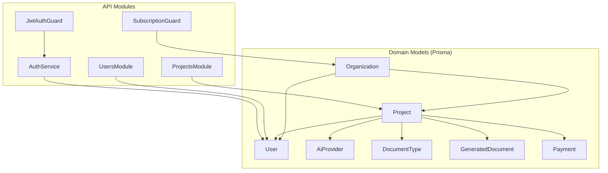
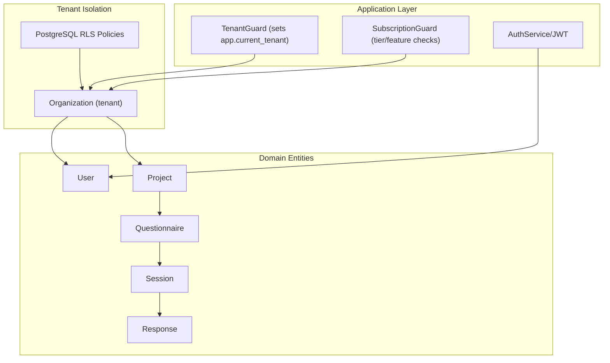
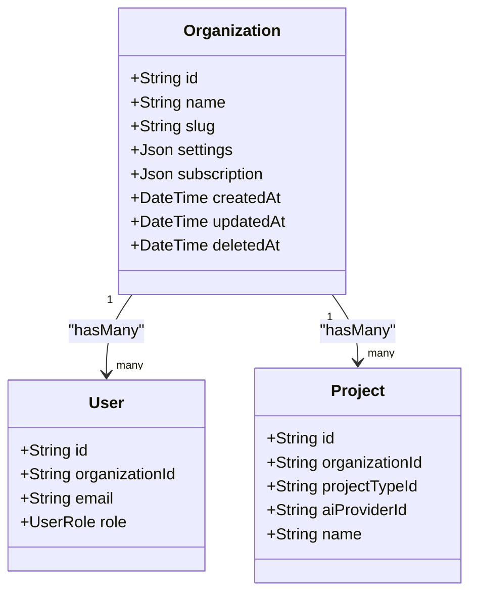
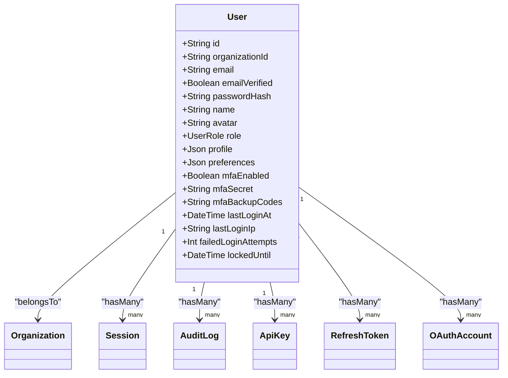
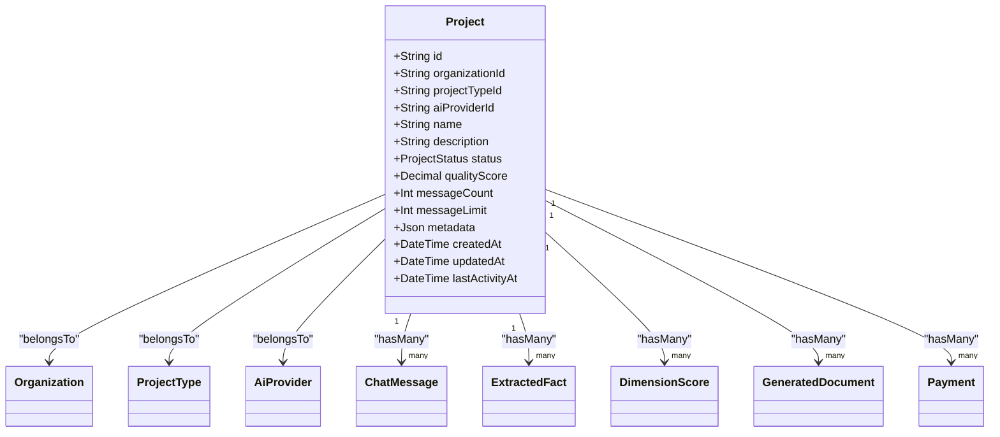
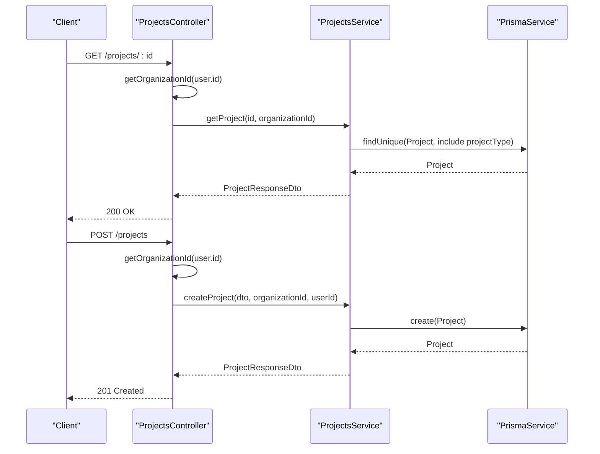
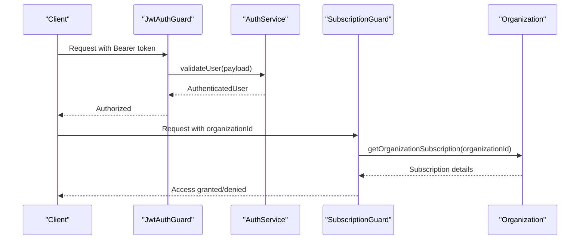
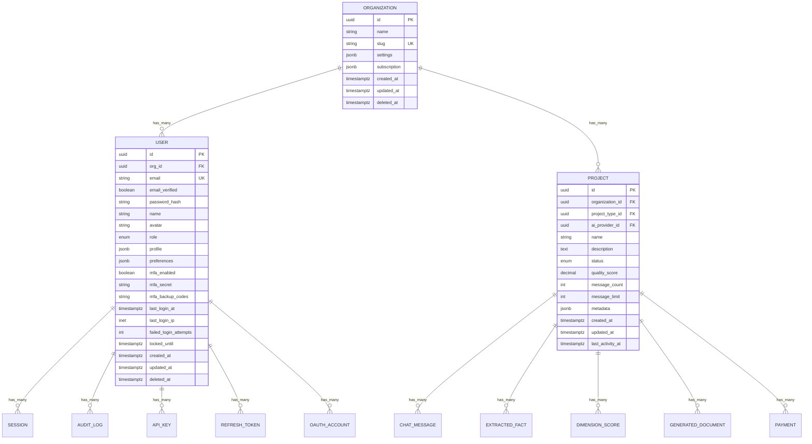

# Core Domain Models

<cite>
**Referenced Files in This Document**
- [schema.prisma](file://prisma/schema.prisma)
- [05-data-models-db-architecture.md](file://docs/cto/05-data-models-db-architecture.md)
- [006-multi-tenancy-strategy.md](file://docs/adr/006-multi-tenancy-strategy.md)
- [projects.controller.ts](file://apps/api/src/modules/projects/projects.controller.ts)
- [projects.service.ts](file://apps/api/src/modules/projects/projects.service.ts)
- [projects.module.ts](file://apps/api/src/modules/projects/projects.module.ts)
- [users.service.ts](file://apps/api/src/modules/users/users.service.ts)
- [users.module.ts](file://apps/api/src/modules/users/users.module.ts)
- [auth.service.ts](file://apps/api/src/modules/auth/auth.service.ts)
- [jwt-auth.guard.ts](file://apps/api/src/modules/auth/guards/jwt-auth.guard.ts)
- [subscription.guard.ts](file://apps/api/src/common/guards/subscription.guard.ts)
- [subscription.guard.spec.ts](file://apps/api/src/common/guards/subscription.guard.spec.ts)
- [payment.dto.ts](file://apps/api/src/modules/payment/dto/payment.dto.ts)
</cite>

## Table of Contents
1. [Introduction](#introduction)
2. [Project Structure](#project-structure)
3. [Core Components](#core-components)
4. [Architecture Overview](#architecture-overview)
5. [Detailed Component Analysis](#detailed-component-analysis)
6. [Dependency Analysis](#dependency-analysis)
7. [Performance Considerations](#performance-considerations)
8. [Troubleshooting Guide](#troubleshooting-guide)
9. [Conclusion](#conclusion)

## Introduction
This document defines the core domain models for Quiz-to-Build: Organization, User, and Project. It explains the multi-tenant architecture, user roles and permissions, and the project-based workspace model. It documents entity relationships, foreign keys, cascading behaviors, field definitions, data types, validation rules, and business constraints. It also provides typical use cases and query patterns for each model.

## Project Structure
The domain models are defined in the Prisma schema and enforced by the database. Supporting modules provide REST APIs for Project management and User profiles, while guards and services implement authentication, authorization, and subscription checks.

**Diagram sources**
- [schema.prisma:154-286](file://prisma/schema.prisma#L154-L286)
- [projects.module.ts:12-18](file://apps/api/src/modules/projects/projects.module.ts#L12-L18)
- [users.module.ts:7-12](file://apps/api/src/modules/users/users.module.ts#L7-L12)
- [auth.service.ts:38-62](file://apps/api/src/modules/auth/auth.service.ts#L38-L62)
- [jwt-auth.guard.ts:15-33](file://apps/api/src/modules/auth/guards/jwt-auth.guard.ts#L15-L33)
- [subscription.guard.ts:117-160](file://apps/api/src/common/guards/subscription.guard.ts#L117-L160)

**Section sources**
- [schema.prisma:154-286](file://prisma/schema.prisma#L154-L286)
- [projects.module.ts:12-18](file://apps/api/src/modules/projects/projects.module.ts#L12-L18)
- [users.module.ts:7-12](file://apps/api/src/modules/users/users.module.ts#L7-L12)

## Core Components
This section documents the three primary domain entities and their relationships.

### Organization
- Purpose: Multi-tenant tenant container for users and projects.
- Key fields:
  - id: String (UUID, primary key)
  - name: String
  - slug: String (unique)
  - settings: Json (default "{}")
  - subscription: Json (default "{}")
  - createdAt/updatedAt/deletedAt: DateTime
- Relationships:
  - Has many users
  - Has many projects
- Indexes: slug, createdAt
- Business constraints:
  - Unique slug
  - Soft delete via deletedAt

**Section sources**
- [schema.prisma:154-170](file://prisma/schema.prisma#L154-L170)
- [05-data-models-db-architecture.md:858-874](file://docs/cto/05-data-models-db-architecture.md#L858-L874)

### User
- Purpose: Application user scoped to an organization.
- Key fields:
  - id: String (UUID, primary key)
  - organizationId: String? (foreign key to Organization)
  - email: String (unique)
  - emailVerified: Boolean
  - passwordHash: String?
  - name/avatar: String?
  - role: UserRole (default CLIENT)
  - profile/preferences: Json (defaults "{}")
  - mfaEnabled/mfaSecret/mfaBackupCodes: Boolean/String?
  - lastLoginAt/Ip: DateTime/String?
  - failedLoginAttempts: Int
  - lockedUntil: DateTime?
  - createdAt/updatedAt/deletedAt: DateTime
- Relationships:
  - Belongs to one Organization (optional)
  - Has many sessions, audit logs, API keys, refresh tokens, OAuth accounts
  - Created questionnaires, approved documents
  - Verifies evidence, owns decisions, creates ideas
- Indexes: email, orgId, role, createdAt
- Business constraints:
  - Unique email
  - Role defaults to CLIENT
  - Soft delete via deletedAt

**Section sources**
- [schema.prisma:245-286](file://prisma/schema.prisma#L245-L286)
- [05-data-models-db-architecture.md:876-906](file://docs/cto/05-data-models-db-architecture.md#L876-L906)

### Project
- Purpose: Multi-project workspace container under an organization.
- Key fields:
  - id: String (UUID, primary key)
  - organizationId: String (foreign key to Organization)
  - projectTypeId: String? (foreign key to ProjectType)
  - aiProviderId: String? (foreign key to AiProvider)
  - name: String
  - description: String? (Text)
  - status: ProjectStatus (default ACTIVE)
  - qualityScore: Decimal (5,2) 0.00–100.00
  - messageCount/messageLimit: Int (default 0/50)
  - metadata: Json (default "{}")
  - createdAt/updatedAt/lastActivityAt: DateTime
- Relationships:
  - Belongs to Organization
  - Optional belongs to ProjectType
  - Optional belongs to AiProvider
  - Has many chat messages, extracted facts, dimension scores, generated documents, payments
- Indexes: orgId, projectTypeId, status, qualityScore, createdAt, lastActivityAt
- Business constraints:
  - Cascades on organization deletion
  - SetNull on project type/AI provider deletion
  - Status constrained to enum

**Section sources**
- [schema.prisma:204-243](file://prisma/schema.prisma#L204-L243)

## Architecture Overview
Quiz-to-Build uses a shared-schema, multi-tenant design with:
- Tenant isolation via organizationId on all tenant-scoped tables
- Database-level Row Level Security (RLS) policies
- Application-level guards enforcing tenant context per request
- Subscription tiers controlling feature access

**Diagram sources**
- [006-multi-tenancy-strategy.md:54-95](file://docs/adr/006-multi-tenancy-strategy.md#L54-L95)
- [subscription.guard.ts:117-160](file://apps/api/src/common/guards/subscription.guard.ts#L117-L160)
- [auth.service.ts:38-62](file://apps/api/src/modules/auth/auth.service.ts#L38-L62)

**Section sources**
- [006-multi-tenancy-strategy.md:54-95](file://docs/adr/006-multi-tenancy-strategy.md#L54-L95)
- [subscription.guard.ts:117-160](file://apps/api/src/common/guards/subscription.guard.ts#L117-L160)

## Detailed Component Analysis

### Organization Model
- Identity and settings: name, slug, settings, subscription
- Multi-tenancy anchor: users and projects belong to an organization
- Soft delete support via deletedAt

**Diagram sources**
- [schema.prisma:154-170](file://prisma/schema.prisma#L154-L170)
- [schema.prisma:245-286](file://prisma/schema.prisma#L245-L286)
- [schema.prisma:204-243](file://prisma/schema.prisma#L204-L243)

**Section sources**
- [schema.prisma:154-170](file://prisma/schema.prisma#L154-L170)

### User Model
- Authentication and authorization: email, passwordHash, MFA, role
- Profile and preferences: profile, preferences, avatar
- Lifecycle: lastLoginAt/IP, lockout, soft delete
- Relationships: organization, sessions, audit logs, API keys, tokens, OAuth accounts, created/approved artifacts

**Diagram sources**
- [schema.prisma:245-286](file://prisma/schema.prisma#L245-L286)

**Section sources**
- [schema.prisma:245-286](file://prisma/schema.prisma#L245-L286)

### Project Model
- Workspace container: organizationId, projectTypeId, aiProviderId
- Lifecycle: status (DRAFT/ACTIVE/ARCHIVED/COMPLETED), qualityScore, activity timestamps
- Chat-first features: messageCount/messageLimit, metadata
- Relationships: organization, projectType, aiProvider, chat messages, facts, scores, generated documents, payments

**Diagram sources**
- [schema.prisma:204-243](file://prisma/schema.prisma#L204-L243)

**Section sources**
- [schema.prisma:204-243](file://prisma/schema.prisma#L204-L243)

### API Workflow: Project Management
The Projects module exposes REST endpoints to manage projects within a user’s organization. It enforces tenant scoping and access control.

**Diagram sources**
- [projects.controller.ts:94-146](file://apps/api/src/modules/projects/projects.controller.ts#L94-L146)
- [projects.service.ts:65-116](file://apps/api/src/modules/projects/projects.service.ts#L65-L116)

**Section sources**
- [projects.controller.ts:94-146](file://apps/api/src/modules/projects/projects.controller.ts#L94-L146)
- [projects.service.ts:65-116](file://apps/api/src/modules/projects/projects.service.ts#L65-L116)

### Authentication and Authorization Flow
Authentication uses JWT with guards. Subscription guard validates tier and feature access using organization context.

**Diagram sources**
- [jwt-auth.guard.ts:15-33](file://apps/api/src/modules/auth/guards/jwt-auth.guard.ts#L15-L33)
- [auth.service.ts:185-200](file://apps/api/src/modules/auth/auth.service.ts#L185-L200)
- [subscription.guard.ts:117-160](file://apps/api/src/common/guards/subscription.guard.ts#L117-L160)

**Section sources**
- [jwt-auth.guard.ts:15-33](file://apps/api/src/modules/auth/guards/jwt-auth.guard.ts#L15-L33)
- [auth.service.ts:185-200](file://apps/api/src/modules/auth/auth.service.ts#L185-L200)
- [subscription.guard.ts:117-160](file://apps/api/src/common/guards/subscription.guard.ts#L117-L160)

## Dependency Analysis
- Foreign keys:
  - User.organizationId → Organization.id (SetNull on delete)
  - Project.organizationId → Organization.id (Cascade on delete)
  - Project.projectTypeId → ProjectType.id (SetNull on delete)
  - Project.aiProviderId → AiProvider.id (SetNull on delete)
- Cascading behaviors:
  - Organization deletes cascade to Project
  - Project deletes cascade to dependent entities (e.g., ChatMessage, ExtractedFact, DimensionScore, GeneratedDocument, Payment)
  - ProjectType/AiProvider deletions set references to null on Project
- Indexes optimize common queries:
  - Organization: slug, createdAt
  - User: email, orgId, role, createdAt
  - Project: orgId, projectTypeId, status, qualityScore, createdAt, lastActivityAt

**Diagram sources**
- [schema.prisma:154-286](file://prisma/schema.prisma#L154-L286)

**Section sources**
- [schema.prisma:154-286](file://prisma/schema.prisma#L154-L286)

## Performance Considerations
- Indexes:
  - Ensure queries filter by organizationId, role, status, and timestamps leverage indexes.
  - Consider composite indexes for frequent filters (e.g., orgId+status, userId+status).
- Cascading deletes:
  - Batch cleanup of dependent entities to avoid long-running transactions.
- RLS overhead:
  - Monitor query performance with RLS enabled; ensure proper indexing and query patterns.
- Pagination:
  - Use take/skip with orderBy on indexed columns (e.g., createdAt, lastActivityAt).

## Troubleshooting Guide
- Access denied to project:
  - Symptom: 403 Forbidden when accessing a project.
  - Cause: Project does not belong to the requesting user’s organization.
  - Resolution: Verify organizationId matches the user’s organization.

- Invalid credentials:
  - Symptom: Unauthorized on login.
  - Causes: Incorrect password, locked account, missing passwordHash.
  - Resolution: Reset failed attempts, unlock account if locked, ensure passwordHash exists.

- Tier access denied:
  - Symptom: 403 with tier requirement message.
  - Cause: Organization lacks required subscription tier or feature capacity.
  - Resolution: Upgrade tier or adjust usage accordingly.

- Missing organization context:
  - Symptom: Subscription guard throws when organizationId cannot be determined.
  - Cause: Missing user context, query/body/header organizationId.
  - Resolution: Ensure organizationId is present in request context.

**Section sources**
- [projects.service.ts:74-82](file://apps/api/src/modules/projects/projects.service.ts#L74-L82)
- [auth.service.ts:104-145](file://apps/api/src/modules/auth/auth.service.ts#L104-L145)
- [subscription.guard.ts:117-160](file://apps/api/src/common/guards/subscription.guard.ts#L117-L160)
- [subscription.guard.spec.ts:53-91](file://apps/api/src/common/guards/subscription.guard.spec.ts#L53-L91)

## Conclusion
The core domain models establish a robust, multi-tenant foundation for Quiz-to-Build. Organizations define tenants, Users are scoped to Organizations, and Projects encapsulate workspace functionality. The shared-schema design with RLS and guard-based tenant enforcement ensures isolation and scalability. Subscription guards and tiered access control provide flexible monetization. Proper indexing and cascading behaviors support performance and data integrity.