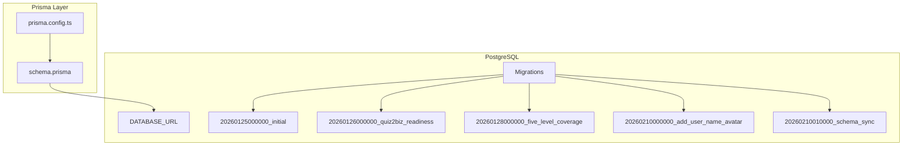
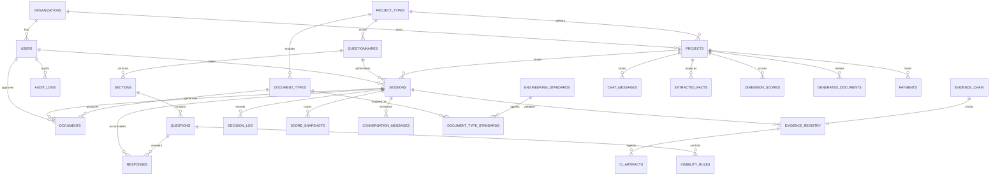
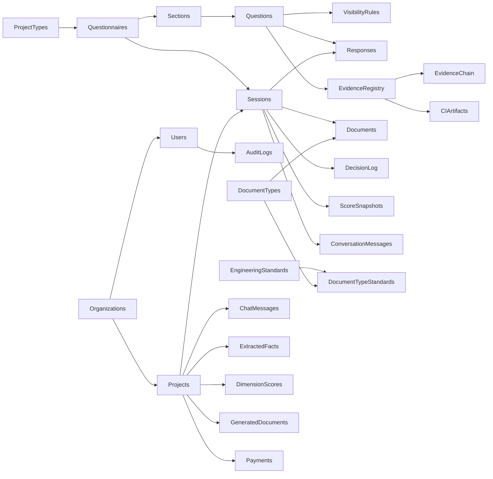
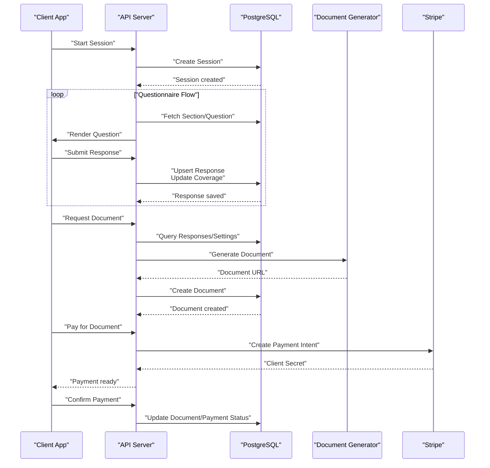

# Database Schema

<cite>
**Referenced Files in This Document**
- [schema.prisma](file://prisma/schema.prisma)
- [prisma.config.ts](file://prisma/prisma.config.ts)
- [20260125000000_initial/migration.sql](file://prisma/migrations/20260125000000_initial/migration.sql)
- [20260126000000_quiz2biz_readiness/migration.sql](file://prisma/migrations/20260126000000_quiz2biz_readiness/migration.sql)
- [20260128000000_five_level_coverage/migration.sql](file://prisma/migrations/20260128000000_five_level_coverage/migration.sql)
- [20260210000000_add_user_name_avatar/migration.sql](file://prisma/migrations/20260210000000_add_user_name_avatar/migration.sql)
- [20260210010000_schema_sync/migration.sql](file://prisma/migrations/20260210010000_schema_sync/migration.sql)
- [questions.seed.ts](file://prisma/seeds/questions.seed.ts)
- [project-types.seed.ts](file://prisma/seeds/project-types.seed.ts)
- [dimensions.seed.ts](file://prisma/seeds/dimensions.seed.ts)
- [standards.seed.ts](file://prisma/seeds/standards.seed.ts)
</cite>

## Table of Contents
1. [Introduction](#introduction)
2. [Project Structure](#project-structure)
3. [Core Components](#core-components)
4. [Architecture Overview](#architecture-overview)
5. [Detailed Component Analysis](#detailed-component-analysis)
6. [Dependency Analysis](#dependency-analysis)
7. [Performance Considerations](#performance-considerations)
8. [Troubleshooting Guide](#troubleshooting-guide)
9. [Conclusion](#conclusion)
10. [Appendices](#appendices)

## Introduction
This document provides comprehensive database schema documentation for Quiz-to-Build. It details all entities, attributes, data types, constraints, indexes, and relationships defined in the Prisma schema and migration history. It explains the domain model for organizations, users, questionnaires, sessions, responses, and document workflows, including Quiz2Biz enhancements such as persona-driven questions, readiness scoring, evidence registry, decision logs, and chat-first project hubs. It also documents enum types, validation rules, business constraints, data lifecycle, audit trails, indexing strategies, query optimization, and schema evolution patterns.

## Project Structure
The database schema is defined via Prisma and evolves through PostgreSQL migrations. The Prisma configuration points to the schema file and resolves the DATABASE_URL at runtime. The initial migration establishes core tables and indexes. Subsequent migrations introduce Quiz2Biz features, five-level coverage, user profile enhancements, and schema synchronization.

**Diagram sources**
- [prisma.config.ts:1-14](file://prisma/prisma.config.ts#L1-L14)
- [schema.prisma:1-12](file://prisma/schema.prisma#L1-L12)
- [20260125000000_initial/migration.sql:1-487](file://prisma/migrations/20260125000000_initial/migration.sql#L1-L487)
- [20260126000000_quiz2biz_readiness/migration.sql:1-179](file://prisma/migrations/20260126000000_quiz2biz_readiness/migration.sql#L1-L179)
- [20260128000000_five_level_coverage/migration.sql:1-93](file://prisma/migrations/20260128000000_five_level_coverage/migration.sql#L1-L93)
- [20260210000000_add_user_name_avatar/migration.sql:1-4](file://prisma/migrations/20260210000000_add_user_name_avatar/migration.sql#L1-L4)
- [20260210010000_schema_sync/migration.sql:1-103](file://prisma/migrations/20260210010000_schema_sync/migration.sql#L1-L103)

**Section sources**
- [prisma.config.ts:1-14](file://prisma/prisma.config.ts#L1-L14)
- [schema.prisma:1-12](file://prisma/schema.prisma#L1-L12)

## Core Components
This section summarizes the principal entities and their roles in the Quiz-to-Build domain.

- Organizations: Multi-tenant container holding settings and subscriptions; supports soft deletion via deleted_at.
- Users: Authenticated actors with roles, MFA, and profile preferences; linked to organizations; supports soft deletion via deleted_at.
- Questionnaires: Structured assessment templates; linked to project types and creators.
- Sections and Questions: Hierarchical questionnaire structure with validation rules, persona targeting, and dimension mapping.
- Sessions: Adaptive assessment instances with progress tracking, persona filtering, and readiness scoring.
- Responses: Answer records with validation, timing, and coverage tracking.
- Evidence Registry: Attachments and verifications for answers; supports integrity and CI artifact ingestion.
- Decision Log: Append-only decision records with supersession tracking.
- Documents and Document Types: Generated deliverables with status, format, and pricing metadata.
- Standards and Document Type Standards: Mapping of engineering standards to document types.
- Chat-First Enhancements: Projects, ChatMessages, ExtractedFacts, QualityDimensions, DimensionScores, GeneratedDocuments, Payments.

**Section sources**
- [schema.prisma:154-170](file://prisma/schema.prisma#L154-L170)
- [schema.prisma:245-286](file://prisma/schema.prisma#L245-L286)
- [schema.prisma:351-376](file://prisma/schema.prisma#L351-L376)
- [schema.prisma:425-489](file://prisma/schema.prisma#L425-L489)
- [schema.prisma:512-560](file://prisma/schema.prisma#L512-L560)
- [schema.prisma:579-608](file://prisma/schema.prisma#L579-L608)
- [schema.prisma:636-674](file://prisma/schema.prisma#L636-L674)
- [schema.prisma:677-706](file://prisma/schema.prisma#L677-L706)
- [schema.prisma:744-774](file://prisma/schema.prisma#L744-L774)
- [schema.prisma:805-821](file://prisma/schema.prisma#L805-L821)
- [schema.prisma:823-839](file://prisma/schema.prisma#L823-L839)
- [schema.prisma:930-959](file://prisma/schema.prisma#L930-L959)
- [schema.prisma:961-986](file://prisma/schema.prisma#L961-L986)
- [schema.prisma:988-1034](file://prisma/schema.prisma#L988-L1034)
- [schema.prisma:1037-1081](file://prisma/schema.prisma#L1037-L1081)
- [schema.prisma:1084-1111](file://prisma/schema.prisma#L1084-L1111)

## Architecture Overview
The schema supports a multi-tenant, adaptive questionnaire and document generation platform with optional chat-first project hubs. The domain integrates readiness scoring, evidence verification, and standards mapping.

**Diagram sources**
- [schema.prisma:154-170](file://prisma/schema.prisma#L154-L170)
- [schema.prisma:204-243](file://prisma/schema.prisma#L204-L243)
- [schema.prisma:245-286](file://prisma/schema.prisma#L245-L286)
- [schema.prisma:351-376](file://prisma/schema.prisma#L351-L376)
- [schema.prisma:425-489](file://prisma/schema.prisma#L425-L489)
- [schema.prisma:512-560](file://prisma/schema.prisma#L512-L560)
- [schema.prisma:579-608](file://prisma/schema.prisma#L579-L608)
- [schema.prisma:636-674](file://prisma/schema.prisma#L636-L674)
- [schema.prisma:677-706](file://prisma/schema.prisma#L677-L706)
- [schema.prisma:712-742](file://prisma/schema.prisma#L712-L742)
- [schema.prisma:744-774](file://prisma/schema.prisma#L744-L774)
- [schema.prisma:805-821](file://prisma/schema.prisma#L805-L821)
- [schema.prisma:823-839](file://prisma/schema.prisma#L823-L839)
- [schema.prisma:846-862](file://prisma/schema.prisma#L846-L862)
- [schema.prisma:869-891](file://prisma/schema.prisma#L869-L891)
- [schema.prisma:894-924](file://prisma/schema.prisma#L894-L924)
- [schema.prisma:930-959](file://prisma/schema.prisma#L930-L959)
- [schema.prisma:961-986](file://prisma/schema.prisma#L961-L986)
- [schema.prisma:988-1034](file://prisma/schema.prisma#L988-L1034)
- [schema.prisma:1037-1081](file://prisma/schema.prisma#L1037-L1081)
- [schema.prisma:1084-1111](file://prisma/schema.prisma#L1084-L1111)

## Detailed Component Analysis

### Enumerations
- UserRole: CLIENT, DEVELOPER, ADMIN, SUPER_ADMIN
- QuestionType: TEXT, TEXTAREA, NUMBER, EMAIL, URL, DATE, SINGLE_CHOICE, MULTIPLE_CHOICE, SCALE, FILE_UPLOAD, MATRIX
- SessionStatus: IN_PROGRESS, COMPLETED, ABANDONED, EXPIRED
- VisibilityAction: SHOW, HIDE, REQUIRE, UNREQUIRE
- DocumentCategory: CTO, CFO, BA, CEO, POLICY, SEO
- DocumentStatus: PENDING, GENERATING, GENERATED, PENDING_REVIEW, APPROVED, REJECTED, FAILED
- StandardCategory: MODERN_ARCHITECTURE, AI_ASSISTED_DEV, CODING_STANDARDS, TESTING_QA, SECURITY_DEVSECOPS, WORKFLOW_OPS, DOCS_KNOWLEDGE
- Persona: CTO, CFO, CEO, BA, POLICY
- EvidenceType: FILE, IMAGE, LINK, LOG, SBOM, REPORT, TEST_RESULT, SCREENSHOT, DOCUMENT
- DecisionStatus: DRAFT, LOCKED, AMENDED, SUPERSEDED
- CoverageLevel: NONE, PARTIAL, HALF, SUBSTANTIAL, FULL
- ProjectStatus: DRAFT, ACTIVE, ARCHIVED, COMPLETED
- PaymentStatus: PENDING, PROCESSING, COMPLETED, FAILED, REFUNDED
- OutputFormat: DOCX, PDF, MARKDOWN

These enums are defined in the Prisma schema and materialized as PostgreSQL enum types in migrations.

**Section sources**
- [schema.prisma:18-120](file://prisma/schema.prisma#L18-L120)
- [schema.prisma:127-148](file://prisma/schema.prisma#L127-L148)
- [20260125000000_initial/migration.sql:1-21](file://prisma/migrations/20260125000000_initial/migration.sql#L1-L21)
- [20260126000000_quiz2biz_readiness/migration.sql:8-21](file://prisma/migrations/20260126000000_quiz2biz_readiness/migration.sql#L8-L21)
- [20260128000000_five_level_coverage/migration.sql:5-6](file://prisma/migrations/20260128000000_five_level_coverage/migration.sql#L5-L6)

### Organizations
- Primary key: id (String, UUID)
- Attributes: name (String), slug (String, unique), settings (Json), subscription (Json), createdAt, updatedAt, deletedAt
- Indexes: slug, createdAt
- Constraints: Unique slug enforced at DB level

**Section sources**
- [schema.prisma:154-170](file://prisma/schema.prisma#L154-L170)
- [20260125000000_initial/migration.sql:22-34](file://prisma/migrations/20260125000000_initial/migration.sql#L22-L34)

### Users
- Primary key: id (String, UUID)
- Attributes: org_id (String, foreign key), email (String, unique), emailVerified, passwordHash, name, avatar, role, profile, preferences, mfaEnabled, mfaSecret, mfaBackupCodes, lastLoginAt, lastLoginIp, failedLoginAttempts, lockedUntil, createdAt, updatedAt, deletedAt
- Relations: belongs to Organization; owns Sessions, AuditLogs, ApiKeys, RefreshTokens, OAuthAccounts; approves Documents; verifies EvidenceRegistry; owns DecisionLog; participates in IdeaCapture
- Indexes: email, org_id, role, createdAt
- Constraints: Unique email; Soft deletion via deleted_at

**Section sources**
- [schema.prisma:245-286](file://prisma/schema.prisma#L245-L286)
- [20260125000000_initial/migration.sql:36-57](file://prisma/migrations/20260125000000_initial/migration.sql#L36-L57)
- [20260210000000_add_user_name_avatar/migration.sql:2-3](file://prisma/migrations/20260210000000_add_user_name_avatar/migration.sql#L2-L3)

### RefreshTokens
- Primary key: id (String, UUID)
- Attributes: user_id (String, foreign key), token (String, unique), expires_at, created_at, revoked_at
- Indexes: token, user_id, expires_at

**Section sources**
- [schema.prisma:288-302](file://prisma/schema.prisma#L288-L302)
- [20260125000000_initial/migration.sql:59-69](file://prisma/migrations/20260125000000_initial/migration.sql#L59-L69)

### ApiKeys
- Primary key: id (String, UUID)
- Attributes: user_id (String, foreign key), name, keyPrefix, keyHash, scopes[], rateLimit, lastUsedAt, expiresAt, createdAt, revokedAt
- Indexes: user_id, keyPrefix

**Section sources**
- [schema.prisma:304-322](file://prisma/schema.prisma#L304-L322)
- [20260125000000_initial/migration.sql:71-86](file://prisma/migrations/20260125000000_initial/migration.sql#L71-L86)

### OAuthAccounts
- Primary key: id (String, UUID)
- Attributes: user_id (String, foreign key), provider, provider_id, email, name, picture, access_token, refresh_token, expires_at, last_login_at, created_at, updated_at
- Indexes: user_id, provider; Unique(provider, provider_id)

**Section sources**
- [schema.prisma:324-345](file://prisma/schema.prisma#L324-L345)
- [20260210010000_schema_sync/migration.sql:19-35](file://prisma/migrations/20260210010000_schema_sync/migration.sql#L19-L35)

### Questionnaires
- Primary key: id (String, UUID)
- Attributes: project_type_id (String, foreign key), name, description, industry, version, isActive, isDefault, estimatedTime, metadata, created_by (String, foreign key), created_at, updated_at, published_at
- Indexes: project_type_id, industry, isActive

**Section sources**
- [schema.prisma:351-376](file://prisma/schema.prisma#L351-L376)
- [20260125000000_initial/migration.sql:88-105](file://prisma/migrations/20260125000000_initial/migration.sql#L88-L105)

### ProjectTypes
- Primary key: id (String, UUID)
- Attributes: slug (String, unique), name, description, icon, isActive, isDefault, metadata, created_at, updated_at
- Indexes: isActive, isDefault

**Section sources**
- [schema.prisma:378-401](file://prisma/schema.prisma#L378-L401)
- [20260125000000_initial/migration.sql:200-216](file://prisma/migrations/20260125000000_initial/migration.sql#L200-L216)

### IdeaCapture
- Primary key: id (String, UUID)
- Attributes: user_id (String, foreign key), project_type_id (String, foreign key), title, raw_input (Text), analysis, suggested_questions, status, created_at, updated_at
- Indexes: user_id, project_type_id, created_at

**Section sources**
- [schema.prisma:403-423](file://prisma/schema.prisma#L403-L423)
- [20260210010000_schema_sync/migration.sql:19-35](file://prisma/migrations/20260210010000_schema_sync/migration.sql#L19-L35)

### Sections
- Primary key: id (String, UUID)
- Attributes: questionnaire_id (String, foreign key), name, description, order_index, icon, estimatedTime, metadata, created_at, updated_at
- Indexes: questionnaire_id, questionnaire_id+order_index

**Section sources**
- [schema.prisma:425-444](file://prisma/schema.prisma#L425-L444)
- [20260125000000_initial/migration.sql:108-121](file://prisma/migrations/20260125000000_initial/migration.sql#L108-L121)

### Questions
- Primary key: id (String, UUID)
- Attributes: section_id (String, foreign key), text, type, help_text, explanation, placeholder, order_index, is_required, options, validation_rules, default_value, suggested_answer, industry_tags[], document_mappings, metadata, persona, dimension_key, severity, best_practice, practical_explainer, standard_refs, acceptance, createdAt, updatedAt
- Indexes: section_id, section_id+order_index, type, persona, dimension_key

**Section sources**
- [schema.prisma:446-489](file://prisma/schema.prisma#L446-L489)
- [20260125000000_initial/migration.sql:124-145](file://prisma/migrations/20260125000000_initial/migration.sql#L124-L145)
- [20260126000000_quiz2biz_readiness/migration.sql:116-132](file://prisma/migrations/20260126000000_quiz2biz_readiness/migration.sql#L116-L132)

### VisibilityRules
- Primary key: id (String, UUID)
- Attributes: question_id (String, foreign key), condition (Json), action, target_question_ids[], priority, is_active, created_at, updated_at
- Indexes: question_id

**Section sources**
- [schema.prisma:491-506](file://prisma/schema.prisma#L491-L506)
- [20260125000000_initial/migration.sql:148-160](file://prisma/migrations/20260125000000_initial/migration.sql#L148-L160)

### Sessions
- Primary key: id (String, UUID)
- Attributes: user_id (String, foreign key), project_type_id (String, foreign key), idea_capture_id (String, foreign key), questionnaire_id (String, foreign key), questionnaire_version, status, persona, industry, progress (Json), current_section_id (String, foreign key), current_question_id (String, foreign key), adaptiveState (Json), metadata, readiness_score (Decimal), last_score_calculation, started_at, updated_at, last_activity_at, completed_at, expires_at
- Indexes: user_id, project_type_id, idea_capture_id, questionnaire_id, status, started_at, user_id+status, readiness_score

**Section sources**
- [schema.prisma:512-560](file://prisma/schema.prisma#L512-L560)
- [20260125000000_initial/migration.sql:163-181](file://prisma/migrations/20260125000000_initial/migration.sql#L163-L181)
- [20260126000000_quiz2biz_readiness/migration.sql:149-154](file://prisma/migrations/20260126000000_quiz2biz_readiness/migration.sql#L149-L154)

### ScoreSnapshots
- Primary key: id (String, UUID)
- Attributes: session_id (String, foreign key), score (Decimal), portfolioResidual (Decimal), completionPercentage (Decimal), dimension_breakdown (Json), created_at
- Indexes: session_id, session_id+created_at

**Section sources**
- [schema.prisma:563-577](file://prisma/schema.prisma#L563-L577)
- [20260210010000_schema_sync/migration.sql:37-47](file://prisma/migrations/20260210010000_schema_sync/migration.sql#L37-L47)

### Responses
- Primary key: id (String, UUID); Unique(session_id, question_id)
- Attributes: session_id (String, foreign key), question_id (String, foreign key), value (Json), is_valid, validation_errors, time_spent_seconds, revision, coverage (Decimal), coverage_level, rationale, evidence_count, answered_at, updated_at
- Indexes: session_id, question_id, answered_at, coverage, coverage_level

**Section sources**
- [schema.prisma:579-608](file://prisma/schema.prisma#L579-L608)
- [20260125000000_initial/migration.sql:184-197](file://prisma/migrations/20260125000000_initial/migration.sql#L184-L197)
- [20260128000000_five_level_coverage/migration.sql:8-26](file://prisma/migrations/20260128000000_five_level_coverage/migration.sql#L8-L26)

### DimensionCatalog
- Primary key: key (String)
- Attributes: project_type_id (String, foreign key), display_name, description, weight (Decimal), order_index, is_active, created_at, updated_at
- Indexes: project_type_id, order_index, is_active

**Section sources**
- [schema.prisma:615-633](file://prisma/schema.prisma#L615-L633)
- [20260126000000_quiz2biz_readiness/migration.sql:26-41](file://prisma/migrations/20260126000000_quiz2biz_readiness/migration.sql#L26-L41)

### EvidenceRegistry
- Primary key: id (String, UUID)
- Attributes: session_id (String, foreign key), question_id (String, foreign key), artifact_url, artifact_type, file_name, file_size, mime_type, drive_id, item_id, e_tag, verified, verifier_id (String, foreign key), verified_at, hash_signature, coverage_value, metadata, created_at, updated_at
- Indexes: session_id, question_id, verified, artifact_type

**Section sources**
- [schema.prisma:636-674](file://prisma/schema.prisma#L636-L674)
- [20260126000000_quiz2biz_readiness/migration.sql:46-71](file://prisma/migrations/20260126000000_quiz2biz_readiness/migration.sql#L46-L71)

### EvidenceChain
- Primary key: id (String, UUID); Unique(session_id, sequence_number)
- Attributes: evidence_id (String, foreign key), session_id (String, foreign key), sequence_number, previous_hash, chain_hash, evidence_hash, timestamp_token, tsa_url, created_at
- Indexes: evidence_id, session_id, chain_hash

**Section sources**
- [schema.prisma:869-891](file://prisma/schema.prisma#L869-L891)
- [20260210010000_schema_sync/migration.sql:49-62](file://prisma/migrations/20260210010000_schema_sync/migration.sql#L49-L62)

### CIArtifact
- Primary key: id (String, UUID)
- Attributes: evidence_id (String, foreign key), session_id (String, foreign key), ci_provider, build_id, build_number, pipeline_name, artifact_type, branch, commit_sha, status, parsed_metrics, created_at, updated_at
- Indexes: session_id, ci_provider, build_id, artifact_type

**Section sources**
- [schema.prisma:894-924](file://prisma/schema.prisma#L894-L924)
- [20260210010000_schema_sync/migration.sql:64-81](file://prisma/migrations/20260210010000_schema_sync/migration.sql#L64-L81)

### DecisionLog
- Primary key: id (String, UUID)
- Attributes: session_id (String, foreign key), statement (Text), assumptions (Text), references (Text), owner_id (String, foreign key), status, supersedes_decision_id (String, foreign key), created_at
- Indexes: session_id, owner_id, status, created_at

**Section sources**
- [schema.prisma:677-706](file://prisma/schema.prisma#L677-L706)
- [20260126000000_quiz2biz_readiness/migration.sql:85-111](file://prisma/migrations/20260126000000_quiz2biz_readiness/migration.sql#L85-L111)

### DocumentTypes
- Primary key: id (String, UUID)
- Attributes: project_type_id (String, foreign key), name, slug (unique), description, category, template_path, required_questions[], output_formats[], estimated_pages, isActive, metadata, base_price (Decimal), quality_slider_enabled, created_at, updated_at
- Indexes: project_type_id, category, isActive

**Section sources**
- [schema.prisma:712-742](file://prisma/schema.prisma#L712-L742)
- [20260125000000_initial/migration.sql:200-216](file://prisma/migrations/20260125000000_initial/migration.sql#L200-L216)

### Documents
- Primary key: id (String, UUID)
- Attributes: session_id (String, foreign key), document_type_id (String, foreign key), status, format, storage_url, file_name, file_size, page_count, version, generation_metadata, review_status, approved_by (String, foreign key), approved_at, rejection_reason, generated_at, expires_at, created_at, updated_at
- Indexes: session_id, document_type_id, status, generated_at

**Section sources**
- [schema.prisma:744-774](file://prisma/schema.prisma#L744-L774)
- [20260125000000_initial/migration.sql:219-241](file://prisma/migrations/20260125000000_initial/migration.sql#L219-L241)

### EngineeringStandards
- Primary key: id (String, UUID)
- Attributes: category (StandardCategory, unique), title, description (Text), principles (Json), version, isActive, created_at, updated_at
- Indexes: category, isActive

**Section sources**
- [schema.prisma:805-821](file://prisma/schema.prisma#L805-L821)
- [20260125000000_initial/migration.sql:259-272](file://prisma/migrations/20260125000000_initial/migration.sql#L259-L272)

### DocumentTypeStandards
- Primary key: id (String, UUID)
- Attributes: document_type_id (String, foreign key), standard_id (String, foreign key), priority, section_title, is_required, created_at
- Indexes: document_type_id, standard_id
- Unique: document_type_id+standard_id

**Section sources**
- [schema.prisma:823-839](file://prisma/schema.prisma#L823-L839)
- [20260125000000_initial/migration.sql:275-285](file://prisma/migrations/20260125000000_initial/migration.sql#L275-L285)

### ConversationMessages
- Primary key: id (String, UUID)
- Attributes: session_id (String, foreign key), question_id (String, foreign key), role, content (Text), metadata, created_at
- Indexes: session_id, session_id+created_at

**Section sources**
- [schema.prisma:846-862](file://prisma/schema.prisma#L846-L862)
- [20260220000000_add_conversation_messages/migration.sql:1-100](file://prisma/migrations/20260220000000_add_conversation_messages/migration.sql#L1-L100)

### Projects (Quiz2Biz)
- Primary key: id (String, UUID)
- Attributes: organization_id (String, foreign key), project_type_id (String, foreign key), ai_provider_id (String, foreign key), name, description (Text), status, quality_score (Decimal), message_count, message_limit, metadata, created_at, updated_at, last_activity_at
- Indexes: organization_id, project_type_id, status, quality_score, created_at, last_activity_at

**Section sources**
- [schema.prisma:204-243](file://prisma/schema.prisma#L204-L243)
- [20260308143006_quiz2biz_chat_first_models/migration.sql:1-120](file://prisma/migrations/20260308143006_quiz2biz_chat_first_models/migration.sql#L1-L120)

### ChatMessages (Quiz2Biz)
- Primary key: id (String, UUID)
- Attributes: project_id (String, foreign key), ai_provider_id (String, foreign key), role, content (Text), input_tokens, output_tokens, total_tokens, latency_ms, metadata, created_at
- Indexes: project_id, project_id+created_at, role

**Section sources**
- [schema.prisma:931-959](file://prisma/schema.prisma#L931-L959)
- [20260308143006_quiz2biz_chat_first_models/migration.sql:121-200](file://prisma/migrations/20260308143006_quiz2biz_chat_first_models/migration.sql#L121-L200)

### ExtractedFacts (Quiz2Biz)
- Primary key: id (String, UUID); Unique(project_id, field_name)
- Attributes: project_id (String, foreign key), source_message_id (String, foreign key), field_name, field_value (Text), category, label, confidence (Decimal), confirmed_by_user, created_at, updated_at
- Indexes: project_id, category, confidence

**Section sources**
- [schema.prisma:962-986](file://prisma/schema.prisma#L962-L986)
- [20260308143006_quiz2biz_chat_first_models/migration.sql:201-280](file://prisma/migrations/20260308143006_quiz2biz_chat_first_models/migration.sql#L201-L280)

### QualityDimensions and DimensionScores (Quiz2Biz)
- QualityDimension: Primary key id; Unique(project_type_id, name); Fields include name, description (Text), weight (Decimal), sort_order, benchmark_criteria (Json), is_active, created_at, updated_at
- DimensionScore: Primary key id; Unique(project_id, dimension_id); Fields include score (Decimal), covered_criteria, total_criteria, created_at, updated_at

**Section sources**
- [schema.prisma:989-1034](file://prisma/schema.prisma#L989-L1034)
- [20260308143006_quiz2biz_chat_first_models/migration.sql:281-420](file://prisma/migrations/20260308143006_quiz2biz_chat_first_models/migration.sql#L281-L420)

### GeneratedDocuments (Quiz2Biz)
- Primary key id; Fields include project_id (String, foreign key), document_type_id (String, foreign key), ai_provider_id (String, foreign key), quality_level (Decimal), format, file_url, file_name, file_size, token_count, comparison_group, status, generated_at, created_at, updated_at
- Indexes: project_id, document_type_id, status, comparison_group

**Section sources**
- [schema.prisma:1037-1081](file://prisma/schema.prisma#L1037-L1081)
- [20260308143006_quiz2biz_chat_first_models/migration.sql:421-520](file://prisma/migrations/20260308143006_quiz2biz_chat_first_models/migration.sql#L421-L520)

### Payments (Quiz2Biz)
- Primary key id; Unique(generated_document_id); Fields include project_id (String, foreign key), generated_document_id (String, foreign key), amount (Decimal), currency, status, stripe_payment_intent_id, stripe_client_secret, metadata, paid_at, created_at, updated_at
- Indexes: project_id, status, stripe_payment_intent_id

**Section sources**
- [schema.prisma:1084-1111](file://prisma/schema.prisma#L1084-L1111)
- [20260308143006_quiz2biz_chat_first_models/migration.sql:521-600](file://prisma/migrations/20260308143006_quiz2biz_chat_first_models/migration.sql#L521-L600)

### AuditLogs
- Primary key id; Fields include user_id (String, foreign key), action, resource_type, resource_id, changes, ip_address, user_agent, request_id, created_at
- Indexes: user_id, action, resource_type+resource_id, created_at

**Section sources**
- [schema.prisma:780-799](file://prisma/schema.prisma#L780-L799)
- [20260125000000_initial/migration.sql:244-257](file://prisma/migrations/20260125000000_initial/migration.sql#L244-L257)

### Data Lifecycle and Soft Deletion
- Soft deletion pattern: Organizations, Users, Projects, and related entities include deleted_at fields. Queries should filter out records where deleted_at is not null to enforce logical deletion semantics.
- Audit trail: AuditLog captures user actions, resource changes, IP, and user agent for forensic tracking.

**Section sources**
- [schema.prisma:160-162](file://prisma/schema.prisma#L160-L162)
- [schema.prisma:263-266](file://prisma/schema.prisma#L263-L266)
- [schema.prisma:780-799](file://prisma/schema.prisma#L780-L799)

### Validation Rules and Business Constraints
- Required fields: is_required on Questions; persona defaults on Questions; dimension_key references DimensionCatalog; severity constrained to 0.0–1.0 on Questions.
- Uniqueness: email (Users), slug (Organizations, ProjectTypes, DocumentTypes), keyPrefix (ApiKeys), provider/provider_id (OAuthAccounts), session/question (Responses), document_type+standard (DocumentTypeStandards), session+sequence_number (EvidenceChain).
- Referential integrity: Cascading deletes for child entities; SetNull or Restrict as appropriate per relation.
- Enum constraints: All enum-typed fields restrict values to defined sets.

**Section sources**
- [schema.prisma:455-471](file://prisma/schema.prisma#L455-L471)
- [schema.prisma:465-471](file://prisma/schema.prisma#L465-L471)
- [20260125000000_initial/migration.sql:287-487](file://prisma/migrations/20260125000000_initial/migration.sql#L287-L487)
- [20260126000000_quiz2biz_readiness/migration.sql:129-131](file://prisma/migrations/20260126000000_quiz2biz_readiness/migration.sql#L129-L131)

### Indexing Strategies and Query Optimization
- High-selectivity filters: Indexes on status, created_at, and foreign keys enable efficient filtering and joins.
- Composite indexes: questionnaire_id+order_index on Sections and Questions; session_id+created_at on ConversationMessages; session_id+created_at on ScoreSnapshots.
- Coverage and readiness: Dedicated indexes on coverage, coverage_level, readiness_score facilitate scoring and reporting.
- JSON fields: Use targeted queries and avoid unnecessary JSON parsing in hot paths; leverage indexes where applicable.

**Section sources**
- [20260125000000_initial/migration.sql:287-429](file://prisma/migrations/20260125000000_initial/migration.sql#L287-L429)
- [20260126000000_quiz2biz_readiness/migration.sql:153-154](file://prisma/migrations/20260126000000_quiz2biz_readiness/migration.sql#L153-L154)
- [20260128000000_five_level_coverage/migration.sql:25-26](file://prisma/migrations/20260128000000_five_level_coverage/migration.sql#L25-L26)

### Schema Evolution and Migration Patterns
- Initial schema: Establishes core entities and indexes.
- Quiz2Biz readiness: Adds Persona, EvidenceRegistry, DecisionLog, DimensionCatalog, coverage tracking, and readiness scores.
- Five-level coverage: Introduces CoverageLevel enum and triggers/functions to synchronize coverage decimals and discrete levels.
- User enhancements: Adds name and avatar fields.
- Schema sync: Aligns foreign keys and renames columns to match Prisma model expectations; introduces OAuthAccounts, ScoreSnapshots, EvidenceChain, and CI_Artifacts.
- Chat-first models: Adds Projects, ChatMessages, ExtractedFacts, QualityDimensions, DimensionScores, GeneratedDocuments, and Payments.

**Section sources**
- [20260125000000_initial/migration.sql:1-487](file://prisma/migrations/20260125000000_initial/migration.sql#L1-L487)
- [20260126000000_quiz2biz_readiness/migration.sql:1-179](file://prisma/migrations/20260126000000_quiz2biz_readiness/migration.sql#L1-L179)
- [20260128000000_five_level_coverage/migration.sql:1-93](file://prisma/migrations/20260128000000_five_level_coverage/migration.sql#L1-L93)
- [20260210000000_add_user_name_avatar/migration.sql:1-4](file://prisma/migrations/20260210000000_add_user_name_avatar/migration.sql#L1-L4)
- [20260210010000_schema_sync/migration.sql:1-103](file://prisma/migrations/20260210010000_schema_sync/migration.sql#L1-L103)
- [20260308143006_quiz2biz_chat_first_models/migration.sql:1-600](file://prisma/migrations/20260308143006_quiz2biz_chat_first_models/migration.sql#L1-L600)

## Dependency Analysis
This section maps direct dependencies among entities and highlights foreign key relationships.

**Diagram sources**
- [schema.prisma:154-170](file://prisma/schema.prisma#L154-L170)
- [schema.prisma:204-243](file://prisma/schema.prisma#L204-L243)
- [schema.prisma:245-286](file://prisma/schema.prisma#L245-L286)
- [schema.prisma:351-376](file://prisma/schema.prisma#L351-L376)
- [schema.prisma:425-489](file://prisma/schema.prisma#L425-L489)
- [schema.prisma:491-506](file://prisma/schema.prisma#L491-L506)
- [schema.prisma:512-560](file://prisma/schema.prisma#L512-L560)
- [schema.prisma:579-608](file://prisma/schema.prisma#L579-L608)
- [schema.prisma:636-674](file://prisma/schema.prisma#L636-L674)
- [schema.prisma:677-706](file://prisma/schema.prisma#L677-L706)
- [schema.prisma:712-742](file://prisma/schema.prisma#L712-L742)
- [schema.prisma:744-774](file://prisma/schema.prisma#L744-L774)
- [schema.prisma:805-821](file://prisma/schema.prisma#L805-L821)
- [schema.prisma:823-839](file://prisma/schema.prisma#L823-L839)
- [schema.prisma:846-862](file://prisma/schema.prisma#L846-L862)
- [schema.prisma:869-891](file://prisma/schema.prisma#L869-L891)
- [schema.prisma:894-924](file://prisma/schema.prisma#L894-L924)
- [schema.prisma:930-959](file://prisma/schema.prisma#L930-L959)
- [schema.prisma:961-986](file://prisma/schema.prisma#L961-L986)
- [schema.prisma:988-1034](file://prisma/schema.prisma#L988-L1034)
- [schema.prisma:1037-1081](file://prisma/schema.prisma#L1037-L1081)
- [schema.prisma:1084-1111](file://prisma/schema.prisma#L1084-L1111)

**Section sources**
- [20260125000000_initial/migration.sql:431-487](file://prisma/migrations/20260125000000_initial/migration.sql#L431-L487)
- [20260126000000_quiz2biz_readiness/migration.sql:74-111](file://prisma/migrations/20260126000000_quiz2biz_readiness/migration.sql#L74-L111)
- [20260210010000_schema_sync/migration.sql:99-103](file://prisma/migrations/20260210010000_schema_sync/migration.sql#L99-L103)

## Performance Considerations
- Use selective indexes on high-cardinality fields (status, created_at, foreign keys).
- Prefer composite indexes for frequent join/filter combinations (e.g., questionnaire_id+order_index).
- Monitor and maintain statistics for Decimal and JSON fields used in scoring and metadata.
- Batch writes for EvidenceChain and CI_Artifacts ingestion to reduce write amplification.
- Consider partitioning strategies for large tables (e.g., AuditLogs, ConversationMessages) if growth warrants.

[No sources needed since this section provides general guidance]

## Troubleshooting Guide
- Soft deletion: Ensure queries exclude records where deleted_at is not null for Organizations, Users, and Projects.
- Enum validation: Verify enum values align with Prisma definitions; PostgreSQL enum additions are handled in migrations.
- Coverage synchronization: Five-level coverage relies on triggers/functions; verify their presence after schema updates.
- Foreign key constraints: Review migration scripts for correct ON DELETE behaviors; cascade vs. restrict rules impact data removal safety.
- Audit logs: Confirm AuditLog entries capture required fields (action, resource_type, resource_id) for compliance and debugging.

**Section sources**
- [20260128000000_five_level_coverage/migration.sql:57-93](file://prisma/migrations/20260128000000_five_level_coverage/migration.sql#L57-L93)
- [20260210010000_schema_sync/migration.sql:4-16](file://prisma/migrations/20260210010000_schema_sync/migration.sql#L4-L16)

## Conclusion
The Quiz-to-Build database schema is a robust, extensible model supporting adaptive questionnaires, readiness scoring, evidence verification, and document generation. It incorporates multi-tenancy, soft deletion, audit trails, and comprehensive indexing strategies. The schema continues to evolve with Quiz2Biz enhancements and chat-first project hubs, ensuring scalability and maintainability for complex workflows.

[No sources needed since this section summarizes without analyzing specific files]

## Appendices

### Entity Relationship Diagram (Code-Level)

```mermaid
classDiagram
class Organization {
+string id
+string name
+string slug
+json settings
+json subscription
+datetime createdAt
+datetime updatedAt
+datetime deletedAt
}
class User {
+string id
+string orgId
+string email
+boolean emailVerified
+string passwordHash
+string name
+string avatar
+UserRole role
+json profile
+json preferences
+boolean mfaEnabled
+string mfaSecret
+string mfaBackupCodes
+datetime lastLoginAt
+string lastLoginIp
+int failedLoginAttempts
+datetime lockedUntil
+datetime createdAt
+datetime updatedAt
+datetime deletedAt
}
class Questionnaire {
+string id
+string projectTypeId
+string name
+string description
+string industry
+int version
+boolean isActive
+boolean isDefault
+int estimatedTime
+json metadata
+string createdById
+datetime createdAt
+datetime updatedAt
+datetime publishedAt
}
class Section {
+string id
+string questionnaireId
+string name
+string description
+int orderIndex
+string icon
+int estimatedTime
+json metadata
+datetime createdAt
+datetime updatedAt
}
class Question {
+string id
+string sectionId
+string text
+QuestionType type
+string helpText
+string explanation
+string placeholder
+int orderIndex
+boolean isRequired
+json options
+json validationRules
+json defaultValue
+json suggestedAnswer
+string[] industryTags
+json documentMappings
+json metadata
+Persona persona
+string dimensionKey
+decimal severity
+string bestPractice
+string practicalExplainer
+string standardRefs
+string acceptance
+datetime createdAt
+datetime updatedAt
}
class VisibilityRule {
+string id
+string questionId
+json condition
+VisibilityAction action
+string[] targetQuestionIds
+int priority
+boolean isActive
+datetime createdAt
+datetime updatedAt
}
class Session {
+string id
+string userId
+string projectTypeId
+string ideaCaptureId
+string questionnaireId
+int questionnaireVersion
+SessionStatus status
+Persona persona
+string industry
+json progress
+string currentSectionId
+string currentQuestionId
+json adaptiveState
+json metadata
+decimal readinessScore
+datetime lastScoreCalculation
+datetime startedAt
+datetime updatedAt
+datetime lastActivityAt
+datetime completedAt
+datetime expiresAt
}
class Response {
+string id
+string sessionId
+string questionId
+json value
+boolean isValid
+json validationErrors
+int timeSpentSeconds
+int revision
+decimal coverage
+CoverageLevel coverageLevel
+string rationale
+int evidenceCount
+datetime answeredAt
+datetime updatedAt
}
class EvidenceRegistry {
+string id
+string sessionId
+string questionId
+string artifactUrl
+EvidenceType artifactType
+string fileName
+bigint fileSize
+string mimeType
+string driveId
+string itemId
+string eTag
+boolean verified
+string verifierId
+datetime verifiedAt
+string hashSignature
+CoverageLevel coverageValue
+json metadata
+datetime createdAt
+datetime updatedAt
}
class DecisionLog {
+string id
+string sessionId
+string statement
+string assumptions
+string references
+string ownerId
+DecisionStatus status
+string supersedesDecisionId
+datetime createdAt
}
class DocumentType {
+string id
+string projectTypeId
+string name
+string slug
+string description
+DocumentCategory category
+string templatePath
+string[] requiredQuestions
+string[] outputFormats
+int estimatedPages
+boolean isActive
+json metadata
+decimal basePrice
+boolean qualitySliderEnabled
+datetime createdAt
+datetime updatedAt
}
class Document {
+string id
+string sessionId
+string documentTypeId
+DocumentStatus status
+string format
+string storageUrl
+string fileName
+bigint fileSize
+int pageCount
+int version
+json generationMetadata
+json reviewStatus
+string approvedById
+datetime approvedAt
+string rejectionReason
+datetime generatedAt
+datetime expiresAt
+datetime createdAt
+datetime updatedAt
}
class AuditLog {
+string id
+string userId
+string action
+string resourceType
+string resourceId
+json changes
+string ipAddress
+string userAgent
+string requestId
+datetime createdAt
}
class EngineeringStandard {
+string id
+StandardCategory category
+string title
+string description
+json principles
+string version
+boolean isActive
+datetime createdAt
+datetime updatedAt
}
class DocumentTypeStandard {
+string id
+string documentTypeId
+string standardId
+int priority
+string sectionTitle
+boolean isRequired
+datetime createdAt
}
class ConversationMessage {
+string id
+string sessionId
+string questionId
+string role
+string content
+json metadata
+datetime createdAt
}
class EvidenceChain {
+string id
+string evidenceId
+string sessionId
+int sequenceNumber
+string previousHash
+string chainHash
+string evidenceHash
+string timestampToken
+string tsaUrl
+datetime createdAt
}
class CIArtifact {
+string id
+string evidenceId
+string sessionId
+string ciProvider
+string buildId
+string buildNumber
+string pipelineName
+string artifactType
+string branch
+string commitSha
+string status
+json parsedMetrics
+datetime createdAt
+datetime updatedAt
}
class Project {
+string id
+string organizationId
+string projectTypeId
+string aiProviderId
+string name
+string description
+ProjectStatus status
+decimal qualityScore
+int messageCount
+int messageLimit
+json metadata
+datetime createdAt
+datetime updatedAt
+datetime lastActivityAt
}
class ChatMessage {
+string id
+string projectId
+string aiProviderId
+string role
+string content
+int inputTokens
+int outputTokens
+int totalTokens
+int latencyMs
+json metadata
+datetime createdAt
}
class ExtractedFact {
+string id
+string projectId
+string sourceMessageId
+string fieldName
+string fieldValue
+string category
+string label
+decimal confidence
+boolean confirmedByUser
+datetime createdAt
+datetime updatedAt
}
class QualityDimension {
+string id
+string projectTypeId
+string name
+string description
+decimal weight
+int sortOrder
+json benchmarkCriteria
+boolean isActive
+datetime createdAt
+datetime updatedAt
}
class DimensionScore {
+string id
+string projectId
+string dimensionId
+decimal score
+int coveredCriteria
+int totalCriteria
+datetime createdAt
+datetime updatedAt
}
class GeneratedDocument {
+string id
+string projectId
+string documentTypeId
+string aiProviderId
+decimal qualityLevel
+OutputFormat format
+string fileUrl
+string fileName
+bigint fileSize
+int tokenCount
+string comparisonGroup
+DocumentStatus status
+datetime generatedAt
+datetime createdAt
+datetime updatedAt
}
class Payment {
+string id
+string projectId
+string generatedDocumentId
+decimal amount
+string currency
+PaymentStatus status
+string stripePaymentIntentId
+string stripeClientSecret
+json metadata
+datetime paidAt
+datetime createdAt
+datetime updatedAt
}
Organization "1" --> "many" User
Organization "1" --> "many" Project
Project "1" --> "many" ChatMessage
Project "1" --> "many" ExtractedFact
Project "1" --> "many" DimensionScore
Project "1" --> "many" GeneratedDocument
Project "1" --> "many" Payment
User "1" --> "many" Session
User "1" --> "many" AuditLog
User "1" --> "many" Document
Questionnaire "1" --> "many" Section
Section "1" --> "many" Question
Question "1" --> "many" VisibilityRule
Question "1" --> "many" Response
Question "1" --> "many" EvidenceRegistry
Questionnaire "1" --> "many" Session
Session "1" --> "many" Response
Session "1" --> "many" Document
Session "1" --> "many" EvidenceRegistry
Session "1" --> "many" DecisionLog
Session "1" --> "many" ConversationMessage
DocumentType "1" --> "many" Document
EngineeringStandard "1" --> "many" DocumentTypeStandard
DocumentType "1" --> "many" DocumentTypeStandard
EvidenceRegistry "1" --> "many" EvidenceChain
EvidenceRegistry "1" --> "many" CIArtifact
```

**Diagram sources**
- [schema.prisma:154-170](file://prisma/schema.prisma#L154-L170)
- [schema.prisma:245-286](file://prisma/schema.prisma#L245-L286)
- [schema.prisma:351-376](file://prisma/schema.prisma#L351-L376)
- [schema.prisma:425-489](file://prisma/schema.prisma#L425-L489)
- [schema.prisma:512-560](file://prisma/schema.prisma#L512-L560)
- [schema.prisma:579-608](file://prisma/schema.prisma#L579-L608)
- [schema.prisma:636-674](file://prisma/schema.prisma#L636-L674)
- [schema.prisma:677-706](file://prisma/schema.prisma#L677-L706)
- [schema.prisma:712-742](file://prisma/schema.prisma#L712-L742)
- [schema.prisma:744-774](file://prisma/schema.prisma#L744-L774)
- [schema.prisma:780-799](file://prisma/schema.prisma#L780-L799)
- [schema.prisma:805-821](file://prisma/schema.prisma#L805-L821)
- [schema.prisma:823-839](file://prisma/schema.prisma#L823-L839)
- [schema.prisma:846-862](file://prisma/schema.prisma#L846-L862)
- [schema.prisma:869-891](file://prisma/schema.prisma#L869-L891)
- [schema.prisma:894-924](file://prisma/schema.prisma#L894-L924)
- [schema.prisma:930-959](file://prisma/schema.prisma#L930-L959)
- [schema.prisma:961-986](file://prisma/schema.prisma#L961-L986)
- [schema.prisma:988-1034](file://prisma/schema.prisma#L988-L1034)
- [schema.prisma:1037-1081](file://prisma/schema.prisma#L1037-L1081)
- [schema.prisma:1084-1111](file://prisma/schema.prisma#L1084-L1111)

### Data Flow Patterns

**Diagram sources**
- [schema.prisma:512-560](file://prisma/schema.prisma#L512-L560)
- [schema.prisma:579-608](file://prisma/schema.prisma#L579-L608)
- [schema.prisma:744-774](file://prisma/schema.prisma#L744-L774)
- [schema.prisma:1084-1111](file://prisma/schema.prisma#L1084-L1111)

### Seed Data Highlights
- Questions seed: Persona-driven questions with severity, best practices, and acceptance criteria for readiness scoring.
- Project types seed: Defines business plan, marketing strategy, financial projections, and tech assessment with dimension weights and document type mappings.
- Dimensions seed: Validates that dimension weights sum to 1.0 for accurate readiness scoring.
- Standards seed: Maps engineering standards to CTO document types.

**Section sources**
- [questions.seed.ts:1-800](file://prisma/seeds/questions.seed.ts#L1-L800)
- [project-types.seed.ts:1-726](file://prisma/seeds/project-types.seed.ts#L1-L726)
- [dimensions.seed.ts:1-171](file://prisma/seeds/dimensions.seed.ts#L1-L171)
- [standards.seed.ts:1-412](file://prisma/seeds/standards.seed.ts#L1-L412)