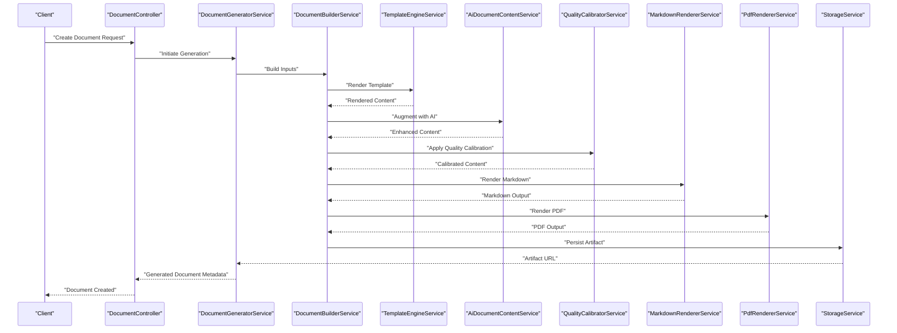
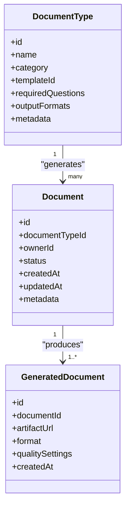
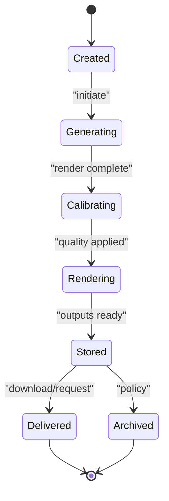
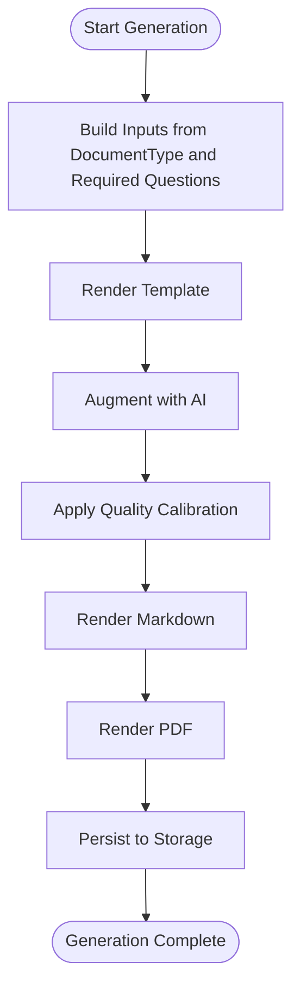
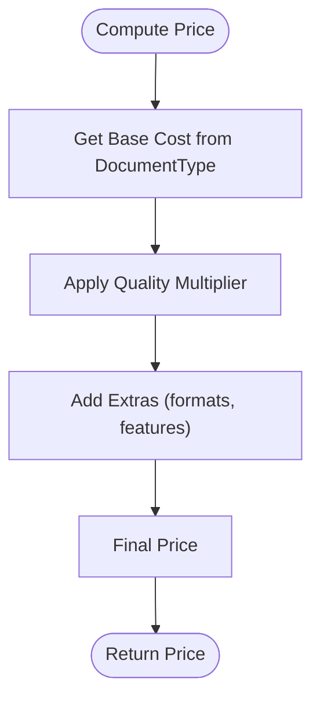
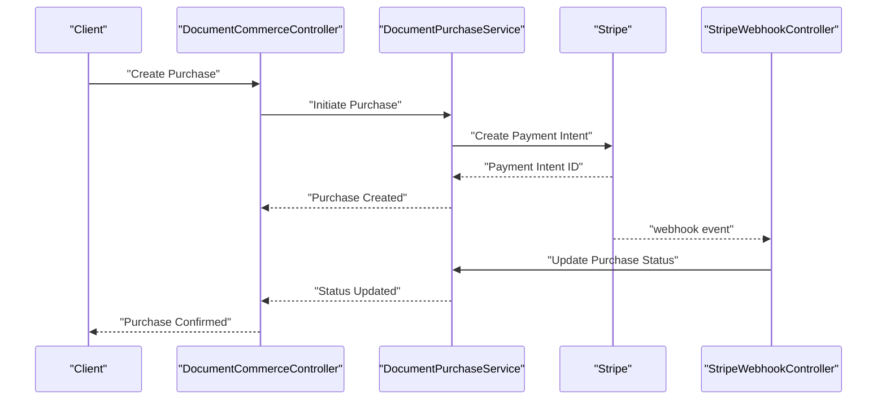
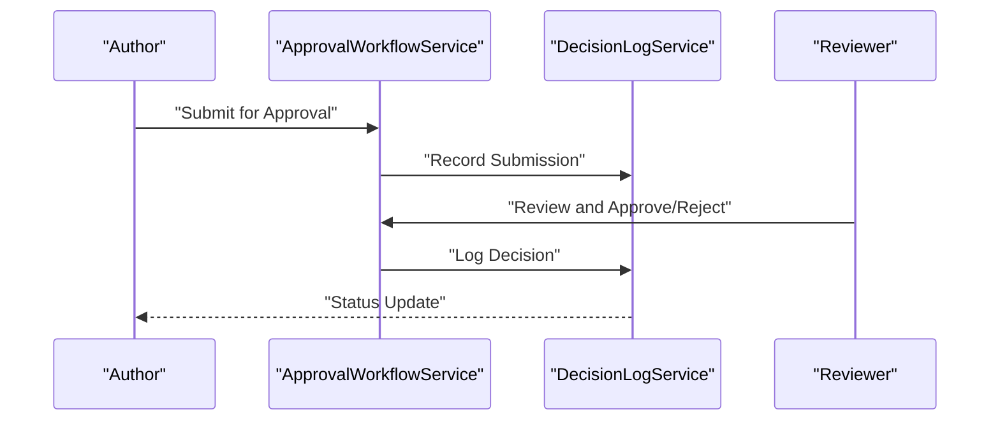
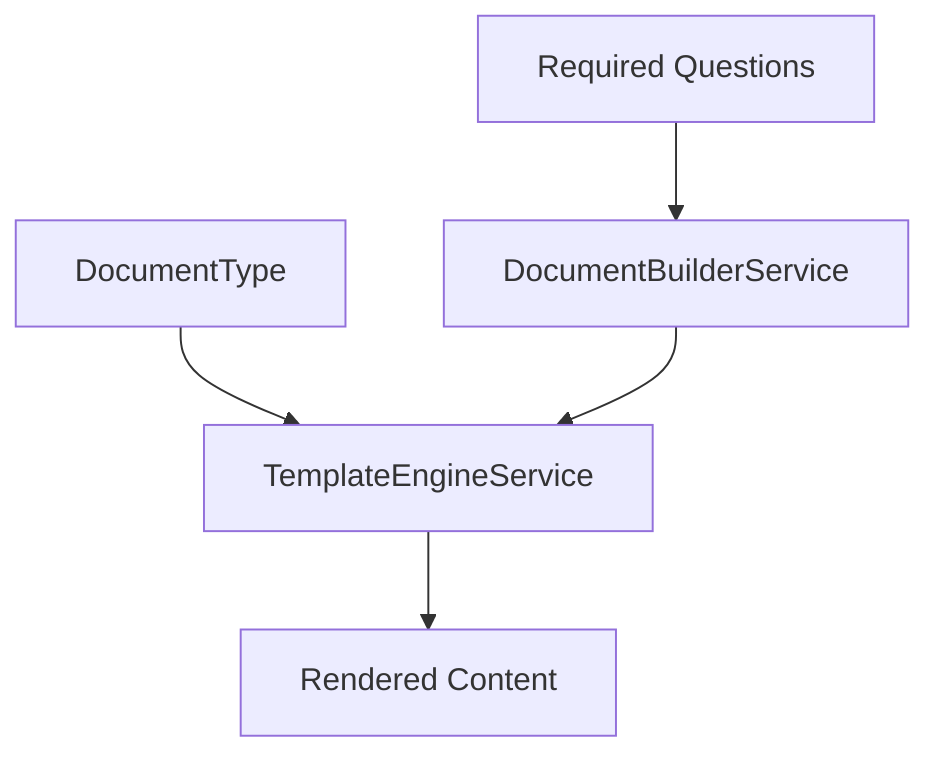
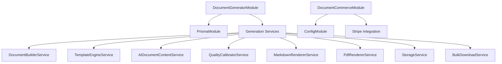

# Document Workflow Models

<cite>
**Referenced Files in This Document**
- [app.module.ts](file://apps/api/src/app.module.ts)
- [document-generator.module.ts](file://apps/api/src/modules/document-generator/document-generator.module.ts)
- [document.controller.ts](file://apps/api/src/modules/document-generator/controllers/document.controller.ts)
- [document-admin.controller.ts](file://apps/api/src/modules/document-generator/controllers/document-admin.controller.ts)
- [deliverables-compiler.controller.ts](file://apps/api/src/modules/document-generator/controllers/deliverables-compiler.controller.ts)
- [document-generator.service.ts](file://apps/api/src/modules/document-generator/services/document-generator.service.ts)
- [document-builder.service.ts](file://apps/api/src/modules/document-generator/services/document-builder.service.ts)
- [template-engine.service.ts](file://apps/api/src/modules/document-generator/services/template-engine.service.ts)
- [storage.service.ts](file://apps/api/src/modules/document-generator/services/storage.service.ts)
- [deliverables-compiler.service.ts](file://apps/api/src/modules/document-generator/services/deliverables-compiler.service.ts)
- [ai-document-content.service.ts](file://apps/api/src/modules/document-generator/services/ai-document-content.service.ts)
- [quality-calibrator.service.ts](file://apps/api/src/modules/document-generator/services/quality-calibrator.service.ts)
- [markdown-renderer.service.ts](file://apps/api/src/modules/document-generator/services/markdown-renderer.service.ts)
- [pdf-renderer.service.ts](file://apps/api/src/modules/document-generator/services/pdf-renderer.service.ts)
- [provider-comparison.service.ts](file://apps/api/src/modules/document-generator/services/provider-comparison.service.ts)
- [bulk-download.service.ts](file://apps/api/src/modules/document-generator/services/bulk-download.service.ts)
- [document-commerce.module.ts](file://apps/api/src/modules/document-commerce/document-commerce.module.ts)
- [document-commerce.controller.ts](file://apps/api/src/modules/document-commerce/document-commerce.controller.ts)
- [pricing-calculator.service.ts](file://apps/api/src/modules/document-commerce/services/pricing-calculator.service.ts)
- [document-purchase.service.ts](file://apps/api/src/modules/document-commerce/services/document-purchase.service.ts)
- [stripe-webhook.controller.ts](file://apps/api/src/modules/document-commerce/stripe-webhook.controller.ts)
- [approval-workflow.service.ts](file://apps/api/src/modules/decision-log/approval-workflow.service.ts)
- [decision-log.service.ts](file://apps/api/src/modules/decision-log/decision-log.service.ts)
- [schema.prisma](file://prisma/schema.prisma)
- [generation-flow.e2e.test.ts](file://e2e/document-generation/generation-flow.e2e.test.ts)
- [payment.e2e.test.ts](file://e2e/payment/payment.e2e.test.ts)
</cite>

## Table of Contents
1. [Introduction](#introduction)
2. [Project Structure](#project-structure)
3. [Core Components](#core-components)
4. [Architecture Overview](#architecture-overview)
5. [Detailed Component Analysis](#detailed-component-analysis)
6. [Dependency Analysis](#dependency-analysis)
7. [Performance Considerations](#performance-considerations)
8. [Troubleshooting Guide](#troubleshooting-guide)
9. [Conclusion](#conclusion)
10. [Appendices](#appendices)

## Introduction
This document describes the document generation and workflow models implemented in the system. It covers DocumentType, Document, GeneratedDocument, and related entities; document categories and output formats; generation workflows; pricing system with quality sliders; payment integration; document lifecycle management; template mapping and required questions; generation metadata; approval workflows and review status tracking; and storage integration. It also provides examples of document creation, generation processes, and commerce workflows.

## Project Structure
The document generation and commerce capabilities are implemented as NestJS modules integrated into the main application module. The document generator module exposes controllers for document creation, administration, and deliverables compilation, along with a set of service providers responsible for building, templating, rendering, quality calibration, storage, and bulk operations. The document commerce module handles pricing, purchases, and Stripe webhook integration.

```mermaid
graph TB
subgraph "Application Layer"
AppModule["AppModule<br/>loads core modules"]
end
subgraph "Document Generator Module"
DGModule["DocumentGeneratorModule"]
DGCtl["DocumentController"]
DGAdminCtl["DocumentAdminController"]
DGCmpCtl["DeliverablesCompilerController"]
DGService["DocumentGeneratorService"]
DBService["DocumentBuilderService"]
TEService["TemplateEngineService"]
SvcService["StorageService"]
DCService["DeliverablesCompilerService"]
AIDocSvc["AiDocumentContentService"]
QCService["QualityCalibratorService"]
MRService["MarkdownRendererService"]
PDFService["PdfRendererService"]
PCSvc["ProviderComparisonService"]
BDLService["BulkDownloadService"]
end
subgraph "Document Commerce Module"
DCModule["DocumentCommerceModule"]
DCCtl["DocumentCommerceController"]
PrcCalcSvc["PricingCalculatorService"]
DocPurSvc["DocumentPurchaseService"]
StripeHookCtl["StripeWebhookController"]
end
AppModule --> DGModule
AppModule --> DCModule
DGModule --> DGCtl
DGModule --> DGAdminCtl
DGModule --> DGCmpCtl
DGModule --> DGService
DGModule --> DBService
DGModule --> TEService
DGModule --> SvcService
DGModule --> DCService
DGModule --> AIDocSvc
DGModule --> QCService
DGModule --> MRService
DGModule --> PDFService
DGModule --> PCSvc
DGModule --> BDLService
DCModule --> DCCtl
DCModule --> PrcCalcSvc
DCModule --> DocPurSvc
DCModule --> StripeHookCtl
```

**Diagram sources**
- [app.module.ts:53-128](file://apps/api/src/app.module.ts#L53-L128)
- [document-generator.module.ts:19-45](file://apps/api/src/modules/document-generator/document-generator.module.ts#L19-L45)
- [document-commerce.module.ts](file://apps/api/src/modules/document-commerce/document-commerce.module.ts)

**Section sources**
- [app.module.ts:53-128](file://apps/api/src/app.module.ts#L53-L128)
- [document-generator.module.ts:19-45](file://apps/api/src/modules/document-generator/document-generator.module.ts#L19-L45)
- [document-commerce.module.ts](file://apps/api/src/modules/document-commerce/document-commerce.module.ts)

## Core Components
- DocumentType: Defines categories and metadata for document templates and generation rules.
- Document: Represents a generated document instance with lifecycle, ownership, and metadata.
- GeneratedDocument: The final artifact produced by the generation pipeline, stored and retrievable.
- Pricing system: Computes cost based on quality settings and document attributes.
- Payment integration: Handles purchase initiation and Stripe webhook events.
- Approval workflow: Manages review and approval steps for documents.
- Storage integration: Persists and retrieves generated artifacts.

Key services and controllers:
- Controllers: DocumentController, DocumentAdminController, DeliverablesCompilerController
- Services: DocumentGeneratorService, DocumentBuilderService, TemplateEngineService, StorageService, DeliverablesCompilerService, AiDocumentContentService, QualityCalibratorService, MarkdownRendererService, PdfRendererService, ProviderComparisonService, BulkDownloadService
- Commerce services: PricingCalculatorService, DocumentPurchaseService, StripeWebhookController

**Section sources**
- [document.controller.ts](file://apps/api/src/modules/document-generator/controllers/document.controller.ts)
- [document-admin.controller.ts](file://apps/api/src/modules/document-generator/controllers/document-admin.controller.ts)
- [deliverables-compiler.controller.ts](file://apps/api/src/modules/document-generator/controllers/deliverables-compiler.controller.ts)
- [document-generator.service.ts](file://apps/api/src/modules/document-generator/services/document-generator.service.ts)
- [document-builder.service.ts](file://apps/api/src/modules/document-generator/services/document-builder.service.ts)
- [template-engine.service.ts](file://apps/api/src/modules/document-generator/services/template-engine.service.ts)
- [storage.service.ts](file://apps/api/src/modules/document-generator/services/storage.service.ts)
- [deliverables-compiler.service.ts](file://apps/api/src/modules/document-generator/services/deliverables-compiler.service.ts)
- [ai-document-content.service.ts](file://apps/api/src/modules/document-generator/services/ai-document-content.service.ts)
- [quality-calibrator.service.ts](file://apps/api/src/modules/document-generator/services/quality-calibrator.service.ts)
- [markdown-renderer.service.ts](file://apps/api/src/modules/document-generator/services/markdown-renderer.service.ts)
- [pdf-renderer.service.ts](file://apps/api/src/modules/document-generator/services/pdf-renderer.service.ts)
- [provider-comparison.service.ts](file://apps/api/src/modules/document-generator/services/provider-comparison.service.ts)
- [bulk-download.service.ts](file://apps/api/src/modules/document-generator/services/bulk-download.service.ts)
- [pricing-calculator.service.ts](file://apps/api/src/modules/document-commerce/services/pricing-calculator.service.ts)
- [document-purchase.service.ts](file://apps/api/src/modules/document-commerce/services/document-purchase.service.ts)
- [stripe-webhook.controller.ts](file://apps/api/src/modules/document-commerce/stripe-webhook.controller.ts)
- [approval-workflow.service.ts](file://apps/api/src/modules/decision-log/approval-workflow.service.ts)
- [decision-log.service.ts](file://apps/api/src/modules/decision-log/decision-log.service.ts)

## Architecture Overview
The document generation workflow integrates multiple services:
- Input: DocumentType definition, required questions/inputs, and quality preferences.
- Processing: TemplateEngine renders content, AiDocumentContentService augments with AI, QualityCalibratorService applies quality calibrations, MarkdownRendererService and PdfRendererService produce outputs.
- Storage: StorageService persists artifacts; BulkDownloadService supports batch retrieval.
- Commerce: PricingCalculatorService computes price; DocumentPurchaseService manages purchase lifecycle; StripeWebhookController handles payment events.
- Administration: DocumentAdminController and DeliverablesCompilerController manage internal workflows and deliverables packaging.

**Diagram sources**
- [document.controller.ts](file://apps/api/src/modules/document-generator/controllers/document.controller.ts)
- [document-generator.service.ts](file://apps/api/src/modules/document-generator/services/document-generator.service.ts)
- [document-builder.service.ts](file://apps/api/src/modules/document-generator/services/document-builder.service.ts)
- [template-engine.service.ts](file://apps/api/src/modules/document-generator/services/template-engine.service.ts)
- [ai-document-content.service.ts](file://apps/api/src/modules/document-generator/services/ai-document-content.service.ts)
- [quality-calibrator.service.ts](file://apps/api/src/modules/document-generator/services/quality-calibrator.service.ts)
- [markdown-renderer.service.ts](file://apps/api/src/modules/document-generator/services/markdown-renderer.service.ts)
- [pdf-renderer.service.ts](file://apps/api/src/modules/document-generator/services/pdf-renderer.service.ts)
- [storage.service.ts](file://apps/api/src/modules/document-generator/services/storage.service.ts)

## Detailed Component Analysis

### DocumentType and Categories
DocumentType defines the category and generation rules for documents. It determines:
- Template mapping and required questions
- Output formats (Markdown, PDF)
- Quality calibration parameters
- Pricing attributes

**Diagram sources**
- [schema.prisma](file://prisma/schema.prisma)

**Section sources**
- [schema.prisma](file://prisma/schema.prisma)

### Document Lifecycle Management
Lifecycle stages include creation, generation, quality calibration, rendering, storage, and delivery. Status transitions are managed by the generation service and controllers.

**Diagram sources**
- [document-generator.service.ts](file://apps/api/src/modules/document-generator/services/document-generator.service.ts)
- [document.controller.ts](file://apps/api/src/modules/document-generator/controllers/document.controller.ts)

**Section sources**
- [document-generator.service.ts](file://apps/api/src/modules/document-generator/services/document-generator.service.ts)
- [document.controller.ts](file://apps/api/src/modules/document-generator/controllers/document.controller.ts)

### Generation Workflows
- Template mapping: TemplateEngineService resolves templates and merges inputs.
- Content augmentation: AiDocumentContentService enriches content based on context.
- Quality calibration: QualityCalibratorService adjusts outputs according to quality settings.
- Rendering: MarkdownRendererService and PdfRendererService produce final outputs.
- Storage: StorageService persists artifacts and returns URLs.

**Diagram sources**
- [document-builder.service.ts](file://apps/api/src/modules/document-generator/services/document-builder.service.ts)
- [template-engine.service.ts](file://apps/api/src/modules/document-generator/services/template-engine.service.ts)
- [ai-document-content.service.ts](file://apps/api/src/modules/document-generator/services/ai-document-content.service.ts)
- [quality-calibrator.service.ts](file://apps/api/src/modules/document-generator/services/quality-calibrator.service.ts)
- [markdown-renderer.service.ts](file://apps/api/src/modules/document-generator/services/markdown-renderer.service.ts)
- [pdf-renderer.service.ts](file://apps/api/src/modules/document-generator/services/pdf-renderer.service.ts)
- [storage.service.ts](file://apps/api/src/modules/document-generator/services/storage.service.ts)

**Section sources**
- [document-builder.service.ts](file://apps/api/src/modules/document-generator/services/document-builder.service.ts)
- [template-engine.service.ts](file://apps/api/src/modules/document-generator/services/template-engine.service.ts)
- [ai-document-content.service.ts](file://apps/api/src/modules/document-generator/services/ai-document-content.service.ts)
- [quality-calibrator.service.ts](file://apps/api/src/modules/document-generator/services/quality-calibrator.service.ts)
- [markdown-renderer.service.ts](file://apps/api/src/modules/document-generator/services/markdown-renderer.service.ts)
- [pdf-renderer.service.ts](file://apps/api/src/modules/document-generator/services/pdf-renderer.service.ts)
- [storage.service.ts](file://apps/api/src/modules/document-generator/services/storage.service.ts)

### Pricing System and Quality Sliders
Pricing is computed by PricingCalculatorService using:
- Base cost per document type
- Quality multiplier derived from quality slider selections
- Optional surcharges for additional formats or features

**Diagram sources**
- [pricing-calculator.service.ts](file://apps/api/src/modules/document-commerce/services/pricing-calculator.service.ts)

**Section sources**
- [pricing-calculator.service.ts](file://apps/api/src/modules/document-commerce/services/pricing-calculator.service.ts)

### Payment Integration and Commerce Workflows
DocumentPurchaseService coordinates purchase creation and completion. StripeWebhookController processes payment events to update purchase and document statuses.

**Diagram sources**
- [document-commerce.controller.ts](file://apps/api/src/modules/document-commerce/document-commerce.controller.ts)
- [document-purchase.service.ts](file://apps/api/src/modules/document-commerce/services/document-purchase.service.ts)
- [stripe-webhook.controller.ts](file://apps/api/src/modules/document-commerce/stripe-webhook.controller.ts)

**Section sources**
- [document-commerce.controller.ts](file://apps/api/src/modules/document-commerce/document-commerce.controller.ts)
- [document-purchase.service.ts](file://apps/api/src/modules/document-commerce/services/document-purchase.service.ts)
- [stripe-webhook.controller.ts](file://apps/api/src/modules/document-commerce/stripe-webhook.controller.ts)

### Approval Workflows and Review Status Tracking
ApprovalWorkflowService and DecisionLogService manage review and approval steps, tracking decisions and status transitions for documents requiring governance.

**Diagram sources**
- [approval-workflow.service.ts](file://apps/api/src/modules/decision-log/approval-workflow.service.ts)
- [decision-log.service.ts](file://apps/api/src/modules/decision-log/decision-log.service.ts)

**Section sources**
- [approval-workflow.service.ts](file://apps/api/src/modules/decision-log/approval-workflow.service.ts)
- [decision-log.service.ts](file://apps/api/src/modules/decision-log/decision-log.service.ts)

### Template Mapping and Required Questions
TemplateEngineService resolves templates based on DocumentType and merges inputs collected from required questions. The builder validates required fields and prepares content for rendering.

**Diagram sources**
- [template-engine.service.ts](file://apps/api/src/modules/document-generator/services/template-engine.service.ts)
- [document-builder.service.ts](file://apps/api/src/modules/document-generator/services/document-builder.service.ts)

**Section sources**
- [template-engine.service.ts](file://apps/api/src/modules/document-generator/services/template-engine.service.ts)
- [document-builder.service.ts](file://apps/api/src/modules/document-generator/services/document-builder.service.ts)

### Examples

#### Example: Document Creation and Generation
- Client submits a request to create a document using a specific DocumentType.
- DocumentController delegates to DocumentGeneratorService.
- The service builds inputs, renders the template, augments with AI, applies quality calibration, renders outputs, and stores artifacts.
- The controller returns metadata including artifact URLs.

**Section sources**
- [document.controller.ts](file://apps/api/src/modules/document-generator/controllers/document.controller.ts)
- [document-generator.service.ts](file://apps/api/src/modules/document-generator/services/document-generator.service.ts)
- [document-builder.service.ts](file://apps/api/src/modules/document-generator/services/document-builder.service.ts)
- [template-engine.service.ts](file://apps/api/src/modules/document-generator/services/template-engine.service.ts)
- [ai-document-content.service.ts](file://apps/api/src/modules/document-generator/services/ai-document-content.service.ts)
- [quality-calibrator.service.ts](file://apps/api/src/modules/document-generator/services/quality-calibrator.service.ts)
- [markdown-renderer.service.ts](file://apps/api/src/modules/document-generator/services/markdown-renderer.service.ts)
- [pdf-renderer.service.ts](file://apps/api/src/modules/document-generator/services/pdf-renderer.service.ts)
- [storage.service.ts](file://apps/api/src/modules/document-generator/services/storage.service.ts)

#### Example: Commerce Workflow
- Client initiates a purchase via DocumentCommerceController.
- DocumentPurchaseService creates a payment intent with PricingCalculatorService-derived price.
- Stripe webhook updates the purchase and document status asynchronously.

**Section sources**
- [document-commerce.controller.ts](file://apps/api/src/modules/document-commerce/document-commerce.controller.ts)
- [pricing-calculator.service.ts](file://apps/api/src/modules/document-commerce/services/pricing-calculator.service.ts)
- [document-purchase.service.ts](file://apps/api/src/modules/document-commerce/services/document-purchase.service.ts)
- [stripe-webhook.controller.ts](file://apps/api/src/modules/document-commerce/stripe-webhook.controller.ts)

#### Example: End-to-End Generation Flow
- E2E tests demonstrate the end-to-end flow from questionnaire submission to document generation and delivery.

**Section sources**
- [generation-flow.e2e.test.ts](file://e2e/document-generation/generation-flow.e2e.test.ts)
- [payment.e2e.test.ts](file://e2e/payment/payment.e2e.test.ts)

## Dependency Analysis
The DocumentGeneratorModule depends on PrismaModule for persistence and exposes multiple services for generation, templating, rendering, quality, storage, and bulk operations. The DocumentCommerceModule depends on configuration and integrates with Stripe for payments.

**Diagram sources**
- [document-generator.module.ts:19-45](file://apps/api/src/modules/document-generator/document-generator.module.ts#L19-L45)
- [document-commerce.module.ts](file://apps/api/src/modules/document-commerce/document-commerce.module.ts)

**Section sources**
- [document-generator.module.ts:19-45](file://apps/api/src/modules/document-generator/document-generator.module.ts#L19-L45)
- [document-commerce.module.ts](file://apps/api/src/modules/document-commerce/document-commerce.module.ts)

## Performance Considerations
- Asynchronous processing: Use background jobs for heavy rendering and storage operations.
- Caching: Cache frequently accessed templates and rendered outputs.
- Concurrency limits: Apply rate limiting and queue-based processing to prevent overload.
- Streaming: Stream large PDFs and bulk downloads to reduce memory usage.
- Quality trade-offs: Allow clients to select quality levels to balance speed and cost.

## Troubleshooting Guide
Common issues and resolutions:
- Generation failures: Verify template availability and required questions mapping; check AI provider connectivity and quality calibrator settings.
- Storage errors: Confirm storage credentials and permissions; validate artifact URLs.
- Payment failures: Inspect Stripe webhook logs and retry mechanisms; reconcile intents with purchase records.
- Approval bottlenecks: Monitor decision log entries and reviewer assignments.

**Section sources**
- [document-generator.service.ts](file://apps/api/src/modules/document-generator/services/document-generator.service.ts)
- [storage.service.ts](file://apps/api/src/modules/document-generator/services/storage.service.ts)
- [document-purchase.service.ts](file://apps/api/src/modules/document-commerce/services/document-purchase.service.ts)
- [decision-log.service.ts](file://apps/api/src/modules/decision-log/decision-log.service.ts)

## Conclusion
The document generation and workflow models provide a robust framework for creating, managing, and delivering documents with configurable quality, pricing, and governance. The modular architecture enables extensibility, while services encapsulate specialized responsibilities for templating, rendering, quality calibration, storage, and commerce.

## Appendices
- Entity relationships are defined in the Prisma schema.
- End-to-end tests validate generation and payment flows.

**Section sources**
- [schema.prisma](file://prisma/schema.prisma)
- [generation-flow.e2e.test.ts](file://e2e/document-generation/generation-flow.e2e.test.ts)
- [payment.e2e.test.ts](file://e2e/payment/payment.e2e.test.ts)