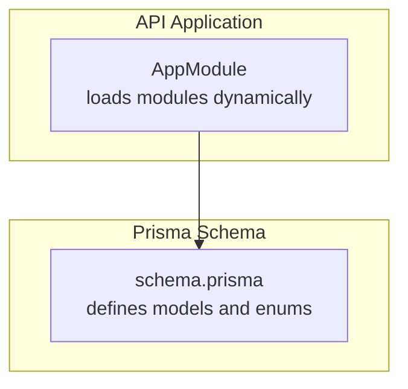
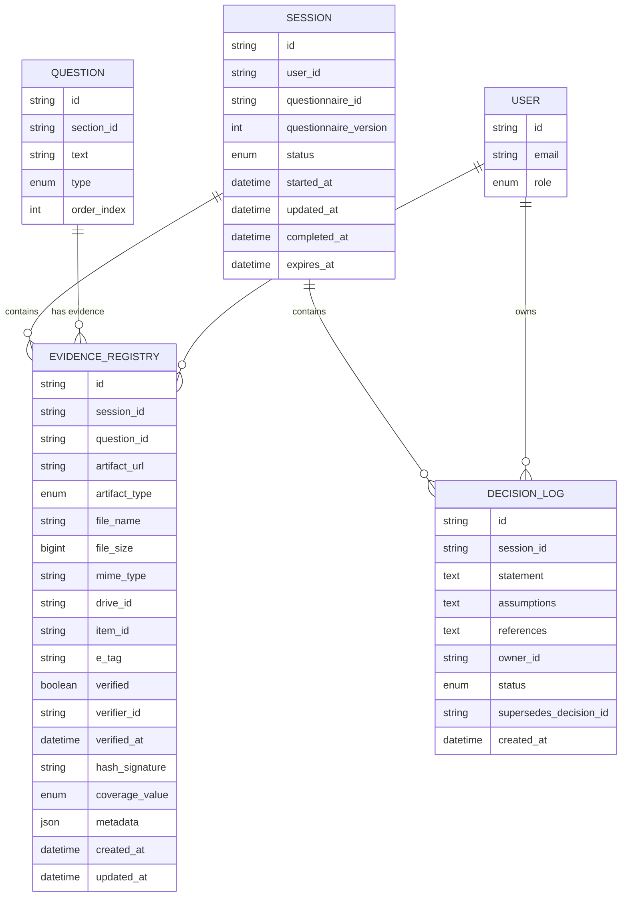
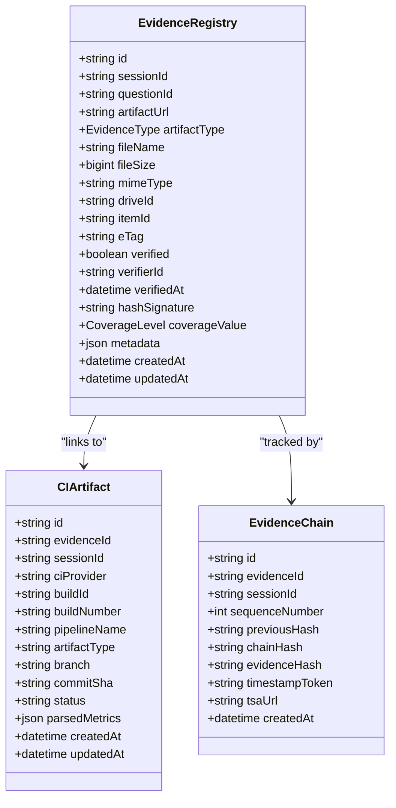
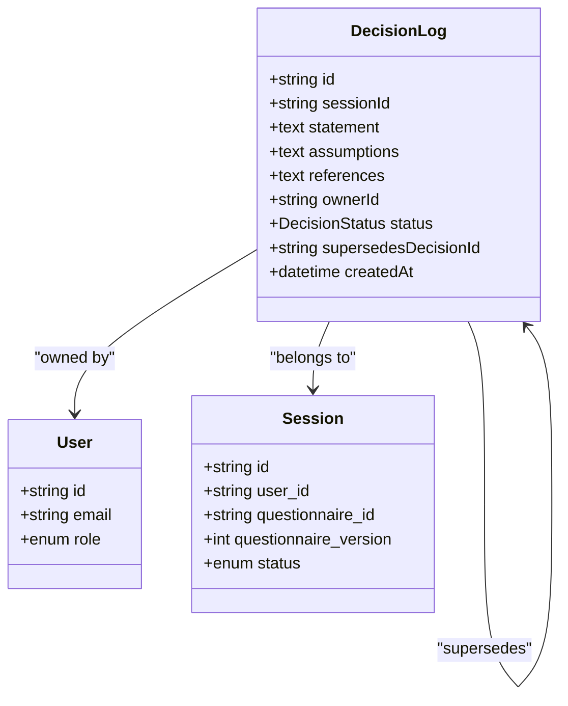
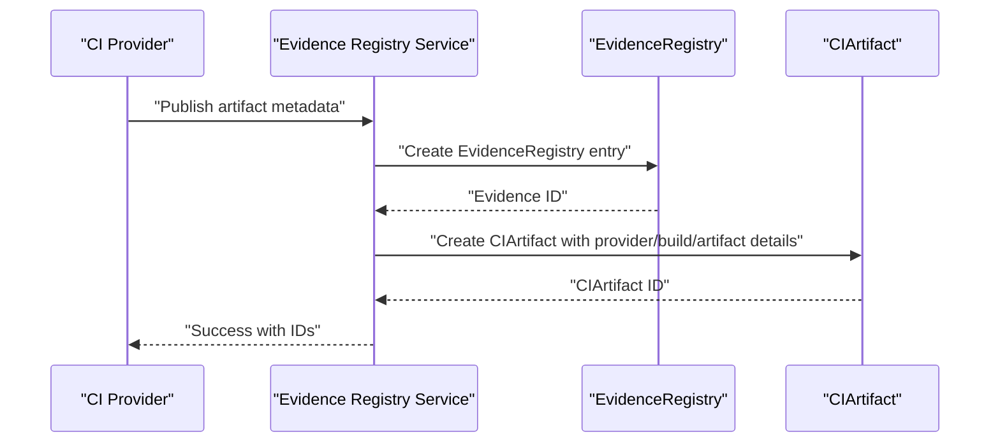
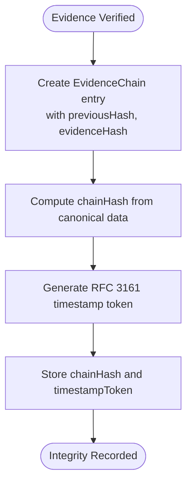
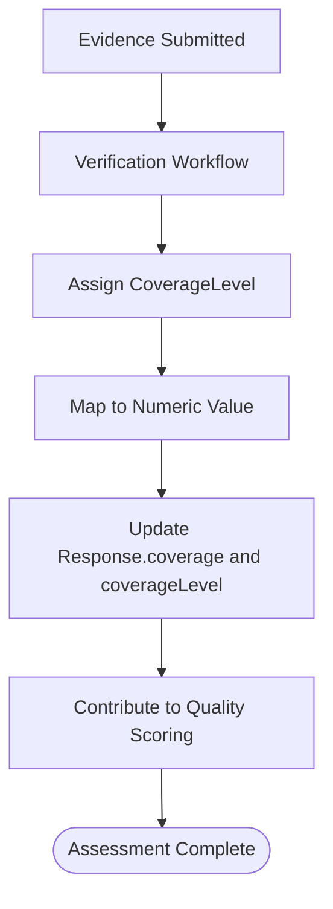
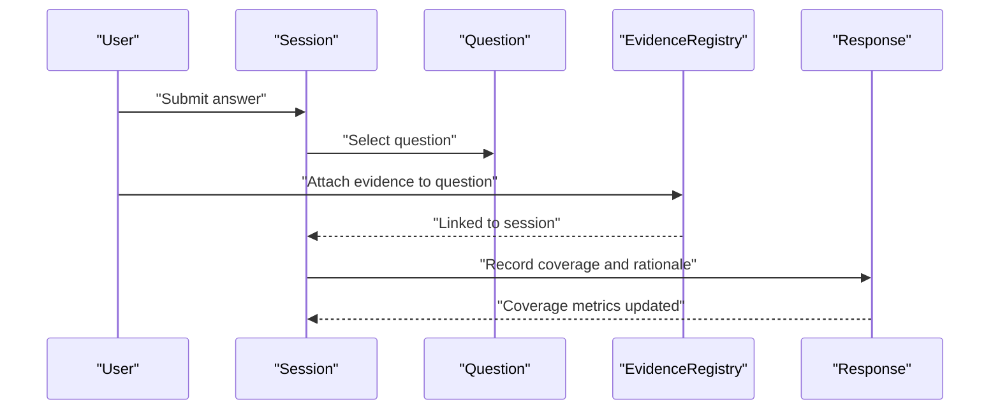
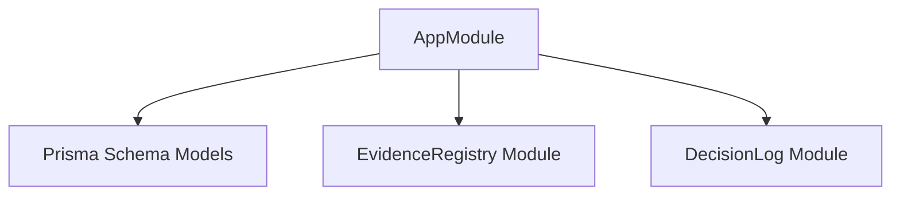

# Evidence & Decision Models

<cite>
**Referenced Files in This Document**
- [schema.prisma](file://prisma/schema.prisma)
- [app.module.ts](file://apps/api/src/app.module.ts)
</cite>

## Table of Contents
1. [Introduction](#introduction)
2. [Project Structure](#project-structure)
3. [Core Components](#core-components)
4. [Architecture Overview](#architecture-overview)
5. [Detailed Component Analysis](#detailed-component-analysis)
6. [Dependency Analysis](#dependency-analysis)
7. [Performance Considerations](#performance-considerations)
8. [Troubleshooting Guide](#troubleshooting-guide)
9. [Conclusion](#conclusion)

## Introduction
This document explains the Evidence Registry and Decision Log models and their supporting subsystems for CI artifact ingestion, integrity verification, and provenance tracking. It covers:
- Evidence artifact types and verification workflows
- Coverage assessment using the 5-level scale
- Append-only Decision Log system with status tracking and supersession patterns
- Evidence attachment to questions and integration with quality scoring
- Practical examples of submission, verification, and decision documentation

## Project Structure
The models are defined in the Prisma schema and conditionally exposed in the API application module via a feature flag.

**Diagram sources**
- [app.module.ts:36-51](file://apps/api/src/app.module.ts#L36-L51)
- [schema.prisma:1-120](file://prisma/schema.prisma#L1-L120)

**Section sources**
- [app.module.ts:32-51](file://apps/api/src/app.module.ts#L32-L51)
- [schema.prisma:1-120](file://prisma/schema.prisma#L1-L120)

## Core Components
This section introduces the primary entities and their roles in the evidence and decision lifecycle.

- EvidenceRegistry: Stores uploaded or ingested evidence artifacts, verification state, and coverage contribution.
- DecisionLog: Append-only record of decisions with status and supersession tracking.
- EvidenceType: Enumerates supported artifact types (file, image, link, log, SBOM, report, test result, screenshot, document).
- DecisionStatus: Enumerates decision statuses (draft, locked, amended, superseded).
- CoverageLevel: Enumerates discrete coverage levels (none, partial, half, substantial, full) mapped to numeric values for scoring.
- CIArtifact: Tracks CI/CD pipeline artifacts ingested as evidence.
- EvidenceChain: Provides blockchain-style hash chaining for integrity and timestamping.

**Section sources**
- [schema.prisma:91-120](file://prisma/schema.prisma#L91-L120)
- [schema.prisma:635-674](file://prisma/schema.prisma#L635-L674)
- [schema.prisma:676-706](file://prisma/schema.prisma#L676-L706)
- [schema.prisma:893-924](file://prisma/schema.prisma#L893-L924)
- [schema.prisma:868-891](file://prisma/schema.prisma#L868-L891)

## Architecture Overview
The Evidence Registry and Decision Log integrate with sessions and questions to support:
- Evidence submission and verification
- Coverage assessment and scoring
- Decision documentation with append-only semantics and supersession

**Diagram sources**
- [schema.prisma:635-674](file://prisma/schema.prisma#L635-L674)
- [schema.prisma:676-706](file://prisma/schema.prisma#L676-L706)
- [schema.prisma:512-560](file://prisma/schema.prisma#L512-L560)
- [schema.prisma:446-490](file://prisma/schema.prisma#L446-L490)
- [schema.prisma:245-286](file://prisma/schema.prisma#L245-L286)

## Detailed Component Analysis

### Evidence Registry
EvidenceRegistry captures submitted or ingested evidence with verification and coverage metadata. It links to a session and question, supports multiple artifact types, and integrates with CI artifacts and integrity chains.

Key capabilities:
- Artifact metadata: URL, type, filename, size, MIME type, SharePoint identifiers, and eTag for concurrency.
- Verification workflow: verifier identity, timestamp, cryptographic signature/hash, and coverage level assignment upon verification.
- CI artifact linkage: connects to pipeline artifacts for automated ingestion and provenance.
- Integrity tracking: supports EvidenceChain entries for hash chaining and timestamping.

**Diagram sources**
- [schema.prisma:635-674](file://prisma/schema.prisma#L635-L674)
- [schema.prisma:893-924](file://prisma/schema.prisma#L893-L924)
- [schema.prisma:868-891](file://prisma/schema.prisma#L868-L891)

**Section sources**
- [schema.prisma:635-674](file://prisma/schema.prisma#L635-L674)
- [schema.prisma:893-924](file://prisma/schema.prisma#L893-L924)
- [schema.prisma:868-891](file://prisma/schema.prisma#L868-L891)

### Decision Log
DecisionLog maintains an append-only record of decisions within a session. It tracks ownership, status, and supersession relationships to preserve historical context and auditability.

Key capabilities:
- Append-only semantics: decisions are never modified after creation.
- Status tracking: draft, locked, amended, superseded.
- Supersession pattern: each decision can supersede another, forming a chain of replacements.
- Ownership: linked to a user who owns the decision.

**Diagram sources**
- [schema.prisma:676-706](file://prisma/schema.prisma#L676-L706)
- [schema.prisma:245-286](file://prisma/schema.prisma#L245-L286)
- [schema.prisma:512-560](file://prisma/schema.prisma#L512-L560)

**Section sources**
- [schema.prisma:676-706](file://prisma/schema.prisma#L676-L706)

### CI Artifact Ingestion and Provenance
CIArtifact tracks CI/CD pipeline artifacts associated with evidence. It enables automated ingestion of test results, SBOMs, coverage reports, and other build outputs, linking them to the EvidenceRegistry and capturing provider-specific metadata.

**Diagram sources**
- [schema.prisma:893-924](file://prisma/schema.prisma#L893-L924)
- [schema.prisma:635-674](file://prisma/schema.prisma#L635-L674)

**Section sources**
- [schema.prisma:893-924](file://prisma/schema.prisma#L893-L924)

### Evidence Integrity and Timestamping
EvidenceChain provides a blockchain-style hash chain for evidence integrity. Each entry includes a canonical chain hash, the original evidence hash, and an RFC 3161 timestamp token for verifiable time-stamping.

**Diagram sources**
- [schema.prisma:868-891](file://prisma/schema.prisma#L868-L891)

**Section sources**
- [schema.prisma:868-891](file://prisma/schema.prisma#L868-L891)

### Coverage Assessment Using the 5-Level Scale
CoverageLevel defines discrete levels mapped to numeric values for scoring:
- None: 0.00
- Partial: 0.25
- Half: 0.50
- Substantial: 0.75
- Full: 1.00

EvidenceRegistry captures coverageValue during verification. Responses also track coverage, coverageLevel, and rationale for transparency.

**Diagram sources**
- [schema.prisma:112-120](file://prisma/schema.prisma#L112-L120)
- [schema.prisma:653-662](file://prisma/schema.prisma#L653-L662)
- [schema.prisma:589-596](file://prisma/schema.prisma#L589-L596)

**Section sources**
- [schema.prisma:112-120](file://prisma/schema.prisma#L112-L120)
- [schema.prisma:653-662](file://prisma/schema.prisma#L653-L662)
- [schema.prisma:589-596](file://prisma/schema.prisma#L589-L596)

### Evidence Attachment to Questions and Quality Scoring Integration
EvidenceRegistry links to a specific question within a session. Responses capture coverage metrics and rationale, enabling downstream quality scoring and readiness assessments.

**Diagram sources**
- [schema.prisma:635-674](file://prisma/schema.prisma#L635-L674)
- [schema.prisma:579-608](file://prisma/schema.prisma#L579-L608)
- [schema.prisma:446-490](file://prisma/schema.prisma#L446-L490)
- [schema.prisma:512-560](file://prisma/schema.prisma#L512-L560)

**Section sources**
- [schema.prisma:635-674](file://prisma/schema.prisma#L635-L674)
- [schema.prisma:579-608](file://prisma/schema.prisma#L579-L608)
- [schema.prisma:446-490](file://prisma/schema.prisma#L446-L490)
- [schema.prisma:512-560](file://prisma/schema.prisma#L512-L560)

## Dependency Analysis
Evidence Registry and Decision Log depend on sessions, questions, and users. The conditional module loading in the API ensures these legacy features are only included when enabled.

**Diagram sources**
- [app.module.ts:36-51](file://apps/api/src/app.module.ts#L36-L51)
- [schema.prisma:635-674](file://prisma/schema.prisma#L635-L674)
- [schema.prisma:676-706](file://prisma/schema.prisma#L676-L706)

**Section sources**
- [app.module.ts:36-51](file://apps/api/src/app.module.ts#L36-L51)

## Performance Considerations
- Indexing: EvidenceRegistry and DecisionLog include indexes on frequently queried fields (session, owner, status, created_at) to optimize lookups.
- Minimal updates: DecisionLog is append-only, avoiding write amplification.
- Coverage aggregation: Responses maintain coverage metrics to reduce recomputation overhead.

[No sources needed since this section provides general guidance]

## Troubleshooting Guide
Common operational checks:
- Feature flag: Ensure ENABLE_LEGACY_MODULES is set appropriately to load Evidence Registry and Decision Log modules.
- Verification state: Confirm EvidenceRegistry verified flag and verifier metadata are populated post-verification.
- Supersession chain: Validate DecisionLog supersedes relationships to prevent orphaned decisions.
- CI ingestion: Verify CIArtifact status transitions and parsed metrics for successful ingestion.

**Section sources**
- [app.module.ts:36-51](file://apps/api/src/app.module.ts#L36-L51)
- [schema.prisma:653-662](file://prisma/schema.prisma#L653-L662)
- [schema.prisma:690-699](file://prisma/schema.prisma#L690-L699)
- [schema.prisma:910-915](file://prisma/schema.prisma#L910-L915)

## Conclusion
The Evidence Registry and Decision Log models provide a robust foundation for managing evidence artifacts, verifying their integrity, assessing coverage, and maintaining an append-only decision trail. Together with CI artifact ingestion and integrity chains, they support transparent, auditable, and reproducible decision-making aligned with quality scoring and readiness assessments.