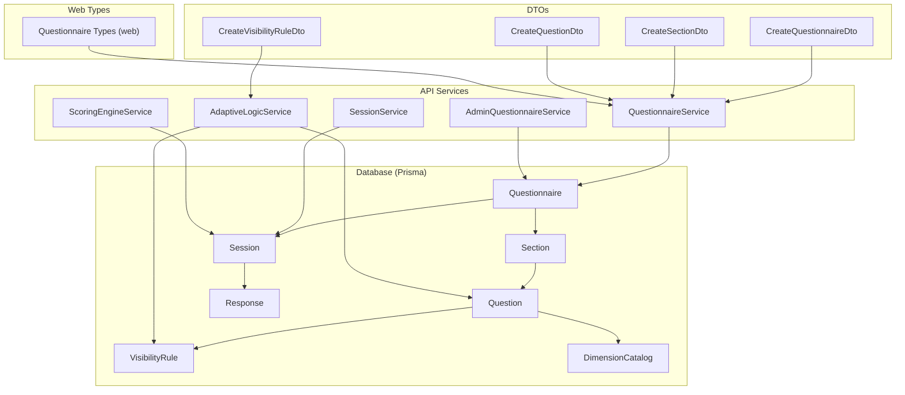
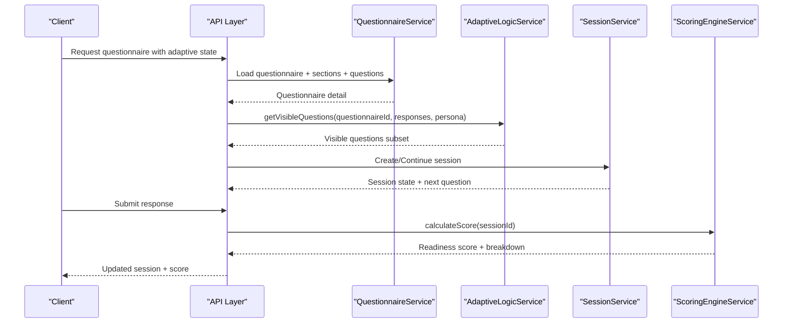
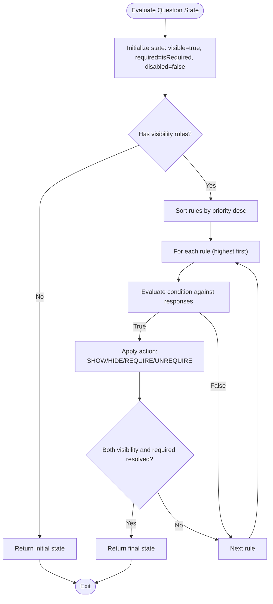
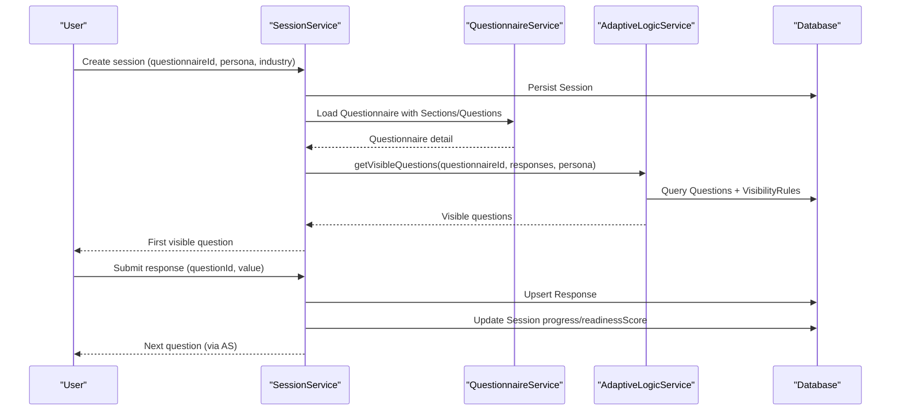
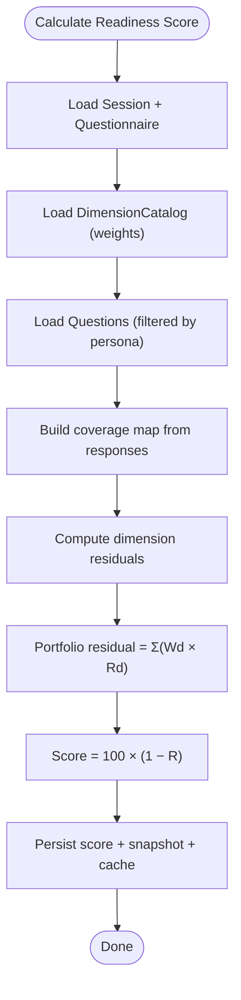
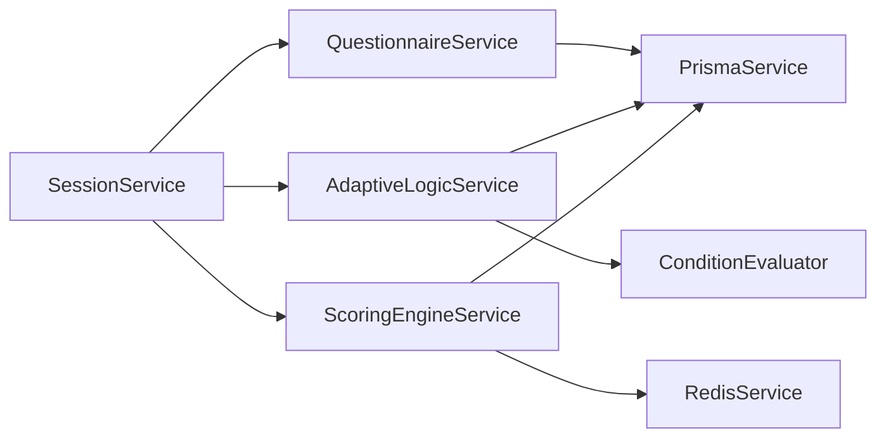

# Questionnaire System

<cite>
**Referenced Files in This Document**
- [schema.prisma](file://prisma/schema.prisma)
- [questionnaire.service.ts](file://apps/api/src/modules/questionnaire/questionnaire.service.ts)
- [admin-questionnaire.service.ts](file://apps/api/src/modules/admin/services/admin-questionnaire.service.ts)
- [create-questionnaire.dto.ts](file://apps/api/src/modules/admin/dto/create-questionnaire.dto.ts)
- [create-section.dto.ts](file://apps/api/src/modules/admin/dto/create-section.dto.ts)
- [create-question.dto.ts](file://apps/api/src/modules/admin/dto/create-question.dto.ts)
- [create-visibility-rule.dto.ts](file://apps/api/src/modules/admin/dto/create-visibility-rule.dto.ts)
- [adaptive-logic.service.ts](file://apps/api/src/modules/adaptive-logic/adaptive-logic.service.ts)
- [rule.types.ts](file://apps/api/src/modules/adaptive-logic/types/rule.types.ts)
- [condition.evaluator.ts](file://apps/api/src/modules/adaptive-logic/evaluators/condition.evaluator.ts)
- [session.service.ts](file://apps/api/src/modules/session/session.service.ts)
- [scoring-engine.service.ts](file://apps/api/src/modules/scoring-engine/scoring-engine.service.ts)
- [questionnaire.ts (web types)](file://apps/web/src/types/questionnaire.ts)
</cite>

## Table of Contents
1. [Introduction](#introduction)
2. [Project Structure](#project-structure)
3. [Core Components](#core-components)
4. [Architecture Overview](#architecture-overview)
5. [Detailed Component Analysis](#detailed-component-analysis)
6. [Dependency Analysis](#dependency-analysis)
7. [Performance Considerations](#performance-considerations)
8. [Troubleshooting Guide](#troubleshooting-guide)
9. [Conclusion](#conclusion)
10. [Appendices](#appendices)

## Introduction
This document explains the questionnaire system domain models and runtime behavior. It covers Questionnaire, Section, Question, and VisibilityRule entities, their hierarchical structure, question types, validation rules, and industry tagging. It also documents the adaptive logic system for dynamic visibility and requirement changes, persona targeting, dimension mapping, and readiness scoring integration with sessions and responses.

## Project Structure
The questionnaire domain spans the database schema, API services, DTOs, adaptive logic engine, and web frontend types. The Prisma schema defines the canonical entities and relationships. Services expose CRUD and orchestration APIs, while DTOs define validated request shapes. The adaptive logic engine evaluates visibility rules and supports branching. The scoring engine integrates coverage and dimensions to compute readiness scores.

**Diagram sources**
- [schema.prisma:351-506](file://prisma/schema.prisma#L351-L506)
- [questionnaire.service.ts:67-320](file://apps/api/src/modules/questionnaire/questionnaire.service.ts#L67-L320)
- [adaptive-logic.service.ts:19-285](file://apps/api/src/modules/adaptive-logic/adaptive-logic.service.ts#L19-L285)
- [session.service.ts:30-116](file://apps/api/src/modules/session/session.service.ts#L30-L116)
- [scoring-engine.service.ts:54-387](file://apps/api/src/modules/scoring-engine/scoring-engine.service.ts#L54-L387)
- [create-questionnaire.dto.ts:1-37](file://apps/api/src/modules/admin/dto/create-questionnaire.dto.ts#L1-L37)
- [create-section.dto.ts:1-41](file://apps/api/src/modules/admin/dto/create-section.dto.ts#L1-L41)
- [create-question.dto.ts:1-109](file://apps/api/src/modules/admin/dto/create-question.dto.ts#L1-L109)
- [create-visibility-rule.dto.ts:1-51](file://apps/api/src/modules/admin/dto/create-visibility-rule.dto.ts#L1-L51)
- [questionnaire.ts (web types):1-225](file://apps/web/src/types/questionnaire.ts#L1-L225)

**Section sources**
- [schema.prisma:351-506](file://prisma/schema.prisma#L351-L506)
- [questionnaire.service.ts:67-320](file://apps/api/src/modules/questionnaire/questionnaire.service.ts#L67-L320)
- [adaptive-logic.service.ts:19-285](file://apps/api/src/modules/adaptive-logic/adaptive-logic.service.ts#L19-L285)
- [session.service.ts:30-116](file://apps/api/src/modules/session/session.service.ts#L30-L116)
- [scoring-engine.service.ts:54-387](file://apps/api/src/modules/scoring-engine/scoring-engine.service.ts#L54-L387)
- [create-questionnaire.dto.ts:1-37](file://apps/api/src/modules/admin/dto/create-questionnaire.dto.ts#L1-L37)
- [create-section.dto.ts:1-41](file://apps/api/src/modules/admin/dto/create-section.dto.ts#L1-L41)
- [create-question.dto.ts:1-109](file://apps/api/src/modules/admin/dto/create-question.dto.ts#L1-L109)
- [create-visibility-rule.dto.ts:1-51](file://apps/api/src/modules/admin/dto/create-visibility-rule.dto.ts#L1-L51)
- [questionnaire.ts (web types):1-225](file://apps/web/src/types/questionnaire.ts#L1-L225)

## Core Components
- Questionnaire: Top-level container with metadata, versioning, and lifecycle flags. Linked to Sections and Sessions.
- Section: Ordered grouping under a Questionnaire with optional icon, estimated time, and metadata.
- Question: Individual item with type, help/explanation, validation rules, options, persona targeting, dimension mapping, and visibility rules.
- VisibilityRule: Dynamic rule that shows/hides questions or toggles required flag based on evaluated conditions.
- Session: Execution context for a user’s interaction with a Questionnaire, tracking progress, persona, industry, readiness score, and responses.
- Response: Per-question submission with validation outcome, coverage, and evidence linkage.
- DimensionCatalog: Weighted categories used by the scoring engine to compute readiness.

**Section sources**
- [schema.prisma:351-506](file://prisma/schema.prisma#L351-L506)
- [questionnaire.service.ts:56-320](file://apps/api/src/modules/questionnaire/questionnaire.service.ts#L56-L320)
- [questionnaire.ts (web types):147-197](file://apps/web/src/types/questionnaire.ts#L147-L197)

## Architecture Overview
The system separates concerns across schema, services, and presentation:
- Data modeling: Prisma schema defines entities and foreign keys.
- Orchestration: QuestionnaireService exposes read APIs; AdminQuestionnaireService handles authoring; SessionService coordinates session lifecycle; AdaptiveLogicService computes visibility; ScoringEngineService calculates readiness.
- Validation: DTOs enforce request constraints.
- Frontend: Web types mirror Questionnaire/Section/Question structures and support rendering.

**Diagram sources**
- [questionnaire.service.ts:67-320](file://apps/api/src/modules/questionnaire/questionnaire.service.ts#L67-L320)
- [adaptive-logic.service.ts:29-176](file://apps/api/src/modules/adaptive-logic/adaptive-logic.service.ts#L29-L176)
- [session.service.ts:30-116](file://apps/api/src/modules/session/session.service.ts#L30-L116)
- [scoring-engine.service.ts:70-164](file://apps/api/src/modules/scoring-engine/scoring-engine.service.ts#L70-L164)

## Detailed Component Analysis

### Questionnaire, Section, Question, VisibilityRule Entities
- Questionnaire: id, name, description, industry, version, flags (isActive, isDefault), estimatedTime, metadata, timestamps, relations to sections and sessions.
- Section: id, questionnaireId, name, description, orderIndex, icon, estimatedTime, metadata, timestamps, relations to questions and current sessions.
- Question: id, sectionId, text, type, helpText, explanation, placeholder, orderIndex, isRequired, options, validationRules, defaultValue, suggestedAnswer, industryTags, documentMappings, metadata; persona, dimensionKey, severity, bestPractice, practicalExplainer, standardRefs, acceptance; relations to visibilityRules, responses, currentSessions.
- VisibilityRule: id, questionId, condition (JSON), action (SHOW/HIDE/REQUIRE/UNREQUIRE), targetQuestionIds[], priority, isActive, timestamps; relation to question.

```mermaid
erDiagram
QUESTIONNAIRE {
uuid id PK
string name
string description
string industry
int version
boolean is_active
boolean is_default
int estimated_time
json metadata
datetime created_at
datetime updated_at
datetime published_at
}
SECTION {
uuid id PK
uuid questionnaire_id FK
string name
string description
int order_index
string icon
int estimated_time
json metadata
datetime created_at
datetime updated_at
}
QUESTION {
uuid id PK
uuid section_id FK
string text
enum type
string help_text
string explanation
string placeholder
int order_index
boolean is_required
json options
json validation_rules
json default_value
json suggested_answer
string_array industry_tags
json document_mappings
enum persona
string dimension_key
decimal severity
string best_practice
string practical_explainer
string standard_refs
string acceptance
json metadata
datetime created_at
datetime updated_at
}
VISIBILITY_RULE {
uuid id PK
uuid question_id FK
json condition
enum action
string_array target_question_ids
int priority
boolean is_active
datetime created_at
datetime updated_at
}
QUESTIONNAIRE ||--o{ SECTION : "has"
SECTION ||--o{ QUESTION : "contains"
QUESTION ||--o{ VISIBILITY_RULE : "has"
```

**Diagram sources**
- [schema.prisma:351-506](file://prisma/schema.prisma#L351-L506)

**Section sources**
- [schema.prisma:351-506](file://prisma/schema.prisma#L351-L506)

### Question Types, Validation, and Industry Tagging
Supported question types include text, textarea, number, email, url, date, single-choice, multiple-choice, scale, file upload, and matrix. Each question can carry:
- Options for choice-based types (value/label pairs).
- Validation rules (min/max length, numeric bounds, regex patterns).
- Industry tags for taxonomy and filtering.
- Document mappings for downstream document generation.
- Persona targeting and dimension mapping for scoring and readiness.

Frontend types define:
- QuestionType union and Question interface.
- ValidationRules shape.
- ScaleConfig and MatrixConfig for specialized inputs.
- CoverageLevel and mapping to decimals.

**Section sources**
- [schema.prisma:25-37](file://prisma/schema.prisma#L25-L37)
- [schema.prisma:446-489](file://prisma/schema.prisma#L446-L489)
- [questionnaire.ts (web types):8-225](file://apps/web/src/types/questionnaire.ts#L8-L225)
- [create-question.dto.ts:33-109](file://apps/api/src/modules/admin/dto/create-question.dto.ts#L33-L109)

### Adaptive Logic System: Visibility Rules, Persona Targeting, and Dimension Mapping
AdaptiveLogicService evaluates visibility rules to compute:
- Visible questions subset given current responses and optional persona filter.
- Next question in the flow.
- Changes when responses change (added/removed questions).
- Dependency graph of rules for analysis.

Rule evaluation uses ConditionEvaluator supporting:
- Operators: equals, not_equals, includes, in/not_in, greater/less than, between, is_empty/is_not_empty, starts_with, ends_with, matches.
- Logical operators AND/OR for nested conditions.
- Priority-driven application of actions (SHOW/HIDE/REQUIRE/UNREQUIRE).

Persona targeting allows questions to be filtered by roles (CTO, CFO, CEO, BA, POLICY).

**Diagram sources**
- [adaptive-logic.service.ts:69-132](file://apps/api/src/modules/adaptive-logic/adaptive-logic.service.ts#L69-L132)
- [condition.evaluator.ts:9-82](file://apps/api/src/modules/adaptive-logic/evaluators/condition.evaluator.ts#L9-L82)
- [rule.types.ts:4-53](file://apps/api/src/modules/adaptive-logic/types/rule.types.ts#L4-L53)

**Section sources**
- [adaptive-logic.service.ts:19-285](file://apps/api/src/modules/adaptive-logic/adaptive-logic.service.ts#L19-L285)
- [condition.evaluator.ts:1-382](file://apps/api/src/modules/adaptive-logic/evaluators/condition.evaluator.ts#L1-L382)
- [rule.types.ts:1-120](file://apps/api/src/modules/adaptive-logic/types/rule.types.ts#L1-L120)

### Relationship Between Questionnaires, Sessions, and Responses
- Questionnaire links to Sections and Sessions.
- Section belongs to a Questionnaire and contains Questions.
- Question belongs to a Section, has VisibilityRules, and accumulates Responses.
- Session tracks currentSectionId/currentQuestionId, persona, industry, progress, readinessScore, and collects Responses.
- Response belongs to Session and Question, carries value, validity, validation errors, and coverage metrics.

**Diagram sources**
- [session.service.ts:30-116](file://apps/api/src/modules/session/session.service.ts#L30-L116)
- [questionnaire.service.ts:67-320](file://apps/api/src/modules/questionnaire/questionnaire.service.ts#L67-L320)
- [adaptive-logic.service.ts:29-176](file://apps/api/src/modules/adaptive-logic/adaptive-logic.service.ts#L29-L176)
- [schema.prisma:512-608](file://prisma/schema.prisma#L512-L608)

**Section sources**
- [schema.prisma:512-608](file://prisma/schema.prisma#L512-L608)
- [session.service.ts:30-116](file://apps/api/src/modules/session/session.service.ts#L30-L116)
- [questionnaire.service.ts:67-320](file://apps/api/src/modules/questionnaire/questionnaire.service.ts#L67-L320)

### Scoring Integration: Dimensions, Severity, and Readiness Score
ScoringEngineService computes:
- Coverage per question (0–1) from responses and evidence.
- Dimension residual risk per weighted dimension.
- Portfolio residual risk as weighted sum.
- Readiness Score = 100 × (1 − Portfolio Residual Risk).
- Snapshot and cache of scores; analytics and benchmarks.

It integrates with:
- Questionnaire questions filtered by persona.
- DimensionCatalog weights.
- Response coverage and rationale.

**Diagram sources**
- [scoring-engine.service.ts:70-164](file://apps/api/src/modules/scoring-engine/scoring-engine.service.ts#L70-L164)

**Section sources**
- [scoring-engine.service.ts:54-387](file://apps/api/src/modules/scoring-engine/scoring-engine.service.ts#L54-L387)
- [schema.prisma:614-633](file://prisma/schema.prisma#L614-L633)

### Examples

#### Example: Creating a Questionnaire, Section, and Question
- Use CreateQuestionnaireDto to define name, description, industry, isDefault, estimatedTime, metadata.
- Use CreateSectionDto to define name, description, icon, estimatedTime, orderIndex, metadata.
- Use CreateQuestionDto to define text, type, helpText, explanation, placeholder, isRequired, options, validationRules, defaultValue, suggestedAnswer, industryTags, documentMappings, orderIndex, metadata.
- Use CreateVisibilityRuleDto to define condition (JSON), action, targetQuestionIds, priority, isActive.

These DTOs validate inputs server-side before persisting via QuestionnaireService or AdminQuestionnaireService.

**Section sources**
- [create-questionnaire.dto.ts:1-37](file://apps/api/src/modules/admin/dto/create-questionnaire.dto.ts#L1-L37)
- [create-section.dto.ts:1-41](file://apps/api/src/modules/admin/dto/create-section.dto.ts#L1-L41)
- [create-question.dto.ts:1-109](file://apps/api/src/modules/admin/dto/create-question.dto.ts#L1-L109)
- [create-visibility-rule.dto.ts:1-51](file://apps/api/src/modules/admin/dto/create-visibility-rule.dto.ts#L1-L51)
- [questionnaire.service.ts:67-320](file://apps/api/src/modules/questionnaire/questionnaire.service.ts#L67-L320)
- [admin-questionnaire.service.ts:35-41](file://apps/api/src/modules/admin/services/admin-questionnaire.service.ts#L35-L41)

#### Example: Adaptive Filtering During a Session
- Given current responses and persona, AdaptiveLogicService.getVisibleQuestions returns only applicable questions.
- When a response changes, calculateAdaptiveChanges determines which questions were added or removed.
- getNextQuestion advances the flow among visible questions.

**Section sources**
- [adaptive-logic.service.ts:29-176](file://apps/api/src/modules/adaptive-logic/adaptive-logic.service.ts#L29-L176)

#### Example: Scoring Integration
- After submitting responses, ScoringEngineService.calculateScore updates readinessScore and persists a ScoreSnapshot.
- getNextQuestions prioritizes questions by expected score lift using NQS algorithm.

**Section sources**
- [scoring-engine.service.ts:70-227](file://apps/api/src/modules/scoring-engine/scoring-engine.service.ts#L70-L227)

## Dependency Analysis
- QuestionnaireService depends on Prisma to load questionnaires, sections, and questions.
- AdaptiveLogicService depends on Prisma to fetch questions and rules, and ConditionEvaluator to evaluate conditions.
- SessionService composes QuestionnaireService, AdaptiveLogicService, and ScoringEngineService.
- ScoringEngineService depends on Prisma for sessions, questions, and dimensions; caches results in Redis.

**Diagram sources**
- [questionnaire.service.ts:67-68](file://apps/api/src/modules/questionnaire/questionnaire.service.ts#L67-L68)
- [adaptive-logic.service.ts:21-24](file://apps/api/src/modules/adaptive-logic/adaptive-logic.service.ts#L21-L24)
- [session.service.ts:35-50](file://apps/api/src/modules/session/session.service.ts#L35-L50)
- [scoring-engine.service.ts:59-64](file://apps/api/src/modules/scoring-engine/scoring-engine.service.ts#L59-L64)

**Section sources**
- [questionnaire.service.ts:67-68](file://apps/api/src/modules/questionnaire/questionnaire.service.ts#L67-L68)
- [adaptive-logic.service.ts:21-24](file://apps/api/src/modules/adaptive-logic/adaptive-logic.service.ts#L21-L24)
- [session.service.ts:35-50](file://apps/api/src/modules/session/session.service.ts#L35-L50)
- [scoring-engine.service.ts:59-64](file://apps/api/src/modules/scoring-engine/scoring-engine.service.ts#L59-L64)

## Performance Considerations
- Adaptive evaluation: Sorting rules by priority and early exit when both visibility and required are resolved minimizes redundant checks.
- Index usage: Queries leverage indexes on questionnaireId, orderIndex, persona, dimensionKey, and isActive to reduce scans.
- Caching: ScoringEngineService caches results in Redis and persists snapshots for trend analysis.
- Pagination: QuestionnaireService uses skip/take for efficient listing.

[No sources needed since this section provides general guidance]

## Troubleshooting Guide
- Visibility anomalies:
  - Verify VisibilityRule.isActive and priority ordering.
  - Confirm condition structure matches rule.types.Condition and operators are supported by ConditionEvaluator.
- Response validation failures:
  - Check Response.isValid and validationErrors persisted on Response.
  - Review Question.validationRules and DTO validation constraints.
- Scoring inconsistencies:
  - Ensure DimensionCatalog weights sum to approximately 1.0 per project type.
  - Confirm coverage values and evidence counts align with CoverageLevel mapping.

**Section sources**
- [adaptive-logic.service.ts:86-132](file://apps/api/src/modules/adaptive-logic/adaptive-logic.service.ts#L86-L132)
- [condition.evaluator.ts:42-82](file://apps/api/src/modules/adaptive-logic/evaluators/condition.evaluator.ts#L42-L82)
- [schema.prisma:579-608](file://prisma/schema.prisma#L579-L608)
- [scoring-engine.service.ts:109-156](file://apps/api/src/modules/scoring-engine/scoring-engine.service.ts#L109-L156)

## Conclusion
The questionnaire system models a robust, extensible framework for adaptive assessments. Its hierarchical structure, rich question types, and dynamic visibility rules enable personalized flows. Integration with persona targeting, dimension mapping, and readiness scoring provides actionable insights and prioritized next steps. The separation of concerns across services and DTOs ensures maintainability and scalability.

[No sources needed since this section summarizes without analyzing specific files]

## Appendices

### Field Definitions and Constraints
- Questionnaire: name, description, industry, version, flags, estimatedTime, metadata.
- Section: name, description, icon, estimatedTime, orderIndex, metadata.
- Question: text, type, helpText, explanation, placeholder, orderIndex, isRequired, options, validationRules, defaultValue, suggestedAnswer, industryTags, documentMappings, persona, dimensionKey, severity, bestPractice, practicalExplainer, standardRefs, acceptance, metadata.
- VisibilityRule: condition (JSON), action, targetQuestionIds, priority, isActive.
- Session: status, persona, industry, progress, currentSectionId/currentQuestionId, adaptiveState, readinessScore, timestamps.
- Response: value, isValid, validationErrors, timeSpentSeconds, coverage, coverageLevel, rationale, evidenceCount.

**Section sources**
- [schema.prisma:351-608](file://prisma/schema.prisma#L351-L608)
- [create-questionnaire.dto.ts:1-37](file://apps/api/src/modules/admin/dto/create-questionnaire.dto.ts#L1-L37)
- [create-section.dto.ts:1-41](file://apps/api/src/modules/admin/dto/create-section.dto.ts#L1-L41)
- [create-question.dto.ts:1-109](file://apps/api/src/modules/admin/dto/create-question.dto.ts#L1-L109)
- [create-visibility-rule.dto.ts:1-51](file://apps/api/src/modules/admin/dto/create-visibility-rule.dto.ts#L1-L51)
- [questionnaire.ts (web types):107-197](file://apps/web/src/types/questionnaire.ts#L107-L197)