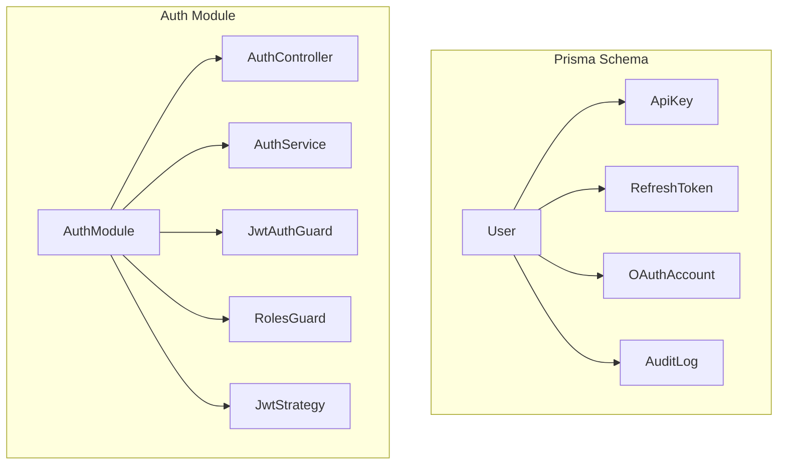
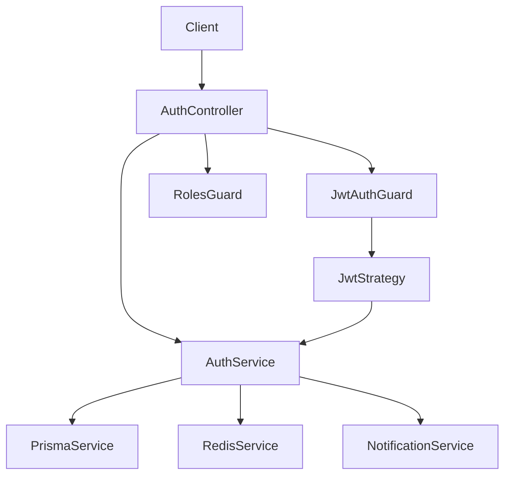
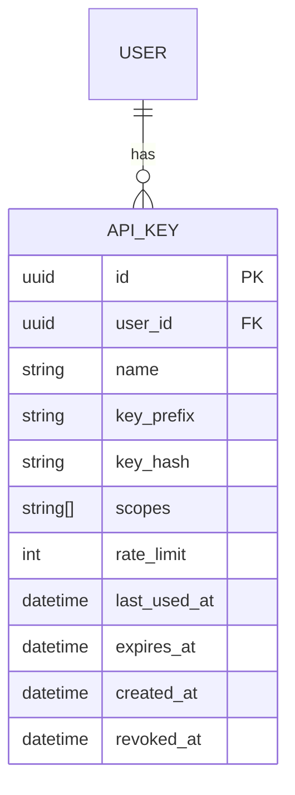
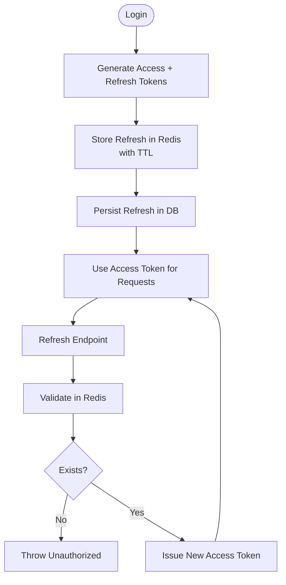
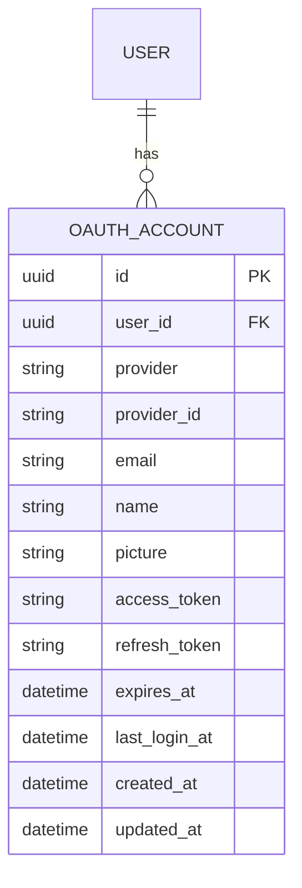
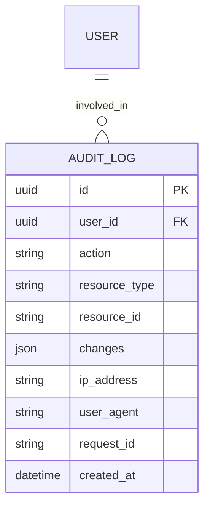
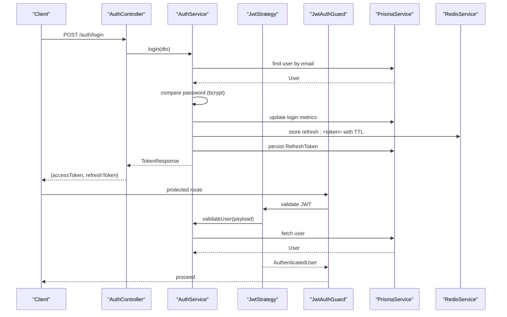
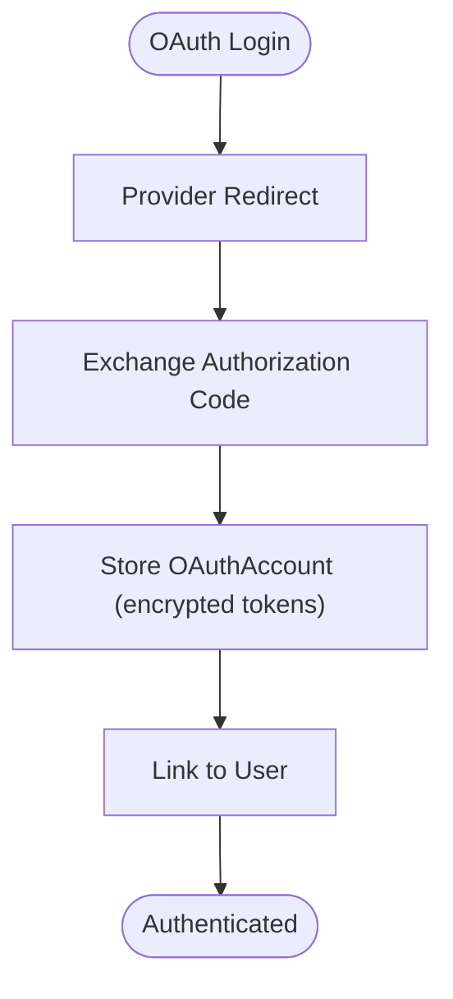
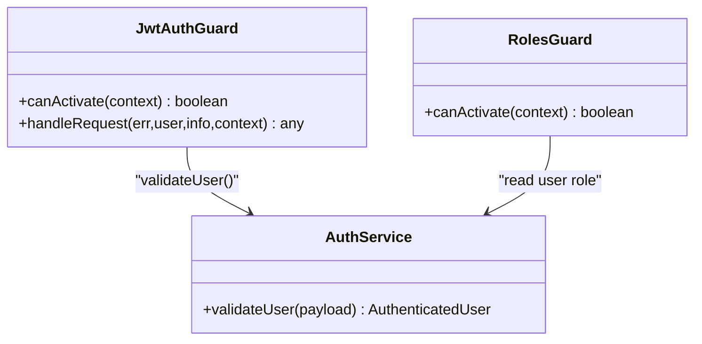
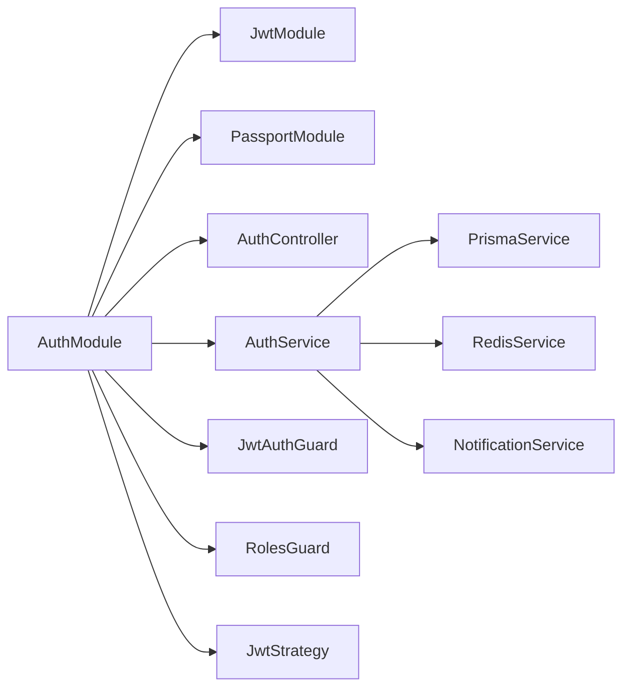

# Security & Audit Models

<cite>
**Referenced Files in This Document**
- [schema.prisma](file://prisma/schema.prisma)
- [auth.module.ts](file://apps/api/src/modules/auth/auth.module.ts)
- [auth.service.ts](file://apps/api/src/modules/auth/auth.service.ts)
- [auth.controller.ts](file://apps/api/src/modules/auth/auth.controller.ts)
- [jwt.strategy.ts](file://apps/api/src/modules/auth/strategies/jwt.strategy.ts)
- [jwt-auth.guard.ts](file://apps/api/src/modules/auth/guards/jwt-auth.guard.ts)
- [roles.guard.ts](file://apps/api/src/modules/auth/guards/roles.guard.ts)
</cite>

## Table of Contents
1. [Introduction](#introduction)
2. [Project Structure](#project-structure)
3. [Core Components](#core-components)
4. [Architecture Overview](#architecture-overview)
5. [Detailed Component Analysis](#detailed-component-analysis)
6. [Dependency Analysis](#dependency-analysis)
7. [Performance Considerations](#performance-considerations)
8. [Troubleshooting Guide](#troubleshooting-guide)
9. [Conclusion](#conclusion)
10. [Appendices](#appendices)

## Introduction
This document provides comprehensive documentation for the security and audit models implemented in the system. It focuses on the ApiKey, RefreshToken, OAuthAccount, and AuditLog entities, and explains authentication mechanisms, token management, OAuth integration patterns, API key scoping, rate limiting, and security policies. It also covers audit trail generation, activity tracking, compliance reporting, MFA configuration, session security, and access control patterns. Practical examples of secure authentication setup, audit logging, and security monitoring implementations are included.

## Project Structure
Security and audit capabilities are primarily defined in the data model and implemented in the authentication module of the API application. The Prisma schema defines the persistence models, while the NestJS AuthModule provides controllers, services, guards, strategies, and DTOs for authentication flows.

**Diagram sources**
- [schema.prisma](file://prisma/schema.prisma)
- [auth.module.ts](file://apps/api/src/modules/auth/auth.module.ts)

**Section sources**
- [schema.prisma](file://prisma/schema.prisma)
- [auth.module.ts](file://apps/api/src/modules/auth/auth.module.ts)

## Core Components
This section details the security and audit models and their relationships.

- ApiKey
  - Purpose: API key-based authentication with scoping and rate limiting.
  - Key attributes: user association, name, key prefix, hashed key, scopes array, rate limit, last used timestamp, expiration, creation and revocation timestamps.
  - Scopes: Array of strings enabling fine-grained permissions.
  - Rate limit: Integer representing allowed requests per period.
  - Persistence: Indexed by user and key prefix for fast lookup.

- RefreshToken
  - Purpose: Long-lived token for issuing new access tokens without re-entering credentials.
  - Key attributes: user association, unique token, expiration, creation, optional revocation timestamp.
  - Persistence: Indexed by token, user, and expiration for efficient invalidation and cleanup.

- OAuthAccount
  - Purpose: Third-party identity provider accounts linked to users.
  - Key attributes: user association, provider name, provider’s unique identifier, email, name, picture, encrypted access/refresh tokens, expiration, last login, creation and update timestamps.
  - Uniqueness: Composite unique constraint on provider and providerId to prevent duplicates.

- AuditLog
  - Purpose: Append-only audit trail for compliance and forensics.
  - Key attributes: user association, action, resource type and identifier, JSON changes, IP address, user agent, request identifier, creation timestamp.
  - Indexing: Supports filtering by user, action, resource, and creation time.

- User
  - Role: Central entity for identity and access control.
  - Security fields: MFA enablement flag, MFA secret, backup codes, last login IP and timestamp, failed login attempts, lockout window.
  - Relationships: ApiKey, RefreshToken, OAuthAccount, AuditLog, and Sessions.

**Section sources**
- [schema.prisma](file://prisma/schema.prisma)

## Architecture Overview
The authentication architecture integrates JWT-based access tokens, refresh tokens, and optional MFA. Controllers expose endpoints for registration, login, token refresh, logout, verification, password reset, and CSRF token retrieval. Guards enforce authentication and role-based access. Strategies validate JWT payloads. Services encapsulate business logic for token generation, Redis-backed refresh token storage, and audit trail updates.

**Diagram sources**
- [auth.controller.ts](file://apps/api/src/modules/auth/auth.controller.ts)
- [auth.service.ts](file://apps/api/src/modules/auth/auth.service.ts)
- [jwt-auth.guard.ts](file://apps/api/src/modules/auth/guards/jwt-auth.guard.ts)
- [roles.guard.ts](file://apps/api/src/modules/auth/guards/roles.guard.ts)
- [jwt.strategy.ts](file://apps/api/src/modules/auth/strategies/jwt.strategy.ts)

## Detailed Component Analysis

### ApiKey Model and Management
- Data model
  - Fields: user foreign key, name, key prefix, hashed key, scopes array, rate limit, last used, expires, created, revoked.
  - Indexes: user, key prefix.
- API key scoping
  - Scopes array enables granular permissions (e.g., read, write, admin).
- Rate limiting
  - Per-key rate limit enforced at the gateway or service boundary (policy-driven).
- Secure generation
  - Key prefix stored separately from the hashed key for efficient lookup; hashing prevents plaintext exposure.
- Revocation and rotation
  - Revoked timestamp supports immediate deactivation; rotation involves generating a new key pair and updating references.

**Diagram sources**
- [schema.prisma](file://prisma/schema.prisma)

**Section sources**
- [schema.prisma](file://prisma/schema.prisma)

### RefreshToken Model and Token Lifecycle
- Data model
  - Fields: user foreign key, unique token, expiration, creation, optional revocation.
  - Indexes: token, user, expiration.
- Token lifecycle
  - Generation: Access token signed; refresh token generated as a UUID and stored in Redis with TTL and persisted in the database.
  - Validation: Access token validated via JWT strategy; refresh token validated against Redis and database records.
  - Logout: Refresh token removed from Redis to invalidate the session.
- Security
  - Redis TTL ensures automatic expiration; database audit record supports revocation and compliance.

**Diagram sources**
- [auth.service.ts](file://apps/api/src/modules/auth/auth.service.ts)
- [auth.controller.ts](file://apps/api/src/modules/auth/auth.controller.ts)

**Section sources**
- [schema.prisma](file://prisma/schema.prisma)
- [auth.service.ts](file://apps/api/src/modules/auth/auth.service.ts)
- [auth.controller.ts](file://apps/api/src/modules/auth/auth.controller.ts)

### OAuthAccount Model and Integration Patterns
- Data model
  - Fields: user foreign key, provider, providerId, email, name, picture, encrypted access/refresh tokens, expiration, last login, created/updated.
  - Unique constraint: provider + providerId.
- Integration patterns
  - Provider-specific flows (e.g., Google, Microsoft, GitHub) map to OAuthAccount entries.
  - Encrypted tokens stored for downstream API access; refresh tokens enable long-lived access.
- Security
  - Composite uniqueness prevents duplicate linking; encrypted token fields protect sensitive credentials.

**Diagram sources**
- [schema.prisma](file://prisma/schema.prisma)

**Section sources**
- [schema.prisma](file://prisma/schema.prisma)

### AuditLog Model and Compliance Reporting
- Data model
  - Fields: user foreign key, action, resource type and id, JSON changes, IP address, user agent, request id, created.
  - Indexes: user, action, resource, created.
- Audit trail generation
  - Logged around sensitive operations (registration, login, verification, password reset, logout, token refresh).
  - Captures contextual metadata (IP, UA, request id) for forensics.
- Compliance reporting
  - Queries by user, action, and time range support audits and incident investigations.

**Diagram sources**
- [schema.prisma](file://prisma/schema.prisma)

**Section sources**
- [schema.prisma](file://prisma/schema.prisma)

### Authentication Mechanisms and Token Management
- JWT access tokens
  - Signed with a server-side secret; validated by JwtStrategy and enforced by JwtAuthGuard.
  - Payload includes subject, email, and role; expiration handled centrally.
- Password-based login
  - Email lookup, bcrypt comparison, lockout policy, and last login tracking.
- Email verification and password reset
  - Secure token generation, Redis-backed expirable tokens, and non-enumeration responses.
- CSRF protection
  - CSRF token endpoint sets a cookie; clients include the token in headers for state-changing requests.

**Diagram sources**
- [auth.controller.ts](file://apps/api/src/modules/auth/auth.controller.ts)
- [auth.service.ts](file://apps/api/src/modules/auth/auth.service.ts)
- [jwt.strategy.ts](file://apps/api/src/modules/auth/strategies/jwt.strategy.ts)
- [jwt-auth.guard.ts](file://apps/api/src/modules/auth/guards/jwt-auth.guard.ts)

**Section sources**
- [auth.controller.ts](file://apps/api/src/modules/auth/auth.controller.ts)
- [auth.service.ts](file://apps/api/src/modules/auth/auth.service.ts)
- [jwt.strategy.ts](file://apps/api/src/modules/auth/strategies/jwt.strategy.ts)
- [jwt-auth.guard.ts](file://apps/api/src/modules/auth/guards/jwt-auth.guard.ts)

### OAuth Integration Patterns
- Account linking
  - OAuthAccount entries associate provider identities with users.
- Token refresh
  - Refresh tokens are stored encrypted and used to renew access tokens.
- Provider flows
  - Each provider (Google, Microsoft, GitHub) follows a standardized pattern of storing providerId, tokens, and metadata.

**Diagram sources**
- [schema.prisma](file://prisma/schema.prisma)

**Section sources**
- [schema.prisma](file://prisma/schema.prisma)

### API Key Scoping, Rate Limiting, and Security Policies
- Scoping
  - ApiKey.scopes array defines allowed actions/resources.
- Rate limiting
  - ApiKey.rateLimit enforces per-key quotas; enforcement occurs at the gateway or service layer.
- Rotation and revocation
  - Rotate keys periodically; revoke on compromise by setting revokedAt and removing from active rotation.
- Policy recommendations
  - Least privilege scoping, regular audits, and automated key rotation.

**Section sources**
- [schema.prisma](file://prisma/schema.prisma)

### MFA Configuration and Session Security
- MFA fields
  - User.mfaEnabled, mfaSecret, mfaBackupCodes manage MFA state.
- Session security
  - Failed login attempts tracked; lockout windows applied; last login IP recorded for anomaly detection.
- Recommendations
  - Enforce MFA for privileged roles; monitor login IPs and geolocations; implement adaptive lockouts.

**Section sources**
- [schema.prisma](file://prisma/schema.prisma)
- [auth.service.ts](file://apps/api/src/modules/auth/auth.service.ts)

### Access Control Patterns
- Role-based access control
  - RolesGuard checks required roles against the authenticated user.
- Public routes
  - JwtAuthGuard respects a @Public() decorator to bypass authentication.
- Decorators and reflection
  - Guards use NestJS reflector to read metadata for role and public flags.

**Diagram sources**
- [roles.guard.ts](file://apps/api/src/modules/auth/guards/roles.guard.ts)
- [jwt-auth.guard.ts](file://apps/api/src/modules/auth/guards/jwt-auth.guard.ts)
- [auth.service.ts](file://apps/api/src/modules/auth/auth.service.ts)

**Section sources**
- [roles.guard.ts](file://apps/api/src/modules/auth/guards/roles.guard.ts)
- [jwt-auth.guard.ts](file://apps/api/src/modules/auth/guards/jwt-auth.guard.ts)
- [auth.service.ts](file://apps/api/src/modules/auth/auth.service.ts)

### Secure Authentication Setup Examples
- Environment configuration
  - JWT secret and expiration configured in the runtime environment.
- Registration and verification
  - Non-blocking verification emails; resend verification with throttling.
- Password reset
  - Expirable tokens stored in Redis; strong password requirements enforced.
- Logout
  - Refresh token invalidated in Redis and audit trail maintained.

**Section sources**
- [auth.module.ts](file://apps/api/src/modules/auth/auth.module.ts)
- [auth.controller.ts](file://apps/api/src/modules/auth/auth.controller.ts)
- [auth.service.ts](file://apps/api/src/modules/auth/auth.service.ts)

### Audit Logging and Security Monitoring
- Audit log generation
  - Logged around authentication events and sensitive operations.
- Monitoring
  - Use indexes to query by user, action, and time; integrate with SIEM for alerts.
- Compliance
  - Append-only logs support regulatory requirements.

**Section sources**
- [schema.prisma](file://prisma/schema.prisma)
- [auth.service.ts](file://apps/api/src/modules/auth/auth.service.ts)

## Dependency Analysis
The AuthModule composes JwtModule, Passport, and custom guards and services. The AuthService depends on PrismaService, RedisService, and NotificationService. Guards and strategies rely on configuration and the AuthService for user validation.

**Diagram sources**
- [auth.module.ts](file://apps/api/src/modules/auth/auth.module.ts)

**Section sources**
- [auth.module.ts](file://apps/api/src/modules/auth/auth.module.ts)

## Performance Considerations
- Token storage
  - Redis-backed refresh tokens reduce database load for frequent refresh operations.
- Indexing
  - Proper indexes on ApiKey.keyPrefix, RefreshToken.token, OAuthAccount.provider/providerId, and AuditLog fields improve query performance.
- Rate limiting
  - Enforce at gateway or service level to avoid database contention.
- Caching
  - Cache frequently accessed user roles and permissions where appropriate.

## Troubleshooting Guide
- Authentication failures
  - JwtAuthGuard logs detailed warnings including request path and presence of authorization headers; inspect logs for expired or invalid token errors.
- Refresh token issues
  - Ensure Redis connectivity and correct TTL; verify refresh token exists and is not revoked.
- Email verification and password reset
  - Confirm Redis expiry values and that tokens are cleared after use.
- CSRF protection
  - Ensure CSRF cookie is set and client sends the token in the X-CSRF-Token header for state-changing requests.

**Section sources**
- [jwt-auth.guard.ts](file://apps/api/src/modules/auth/guards/jwt-auth.guard.ts)
- [auth.service.ts](file://apps/api/src/modules/auth/auth.service.ts)
- [auth.controller.ts](file://apps/api/src/modules/auth/auth.controller.ts)

## Conclusion
The system implements robust security and audit capabilities through a well-defined data model and a modular authentication architecture. ApiKey scoping and rate limiting provide granular API access control; RefreshToken management ensures secure session continuity; OAuthAccount integration supports third-party identity; and AuditLog enables comprehensive compliance and forensics. Guards and strategies enforce authentication and authorization, while services encapsulate secure token handling and operational safeguards.

## Appendices
- Best practices
  - Rotate secrets regularly; enforce MFA for privileged roles; apply least privilege scoping; monitor and alert on anomalous login patterns; maintain audit logs for at least retention periods required by regulations.