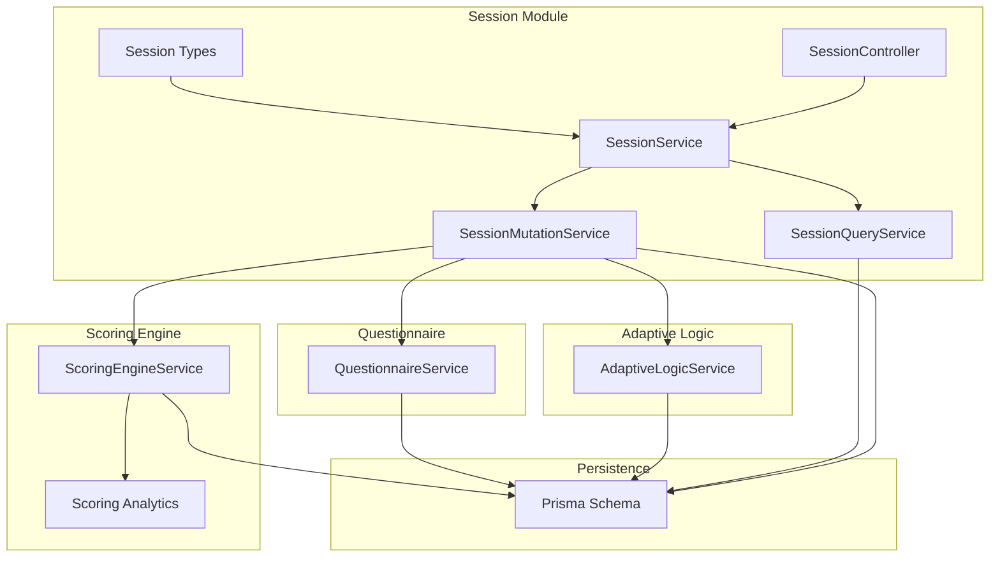
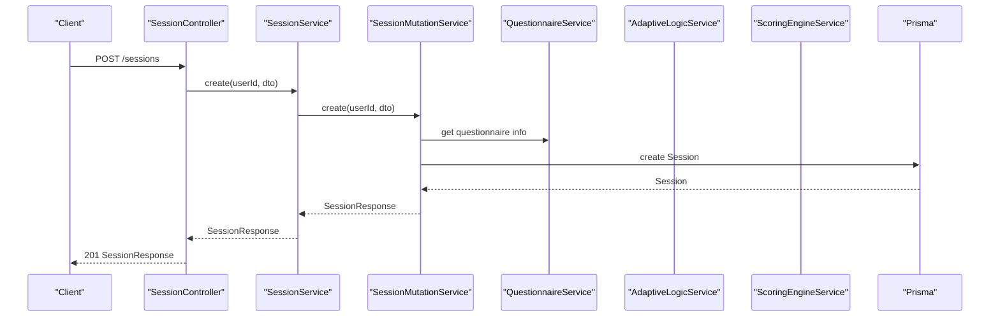
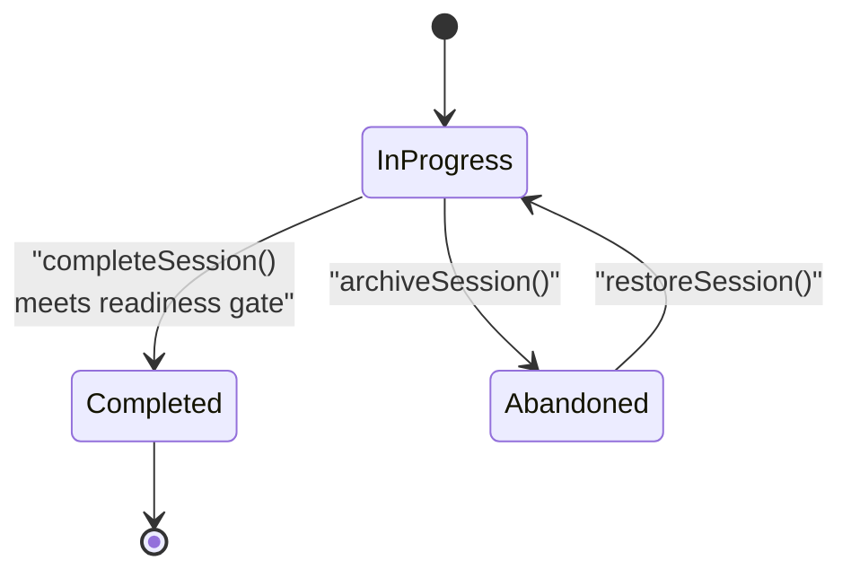
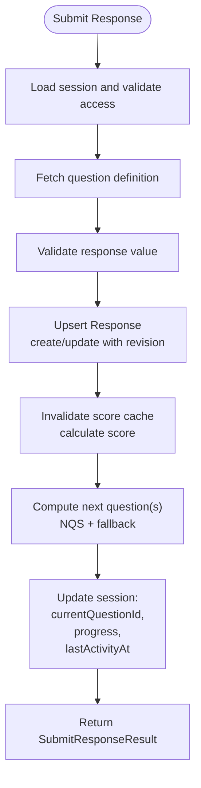
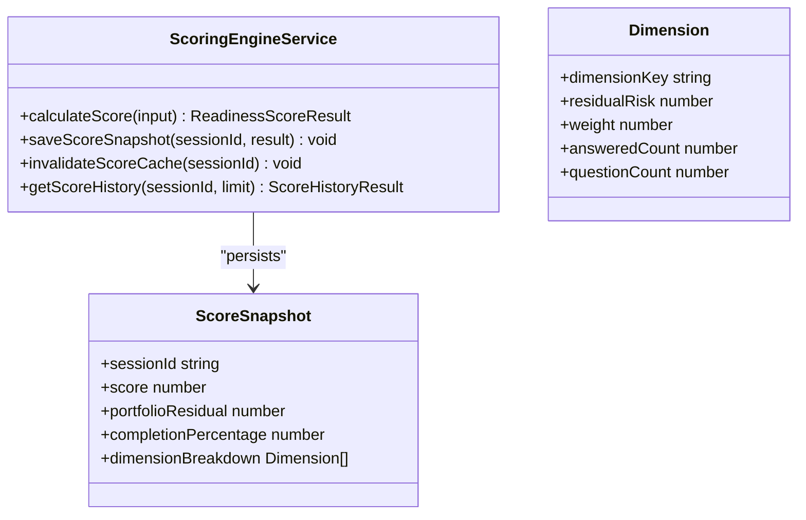
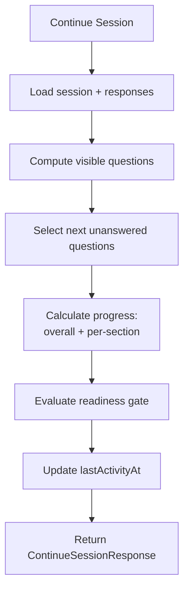
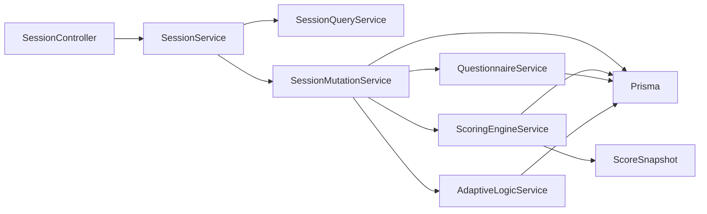

# Session & Response Models

<cite>
**Referenced Files in This Document**
- [session-types.ts](file://apps/api/src/modules/session/session-types.ts)
- [session.service.ts](file://apps/api/src/modules/session/session.service.ts)
- [session.controller.ts](file://apps/api/src/modules/session/session.controller.ts)
- [session-mutation.service.ts](file://apps/api/src/modules/session/services/session-mutation.service.ts)
- [scoring-engine.service.ts](file://apps/api/src/modules/scoring-engine/scoring-engine.service.ts)
- [scoring-analytics.ts](file://apps/api/src/modules/scoring-engine/strategies/scoring-analytics.ts)
- [questionnaire.service.ts](file://apps/api/src/modules/questionnaire/questionnaire.service.ts)
- [adaptive-logic.service.ts](file://apps/api/src/modules/adaptive-logic/adaptive-logic.service.ts)
- [Prisma schema](file://prisma/schema.prisma)
</cite>

## Table of Contents
1. [Introduction](#introduction)
2. [Project Structure](#project-structure)
3. [Core Components](#core-components)
4. [Architecture Overview](#architecture-overview)
5. [Detailed Component Analysis](#detailed-component-analysis)
6. [Dependency Analysis](#dependency-analysis)
7. [Performance Considerations](#performance-considerations)
8. [Troubleshooting Guide](#troubleshooting-guide)
9. [Conclusion](#conclusion)

## Introduction
This document explains the session and response management models that power the questionnaire/assessment lifecycle. It covers the Session entity and related DTOs, the Response model for storing answers, readiness scoring, dimension breakdowns, portfolio residual calculations, adaptive state persistence, session lifecycle management, progress tracking, and user interaction patterns. It also provides examples of session creation, response handling, and score calculation workflows.

## Project Structure
The session and response models live under the session module and integrate with the scoring engine, adaptive logic, and questionnaire services. The Prisma schema defines the underlying database entities and relationships.

**Diagram sources**
- [session.controller.ts:1-166](file://apps/api/src/modules/session/session.controller.ts#L1-L166)
- [session.service.ts:1-116](file://apps/api/src/modules/session/session.service.ts#L1-L116)
- [session-mutation.service.ts:1-553](file://apps/api/src/modules/session/services/session-mutation.service.ts#L1-L553)
- [scoring-engine.service.ts:118-386](file://apps/api/src/modules/scoring-engine/scoring-engine.service.ts#L118-L386)
- [scoring-analytics.ts:47-87](file://apps/api/src/modules/scoring-engine/strategies/scoring-analytics.ts#L47-L87)
- [questionnaire.service.ts](file://apps/api/src/modules/questionnaire/questionnaire.service.ts)
- [adaptive-logic.service.ts](file://apps/api/src/modules/adaptive-logic/adaptive-logic.service.ts)
- [prisma/schema.prisma](file://prisma/schema.prisma)

**Section sources**
- [session.controller.ts:1-166](file://apps/api/src/modules/session/session.controller.ts#L1-L166)
- [session.service.ts:1-116](file://apps/api/src/modules/session/session.service.ts#L1-L116)
- [session-mutation.service.ts:1-553](file://apps/api/src/modules/session/services/session-mutation.service.ts#L1-L553)
- [scoring-engine.service.ts:118-386](file://apps/api/src/modules/scoring-engine/scoring-engine.service.ts#L118-L386)
- [scoring-analytics.ts:47-87](file://apps/api/src/modules/scoring-engine/strategies/scoring-analytics.ts#L47-L87)
- [questionnaire.service.ts](file://apps/api/src/modules/questionnaire/questionnaire.service.ts)
- [adaptive-logic.service.ts](file://apps/api/src/modules/adaptive-logic/adaptive-logic.service.ts)
- [prisma/schema.prisma](file://prisma/schema.prisma)

## Core Components
- Session: Tracks user progress, current position, adaptive state, readiness score, and timestamps.
- Response: Stores per-question answers, validation outcomes, and timing metadata.
- ScoreSnapshot: Historical record of readiness scores, portfolio residuals, and dimension breakdowns.
- Session Types: Strongly-typed DTOs for controller responses and analytics.

Key responsibilities:
- Session lifecycle: create, continue, complete, archive, restore, bulk delete, clone.
- Response storage: upsert with revision tracking, validation, and coverage metrics.
- Adaptive state persistence: maintain visible/skipped questions and branch history.
- Readiness scoring: compute score, portfolio residual, dimension breakdowns, and trend analysis.
- Progress tracking: overall and section-level completion, estimated time remaining.

**Section sources**
- [session-types.ts:1-141](file://apps/api/src/modules/session/session-types.ts#L1-L141)
- [session.service.ts:30-115](file://apps/api/src/modules/session/session.service.ts#L30-L115)
- [session-mutation.service.ts:46-207](file://apps/api/src/modules/session/services/session-mutation.service.ts#L46-L207)
- [scoring-engine.service.ts:118-386](file://apps/api/src/modules/scoring-engine/scoring-engine.service.ts#L118-L386)

## Architecture Overview
The session module exposes REST endpoints via the controller, delegating read/write operations to SessionService. SessionService acts as a facade, instantiating SessionQueryService and SessionMutationService. Write operations interact with QuestionnaireService, AdaptiveLogicService, and ScoringEngineService, persisting changes through Prisma.

**Diagram sources**
- [session.controller.ts:39-47](file://apps/api/src/modules/session/session.controller.ts#L39-L47)
- [session.service.ts:80-82](file://apps/api/src/modules/session/session.service.ts#L80-L82)
- [session-mutation.service.ts:46-86](file://apps/api/src/modules/session/services/session-mutation.service.ts#L46-L86)
- [questionnaire.service.ts](file://apps/api/src/modules/questionnaire/questionnaire.service.ts)
- [prisma/schema.prisma](file://prisma/schema.prisma)

## Detailed Component Analysis

### Session Entity and Lifecycle
- Creation: Initializes status to in-progress, sets current section/question, adaptive state, and progress.
- Continuation: Applies adaptive visibility, computes next questions, updates progress, and tracks activity.
- Completion: Validates readiness gate (threshold), recalculates score, marks completed.
- Archival/Restore: Moves sessions out of progress and back.
- Bulk operations: Delete responses and sessions; clone with optional response copy.

**Diagram sources**
- [session-mutation.service.ts:183-207](file://apps/api/src/modules/session/services/session-mutation.service.ts#L183-L207)
- [session-mutation.service.ts:394-417](file://apps/api/src/modules/session/services/session-mutation.service.ts#L394-L417)

**Section sources**
- [session-mutation.service.ts:46-86](file://apps/api/src/modules/session/services/session-mutation.service.ts#L46-L86)
- [session-mutation.service.ts:183-207](file://apps/api/src/modules/session/services/session-mutation.service.ts#L183-L207)
- [session-mutation.service.ts:394-417](file://apps/api/src/modules/session/services/session-mutation.service.ts#L394-L417)

### Response Model and Validation
- Storage: Upsert per (session, question) with JSON value, validity flag, validation errors, and revision counter.
- Coverage tracking: Response count informs progress and readiness score recalculation.
- Evidence integration: Responses carry validation metadata suitable for downstream evidence registries.

**Diagram sources**
- [session-mutation.service.ts:88-181](file://apps/api/src/modules/session/services/session-mutation.service.ts#L88-L181)
- [scoring-engine.service.ts:135-163](file://apps/api/src/modules/scoring-engine/scoring-engine.service.ts#L135-L163)

**Section sources**
- [session-mutation.service.ts:88-181](file://apps/api/src/modules/session/services/session-mutation.service.ts#L88-L181)

### Readiness Scoring, Dimensions, and Portfolio Residual
- Score calculation: Computes weighted score, portfolio residual, dimension breakdowns, completion metrics, and trend.
- Snapshot persistence: Records score, portfolio residual, and dimension breakdowns for historical analysis.
- Analytics: Provides score history, trend analysis, and industry benchmark comparisons.

**Diagram sources**
- [scoring-engine.service.ts:118-386](file://apps/api/src/modules/scoring-engine/scoring-engine.service.ts#L118-L386)
- [scoring-analytics.ts:47-87](file://apps/api/src/modules/scoring-engine/strategies/scoring-analytics.ts#L47-L87)

**Section sources**
- [scoring-engine.service.ts:118-163](file://apps/api/src/modules/scoring-engine/scoring-engine.service.ts#L118-L163)
- [scoring-engine.service.ts:365-385](file://apps/api/src/modules/scoring-engine/scoring-engine.service.ts#L365-L385)
- [scoring-analytics.ts:47-87](file://apps/api/src/modules/scoring-engine/strategies/scoring-analytics.ts#L47-L87)

### Adaptive State Persistence and Progress Tracking
- Adaptive state: Maintains active/skipped questions and branch history to support continuation and visibility recomputation.
- Progress computation: Computes overall percentage, answered/total counts, sections left, and completion per section.
- Section completion: Builds completion status across all questionnaire sections for analytics and UI.

**Diagram sources**
- [session-mutation.service.ts:209-311](file://apps/api/src/modules/session/services/session-mutation.service.ts#L209-L311)

**Section sources**
- [session-mutation.service.ts:209-311](file://apps/api/src/modules/session/services/session-mutation.service.ts#L209-L311)

### Session Types and DTO Contracts
- SessionResponse: Core session view with status, persona, industry, readiness score, progress, and timestamps.
- ContinueSessionResponse: Extended continuation payload including next questions, current section info, adaptive state, and completion eligibility.
- SubmitResponseResult: Response submission outcome with validation result, next question suggestion (NQS), progress, and readiness score.
- SessionAnalytics and UserSessionStats: Aggregated metrics for reporting and dashboards.
- SessionExport: Structured export of session and response data for external systems.

**Section sources**
- [session-types.ts:22-141](file://apps/api/src/modules/session/session-types.ts#L22-L141)

## Dependency Analysis
- SessionService depends on SessionQueryService and SessionMutationService.
- SessionMutationService depends on QuestionnaireService, AdaptiveLogicService, ScoringEngineService, and Prisma.
- ScoringEngineService persists ScoreSnapshot and integrates with analytics.
- Controllers expose typed endpoints backed by SessionService.

**Diagram sources**
- [session.controller.ts:1-166](file://apps/api/src/modules/session/session.controller.ts#L1-L166)
- [session.service.ts:1-116](file://apps/api/src/modules/session/session.service.ts#L1-L116)
- [session-mutation.service.ts:1-553](file://apps/api/src/modules/session/services/session-mutation.service.ts#L1-L553)
- [scoring-engine.service.ts:118-386](file://apps/api/src/modules/scoring-engine/scoring-engine.service.ts#L118-L386)

**Section sources**
- [session.controller.ts:1-166](file://apps/api/src/modules/session/session.controller.ts#L1-L166)
- [session.service.ts:1-116](file://apps/api/src/modules/session/session.service.ts#L1-L116)
- [session-mutation.service.ts:1-553](file://apps/api/src/modules/session/services/session-mutation.service.ts#L1-L553)
- [scoring-engine.service.ts:118-386](file://apps/api/src/modules/scoring-engine/scoring-engine.service.ts#L118-L386)

## Performance Considerations
- Batch score calculation: Controlled concurrency batches to avoid overload.
- Cache invalidation: Immediately invalidates cached scores on response submission to keep computations fresh.
- Efficient visibility recomputation: Uses adaptive logic to compute visible questions once per submission.
- Pagination and limits: Controller enforces safe defaults for question retrieval and continuation counts.

[No sources needed since this section provides general guidance]

## Troubleshooting Guide
Common issues and resolutions:
- Session already completed: Attempting to submit responses or complete an already-completed session raises a bad request error.
- Access denied: Continuing a session with a different user triggers a forbidden error.
- Readiness gate not met: Completing a session below the threshold score is rejected; user must improve coverage.
- No dimensions mapped: Score calculation may return undefined if no dimensions are available; handle gracefully in UI.
- Missing question: Submitting a response for a non-existent question results in a not-found error.

**Section sources**
- [session-mutation.service.ts:94-96](file://apps/api/src/modules/session/services/session-mutation.service.ts#L94-L96)
- [session-mutation.service.ts:224-226](file://apps/api/src/modules/session/services/session-mutation.service.ts#L224-L226)
- [session-mutation.service.ts:190-196](file://apps/api/src/modules/session/services/session-mutation.service.ts#L190-L196)
- [scoring-engine.service.ts:448-452](file://apps/api/src/modules/scoring-engine/scoring-engine.service.ts#L448-L452)
- [session-mutation.service.ts:99-101](file://apps/api/src/modules/session/services/session-mutation.service.ts#L99-L101)

## Conclusion
The session and response models form a cohesive system for managing adaptive questionnaires, validating and persisting responses, tracking progress, and computing readiness scores with dimension breakdowns and portfolio residuals. The separation of concerns across query/mutation services, integration with adaptive logic and scoring engines, and strong typing ensure maintainability and extensibility for future enhancements.