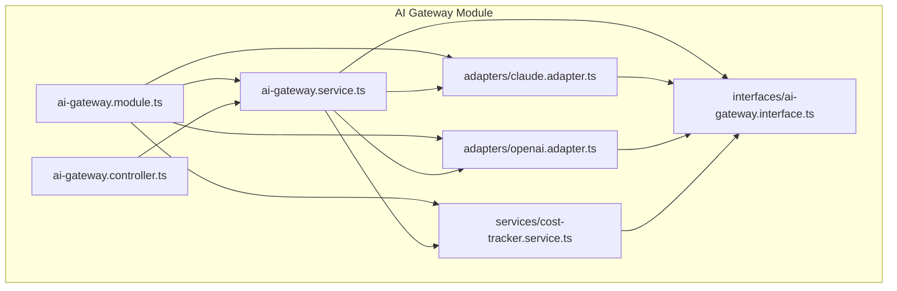
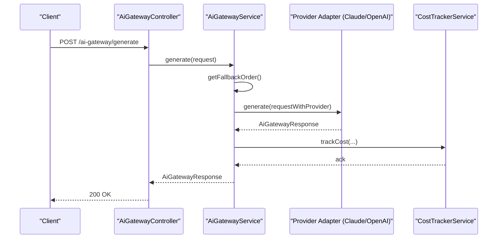
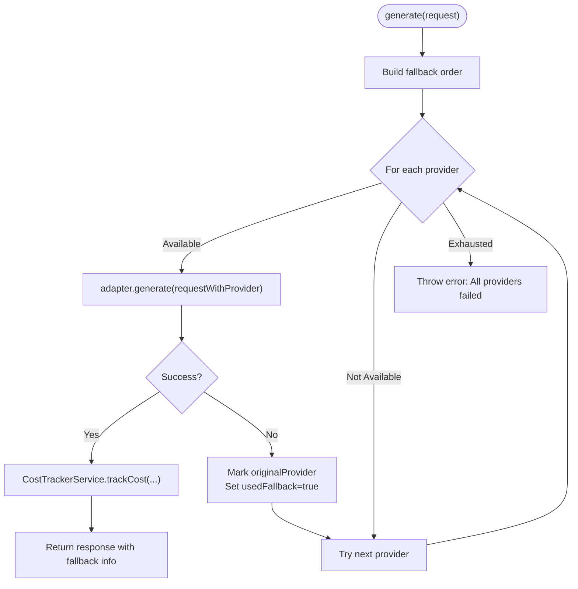
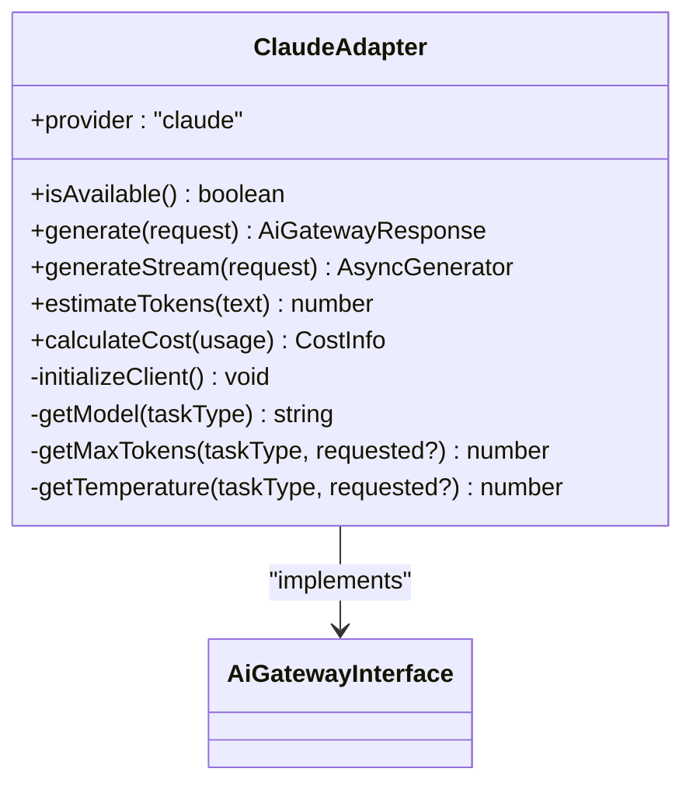
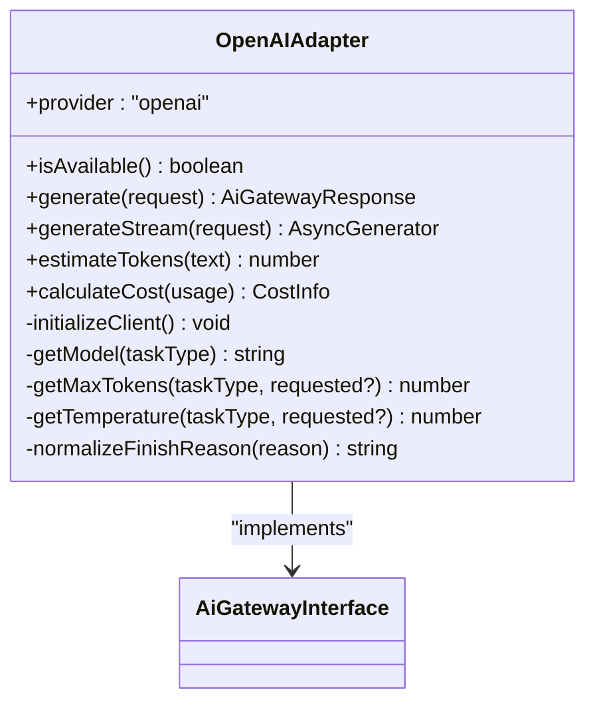
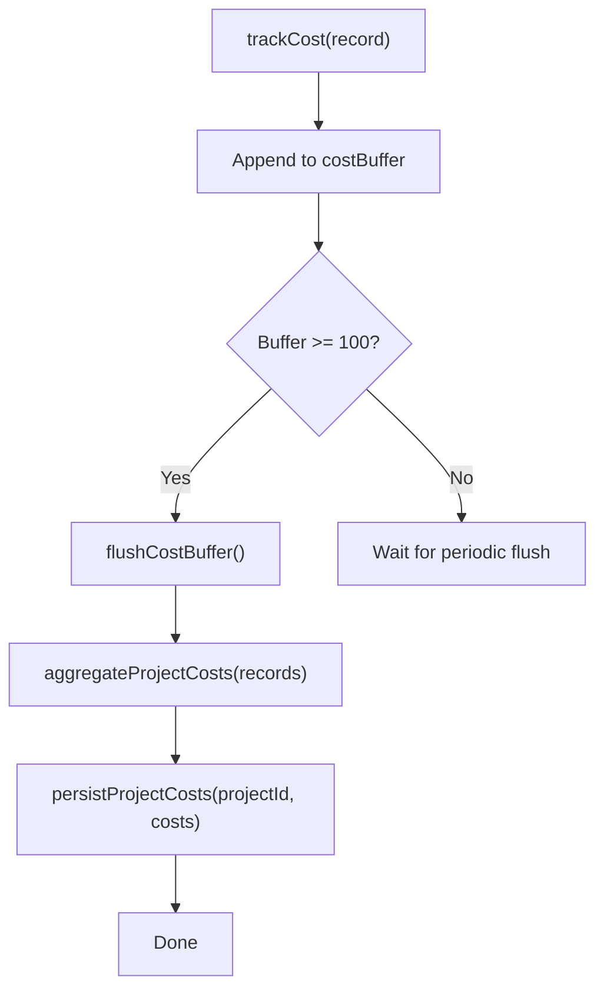
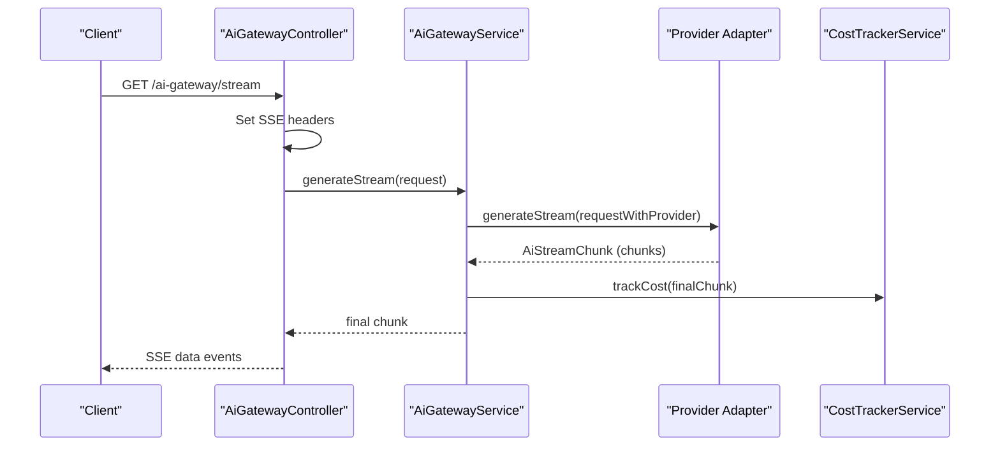
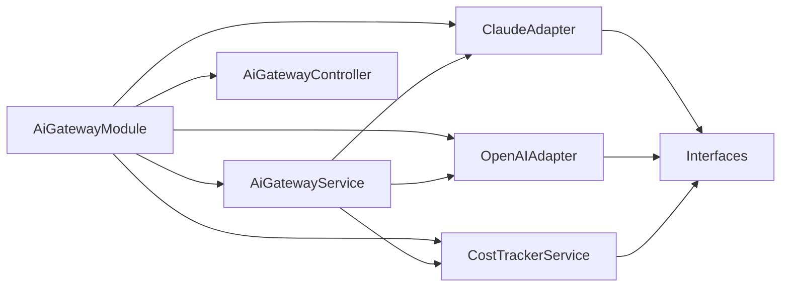

# AI Gateway Integrations

<cite>
**Referenced Files in This Document**
- [ai-gateway.module.ts](file://apps/api/src/modules/ai-gateway/ai-gateway.module.ts)
- [ai-gateway.service.ts](file://apps/api/src/modules/ai-gateway/ai-gateway.service.ts)
- [ai-gateway.controller.ts](file://apps/api/src/modules/ai-gateway/ai-gateway.controller.ts)
- [claude.adapter.ts](file://apps/api/src/modules/ai-gateway/adapters/claude.adapter.ts)
- [openai.adapter.ts](file://apps/api/src/modules/ai-gateway/adapters/openai.adapter.ts)
- [ai-gateway.interface.ts](file://apps/api/src/modules/ai-gateway/interfaces/ai-gateway.interface.ts)
- [cost-tracker.service.ts](file://apps/api/src/modules/ai-gateway/services/cost-tracker.service.ts)
- [PHASE-03-ai-gateway.md](file://docs/phase-kits/PHASE-03-ai-gateway.md)
</cite>

## Table of Contents
1. [Introduction](#introduction)
2. [Project Structure](#project-structure)
3. [Core Components](#core-components)
4. [Architecture Overview](#architecture-overview)
5. [Detailed Component Analysis](#detailed-component-analysis)
6. [Dependency Analysis](#dependency-analysis)
7. [Performance Considerations](#performance-considerations)
8. [Troubleshooting Guide](#troubleshooting-guide)
9. [Conclusion](#conclusion)
10. [Appendices](#appendices)

## Introduction
This document explains the AI Gateway integration that unifies access to multiple AI providers (Claude and OpenAI) behind a single, extensible service. It covers request/response transformations, model selection strategies, fallback mechanisms, cost tracking, token usage monitoring, authentication setup, rate limiting configuration, and performance optimization techniques. It also provides examples of prompt formatting, response parsing, and error handling across providers.

## Project Structure
The AI Gateway is implemented as a NestJS module with a central service, provider adapters, interfaces, and a cost tracker. Controllers expose REST endpoints and Server-Sent Events (SSE) for streaming.

**Diagram sources**
- [ai-gateway.module.ts:1-26](file://apps/api/src/modules/ai-gateway/ai-gateway.module.ts#L1-L26)
- [ai-gateway.service.ts:1-332](file://apps/api/src/modules/ai-gateway/ai-gateway.service.ts#L1-L332)
- [ai-gateway.controller.ts:1-157](file://apps/api/src/modules/ai-gateway/ai-gateway.controller.ts#L1-L157)
- [claude.adapter.ts:1-283](file://apps/api/src/modules/ai-gateway/adapters/claude.adapter.ts#L1-L283)
- [openai.adapter.ts:1-310](file://apps/api/src/modules/ai-gateway/adapters/openai.adapter.ts#L1-L310)
- [ai-gateway.interface.ts:1-212](file://apps/api/src/modules/ai-gateway/interfaces/ai-gateway.interface.ts#L1-L212)
- [cost-tracker.service.ts:1-267](file://apps/api/src/modules/ai-gateway/services/cost-tracker.service.ts#L1-L267)

**Section sources**
- [ai-gateway.module.ts:1-26](file://apps/api/src/modules/ai-gateway/ai-gateway.module.ts#L1-L26)

## Core Components
- AiGatewayService: Central routing, provider selection, fallback logic, streaming orchestration, and cost tracking invocation.
- ClaudeAdapter and OpenAIAdapter: Provider-specific implementations for non-streaming and streaming generations, token estimation, and cost calculation.
- CostTrackerService: Aggregates and persists cost records per project with periodic flushing and summaries.
- Interfaces: Unified request/response shapes, token usage, cost info, provider configuration, and adapter contract.
- Controller: Exposes endpoints for non-streaming generation, SSE streaming, health, and provider discovery.

Key responsibilities:
- Provider abstraction and routing
- Automatic fallback on provider failure
- SSE streaming for chat responses
- Cost tracking per project/user
- JSON mode for structured outputs
- Health checks and availability reporting

**Section sources**
- [ai-gateway.service.ts:15-332](file://apps/api/src/modules/ai-gateway/ai-gateway.service.ts#L15-L332)
- [claude.adapter.ts:13-283](file://apps/api/src/modules/ai-gateway/adapters/claude.adapter.ts#L13-L283)
- [openai.adapter.ts:13-310](file://apps/api/src/modules/ai-gateway/adapters/openai.adapter.ts#L13-L310)
- [cost-tracker.service.ts:51-267](file://apps/api/src/modules/ai-gateway/services/cost-tracker.service.ts#L51-L267)
- [ai-gateway.interface.ts:8-212](file://apps/api/src/modules/ai-gateway/interfaces/ai-gateway.interface.ts#L8-L212)
- [ai-gateway.controller.ts:20-157](file://apps/api/src/modules/ai-gateway/ai-gateway.controller.ts#L20-L157)

## Architecture Overview
The AI Gateway encapsulates provider variability behind a common interface. Requests are transformed into provider-specific formats, executed against adapters, and responses are normalized and enriched with cost and usage metrics.

**Diagram sources**
- [ai-gateway.controller.ts:32-62](file://apps/api/src/modules/ai-gateway/ai-gateway.controller.ts#L32-L62)
- [ai-gateway.service.ts:130-188](file://apps/api/src/modules/ai-gateway/ai-gateway.service.ts#L130-L188)
- [claude.adapter.ts:113-172](file://apps/api/src/modules/ai-gateway/adapters/claude.adapter.ts#L113-L172)
- [openai.adapter.ts:128-199](file://apps/api/src/modules/ai-gateway/adapters/openai.adapter.ts#L128-L199)
- [cost-tracker.service.ts:70-87](file://apps/api/src/modules/ai-gateway/services/cost-tracker.service.ts#L70-L87)

## Detailed Component Analysis

### AiGatewayService
Responsibilities:
- Loads provider configurations from the database and applies them to adapters.
- Determines fallback order based on preferred provider, default provider, and active providers.
- Executes non-streaming and streaming requests with robust error handling and fallback.
- Normalizes responses and enriches them with cost and usage metrics.
- Exposes health status and available providers.

**Diagram sources**
- [ai-gateway.service.ts:93-188](file://apps/api/src/modules/ai-gateway/ai-gateway.service.ts#L93-L188)
- [cost-tracker.service.ts:70-87](file://apps/api/src/modules/ai-gateway/services/cost-tracker.service.ts#L70-L87)

**Section sources**
- [ai-gateway.service.ts:39-91](file://apps/api/src/modules/ai-gateway/ai-gateway.service.ts#L39-L91)
- [ai-gateway.service.ts:93-188](file://apps/api/src/modules/ai-gateway/ai-gateway.service.ts#L93-L188)
- [ai-gateway.service.ts:190-258](file://apps/api/src/modules/ai-gateway/ai-gateway.service.ts#L190-L258)
- [ai-gateway.service.ts:260-331](file://apps/api/src/modules/ai-gateway/ai-gateway.service.ts#L260-L331)

### ClaudeAdapter
Capabilities:
- Non-streaming and streaming completions via the Anthropic SDK.
- Message normalization to provider format.
- Token usage extraction and cost calculation.
- Availability check using a lightweight ping.
- Task-type-specific model selection and parameter tuning.

**Diagram sources**
- [claude.adapter.ts:19-283](file://apps/api/src/modules/ai-gateway/adapters/claude.adapter.ts#L19-L283)
- [ai-gateway.interface.ts:144-165](file://apps/api/src/modules/ai-gateway/interfaces/ai-gateway.interface.ts#L144-L165)

**Section sources**
- [claude.adapter.ts:31-53](file://apps/api/src/modules/ai-gateway/adapters/claude.adapter.ts#L31-L53)
- [claude.adapter.ts:55-111](file://apps/api/src/modules/ai-gateway/adapters/claude.adapter.ts#L55-L111)
- [claude.adapter.ts:113-172](file://apps/api/src/modules/ai-gateway/adapters/claude.adapter.ts#L113-L172)
- [claude.adapter.ts:174-252](file://apps/api/src/modules/ai-gateway/adapters/claude.adapter.ts#L174-L252)
- [claude.adapter.ts:254-281](file://apps/api/src/modules/ai-gateway/adapters/claude.adapter.ts#L254-L281)

### OpenAIAdapter
Capabilities:
- Non-streaming and streaming completions via the OpenAI SDK.
- JSON mode support via response_format.
- System prompt integrated as a message.
- Finish reason normalization and usage extraction.
- Task-type-specific model selection and parameter tuning.

**Diagram sources**
- [openai.adapter.ts:19-310](file://apps/api/src/modules/ai-gateway/adapters/openai.adapter.ts#L19-L310)
- [ai-gateway.interface.ts:144-165](file://apps/api/src/modules/ai-gateway/interfaces/ai-gateway.interface.ts#L144-L165)

**Section sources**
- [openai.adapter.ts:31-53](file://apps/api/src/modules/ai-gateway/adapters/openai.adapter.ts#L31-L53)
- [openai.adapter.ts:55-111](file://apps/api/src/modules/ai-gateway/adapters/openai.adapter.ts#L55-L111)
- [openai.adapter.ts:128-199](file://apps/api/src/modules/ai-gateway/adapters/openai.adapter.ts#L128-L199)
- [openai.adapter.ts:201-279](file://apps/api/src/modules/ai-gateway/adapters/openai.adapter.ts#L201-L279)
- [openai.adapter.ts:281-308](file://apps/api/src/modules/ai-gateway/adapters/openai.adapter.ts#L281-L308)

### CostTrackerService
Responsibilities:
- Buffers cost records in memory and flushes to the database periodically.
- Aggregates per-project totals and updates project metadata.
- Provides cost summaries and pre-execution cost estimates.
- Ensures cleanup on module destruction.

**Diagram sources**
- [cost-tracker.service.ts:70-117](file://apps/api/src/modules/ai-gateway/services/cost-tracker.service.ts#L70-L117)
- [cost-tracker.service.ts:119-169](file://apps/api/src/modules/ai-gateway/services/cost-tracker.service.ts#L119-L169)

**Section sources**
- [cost-tracker.service.ts:51-87](file://apps/api/src/modules/ai-gateway/services/cost-tracker.service.ts#L51-L87)
- [cost-tracker.service.ts:90-117](file://apps/api/src/modules/ai-gateway/services/cost-tracker.service.ts#L90-L117)
- [cost-tracker.service.ts:119-169](file://apps/api/src/modules/ai-gateway/services/cost-tracker.service.ts#L119-L169)
- [cost-tracker.service.ts:194-230](file://apps/api/src/modules/ai-gateway/services/cost-tracker.service.ts#L194-L230)
- [cost-tracker.service.ts:232-257](file://apps/api/src/modules/ai-gateway/services/cost-tracker.service.ts#L232-L257)

### Interfaces and DTOs
- AiGatewayRequest/AiGatewayResponse: Unified request/response contracts.
- AiStreamChunk: SSE chunk shape for streaming.
- TokenUsage/CostInfo: Standardized usage and cost structures.
- ProviderConfig: Database-backed configuration for models, limits, pricing, and features.
- AiAdapter: Contract that adapters implement.

**Section sources**
- [ai-gateway.interface.ts:32-119](file://apps/api/src/modules/ai-gateway/interfaces/ai-gateway.interface.ts#L32-L119)
- [ai-gateway.interface.ts:121-142](file://apps/api/src/modules/ai-gateway/interfaces/ai-gateway.interface.ts#L121-L142)
- [ai-gateway.interface.ts:144-197](file://apps/api/src/modules/ai-gateway/interfaces/ai-gateway.interface.ts#L144-L197)

### Controller Endpoints
- POST /ai-gateway/generate: Non-streaming generation with JWT auth.
- GET /ai-gateway/stream: SSE streaming with JWT auth.
- GET /ai-gateway/health: Gateway health status.
- GET /ai-gateway/providers: Default and available providers.

**Diagram sources**
- [ai-gateway.controller.ts:64-127](file://apps/api/src/modules/ai-gateway/ai-gateway.controller.ts#L64-L127)
- [ai-gateway.service.ts:190-258](file://apps/api/src/modules/ai-gateway/ai-gateway.service.ts#L190-L258)
- [cost-tracker.service.ts:218-236](file://apps/api/src/modules/ai-gateway/services/cost-tracker.service.ts#L218-L236)

**Section sources**
- [ai-gateway.controller.ts:32-62](file://apps/api/src/modules/ai-gateway/ai-gateway.controller.ts#L32-L62)
- [ai-gateway.controller.ts:64-127](file://apps/api/src/modules/ai-gateway/ai-gateway.controller.ts#L64-L127)
- [ai-gateway.controller.ts:129-155](file://apps/api/src/modules/ai-gateway/ai-gateway.controller.ts#L129-L155)

## Dependency Analysis
- AiGatewayModule wires PrismaModule, controller, service, adapters, and cost tracker.
- AiGatewayService depends on adapters and CostTrackerService.
- Adapters depend on external SDKs and environment variables for credentials.
- CostTrackerService depends on PrismaService and project metadata.

**Diagram sources**
- [ai-gateway.module.ts:19-24](file://apps/api/src/modules/ai-gateway/ai-gateway.module.ts#L19-L24)
- [ai-gateway.service.ts:28-37](file://apps/api/src/modules/ai-gateway/ai-gateway.service.ts#L28-L37)

**Section sources**
- [ai-gateway.module.ts:19-24](file://apps/api/src/modules/ai-gateway/ai-gateway.module.ts#L19-L24)
- [ai-gateway.service.ts:28-37](file://apps/api/src/modules/ai-gateway/ai-gateway.service.ts#L28-L37)

## Performance Considerations
- Streaming: Prefer SSE streaming for long-form generation to reduce perceived latency and enable incremental rendering.
- Buffering: The controller disables proxy buffering for SSE to ensure real-time delivery.
- Cost tracking batching: Cost records are buffered and flushed periodically to minimize database writes.
- Token estimation: Use adapter token estimations for early budget checks and request shaping.
- Model selection: Tune maxTokens and temperature per task type to balance quality and cost.
- Health monitoring: Use the health endpoint to detect degraded or unavailable providers.

[No sources needed since this section provides general guidance]

## Troubleshooting Guide
Common issues and resolutions:
- Authentication failures:
  - Ensure environment variables are set for the adapters (e.g., provider API keys).
  - Verify adapter availability checks pass.
- Streaming errors:
  - Confirm SSE headers are set and client disconnects are handled gracefully.
  - Inspect final chunk for error payloads.
- Cost tracking anomalies:
  - Check periodic flush intervals and buffer sizes.
  - Validate project metadata updates after flush.
- Fallback behavior:
  - Review fallback order and default provider configuration.
  - Confirm provider availability flags and database configs.

**Section sources**
- [claude.adapter.ts:31-39](file://apps/api/src/modules/ai-gateway/adapters/claude.adapter.ts#L31-L39)
- [openai.adapter.ts:31-39](file://apps/api/src/modules/ai-gateway/adapters/openai.adapter.ts#L31-L39)
- [ai-gateway.controller.ts:80-126](file://apps/api/src/modules/ai-gateway/ai-gateway.controller.ts#L80-L126)
- [cost-tracker.service.ts:174-179](file://apps/api/src/modules/ai-gateway/services/cost-tracker.service.ts#L174-L179)
- [ai-gateway.service.ts:96-117](file://apps/api/src/modules/ai-gateway/ai-gateway.service.ts#L96-L117)

## Conclusion
The AI Gateway provides a robust, extensible abstraction over multiple AI providers with built-in fallback, streaming, and cost tracking. By centralizing provider configuration, normalization, and cost aggregation, it simplifies integration, improves reliability, and enables budget-aware usage across applications.

[No sources needed since this section summarizes without analyzing specific files]

## Appendices

### Authentication Setup and API Key Management
- Claude:
  - Environment variable: ANTHROPIC_API_KEY
  - Adapter initializes client only when the key is present.
- OpenAI:
  - Environment variable: OPENAI_API_KEY
  - Adapter initializes client only when the key is present.

Best practices:
- Store keys in secure environment storage.
- Rotate keys regularly and monitor usage.
- Restrict adapter initialization to environments with valid keys.

**Section sources**
- [claude.adapter.ts:31-39](file://apps/api/src/modules/ai-gateway/adapters/claude.adapter.ts#L31-L39)
- [openai.adapter.ts:31-39](file://apps/api/src/modules/ai-gateway/adapters/openai.adapter.ts#L31-L39)

### Rate Limiting Configuration
- ProviderConfig supports rate limits:
  - requestsPerMinute
  - tokensPerMinute
- Integrate these values into adapter-level throttling or upstream middleware as needed.

Note: The current adapters do not enforce rate limits internally; consider adding middleware or client-side throttling if required.

**Section sources**
- [ai-gateway.interface.ts:181-184](file://apps/api/src/modules/ai-gateway/interfaces/ai-gateway.interface.ts#L181-L184)

### Prompt Formatting and Response Parsing
- Claude:
  - System prompt is passed separately; messages exclude system role.
  - Content is extracted from the first content block.
- OpenAI:
  - System prompt is included as a message with role: system.
  - JSON mode enabled via response_format when requested.
  - Finish reason normalized to a controlled set.

**Section sources**
- [claude.adapter.ts:127-139](file://apps/api/src/modules/ai-gateway/adapters/claude.adapter.ts#L127-L139)
- [openai.adapter.ts:142-161](file://apps/api/src/modules/ai-gateway/adapters/openai.adapter.ts#L142-L161)
- [openai.adapter.ts:113-126](file://apps/api/src/modules/ai-gateway/adapters/openai.adapter.ts#L113-L126)

### Model Selection Strategies
- Default models per task type:
  - Claude: chat, extract, generate
  - OpenAI: chat, extract, generate
- ProviderConfig.modelMap overrides defaults per task type.
- AiGatewayService resolves model names per request.

**Section sources**
- [ai-gateway.service.ts:260-285](file://apps/api/src/modules/ai-gateway/ai-gateway.service.ts#L260-L285)
- [claude.adapter.ts:58-69](file://apps/api/src/modules/ai-gateway/adapters/claude.adapter.ts#L58-L69)
- [openai.adapter.ts:58-69](file://apps/api/src/modules/ai-gateway/adapters/openai.adapter.ts#L58-L69)

### Cost Tracking and Budget Controls
- Cost tracking:
  - Buffered writes with periodic flush.
  - Aggregation by project with metadata updates.
- Budget controls:
  - Use ProviderConfig.pricing to configure per-1K token costs.
  - Use CostTrackerService.estimateCost for pre-execution budgeting.
  - Consider implementing downstream budget enforcement (e.g., quotas per project/user) using project metadata.

**Section sources**
- [cost-tracker.service.ts:60-87](file://apps/api/src/modules/ai-gateway/services/cost-tracker.service.ts#L60-L87)
- [cost-tracker.service.ts:174-179](file://apps/api/src/modules/ai-gateway/services/cost-tracker.service.ts#L174-L179)
- [cost-tracker.service.ts:232-257](file://apps/api/src/modules/ai-gateway/services/cost-tracker.service.ts#L232-L257)
- [ai-gateway.interface.ts:185-189](file://apps/api/src/modules/ai-gateway/interfaces/ai-gateway.interface.ts#L185-L189)

### Request/Response Transformation Patterns
- Messages:
  - Normalize roles to provider-specific formats.
  - Exclude system role from provider message arrays when required.
- System prompts:
  - Separate parameter for Claude; part of messages for OpenAI.
- JSON mode:
  - Enabled via adapter-specific parameters when requested.
- Streaming:
  - Emit partial content until final chunk with usage and cost.

**Section sources**
- [claude.adapter.ts:127-139](file://apps/api/src/modules/ai-gateway/adapters/claude.adapter.ts#L127-L139)
- [openai.adapter.ts:142-161](file://apps/api/src/modules/ai-gateway/adapters/openai.adapter.ts#L142-L161)
- [openai.adapter.ts:201-279](file://apps/api/src/modules/ai-gateway/adapters/openai.adapter.ts#L201-L279)
- [claude.adapter.ts:174-252](file://apps/api/src/modules/ai-gateway/adapters/claude.adapter.ts#L174-L252)

### Fallback Mechanisms
- Fallback order:
  - Preferred provider (if supplied)
  - Default provider
  - Remaining active providers
- Health status:
  - Reports availability per provider and overall status.

**Section sources**
- [ai-gateway.service.ts:96-117](file://apps/api/src/modules/ai-gateway/ai-gateway.service.ts#L96-L117)
- [ai-gateway.service.ts:287-314](file://apps/api/src/modules/ai-gateway/ai-gateway.service.ts#L287-L314)

### Examples and References
- Claude adapter implementation details:
  - See [claude.adapter.ts:13-283](file://apps/api/src/modules/ai-gateway/adapters/claude.adapter.ts#L13-283)
- OpenAI adapter implementation details:
  - See [openai.adapter.ts:13-310](file://apps/api/src/modules/ai-gateway/adapters/openai.adapter.ts#L13-310)
- Phase kit documentation for adapter tasks:
  - See [PHASE-03-ai-gateway.md:123-253](file://docs/phase-kits/PHASE-03-ai-gateway.md#L123-L253)