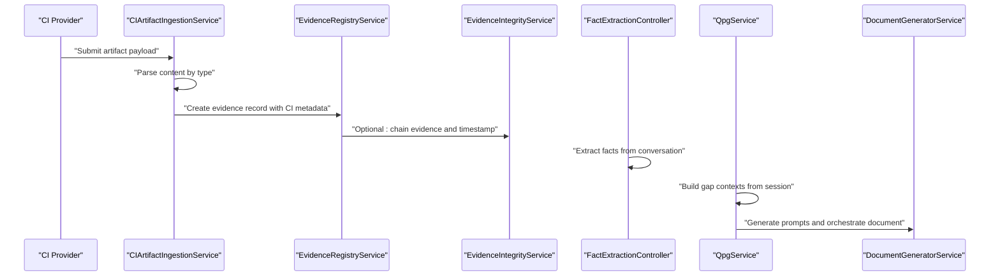
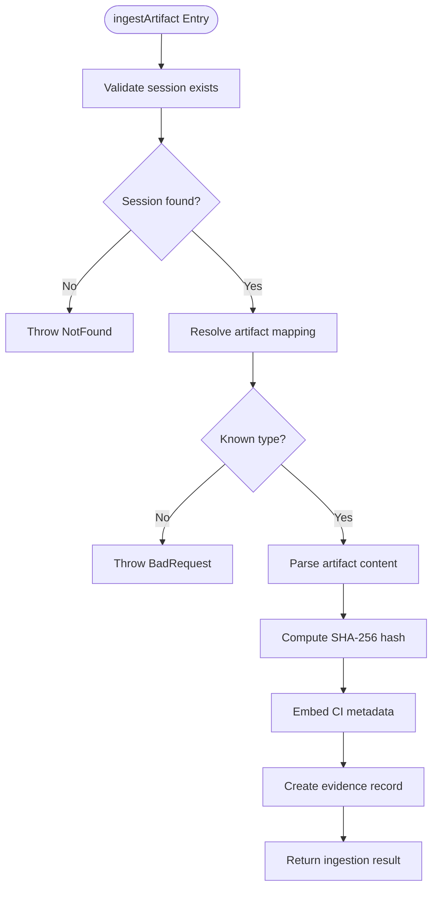
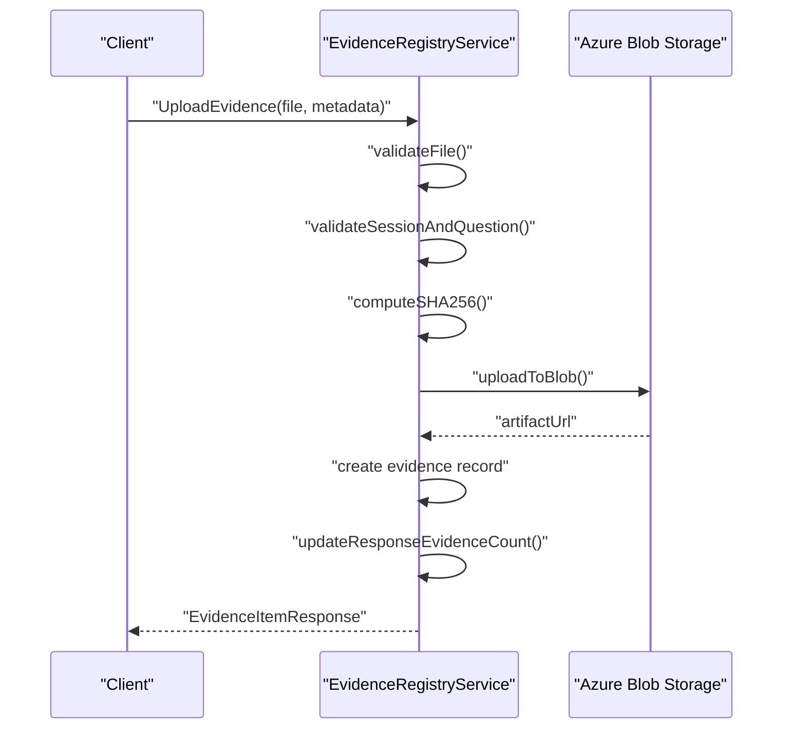
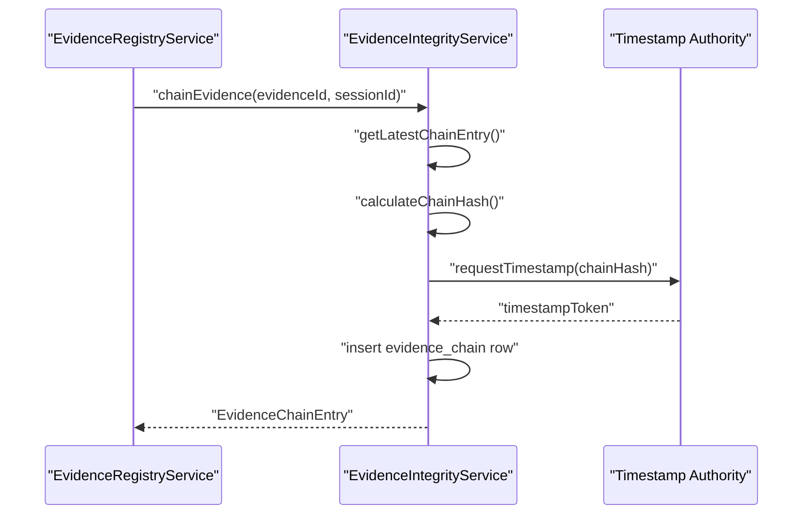
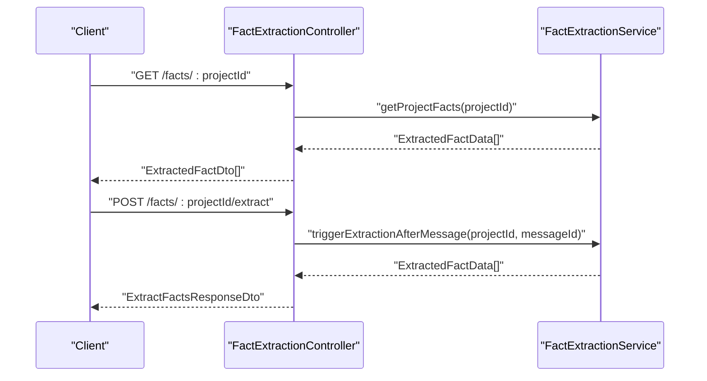
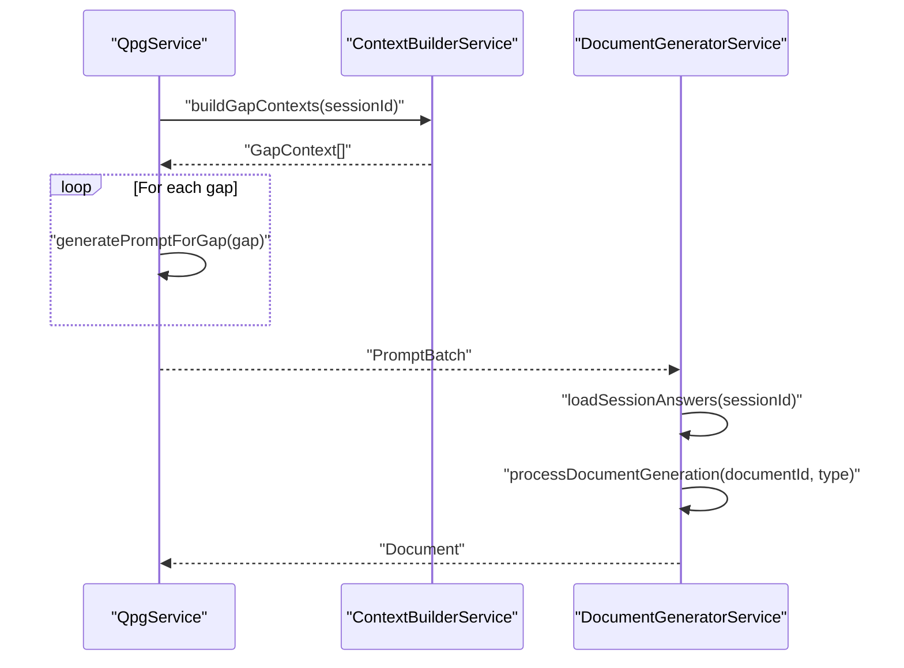
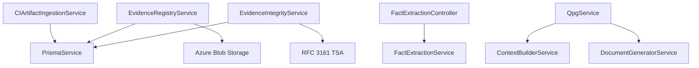

# Data Ingestion Pipelines

<cite>
**Referenced Files in This Document**
- [ci-artifact-ingestion.service.ts](file://apps/api/src/modules/evidence-registry/ci-artifact-ingestion.service.ts)
- [evidence-registry.service.ts](file://apps/api/src/modules/evidence-registry/evidence-registry.service.ts)
- [evidence-integrity.service.ts](file://apps/api/src/modules/evidence-registry/evidence-integrity.service.ts)
- [fact-extraction.controller.ts](file://apps/api/src/modules/fact-extraction/fact-extraction.controller.ts)
- [interfaces.ts](file://apps/api/src/modules/fact-extraction/interfaces.ts)
- [qpg.service.ts](file://apps/api/src/modules/qpg/qpg.service.ts)
- [context-builder.service.ts](file://apps/api/src/modules/qpg/services/context-builder.service.ts)
- [document-generator.service.ts](file://apps/api/src/modules/document-generator/services/document-generator.service.ts)
</cite>

## Table of Contents
1. [Introduction](#introduction)
2. [Project Structure](#project-structure)
3. [Core Components](#core-components)
4. [Architecture Overview](#architecture-overview)
5. [Detailed Component Analysis](#detailed-component-analysis)
6. [Dependency Analysis](#dependency-analysis)
7. [Performance Considerations](#performance-considerations)
8. [Troubleshooting Guide](#troubleshooting-guide)
9. [Conclusion](#conclusion)

## Introduction
This document describes the data ingestion pipelines that power Quiz-to-Build’s readiness assessment platform. It covers:
- CI/CD artifact ingestion for build artifacts, test results, and deployment metadata
- Evidence registry integration for storing, validating, and auditing evidence
- Fact extraction workflows for automated discovery from conversations
- Context building for QPG (Question Prompt Generator) and document generation
- Data transformation patterns, schema validation, and error handling
- Examples of custom ingestion processors and external data source integrations

## Project Structure
The ingestion system spans three primary domains:
- Evidence Registry: ingestion, integrity, and audit
- CI Artifact Ingestion: parsing and ingestion of CI/CD artifacts
- Fact Extraction and QPG: automated fact discovery and prompt generation
- Document Generation: orchestration of document creation from session data

```mermaid
graph TB
subgraph "Evidence Registry"
ER["EvidenceRegistryService"]
EI["EvidenceIntegrityService"]
end
subgraph "CI Artifact Ingestion"
CI["CIArtifactIngestionService"]
end
subgraph "Fact Extraction"
FE["FactExtractionController"]
FX["FactExtraction Interfaces"]
end
subgraph "QPG"
QPG["QpgService"]
CB["ContextBuilderService"]
end
subgraph "Document Generation"
DG["DocumentGeneratorService"]
end
CI --> ER
ER --> EI
FE --> QPG
QPG --> CB
QPG --> DG
```

**Diagram sources**
- [ci-artifact-ingestion.service.ts:37-163](file://apps/api/src/modules/evidence-registry/ci-artifact-ingestion.service.ts#L37-L163)
- [evidence-registry.service.ts:96-208](file://apps/api/src/modules/evidence-registry/evidence-registry.service.ts#L96-L208)
- [evidence-integrity.service.ts:36-133](file://apps/api/src/modules/evidence-registry/evidence-integrity.service.ts#L36-L133)
- [fact-extraction.controller.ts:23-76](file://apps/api/src/modules/fact-extraction/fact-extraction.controller.ts#L23-L76)
- [interfaces.ts:1-88](file://apps/api/src/modules/fact-extraction/interfaces.ts#L1-L88)
- [qpg.service.ts:12-76](file://apps/api/src/modules/qpg/qpg.service.ts#L12-L76)
- [context-builder.service.ts:10-79](file://apps/api/src/modules/qpg/services/context-builder.service.ts#L10-L79)
- [document-generator.service.ts:22-136](file://apps/api/src/modules/document-generator/services/document-generator.service.ts#L22-L136)

**Section sources**
- [ci-artifact-ingestion.service.ts:37-163](file://apps/api/src/modules/evidence-registry/ci-artifact-ingestion.service.ts#L37-L163)
- [evidence-registry.service.ts:96-208](file://apps/api/src/modules/evidence-registry/evidence-registry.service.ts#L96-L208)
- [evidence-integrity.service.ts:36-133](file://apps/api/src/modules/evidence-registry/evidence-integrity.service.ts#L36-L133)
- [fact-extraction.controller.ts:23-76](file://apps/api/src/modules/fact-extraction/fact-extraction.controller.ts#L23-L76)
- [interfaces.ts:1-88](file://apps/api/src/modules/fact-extraction/interfaces.ts#L1-L88)
- [qpg.service.ts:12-76](file://apps/api/src/modules/qpg/qpg.service.ts#L12-L76)
- [context-builder.service.ts:10-79](file://apps/api/src/modules/qpg/services/context-builder.service.ts#L10-L79)
- [document-generator.service.ts:22-136](file://apps/api/src/modules/document-generator/services/document-generator.service.ts#L22-L136)

## Core Components
- CI Artifact Ingestion Service: parses and ingests CI/CD artifacts (test reports, coverage, SBOMs, security scans), computes hashes, and embeds CI metadata into the evidence registry.
- Evidence Registry Service: manages file uploads, integrity hashing, verification workflows, and coverage updates.
- Evidence Integrity Service: implements cryptographic chaining and RFC 3161 timestamping for tamper-evident evidence.
- Fact Extraction Controller and Interfaces: expose endpoints and types for extracting structured facts from conversations.
- QPG Service and Context Builder: build contextual gaps from questionnaire sessions and generate prompts.
- Document Generator Service: orchestrates document creation from session answers and AI content.

**Section sources**
- [ci-artifact-ingestion.service.ts:37-163](file://apps/api/src/modules/evidence-registry/ci-artifact-ingestion.service.ts#L37-L163)
- [evidence-registry.service.ts:96-208](file://apps/api/src/modules/evidence-registry/evidence-registry.service.ts#L96-L208)
- [evidence-integrity.service.ts:36-133](file://apps/api/src/modules/evidence-registry/evidence-integrity.service.ts#L36-L133)
- [fact-extraction.controller.ts:23-76](file://apps/api/src/modules/fact-extraction/fact-extraction.controller.ts#L23-L76)
- [interfaces.ts:1-88](file://apps/api/src/modules/fact-extraction/interfaces.ts#L1-L88)
- [qpg.service.ts:12-76](file://apps/api/src/modules/qpg/qpg.service.ts#L12-L76)
- [context-builder.service.ts:10-79](file://apps/api/src/modules/qpg/services/context-builder.service.ts#L10-L79)
- [document-generator.service.ts:22-136](file://apps/api/src/modules/document-generator/services/document-generator.service.ts#L22-L136)

## Architecture Overview
The ingestion pipeline integrates CI/CD, evidence management, and AI-driven workflows:



**Diagram sources**
- [ci-artifact-ingestion.service.ts:98-163](file://apps/api/src/modules/evidence-registry/ci-artifact-ingestion.service.ts#L98-L163)
- [evidence-registry.service.ts:165-208](file://apps/api/src/modules/evidence-registry/evidence-registry.service.ts#L165-L208)
- [evidence-integrity.service.ts:63-133](file://apps/api/src/modules/evidence-registry/evidence-integrity.service.ts#L63-L133)
- [fact-extraction.controller.ts:54-76](file://apps/api/src/modules/fact-extraction/fact-extraction.controller.ts#L54-L76)
- [qpg.service.ts:27-76](file://apps/api/src/modules/qpg/qpg.service.ts#L27-L76)
- [document-generator.service.ts:37-136](file://apps/api/src/modules/document-generator/services/document-generator.service.ts#L37-L136)

## Detailed Component Analysis

### CI Artifact Ingestion Service
Responsibilities:
- Validate session existence and artifact type mapping
- Parse multiple artifact types (JUnit, Jest, LCOV, Cobertura, CycloneDX, SPDX, Trivy, OWASP)
- Compute SHA-256 hash and embed CI metadata into evidence metadata
- Create evidence records and support bulk ingestion
- Provide build summaries and artifact listings

Processing logic:
- Artifact type resolution via mapping table
- Parser selection per artifact type
- Metadata embedding for provenance tracking
- Error handling for unknown types and missing sessions



**Diagram sources**
- [ci-artifact-ingestion.service.ts:98-163](file://apps/api/src/modules/evidence-registry/ci-artifact-ingestion.service.ts#L98-L163)

**Section sources**
- [ci-artifact-ingestion.service.ts:37-163](file://apps/api/src/modules/evidence-registry/ci-artifact-ingestion.service.ts#L37-L163)
- [ci-artifact-ingestion.service.ts:205-228](file://apps/api/src/modules/evidence-registry/ci-artifact-ingestion.service.ts#L205-L228)
- [ci-artifact-ingestion.service.ts:615-709](file://apps/api/src/modules/evidence-registry/ci-artifact-ingestion.service.ts#L615-L709)

### Evidence Registry Service
Responsibilities:
- Upload files to Azure Blob Storage with SHA-256 integrity
- Validate file types and sizes
- Manage verification lifecycle and coverage updates
- Provide listing, stats, and audit trails
- Support bulk verification and signed URL generation

Processing logic:
- File validation against allowed MIME types and size limits
- Blob upload with unique naming and metadata
- Evidence creation and response count synchronization
- Coverage level transitions enforced (non-decreasing)



**Diagram sources**
- [evidence-registry.service.ts:165-208](file://apps/api/src/modules/evidence-registry/evidence-registry.service.ts#L165-L208)
- [evidence-registry.service.ts:376-395](file://apps/api/src/modules/evidence-registry/evidence-registry.service.ts#L376-L395)

**Section sources**
- [evidence-registry.service.ts:100-127](file://apps/api/src/modules/evidence-registry/evidence-registry.service.ts#L100-L127)
- [evidence-registry.service.ts:165-208](file://apps/api/src/modules/evidence-registry/evidence-registry.service.ts#L165-L208)
- [evidence-registry.service.ts:475-510](file://apps/api/src/modules/evidence-registry/evidence-registry.service.ts#L475-L510)

### Evidence Integrity Service
Responsibilities:
- Create cryptographic evidence chains linking items in sequence
- Request RFC 3161 timestamps for chain entries
- Verify chain integrity and detect tampering
- Generate comprehensive integrity reports

Processing logic:
- Chain entry creation with previous hash and sequence number
- Canonical JSON hashing for chain integrity
- Timestamp token retrieval and verification
- Session-wide chain verification and status reporting



**Diagram sources**
- [evidence-integrity.service.ts:63-133](file://apps/api/src/modules/evidence-registry/evidence-integrity.service.ts#L63-L133)
- [evidence-integrity.service.ts:291-337](file://apps/api/src/modules/evidence-registry/evidence-integrity.service.ts#L291-L337)

**Section sources**
- [evidence-integrity.service.ts:36-133](file://apps/api/src/modules/evidence-registry/evidence-integrity.service.ts#L36-L133)
- [evidence-integrity.service.ts:198-274](file://apps/api/src/modules/evidence-registry/evidence-integrity.service.ts#L198-L274)
- [evidence-integrity.service.ts:396-444](file://apps/api/src/modules/evidence-registry/evidence-integrity.service.ts#L396-L444)

### Fact Extraction Workflow
Responsibilities:
- Expose endpoints to trigger extraction and manage facts
- Define extraction categories, confidence levels, and schemas
- Validate facts against project-type schemas

Processing logic:
- Controller routes for CRUD operations on facts
- Interfaces define extraction categories, confidence, and schema fields
- Validation result structure for completeness and required fields



**Diagram sources**
- [fact-extraction.controller.ts:35-76](file://apps/api/src/modules/fact-extraction/fact-extraction.controller.ts#L35-L76)
- [interfaces.ts:30-56](file://apps/api/src/modules/fact-extraction/interfaces.ts#L30-L56)

**Section sources**
- [fact-extraction.controller.ts:23-142](file://apps/api/src/modules/fact-extraction/fact-extraction.controller.ts#L23-L142)
- [interfaces.ts:1-88](file://apps/api/src/modules/fact-extraction/interfaces.ts#L1-L88)

### QPG Context Building and Document Generation
Responsibilities:
- Build gap contexts from questionnaire sessions
- Generate prompts for gaps and orchestrate document creation
- Load session answers and AI content for document assembly

Processing logic:
- Context builder identifies gaps by coverage < 1.0 and calculates residual risk
- QPG service orchestrates template retrieval, prompt generation, and batching
- Document generator validates session completion, required questions, and generates documents



**Diagram sources**
- [qpg.service.ts:27-76](file://apps/api/src/modules/qpg/qpg.service.ts#L27-L76)
- [context-builder.service.ts:19-79](file://apps/api/src/modules/qpg/services/context-builder.service.ts#L19-L79)
- [document-generator.service.ts:142-219](file://apps/api/src/modules/document-generator/services/document-generator.service.ts#L142-L219)

**Section sources**
- [qpg.service.ts:12-104](file://apps/api/src/modules/qpg/qpg.service.ts#L12-L104)
- [context-builder.service.ts:10-137](file://apps/api/src/modules/qpg/services/context-builder.service.ts#L10-L137)
- [document-generator.service.ts:22-219](file://apps/api/src/modules/document-generator/services/document-generator.service.ts#L22-L219)

## Dependency Analysis
Key dependencies and relationships:
- CIArtifactIngestionService depends on PrismaService and emits evidence with CI metadata
- EvidenceRegistryService depends on PrismaService and Azure Blob Storage for uploads
- EvidenceIntegrityService depends on PrismaService and external TSA for timestamps
- FactExtractionController depends on FactExtractionService and exposes DTOs
- QpgService composes ContextBuilderService and DocumentGeneratorService
- DocumentGeneratorService depends on PrismaService, template engine, and storage



**Diagram sources**
- [ci-artifact-ingestion.service.ts:88-91](file://apps/api/src/modules/evidence-registry/ci-artifact-ingestion.service.ts#L88-L91)
- [evidence-registry.service.ts:128-133](file://apps/api/src/modules/evidence-registry/evidence-registry.service.ts#L128-L133)
- [evidence-integrity.service.ts:45-53](file://apps/api/src/modules/evidence-registry/evidence-integrity.service.ts#L45-L53)
- [fact-extraction.controller.ts](file://apps/api/src/modules/fact-extraction/fact-extraction.controller.ts#L26)
- [qpg.service.ts:15-20](file://apps/api/src/modules/qpg/qpg.service.ts#L15-L20)
- [document-generator.service.ts:25-32](file://apps/api/src/modules/document-generator/services/document-generator.service.ts#L25-L32)

**Section sources**
- [ci-artifact-ingestion.service.ts:88-91](file://apps/api/src/modules/evidence-registry/ci-artifact-ingestion.service.ts#L88-L91)
- [evidence-registry.service.ts:128-133](file://apps/api/src/modules/evidence-registry/evidence-registry.service.ts#L128-L133)
- [evidence-integrity.service.ts:45-53](file://apps/api/src/modules/evidence-registry/evidence-integrity.service.ts#L45-L53)
- [fact-extraction.controller.ts](file://apps/api/src/modules/fact-extraction/fact-extraction.controller.ts#L26)
- [qpg.service.ts:15-20](file://apps/api/src/modules/qpg/qpg.service.ts#L15-L20)
- [document-generator.service.ts:25-32](file://apps/api/src/modules/document-generator/services/document-generator.service.ts#L25-L32)

## Performance Considerations
- CI artifact parsing uses lightweight parsers; consider streaming parsers for very large reports.
- Bulk ingestion operations should leverage database transactions to maintain consistency.
- Evidence integrity verification downloads blobs; cache or batch operations to reduce latency.
- Fact extraction endpoints should implement rate limiting and pagination for large datasets.
- QPG prompt generation benefits from template caching and asynchronous processing for large sessions.

## Troubleshooting Guide
Common issues and resolutions:
- Unknown artifact type during ingestion: ensure artifactType matches supported mappings.
- Session not found: verify sessionId correctness and existence.
- File type not allowed: confirm MIME type is in allowed list and size under limit.
- Integrity verification failures: recompute hash and compare with stored value.
- Chain verification errors: inspect broken links and evidence modification indicators.
- Fact validation errors: ensure required fields are present and confidence levels meet thresholds.

**Section sources**
- [ci-artifact-ingestion.service.ts:109-112](file://apps/api/src/modules/evidence-registry/ci-artifact-ingestion.service.ts#L109-L112)
- [evidence-registry.service.ts:420-434](file://apps/api/src/modules/evidence-registry/evidence-registry.service.ts#L420-L434)
- [evidence-integrity.service.ts:214-264](file://apps/api/src/modules/evidence-registry/evidence-integrity.service.ts#L214-L264)
- [interfaces.ts:82-87](file://apps/api/src/modules/fact-extraction/interfaces.ts#L82-L87)

## Conclusion
The ingestion pipeline integrates CI/CD artifact processing, robust evidence management with integrity guarantees, automated fact extraction, and QPG-driven prompt generation. Together, these components enable a comprehensive readiness assessment workflow with strong data integrity, auditability, and extensibility for future integrations.