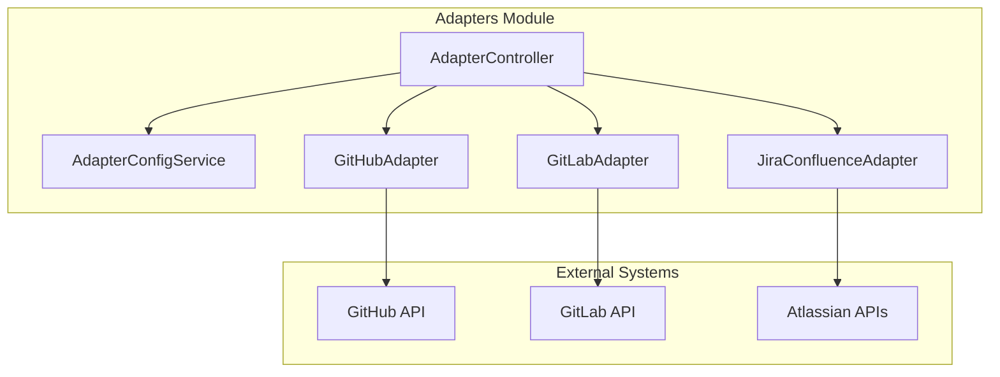
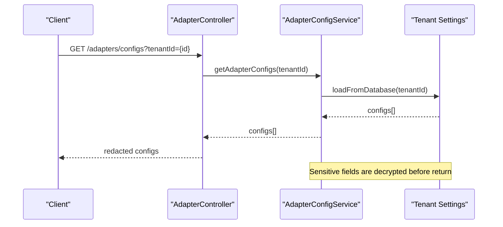
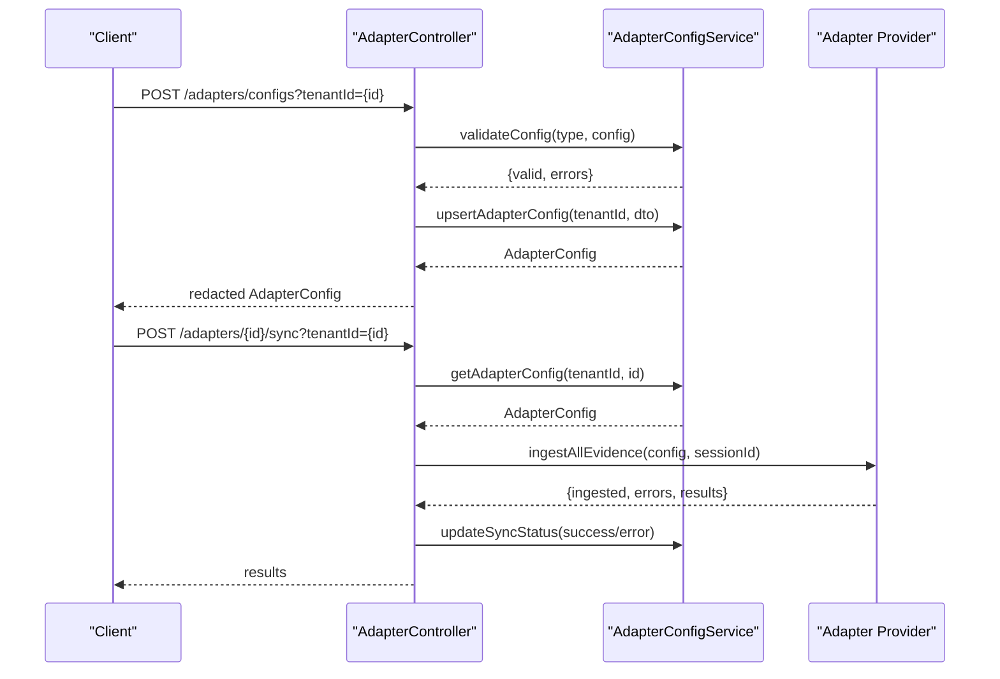
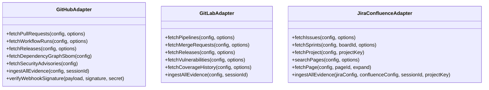
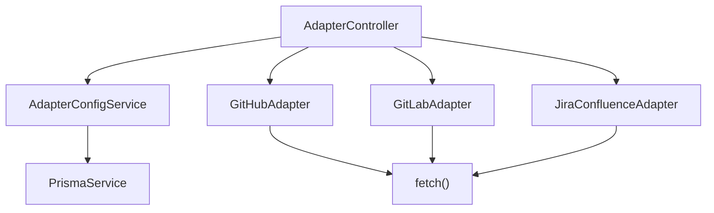

# Adapter Configuration Management

<cite>
**Referenced Files in This Document**
- [adapter-config.service.ts](file://apps/api/src/modules/adapters/adapter-config.service.ts)
- [adapter.controller.ts](file://apps/api/src/modules/adapters/adapter.controller.ts)
- [adapters.module.ts](file://apps/api/src/modules/adapters/adapters.module.ts)
- [github.adapter.ts](file://apps/api/src/modules/adapters/github.adapter.ts)
- [gitlab.adapter.ts](file://apps/api/src/modules/adapters/gitlab.adapter.ts)
- [jira-confluence.adapter.ts](file://apps/api/src/modules/adapters/jira-confluence.adapter.ts)
- [configuration.ts](file://apps/api/src/config/configuration.ts)
</cite>

## Table of Contents
1. [Introduction](#introduction)
2. [Project Structure](#project-structure)
3. [Core Components](#core-components)
4. [Architecture Overview](#architecture-overview)
5. [Detailed Component Analysis](#detailed-component-analysis)
6. [Dependency Analysis](#dependency-analysis)
7. [Performance Considerations](#performance-considerations)
8. [Troubleshooting Guide](#troubleshooting-guide)
9. [Conclusion](#conclusion)
10. [Appendices](#appendices)

## Introduction
This document describes the adapter configuration management system used to integrate external systems (GitHub, GitLab, Jira, Confluence, Azure DevOps) into the platform. It covers how configurations are stored, validated, and managed at runtime, how environment variables are handled, and how the system supports secure credential storage, validation, and operational tasks such as testing connections, syncing evidence, and webhook handling. It also provides guidance for extending the system with new adapter types and implementing configuration hot-swapping.

## Project Structure
The adapter configuration system is organized around three primary modules:
- Adapter configuration service: central logic for storing, validating, and retrieving adapter configurations
- Adapter controllers: REST endpoints for CRUD operations, connection testing, and sync orchestration
- Adapter providers: integrations with external systems (GitHub, GitLab, Jira/Confluence)



**Diagram sources**
- [adapters.module.ts:10-16](file://apps/api/src/modules/adapters/adapters.module.ts#L10-L16)
- [adapter.controller.ts:94-99](file://apps/api/src/modules/adapters/adapter.controller.ts#L94-L99)
- [adapter-config.service.ts:78-85](file://apps/api/src/modules/adapters/adapter-config.service.ts#L78-L85)

**Section sources**
- [adapters.module.ts:1-17](file://apps/api/src/modules/adapters/adapters.module.ts#L1-L17)

## Core Components
- AdapterConfigService: Provides CRUD operations, validation, caching, encryption/decryption placeholders, and persistence to tenant settings
- AdapterController: Exposes REST endpoints for listing/getting/updating/deleting configurations, testing connections, triggering syncs, and handling webhooks
- Adapter providers: GitHubAdapter, GitLabAdapter, JiraConfluenceAdapter encapsulate API interactions and evidence extraction

Key responsibilities:
- Secure credential handling: sensitive fields are redacted in responses and encrypted/decrypted in placeholders
- Validation: required fields per adapter type are enforced
- Runtime updates: cache invalidation on write operations
- Environment fallback: default configurations loaded from environment variables when DB is unavailable

**Section sources**
- [adapter-config.service.ts:78-448](file://apps/api/src/modules/adapters/adapter-config.service.ts#L78-L448)
- [adapter.controller.ts:94-558](file://apps/api/src/modules/adapters/adapter.controller.ts#L94-L558)

## Architecture Overview
The system follows a layered architecture:
- Presentation: AdapterController exposes REST endpoints
- Application: AdapterConfigService manages configuration lifecycle
- Persistence: Tenant settings table stores serialized configurations
- External integrations: Adapter providers call third-party APIs



**Diagram sources**
- [adapter.controller.ts:132-151](file://apps/api/src/modules/adapters/adapter.controller.ts#L132-L151)
- [adapter-config.service.ts:318-344](file://apps/api/src/modules/adapters/adapter-config.service.ts#L318-L344)

## Detailed Component Analysis

### Adapter Configuration Service
Responsibilities:
- Load configurations from database or environment fallback
- Validate required fields per adapter type
- Upsert/delete configurations with cache invalidation
- Update sync status and timestamps
- Encrypt/decrypt sensitive fields (placeholder implementation)
- Provide adapter type metadata and capabilities

```mermaid
classDiagram
class AdapterConfigService {
-configCache : Map~string, AdapterConfig[]~
+getAdapterConfigs(tenantId) : Promise~AdapterConfig[]~
+getAdapterConfig(tenantId, adapterId) : Promise~AdapterConfig|null~
+getEnabledAdapters(tenantId, type?) : Promise~AdapterConfig[]~
+upsertAdapterConfig(tenantId, data) : Promise~AdapterConfig~
+deleteAdapterConfig(tenantId, adapterId) : Promise~void~
+updateSyncStatus(tenantId, adapterId, status, error?) : Promise~void~
+validateConfig(type, config) : {valid, errors}
+getAdapterTypeInfo(type) : TypeInfo
+getSupportedAdapterTypes() : TypeInfo[]
-encryptSensitiveFields(config) : Record
-decryptSensitiveFields(config) : Record
-loadFromDatabase(tenantId) : Promise~AdapterConfig[]~
-saveToDatabase(tenantId, config) : Promise~void~
-removeFromDatabase(tenantId, adapterId) : Promise~void~
-getDefaultConfigs() : AdapterConfig[]
}
```

**Diagram sources**
- [adapter-config.service.ts:78-448](file://apps/api/src/modules/adapters/adapter-config.service.ts#L78-L448)

**Section sources**
- [adapter-config.service.ts:87-183](file://apps/api/src/modules/adapters/adapter-config.service.ts#L87-L183)
- [adapter-config.service.ts:185-288](file://apps/api/src/modules/adapters/adapter-config.service.ts#L185-L288)
- [adapter-config.service.ts:301-382](file://apps/api/src/modules/adapters/adapter-config.service.ts#L301-L382)
- [adapter-config.service.ts:384-446](file://apps/api/src/modules/adapters/adapter-config.service.ts#L384-L446)

### Adapter Controller
Endpoints:
- List/get/update/delete configurations
- Test connections against external systems
- Trigger sync operations for individual adapters or all enabled adapters
- Handle webhooks from GitHub and GitLab with signature/token verification



**Diagram sources**
- [adapter.controller.ts:167-181](file://apps/api/src/modules/adapters/adapter.controller.ts#L167-L181)
- [adapter.controller.ts:294-394](file://apps/api/src/modules/adapters/adapter.controller.ts#L294-L394)

**Section sources**
- [adapter.controller.ts:101-118](file://apps/api/src/modules/adapters/adapter.controller.ts#L101-L118)
- [adapter.controller.ts:120-227](file://apps/api/src/modules/adapters/adapter.controller.ts#L120-L227)
- [adapter.controller.ts:229-290](file://apps/api/src/modules/adapters/adapter.controller.ts#L229-L290)
- [adapter.controller.ts:292-440](file://apps/api/src/modules/adapters/adapter.controller.ts#L292-L440)

### Adapter Providers
- GitHubAdapter: Fetches pull requests, workflow runs, releases, SBOMs, and security advisories; supports webhook verification
- GitLabAdapter: Fetches pipelines, jobs, merge requests, releases, vulnerabilities, and coverage; validates API URL and enforces security constraints
- JiraConfluenceAdapter: Fetches issues, sprints, projects, and pages; validates Atlassian domain and endpoints; supports documentation synchronization



**Diagram sources**
- [github.adapter.ts:118-592](file://apps/api/src/modules/adapters/github.adapter.ts#L118-L592)
- [gitlab.adapter.ts:183-800](file://apps/api/src/modules/adapters/gitlab.adapter.ts#L183-L800)
- [jira-confluence.adapter.ts:132-913](file://apps/api/src/modules/adapters/jira-confluence.adapter.ts#L132-L913)

**Section sources**
- [github.adapter.ts:170-564](file://apps/api/src/modules/adapters/github.adapter.ts#L170-L564)
- [gitlab.adapter.ts:356-784](file://apps/api/src/modules/adapters/gitlab.adapter.ts#L356-L784)
- [jira-confluence.adapter.ts:305-898](file://apps/api/src/modules/adapters/jira-confluence.adapter.ts#L305-L898)

### Configuration Schema and Validation
Each adapter type defines a configuration schema and required fields:
- GitHub: token, owner, repo; optional apiUrl, webhookSecret; syncOptions for PRs, workflow runs, releases, SBOMs, security advisories
- GitLab: token, projectId; optional apiUrl, webhookToken; syncOptions for pipelines, merge requests, releases, vulnerabilities, coverage
- Jira: domain, email, apiToken, projectKey; optional boardId; syncOptions for issues, sprints, comments, attachments
- Confluence: domain, email, apiToken, spaceKey; optional parentPageId; syncOptions for pages, attachments, bidirectional
- Azure DevOps: organizationUrl, personalAccessToken, project; used by Jira/Confluence adapter for unified ingestion

Validation ensures required fields are present and non-empty. The service maintains a required-fields map per type and returns structured validation errors.

**Section sources**
- [adapter-config.service.ts:21-75](file://apps/api/src/modules/adapters/adapter-config.service.ts#L21-L75)
- [adapter-config.service.ts:185-240](file://apps/api/src/modules/adapters/adapter-config.service.ts#L185-L240)

### Environment Variable Handling and Defaults
The system loads default configurations from environment variables when no database entries exist:
- GitHub: GITHUB_TOKEN, GITHUB_OWNER, GITHUB_REPO
- GitLab: GITLAB_TOKEN, GITLAB_PROJECT_ID, GITLAB_API_URL
- Jira: JIRA_API_TOKEN, JIRA_DOMAIN, JIRA_EMAIL, JIRA_PROJECT_KEY

These defaults are only applied when environment variables are present, ensuring deployments can start with minimal configuration while still supporting full runtime updates.

**Section sources**
- [adapter-config.service.ts:384-446](file://apps/api/src/modules/adapters/adapter-config.service.ts#L384-L446)

### Secure Credential Management
- Encryption/decryption: Placeholder methods exist for encrypting sensitive fields before storage and decrypting on retrieval
- Redaction: Sensitive fields are redacted in API responses (token, apiToken, personalAccessToken, webhookSecret, webhookToken)
- Webhook verification: GitHub and GitLab webhooks are verified using HMAC signatures and shared tokens respectively

Recommendations for production:
- Replace placeholder encryption with robust encryption (e.g., AES-256) and integrate with Azure Key Vault
- Store encryption keys separately from application code
- Use environment-specific secrets management and rotation policies

**Section sources**
- [adapter-config.service.ts:307-316](file://apps/api/src/modules/adapters/adapter-config.service.ts#L307-L316)
- [adapter.controller.ts:539-556](file://apps/api/src/modules/adapters/adapter.controller.ts#L539-L556)
- [adapter.controller.ts:446-535](file://apps/api/src/modules/adapters/adapter.controller.ts#L446-L535)

### Runtime Configuration Updates and Hot-Swapping
- Cache invalidation: On create/update/delete, the service removes tenant configurations from cache to ensure subsequent reads reflect the latest state
- Sync status updates: Dedicated endpoint updates sync status, last sync timestamp, and last error
- Hot-swapping: Because configurations are reloaded per tenant on demand, updates take effect immediately without requiring restarts

Operational guidance:
- After updating a configuration, subsequent requests will pick up the new settings
- Use the sync endpoints to validate changes and trigger incremental updates

**Section sources**
- [adapter-config.service.ts:145-149](file://apps/api/src/modules/adapters/adapter-config.service.ts#L145-L149)
- [adapter-config.service.ts:181-183](file://apps/api/src/modules/adapters/adapter-config.service.ts#L181-L183)
- [adapter.controller.ts:396-440](file://apps/api/src/modules/adapters/adapter.controller.ts#L396-L440)

### Configuration Backup and Restore
Backup:
- Persisted in tenant_settings table under key "adapter_configs" as JSONB
- Snapshot the tenant_settings row for a given tenantId to back up adapter configurations

Restore:
- Write the backed-up JSONB blob back to tenant_settings for the target tenantId
- Ensure environment variables remain consistent if defaults were used

Note: The current implementation uses a JSONB column; ensure backups capture the exact tenant_id and key to avoid conflicts.

**Section sources**
- [adapter-config.service.ts:346-382](file://apps/api/src/modules/adapters/adapter-config.service.ts#L346-L382)

### Environment-Specific Settings
- CORS_ORIGIN must be explicitly set in production (not wildcard)
- JWT secrets must be strong and not default values
- Database URL is required for production
- Email providers support multiple providers via environment variables

These validations occur during configuration initialization to fail fast in production.

**Section sources**
- [configuration.ts:5-27](file://apps/api/src/config/configuration.ts#L5-L27)
- [configuration.ts:87-114](file://apps/api/src/config/configuration.ts#L87-L114)

## Dependency Analysis


**Diagram sources**
- [adapters.module.ts:10-16](file://apps/api/src/modules/adapters/adapters.module.ts#L10-L16)
- [adapter.controller.ts:94-99](file://apps/api/src/modules/adapters/adapter.controller.ts#L94-L99)
- [adapter-config.service.ts:82-85](file://apps/api/src/modules/adapters/adapter-config.service.ts#L82-L85)

**Section sources**
- [adapters.module.ts:1-17](file://apps/api/src/modules/adapters/adapters.module.ts#L1-L17)

## Performance Considerations
- Caching: AdapterConfigService caches configurations per tenant to reduce database queries
- Batch operations: Sync endpoints support bulk ingestion; consider pagination and rate limiting for external APIs
- Hashing: Evidence hashing uses SHA-256; ensure hashing overhead remains acceptable for high-volume syncs
- Network security: GitLab and Atlassian adapters enforce strict URL validation and reject private/internal addresses

[No sources needed since this section provides general guidance]

## Troubleshooting Guide
Common issues and resolutions:
- Missing required fields: Validation errors indicate which fields are missing; ensure all required fields are provided per adapter type
- Connection failures: Use test-connection endpoints to validate credentials and endpoints
- Webhook signature/token mismatches: Verify webhook secrets/tokens match configuration and are passed correctly
- Database connectivity: When DB is unavailable, the system falls back to environment-based defaults; confirm environment variables are set

Operational checks:
- Confirm tenantId is correct for all endpoints
- Review sync status updates for error details
- Inspect logs for HTTP exceptions from external APIs

**Section sources**
- [adapter.controller.ts:172-177](file://apps/api/src/modules/adapters/adapter.controller.ts#L172-L177)
- [adapter.controller.ts:282-289](file://apps/api/src/modules/adapters/adapter.controller.ts#L282-L289)
- [adapter.controller.ts:446-535](file://apps/api/src/modules/adapters/adapter.controller.ts#L446-L535)
- [adapter-config.service.ts:336-340](file://apps/api/src/modules/adapters/adapter-config.service.ts#L336-L340)

## Conclusion
The adapter configuration management system provides a robust foundation for integrating multiple external systems with secure configuration handling, validation, and runtime updates. By leveraging environment variables for defaults, a centralized configuration service, and adapter providers for external integrations, the system supports extensibility and operational flexibility. For production, prioritize encryption integration, strict secrets management, and comprehensive monitoring to ensure reliability and security.

[No sources needed since this section summarizes without analyzing specific files]

## Appendices

### Extending the System for New Adapter Types
Steps to add a new adapter:
1. Define configuration schema and required fields in AdapterConfigService
2. Implement adapter provider with API interactions and evidence extraction
3. Add adapter type to supported types and capability metadata
4. Integrate with AdapterController for CRUD, testing, and sync operations
5. Update validation and environment fallback logic as needed

Guidance:
- Keep sensitive fields encrypted/decrypted consistently
- Implement webhook verification where applicable
- Use structured validation errors for better UX
- Add pagination and rate-limiting for external API calls

**Section sources**
- [adapter-config.service.ts:28-75](file://apps/api/src/modules/adapters/adapter-config.service.ts#L28-L75)
- [adapter-config.service.ts:185-240](file://apps/api/src/modules/adapters/adapter-config.service.ts#L185-L240)
- [adapter-config.service.ts:292-299](file://apps/api/src/modules/adapters/adapter-config.service.ts#L292-L299)