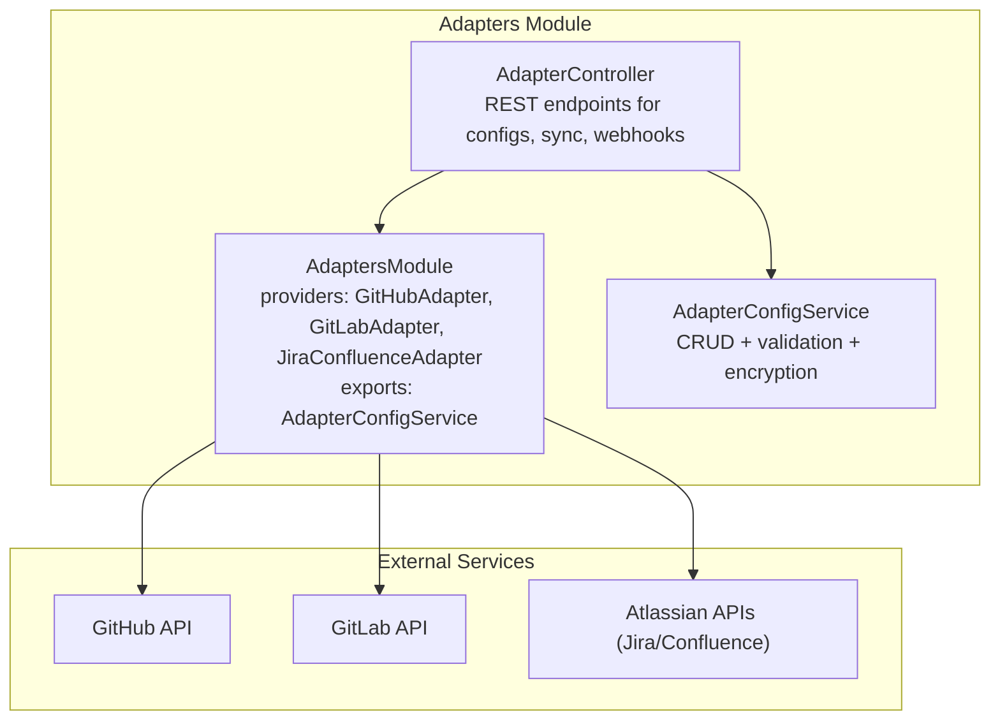
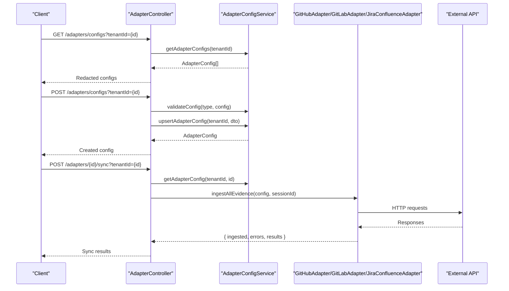
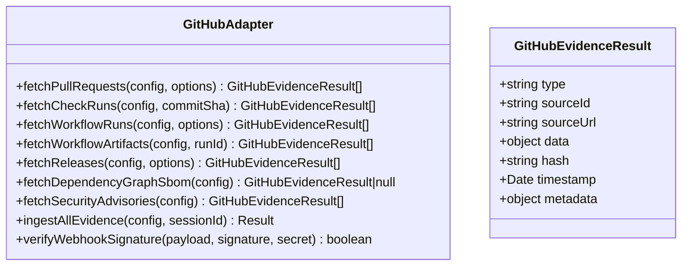
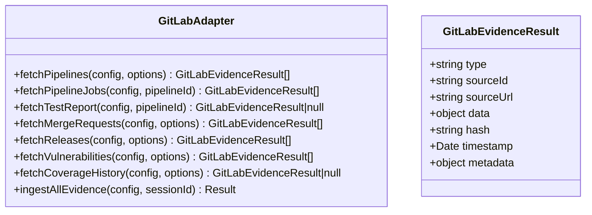
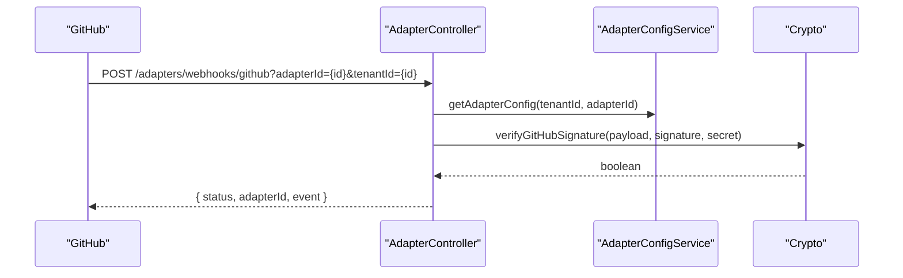
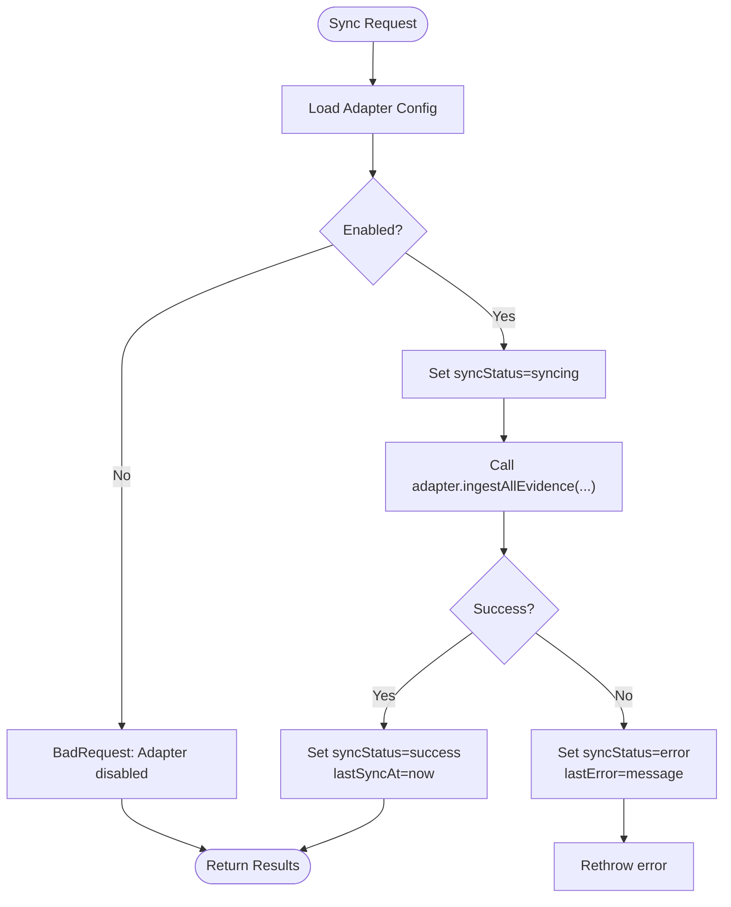
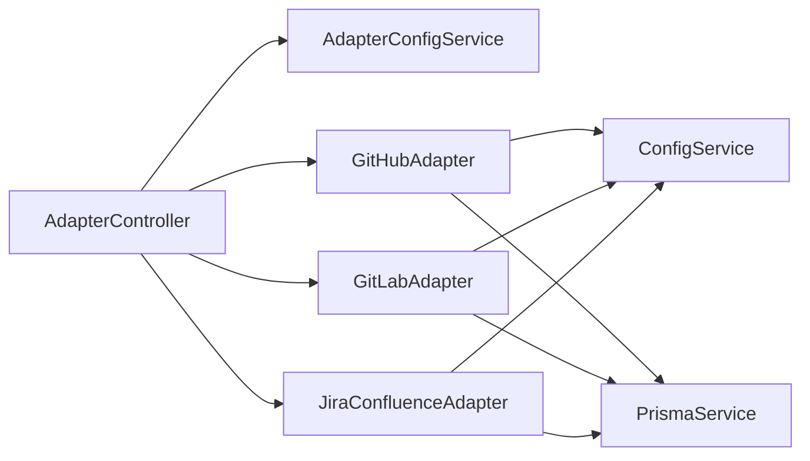

# External Service Adapters

<cite>
**Referenced Files in This Document**
- [adapters.module.ts](file://apps/api/src/modules/adapters/adapters.module.ts)
- [adapter.controller.ts](file://apps/api/src/modules/adapters/adapter.controller.ts)
- [adapter-config.service.ts](file://apps/api/src/modules/adapters/adapter-config.service.ts)
- [github.adapter.ts](file://apps/api/src/modules/adapters/github.adapter.ts)
- [gitlab.adapter.ts](file://apps/api/src/modules/adapters/gitlab.adapter.ts)
- [jira-confluence.adapter.ts](file://apps/api/src/modules/adapters/jira-confluence.adapter.ts)
- [github.adapter.spec.ts](file://apps/api/src/modules/adapters/github.adapter.spec.ts)
- [gitlab.adapter.spec.ts](file://apps/api/src/modules/adapters/gitlab.adapter.spec.ts)
- [jira-confluence.adapter.spec.ts](file://apps/api/src/modules/adapters/jira-confluence.adapter.spec.ts)
</cite>

## Table of Contents
1. [Introduction](#introduction)
2. [Project Structure](#project-structure)
3. [Core Components](#core-components)
4. [Architecture Overview](#architecture-overview)
5. [Detailed Component Analysis](#detailed-component-analysis)
6. [Dependency Analysis](#dependency-analysis)
7. [Performance Considerations](#performance-considerations)
8. [Troubleshooting Guide](#troubleshooting-guide)
9. [Conclusion](#conclusion)

## Introduction
This document explains the adapter pattern implementation used to integrate external services in the platform. It covers the architecture for GitHub, GitLab, and Jira-Confluence adapters, detailing interface contracts, authentication mechanisms, data transformation patterns, error handling, and webhook security. It also provides guidance for adding new adapters while following established patterns and outlines security considerations for tokens, OAuth flows, and data protection.

## Project Structure
The adapter subsystem is organized under the Adapters module with a clear separation of concerns:
- Module wiring and exports
- Configuration management for adapter credentials and sync options
- REST controller exposing CRUD and sync operations
- Individual adapter implementations for each external service
- Webhook endpoints for event-driven synchronization



**Diagram sources**
- [adapters.module.ts:10-16](file://apps/api/src/modules/adapters/adapters.module.ts#L10-L16)
- [adapter.controller.ts:93-99](file://apps/api/src/modules/adapters/adapter.controller.ts#L93-L99)
- [adapter-config.service.ts:77-85](file://apps/api/src/modules/adapters/adapter-config.service.ts#L77-L85)

**Section sources**
- [adapters.module.ts:1-17](file://apps/api/src/modules/adapters/adapters.module.ts#L1-L17)
- [adapter.controller.ts:93-99](file://apps/api/src/modules/adapters/adapter.controller.ts#L93-L99)

## Core Components
- AdaptersModule: Declares and wires the three adapters and configuration service.
- AdapterController: Exposes endpoints for listing, creating, updating, deleting adapter configurations; testing connections; triggering syncs; and handling webhooks.
- AdapterConfigService: Manages adapter configurations, validates required fields, encrypts/decrypts sensitive data placeholders, persists to database, and exposes type metadata.

Key responsibilities:
- Configuration validation per adapter type
- Sensitive field redaction in responses
- Sync status tracking and persistence
- Type metadata and capability descriptions

**Section sources**
- [adapters.module.ts:10-16](file://apps/api/src/modules/adapters/adapters.module.ts#L10-L16)
- [adapter.controller.ts:122-181](file://apps/api/src/modules/adapters/adapter.controller.ts#L122-L181)
- [adapter.controller.ts:183-227](file://apps/api/src/modules/adapters/adapter.controller.ts#L183-L227)
- [adapter.controller.ts:231-290](file://apps/api/src/modules/adapters/adapter.controller.ts#L231-L290)
- [adapter.controller.ts:294-394](file://apps/api/src/modules/adapters/adapter.controller.ts#L294-L394)
- [adapter.controller.ts:396-440](file://apps/api/src/modules/adapters/adapter.controller.ts#L396-L440)
- [adapter.controller.ts:442-535](file://apps/api/src/modules/adapters/adapter.controller.ts#L442-L535)
- [adapter.controller.ts:539-556](file://apps/api/src/modules/adapters/adapter.controller.ts#L539-L556)
- [adapter-config.service.ts:77-183](file://apps/api/src/modules/adapters/adapter-config.service.ts#L77-L183)
- [adapter-config.service.ts:185-240](file://apps/api/src/modules/adapters/adapter-config.service.ts#L185-L240)
- [adapter-config.service.ts:242-288](file://apps/api/src/modules/adapters/adapter-config.service.ts#L242-L288)
- [adapter-config.service.ts:290-299](file://apps/api/src/modules/adapters/adapter-config.service.ts#L290-L299)
- [adapter-config.service.ts:307-316](file://apps/api/src/modules/adapters/adapter-config.service.ts#L307-L316)
- [adapter-config.service.ts:318-382](file://apps/api/src/modules/adapters/adapter-config.service.ts#L318-L382)

## Architecture Overview
The adapter architecture follows a modular, service-oriented design:
- REST layer: AdapterController handles HTTP requests and delegates to adapters and configuration service.
- Adapter layer: Each adapter encapsulates service-specific logic, authentication, and data transformation.
- Configuration layer: AdapterConfigService centralizes validation, persistence, and metadata.
- Security: Webhook endpoints authenticate via service-specific signatures/tokens; sensitive fields are redacted in responses.



**Diagram sources**
- [adapter.controller.ts:122-181](file://apps/api/src/modules/adapters/adapter.controller.ts#L122-L181)
- [adapter.controller.ts:183-227](file://apps/api/src/modules/adapters/adapter.controller.ts#L183-L227)
- [adapter.controller.ts:294-394](file://apps/api/src/modules/adapters/adapter.controller.ts#L294-L394)
- [adapter-config.service.ts:89-150](file://apps/api/src/modules/adapters/adapter-config.service.ts#L89-L150)
- [github.adapter.ts:461-564](file://apps/api/src/modules/adapters/github.adapter.ts#L461-L564)
- [gitlab.adapter.ts:712-784](file://apps/api/src/modules/adapters/gitlab.adapter.ts#L712-L784)
- [jira-confluence.adapter.ts:833-898](file://apps/api/src/modules/adapters/jira-confluence.adapter.ts#L833-L898)

## Detailed Component Analysis

### GitHub Adapter
Purpose: Ingest evidence from GitHub repositories including pull requests, workflow runs, releases, SBOMs, and security advisories.

Key patterns:
- Authentication: Bearer token with explicit API version header.
- Pagination: Configurable perPage/page with sensible defaults.
- Data transformation: Maps external fields to a unified evidence structure with hashing and timestamps.
- Error handling: Propagates HTTP exceptions with status codes; wraps network failures.



**Diagram sources**
- [github.adapter.ts:17-115](file://apps/api/src/modules/adapters/github.adapter.ts#L17-L115)
- [github.adapter.ts:118-592](file://apps/api/src/modules/adapters/github.adapter.ts#L118-L592)

**Section sources**
- [github.adapter.ts:124-164](file://apps/api/src/modules/adapters/github.adapter.ts#L124-L164)
- [github.adapter.ts:173-211](file://apps/api/src/modules/adapters/github.adapter.ts#L173-L211)
- [github.adapter.ts:216-245](file://apps/api/src/modules/adapters/github.adapter.ts#L216-L245)
- [github.adapter.ts:250-290](file://apps/api/src/modules/adapters/github.adapter.ts#L250-L290)
- [github.adapter.ts:295-330](file://apps/api/src/modules/adapters/github.adapter.ts#L295-L330)
- [github.adapter.ts:335-373](file://apps/api/src/modules/adapters/github.adapter.ts#L335-L373)
- [github.adapter.ts:378-402](file://apps/api/src/modules/adapters/github.adapter.ts#L378-L402)
- [github.adapter.ts:407-456](file://apps/api/src/modules/adapters/github.adapter.ts#L407-L456)
- [github.adapter.ts:461-564](file://apps/api/src/modules/adapters/github.adapter.ts#L461-L564)
- [github.adapter.ts:583-590](file://apps/api/src/modules/adapters/github.adapter.ts#L583-L590)

### GitLab Adapter
Purpose: Ingest evidence from GitLab projects including pipelines, jobs, test reports, merge requests, releases, vulnerabilities, and coverage metrics.

Key patterns:
- Security-first URL validation: Enforces trusted base URL, HTTPS, no credentials in URL, and disallows private/loopback IPs.
- Endpoint sanitization: Prevents path traversal and injection.
- Authentication: PRIVATE-TOKEN header.
- Data transformation: Maps GitLab resources to unified evidence results.



**Diagram sources**
- [gitlab.adapter.ts:19-180](file://apps/api/src/modules/adapters/gitlab.adapter.ts#L19-L180)
- [gitlab.adapter.ts:182-800](file://apps/api/src/modules/adapters/gitlab.adapter.ts#L182-L800)

**Section sources**
- [gitlab.adapter.ts:222-278](file://apps/api/src/modules/adapters/gitlab.adapter.ts#L222-L278)
- [gitlab.adapter.ts:280-298](file://apps/api/src/modules/adapters/gitlab.adapter.ts#L280-L298)
- [gitlab.adapter.ts:300-346](file://apps/api/src/modules/adapters/gitlab.adapter.ts#L300-L346)
- [gitlab.adapter.ts:359-403](file://apps/api/src/modules/adapters/gitlab.adapter.ts#L359-L403)
- [gitlab.adapter.ts:408-450](file://apps/api/src/modules/adapters/gitlab.adapter.ts#L408-L450)
- [gitlab.adapter.ts:455-501](file://apps/api/src/modules/adapters/gitlab.adapter.ts#L455-L501)
- [gitlab.adapter.ts:506-554](file://apps/api/src/modules/adapters/gitlab.adapter.ts#L506-L554)
- [gitlab.adapter.ts:559-594](file://apps/api/src/modules/adapters/gitlab.adapter.ts#L559-L594)
- [gitlab.adapter.ts:599-653](file://apps/api/src/modules/adapters/gitlab.adapter.ts#L599-L653)
- [gitlab.adapter.ts:658-707](file://apps/api/src/modules/adapters/gitlab.adapter.ts#L658-L707)
- [gitlab.adapter.ts:712-784](file://apps/api/src/modules/adapters/gitlab.adapter.ts#L712-L784)

### Jira-Confluence Adapter
Purpose: Ingest Jira issues and sprints, and Confluence pages and attachments. Also supports bidirectional sync for documentation.

Key patterns:
- Domain validation: Trusted Jira domain enforced; rejects localhost/private ranges and non-cloud domains.
- Endpoint sanitization: Prevents injection and path traversal.
- Authentication: Basic auth with email:apiToken.
- Data transformation: Maps Jira/Confluence resources to unified evidence results.

```mermaid
classDiagram
class JiraConfluenceAdapter {
+fetchIssues(config, options) JiraEvidenceResult[]
+fetchIssueDetails(config, issueKey) JiraEvidenceResult
+fetchSprints(config, boardId, options) JiraEvidenceResult[]
+fetchProject(config, projectKey) JiraEvidenceResult
+searchPages(config, options) JiraEvidenceResult[]
+fetchPage(config, pageId, expand) JiraEvidenceResult
+fetchPagesByLabel(config, label, options) JiraEvidenceResult[]
+fetchChildPages(config, parentId, options) JiraEvidenceResult[]
+syncPage(config, options) JiraEvidenceResult
+syncDocumentation(config, documents, parentPageId) { synced, errors }
+ingestAllEvidence(jiraConfig, confluenceConfig, sessionId, projectKey) Result
}
class JiraEvidenceResult {
+string type
+string sourceId
+string sourceUrl
+object data
+string hash
+Date timestamp
+object metadata
}
```

**Diagram sources**
- [jira-confluence.adapter.ts:17-129](file://apps/api/src/modules/adapters/jira-confluence.adapter.ts#L17-L129)
- [jira-confluence.adapter.ts:132-913](file://apps/api/src/modules/adapters/jira-confluence.adapter.ts#L132-L913)

**Section sources**
- [jira-confluence.adapter.ts:140-207](file://apps/api/src/modules/adapters/jira-confluence.adapter.ts#L140-L207)
- [jira-confluence.adapter.ts:209-277](file://apps/api/src/modules/adapters/jira-confluence.adapter.ts#L209-L277)
- [jira-confluence.adapter.ts:239-299](file://apps/api/src/modules/adapters/jira-confluence.adapter.ts#L239-L299)
- [jira-confluence.adapter.ts:307-405](file://apps/api/src/modules/adapters/jira-confluence.adapter.ts#L307-L405)
- [jira-confluence.adapter.ts:410-456](file://apps/api/src/modules/adapters/jira-confluence.adapter.ts#L410-L456)
- [jira-confluence.adapter.ts:458-504](file://apps/api/src/modules/adapters/jira-confluence.adapter.ts#L458-L504)
- [jira-confluence.adapter.ts:509-536](file://apps/api/src/modules/adapters/jira-confluence.adapter.ts#L509-L536)
- [jira-confluence.adapter.ts:540-636](file://apps/api/src/modules/adapters/jira-confluence.adapter.ts#L540-L636)
- [jira-confluence.adapter.ts:641-698](file://apps/api/src/modules/adapters/jira-confluence.adapter.ts#L641-L698)
- [jira-confluence.adapter.ts:767-807](file://apps/api/src/modules/adapters/jira-confluence.adapter.ts#L767-L807)
- [jira-confluence.adapter.ts:833-898](file://apps/api/src/modules/adapters/jira-confluence.adapter.ts#L833-L898)

### Adapter Configuration and Validation
- Types and required fields: Centralized validation rules per adapter type.
- Encryption/decryption: Placeholder methods for sensitive field handling (to be backed by secure storage in production).
- Persistence: Stores configurations in tenant settings with JSON serialization and cache invalidation.
- Metadata: Provides display info and capabilities per adapter type.

**Section sources**
- [adapter-config.service.ts:6-19](file://apps/api/src/modules/adapters/adapter-config.service.ts#L6-L19)
- [adapter-config.service.ts:21-75](file://apps/api/src/modules/adapters/adapter-config.service.ts#L21-L75)
- [adapter-config.service.ts:185-240](file://apps/api/src/modules/adapters/adapter-config.service.ts#L185-L240)
- [adapter-config.service.ts:242-288](file://apps/api/src/modules/adapters/adapter-config.service.ts#L242-L288)
- [adapter-config.service.ts:307-316](file://apps/api/src/modules/adapters/adapter-config.service.ts#L307-L316)
- [adapter-config.service.ts:318-382](file://apps/api/src/modules/adapters/adapter-config.service.ts#L318-L382)

### Webhook Endpoints and Security
- GitHub: Verifies HMAC-SHA256 signature using webhook secret; logs and rejects mismatches.
- GitLab: Validates secret token using constant-time comparison; logs and rejects missing/invalid tokens.
- General: Uses @Public guard for webhook endpoints (no JWT required).



**Diagram sources**
- [adapter.controller.ts:444-490](file://apps/api/src/modules/adapters/adapter.controller.ts#L444-L490)

**Section sources**
- [adapter.controller.ts:444-490](file://apps/api/src/modules/adapters/adapter.controller.ts#L444-L490)
- [adapter.controller.ts:492-535](file://apps/api/src/modules/adapters/adapter.controller.ts#L492-L535)

### Sync Operations and Retry Strategy
- Triggering sync: POST /adapters/{id}/sync sets sync status to "syncing", executes adapter ingestion, then updates status to "success" or "error".
- Bulk sync: POST /adapters/sync-all iterates enabled adapters and aggregates results.
- Error handling: Captures errors, updates status with error message, and rethrows to caller.



**Diagram sources**
- [adapter.controller.ts:314-394](file://apps/api/src/modules/adapters/adapter.controller.ts#L314-L394)
- [adapter.controller.ts:400-440](file://apps/api/src/modules/adapters/adapter.controller.ts#L400-L440)

**Section sources**
- [adapter.controller.ts:294-394](file://apps/api/src/modules/adapters/adapter.controller.ts#L294-L394)
- [adapter.controller.ts:396-440](file://apps/api/src/modules/adapters/adapter.controller.ts#L396-L440)

## Dependency Analysis
- Coupling: AdapterController depends on AdapterConfigService and individual adapters. Adapters depend on ConfigService and PrismaService for persistence.
- Cohesion: Each adapter encapsulates service-specific logic, headers, endpoints, and transformations.
- External dependencies: fetch-based HTTP clients with centralized error handling.



**Diagram sources**
- [adapter.controller.ts:93-99](file://apps/api/src/modules/adapters/adapter.controller.ts#L93-L99)
- [adapters.module.ts:10-16](file://apps/api/src/modules/adapters/adapters.module.ts#L10-L16)
- [github.adapter.ts:122](file://apps/api/src/modules/adapters/github.adapter.ts#L122)
- [gitlab.adapter.ts:187-190](file://apps/api/src/modules/adapters/gitlab.adapter.ts#L187-L190)
- [jira-confluence.adapter.ts:135-138](file://apps/api/src/modules/adapters/jira-confluence.adapter.ts#L135-L138)

**Section sources**
- [adapter.controller.ts:93-99](file://apps/api/src/modules/adapters/adapter.controller.ts#L93-L99)
- [adapters.module.ts:10-16](file://apps/api/src/modules/adapters/adapters.module.ts#L10-L16)

## Performance Considerations
- Pagination: Adapters use perPage/page parameters to limit API load; adjust defaults based on workload.
- Hashing: SHA-256 hashing of evidence payloads ensures idempotency checks; consider caching hashed results.
- Network reliability: Adapters wrap network failures into SERVICE_UNAVAILABLE; callers should implement retry/backoff.
- Rate limiting: No built-in rate limiter; implement client-side throttling or upstream retries with exponential backoff when encountering 429/503 responses.
- Caching: AdapterConfigService caches tenant configs; invalidate on updates to avoid stale data.

[No sources needed since this section provides general guidance]

## Troubleshooting Guide
Common issues and resolutions:
- Authentication failures:
  - GitHub: Ensure token has required scopes and is not expired.
  - GitLab: Confirm PRIVATE-TOKEN header and trusted base URL match expectations.
  - Jira/Confluence: Verify email:apiToken and domain matches trusted JIRA_DOMAIN.
- URL/domain validation errors:
  - GitLab: Check apiUrl matches trusted URL, uses HTTPS, and resolves to public IP.
  - Jira/Confluence: Ensure domain ends with .atlassian.net and is not localhost/private.
- Webhook signature/token mismatches:
  - GitHub: Verify webhookSecret matches payload signature.
  - GitLab: Confirm x-gitlab-token equals configured webhook token.
- Sync errors:
  - Review sync status and lastError fields; inspect adapter logs for detailed messages.

**Section sources**
- [gitlab.adapter.ts:222-278](file://apps/api/src/modules/adapters/gitlab.adapter.ts#L222-L278)
- [jira-confluence.adapter.ts:140-207](file://apps/api/src/modules/adapters/jira-confluence.adapter.ts#L140-L207)
- [adapter.controller.ts:444-490](file://apps/api/src/modules/adapters/adapter.controller.ts#L444-L490)
- [adapter.controller.ts:492-535](file://apps/api/src/modules/adapters/adapter.controller.ts#L492-L535)
- [adapter.controller.ts:314-394](file://apps/api/src/modules/adapters/adapter.controller.ts#L314-L394)

## Conclusion
The adapter subsystem provides a robust, extensible foundation for integrating external services. It enforces strong validation, secure authentication, and consistent data transformation while offering flexible configuration and webhook support. Following the established patterns enables adding new adapters with minimal friction and consistent behavior across the platform.