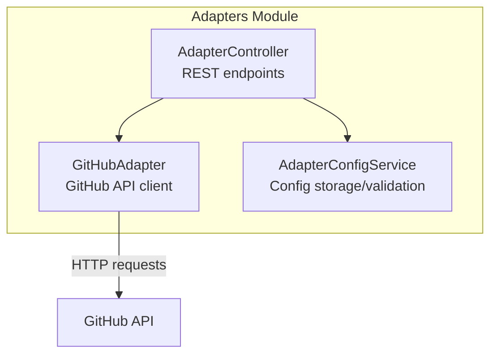
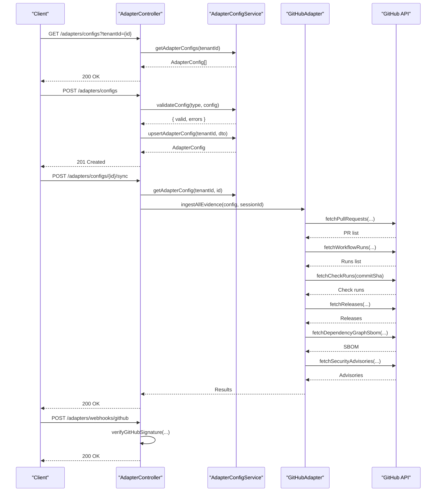
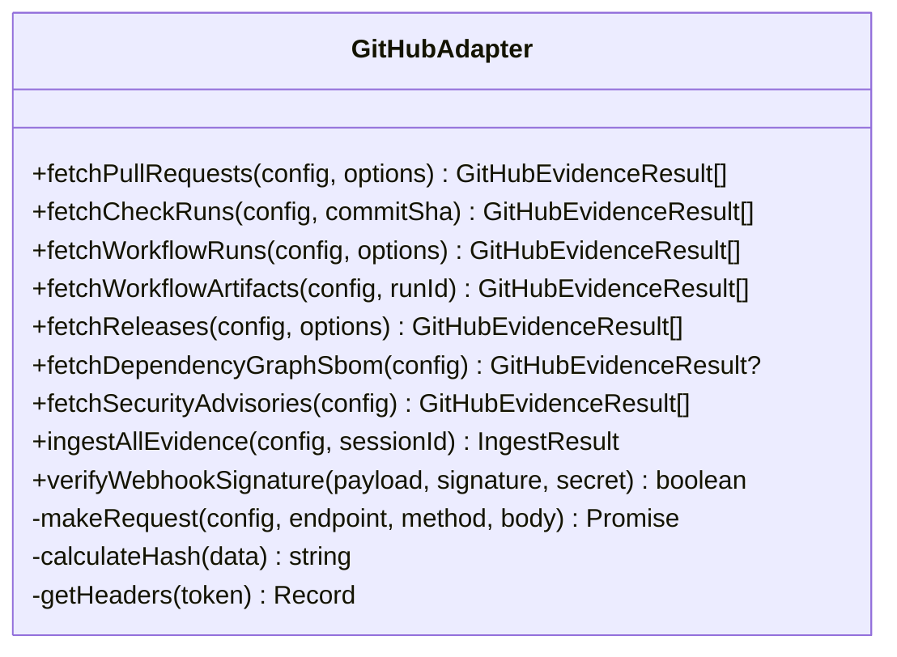
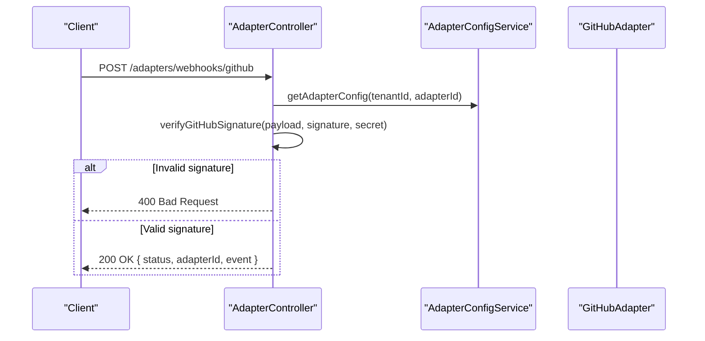
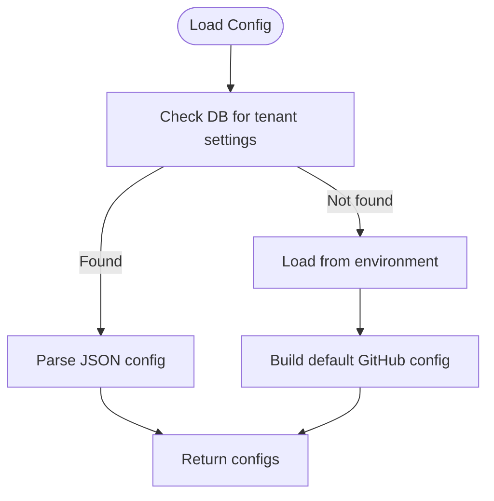
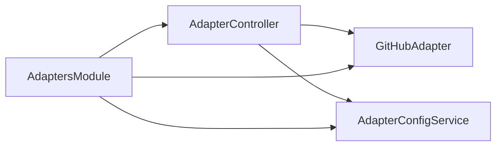

# GitHub Integration

<cite>
**Referenced Files in This Document**
- [github.adapter.ts](file://apps/api/src/modules/adapters/github.adapter.ts)
- [github.adapter.spec.ts](file://apps/api/src/modules/adapters/github.adapter.spec.ts)
- [adapter.controller.ts](file://apps/api/src/modules/adapters/adapter.controller.ts)
- [adapter-config.service.ts](file://apps/api/src/modules/adapters/adapter-config.service.ts)
- [adapters.module.ts](file://apps/api/src/modules/adapters/adapters.module.ts)
</cite>

## Table of Contents
1. [Introduction](#introduction)
2. [Project Structure](#project-structure)
3. [Core Components](#core-components)
4. [Architecture Overview](#architecture-overview)
5. [Detailed Component Analysis](#detailed-component-analysis)
6. [Dependency Analysis](#dependency-analysis)
7. [Performance Considerations](#performance-considerations)
8. [Troubleshooting Guide](#troubleshooting-guide)
9. [Conclusion](#conclusion)
10. [Appendices](#appendices)

## Introduction
This document explains the GitHub adapter integration for the Quiz-to-build platform. It covers authentication via personal access tokens, webhook event handling, and repository synchronization. It also documents the adapter’s interface contract for GitHub API interactions, data transformation patterns, configuration options, and troubleshooting guidance for common GitHub API errors, authentication failures, and webhook delivery issues.

## Project Structure
The GitHub integration lives under the Adapters module in the API application. The key files are:
- GitHub adapter implementation
- Adapter controller exposing configuration, sync, and webhook endpoints
- Adapter configuration service managing credentials and sync options
- Module wiring for dependency injection

**Diagram sources**
- [adapters.module.ts:10-16](file://apps/api/src/modules/adapters/adapters.module.ts#L10-L16)
- [adapter.controller.ts:94-99](file://apps/api/src/modules/adapters/adapter.controller.ts#L94-L99)
- [github.adapter.ts:118-122](file://apps/api/src/modules/adapters/github.adapter.ts#L118-L122)
- [adapter-config.service.ts:78-85](file://apps/api/src/modules/adapters/adapter-config.service.ts#L78-L85)

**Section sources**
- [adapters.module.ts:10-16](file://apps/api/src/modules/adapters/adapters.module.ts#L10-L16)
- [adapter.controller.ts:94-99](file://apps/api/src/modules/adapters/adapter.controller.ts#L94-L99)

## Core Components
- GitHubAdapter: Implements GitHub API interactions, transforms responses to internal evidence models, and provides ingestion orchestration.
- AdapterController: Exposes REST endpoints for configuration management, connection testing, synchronization, and webhook handling.
- AdapterConfigService: Manages adapter configurations, validates required fields, and persists configuration state.

Key responsibilities:
- Authentication: Bearer token via Authorization header
- Endpoint mapping: Pull requests, check runs, workflow runs, workflow artifacts, releases, SBOM, and security advisories
- Data transformation: Normalizes GitHub API responses into a unified internal model
- Webhook verification: Validates GitHub signatures and GitLab tokens
- Synchronization: Orchestrates ingestion across multiple GitHub resources

**Section sources**
- [github.adapter.ts:118-592](file://apps/api/src/modules/adapters/github.adapter.ts#L118-L592)
- [adapter.controller.ts:94-558](file://apps/api/src/modules/adapters/adapter.controller.ts#L94-L558)
- [adapter-config.service.ts:78-448](file://apps/api/src/modules/adapters/adapter-config.service.ts#L78-L448)

## Architecture Overview
The GitHub integration follows a layered architecture:
- Presentation: AdapterController exposes endpoints for configuration, sync, and webhooks
- Domain: GitHubAdapter encapsulates API logic and data transformation
- Persistence: AdapterConfigService manages configuration state and validation
- External: GitHub API accessed via HTTP requests with bearer tokens

**Diagram sources**
- [adapter.controller.ts:132-151](file://apps/api/src/modules/adapters/adapter.controller.ts#L132-L151)
- [adapter.controller.ts:172-181](file://apps/api/src/modules/adapters/adapter.controller.ts#L172-L181)
- [adapter.controller.ts:299-394](file://apps/api/src/modules/adapters/adapter.controller.ts#L299-L394)
- [adapter.controller.ts:458-490](file://apps/api/src/modules/adapters/adapter.controller.ts#L458-L490)
- [github.adapter.ts:173-592](file://apps/api/src/modules/adapters/github.adapter.ts#L173-L592)

## Detailed Component Analysis

### GitHubAdapter
Implements GitHub API interactions and transforms responses into a unified internal evidence model.

- Authentication
  - Uses Bearer token in Authorization header
  - Sets Accept header to GitHub API media type and API version header
  - Supports custom API URL for enterprise instances

- API Methods
  - Pull Requests: fetchPullRequests(state, perPage, page)
  - Check Runs: fetchCheckRuns(commitSha)
  - Workflow Runs: fetchWorkflowRuns(perPage, page, status)
  - Workflow Artifacts: fetchWorkflowArtifacts(runId) with SBOM classification
  - Releases: fetchReleases(perPage, page)
  - Dependency Graph SBOM: fetchDependencyGraphSbom()
  - Security Advisories: fetchSecurityAdvisories()

- Data Transformation
  - Each method maps GitHub API fields to a normalized internal structure
  - Adds metadata including provider, owner, repo, and resource type
  - Computes SHA-256 hash for deduplication and integrity
  - Timestamps derived from latest relevant activity date

- Ingestion Orchestration
  - ingestAllEvidence orchestrates fetching across PRs, workflow runs, check runs, releases, SBOM, and advisories
  - Graceful error handling: continues when individual fetches fail
  - Deduplicates commit SHAs for check runs and limits to first 5 unique SHAs

- Webhook Signature Verification
  - verifyWebhookSignature computes HMAC-SHA256 signature and compares with expected
  - Used by AdapterController for GitHub webhook validation

**Diagram sources**
- [github.adapter.ts:118-592](file://apps/api/src/modules/adapters/github.adapter.ts#L118-L592)

**Section sources**
- [github.adapter.ts:124-168](file://apps/api/src/modules/adapters/github.adapter.ts#L124-L168)
- [github.adapter.ts:173-592](file://apps/api/src/modules/adapters/github.adapter.ts#L173-L592)

### AdapterController
Exposes REST endpoints for configuration, connection testing, synchronization, and webhook handling.

- Configuration Management
  - List, get, create, update, delete adapter configurations
  - Redacts sensitive fields in responses

- Connection Testing
  - Test adapter connection by attempting a lightweight API call

- Synchronization
  - Trigger evidence sync for a specific adapter
  - Sync all enabled adapters for a tenant
  - Updates sync status and records errors

- Webhooks
  - GitHub webhook endpoint verifies HMAC-SHA256 signature
  - GitLab webhook endpoint verifies secret token
  - Both endpoints accept adapterId and tenantId query parameters

**Diagram sources**
- [adapter.controller.ts:458-490](file://apps/api/src/modules/adapters/adapter.controller.ts#L458-L490)
- [adapter.controller.ts:492-535](file://apps/api/src/modules/adapters/adapter.controller.ts#L492-L535)

**Section sources**
- [adapter.controller.ts:132-227](file://apps/api/src/modules/adapters/adapter.controller.ts#L132-L227)
- [adapter.controller.ts:299-440](file://apps/api/src/modules/adapters/adapter.controller.ts#L299-L440)
- [adapter.controller.ts:458-535](file://apps/api/src/modules/adapters/adapter.controller.ts#L458-L535)

### AdapterConfigService
Manages adapter configurations, validation, and persistence.

- Configuration Model
  - AdapterConfig: id, type, name, enabled, config, timestamps, sync status
  - GitHubAdapterConfig: token, owner, repo, apiUrl, webhookSecret, syncOptions

- Validation
  - Validates required fields per adapter type
  - Returns structured errors for missing fields

- Persistence
  - Loads configurations from database or environment defaults
  - Upserts configurations and updates sync status
  - Encrypts/decrypts sensitive fields placeholder

- Defaults
  - Automatically creates default GitHub config from environment variables if present

**Diagram sources**
- [adapter-config.service.ts:318-446](file://apps/api/src/modules/adapters/adapter-config.service.ts#L318-L446)

**Section sources**
- [adapter-config.service.ts:8-34](file://apps/api/src/modules/adapters/adapter-config.service.ts#L8-L34)
- [adapter-config.service.ts:185-240](file://apps/api/src/modules/adapters/adapter-config.service.ts#L185-L240)
- [adapter-config.service.ts:318-446](file://apps/api/src/modules/adapters/adapter-config.service.ts#L318-L446)

## Dependency Analysis
- GitHubAdapter depends on:
  - ConfigService for optional custom API URL
  - PrismaService (constructor parameter present but not used in current implementation)
- AdapterController depends on:
  - GitHubAdapter, GitLabAdapter, JiraConfluenceAdapter
  - AdapterConfigService for configuration management
- AdaptersModule wires dependencies for injection

**Diagram sources**
- [adapters.module.ts:10-16](file://apps/api/src/modules/adapters/adapters.module.ts#L10-L16)
- [adapter.controller.ts:94-99](file://apps/api/src/modules/adapters/adapter.controller.ts#L94-L99)

**Section sources**
- [adapters.module.ts:10-16](file://apps/api/src/modules/adapters/adapters.module.ts#L10-L16)
- [adapter.controller.ts:94-99](file://apps/api/src/modules/adapters/adapter.controller.ts#L94-L99)

## Performance Considerations
- Pagination defaults: Many methods use conservative defaults (e.g., perPage=30 for PRs and workflow runs). Adjust perPage and page to balance latency and throughput.
- Deduplication: ingestAllEvidence deduplicates commit SHAs and limits check runs to the first 5 unique SHAs to reduce API calls.
- Error tolerance: Graceful degradation ensures partial success when individual endpoints fail.
- Rate limiting: No explicit rate limiting is implemented in the adapter. Consider adding retry/backoff and respecting GitHub API rate limits at the application level.

[No sources needed since this section provides general guidance]

## Troubleshooting Guide

Common GitHub API errors and resolutions:
- 401 Unauthorized
  - Cause: Invalid or missing token
  - Resolution: Reconfigure token via AdapterController and retest connection
- 403 Forbidden
  - Cause: Insufficient permissions or rate limit exceeded
  - Resolution: Verify token scopes and reduce request frequency
- 404 Not Found
  - Cause: Repository or resource does not exist
  - Resolution: Confirm owner/repo and resource identifiers
- Network failures
  - Cause: Connectivity or timeout
  - Resolution: Retry with exponential backoff; verify outbound connectivity

Authentication failures:
- Signature mismatch for GitHub webhooks
  - Cause: Incorrect webhook secret or tampered payload
  - Resolution: Regenerate webhook secret in GitHub and update adapter configuration
- Missing signature for GitHub webhooks
  - Cause: GitHub delivered without signature
  - Resolution: Ensure webhook secret is configured and GitHub sends signature header

Webhook delivery issues:
- Invalid webhook signature
  - Cause: Mismatch between computed and received signature
  - Resolution: Verify secret alignment and payload integrity
- Missing webhook token for GitLab
  - Cause: GitLab webhook token not provided
  - Resolution: Configure x-gitlab-token header in webhook delivery

**Section sources**
- [github.adapter.spec.ts:216-241](file://apps/api/src/modules/adapters/github.adapter.spec.ts#L216-L241)
- [adapter.controller.ts:473-483](file://apps/api/src/modules/adapters/adapter.controller.ts#L473-L483)
- [adapter.controller.ts:507-528](file://apps/api/src/modules/adapters/adapter.controller.ts#L507-L528)

## Conclusion
The GitHub adapter integrates seamlessly with the Quiz-to-build platform, enabling repository synchronization and webhook-driven updates. It provides a robust interface contract for GitHub API interactions, consistent data transformation, and resilient error handling. Proper configuration of tokens, secrets, and pagination is essential for reliable operation.

[No sources needed since this section summarizes without analyzing specific files]

## Appendices

### Configuration Examples

- Environment-based default GitHub configuration
  - GITHUB_TOKEN: Personal access token
  - GITHUB_OWNER: Repository owner
  - GITHUB_REPO: Repository name

- Adapter configuration payload (GitHub)
  - token: GitHub personal access token
  - owner: Repository owner
  - repo: Repository name
  - apiUrl: Optional custom API URL (e.g., GitHub Enterprise)
  - webhookSecret: Optional webhook secret for signature verification
  - syncOptions: Optional feature toggles for synchronization

- Webhook endpoints
  - GitHub: POST /adapters/webhooks/github?adapterId={id}&tenantId={id}
  - GitLab: POST /adapters/webhooks/gitlab?adapterId={id}&tenantId={id}

- Rate limiting strategies
  - Implement client-side throttling and exponential backoff
  - Respect GitHub API rate limits and handle 403/429 responses
  - Consider caching and deduplication to minimize redundant calls

**Section sources**
- [adapter-config.service.ts:384-404](file://apps/api/src/modules/adapters/adapter-config.service.ts#L384-L404)
- [adapter.controller.ts:458-490](file://apps/api/src/modules/adapters/adapter.controller.ts#L458-L490)
- [adapter.controller.ts:492-535](file://apps/api/src/modules/adapters/adapter.controller.ts#L492-L535)