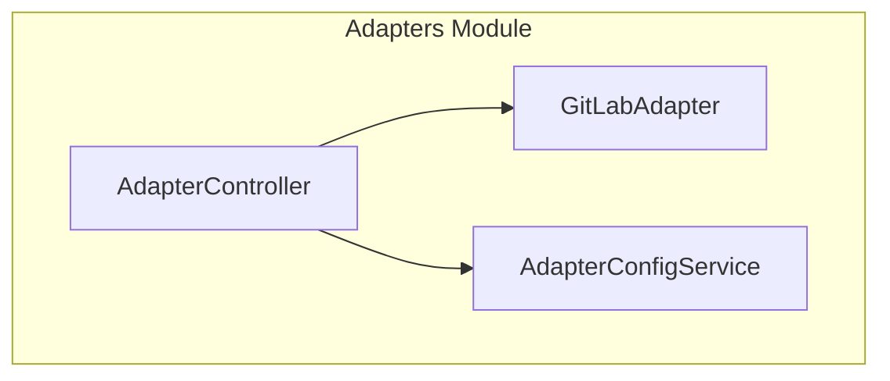
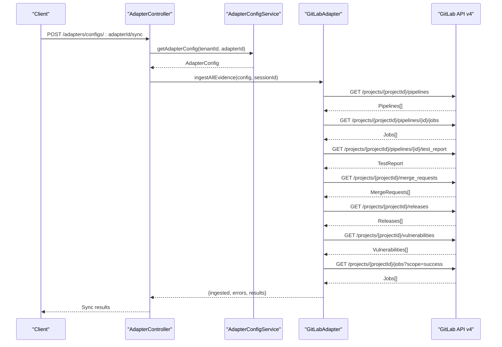
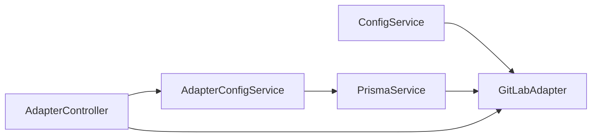

# GitLab Integration

<cite>
**Referenced Files in This Document**
- [gitlab.adapter.ts](file://apps/api/src/modules/adapters/gitlab.adapter.ts)
- [gitlab.adapter.spec.ts](file://apps/api/src/modules/adapters/gitlab.adapter.spec.ts)
- [adapter.controller.ts](file://apps/api/src/modules/adapters/adapter.controller.ts)
- [adapter-config.service.ts](file://apps/api/src/modules/adapters/adapter-config.service.ts)
- [adapters.module.ts](file://apps/api/src/modules/adapters/adapters.module.ts)
- [github.adapter.ts](file://apps/api/src/modules/adapters/github.adapter.ts)
</cite>

## Table of Contents
1. [Introduction](#introduction)
2. [Project Structure](#project-structure)
3. [Core Components](#core-components)
4. [Architecture Overview](#architecture-overview)
5. [Detailed Component Analysis](#detailed-component-analysis)
6. [Dependency Analysis](#dependency-analysis)
7. [Performance Considerations](#performance-considerations)
8. [Troubleshooting Guide](#troubleshooting-guide)
9. [Conclusion](#conclusion)
10. [Appendices](#appendices)

## Introduction
This document explains the GitLab adapter integration for evidence ingestion and webhook handling. It covers OAuth2-like authentication via private tokens, project management APIs, CI/CD pipeline integration, and GitLab-specific features such as merge requests, releases, vulnerabilities, and code coverage. It also details data mapping from GitLab API responses to internal evidence models, configuration options, and security considerations.

## Project Structure
The GitLab adapter is part of the Adapters module, alongside GitHub and Atlassian adapters. It exposes HTTP endpoints for configuration, connection testing, synchronization, and webhook reception.

**Diagram sources**
- [adapters.module.ts:10-16](file://apps/api/src/modules/adapters/adapters.module.ts#L10-L16)
- [adapter.controller.ts:94-99](file://apps/api/src/modules/adapters/adapter.controller.ts#L94-L99)
- [gitlab.adapter.ts:182-190](file://apps/api/src/modules/adapters/gitlab.adapter.ts#L182-L190)
- [adapter-config.service.ts:77-85](file://apps/api/src/modules/adapters/adapter-config.service.ts#L77-L85)

**Section sources**
- [adapters.module.ts:10-16](file://apps/api/src/modules/adapters/adapters.module.ts#L10-L16)
- [adapter.controller.ts:94-99](file://apps/api/src/modules/adapters/adapter.controller.ts#L94-L99)

## Core Components
- GitLabAdapter: Implements HTTP requests to GitLab v4 API, validates base URL and endpoints, maps API responses to internal evidence models, and orchestrates ingestion of pipelines, jobs, test reports, merge requests, releases, vulnerabilities, and coverage.
- AdapterController: Exposes REST endpoints for adapter configuration, connection testing, synchronization, and GitLab webhook reception.
- AdapterConfigService: Manages adapter configurations, validation, and default loading from environment variables.

Key responsibilities:
- Authentication: PRIVATE-TOKEN header for GitLab API.
- Endpoint validation: Sanitization and base URL checks to prevent SSRF and enforce HTTPS.
- Evidence mapping: Converts GitLab resources to unified evidence results with hashing and timestamps.
- Webhook verification: Validates GitLab webhook token via constant-time comparison.

**Section sources**
- [gitlab.adapter.ts:182-190](file://apps/api/src/modules/adapters/gitlab.adapter.ts#L182-L190)
- [adapter.controller.ts:492-535](file://apps/api/src/modules/adapters/adapter.controller.ts#L492-L535)
- [adapter-config.service.ts:36-48](file://apps/api/src/modules/adapters/adapter-config.service.ts#L36-L48)

## Architecture Overview
The adapter integrates with the backend’s configuration and controller layers to provide a cohesive evidence ingestion pipeline.

**Diagram sources**
- [adapter.controller.ts:294-394](file://apps/api/src/modules/adapters/adapter.controller.ts#L294-L394)
- [gitlab.adapter.ts:712-785](file://apps/api/src/modules/adapters/gitlab.adapter.ts#L712-L785)

## Detailed Component Analysis

### GitLabAdapter
Implements GitLab v4 API integration with robust validation and mapping.

- Authentication
  - Uses PRIVATE-TOKEN header for API access.
  - Enforces HTTPS-only base URL and rejects embedded credentials.
  - Validates hostnames against private/loopback ranges and rejects localhost/127.0.0.1.

- Endpoint Validation
  - Sanitizes endpoints to prevent path traversal and injection.
  - Ensures constructed URLs remain within the configured base path.

- Evidence Mapping
  - Pipelines: Maps id, iid, sha, ref, status, source, tag, user, timestamps, coverage, yaml_errors.
  - Jobs: Maps id, name, stage, status, ref, tag, user, commit, timestamps, duration, coverage, artifacts, runner, allow_failure, failure_reason.
  - Test Reports: Maps totals and per-suite statistics.
  - Merge Requests: Maps iid, title, state, draft, author, assignees, reviewers, branches, sha, merge commit shas, merge status, conflicts, labels, timestamps.
  - Releases: Maps tag_name, name, description, author, commit, releasedAt, assets count/sources/links.
  - Vulnerabilities: Maps id, title, description, state, severity/confidence, report_type, scanner/vendor, identifiers, location, solution, timestamps.
  - Coverage History: Aggregates coverage from successful jobs by ref, computes latest, average, and job count.

- Ingestion Orchestration
  - ingestAllEvidence coordinates fetching pipelines (with jobs and test reports), merge requests, releases, vulnerabilities, and coverage history.
  - Tracks per-resource counts and collects errors per batch.

- Hashing and Timestamps
  - Uses SHA-256 over serialized API responses for idempotent deduplication.
  - Sets timestamps from updated_at or derived fields.

- Project ID Encoding
  - Encodes string project IDs with percent-encoding to handle nested namespaces.

**Section sources**
- [gitlab.adapter.ts:192-197](file://apps/api/src/modules/adapters/gitlab.adapter.ts#L192-L197)
- [gitlab.adapter.ts:222-278](file://apps/api/src/modules/adapters/gitlab.adapter.ts#L222-L278)
- [gitlab.adapter.ts:280-298](file://apps/api/src/modules/adapters/gitlab.adapter.ts#L280-L298)
- [gitlab.adapter.ts:359-403](file://apps/api/src/modules/adapters/gitlab.adapter.ts#L359-L403)
- [gitlab.adapter.ts:408-450](file://apps/api/src/modules/adapters/gitlab.adapter.ts#L408-L450)
- [gitlab.adapter.ts:455-501](file://apps/api/src/modules/adapters/gitlab.adapter.ts#L455-L501)
- [gitlab.adapter.ts:506-554](file://apps/api/src/modules/adapters/gitlab.adapter.ts#L506-L554)
- [gitlab.adapter.ts:559-594](file://apps/api/src/modules/adapters/gitlab.adapter.ts#L559-L594)
- [gitlab.adapter.ts:599-653](file://apps/api/src/modules/adapters/gitlab.adapter.ts#L599-L653)
- [gitlab.adapter.ts:658-707](file://apps/api/src/modules/adapters/gitlab.adapter.ts#L658-L707)
- [gitlab.adapter.ts:712-785](file://apps/api/src/modules/adapters/gitlab.adapter.ts#L712-L785)
- [gitlab.adapter.ts:352-354](file://apps/api/src/modules/adapters/gitlab.adapter.ts#L352-L354)

### AdapterController
Provides REST endpoints for adapter lifecycle and GitLab webhook handling.

- Configuration Management
  - List/get/update/delete adapter configurations.
  - Redacts sensitive fields in responses.

- Connection Testing
  - Tests connectivity by fetching minimal resources from each provider.

- Synchronization
  - Triggers evidence ingestion for a specific adapter or all enabled adapters.
  - Updates sync status and aggregates results.

- GitLab Webhook
  - Validates incoming webhook using a constant-time comparison against configured token.
  - Returns standardized acknowledgment with event type.

**Section sources**
- [adapter.controller.ts:122-227](file://apps/api/src/modules/adapters/adapter.controller.ts#L122-L227)
- [adapter.controller.ts:231-290](file://apps/api/src/modules/adapters/adapter.controller.ts#L231-L290)
- [adapter.controller.ts:294-394](file://apps/api/src/modules/adapters/adapter.controller.ts#L294-L394)
- [adapter.controller.ts:492-535](file://apps/api/src/modules/adapters/adapter.controller.ts#L492-L535)

### AdapterConfigService
Manages adapter configurations and default loading from environment variables.

- Types and Required Fields
  - Supports GitHub, GitLab, Jira, Confluence, Azure DevOps.
  - Defines required fields per type (e.g., token, owner/repo for GitHub; token, projectId for GitLab).

- Default Configuration Loading
  - Loads default GitLab config from GITLAB_TOKEN, GITLAB_PROJECT_ID, GITLAB_API_URL.

- Validation and Redaction
  - Validates required fields and returns errors.
  - Redacts sensitive fields in API responses.

**Section sources**
- [adapter-config.service.ts:36-48](file://apps/api/src/modules/adapters/adapter-config.service.ts#L36-L48)
- [adapter-config.service.ts:185-240](file://apps/api/src/modules/adapters/adapter-config.service.ts#L185-L240)
- [adapter-config.service.ts:406-423](file://apps/api/src/modules/adapters/adapter-config.service.ts#L406-L423)

### GitHubAdapter (Reference)
For comparison, GitHubAdapter demonstrates similar patterns:
- Uses Authorization: Bearer with API version header.
- Provides webhook verification via HMAC-SHA256.
- Offers ingestion orchestration for PRs, workflow runs, releases, SBOM, and advisories.

**Section sources**
- [github.adapter.ts:124-130](file://apps/api/src/modules/adapters/github.adapter.ts#L124-L130)
- [github.adapter.ts:583-590](file://apps/api/src/modules/adapters/github.adapter.ts#L583-L590)

## Dependency Analysis
- GitLabAdapter depends on ConfigService for trusted API URL and on PrismaService via module wiring.
- AdapterController depends on GitLabAdapter and AdapterConfigService for orchestration and configuration.
- AdapterConfigService loads defaults from environment variables and persists configurations.

**Diagram sources**
- [gitlab.adapter.ts:187-190](file://apps/api/src/modules/adapters/gitlab.adapter.ts#L187-L190)
- [adapters.module.ts:10-16](file://apps/api/src/modules/adapters/adapters.module.ts#L10-L16)
- [adapter.controller.ts:94-99](file://apps/api/src/modules/adapters/adapter.controller.ts#L94-L99)
- [adapter-config.service.ts:82-85](file://apps/api/src/modules/adapters/adapter-config.service.ts#L82-L85)

**Section sources**
- [adapters.module.ts:10-16](file://apps/api/src/modules/adapters/adapters.module.ts#L10-L16)
- [adapter.controller.ts:94-99](file://apps/api/src/modules/adapters/adapter.controller.ts#L94-L99)

## Performance Considerations
- Pagination defaults: Pipelines and releases default to per_page=20; vulnerabilities default to per_page=50. Adjust as needed to balance latency and throughput.
- Job and test report fetching: The ingestion pipeline fetches jobs and test reports for up to five recent pipelines to limit API calls.
- Coverage aggregation: Uses a fixed page size and filters by ref to compute averages efficiently.
- Network reliability: makeRequest wraps fetch and converts non-OK responses to HttpException; network failures are surfaced as SERVICE_UNAVAILABLE.

[No sources needed since this section provides general guidance]

## Troubleshooting Guide
Common issues and resolutions:

- Base URL validation failures
  - Symptom: BAD_REQUEST errors indicating invalid or untrusted API URL.
  - Causes: Non-HTTPS URL, embedded credentials, localhost/127.0.0.1, private/loopback hostnames.
  - Resolution: Ensure GITLAB_API_URL is HTTPS, does not embed credentials, and points to a public host.

- Endpoint sanitization errors
  - Symptom: BAD_REQUEST for invalid endpoint format.
  - Causes: Path traversal, protocol injection, double-slash prefix, backslashes, @ symbol.
  - Resolution: Remove injected segments and ensure clean relative paths.

- API connectivity errors
  - Symptom: SERVICE_UNAVAILABLE when unable to reach GitLab API.
  - Causes: DNS resolution failures, network timeouts, blocked hosts.
  - Resolution: Verify network connectivity and DNS resolution; ensure firewall allows outbound HTTPS.

- Authentication failures
  - Symptom: Unauthorized or forbidden responses from GitLab API.
  - Causes: Expired or insufficiently scoped token.
  - Resolution: Regenerate token with appropriate scopes and update configuration.

- Webhook token mismatches
  - Symptom: BadRequestException on webhook reception.
  - Causes: Missing or incorrect x-gitlab-token header.
  - Resolution: Configure webhook secret in GitLab project settings and set webhookToken in adapter config.

**Section sources**
- [gitlab.adapter.ts:222-278](file://apps/api/src/modules/adapters/gitlab.adapter.ts#L222-L278)
- [gitlab.adapter.ts:280-298](file://apps/api/src/modules/adapters/gitlab.adapter.ts#L280-L298)
- [gitlab.adapter.ts:300-346](file://apps/api/src/modules/adapters/gitlab.adapter.ts#L300-L346)
- [adapter.controller.ts:492-535](file://apps/api/src/modules/adapters/adapter.controller.ts#L492-L535)

## Conclusion
The GitLab adapter provides a secure, validated, and efficient integration with GitLab v4 API. It maps GitLab resources to a unified evidence model, supports ingestion orchestration, and includes webhook verification. Configuration is managed centrally with environment-based defaults and validation. The implementation emphasizes safety (URL validation, endpoint sanitization, HTTPS enforcement) and performance (pagination defaults, selective job fetching, hashing for deduplication).

[No sources needed since this section summarizes without analyzing specific files]

## Appendices

### Configuration Options
- Environment variables (defaults loaded by AdapterConfigService):
  - GITLAB_TOKEN: Private token for GitLab API access.
  - GITLAB_PROJECT_ID: Numeric or encoded project path (e.g., group%2Fproject).
  - GITLAB_API_URL: Trusted API base URL (default: https://gitlab.com/api/v4).

- Adapter configuration fields (from AdapterConfigService):
  - token: Private token.
  - projectId: Numeric or string project identifier.
  - apiUrl: Optional override for API base URL.
  - webhookToken: Secret token for webhook verification.

- Example usage
  - Set GITLAB_TOKEN and GITLAB_PROJECT_ID to enable default GitLab adapter.
  - Override GITLAB_API_URL for self-managed GitLab instances.

**Section sources**
- [adapter-config.service.ts:406-423](file://apps/api/src/modules/adapters/adapter-config.service.ts#L406-L423)
- [adapter-config.service.ts:36-48](file://apps/api/src/modules/adapters/adapter-config.service.ts#L36-L48)

### API Endpoints and Evidence Mapping
- Pipelines
  - Endpoint: /projects/{projectId}/pipelines
  - Mapped fields: id, iid, sha, ref, status, source, tag, user, startedAt, finishedAt, duration, queuedDuration, coverage, yamlErrors.
- Jobs
  - Endpoint: /projects/{projectId}/pipelines/{id}/jobs
  - Mapped fields: id, name, stage, status, ref, tag, user, commitId, commitTitle, startedAt, finishedAt, duration, coverage, allowFailure, failureReason, hasArtifacts, artifactTypes, runner.
- Test Reports
  - Endpoint: /projects/{projectId}/pipelines/{id}/test_report
  - Mapped fields: pipelineId, totalTime, totalCount, successCount, failedCount, skippedCount, errorCount, suites.
- Merge Requests
  - Endpoint: /projects/{projectId}/merge_requests
  - Mapped fields: iid, title, state, draft, author, assignees, reviewers, targetBranch, sourceBranch, sha, mergeCommitSha, squashCommitSha, mergeStatus, hasConflicts, changesCount, labels, mergedBy, mergedAt, createdAt, updatedAt.
- Releases
  - Endpoint: /projects/{projectId}/releases
  - Mapped fields: tagName, name, description, author, commitId, commitTitle, releasedAt, createdAt, assetsCount, sources, links.
- Vulnerabilities
  - Endpoint: /projects/{projectId}/vulnerabilities
  - Mapped fields: id, title, description, state, severity, confidence, reportType, scanner, scannerVendor, identifiers, location, solution, detectedAt, resolvedAt, dismissedAt.
- Coverage History
  - Endpoint: /projects/{projectId}/jobs?scope=success
  - Mapped fields: ref, coverageHistory, latestCoverage, jobCount, averageCoverage.

**Section sources**
- [gitlab.adapter.ts:359-403](file://apps/api/src/modules/adapters/gitlab.adapter.ts#L359-L403)
- [gitlab.adapter.ts:408-450](file://apps/api/src/modules/adapters/gitlab.adapter.ts#L408-L450)
- [gitlab.adapter.ts:455-501](file://apps/api/src/modules/adapters/gitlab.adapter.ts#L455-L501)
- [gitlab.adapter.ts:506-554](file://apps/api/src/modules/adapters/gitlab.adapter.ts#L506-L554)
- [gitlab.adapter.ts:559-594](file://apps/api/src/modules/adapters/gitlab.adapter.ts#L559-L594)
- [gitlab.adapter.ts:599-653](file://apps/api/src/modules/adapters/gitlab.adapter.ts#L599-L653)
- [gitlab.adapter.ts:658-707](file://apps/api/src/modules/adapters/gitlab.adapter.ts#L658-L707)

### Webhook Setup
- Endpoint: POST /adapters/webhooks/gitlab
- Header: x-gitlab-token (constant-time comparison)
- Behavior: Verifies token and returns acknowledgment with event type.

**Section sources**
- [adapter.controller.ts:492-535](file://apps/api/src/modules/adapters/adapter.controller.ts#L492-L535)

### GitLab-Specific Considerations
- Namespace handling
  - Project IDs can be numeric or encoded string paths (e.g., group%2Fproject).
- Visibility and permissions
  - Token scope must grant read access to the project and associated resources (pipelines, merge requests, releases, vulnerabilities).
- API versioning
  - Uses GitLab v4 API base URL; default is https://gitlab.com/api/v4.
- Request validation
  - Enforces HTTPS, rejects embedded credentials, and validates hostnames against private/loopback ranges.

**Section sources**
- [gitlab.adapter.ts:352-354](file://apps/api/src/modules/adapters/gitlab.adapter.ts#L352-L354)
- [gitlab.adapter.ts:222-278](file://apps/api/src/modules/adapters/gitlab.adapter.ts#L222-L278)
- [gitlab.adapter.ts:185](file://apps/api/src/modules/adapters/gitlab.adapter.ts#L185)