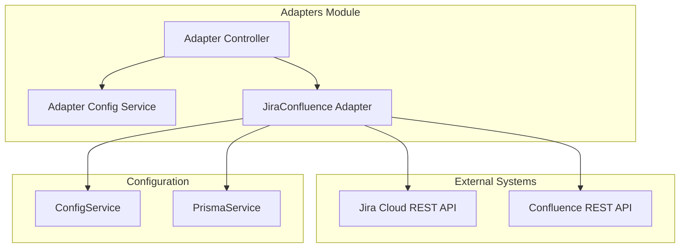
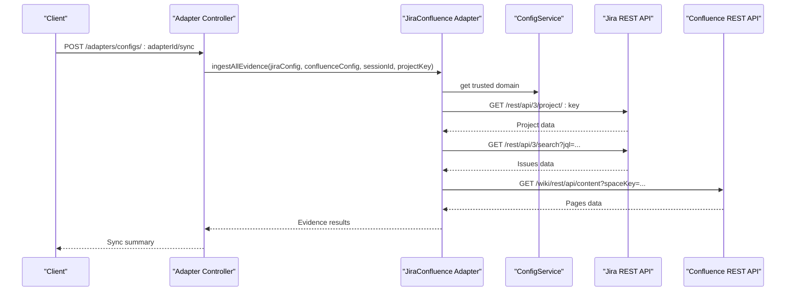
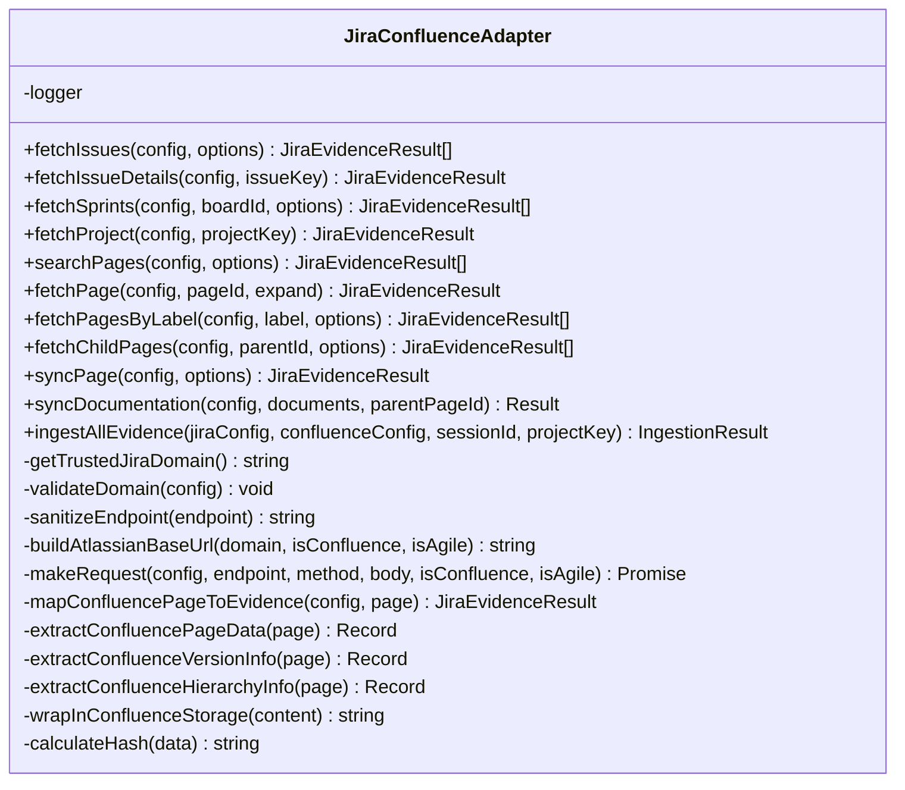
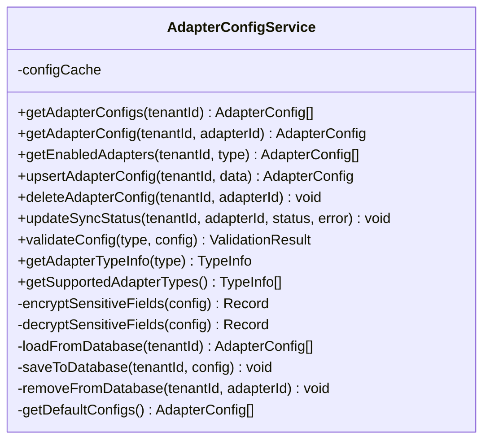
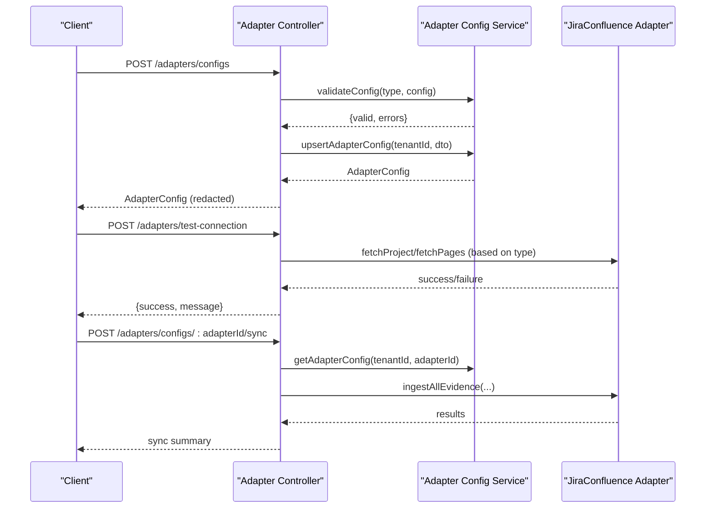
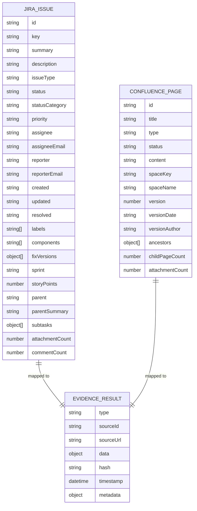
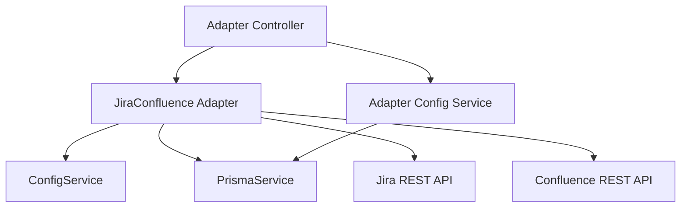

# Jira & Confluence Integration

<cite>
**Referenced Files in This Document**
- [jira-confluence.adapter.ts](file://apps/api/src/modules/adapters/jira-confluence.adapter.ts)
- [adapter-config.service.ts](file://apps/api/src/modules/adapters/adapter-config.service.ts)
- [adapter.controller.ts](file://apps/api/src/modules/adapters/adapter.controller.ts)
- [adapters.module.ts](file://apps/api/src/modules/adapters/adapters.module.ts)
- [configuration.ts](file://apps/api/src/config/configuration.ts)
- [jira-confluence.adapter.spec.ts](file://apps/api/src/modules/adapters/jira-confluence.adapter.spec.ts)
</cite>

## Table of Contents
1. [Introduction](#introduction)
2. [Project Structure](#project-structure)
3. [Core Components](#core-components)
4. [Architecture Overview](#architecture-overview)
5. [Detailed Component Analysis](#detailed-component-analysis)
6. [Dependency Analysis](#dependency-analysis)
7. [Performance Considerations](#performance-considerations)
8. [Troubleshooting Guide](#troubleshooting-guide)
9. [Conclusion](#conclusion)

## Introduction
This document describes the combined Jira and Confluence adapter integration for the Atlassian ecosystem. The adapter provides unified access to Jira project management and Confluence documentation platforms, supporting authentication via Atlassian API tokens, robust data transformation from Atlassian API formats to internal domain objects, and operational capabilities such as documentation synchronization and evidence ingestion. It includes built-in security controls to prevent server-side request forgery (SSRF), supports multiple Atlassian instances through configuration, and exposes REST endpoints for configuration management and synchronization orchestration.

## Project Structure
The adapter implementation resides within the NestJS modules under the adapters package. It integrates with configuration services, database services, and exposes HTTP endpoints for administration and synchronization.

**Diagram sources**
- [adapters.module.ts:10-16](file://apps/api/src/modules/adapters/adapters.module.ts#L10-L16)
- [adapter.controller.ts:94-99](file://apps/api/src/modules/adapters/adapter.controller.ts#L94-L99)
- [adapter-config.service.ts:78-85](file://apps/api/src/modules/adapters/adapter-config.service.ts#L78-L85)
- [jira-confluence.adapter.ts:135-138](file://apps/api/src/modules/adapters/jira-confluence.adapter.ts#L135-L138)

**Section sources**
- [adapters.module.ts:10-16](file://apps/api/src/modules/adapters/adapters.module.ts#L10-L16)
- [adapter.controller.ts:94-99](file://apps/api/src/modules/adapters/adapter.controller.ts#L94-L99)
- [adapter-config.service.ts:78-85](file://apps/api/src/modules/adapters/adapter-config.service.ts#L78-L85)

## Core Components
- JiraConfluence Adapter: Central adapter implementing Atlassian API access, authentication, data transformation, and synchronization logic.
- Adapter Config Service: Manages adapter configurations, validation, encryption/decryption, and persistence.
- Adapter Controller: Exposes REST endpoints for adapter lifecycle management, connection testing, and synchronization orchestration.
- Configuration Service: Provides environment-based configuration including security validations for production.

Key responsibilities:
- Authentication: Uses Basic authentication with email and API token for Jira/Confluence.
- Domain validation: Enforces allowed Atlassian cloud domains and rejects SSRF-prone inputs.
- Data mapping: Transforms Atlassian API responses into internal evidence objects with computed hashes and timestamps.
- Synchronization: Supports documentation sync to Confluence and evidence ingestion from both Jira and Confluence.

**Section sources**
- [jira-confluence.adapter.ts:135-138](file://apps/api/src/modules/adapters/jira-confluence.adapter.ts#L135-L138)
- [adapter-config.service.ts:78-85](file://apps/api/src/modules/adapters/adapter-config.service.ts#L78-L85)
- [adapter.controller.ts:94-99](file://apps/api/src/modules/adapters/adapter.controller.ts#L94-L99)

## Architecture Overview
The adapter enforces a strict request pipeline:
1. Configuration validation and domain trust enforcement.
2. Endpoint sanitization and base URL construction.
3. HTTP request execution with Basic authentication.
4. Response parsing and mapping to internal evidence structures.
5. Optional hashing and timestamping for change detection.

**Diagram sources**
- [adapter.controller.ts:362-371](file://apps/api/src/modules/adapters/adapter.controller.ts#L362-L371)
- [jira-confluence.adapter.ts:852-889](file://apps/api/src/modules/adapters/jira-confluence.adapter.ts#L852-L889)

## Detailed Component Analysis

### JiraConfluence Adapter
The adapter encapsulates all Atlassian integration logic:
- Authentication: Builds Basic auth header using email and API token.
- Domain validation: Validates Atlassian cloud domains and rejects private/internal addresses.
- Endpoint sanitization: Prevents path traversal and protocol-relative URLs.
- Request routing: Selects appropriate base URLs for Jira, Confluence, and Agile APIs.
- Data transformation: Maps Jira issues, sprints, projects, and Confluence pages to internal evidence objects with metadata and hashes.

**Diagram sources**
- [jira-confluence.adapter.ts:132-138](file://apps/api/src/modules/adapters/jira-confluence.adapter.ts#L132-L138)
- [jira-confluence.adapter.ts:310-405](file://apps/api/src/modules/adapters/jira-confluence.adapter.ts#L310-L405)
- [jira-confluence.adapter.ts:461-536](file://apps/api/src/modules/adapters/jira-confluence.adapter.ts#L461-L536)
- [jira-confluence.adapter.ts:543-636](file://apps/api/src/modules/adapters/jira-confluence.adapter.ts#L543-L636)
- [jira-confluence.adapter.ts:641-710](file://apps/api/src/modules/adapters/jira-confluence.adapter.ts#L641-L710)
- [jira-confluence.adapter.ts:712-760](file://apps/api/src/modules/adapters/jira-confluence.adapter.ts#L712-L760)
- [jira-confluence.adapter.ts:767-807](file://apps/api/src/modules/adapters/jira-confluence.adapter.ts#L767-L807)
- [jira-confluence.adapter.ts:833-898](file://apps/api/src/modules/adapters/jira-confluence.adapter.ts#L833-L898)

Authentication and security:
- Basic authentication header constructed from email and API token.
- Strict domain validation and endpoint sanitization to prevent SSRF.
- Trusted domain enforced via configuration service.

Data models and transformation:
- Jira issues mapped to internal fields including labels, components, fix versions, sprints, story points, attachments, and comments.
- Confluence pages mapped to internal fields including hierarchy, version info, and content extraction from storage or view bodies.

Synchronization:
- Documentation sync wraps markdown-like content into Confluence storage format and manages page creation/update with version increments.
- Evidence ingestion aggregates project, issues, and optionally pages into structured results.

**Section sources**
- [jira-confluence.adapter.ts:152-159](file://apps/api/src/modules/adapters/jira-confluence.adapter.ts#L152-L159)
- [jira-confluence.adapter.ts:166-207](file://apps/api/src/modules/adapters/jira-confluence.adapter.ts#L166-L207)
- [jira-confluence.adapter.ts:212-227](file://apps/api/src/modules/adapters/jira-confluence.adapter.ts#L212-L227)
- [jira-confluence.adapter.ts:229-237](file://apps/api/src/modules/adapters/jira-confluence.adapter.ts#L229-L237)
- [jira-confluence.adapter.ts:310-405](file://apps/api/src/modules/adapters/jira-confluence.adapter.ts#L310-L405)
- [jira-confluence.adapter.ts:461-536](file://apps/api/src/modules/adapters/jira-confluence.adapter.ts#L461-L536)
- [jira-confluence.adapter.ts:543-636](file://apps/api/src/modules/adapters/jira-confluence.adapter.ts#L543-L636)
- [jira-confluence.adapter.ts:641-710](file://apps/api/src/modules/adapters/jira-confluence.adapter.ts#L641-L710)
- [jira-confluence.adapter.ts:712-760](file://apps/api/src/modules/adapters/jira-confluence.adapter.ts#L712-L760)
- [jira-confluence.adapter.ts:767-807](file://apps/api/src/modules/adapters/jira-confluence.adapter.ts#L767-L807)
- [jira-confluence.adapter.ts:833-898](file://apps/api/src/modules/adapters/jira-confluence.adapter.ts#L833-L898)

### Adapter Configuration Service
Manages adapter configurations with validation, encryption/decryption, and persistence:
- Defines configuration schemas for Jira and Confluence adapters.
- Validates required fields per adapter type.
- Persists configurations to tenant settings and caches them for performance.
- Provides typed configuration retrieval for downstream services.

**Diagram sources**
- [adapter-config.service.ts:78-85](file://apps/api/src/modules/adapters/adapter-config.service.ts#L78-L85)
- [adapter-config.service.ts:90-101](file://apps/api/src/modules/adapters/adapter-config.service.ts#L90-L101)
- [adapter-config.service.ts:122-150](file://apps/api/src/modules/adapters/adapter-config.service.ts#L122-L150)
- [adapter-config.service.ts:164-183](file://apps/api/src/modules/adapters/adapter-config.service.ts#L164-L183)
- [adapter-config.service.ts:218-240](file://apps/api/src/modules/adapters/adapter-config.service.ts#L218-L240)
- [adapter-config.service.ts:245-288](file://apps/api/src/modules/adapters/adapter-config.service.ts#L245-L288)

**Section sources**
- [adapter-config.service.ts:50-75](file://apps/api/src/modules/adapters/adapter-config.service.ts#L50-L75)
- [adapter-config.service.ts:90-101](file://apps/api/src/modules/adapters/adapter-config.service.ts#L90-L101)
- [adapter-config.service.ts:122-150](file://apps/api/src/modules/adapters/adapter-config.service.ts#L122-L150)
- [adapter-config.service.ts:164-183](file://apps/api/src/modules/adapters/adapter-config.service.ts#L164-L183)
- [adapter-config.service.ts:218-240](file://apps/api/src/modules/adapters/adapter-config.service.ts#L218-L240)
- [adapter-config.service.ts:245-288](file://apps/api/src/modules/adapters/adapter-config.service.ts#L245-L288)

### Adapter Controller
Provides REST endpoints for managing adapters and triggering synchronization:
- Lists supported adapter types and their capabilities.
- Manages adapter configurations (create, update, delete, list).
- Tests connections to adapters using their respective APIs.
- Orchestrates synchronization across enabled adapters and tracks sync status.

**Diagram sources**
- [adapter.controller.ts:167-181](file://apps/api/src/modules/adapters/adapter.controller.ts#L167-L181)
- [adapter.controller.ts:231-290](file://apps/api/src/modules/adapters/adapter.controller.ts#L231-L290)
- [adapter.controller.ts:294-394](file://apps/api/src/modules/adapters/adapter.controller.ts#L294-L394)

**Section sources**
- [adapter.controller.ts:103-118](file://apps/api/src/modules/adapters/adapter.controller.ts#L103-L118)
- [adapter.controller.ts:167-181](file://apps/api/src/modules/adapters/adapter.controller.ts#L167-L181)
- [adapter.controller.ts:231-290](file://apps/api/src/modules/adapters/adapter.controller.ts#L231-L290)
- [adapter.controller.ts:294-394](file://apps/api/src/modules/adapters/adapter.controller.ts#L294-L394)

### Data Models and Transformation Patterns
The adapter transforms external Atlassian resources into internal evidence objects with consistent structure and metadata:

Transformation highlights:
- Jira issues: Extract summary, description, issue type, status, priority, assignee/reporter, timestamps, labels, components, fix versions, sprint, story points, parent epic, subtasks, attachment count, and comment count.
- Confluence pages: Extract id, title, type, status, version info, hierarchy, and content from storage or view bodies.

**Diagram sources**
- [jira-confluence.adapter.ts:27-67](file://apps/api/src/modules/adapters/jira-confluence.adapter.ts#L27-L67)
- [jira-confluence.adapter.ts:93-110](file://apps/api/src/modules/adapters/jira-confluence.adapter.ts#L93-L110)
- [jira-confluence.adapter.ts:121-129](file://apps/api/src/modules/adapters/jira-confluence.adapter.ts#L121-L129)
- [jira-confluence.adapter.ts:732-760](file://apps/api/src/modules/adapters/jira-confluence.adapter.ts#L732-L760)

**Section sources**
- [jira-confluence.adapter.ts:310-405](file://apps/api/src/modules/adapters/jira-confluence.adapter.ts#L310-L405)
- [jira-confluence.adapter.ts:543-636](file://apps/api/src/modules/adapters/jira-confluence.adapter.ts#L543-L636)
- [jira-confluence.adapter.ts:712-760](file://apps/api/src/modules/adapters/jira-confluence.adapter.ts#L712-L760)

### Configuration Examples and Multi-Instance Support
- Environment-based configuration: The adapter reads trusted Jira domain from configuration and validates it against incoming requests.
- Multiple instances: Adapter configurations support separate entries per tenant and adapter type, enabling multiple Atlassian instances.
- Connection testing: Dedicated endpoint validates connectivity for Jira and Confluence using minimal API calls.

Recommended configuration keys:
- JIRA_DOMAIN: Trusted Atlassian domain for Jira Cloud.
- JIRA_EMAIL: Email associated with the Jira account.
- JIRA_API_TOKEN: Atlassian API token for authentication.
- CONFLUENCE_SPACE_KEY: Confluence space key for documentation operations.

**Section sources**
- [jira-confluence.adapter.ts:140-150](file://apps/api/src/modules/adapters/jira-confluence.adapter.ts#L140-L150)
- [adapter.controller.ts:256-277](file://apps/api/src/modules/adapters/adapter.controller.ts#L256-L277)
- [adapter-config.service.ts:425-443](file://apps/api/src/modules/adapters/adapter-config.service.ts#L425-L443)

### Webhook Event Processing
The adapter controller includes webhook handling for GitHub and GitLab, demonstrating secure webhook verification patterns. While dedicated Atlassian webhook endpoints are not present in the current implementation, the established pattern can be extended to Atlassian events as needed.

**Section sources**
- [adapter.controller.ts:444-535](file://apps/api/src/modules/adapters/adapter.controller.ts#L444-L535)

## Dependency Analysis
The adapter depends on configuration and database services and interacts with external Atlassian APIs. The controller coordinates configuration management and synchronization orchestration.

**Diagram sources**
- [jira-confluence.adapter.ts:135-138](file://apps/api/src/modules/adapters/jira-confluence.adapter.ts#L135-L138)
- [adapter.controller.ts:94-99](file://apps/api/src/modules/adapters/adapter.controller.ts#L94-L99)
- [adapter-config.service.ts:78-85](file://apps/api/src/modules/adapters/adapter-config.service.ts#L78-L85)

**Section sources**
- [jira-confluence.adapter.ts:135-138](file://apps/api/src/modules/adapters/jira-confluence.adapter.ts#L135-L138)
- [adapter.controller.ts:94-99](file://apps/api/src/modules/adapters/adapter.controller.ts#L94-L99)
- [adapter-config.service.ts:78-85](file://apps/api/src/modules/adapters/adapter-config.service.ts#L78-L85)

## Performance Considerations
- Request batching: The adapter supports pagination via limit/start parameters for search and listing operations.
- Hashing and caching: Internal hashing enables efficient change detection; consider caching hashed results at the application layer for repeated comparisons.
- Endpoint selection: Use appropriate API endpoints (standard vs. Agile) to minimize overhead.
- Concurrency: When orchestrating sync across multiple adapters, consider rate limiting and backoff strategies to respect upstream API quotas.

[No sources needed since this section provides general guidance]

## Troubleshooting Guide
Common issues and resolutions:
- Domain validation failures: Ensure JIRA_DOMAIN matches the requested domain and adheres to allowed Atlassian cloud patterns.
- Endpoint format errors: Avoid schemes, paths, ports, credentials, or backslashes in endpoints; the adapter sanitizes inputs.
- Network errors: The adapter surfaces HTTP errors and network failures as service unavailability; verify credentials and network connectivity.
- Authentication failures: Confirm email and API token are correct and have appropriate permissions for target resources.
- Rich text content: Confluence content is extracted from storage or view bodies; ensure content is available in the expected representation.

**Section sources**
- [jira-confluence.adapter.ts:166-207](file://apps/api/src/modules/adapters/jira-confluence.adapter.ts#L166-L207)
- [jira-confluence.adapter.ts:212-227](file://apps/api/src/modules/adapters/jira-confluence.adapter.ts#L212-L227)
- [jira-confluence.adapter.ts:239-299](file://apps/api/src/modules/adapters/jira-confluence.adapter.ts#L239-L299)
- [jira-confluence.adapter.spec.ts:129-201](file://apps/api/src/modules/adapters/jira-confluence.adapter.spec.ts#L129-L201)
- [jira-confluence.adapter.spec.ts:268-286](file://apps/api/src/modules/adapters/jira-confluence.adapter.spec.ts#L268-L286)

## Conclusion
The Jira and Confluence adapter provides a secure, configurable, and extensible integration layer for Atlassian ecosystems. It enforces domain and endpoint safety, transforms complex data models into unified internal structures, and offers operational capabilities for synchronization and evidence ingestion. With proper configuration and adherence to security practices, it supports reliable multi-instance deployments and scalable data workflows.