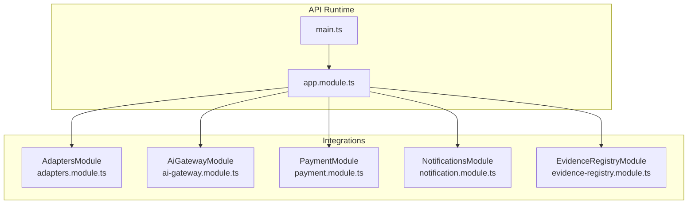
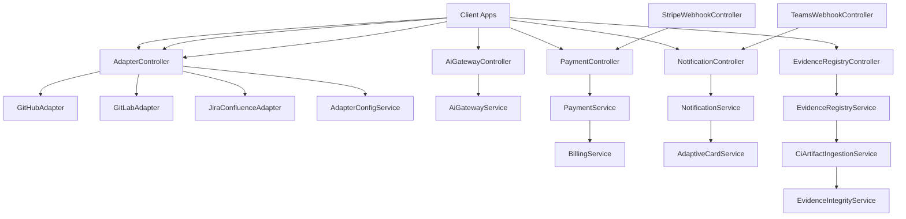
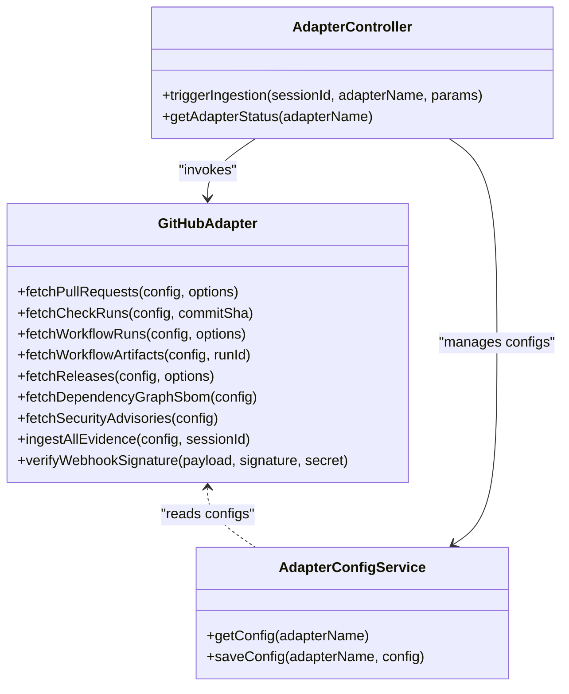
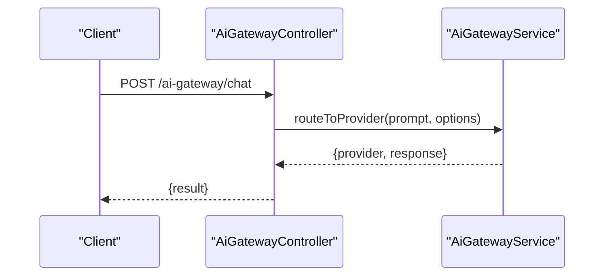
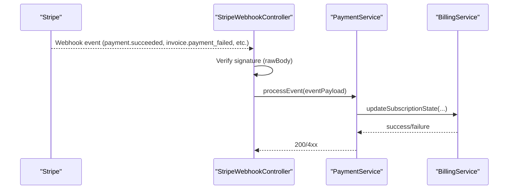
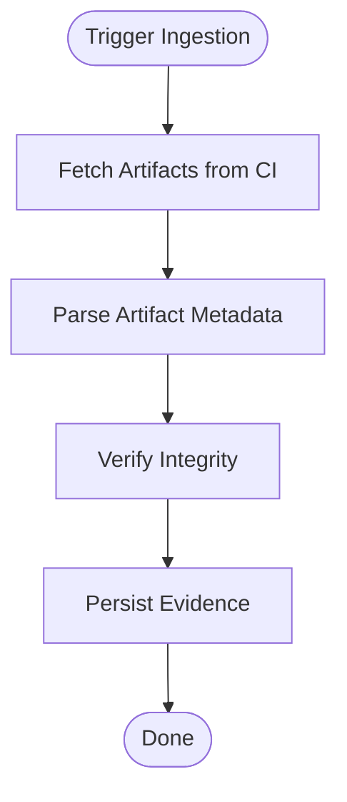
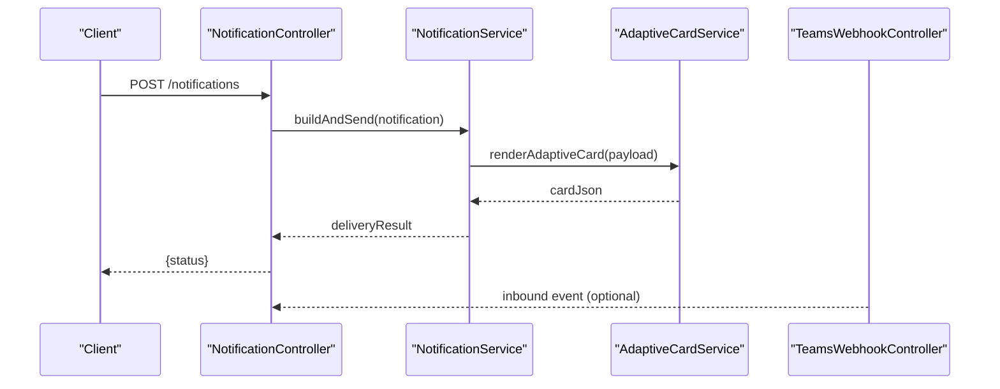
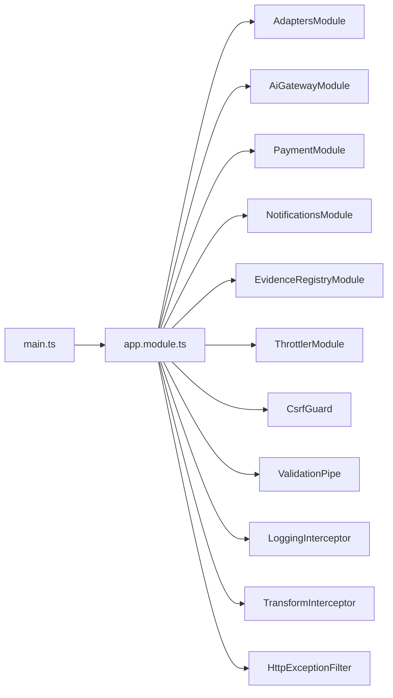

# Integration Patterns

<cite>
**Referenced Files in This Document**
- [main.ts](file://apps/api/src/main.ts)
- [app.module.ts](file://apps/api/src/app.module.ts)
- [adapters.module.ts](file://apps/api/src/modules/adapters/adapters.module.ts)
- [github.adapter.ts](file://apps/api/src/modules/adapters/github.adapter.ts)
- [gitlab.adapter.ts](file://apps/api/src/modules/adapters/gitlab.adapter.ts)
- [jira-confluence.adapter.ts](file://apps/api/src/modules/adapters/jira-confluence.adapter.ts)
- [adapter-config.service.ts](file://apps/api/src/modules/adapters/adapter-config.service.ts)
- [adapter.controller.ts](file://apps/api/src/modules/adapters/adapter.controller.ts)
- [ai-gateway.module.ts](file://apps/api/src/modules/ai-gateway/ai-gateway.module.ts)
- [ai-gateway.service.ts](file://apps/api/src/modules/ai-gateway/ai-gateway.service.ts)
- [ai-gateway.controller.ts](file://apps/api/src/modules/ai-gateway/ai-gateway.controller.ts)
- [payment.module.ts](file://apps/api/src/modules/payment/payment.module.ts)
- [payment.service.ts](file://apps/api/src/modules/payment/payment.service.ts)
- [billing.service.ts](file://apps/api/src/modules/payment/billing.service.ts)
- [stripe-webhook.controller.ts](file://apps/api/src/modules/document-commerce/stripe-webhook.controller.ts)
- [ci-artifact-ingestion.service.ts](file://apps/api/src/modules/document-generator/ci-artifact-ingestion.service.ts)
- [notification.module.ts](file://apps/api/src/modules/notifications/notification.module.ts)
- [notification.service.ts](file://apps/api/src/modules/notifications/notification.service.ts)
- [teams-webhook.controller.ts](file://apps/api/src/modules/notifications/teams-webhook.controller.ts)
- [notification.controller.ts](file://apps/api/src/modules/notifications/notification.controller.ts)
- [adaptive-card.service.ts](file://apps/api/src/modules/notifications/adaptive-card.service.ts)
- [http-exception.filter.ts](file://apps/api/src/common/filters/http-exception.filter.ts)
- [logging.interceptor.ts](file://apps/api/src/common/interceptors/logging.interceptor.ts)
- [transform.interceptor.ts](file://apps/api/src/common/interceptors/transform.interceptor.ts)
- [csrf.guard.ts](file://apps/api/src/common/guards/csrf.guard.ts)
- [subscription.guard.ts](file://apps/api/src/common/guards/subscription.guard.ts)
- [throttler.config.ts](file://apps/api/src/config/graceful-degradation.config.ts)
- [configuration.ts](file://apps/api/src/config/configuration.ts)
- [logger.config.ts](file://apps/api/src/config/logger.config.ts)
- [sentry.config.ts](file://apps/api/src/config/sentry.config.ts)
- [appinsights.config.ts](file://apps/api/src/config/appinsights.config.ts)
- [evidence-registry.module.ts](file://apps/api/src/modules/evidence-registry/evidence-registry.module.ts)
- [evidence-registry.service.ts](file://apps/api/src/modules/evidence-registry/evidence-registry.service.ts)
- [evidence-registry.controller.ts](file://apps/api/src/modules/evidence-registry/evidence-registry.controller.ts)
- [evidence-integrity.service.ts](file://apps/api/src/modules/evidence-registry/evidence-integrity.service.ts)
- [ci-artifact-ingestion.service.ts](file://apps/api/src/modules/evidence-registry/ci-artifact-ingestion.service.ts)
</cite>

## Table of Contents
1. [Introduction](#introduction)
2. [Project Structure](#project-structure)
3. [Core Components](#core-components)
4. [Architecture Overview](#architecture-overview)
5. [Detailed Component Analysis](#detailed-component-analysis)
6. [Dependency Analysis](#dependency-analysis)
7. [Performance Considerations](#performance-considerations)
8. [Troubleshooting Guide](#troubleshooting-guide)
9. [Conclusion](#conclusion)
10. [Appendices](#appendices)

## Introduction
This document describes integration patterns for Quiz-to-Build, focusing on adapter designs for external systems (GitHub, GitLab, Jira, Confluence), AI gateway integrations (Claude and OpenAI), payment processing (Stripe), CI/CD artifact ingestion, and notification delivery (Teams webhooks and Adaptive Cards). It also covers authentication strategies, rate limiting, error handling, data transformation/mapping, validation, testing patterns, and troubleshooting.

## Project Structure
The API server is a NestJS application that wires together modular feature areas. Integration concerns are primarily encapsulated in dedicated modules:
- Adapters module for external SCM and issue trackers
- AI Gateway module for LLM orchestration
- Payment module for billing and Stripe webhooks
- Notifications module for Teams and Adaptive Cards
- Evidence Registry module for CI/CD artifact ingestion and integrity

**Diagram sources**
- [main.ts:28-317](file://apps/api/src/main.ts#L28-L317)
- [app.module.ts:53-129](file://apps/api/src/app.module.ts#L53-L129)
- [adapters.module.ts:10-16](file://apps/api/src/modules/adapters/adapters.module.ts#L10-L16)
- [ai-gateway.module.ts](file://apps/api/src/modules/ai-gateway/ai-gateway.module.ts)
- [payment.module.ts](file://apps/api/src/modules/payment/payment.module.ts)
- [notification.module.ts](file://apps/api/src/modules/notifications/notification.module.ts)
- [evidence-registry.module.ts](file://apps/api/src/modules/evidence-registry/evidence-registry.module.ts)

**Section sources**
- [main.ts:28-317](file://apps/api/src/main.ts#L28-L317)
- [app.module.ts:53-129](file://apps/api/src/app.module.ts#L53-L129)

## Core Components
- AdaptersModule: Provides adapter services for GitHub, GitLab, and Jira/Confluence, plus configuration and controller for adapter operations.
- AiGatewayModule: Orchestrates AI providers (Claude, OpenAI) and exposes streaming and non-streaming endpoints.
- PaymentModule: Handles subscriptions, billing, and Stripe webhook processing.
- NotificationsModule: Manages Teams webhooks and Adaptive Card rendering.
- EvidenceRegistryModule: Ingests CI/CD artifacts and maintains integrity.

**Section sources**
- [adapters.module.ts:10-16](file://apps/api/src/modules/adapters/adapters.module.ts#L10-L16)
- [ai-gateway.module.ts](file://apps/api/src/modules/ai-gateway/ai-gateway.module.ts)
- [payment.module.ts](file://apps/api/src/modules/payment/payment.module.ts)
- [notification.module.ts](file://apps/api/src/modules/notifications/notification.module.ts)
- [evidence-registry.module.ts](file://apps/api/src/modules/evidence-registry/evidence-registry.module.ts)

## Architecture Overview
The system integrates external services through adapter services that encapsulate HTTP clients, authentication, and data transformation. AI gateway services act as a facade over multiple LLM providers. Payment processing relies on Stripe with webhook verification. Notifications are delivered via Teams webhooks with Adaptive Cards. CI/CD artifacts are ingested and validated for integrity.

**Diagram sources**
- [adapter.controller.ts](file://apps/api/src/modules/adapters/adapter.controller.ts)
- [github.adapter.ts:118-592](file://apps/api/src/modules/adapters/github.adapter.ts#L118-L592)
- [gitlab.adapter.ts](file://apps/api/src/modules/adapters/gitlab.adapter.ts)
- [jira-confluence.adapter.ts](file://apps/api/src/modules/adapters/jira-confluence.adapter.ts)
- [adapter-config.service.ts](file://apps/api/src/modules/adapters/adapter-config.service.ts)
- [ai-gateway.controller.ts](file://apps/api/src/modules/ai-gateway/ai-gateway.controller.ts)
- [ai-gateway.service.ts](file://apps/api/src/modules/ai-gateway/ai-gateway.service.ts)
- [payment.service.ts](file://apps/api/src/modules/payment/payment.service.ts)
- [billing.service.ts](file://apps/api/src/modules/payment/billing.service.ts)
- [stripe-webhook.controller.ts](file://apps/api/src/modules/document-commerce/stripe-webhook.controller.ts)
- [notification.controller.ts](file://apps/api/src/modules/notifications/notification.controller.ts)
- [notification.service.ts](file://apps/api/src/modules/notifications/notification.service.ts)
- [adaptive-card.service.ts](file://apps/api/src/modules/notifications/adaptive-card.service.ts)
- [teams-webhook.controller.ts](file://apps/api/src/modules/notifications/teams-webhook.controller.ts)
- [evidence-registry.controller.ts](file://apps/api/src/modules/evidence-registry/evidence-registry.controller.ts)
- [evidence-registry.service.ts](file://apps/api/src/modules/evidence-registry/evidence-registry.service.ts)
- [ci-artifact-ingestion.service.ts](file://apps/api/src/modules/evidence-registry/ci-artifact-ingestion.service.ts)
- [evidence-integrity.service.ts](file://apps/api/src/modules/evidence-registry/evidence-integrity.service.ts)

## Detailed Component Analysis

### Adapters Module (External Integrations)
The adapters module centralizes integrations with SCM and issue tracking platforms. It defines:
- GitHubAdapter: Fetches pull requests, check runs, workflow runs, artifacts, releases, SBOMs, and Dependabot security advisories. Includes a webhook signature verifier.
- GitLabAdapter: Adapter placeholder/service for GitLab integrations.
- JiraConfluenceAdapter: Adapter placeholder/service for Jira/Confluence integrations.
- AdapterConfigService: Manages adapter configurations.
- AdapterController: Exposes endpoints to trigger ingestion and manage adapter settings.

**Diagram sources**
- [github.adapter.ts:118-592](file://apps/api/src/modules/adapters/github.adapter.ts#L118-L592)
- [adapter-config.service.ts](file://apps/api/src/modules/adapters/adapter-config.service.ts)
- [adapter.controller.ts](file://apps/api/src/modules/adapters/adapter.controller.ts)

Key integration patterns:
- Authentication: Uses Bearer tokens with explicit headers and API version negotiation.
- Data transformation: Maps provider-specific payloads to normalized evidence records with type, sourceId, sourceUrl, data, hash, timestamp, and metadata.
- Validation: Validates HTTP responses and throws structured exceptions on failures.
- Webhook verification: Computes HMAC-SHA256 signatures for GitHub webhooks.
- Error handling: Converts network and provider errors into HTTP exceptions with appropriate status codes.

**Section sources**
- [adapters.module.ts:10-16](file://apps/api/src/modules/adapters/adapters.module.ts#L10-L16)
- [github.adapter.ts:118-592](file://apps/api/src/modules/adapters/github.adapter.ts#L118-L592)
- [adapter.controller.ts](file://apps/api/src/modules/adapters/adapter.controller.ts)
- [adapter-config.service.ts](file://apps/api/src/modules/adapters/adapter-config.service.ts)

### AI Gateway Integrations (Claude and OpenAI)
The AI Gateway module provides a unified interface to multiple LLM providers. It includes:
- AiGatewayService: Orchestrates provider selection, request routing, and response streaming.
- AiGatewayController: Exposes endpoints for chat completion and streaming responses.
- Provider adapters: Specific adapters for Claude and OpenAI under ai-gateway/adapters.

**Diagram sources**
- [ai-gateway.controller.ts](file://apps/api/src/modules/ai-gateway/ai-gateway.controller.ts)
- [ai-gateway.service.ts](file://apps/api/src/modules/ai-gateway/ai-gateway.service.ts)

Authentication strategies:
- API keys are supplied via configuration and injected into provider-specific adapters.
- Request headers and endpoint routing are handled internally by adapters.

Rate limiting and throttling:
- Global throttling is configured at the application level and applies to AI gateway endpoints.

Error handling:
- Provider errors are normalized and surfaced with consistent HTTP responses.

**Section sources**
- [ai-gateway.module.ts](file://apps/api/src/modules/ai-gateway/ai-gateway.module.ts)
- [ai-gateway.controller.ts](file://apps/api/src/modules/ai-gateway/ai-gateway.controller.ts)
- [ai-gateway.service.ts](file://apps/api/src/modules/ai-gateway/ai-gateway.service.ts)

### Payment Processing Integrations (Stripe)
The Payment module handles subscriptions and billing, with Stripe webhooks for asynchronous events:
- PaymentService: Core billing operations.
- BillingService: Subscription lifecycle management.
- StripeWebhookController: Verifies and processes Stripe webhook events.

**Diagram sources**
- [stripe-webhook.controller.ts](file://apps/api/src/modules/document-commerce/stripe-webhook.controller.ts)
- [payment.service.ts](file://apps/api/src/modules/payment/payment.service.ts)
- [billing.service.ts](file://apps/api/src/modules/payment/billing.service.ts)

Authentication strategies:
- Stripe webhook verification uses rawBody and HMAC-SHA256 signatures.

Error handling:
- Webhook processing returns explicit HTTP statuses; failures are logged and retried via Stripe’s retry mechanism.

**Section sources**
- [payment.module.ts](file://apps/api/src/modules/payment/payment.module.ts)
- [payment.service.ts](file://apps/api/src/modules/payment/payment.service.ts)
- [billing.service.ts](file://apps/api/src/modules/payment/billing.service.ts)
- [stripe-webhook.controller.ts](file://apps/api/src/modules/document-commerce/stripe-webhook.controller.ts)

### CI/CD Artifact Ingestion
Evidence Registry ingests CI/CD artifacts and validates integrity:
- EvidenceRegistryService: Coordinates ingestion and persistence.
- CiArtifactIngestionService: Downloads and parses artifacts from CI systems.
- EvidenceIntegrityService: Verifies artifact integrity and provenance.

**Diagram sources**
- [evidence-registry.controller.ts](file://apps/api/src/modules/evidence-registry/evidence-registry.controller.ts)
- [evidence-registry.service.ts](file://apps/api/src/modules/evidence-registry/evidence-registry.service.ts)
- [ci-artifact-ingestion.service.ts](file://apps/api/src/modules/evidence-registry/ci-artifact-ingestion.service.ts)
- [evidence-integrity.service.ts](file://apps/api/src/modules/evidence-registry/evidence-integrity.service.ts)

**Section sources**
- [evidence-registry.module.ts](file://apps/api/src/modules/evidence-registry/evidence-registry.module.ts)
- [evidence-registry.controller.ts](file://apps/api/src/modules/evidence-registry/evidence-registry.controller.ts)
- [evidence-registry.service.ts](file://apps/api/src/modules/evidence-registry/evidence-registry.service.ts)
- [ci-artifact-ingestion.service.ts](file://apps/api/src/modules/evidence-registry/ci-artifact-ingestion.service.ts)
- [evidence-integrity.service.ts](file://apps/api/src/modules/evidence-registry/evidence-integrity.service.ts)

### Notification Delivery (Teams Webhooks and Adaptive Cards)
Notifications are delivered via Teams webhooks with Adaptive Cards:
- NotificationService: Builds and sends notifications.
- AdaptiveCardService: Generates Adaptive Card payloads.
- TeamsWebhookController: Receives inbound webhook events.
- NotificationController: Manages notification creation and delivery.

**Diagram sources**
- [notification.controller.ts](file://apps/api/src/modules/notifications/notification.controller.ts)
- [notification.service.ts](file://apps/api/src/modules/notifications/notification.service.ts)
- [adaptive-card.service.ts](file://apps/api/src/modules/notifications/adaptive-card.service.ts)
- [teams-webhook.controller.ts](file://apps/api/src/modules/notifications/teams-webhook.controller.ts)

**Section sources**
- [notification.module.ts](file://apps/api/src/modules/notifications/notification.module.ts)
- [notification.controller.ts](file://apps/api/src/modules/notifications/notification.controller.ts)
- [notification.service.ts](file://apps/api/src/modules/notifications/notification.service.ts)
- [adaptive-card.service.ts](file://apps/api/src/modules/notifications/adaptive-card.service.ts)
- [teams-webhook.controller.ts](file://apps/api/src/modules/notifications/teams-webhook.controller.ts)

## Dependency Analysis
The application composes modules at startup and applies cross-cutting concerns globally.

**Diagram sources**
- [main.ts:28-317](file://apps/api/src/main.ts#L28-L317)
- [app.module.ts:53-129](file://apps/api/src/app.module.ts#L53-L129)

**Section sources**
- [main.ts:28-317](file://apps/api/src/main.ts#L28-L317)
- [app.module.ts:53-129](file://apps/api/src/app.module.ts#L53-L129)

## Performance Considerations
- Compression: HTTP compression is enabled but disabled for Server-Sent Events and streaming AI gateway endpoints to preserve streaming semantics.
- Rate limiting: Application-wide throttling is configured with multiple windows and limits.
- Logging and observability: Structured logging, Application Insights, and Sentry are initialized early to minimize overhead while ensuring telemetry.
- Request sizing: Body limits are set to mitigate payload abuse.

[No sources needed since this section provides general guidance]

## Troubleshooting Guide
Common issues and resolutions:
- HTTP exceptions: Global filter converts provider and network errors into structured HTTP responses with appropriate status codes.
- Telemetry bootstrapping: Bootstrap errors are captured in Sentry and Application Insights; verify initialization order and environment variables.
- Stripe webhooks: Ensure rawBody is preserved and signing secret is configured; verify event types and retry behavior.
- Adapter connectivity: Validate tokens and API URLs; confirm provider headers and API versions.
- Streaming endpoints: Confirm compression is disabled for streaming routes to avoid breaking SSE or chunked responses.

**Section sources**
- [http-exception.filter.ts](file://apps/api/src/common/filters/http-exception.filter.ts)
- [main.ts:28-317](file://apps/api/src/main.ts#L28-L317)
- [stripe-webhook.controller.ts](file://apps/api/src/modules/document-commerce/stripe-webhook.controller.ts)
- [github.adapter.ts:118-592](file://apps/api/src/modules/adapters/github.adapter.ts#L118-L592)

## Conclusion
Quiz-to-Build employs adapter services to integrate SCM and issue tracking systems, a unified AI gateway for multiple LLM providers, Stripe for payments with verified webhooks, and Teams-based notifications with Adaptive Cards. CI/CD artifacts are ingested and validated for integrity. Cross-cutting concerns like throttling, validation, logging, and error handling are consistently applied across modules.

[No sources needed since this section summarizes without analyzing specific files]

## Appendices

### Authentication Strategies for External APIs
- GitHub: Bearer token with explicit API version header.
- GitLab/Jira/Confluence: Adapter-level configuration and provider-specific headers.
- Stripe: Signature verification using rawBody and HMAC-SHA256.
- Teams: Webhook endpoints accept inbound events; ensure endpoint protection via guards and validation.

**Section sources**
- [github.adapter.ts:124-130](file://apps/api/src/modules/adapters/github.adapter.ts#L124-L130)
- [stripe-webhook.controller.ts](file://apps/api/src/modules/document-commerce/stripe-webhook.controller.ts)
- [teams-webhook.controller.ts](file://apps/api/src/modules/notifications/teams-webhook.controller.ts)

### Rate Limiting Implementations
- Application-level throttling configured with short, medium, and long windows.
- Provider-side rate limits should be respected; consider exponential backoff and jitter in adapters.

**Section sources**
- [app.module.ts:68-85](file://apps/api/src/app.module.ts#L68-L85)

### Error Handling Patterns
- Convert provider/network errors to HTTP exceptions with meaningful messages and status codes.
- Use structured logging and Sentry for observability.
- Normalize AI provider errors and surface consistent responses.

**Section sources**
- [github.adapter.ts:148-164](file://apps/api/src/modules/adapters/github.adapter.ts#L148-L164)
- [http-exception.filter.ts](file://apps/api/src/common/filters/http-exception.filter.ts)
- [sentry.config.ts](file://apps/api/src/config/sentry.config.ts)

### Data Transformation and Validation
- Normalize provider payloads into standardized evidence records with hashing and metadata.
- Apply DTO validation and transformation pipes globally.
- Validate webhook signatures before processing.

**Section sources**
- [github.adapter.ts:107-115](file://apps/api/src/modules/adapters/github.adapter.ts#L107-L115)
- [main.ts:196-206](file://apps/api/src/main.ts#L196-L206)
- [github.adapter.ts:583-590](file://apps/api/src/modules/adapters/github.adapter.ts#L583-L590)

### Integration Testing Patterns
- Use Jest integration tests to validate end-to-end flows for adapters, AI gateway, payment webhooks, and notifications.
- Mock external HTTP clients and provider SDKs to isolate unit tests.
- Simulate webhook events and streaming responses for robustness.

[No sources needed since this section provides general guidance]