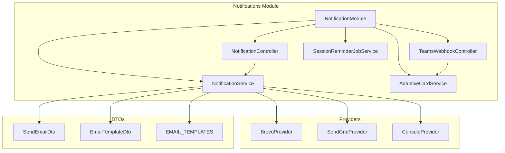
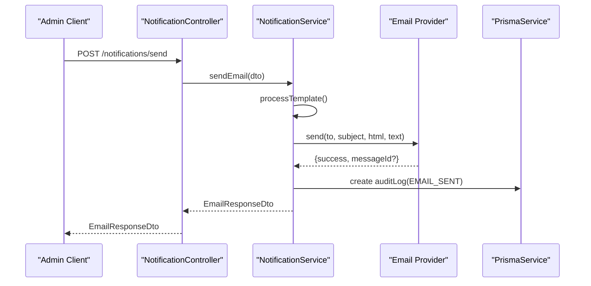
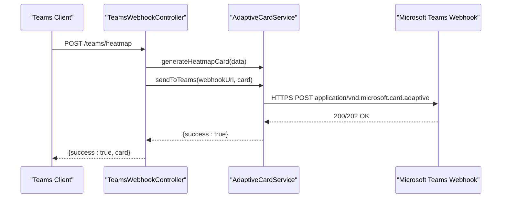
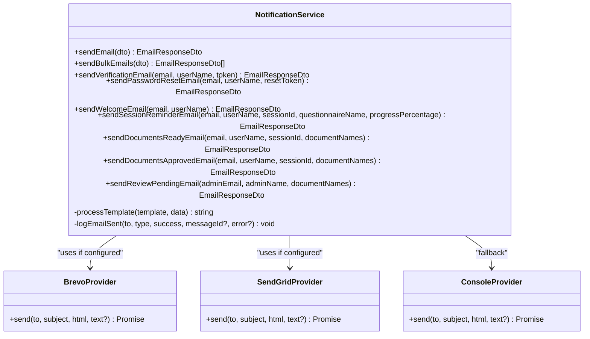
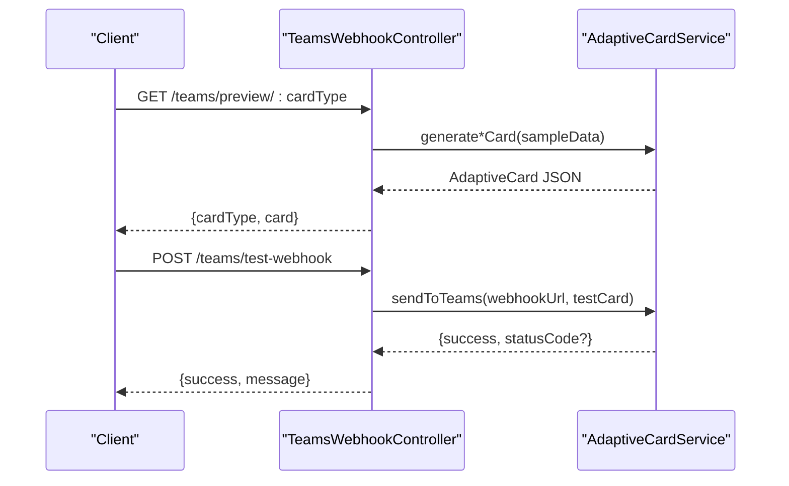
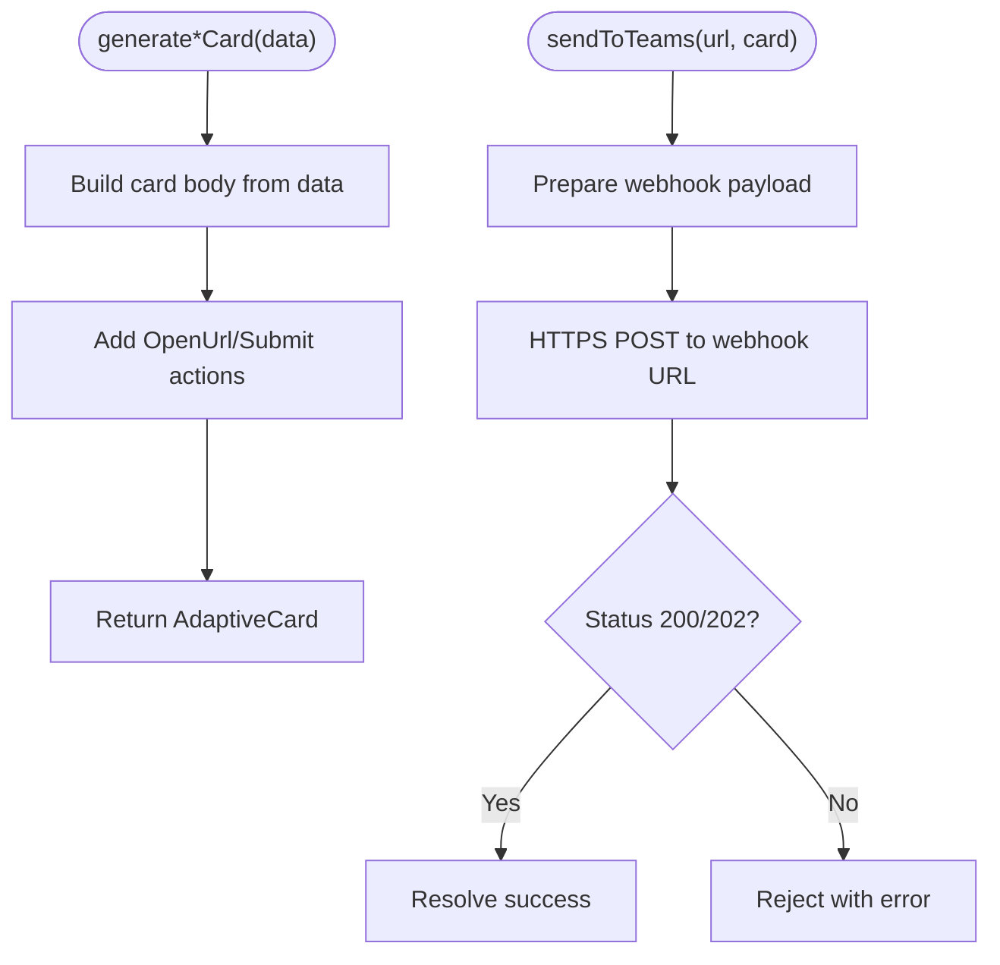
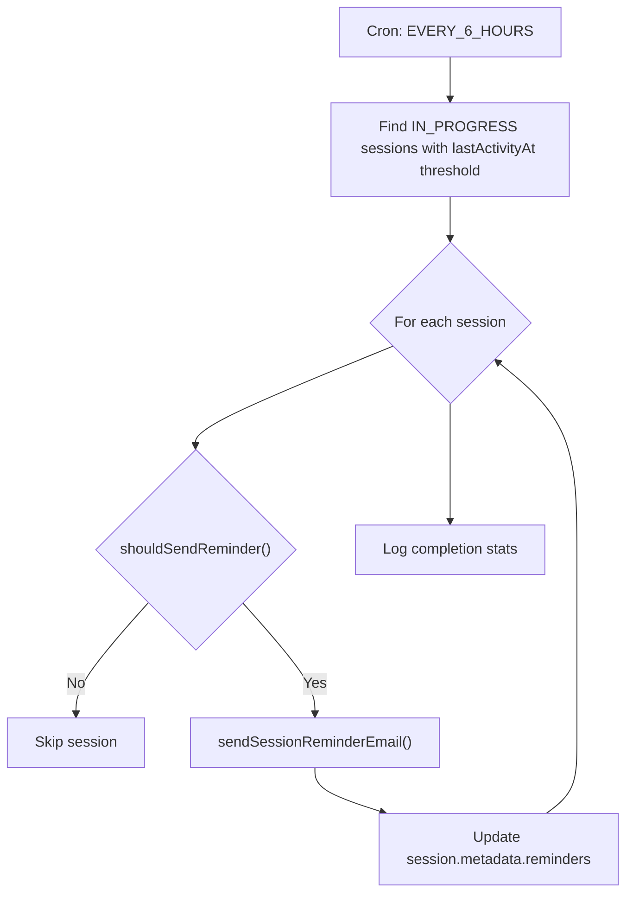
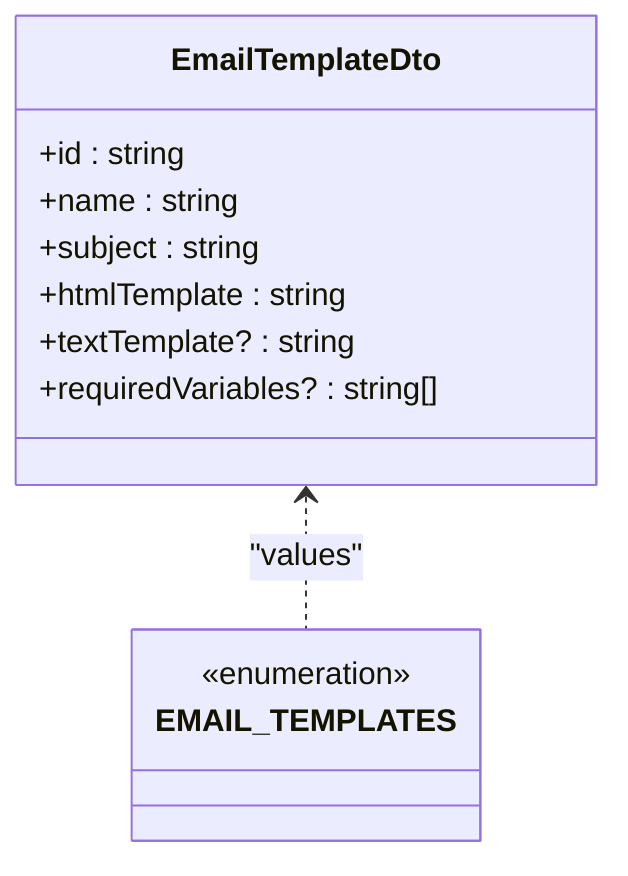
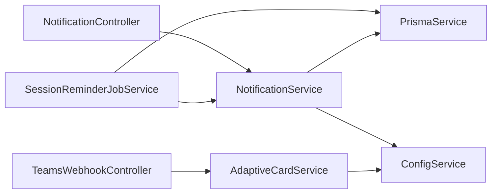

# Notification Delivery Systems

<cite>
**Referenced Files in This Document**
- [notification.module.ts](file://apps/api/src/modules/notifications/notification.module.ts)
- [notification.service.ts](file://apps/api/src/modules/notifications/notification.service.ts)
- [notification.controller.ts](file://apps/api/src/modules/notifications/notification.controller.ts)
- [teams-webhook.controller.ts](file://apps/api/src/modules/notifications/teams-webhook.controller.ts)
- [adaptive-card.service.ts](file://apps/api/src/modules/notifications/adaptive-card.service.ts)
- [session-reminder.job.ts](file://apps/api/src/modules/notifications/jobs/session-reminder.job.ts)
- [send-email.dto.ts](file://apps/api/src/modules/notifications/dto/send-email.dto.ts)
- [email-template.dto.ts](file://apps/api/src/modules/notifications/dto/email-template.dto.ts)
</cite>

## Table of Contents
1. [Introduction](#introduction)
2. [Project Structure](#project-structure)
3. [Core Components](#core-components)
4. [Architecture Overview](#architecture-overview)
5. [Detailed Component Analysis](#detailed-component-analysis)
6. [Dependency Analysis](#dependency-analysis)
7. [Performance Considerations](#performance-considerations)
8. [Troubleshooting Guide](#troubleshooting-guide)
9. [Conclusion](#conclusion)
10. [Appendices](#appendices)

## Introduction
This document describes the notification delivery systems in the Quiz-to-Build platform. It covers:
- Microsoft Teams webhook integration with Adaptive Cards
- Email notification service with template management and provider abstraction
- Job scheduling for recurring reminders and automated alerts
- Delivery tracking, retry mechanisms, and failure handling
- Examples of custom notification templates and integration with external communication platforms

The system supports both transactional emails (via configurable providers) and rich, interactive notifications delivered to Microsoft Teams via Adaptive Cards.

## Project Structure
The notification subsystem is organized under a dedicated module with clear separation of concerns:
- Controllers expose endpoints for administrators and Teams integrations
- Services encapsulate business logic for email delivery and Adaptive Card generation
- Jobs schedule recurring tasks for session reminders
- DTOs define request/response contracts and templates

**Diagram sources**
- [notification.module.ts:1-15](file://apps/api/src/modules/notifications/notification.module.ts#L1-L15)
- [notification.controller.ts:1-37](file://apps/api/src/modules/notifications/notification.controller.ts#L1-L37)
- [teams-webhook.controller.ts:1-345](file://apps/api/src/modules/notifications/teams-webhook.controller.ts#L1-L345)
- [notification.service.ts:160-187](file://apps/api/src/modules/notifications/notification.service.ts#L160-L187)
- [adaptive-card.service.ts:16-21](file://apps/api/src/modules/notifications/adaptive-card.service.ts#L16-L21)
- [session-reminder.job.ts:22-29](file://apps/api/src/modules/notifications/jobs/session-reminder.job.ts#L22-L29)
- [send-email.dto.ts:15-47](file://apps/api/src/modules/notifications/dto/send-email.dto.ts#L15-L47)
- [email-template.dto.ts:50-364](file://apps/api/src/modules/notifications/dto/email-template.dto.ts#L50-L364)

**Section sources**
- [notification.module.ts:1-15](file://apps/api/src/modules/notifications/notification.module.ts#L1-L15)

## Core Components
- NotificationService: Central email delivery engine with provider abstraction, template processing, and audit logging
- AdaptiveCardService: Generates Microsoft Teams Adaptive Cards and posts them to incoming webhooks
- TeamsWebhookController: Exposes endpoints to send cards, test webhooks, and preview card JSON
- SessionReminderJobService: Scheduled job that sends session reminders based on inactivity thresholds
- NotificationController: Admin endpoints to send single or bulk emails
- DTOs: Strongly typed contracts for email requests, responses, and predefined templates

**Section sources**
- [notification.service.ts:159-471](file://apps/api/src/modules/notifications/notification.service.ts#L159-L471)
- [adaptive-card.service.ts:16-686](file://apps/api/src/modules/notifications/adaptive-card.service.ts#L16-L686)
- [teams-webhook.controller.ts:36-345](file://apps/api/src/modules/notifications/teams-webhook.controller.ts#L36-L345)
- [session-reminder.job.ts:22-253](file://apps/api/src/modules/notifications/jobs/session-reminder.job.ts#L22-L253)
- [notification.controller.ts:10-37](file://apps/api/src/modules/notifications/notification.controller.ts#L10-L37)
- [send-email.dto.ts:4-47](file://apps/api/src/modules/notifications/dto/send-email.dto.ts#L4-L47)
- [email-template.dto.ts:50-364](file://apps/api/src/modules/notifications/dto/email-template.dto.ts#L50-L364)

## Architecture Overview
The notification architecture integrates email and Teams channels through a cohesive design:
- Email path: NotificationController → NotificationService → Provider (Brevo/SendGrid/Console) with template processing and audit logging
- Teams path: TeamsWebhookController → AdaptiveCardService → Microsoft Teams Incoming Webhook
- Scheduling: SessionReminderJobService runs on a cron schedule, queries sessions, and triggers email reminders

**Diagram sources**
- [notification.controller.ts:17-25](file://apps/api/src/modules/notifications/notification.controller.ts#L17-L25)
- [notification.service.ts:192-241](file://apps/api/src/modules/notifications/notification.service.ts#L192-L241)
- [notification.service.ts:444-469](file://apps/api/src/modules/notifications/notification.service.ts#L444-L469)

**Diagram sources**
- [teams-webhook.controller.ts:91-101](file://apps/api/src/modules/notifications/teams-webhook.controller.ts#L91-L101)
- [adaptive-card.service.ts:478-528](file://apps/api/src/modules/notifications/adaptive-card.service.ts#L478-L528)

## Detailed Component Analysis

### Email Notification Service
The email service provides:
- Provider abstraction supporting Brevo, SendGrid legacy, and Console for development
- Template processing with variable substitution and array iteration
- Audit logging to the database for all deliveries
- Convenience methods for common email types (verification, password reset, welcome, session reminders, documents ready/approved, review pending)
- Bulk email sending with rate limiting

**Diagram sources**
- [notification.service.ts:159-471](file://apps/api/src/modules/notifications/notification.service.ts#L159-L471)
- [notification.service.ts:22-147](file://apps/api/src/modules/notifications/notification.service.ts#L22-L147)

Key implementation highlights:
- Provider selection based on environment configuration
- Template engine supports simple variables and block iteration for arrays
- Audit logs capture delivery outcomes for traceability

**Section sources**
- [notification.service.ts:160-187](file://apps/api/src/modules/notifications/notification.service.ts#L160-L187)
- [notification.service.ts:192-241](file://apps/api/src/modules/notifications/notification.service.ts#L192-L241)
- [notification.service.ts:418-439](file://apps/api/src/modules/notifications/notification.service.ts#L418-L439)
- [notification.service.ts:444-469](file://apps/api/src/modules/notifications/notification.service.ts#L444-L469)

### Teams Webhook Integration
The Teams integration exposes endpoints to:
- Generate and optionally send Adaptive Cards for heatmaps, gap summaries, approvals, and score updates
- Test webhook connectivity with a sample card
- Preview card JSON for debugging

**Diagram sources**
- [teams-webhook.controller.ts:226-259](file://apps/api/src/modules/notifications/teams-webhook.controller.ts#L226-L259)
- [teams-webhook.controller.ts:170-221](file://apps/api/src/modules/notifications/teams-webhook.controller.ts#L170-L221)
- [adaptive-card.service.ts:478-528](file://apps/api/src/modules/notifications/adaptive-card.service.ts#L478-L528)

Endpoints and responsibilities:
- POST /teams/heatmap: Generate and optionally send a heatmap card
- POST /teams/gaps: Generate and optionally send a gap summary card
- POST /teams/approval: Generate and optionally send an approval request card
- POST /teams/score-update: Generate and optionally send a score update card
- POST /teams/test-webhook: Validate webhook connectivity
- GET /teams/preview/:cardType: Return sample Adaptive Card JSON

Authentication and authorization:
- All endpoints are protected by JWT bearer authentication
- Access control ensures only authorized clients can trigger deliveries

**Section sources**
- [teams-webhook.controller.ts:36-345](file://apps/api/src/modules/notifications/teams-webhook.controller.ts#L36-L345)

### Adaptive Card Service
The Adaptive Card Service generates four primary card types:
- Heatmap: Overall score, progress counters, and dimension breakdowns
- Gap Summary: Top priority gaps with severity and coverage
- Approval Request: Two-person rule approvals with submit actions
- Score Update: Comparative readiness score visualization

Delivery mechanism:
- Uses HTTPS POST to the Teams Incoming Webhook URL
- Attaches Adaptive Card as a structured attachment
- Logs success/failure and propagates errors

**Diagram sources**
- [adaptive-card.service.ts:30-157](file://apps/api/src/modules/notifications/adaptive-card.service.ts#L30-L157)
- [adaptive-card.service.ts:167-272](file://apps/api/src/modules/notifications/adaptive-card.service.ts#L167-L272)
- [adaptive-card.service.ts:282-353](file://apps/api/src/modules/notifications/adaptive-card.service.ts#L282-L353)
- [adaptive-card.service.ts:362-469](file://apps/api/src/modules/notifications/adaptive-card.service.ts#L362-L469)
- [adaptive-card.service.ts:478-528](file://apps/api/src/modules/notifications/adaptive-card.service.ts#L478-L528)

**Section sources**
- [adaptive-card.service.ts:16-686](file://apps/api/src/modules/notifications/adaptive-card.service.ts#L16-L686)

### Job Scheduling: Session Reminder Notifications
The session reminder job:
- Runs on a fixed schedule (every 6 hours)
- Identifies abandoned sessions (IN_PROGRESS with recent inactivity)
- Enforces a capped sequence of reminders with increasing intervals
- Respects user notification preferences
- Updates session metadata to track sent reminders

**Diagram sources**
- [session-reminder.job.ts:35-65](file://apps/api/src/modules/notifications/jobs/session-reminder.job.ts#L35-L65)
- [session-reminder.job.ts:71-98](file://apps/api/src/modules/notifications/jobs/session-reminder.job.ts#L71-L98)
- [session-reminder.job.ts:103-132](file://apps/api/src/modules/notifications/jobs/session-reminder.job.ts#L103-L132)
- [session-reminder.job.ts:165-221](file://apps/api/src/modules/notifications/jobs/session-reminder.job.ts#L165-L221)

Operational notes:
- Reminder intervals: first after 24 hours, second after 72 hours, third after 7 days
- Maximum three reminders per session
- Skips sessions nearing expiration and respects user opt-out preferences

**Section sources**
- [session-reminder.job.ts:9-13](file://apps/api/src/modules/notifications/jobs/session-reminder.job.ts#L9-L13)
- [session-reminder.job.ts:35-65](file://apps/api/src/modules/notifications/jobs/session-reminder.job.ts#L35-L65)
- [session-reminder.job.ts:103-132](file://apps/api/src/modules/notifications/jobs/session-reminder.job.ts#L103-L132)
- [session-reminder.job.ts:182-185](file://apps/api/src/modules/notifications/jobs/session-reminder.job.ts#L182-L185)

### Template Management
Predefined email templates are defined centrally and support:
- Variable substitution for dynamic content
- Array iteration for lists (e.g., document names)
- Separate HTML and optional text templates
- Required variables specification for validation

**Diagram sources**
- [email-template.dto.ts:27-45](file://apps/api/src/modules/notifications/dto/email-template.dto.ts#L27-L45)
- [email-template.dto.ts:50-364](file://apps/api/src/modules/notifications/dto/email-template.dto.ts#L50-L364)

Template processing:
- Simple replacement of {{variable}} placeholders
- Block iteration {{#each array}} ... {{/each}} for arrays
- Optional text template alongside HTML for accessibility

**Section sources**
- [email-template.dto.ts:50-364](file://apps/api/src/modules/notifications/dto/email-template.dto.ts#L50-L364)
- [notification.service.ts:418-439](file://apps/api/src/modules/notifications/notification.service.ts#L418-L439)

### Delivery Tracking, Retry Mechanisms, and Failure Handling
- Email delivery tracking:
  - Audit logs created for every send attempt with outcome and metadata
  - Message IDs captured when providers return them
- Teams webhook delivery:
  - HTTPS POST with explicit status checks
  - Errors logged and surfaced to callers
- Retry and resilience:
  - No built-in retry loop in the current implementation
  - Recommendation: Introduce idempotent storage and a dead-letter queue for failed deliveries
- Failure handling:
  - Email service wraps provider calls and logs failures
  - Teams service rejects on non-200/202 responses

**Section sources**
- [notification.service.ts:444-469](file://apps/api/src/modules/notifications/notification.service.ts#L444-L469)
- [adaptive-card.service.ts:510-527](file://apps/api/src/modules/notifications/adaptive-card.service.ts#L510-L527)

## Dependency Analysis
The notification module exhibits low coupling and high cohesion:
- Controllers depend on services, not on providers or external APIs directly
- Services encapsulate provider selection and template processing
- Jobs depend on NotificationService and Prisma for persistence
- DTOs decouple request/response contracts from implementation

**Diagram sources**
- [notification.controller.ts:14-25](file://apps/api/src/modules/notifications/notification.controller.ts#L14-L25)
- [teams-webhook.controller.ts:41](file://apps/api/src/modules/notifications/teams-webhook.controller.ts#L41)
- [session-reminder.job.ts:26-29](file://apps/api/src/modules/notifications/jobs/session-reminder.job.ts#L26-L29)
- [notification.service.ts:165-168](file://apps/api/src/modules/notifications/notification.service.ts#L165-L168)
- [adaptive-card.service.ts:20](file://apps/api/src/modules/notifications/adaptive-card.service.ts#L20)

**Section sources**
- [notification.module.ts:1-15](file://apps/api/src/modules/notifications/notification.module.ts#L1-L15)
- [notification.controller.ts:14-25](file://apps/api/src/modules/notifications/notification.controller.ts#L14-L25)
- [teams-webhook.controller.ts:41](file://apps/api/src/modules/notifications/teams-webhook.controller.ts#L41)
- [session-reminder.job.ts:26-29](file://apps/api/src/modules/notifications/jobs/session-reminder.job.ts#L26-L29)

## Performance Considerations
- Email throughput:
  - Bulk send includes a small delay between requests to mitigate provider rate limits
- Teams webhook:
  - Each card send performs an HTTPS request; batch processing should be considered for high volume
- Template processing:
  - Regex-based substitution is efficient for typical template sizes; avoid excessively large arrays in templates
- Scheduling:
  - Cron interval balances responsiveness with system load; adjust based on operational needs

[No sources needed since this section provides general guidance]

## Troubleshooting Guide
Common issues and resolutions:
- Missing email provider credentials:
  - Configure BREVO_API_KEY or SENDGRID_API_KEY; otherwise, Console provider is used for development
- Teams webhook failures:
  - Verify webhook URL correctness and network reachability
  - Use the test endpoint to confirm connectivity
- Template rendering problems:
  - Ensure required variables are supplied for predefined templates
  - For custom emails, supply either HTML or text content
- Audit logging not appearing:
  - Confirm database connectivity and that audit log creation does not throw exceptions

**Section sources**
- [notification.service.ts:169-186](file://apps/api/src/modules/notifications/notification.service.ts#L169-L186)
- [teams-webhook.controller.ts:190-221](file://apps/api/src/modules/notifications/teams-webhook.controller.ts#L190-L221)
- [notification.service.ts:444-469](file://apps/api/src/modules/notifications/notification.service.ts#L444-L469)

## Conclusion
The notification system provides a robust foundation for delivering both rich Teams experiences via Adaptive Cards and reliable transactional emails. Its modular design, provider abstraction, and scheduled automation enable scalable and maintainable communication workflows. Future enhancements could include retry queues, idempotent delivery, and expanded delivery channels.

[No sources needed since this section summarizes without analyzing specific files]

## Appendices

### API Endpoints Summary
- POST /notifications/send (Admin only)
- POST /notifications/send-bulk (Admin only)
- POST /teams/heatmap
- POST /teams/gaps
- POST /teams/approval
- POST /teams/score-update
- POST /teams/test-webhook
- GET /teams/preview/:cardType

**Section sources**
- [notification.controller.ts:17-35](file://apps/api/src/modules/notifications/notification.controller.ts#L17-L35)
- [teams-webhook.controller.ts:46-168](file://apps/api/src/modules/notifications/teams-webhook.controller.ts#L46-L168)
- [teams-webhook.controller.ts:173-221](file://apps/api/src/modules/notifications/teams-webhook.controller.ts#L173-L221)
- [teams-webhook.controller.ts:226-259](file://apps/api/src/modules/notifications/teams-webhook.controller.ts#L226-L259)

### Example: Custom Notification Template
- Define a custom template with HTML and optional text content
- Supply dynamic data via the data field in the email DTO
- Use the CUSTOM email type to bypass predefined templates

**Section sources**
- [send-email.dto.ts:15-47](file://apps/api/src/modules/notifications/dto/send-email.dto.ts#L15-L47)
- [email-template.dto.ts:27-45](file://apps/api/src/modules/notifications/dto/email-template.dto.ts#L27-L45)
- [notification.service.ts:200-214](file://apps/api/src/modules/notifications/notification.service.ts#L200-L214)