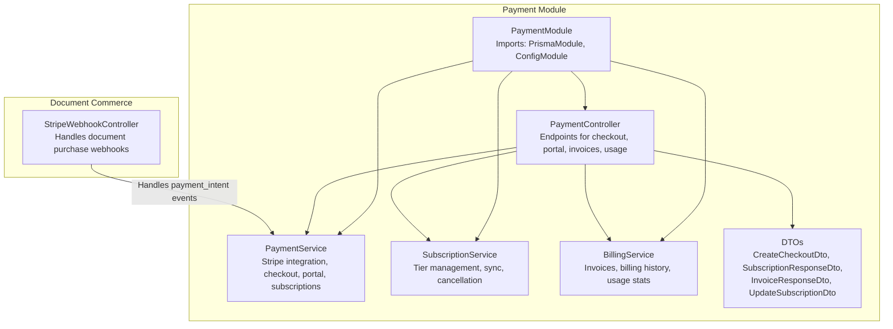
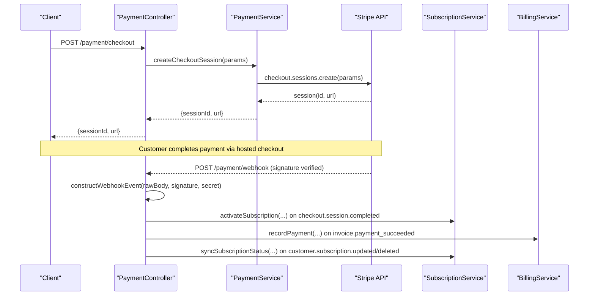
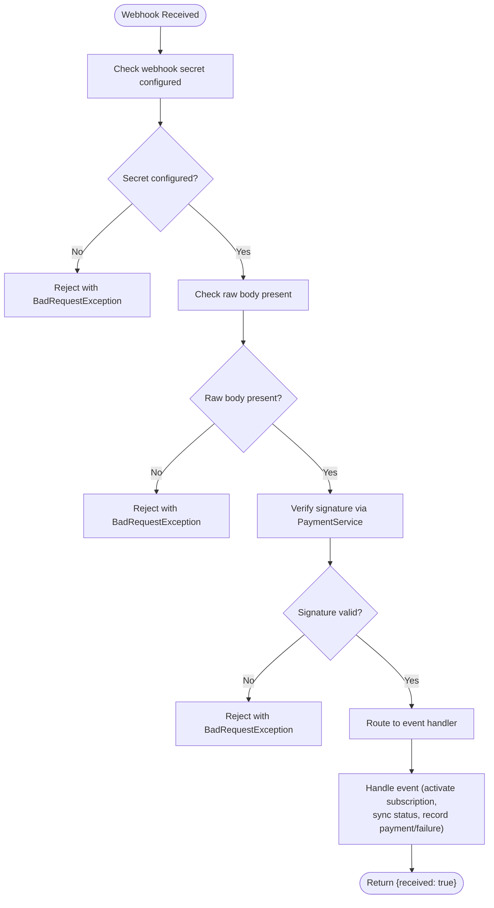
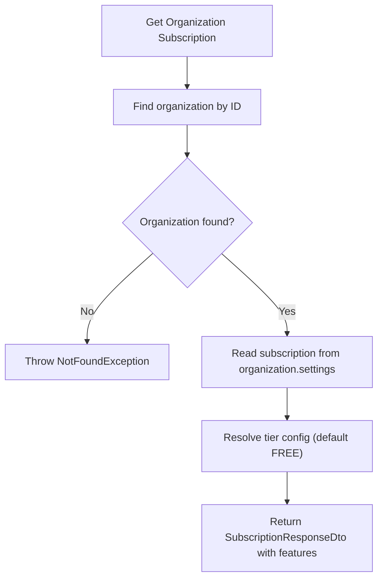
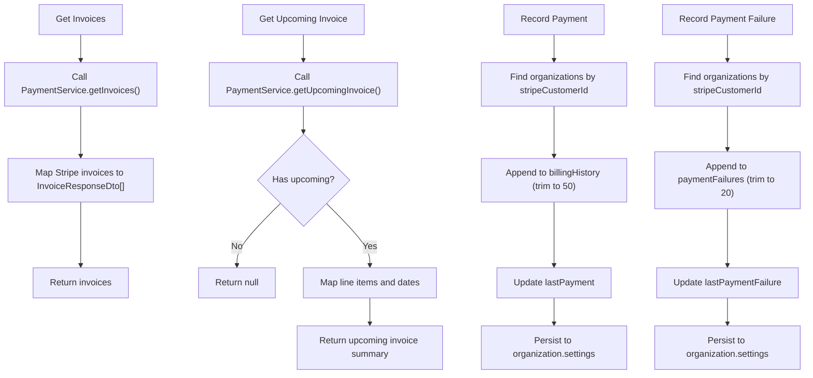
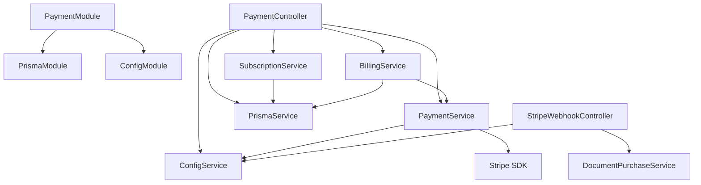
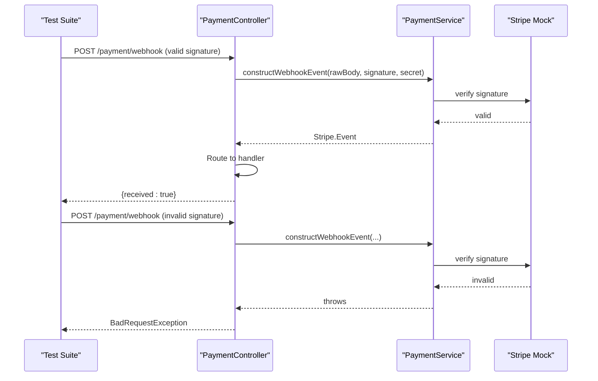

# Payment Processing Integrations

<cite>
**Referenced Files in This Document**
- [payment.module.ts](file://apps/api/src/modules/payment/payment.module.ts)
- [payment.controller.ts](file://apps/api/src/modules/payment/payment.controller.ts)
- [payment.service.ts](file://apps/api/src/modules/payment/payment.service.ts)
- [subscription.service.ts](file://apps/api/src/modules/payment/subscription.service.ts)
- [billing.service.ts](file://apps/api/src/modules/payment/billing.service.ts)
- [payment.dto.ts](file://apps/api/src/modules/payment/dto/payment.dto.ts)
- [stripe-webhook.controller.ts](file://apps/api/src/modules/document-commerce/stripe-webhook.controller.ts)
- [configuration.ts](file://apps/api/src/config/configuration.ts)
- [fixtures.ts](file://e2e/fixtures.ts)
- [payment.e2e.test.ts](file://e2e/payment/payment.e2e.test.ts)
- [payment.controller.spec.ts](file://apps/api/src/modules/payment/payment.controller.spec.ts)
- [payment.service.spec.ts](file://apps/api/src/modules/payment/payment.service.spec.ts)
</cite>

## Table of Contents
1. [Introduction](#introduction)
2. [Project Structure](#project-structure)
3. [Core Components](#core-components)
4. [Architecture Overview](#architecture-overview)
5. [Detailed Component Analysis](#detailed-component-analysis)
6. [Dependency Analysis](#dependency-analysis)
7. [Performance Considerations](#performance-considerations)
8. [Security and Compliance](#security-and-compliance)
9. [Integration Testing Patterns](#integration-testing-patterns)
10. [Troubleshooting Guide](#troubleshooting-guide)
11. [Conclusion](#conclusion)

## Introduction
This document provides comprehensive payment integration documentation for Stripe-based subscription management and billing processing. It covers billing service implementations, payment intent creation, webhook handling for payment events, subscription lifecycle management, proration calculations, plan upgrades/downgrades, webhook security, signature verification, event replay protection, PCI compliance considerations, data encryption, secure payment data handling, and integration testing patterns for payment scenarios and sandbox environments.

## Project Structure
The payment integration is organized within the NestJS application under the payment module, with supporting services for billing, subscription management, and DTOs. Additional webhook handling exists for document commerce payments.



**Diagram sources**
- [payment.module.ts:18-24](file://apps/api/src/modules/payment/payment.module.ts#L18-L24)
- [payment.controller.ts:40-53](file://apps/api/src/modules/payment/payment.controller.ts#L40-L53)
- [payment.service.ts:56-72](file://apps/api/src/modules/payment/payment.service.ts#L56-L72)
- [subscription.service.ts:28-32](file://apps/api/src/modules/payment/subscription.service.ts#L28-L32)
- [billing.service.ts:32-39](file://apps/api/src/modules/payment/billing.service.ts#L32-L39)
- [stripe-webhook.controller.ts:22-49](file://apps/api/src/modules/document-commerce/stripe-webhook.controller.ts#L22-L49)

**Section sources**
- [payment.module.ts:1-25](file://apps/api/src/modules/payment/payment.module.ts#L1-L25)
- [payment.controller.ts:39-53](file://apps/api/src/modules/payment/payment.controller.ts#L39-L53)

## Core Components
- PaymentController: Exposes endpoints for subscription tiers, checkout session creation, customer portal sessions, subscription status retrieval, invoice retrieval, usage statistics, cancellation/resumption, and webhook handling.
- PaymentService: Manages Stripe integration including checkout sessions, customer portal sessions, customer creation, subscription retrieval/cancellation/resumption, subscription updates with proration, webhook signature verification, invoice retrieval, and upcoming invoice previews.
- SubscriptionService: Manages subscription tier logic, database synchronization, activation, status syncing, cancellation by Stripe ID, feature access checks, tier comparisons, and organization queries by tier.
- BillingService: Handles invoice retrieval, upcoming invoice previews, payment recording, payment failure recording, billing summaries, and usage statistics aggregation.
- StripeWebhookController: Handles document purchase webhooks (payment_intent events) with signature verification and event dispatching to purchase services.

**Section sources**
- [payment.controller.ts:73-396](file://apps/api/src/modules/payment/payment.controller.ts#L73-L396)
- [payment.service.ts:56-316](file://apps/api/src/modules/payment/payment.service.ts#L56-L316)
- [subscription.service.ts:28-237](file://apps/api/src/modules/payment/subscription.service.ts#L28-L237)
- [billing.service.ts:32-270](file://apps/api/src/modules/payment/billing.service.ts#L32-L270)
- [stripe-webhook.controller.ts:22-144](file://apps/api/src/modules/document-commerce/stripe-webhook.controller.ts#L22-L144)

## Architecture Overview
The payment architecture integrates Stripe for subscription management and billing while maintaining separation of concerns across services and controllers. Controllers orchestrate requests, services interact with Stripe APIs, and billing/subscription services manage local state synchronization.



**Diagram sources**
- [payment.controller.ts:84-97](file://apps/api/src/modules/payment/payment.controller.ts#L84-L97)
- [payment.service.ts:105-152](file://apps/api/src/modules/payment/payment.service.ts#L105-L152)
- [payment.controller.ts:298-347](file://apps/api/src/modules/payment/payment.controller.ts#L298-L347)
- [billing.service.ts:91-140](file://apps/api/src/modules/payment/billing.service.ts#L91-L140)
- [subscription.service.ts:75-92](file://apps/api/src/modules/payment/subscription.service.ts#L75-L92)

## Detailed Component Analysis

### PaymentController
- Responsibilities:
  - Validates organization access for protected endpoints.
  - Provides subscription tiers, checkout session creation, customer portal session creation, subscription status retrieval, invoice retrieval, usage statistics, cancellation/resumption, and webhook handling.
- Security:
  - Uses JWT guard and organization access validation for protected endpoints.
  - Enforces customer ownership for portal and invoice endpoints.
- Webhook handling:
  - Verifies webhook signatures using configured secret.
  - Routes Stripe events to appropriate handlers for checkout completion, subscription updates/deletion, and invoice payment events.



**Diagram sources**
- [payment.controller.ts:274-324](file://apps/api/src/modules/payment/payment.controller.ts#L274-L324)
- [payment.service.ts:274-280](file://apps/api/src/modules/payment/payment.service.ts#L274-L280)

**Section sources**
- [payment.controller.ts:59-68](file://apps/api/src/modules/payment/payment.controller.ts#L59-L68)
- [payment.controller.ts:105-129](file://apps/api/src/modules/payment/payment.controller.ts#L105-L129)
- [payment.controller.ts:141-177](file://apps/api/src/modules/payment/payment.controller.ts#L141-L177)
- [payment.controller.ts:274-324](file://apps/api/src/modules/payment/payment.controller.ts#L274-L324)

### PaymentService
- Responsibilities:
  - Manages Stripe SDK initialization with configurable API version.
  - Creates checkout sessions for subscription tiers with metadata.
  - Creates customer portal sessions for billing management.
  - Creates Stripe customers with organization metadata.
  - Retrieves subscriptions, cancels/resumes subscriptions, and updates subscriptions with proration.
  - Verifies webhook signatures using configured webhook secret.
  - Lists invoices and retrieves upcoming invoice previews.
- Subscription tiers:
  - Defines FREE, PROFESSIONAL, ENTERPRISE tiers with feature limits and pricing.
  - Resolves price IDs from environment variables with fallbacks.
- Proration:
  - Updates subscription items with proration behavior enabled.

```mermaid
classDiagram
class PaymentService {
-logger
-stripe
+isConfigured() bool
+createCheckoutSession(params) Promise~{sessionId,url}~
+createPortalSession(customerId, returnUrl) Promise~string~
+createCustomer(params) Promise~Customer~
+getSubscription(id) Promise~Subscription~
+cancelSubscription(id, cancelAtPeriodEnd) Promise~Subscription~
+resumeSubscription(id) Promise~Subscription~
+updateSubscription(id, newTier) Promise~Subscription~
+constructWebhookEvent(payload, signature, secret) Stripe.Event
+getInvoices(customerId, limit) Promise~Invoice[]~
+getUpcomingInvoice(customerId) Promise~UpcomingInvoice|null~
}
class Stripe {
<<external>>
}
PaymentService --> Stripe : "uses"
```

**Diagram sources**
- [payment.service.ts:56-316](file://apps/api/src/modules/payment/payment.service.ts#L56-L316)

**Section sources**
- [payment.service.ts:85-100](file://apps/api/src/modules/payment/payment.service.ts#L85-L100)
- [payment.service.ts:105-152](file://apps/api/src/modules/payment/payment.service.ts#L105-L152)
- [payment.service.ts:157-168](file://apps/api/src/modules/payment/payment.service.ts#L157-L168)
- [payment.service.ts:173-193](file://apps/api/src/modules/payment/payment.service.ts#L173-L193)
- [payment.service.ts:198-204](file://apps/api/src/modules/payment/payment.service.ts#L198-L204)
- [payment.service.ts:209-237](file://apps/api/src/modules/payment/payment.service.ts#L209-L237)
- [payment.service.ts:242-269](file://apps/api/src/modules/payment/payment.service.ts#L242-L269)
- [payment.service.ts:274-280](file://apps/api/src/modules/payment/payment.service.ts#L274-L280)
- [payment.service.ts:285-296](file://apps/api/src/modules/payment/payment.service.ts#L285-L296)
- [payment.service.ts:301-314](file://apps/api/src/modules/payment/payment.service.ts#L301-L314)

### SubscriptionService
- Responsibilities:
  - Retrieves organization subscription with tier, status, Stripe identifiers, and feature limits.
  - Activates subscription upon successful checkout completion.
  - Synchronizes subscription status from Stripe events.
  - Cancels subscription by Stripe ID and downgrades to FREE.
  - Checks feature access against tier limits.
  - Compares tiers to determine upgrade/downgrade/same.
  - Queries organizations by subscription tier.



**Diagram sources**
- [subscription.service.ts:37-70](file://apps/api/src/modules/payment/subscription.service.ts#L37-L70)

**Section sources**
- [subscription.service.ts:75-92](file://apps/api/src/modules/payment/subscription.service.ts#L75-L92)
- [subscription.service.ts:97-132](file://apps/api/src/modules/payment/subscription.service.ts#L97-L132)
- [subscription.service.ts:137-165](file://apps/api/src/modules/payment/subscription.service.ts#L137-L165)
- [subscription.service.ts:170-189](file://apps/api/src/modules/payment/subscription.service.ts#L170-L189)
- [subscription.service.ts:220-235](file://apps/api/src/modules/payment/subscription.service.ts#L220-L235)

### BillingService
- Responsibilities:
  - Retrieves invoices for a customer and maps to response DTO.
  - Retrieves upcoming invoice preview with line items.
  - Records successful payments into organization billing history and last payment.
  - Records payment failures into organization payment failures and last failure.
  - Computes billing summary totals and failure indicators.
  - Aggregates usage statistics for billing reporting.



**Diagram sources**
- [billing.service.ts:44-60](file://apps/api/src/modules/payment/billing.service.ts#L44-L60)
- [billing.service.ts:70-86](file://apps/api/src/modules/payment/billing.service.ts#L70-L86)
- [billing.service.ts:91-140](file://apps/api/src/modules/payment/billing.service.ts#L91-L140)
- [billing.service.ts:145-190](file://apps/api/src/modules/payment/billing.service.ts#L145-L190)

**Section sources**
- [billing.service.ts:44-86](file://apps/api/src/modules/payment/billing.service.ts#L44-L86)
- [billing.service.ts:91-190](file://apps/api/src/modules/payment/billing.service.ts#L91-L190)
- [billing.service.ts:195-234](file://apps/api/src/modules/payment/billing.service.ts#L195-L234)
- [billing.service.ts:244-268](file://apps/api/src/modules/payment/billing.service.ts#L244-L268)

### StripeWebhookController (Document Commerce)
- Responsibilities:
  - Handles payment_intent.succeeded, payment_intent.payment_failed, and payment_intent.canceled events.
  - Verifies webhook signatures using configured webhook secret.
  - Delegates event handling to document purchase service.

**Section sources**
- [stripe-webhook.controller.ts:55-103](file://apps/api/src/modules/document-commerce/stripe-webhook.controller.ts#L55-L103)
- [stripe-webhook.controller.ts:108-142](file://apps/api/src/modules/document-commerce/stripe-webhook.controller.ts#L108-L142)

## Dependency Analysis
- PaymentModule imports PrismaModule and ConfigModule, providing database and configuration services to all payment services.
- PaymentController depends on PaymentService, SubscriptionService, BillingService, ConfigService, and PrismaService.
- PaymentService depends on ConfigService and Stripe SDK.
- SubscriptionService and BillingService depend on PrismaService for persistence.
- StripeWebhookController depends on ConfigService and DocumentPurchaseService.



**Diagram sources**
- [payment.module.ts:18-24](file://apps/api/src/modules/payment/payment.module.ts#L18-L24)
- [payment.controller.ts:45-51](file://apps/api/src/modules/payment/payment.controller.ts#L45-L51)
- [payment.service.ts:61-72](file://apps/api/src/modules/payment/payment.service.ts#L61-L72)
- [billing.service.ts:36-39](file://apps/api/src/modules/payment/billing.service.ts#L36-L39)
- [subscription.service.ts:32](file://apps/api/src/modules/payment/subscription.service.ts#L32)
- [stripe-webhook.controller.ts:29-34](file://apps/api/src/modules/document-commerce/stripe-webhook.controller.ts#L29-L34)

**Section sources**
- [payment.module.ts:18-24](file://apps/api/src/modules/payment/payment.module.ts#L18-L24)
- [payment.controller.ts:45-51](file://apps/api/src/modules/payment/payment.controller.ts#L45-L51)

## Performance Considerations
- Stripe API calls are synchronous within request handlers; consider caching tier configurations and price IDs to reduce repeated environment lookups.
- Invoice retrieval uses pagination with a default limit; ensure clients specify appropriate limits for large histories.
- Billing history and failure arrays are trimmed to recent entries to control document size growth.
- Subscription tier comparisons use constant-time lookups via ordered arrays.

## Security and Compliance
- Webhook Security:
  - Both PaymentController and StripeWebhookController enforce signature verification using Stripe's webhook secret before processing events.
  - PaymentController validates presence of raw body and configured webhook secret prior to verification.
- PCI Compliance:
  - PaymentService initializes Stripe SDK without storing card data; all payment processing occurs through Stripe-hosted experiences.
  - Checkout sessions and customer portal sessions delegate payment collection to Stripe, minimizing PCI scope.
- Data Protection:
  - Environment variables for secrets are validated during configuration loading.
  - Logging avoids exposing sensitive data per security policy guidelines.

**Section sources**
- [payment.controller.ts:278-294](file://apps/api/src/modules/payment/payment.controller.ts#L278-L294)
- [stripe-webhook.controller.ts:71-82](file://apps/api/src/modules/document-commerce/stripe-webhook.controller.ts#L71-L82)
- [configuration.ts:5-43](file://apps/api/src/config/configuration.ts#L5-L43)

## Integration Testing Patterns
- Webhook Signature Verification:
  - Tests validate rejection when webhook secret is missing, raw body is absent, or signature verification fails.
  - Tests cover handling of checkout.session.completed, customer.subscription.updated/deleted, and invoice.payment_succeeded/failed events.
- Subscription Management:
  - Tests verify subscription cancellation behavior (at period end vs immediate) and resumption logic.
  - Tests confirm subscription tier updates trigger proration behavior.
- Sandbox Testing:
  - E2E fixtures provide Stripe test card numbers for simulating various outcomes (declined, insufficient funds, 3D Secure).
  - E2E tests outline scenarios for payment failure recovery and retry flows.



**Diagram sources**
- [payment.controller.spec.ts:319-361](file://apps/api/src/modules/payment/payment.controller.spec.ts#L319-L361)
- [payment.service.spec.ts:273-283](file://apps/api/src/modules/payment/payment.service.spec.ts#L273-L283)
- [payment.service.spec.ts:285-316](file://apps/api/src/modules/payment/payment.service.spec.ts#L285-L316)

**Section sources**
- [payment.controller.spec.ts:285-361](file://apps/api/src/modules/payment/payment.controller.spec.ts#L285-L361)
- [payment.service.spec.ts:273-316](file://apps/api/src/modules/payment/payment.service.spec.ts#L273-L316)
- [fixtures.ts:244-293](file://e2e/fixtures.ts#L244-L293)
- [payment.e2e.test.ts:471-477](file://e2e/payment/payment.e2e.test.ts#L471-L477)

## Troubleshooting Guide
- Webhook Signature Failures:
  - Ensure STRIPE_WEBHOOK_SECRET is configured and matches the value set in Stripe Dashboard.
  - Verify that the raw body is being forwarded to the webhook endpoint.
- Missing Stripe Configuration:
  - If STRIPE_SECRET_KEY is not configured, payment features are disabled and exceptions are thrown by PaymentService methods.
- Subscription Updates:
  - Updating to FREE tier is not permitted; ensure new tier is PROFESSIONAL or ENTERPRISE.
  - Proration behavior is enabled; verify that proration calculations align with business expectations.
- Billing History Issues:
  - Billing history and failure arrays are trimmed to recent entries; older records may be removed automatically.

**Section sources**
- [payment.controller.ts:278-294](file://apps/api/src/modules/payment/payment.controller.ts#L278-L294)
- [payment.service.ts:62-72](file://apps/api/src/modules/payment/payment.service.ts#L62-L72)
- [payment.service.ts:250-253](file://apps/api/src/modules/payment/payment.service.ts#L250-L253)
- [billing.service.ts:121-122](file://apps/api/src/modules/payment/billing.service.ts#L121-L122)
- [billing.service.ts:171-172](file://apps/api/src/modules/payment/billing.service.ts#L171-L172)

## Conclusion
The payment integration provides a robust foundation for Stripe-based subscription management and billing processing. It includes secure webhook handling, subscription lifecycle management with proration, billing history tracking, and comprehensive testing patterns. By adhering to the documented security practices and leveraging the provided services, teams can confidently extend and maintain payment functionality within the application.