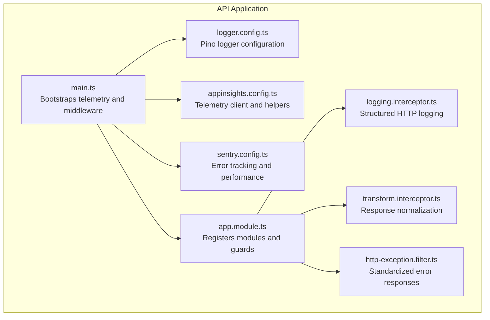
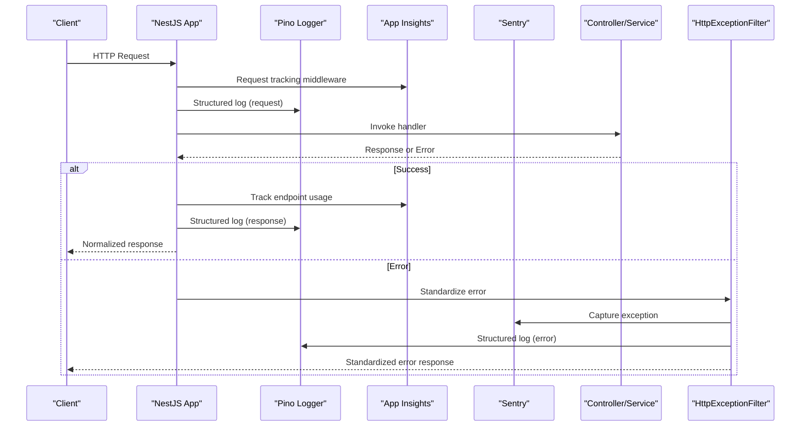
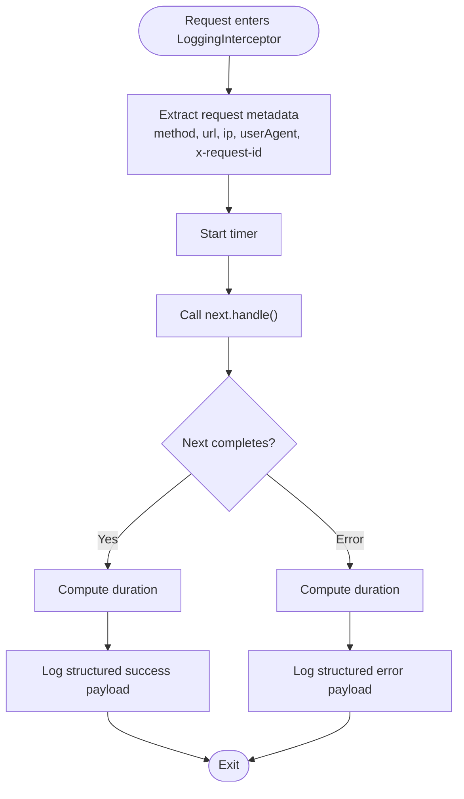
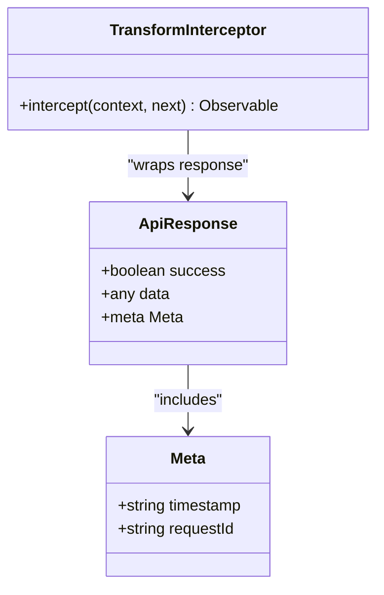
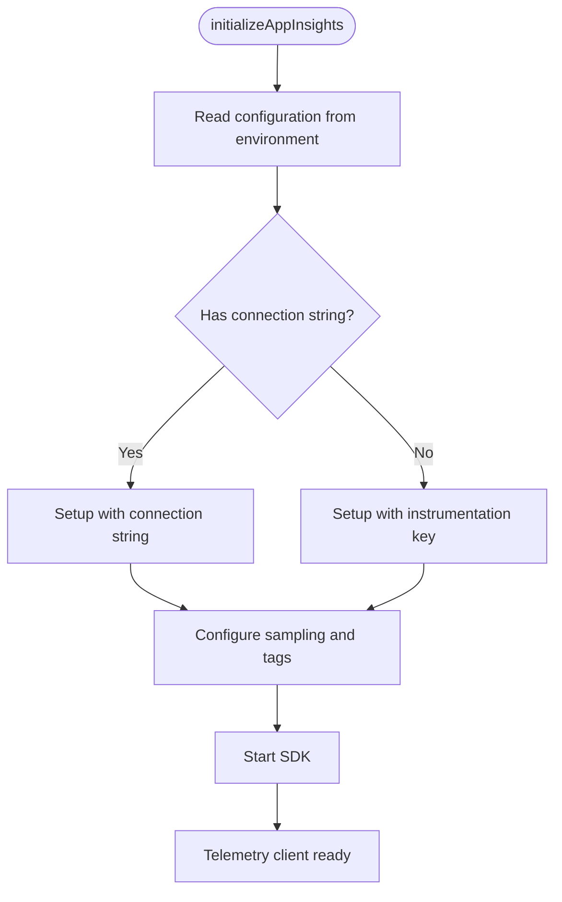
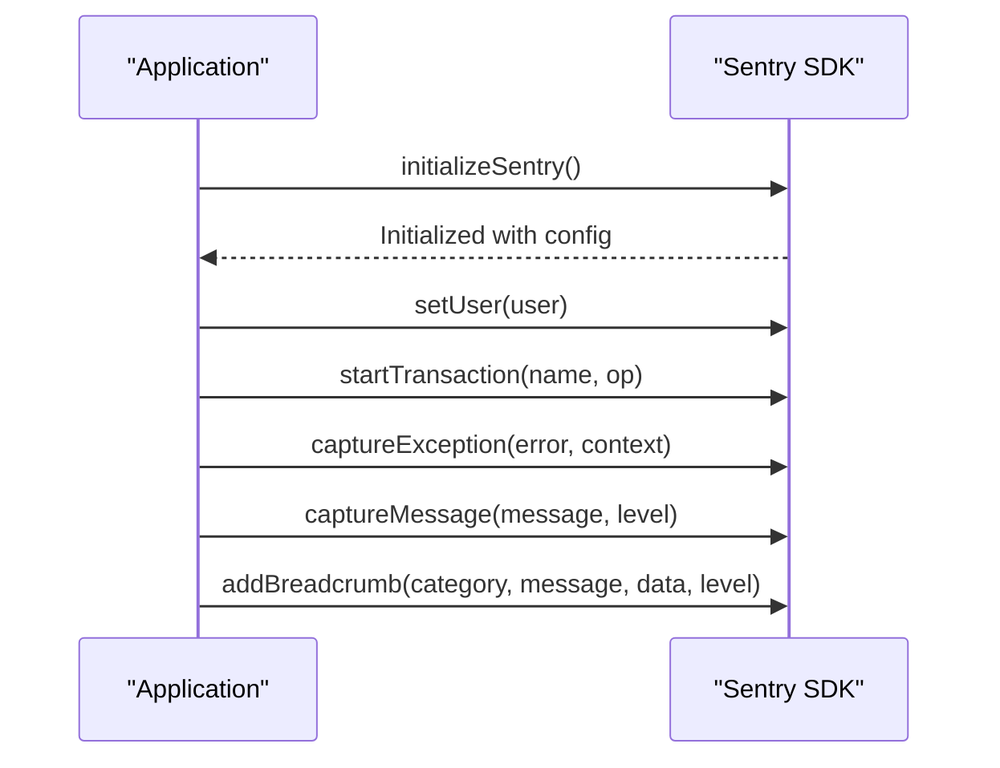
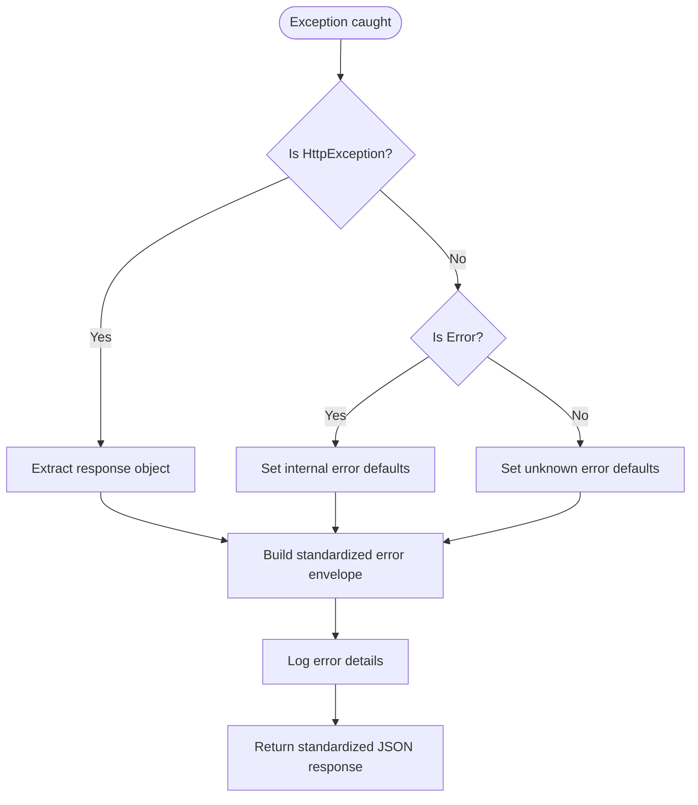
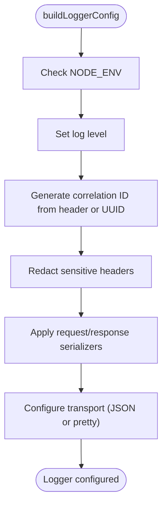
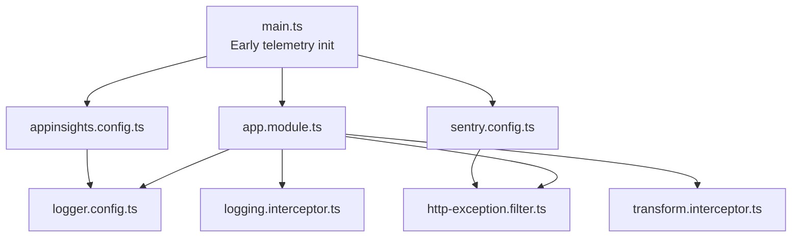

# Application Observability

<cite>
**Referenced Files in This Document**
- [logging.interceptor.ts](file://apps/api/src/common/interceptors/logging.interceptor.ts)
- [transform.interceptor.ts](file://apps/api/src/common/interceptors/transform.interceptor.ts)
- [appinsights.config.ts](file://apps/api/src/config/appinsights.config.ts)
- [sentry.config.ts](file://apps/api/src/config/sentry.config.ts)
- [logger.config.ts](file://apps/api/src/config/logger.config.ts)
- [http-exception.filter.ts](file://apps/api/src/common/filters/http-exception.filter.ts)
- [main.ts](file://apps/api/src/main.ts)
- [app.module.ts](file://apps/api/src/app.module.ts)
- [alerting-rules.config.ts](file://apps/api/src/config/alerting-rules.config.ts)
- [uptime-monitoring.config.ts](file://apps/api/src/config/uptime-monitoring.config.ts)
- [configuration.ts](file://apps/api/src/config/configuration.ts)
</cite>

## Table of Contents
1. [Introduction](#introduction)
2. [Project Structure](#project-structure)
3. [Core Components](#core-components)
4. [Architecture Overview](#architecture-overview)
5. [Detailed Component Analysis](#detailed-component-analysis)
6. [Dependency Analysis](#dependency-analysis)
7. [Performance Considerations](#performance-considerations)
8. [Troubleshooting Guide](#troubleshooting-guide)
9. [Conclusion](#conclusion)

## Introduction
This document provides comprehensive application observability documentation for Quiz-to-Build. It covers structured logging with correlation IDs, response normalization, Application Insights telemetry collection, Sentry error tracking and performance monitoring, exception filtering strategies, alerting thresholds, and production monitoring workflows. The goal is to enable reliable operations, rapid incident response, and continuous improvement of system reliability and performance.

## Project Structure
Observability is implemented across the API application through dedicated configuration modules, interceptors, filters, and initialization routines. The main application bootstraps telemetry clients early, configures structured logging, applies global interceptors for standardized request/response logging and response normalization, and registers exception handling.

**Diagram sources**
- [main.ts:28-329](file://apps/api/src/main.ts#L28-L329)
- [app.module.ts:53-130](file://apps/api/src/app.module.ts#L53-L130)
- [logger.config.ts:9-62](file://apps/api/src/config/logger.config.ts#L9-L62)
- [appinsights.config.ts:65-117](file://apps/api/src/config/appinsights.config.ts#L65-L117)
- [sentry.config.ts:51-127](file://apps/api/src/config/sentry.config.ts#L51-L127)
- [logging.interceptor.ts:10-56](file://apps/api/src/common/interceptors/logging.interceptor.ts#L10-L56)
- [transform.interceptor.ts:14-32](file://apps/api/src/common/interceptors/transform.interceptor.ts#L14-L32)
- [http-exception.filter.ts:22-102](file://apps/api/src/common/filters/http-exception.filter.ts#L22-L102)

**Section sources**
- [main.ts:28-329](file://apps/api/src/main.ts#L28-L329)
- [app.module.ts:53-130](file://apps/api/src/app.module.ts#L53-L130)

## Core Components
- Structured HTTP logging with correlation IDs and performance metrics
- Response normalization to a consistent envelope
- Application Insights telemetry for APM, custom metrics, and distributed tracing
- Sentry integration for error tracking, performance monitoring, and user session analysis
- Exception filtering and standardized error responses
- Alerting rules and uptime monitoring configuration

**Section sources**
- [logging.interceptor.ts:10-56](file://apps/api/src/common/interceptors/logging.interceptor.ts#L10-L56)
- [transform.interceptor.ts:14-32](file://apps/api/src/common/interceptors/transform.interceptor.ts#L14-L32)
- [appinsights.config.ts:65-117](file://apps/api/src/config/appinsights.config.ts#L65-L117)
- [sentry.config.ts:51-127](file://apps/api/src/config/sentry.config.ts#L51-L127)
- [http-exception.filter.ts:22-102](file://apps/api/src/common/filters/http-exception.filter.ts#L22-L102)

## Architecture Overview
The observability architecture integrates telemetry initialization, structured logging, interceptors, and centralized configuration. Telemetry clients are initialized before other imports to ensure full instrumentation. Global interceptors standardize request/response logging and normalize responses. Exception handling ensures consistent error payloads. Alerting and uptime monitoring define thresholds and escalation policies.

**Diagram sources**
- [main.ts:28-329](file://apps/api/src/main.ts#L28-L329)
- [appinsights.config.ts:576-610](file://apps/api/src/config/appinsights.config.ts#L576-L610)
- [logger.config.ts:9-62](file://apps/api/src/config/logger.config.ts#L9-L62)
- [http-exception.filter.ts:22-102](file://apps/api/src/common/filters/http-exception.filter.ts#L22-L102)

## Detailed Component Analysis

### Structured HTTP Logging Interceptor
The logging interceptor captures request metadata, correlation IDs, response status, duration, and client details. It logs both successful and error responses using the NestJS logger, enabling structured JSON logs with correlation IDs.

Key capabilities:
- Extracts correlation ID from request headers
- Measures request duration
- Logs method, URL, status code, IP, user agent, and correlation ID
- Emits structured logs for both success and error paths

**Diagram sources**
- [logging.interceptor.ts:14-54](file://apps/api/src/common/interceptors/logging.interceptor.ts#L14-L54)

**Section sources**
- [logging.interceptor.ts:10-56](file://apps/api/src/common/interceptors/logging.interceptor.ts#L10-L56)

### Response Normalization Interceptor
The transform interceptor wraps all successful responses in a consistent envelope with success flag, data payload, and optional metadata including timestamp and correlation ID. This ensures uniform response structure across all endpoints.

Key capabilities:
- Reads correlation ID from request headers
- Adds standardized metadata (timestamp, optional correlation ID)
- Wraps data in a normalized envelope

**Diagram sources**
- [transform.interceptor.ts:14-32](file://apps/api/src/common/interceptors/transform.interceptor.ts#L14-L32)

**Section sources**
- [transform.interceptor.ts:14-32](file://apps/api/src/common/interceptors/transform.interceptor.ts#L14-L32)

### Application Insights Configuration
Application Insights is initialized early in the boot process with environment-driven configuration. It provides:
- Telemetry client initialization with connection string or instrumentation key
- Cloud role tagging for application maps
- Sampling configuration for cost control
- Auto-collection of requests, performance, exceptions, dependencies, and console logs
- Custom metrics and events for business KPIs
- Dependency tracking for databases and external APIs
- Availability tracking for health checks
- Request tracking middleware for endpoint usage and slow request detection
- Graceful shutdown with telemetry flush

Key configuration highlights:
- Environment-based sampling percentages (higher in production)
- Cloud role and instance tagging
- Auto-collection toggles per environment
- Custom metric definitions for questionnaire completion, readiness scores, and document generation
- Dependency tracking helpers for database and HTTP calls
- Availability tracking for health checks

**Diagram sources**
- [appinsights.config.ts:65-117](file://apps/api/src/config/appinsights.config.ts#L65-L117)

**Section sources**
- [appinsights.config.ts:65-117](file://apps/api/src/config/appinsights.config.ts#L65-L117)
- [appinsights.config.ts:576-610](file://apps/api/src/config/appinsights.config.ts#L576-L610)

### Sentry Integration
Sentry is initialized early with environment-driven configuration and includes:
- DSN-based initialization with environment and release metadata
- Performance monitoring with configurable trace sampling rates
- Optional profiling integration when available
- Sensitive data redaction from headers and breadcrumbs
- Transaction filtering for health checks
- Error filtering for known benign errors
- User context management and breadcrumbing for debugging
- Centralized alerting rules and severity thresholds

Key capabilities:
- Structured beforeSend and beforeSendTransaction hooks
- User context and session analysis
- Performance monitoring spans
- Alerting thresholds for error rates and response times

**Diagram sources**
- [sentry.config.ts:51-127](file://apps/api/src/config/sentry.config.ts#L51-L127)
- [sentry.config.ts:192-216](file://apps/api/src/config/sentry.config.ts#L192-L216)

**Section sources**
- [sentry.config.ts:51-127](file://apps/api/src/config/sentry.config.ts#L51-L127)
- [sentry.config.ts:192-216](file://apps/api/src/config/sentry.config.ts#L192-L216)

### Exception Filtering and Standardized Error Responses
The HTTP exception filter ensures consistent error responses across the API:
- Maps HTTP exceptions to standardized error envelopes
- Generates deterministic error codes based on status codes
- Captures unhandled errors with stack traces
- Includes correlation ID and timestamp in error responses
- Logs error details for debugging

**Diagram sources**
- [http-exception.filter.ts:26-82](file://apps/api/src/common/filters/http-exception.filter.ts#L26-L82)

**Section sources**
- [http-exception.filter.ts:22-102](file://apps/api/src/common/filters/http-exception.filter.ts#L22-L102)

### Structured Logging Configuration
The logger configuration builds Pino-based logging with:
- Environment-driven log levels
- Correlation ID generation via X-Request-Id header or UUID
- Sensitive field redaction (authorization, cookies, set-cookie)
- Structured request and response serializers
- Pretty printing in development, JSON in production

**Diagram sources**
- [logger.config.ts:9-62](file://apps/api/src/config/logger.config.ts#L9-L62)

**Section sources**
- [logger.config.ts:9-62](file://apps/api/src/config/logger.config.ts#L9-L62)

### Alerting Rules and Uptime Monitoring
Alerting rules define thresholds and escalation policies for error rates, performance, security, business, and resource metrics. Uptime monitoring defines SLA targets, health check endpoints, and alert escalation.

Key components:
- AlertingConfiguration with global settings, error/performance/security/business/resource rules
- NotificationChannels with email, Slack, Teams, PagerDuty, SMS, and webhook
- Escalation policies for default and critical incidents
- Uptime monitoring SLA targets, health endpoints, and incident response rules

**Section sources**
- [alerting-rules.config.ts:61-478](file://apps/api/src/config/alerting-rules.config.ts#L61-L478)
- [uptime-monitoring.config.ts:12-379](file://apps/api/src/config/uptime-monitoring.config.ts#L12-L379)

## Dependency Analysis
The observability stack depends on early initialization of telemetry clients and global middleware registration. The main application initializes Application Insights and Sentry before creating the Nest factory, ensuring full instrumentation. Global interceptors and filters are registered to apply standardized logging and error handling across all routes.

**Diagram sources**
- [main.ts:28-329](file://apps/api/src/main.ts#L28-L329)
- [app.module.ts:53-130](file://apps/api/src/app.module.ts#L53-L130)
- [logger.config.ts:9-62](file://apps/api/src/config/logger.config.ts#L9-L62)
- [appinsights.config.ts:65-117](file://apps/api/src/config/appinsights.config.ts#L65-L117)
- [sentry.config.ts:51-127](file://apps/api/src/config/sentry.config.ts#L51-L127)

**Section sources**
- [main.ts:28-329](file://apps/api/src/main.ts#L28-L329)
- [app.module.ts:53-130](file://apps/api/src/app.module.ts#L53-L130)

## Performance Considerations
- Application Insights sampling reduces telemetry volume in production while maintaining signal quality.
- Compression middleware excludes streaming endpoints to preserve real-time performance.
- Structured logging avoids expensive formatting overhead by delegating to Pino.
- Interceptors add minimal overhead; ensure correlation ID propagation across services.
- Sentry trace sampling balances performance monitoring fidelity with overhead.

## Troubleshooting Guide
Common production monitoring workflows:
- Verify telemetry initialization: Check Application Insights and Sentry initialization logs during startup.
- Inspect correlation IDs: Ensure X-Request-Id is propagated across services for end-to-end tracing.
- Review standardized error responses: Use the error envelope structure to quickly identify issues.
- Monitor alert thresholds: Validate alert rules against recent metrics and adjust thresholds as needed.
- Investigate slow requests: Use Application Insights request tracking and Sentry performance spans to identify bottlenecks.
- Validate uptime monitoring: Confirm health check endpoints are reachable and responding within SLA targets.

Operational checks:
- Confirm environment variables for telemetry clients are set appropriately.
- Verify logger configuration for production JSON output and redaction of sensitive fields.
- Ensure global interceptors and filters are registered to apply consistent logging and error handling.
- Validate alerting rules and notification channels for timely incident response.

**Section sources**
- [main.ts:28-329](file://apps/api/src/main.ts#L28-L329)
- [logger.config.ts:9-62](file://apps/api/src/config/logger.config.ts#L9-L62)
- [alerting-rules.config.ts:61-478](file://apps/api/src/config/alerting-rules.config.ts#L61-L478)
- [uptime-monitoring.config.ts:12-379](file://apps/api/src/config/uptime-monitoring.config.ts#L12-L379)

## Conclusion
Quiz-to-Build employs a robust observability strategy combining structured logging with correlation IDs, standardized response normalization, comprehensive telemetry via Application Insights and Sentry, centralized alerting rules, and uptime monitoring. These components work together to provide deep insights into system behavior, rapid incident response, and continuous reliability improvements. Proper configuration and adherence to the documented patterns ensure consistent observability across environments and enable efficient troubleshooting and performance optimization.