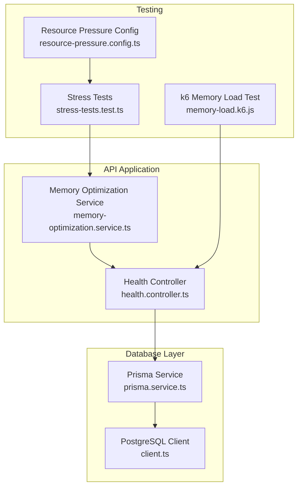
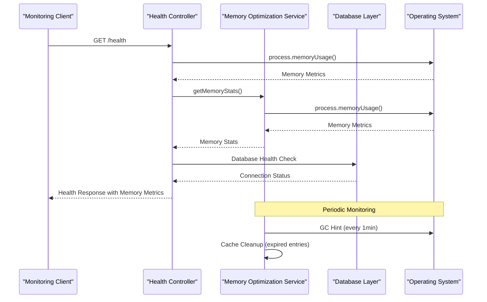
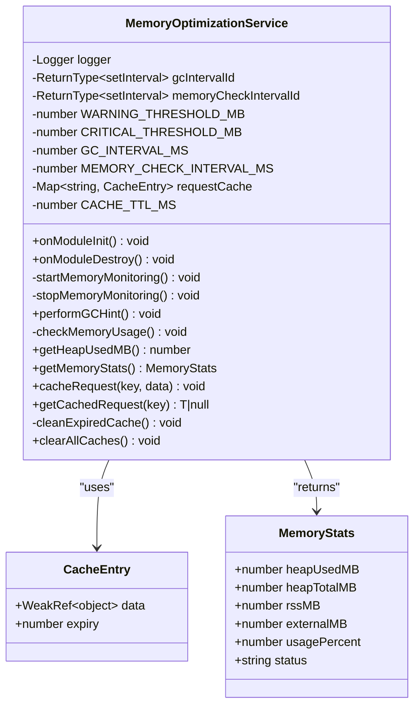
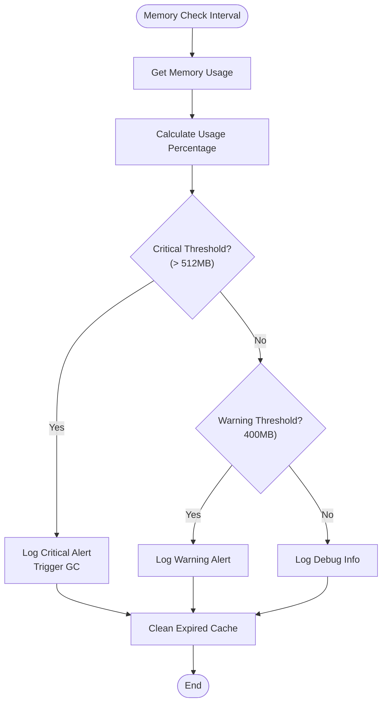
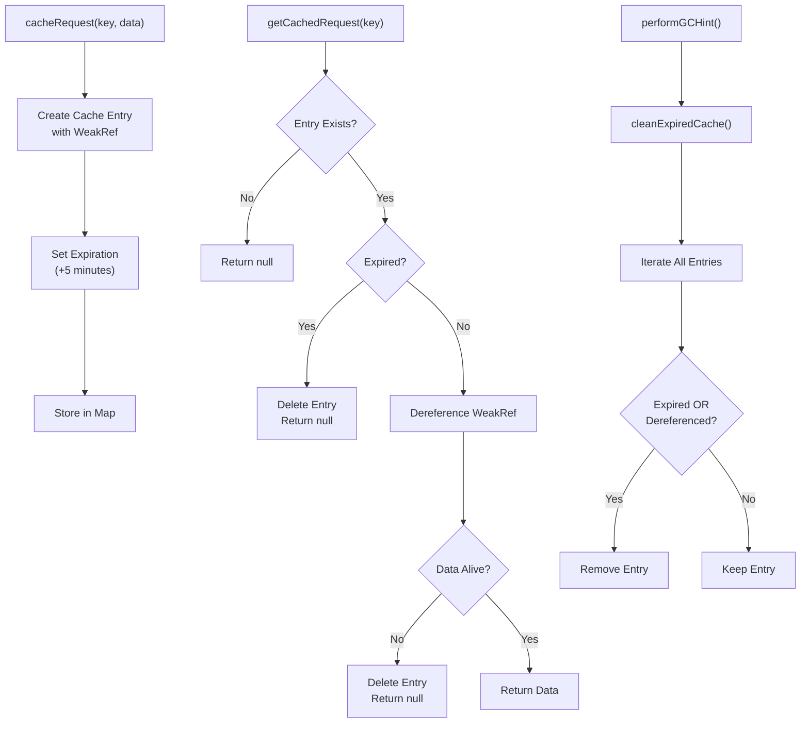
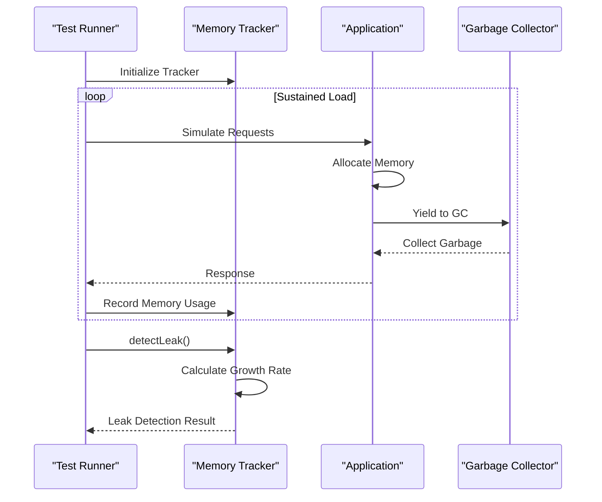
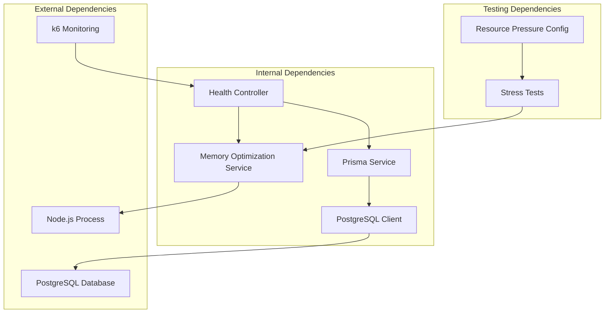

# Memory Optimization

<cite>
**Referenced Files in This Document**
- [memory-optimization.service.ts](file://apps/api/src/common/services/memory-optimization.service.ts)
- [memory-optimization.service.spec.ts](file://apps/api/src/common/services/memory-optimization.service.spec.ts)
- [health.controller.ts](file://apps/api/src/health.controller.ts)
- [resource-pressure.config.ts](file://apps/api/src/config/resource-pressure.config.ts)
- [memory-load.k6.js](file://test/performance/memory-load.k6.js)
- [stress-tests.test.ts](file://test/performance/stress-tests.test.ts)
- [prisma.service.ts](file://libs/database/src/prisma.service.ts)
- [client.ts](file://libs/orchestrator/src/mcp/client.ts)
</cite>

## Table of Contents
1. [Introduction](#introduction)
2. [Project Structure](#project-structure)
3. [Core Components](#core-components)
4. [Architecture Overview](#architecture-overview)
5. [Detailed Component Analysis](#detailed-component-analysis)
6. [Dependency Analysis](#dependency-analysis)
7. [Performance Considerations](#performance-considerations)
8. [Troubleshooting Guide](#troubleshooting-guide)
9. [Conclusion](#conclusion)

## Introduction
This document provides comprehensive memory optimization guidance for Quiz-to-Build's resource management. It covers the Memory Optimization Service implementation, garbage collection strategies, memory leak prevention, efficient data structures, memory profiling and heap analysis, optimization strategies for large datasets, caching mechanisms, resource cleanup, monitoring tools, allocation tracking, and performance impact measurements. It also includes best practices for preventing memory leaks, optimizing database queries, managing concurrent operations, and troubleshooting memory-related issues.

## Project Structure
The memory optimization capabilities are primarily implemented in the API application with supporting performance tests and configuration:

- Memory Optimization Service: Central component for memory monitoring and GC hints
- Health Controller: Exposes memory metrics and health status
- Resource Pressure Configuration: Defines memory pressure tests and thresholds
- Performance Tests: Stress tests and k6 memory load tests
- Database Layer: Connection pooling and query optimization
- Monitoring Integration: Health endpoint consumption by k6 tests

**Diagram sources**
- [memory-optimization.service.ts:1-212](file://apps/api/src/common/services/memory-optimization.service.ts#L1-L212)
- [health.controller.ts:1-410](file://apps/api/src/health.controller.ts#L1-L410)
- [memory-load.k6.js:1-174](file://test/performance/memory-load.k6.js#L1-L174)
- [stress-tests.test.ts:1-525](file://test/performance/stress-tests.test.ts#L1-L525)
- [resource-pressure.config.ts:1-906](file://apps/api/src/config/resource-pressure.config.ts#L1-L906)
- [prisma.service.ts:43-81](file://libs/database/src/prisma.service.ts#L43-L81)
- [client.ts:67-180](file://libs/orchestrator/src/mcp/client.ts#L67-L180)

**Section sources**
- [memory-optimization.service.ts:1-212](file://apps/api/src/common/services/memory-optimization.service.ts#L1-L212)
- [health.controller.ts:1-410](file://apps/api/src/health.controller.ts#L1-L410)
- [memory-load.k6.js:1-174](file://test/performance/memory-load.k6.js#L1-L174)
- [stress-tests.test.ts:1-525](file://test/performance/stress-tests.test.ts#L1-L525)
- [resource-pressure.config.ts:1-906](file://apps/api/src/config/resource-pressure.config.ts#L1-L906)

## Core Components
The memory optimization system consists of several key components working together to manage memory efficiently:

### Memory Optimization Service
The central service implements:
- Periodic garbage collection hints with configurable intervals
- Memory usage monitoring with threshold-based alerts
- Request caching with WeakRef and TTL expiration
- Automatic cache cleanup and memory pressure handling

Key features include configurable thresholds (400MB warning, 512MB critical), 30-second memory checks, 1-minute GC hints, and 5-minute cache TTL.

### Health Controller Integration
The health endpoint exposes memory metrics including heap usage, total heap, external memory, and RSS, enabling monitoring and alerting integration.

### Performance Testing Suite
Comprehensive testing includes:
- k6 memory load testing with sustained load scenarios
- Stress tests with memory leak detection and database query profiling
- Resource pressure tests simulating various memory pressure conditions

**Section sources**
- [memory-optimization.service.ts:1-212](file://apps/api/src/common/services/memory-optimization.service.ts#L1-L212)
- [health.controller.ts:119-133](file://apps/api/src/health.controller.ts#L119-L133)
- [memory-load.k6.js:46-62](file://test/performance/memory-load.k6.js#L46-L62)
- [stress-tests.test.ts:279-325](file://test/performance/stress-tests.test.ts#L279-L325)

## Architecture Overview
The memory optimization architecture follows a layered approach with clear separation of concerns:

**Diagram sources**
- [health.controller.ts:75-141](file://apps/api/src/health.controller.ts#L75-L141)
- [memory-optimization.service.ts:41-107](file://apps/api/src/common/services/memory-optimization.service.ts#L41-L107)

The architecture ensures:
- Non-blocking monitoring through periodic intervals
- Automatic cleanup of expired cache entries
- Integration with health monitoring systems
- Graceful handling of memory pressure scenarios

**Section sources**
- [memory-optimization.service.ts:28-107](file://apps/api/src/common/services/memory-optimization.service.ts#L28-L107)
- [health.controller.ts:75-141](file://apps/api/src/health.controller.ts#L75-L141)

## Detailed Component Analysis

### Memory Optimization Service Implementation
The Memory Optimization Service implements a comprehensive memory management strategy:

**Diagram sources**
- [memory-optimization.service.ts:13-211](file://apps/api/src/common/services/memory-optimization.service.ts#L13-L211)

Key implementation patterns include:
- **WeakRef Pattern**: Uses WeakRef for cached data to prevent memory retention
- **TTL Management**: Automatic cleanup of expired cache entries
- **Periodic Monitoring**: Configurable intervals for GC hints and memory checks
- **Threshold-Based Alerts**: Configurable warning and critical thresholds

**Section sources**
- [memory-optimization.service.ts:13-211](file://apps/api/src/common/services/memory-optimization.service.ts#L13-L211)

### Memory Monitoring and Alerting
The system implements multi-level memory monitoring with configurable thresholds:

**Diagram sources**
- [memory-optimization.service.ts:84-107](file://apps/api/src/common/services/memory-optimization.service.ts#L84-L107)

**Section sources**
- [memory-optimization.service.ts:84-107](file://apps/api/src/common/services/memory-optimization.service.ts#L84-L107)

### Cache Management Strategy
The caching system uses a sophisticated approach combining WeakRef with TTL:

**Diagram sources**
- [memory-optimization.service.ts:154-201](file://apps/api/src/common/services/memory-optimization.service.ts#L154-L201)

**Section sources**
- [memory-optimization.service.ts:154-201](file://apps/api/src/common/services/memory-optimization.service.ts#L154-L201)

### Performance Testing and Profiling
The testing suite provides comprehensive memory profiling capabilities:

**Diagram sources**
- [stress-tests.test.ts:279-325](file://test/performance/stress-tests.test.ts#L279-L325)

**Section sources**
- [stress-tests.test.ts:33-98](file://test/performance/stress-tests.test.ts#L33-L98)
- [stress-tests.test.ts:279-325](file://test/performance/stress-tests.test.ts#L279-L325)

## Dependency Analysis
The memory optimization system interacts with several key dependencies:

**Diagram sources**
- [memory-optimization.service.ts:1-212](file://apps/api/src/common/services/memory-optimization.service.ts#L1-L212)
- [health.controller.ts:56-62](file://apps/api/src/health.controller.ts#L56-L62)
- [prisma.service.ts:73-81](file://libs/database/src/prisma.service.ts#L73-L81)
- [client.ts:100-107](file://libs/orchestrator/src/mcp/client.ts#L100-L107)

**Section sources**
- [memory-optimization.service.ts:1-212](file://apps/api/src/common/services/memory-optimization.service.ts#L1-L212)
- [health.controller.ts:56-62](file://apps/api/src/health.controller.ts#L56-L62)
- [prisma.service.ts:73-81](file://libs/database/src/prisma.service.ts#L73-L81)
- [client.ts:100-107](file://libs/orchestrator/src/mcp/client.ts#L100-L107)

## Performance Considerations
The memory optimization system implements several performance-critical strategies:

### Memory Threshold Configuration
- **Warning Threshold**: 400MB heap usage
- **Critical Threshold**: 512MB heap usage  
- **Monitoring Interval**: 30 seconds
- **GC Hint Interval**: 60 seconds
- **Cache TTL**: 300 seconds (5 minutes)

### Database Connection Pooling
The database layer implements robust connection pooling:
- Connection limit configuration via DATABASE_URL parameters
- Pool timeout management
- Graceful shutdown with pool.end()

### Monitoring Integration
- Health endpoint exposes memory metrics for external monitoring
- k6 integration for continuous memory load testing
- Resource pressure tests simulate real-world memory constraints

**Section sources**
- [memory-optimization.service.ts:18-26](file://apps/api/src/common/services/memory-optimization.service.ts#L18-L26)
- [health.controller.ts:119-133](file://apps/api/src/health.controller.ts#L119-L133)
- [prisma.service.ts:46-71](file://libs/database/src/prisma.service.ts#L46-L71)
- [client.ts:100-107](file://libs/orchestrator/src/mcp/client.ts#L100-L107)

## Troubleshooting Guide

### Memory Leak Detection
The stress testing framework includes sophisticated leak detection:

1. **Linear Regression Analysis**: Calculates growth rate per minute
2. **Threshold Monitoring**: Flags leaks exceeding 10MB/minute
3. **Memory Range Analysis**: Tracks min/max/average usage
4. **Periodic Sampling**: Records memory usage at regular intervals

### Common Memory Issues and Solutions

#### High Memory Usage Patterns
- **Symptoms**: Memory usage consistently above 400MB
- **Causes**: Large dataset processing, inefficient caching, memory leaks
- **Solutions**: Implement batch processing, optimize cache TTL, review memory-intensive operations

#### Memory Pressure Scenarios
- **Symptoms**: Frequent GC hints, critical memory alerts
- **Causes**: Insufficient heap allocation, memory leaks, inefficient data structures
- **Solutions**: Increase heap size, implement WeakRef patterns, optimize data structures

#### Database Memory Issues
- **Symptoms**: Slow database queries, connection pool exhaustion
- **Causes**: Missing indexes, N+1 query patterns, inefficient queries
- **Solutions**: Add appropriate indexes, refactor queries, implement connection pooling

### Performance Degradation Indicators
- **Response Time**: P95 response time exceeding 2000ms
- **Memory Growth**: Excessive memory growth over time
- **Error Rates**: Increased error rates under load
- **Database Performance**: Slow query execution times

**Section sources**
- [stress-tests.test.ts:49-98](file://test/performance/stress-tests.test.ts#L49-L98)
- [stress-tests.test.ts:322-325](file://test/performance/stress-tests.test.ts#L322-L325)
- [resource-pressure.config.ts:260-444](file://apps/api/src/config/resource-pressure.config.ts#L260-L444)

## Conclusion
The Quiz-to-Build memory optimization system provides a comprehensive approach to managing memory resources through:

- **Proactive Monitoring**: Continuous memory usage tracking with configurable thresholds
- **Automated Cleanup**: Intelligent cache management with WeakRef and TTL expiration
- **Performance Testing**: Comprehensive stress testing and leak detection
- **Database Optimization**: Connection pooling and query performance monitoring
- **Integration**: Health endpoint exposure for external monitoring systems

The system successfully balances memory efficiency with application performance while providing clear observability and alerting capabilities. The combination of automated monitoring, intelligent caching, and comprehensive testing ensures reliable memory management across various load conditions and usage patterns.