# Performance & Monitoring

<cite>
**Referenced Files in This Document**
- [main.ts](file://apps/api/src/main.ts)
- [app.module.ts](file://apps/api/src/app.module.ts)
- [configuration.ts](file://apps/api/src/config/configuration.ts)
- [appinsights.config.ts](file://apps/api/src/config/appinsights.config.ts)
- [sentry.config.ts](file://apps/api/src/config/sentry.config.ts)
- [logger.config.ts](file://apps/api/src/config/logger.config.ts)
- [alerting-rules.config.ts](file://apps/api/src/config/alerting-rules.config.ts)
- [uptime-monitoring.config.ts](file://apps/api/src/config/uptime-monitoring.config.ts)
- [logging.interceptor.ts](file://apps/api/src/common/interceptors/logging.interceptor.ts)
- [transform.interceptor.ts](file://apps/api/src/common/interceptors/transform.interceptor.ts)
- [csrf.guard.ts](file://apps/api/src/common/guards/csrf.guard.ts)
- [subscription.guard.ts](file://apps/api/src/common/guards/subscription.guard.ts)
- [memory-optimization.service.ts](file://apps/api/src/common/services/memory-optimization.service.ts)
- [api-load.k6.js](file://test/performance/api-load.k6.js)
</cite>

## Table of Contents
1. [Introduction](#introduction)
2. [Project Structure](#project-structure)
3. [Core Components](#core-components)
4. [Architecture Overview](#architecture-overview)
5. [Detailed Component Analysis](#detailed-component-analysis)
6. [Dependency Analysis](#dependency-analysis)
7. [Performance Considerations](#performance-considerations)
8. [Troubleshooting Guide](#troubleshooting-guide)
9. [Conclusion](#conclusion)
10. [Appendices](#appendices)

## Introduction
This document provides comprehensive performance and monitoring guidance for Quiz-to-Build. It covers application performance monitoring setup with Application Insights and Sentry, logging strategies, error tracking, interceptor implementations for request/response transformation and logging, CSRF protection, subscription-based access control, performance testing methodologies, load testing configurations, benchmarking procedures, memory optimization, database query optimization, caching strategies, monitoring dashboards, alerting rules, incident response procedures, profiling tools, bottleneck identification, and optimization recommendations.

## Project Structure
The API application initializes monitoring systems early in the bootstrap process, configures security and compression middleware, and registers global interceptors and guards. The monitoring configuration files define telemetry clients, alerting rules, uptime monitoring, and performance metrics.

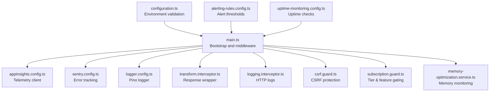

**Diagram sources**
- [main.ts:28-329](file://apps/api/src/main.ts#L28-L329)
- [appinsights.config.ts:65-117](file://apps/api/src/config/appinsights.config.ts#L65-L117)
- [sentry.config.ts:51-127](file://apps/api/src/config/sentry.config.ts#L51-L127)
- [logger.config.ts:9-61](file://apps/api/src/config/logger.config.ts#L9-L61)
- [transform.interceptor.ts:14-31](file://apps/api/src/common/interceptors/transform.interceptor.ts#L14-L31)
- [logging.interceptor.ts:11-55](file://apps/api/src/common/interceptors/logging.interceptor.ts#L11-L55)
- [csrf.guard.ts:48-148](file://apps/api/src/common/guards/csrf.guard.ts#L48-L148)
- [subscription.guard.ts:58-94](file://apps/api/src/common/guards/subscription.guard.ts#L58-L94)
- [memory-optimization.service.ts:12-36](file://apps/api/src/common/services/memory-optimization.service.ts#L12-L36)
- [configuration.ts:87-114](file://apps/api/src/config/configuration.ts#L87-L114)
- [alerting-rules.config.ts:61-80](file://apps/api/src/config/alerting-rules.config.ts#L61-L80)
- [uptime-monitoring.config.ts:12-31](file://apps/api/src/config/uptime-monitoring.config.ts#L12-L31)

**Section sources**
- [main.ts:28-329](file://apps/api/src/main.ts#L28-L329)
- [app.module.ts:53-129](file://apps/api/src/app.module.ts#L53-L129)
- [configuration.ts:1-115](file://apps/api/src/config/configuration.ts#L1-L115)

## Core Components
- Application Insights telemetry client for APM, custom metrics, events, exceptions, and dependencies.
- Sentry for error tracking, performance monitoring, and alerting.
- Pino-based structured logging with correlation IDs and redaction.
- Global interceptors for standardized response wrapping and HTTP request logging.
- CSRF guard implementing the double-submit cookie pattern.
- Subscription guard enforcing tier-based and feature-based access control.
- Memory optimization service for periodic GC hints, memory monitoring, and request caching.
- Alerting rules and uptime monitoring configurations for dashboards and incident response.

**Section sources**
- [appinsights.config.ts:35-124](file://apps/api/src/config/appinsights.config.ts#L35-L124)
- [sentry.config.ts:35-127](file://apps/api/src/config/sentry.config.ts#L35-L127)
- [logger.config.ts:9-61](file://apps/api/src/config/logger.config.ts#L9-L61)
- [transform.interceptor.ts:14-31](file://apps/api/src/common/interceptors/transform.interceptor.ts#L14-L31)
- [logging.interceptor.ts:11-55](file://apps/api/src/common/interceptors/logging.interceptor.ts#L11-L55)
- [csrf.guard.ts:48-148](file://apps/api/src/common/guards/csrf.guard.ts#L48-L148)
- [subscription.guard.ts:58-94](file://apps/api/src/common/guards/subscription.guard.ts#L58-L94)
- [memory-optimization.service.ts:12-36](file://apps/api/src/common/services/memory-optimization.service.ts#L12-L36)
- [alerting-rules.config.ts:61-80](file://apps/api/src/config/alerting-rules.config.ts#L61-L80)
- [uptime-monitoring.config.ts:12-31](file://apps/api/src/config/uptime-monitoring.config.ts#L12-L31)

## Architecture Overview
The monitoring architecture integrates telemetry clients, interceptors, guards, and configuration-driven alerting. Application Insights captures request telemetry and custom metrics; Sentry captures errors and performance spans; interceptors standardize logging and response format; guards enforce security and access control; configuration defines alert thresholds and uptime checks.

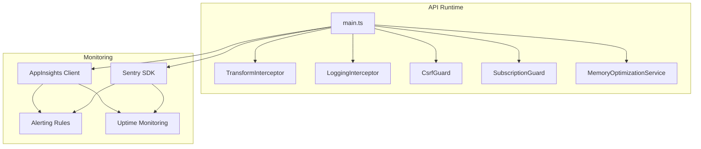

**Diagram sources**
- [main.ts:28-329](file://apps/api/src/main.ts#L28-L329)
- [transform.interceptor.ts:14-31](file://apps/api/src/common/interceptors/transform.interceptor.ts#L14-L31)
- [logging.interceptor.ts:11-55](file://apps/api/src/common/interceptors/logging.interceptor.ts#L11-L55)
- [csrf.guard.ts:48-148](file://apps/api/src/common/guards/csrf.guard.ts#L48-L148)
- [subscription.guard.ts:58-94](file://apps/api/src/common/guards/subscription.guard.ts#L58-L94)
- [memory-optimization.service.ts:12-36](file://apps/api/src/common/services/memory-optimization.service.ts#L12-L36)
- [appinsights.config.ts:65-117](file://apps/api/src/config/appinsights.config.ts#L65-L117)
- [sentry.config.ts:51-127](file://apps/api/src/config/sentry.config.ts#L51-L127)
- [alerting-rules.config.ts:61-80](file://apps/api/src/config/alerting-rules.config.ts#L61-L80)
- [uptime-monitoring.config.ts:12-31](file://apps/api/src/config/uptime-monitoring.config.ts#L12-L31)

## Detailed Component Analysis

### Application Performance Monitoring (APM) with Application Insights
- Initializes the telemetry client with connection string or instrumentation key, sets cloud role and instance, and enables auto-collection features.
- Provides helpers to track custom metrics, events, exceptions, dependencies, and availability.
- Creates a request tracking middleware to record endpoint usage and slow requests.

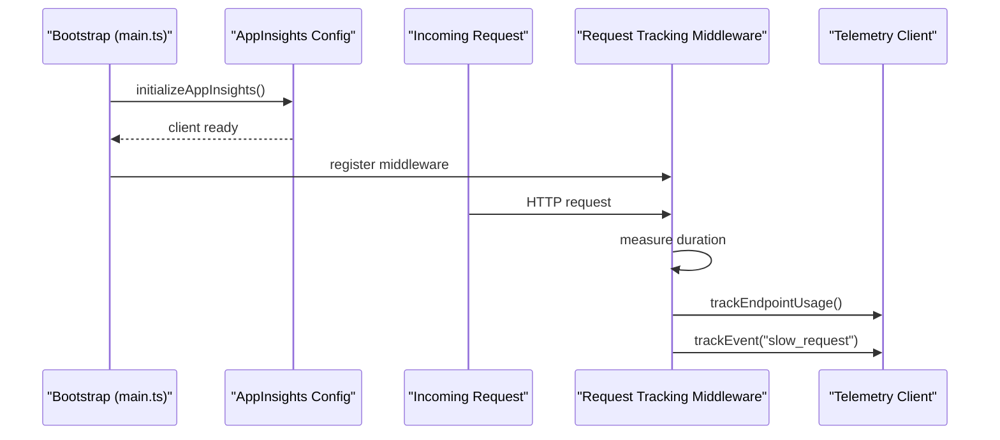

**Diagram sources**
- [main.ts:28-329](file://apps/api/src/main.ts#L28-L329)
- [appinsights.config.ts:65-117](file://apps/api/src/config/appinsights.config.ts#L65-L117)
- [appinsights.config.ts:576-609](file://apps/api/src/config/appinsights.config.ts#L576-L609)

**Section sources**
- [appinsights.config.ts:35-124](file://apps/api/src/config/appinsights.config.ts#L35-L124)
- [appinsights.config.ts:576-609](file://apps/api/src/config/appinsights.config.ts#L576-L609)

### Error Tracking with Sentry
- Initializes Sentry with DSN, environment, release, tracing, and optional profiling integration.
- Provides helpers to capture exceptions, messages, set user context, add breadcrumbs, and start transactions.
- Includes alerting rules configuration for error rates and response times.

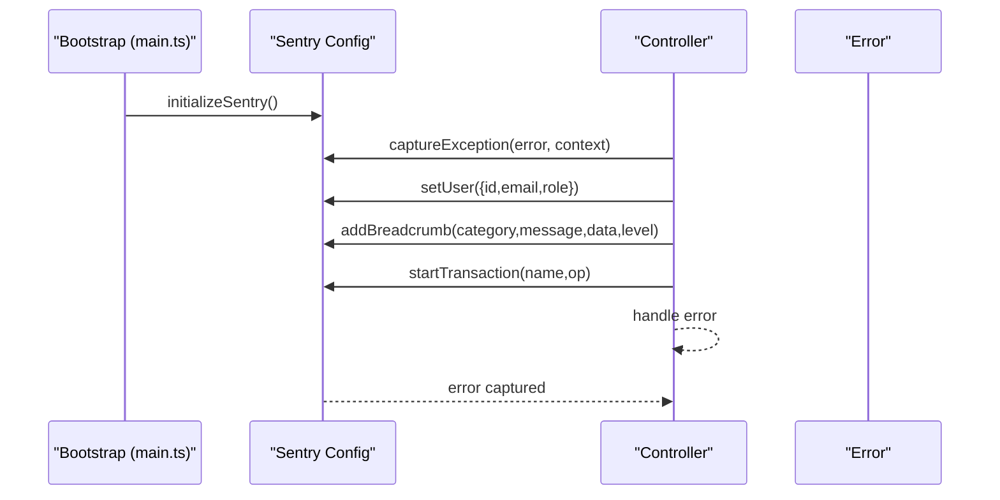

**Diagram sources**
- [main.ts:28-329](file://apps/api/src/main.ts#L28-L329)
- [sentry.config.ts:51-127](file://apps/api/src/config/sentry.config.ts#L51-L127)

**Section sources**
- [sentry.config.ts:35-127](file://apps/api/src/config/sentry.config.ts#L35-L127)
- [alerting-rules.config.ts:85-149](file://apps/api/src/config/alerting-rules.config.ts#L85-L149)

### Logging Strategy with Pino
- Builds logger configuration with correlation IDs, redaction of sensitive headers, and structured output.
- Uses X-Request-Id header for correlation; generates new IDs if absent.
- Supports pretty printing in development and JSON in production.

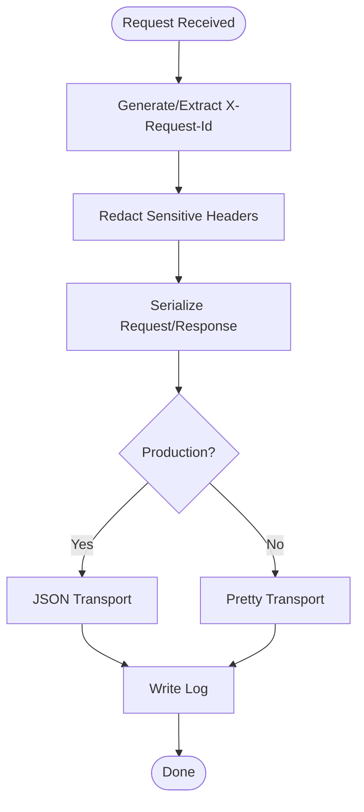

**Diagram sources**
- [logger.config.ts:9-61](file://apps/api/src/config/logger.config.ts#L9-L61)

**Section sources**
- [logger.config.ts:9-61](file://apps/api/src/config/logger.config.ts#L9-L61)

### Interceptor Implementations
- TransformInterceptor wraps responses with a standardized envelope containing success, data, and metadata including timestamp and request ID.
- LoggingInterceptor logs request method, URL, status code, duration, IP, user agent, and request ID; handles both success and error cases.

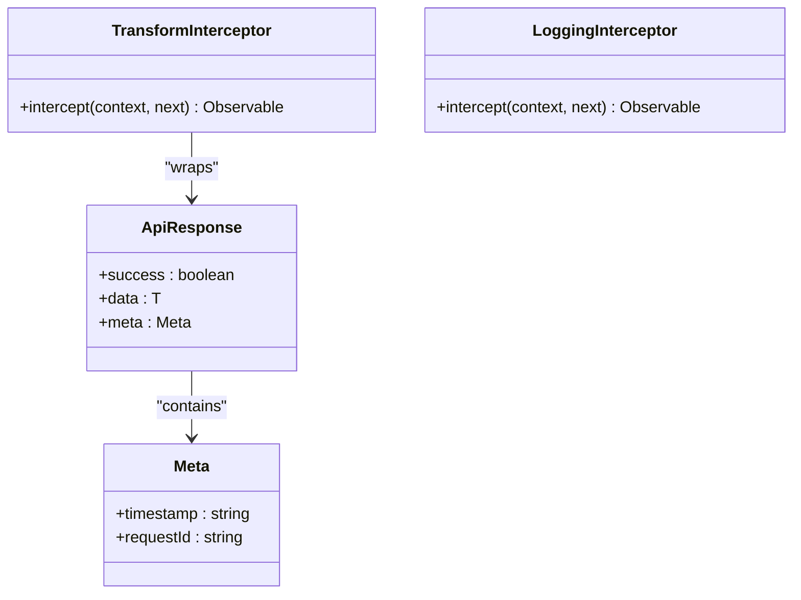

**Diagram sources**
- [transform.interceptor.ts:5-31](file://apps/api/src/common/interceptors/transform.interceptor.ts#L5-L31)
- [logging.interceptor.ts:11-55](file://apps/api/src/common/interceptors/logging.interceptor.ts#L11-L55)

**Section sources**
- [transform.interceptor.ts:14-31](file://apps/api/src/common/interceptors/transform.interceptor.ts#L14-L31)
- [logging.interceptor.ts:11-55](file://apps/api/src/common/interceptors/logging.interceptor.ts#L11-L55)

### CSRF Protection Mechanisms
- Implements double-submit cookie pattern: server sets a CSRF token cookie; client sends matching token in X-CSRF-Token header.
- Validates presence and equality of tokens using constant-time comparison; supports skipping for specific routes and safe methods.
- Generates CSRF tokens with HMAC integrity verification.

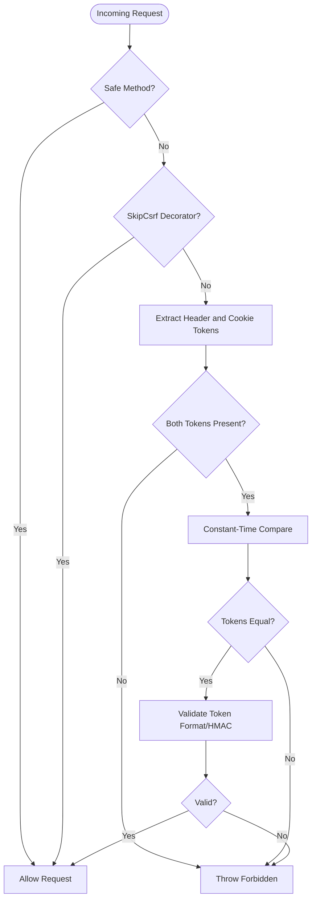

**Diagram sources**
- [csrf.guard.ts:66-148](file://apps/api/src/common/guards/csrf.guard.ts#L66-L148)

**Section sources**
- [csrf.guard.ts:13-30](file://apps/api/src/common/guards/csrf.guard.ts#L13-L30)
- [csrf.guard.ts:48-148](file://apps/api/src/common/guards/csrf.guard.ts#L48-L148)

### Subscription-Based Access Control
- Enforces tier-based access using RequireTier decorator and SubscriptionGuard.
- Enforces feature-based access using RequireFeature decorator and SubscriptionGuard with usage computation.
- FeatureUsageMiddleware attaches subscription info to requests and exposes usage headers.

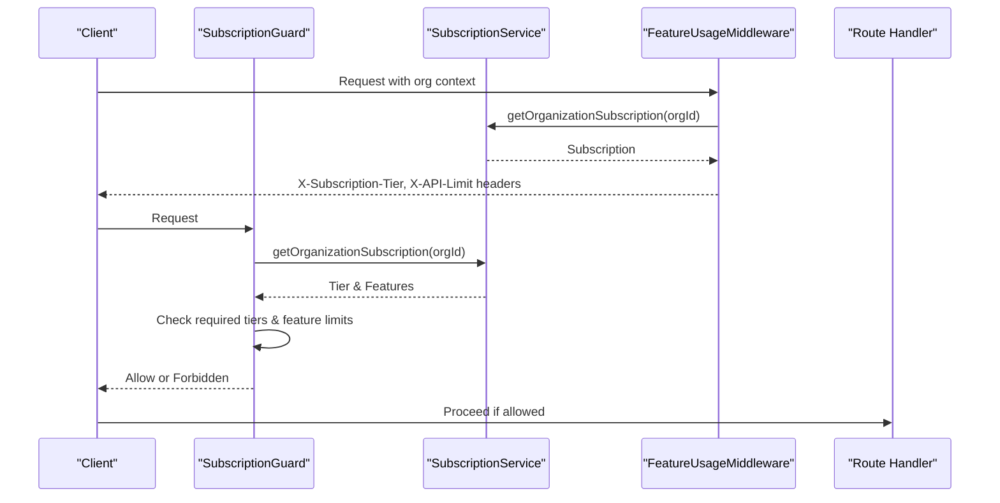

**Diagram sources**
- [subscription.guard.ts:58-94](file://apps/api/src/common/guards/subscription.guard.ts#L58-L94)
- [subscription.guard.ts:180-215](file://apps/api/src/common/guards/subscription.guard.ts#L180-L215)

**Section sources**
- [subscription.guard.ts:40-94](file://apps/api/src/common/guards/subscription.guard.ts#L40-L94)
- [subscription.guard.ts:180-215](file://apps/api/src/common/guards/subscription.guard.ts#L180-L215)

### Memory Optimization Techniques
- Periodic GC hints and memory usage monitoring with warning/critical thresholds.
- Request cache with WeakRef and TTL eviction.
- Health check endpoint exposing memory statistics.

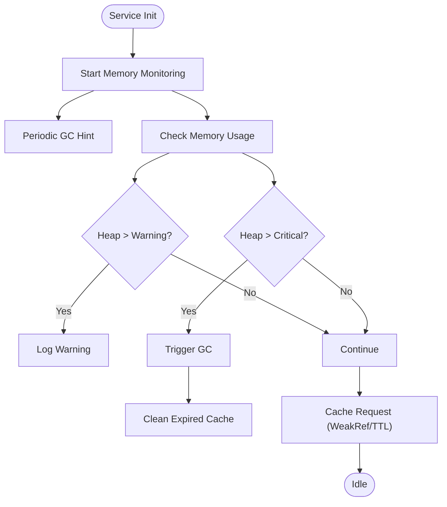

**Diagram sources**
- [memory-optimization.service.ts:28-107](file://apps/api/src/common/services/memory-optimization.service.ts#L28-L107)
- [memory-optimization.service.ts:154-211](file://apps/api/src/common/services/memory-optimization.service.ts#L154-L211)

**Section sources**
- [memory-optimization.service.ts:12-36](file://apps/api/src/common/services/memory-optimization.service.ts#L12-L36)
- [memory-optimization.service.ts:68-107](file://apps/api/src/common/services/memory-optimization.service.ts#L68-L107)
- [memory-optimization.service.ts:154-211](file://apps/api/src/common/services/memory-optimization.service.ts#L154-L211)

### Database Query Optimization and Caching Strategies
- Application Insights tracks database query performance via dependency tracking.
- Redis module is integrated at the application level for caching; configure via environment variables.
- Memory optimization service provides request-level caching with TTL and WeakRefs.

Recommendations:
- Use Application Insights dependency tracking to identify slow queries and optimize with indexes and query plans.
- Apply Redis caching for read-heavy endpoints and expensive computations; ensure cache invalidation on mutations.
- Monitor memory usage and trigger GC hints periodically to prevent memory pressure.

**Section sources**
- [appinsights.config.ts:417-432](file://apps/api/src/config/appinsights.config.ts#L417-L432)
- [app.module.ts:88-91](file://apps/api/src/app.module.ts#L88-L91)
- [memory-optimization.service.ts:154-211](file://apps/api/src/common/services/memory-optimization.service.ts#L154-L211)

### Monitoring Dashboards, Alerting Rules, and Incident Response
- Alerting rules define thresholds for error rates, response times, performance, security, business, and resource metrics.
- Uptime monitoring configuration defines SLA targets, health endpoints, and escalation policies.
- Incident response severity levels and auto-incident creation rules are defined.

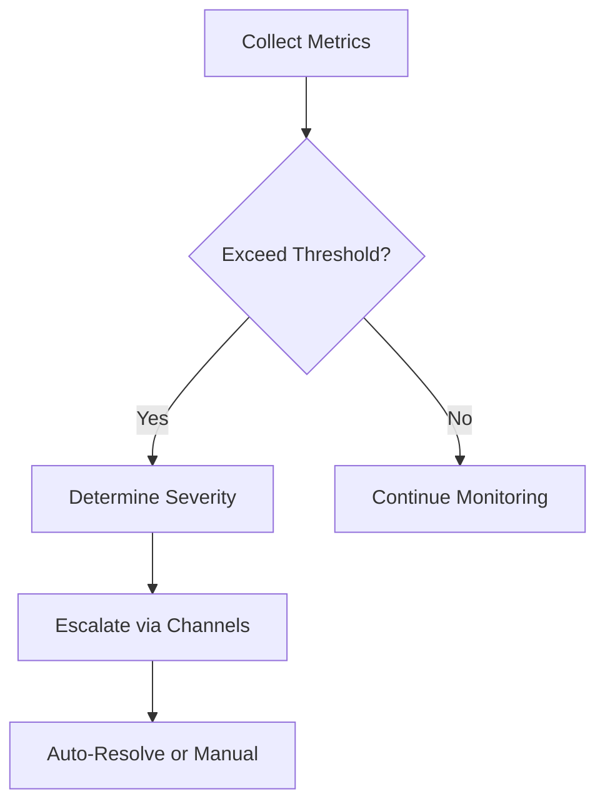

**Diagram sources**
- [alerting-rules.config.ts:61-80](file://apps/api/src/config/alerting-rules.config.ts#L61-L80)
- [uptime-monitoring.config.ts:216-268](file://apps/api/src/config/uptime-monitoring.config.ts#L216-L268)

**Section sources**
- [alerting-rules.config.ts:85-149](file://apps/api/src/config/alerting-rules.config.ts#L85-L149)
- [alerting-rules.config.ts:154-226](file://apps/api/src/config/alerting-rules.config.ts#L154-L226)
- [alerting-rules.config.ts:231-308](file://apps/api/src/config/alerting-rules.config.ts#L231-L308)
- [alerting-rules.config.ts:313-378](file://apps/api/src/config/alerting-rules.config.ts#L313-L378)
- [uptime-monitoring.config.ts:12-31](file://apps/api/src/config/uptime-monitoring.config.ts#L12-L31)
- [uptime-monitoring.config.ts:155-210](file://apps/api/src/config/uptime-monitoring.config.ts#L155-L210)
- [uptime-monitoring.config.ts:216-268](file://apps/api/src/config/uptime-monitoring.config.ts#L216-L268)

### Performance Testing Methodologies and Load Testing Configurations
- k6 load tests simulate realistic traffic patterns across health checks, authentication, questionnaire operations, sessions, scoring engine, and document generation.
- Scenarios include smoke, load, stress, and spike tests with thresholds for response time and error rate.

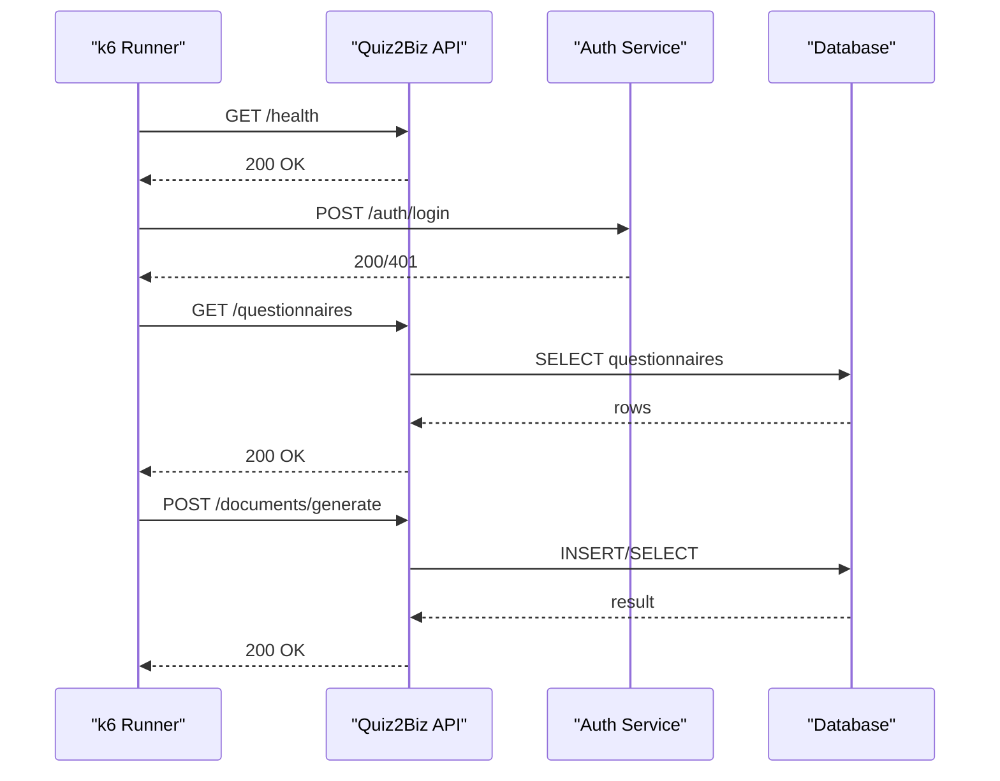

**Diagram sources**
- [api-load.k6.js:106-238](file://test/performance/api-load.k6.js#L106-L238)

**Section sources**
- [api-load.k6.js:29-97](file://test/performance/api-load.k6.js#L29-L97)
- [api-load.k6.js:119-238](file://test/performance/api-load.k6.js#L119-L238)

### Benchmarking Procedures
- Use k6 thresholds to validate performance targets (p95 response time, error rate).
- Export results to JSON and summarize outcomes for regression tracking.
- Integrate with CI to run benchmarks on pull requests and merges.

**Section sources**
- [api-load.k6.js:95-97](file://test/performance/api-load.k6.js#L95-L97)
- [api-load.k6.js:248-303](file://test/performance/api-load.k6.js#L248-L303)

## Dependency Analysis
The application registers global guards and interceptors, enabling cross-cutting concerns for security, access control, and observability.

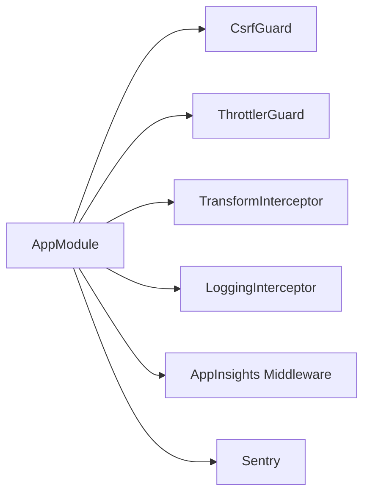

**Diagram sources**
- [app.module.ts:118-127](file://apps/api/src/app.module.ts#L118-L127)
- [main.ts:208-213](file://apps/api/src/main.ts#L208-L213)

**Section sources**
- [app.module.ts:53-129](file://apps/api/src/app.module.ts#L53-L129)
- [main.ts:28-329](file://apps/api/src/main.ts#L28-L329)

## Performance Considerations
- Compression middleware excludes streaming endpoints to preserve performance for SSE and AI gateway streams.
- Helmet and CSP headers enhance security posture; strict transport security is enabled in production.
- CORS configuration restricts origins and credentials appropriately for production.
- Validation pipe enforces input sanitization and transformation.
- Global throttling protects the API from abuse.

**Section sources**
- [main.ts:43-67](file://apps/api/src/main.ts#L43-L67)
- [main.ts:69-123](file://apps/api/src/main.ts#L69-L123)
- [main.ts:176-192](file://apps/api/src/main.ts#L176-L192)
- [main.ts:196-206](file://apps/api/src/main.ts#L196-L206)
- [app.module.ts:68-85](file://apps/api/src/app.module.ts#L68-L85)

## Troubleshooting Guide
- Bootstrap errors are captured by Sentry and logged during startup.
- Application Insights flushes telemetry on SIGTERM/SIGINT for graceful shutdown.
- Environment validation fails fast in production for missing secrets and weak JWT secrets.
- Use correlation IDs from X-Request-Id to trace requests across services.

**Section sources**
- [main.ts:319-329](file://apps/api/src/main.ts#L319-L329)
- [main.ts:304-312](file://apps/api/src/main.ts#L304-L312)
- [configuration.ts:5-43](file://apps/api/src/config/configuration.ts#L5-L43)

## Conclusion
Quiz-to-Build employs a robust monitoring stack combining Application Insights and Sentry for APM and error tracking, structured logging with correlation IDs, global interceptors for consistent response formatting and logging, CSRF protection via double-submit cookies, and subscription-based access control. The system includes comprehensive alerting rules, uptime monitoring, and performance testing with k6. Memory optimization, database dependency tracking, and caching strategies further enhance reliability and performance.

## Appendices
- Environment validation ensures production readiness for secrets and CORS.
- Uptime monitoring defines SLA targets and escalation policies.
- Alerting rules categorize metrics by error, performance, security, business, and resource domains.

**Section sources**
- [configuration.ts:87-114](file://apps/api/src/config/configuration.ts#L87-L114)
- [uptime-monitoring.config.ts:12-31](file://apps/api/src/config/uptime-monitoring.config.ts#L12-L31)
- [alerting-rules.config.ts:61-80](file://apps/api/src/config/alerting-rules.config.ts#L61-L80)