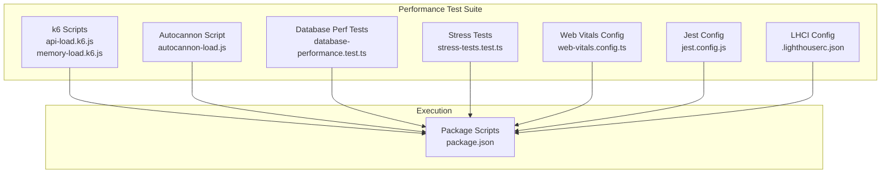
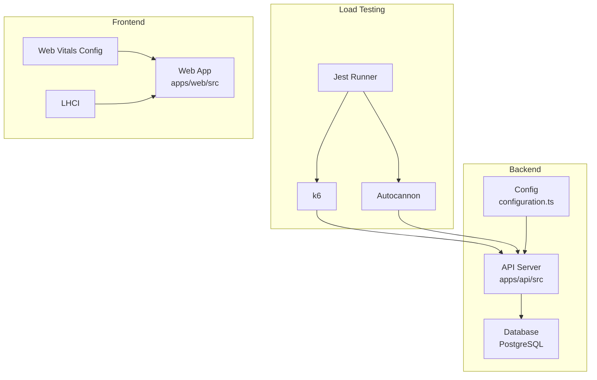
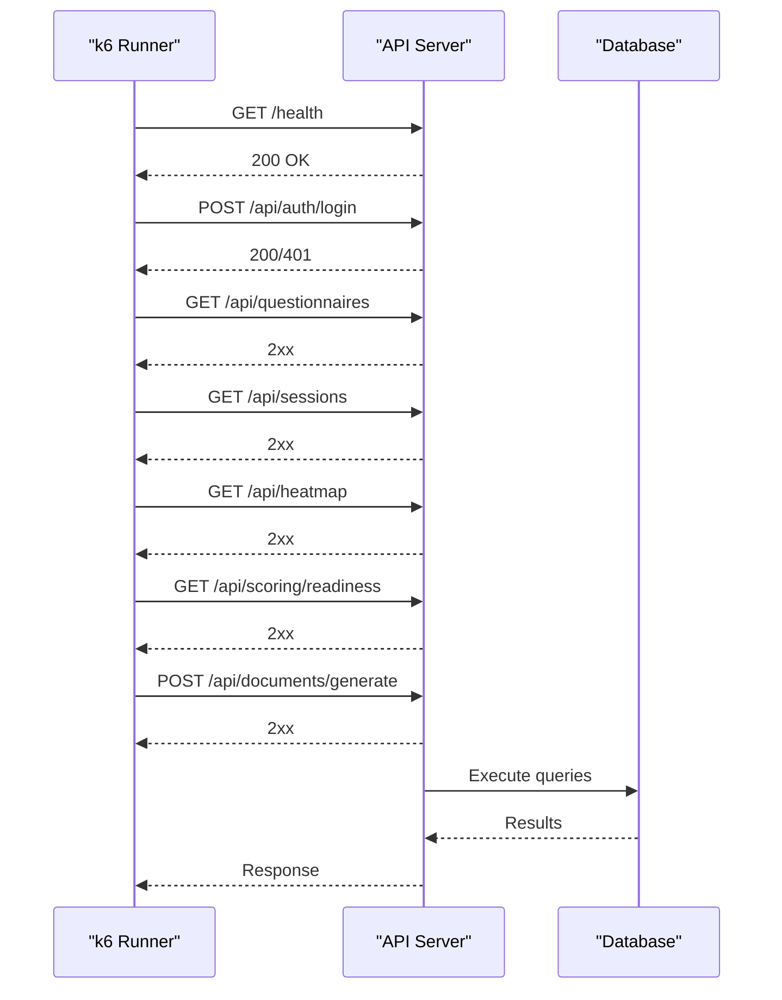
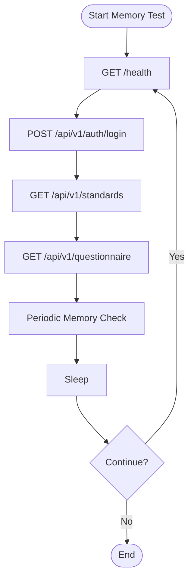
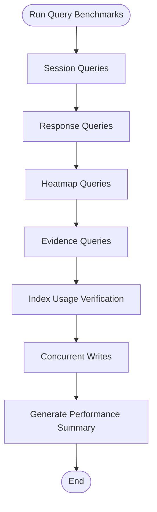
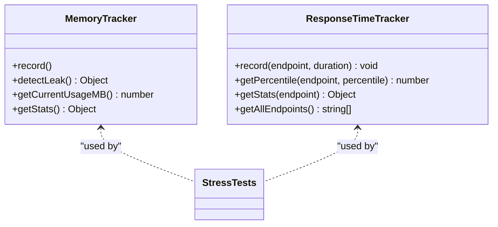
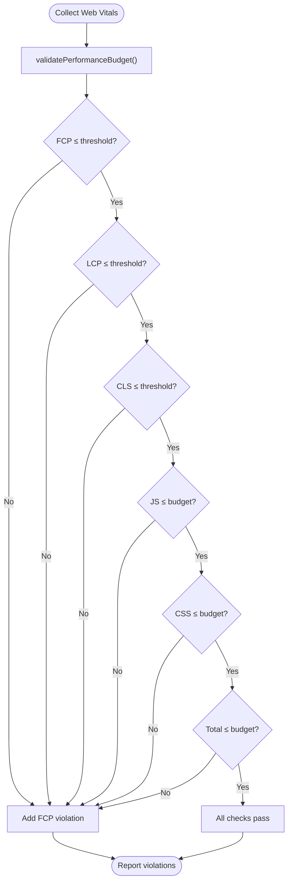
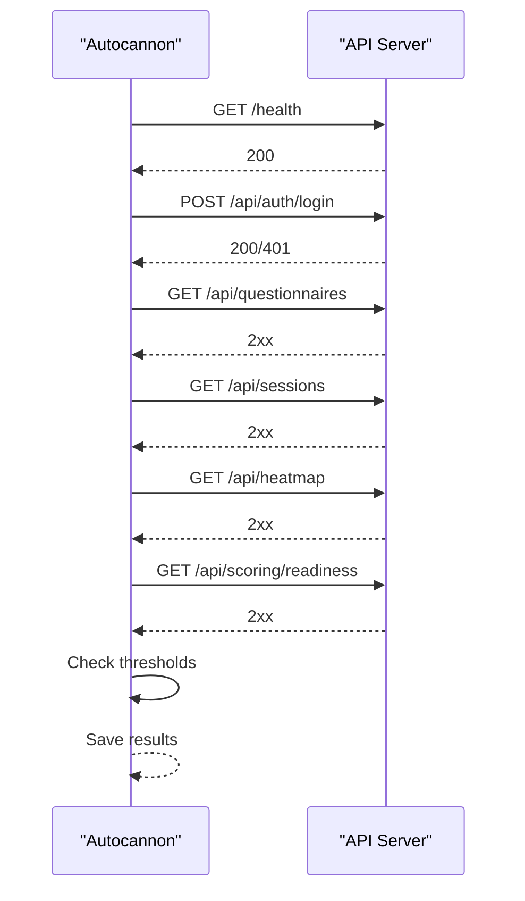
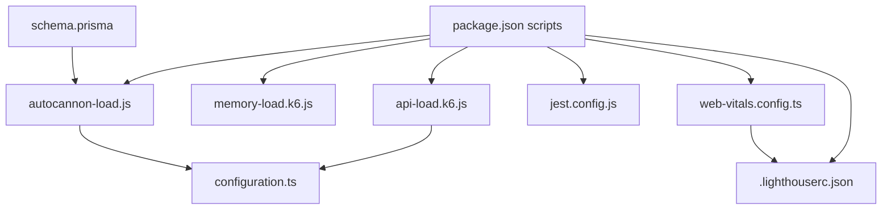

# Performance Testing

<cite>
**Referenced Files in This Document**
- [api-load.k6.js](file://test/performance/api-load.k6.js)
- [memory-load.k6.js](file://test/performance/memory-load.k6.js)
- [web-vitals.config.ts](file://test/performance/web-vitals.config.ts)
- [database-performance.test.ts](file://test/performance/database-performance.test.ts)
- [stress-tests.test.ts](file://test/performance/stress-tests.test.ts)
- [autocannon-load.js](file://test/performance/autocannon-load.js)
- [jest.config.js](file://test/performance/jest.config.js)
- [.lighthouserc.json](file://.lighthouserc.json)
- [package.json](file://package.json)
- [schema.prisma](file://prisma/schema.prisma)
- [configuration.ts](file://apps/api/src/config/configuration.ts)
- [analytics.config.ts](file://apps/web/src/config/analytics.config.ts)
</cite>

## Table of Contents
1. [Introduction](#introduction)
2. [Project Structure](#project-structure)
3. [Core Components](#core-components)
4. [Architecture Overview](#architecture-overview)
5. [Detailed Component Analysis](#detailed-component-analysis)
6. [Dependency Analysis](#dependency-analysis)
7. [Performance Considerations](#performance-considerations)
8. [Troubleshooting Guide](#troubleshooting-guide)
9. [Conclusion](#conclusion)
10. [Appendices](#appendices)

## Introduction
This document provides comprehensive performance testing guidance for Quiz-to-Build, covering API load testing, memory usage validation, database performance evaluation, stress and concurrency testing, and frontend Web Vitals monitoring. It includes methodologies, automation strategies, continuous monitoring, bottleneck identification, profiling integration, and optimization recommendations tailored to the system’s architecture and existing test suites.

## Project Structure
The performance testing suite is organized under the repository’s test/performance directory and integrates with Node-based tools and k6 for load testing. The suite includes:
- API load tests using k6 and Autocannon
- Memory load tests with k6
- Database performance benchmarks and N+1 detection
- Stress tests with leak detection and response time tracking
- Frontend Web Vitals configuration and LHCI integration
- Jest configuration for performance test execution

**Diagram sources**
- [api-load.k6.js:1-303](file://test/performance/api-load.k6.js#L1-L303)
- [memory-load.k6.js:1-174](file://test/performance/memory-load.k6.js#L1-L174)
- [autocannon-load.js:1-337](file://test/performance/autocannon-load.js#L1-L337)
- [database-performance.test.ts:1-391](file://test/performance/database-performance.test.ts#L1-L391)
- [stress-tests.test.ts:1-525](file://test/performance/stress-tests.test.ts#L1-L525)
- [web-vitals.config.ts:1-132](file://test/performance/web-vitals.config.ts#L1-L132)
- [jest.config.js:1-27](file://test/performance/jest.config.js#L1-L27)
- [.lighthouserc.json:1-97](file://.lighthouserc.json#L1-L97)
- [package.json:15-66](file://package.json#L15-L66)

**Section sources**
- [package.json:15-66](file://package.json#L15-L66)
- [jest.config.js:1-27](file://test/performance/jest.config.js#L1-L27)

## Core Components
- API load testing with k6: multi-scenario load, stress, and spike tests with custom metrics and thresholds.
- Memory load testing with k6: sustained load to monitor memory usage and detect leaks.
- Database performance tests: N+1 detection, query performance thresholds, index usage verification, and connection pool checks.
- Stress tests: memory leak detection, response time distribution, and database query profiling.
- Web Vitals configuration: performance budgets and validators for Core Web Vitals and resource budgets.
- Lighthouse CI integration: automated frontend performance auditing with assertions.

**Section sources**
- [api-load.k6.js:1-303](file://test/performance/api-load.k6.js#L1-L303)
- [memory-load.k6.js:1-174](file://test/performance/memory-load.k6.js#L1-L174)
- [database-performance.test.ts:1-391](file://test/performance/database-performance.test.ts#L1-L391)
- [stress-tests.test.ts:1-525](file://test/performance/stress-tests.test.ts#L1-L525)
- [web-vitals.config.ts:1-132](file://test/performance/web-vitals.config.ts#L1-L132)
- [.lighthouserc.json:1-97](file://.lighthouserc.json#L1-L97)

## Architecture Overview
The performance testing architecture spans backend API load testing, frontend Web Vitals monitoring, and database performance validation. Execution is orchestrated via package scripts and Jest configuration.

**Diagram sources**
- [configuration.ts:1-115](file://apps/api/src/config/configuration.ts#L1-L115)
- [api-load.k6.js:1-303](file://test/performance/api-load.k6.js#L1-L303)
- [autocannon-load.js:1-337](file://test/performance/autocannon-load.js#L1-L337)
- [web-vitals.config.ts:1-132](file://test/performance/web-vitals.config.ts#L1-L132)
- [.lighthouserc.json:1-97](file://.lighthouserc.json#L1-L97)

## Detailed Component Analysis

### API Load Testing with k6
- Scenarios: smoke, load, stress, and spike tests with configurable concurrency and ramping.
- Metrics: response time trends, error rates, and custom metrics.
- Thresholds: p95/p99 response times, average response time, and error rate targets.
- Endpoints covered: health checks, authentication, questionnaire operations, sessions, scoring engine, and document generation.

**Diagram sources**
- [api-load.k6.js:119-238](file://test/performance/api-load.k6.js#L119-L238)

**Section sources**
- [api-load.k6.js:1-303](file://test/performance/api-load.k6.js#L1-L303)

### Memory Load Testing with k6
- Sustained load scenario to evaluate memory stability.
- Metrics: memory usage in MB and percentage, response times, and error rates.
- Threshold: memory usage under 70% during sustained load.

**Diagram sources**
- [memory-load.k6.js:65-109](file://test/performance/memory-load.k6.js#L65-L109)

**Section sources**
- [memory-load.k6.js:1-174](file://test/performance/memory-load.k6.js#L1-L174)

### Database Performance Evaluation
- N+1 query detection across sessions, responses, heatmaps, and evidence.
- Query performance thresholds for single reads/writes, list operations, aggregates, and joins.
- Index usage verification and connection pool configuration checks.
- Concurrent write performance benchmarks.

**Diagram sources**
- [database-performance.test.ts:126-335](file://test/performance/database-performance.test.ts#L126-L335)

**Section sources**
- [database-performance.test.ts:1-391](file://test/performance/database-performance.test.ts#L1-L391)
- [schema.prisma:1-800](file://prisma/schema.prisma#L1-L800)

### Stress Testing and Concurrency
- Gradual load increase to identify breaking points.
- Memory leak detection using growth rate analysis.
- Response time percentile tracking and database query profiling.
- Recommendations for horizontal scaling, caching, and refactoring N+1 patterns.

**Diagram sources**
- [stress-tests.test.ts:33-150](file://test/performance/stress-tests.test.ts#L33-L150)

**Section sources**
- [stress-tests.test.ts:1-525](file://test/performance/stress-tests.test.ts#L1-L525)

### Web Vitals Configuration and Monitoring
- Performance budgets for Core Web Vitals (FCP, LCP, TTI, CLS, FID, TBT) and resource budgets.
- Per-page budgets for key routes.
- Validator to compare measured metrics against targets and report violations.

**Diagram sources**
- [web-vitals.config.ts:84-132](file://test/performance/web-vitals.config.ts#L84-L132)

**Section sources**
- [web-vitals.config.ts:1-132](file://test/performance/web-vitals.config.ts#L1-L132)
- [.lighthouserc.json:1-97](file://.lighthouserc.json#L1-L97)

### API Load Testing with Autocannon
- Node.js-based load testing script with configurable duration, connections, and pipelining.
- Scenario definitions for health checks, authentication, and key endpoints.
- Threshold checks for error rate, RPS, and latency percentiles.

**Diagram sources**
- [autocannon-load.js:95-170](file://test/performance/autocannon-load.js#L95-L170)

**Section sources**
- [autocannon-load.js:1-337](file://test/performance/autocannon-load.js#L1-L337)

## Dependency Analysis
- Test orchestration: package.json scripts invoke k6, Autocannon, Jest, and LHCI.
- Environment configuration: API configuration validates production settings and provides runtime configuration.
- Database schema: Prisma schema defines entities and indexes used in performance tests.

**Diagram sources**
- [package.json:15-66](file://package.json#L15-L66)
- [api-load.k6.js:24-97](file://test/performance/api-load.k6.js#L24-L97)
- [memory-load.k6.js:20-38](file://test/performance/memory-load.k6.js#L20-L38)
- [autocannon-load.js:13-17](file://test/performance/autocannon-load.js#L13-L17)
- [jest.config.js:1-27](file://test/performance/jest.config.js#L1-L27)
- [web-vitals.config.ts:1-132](file://test/performance/web-vitals.config.ts#L1-L132)
- [.lighthouserc.json:1-97](file://.lighthouserc.json#L1-L97)
- [configuration.ts:1-115](file://apps/api/src/config/configuration.ts#L1-L115)
- [schema.prisma:1-800](file://prisma/schema.prisma#L1-L800)

**Section sources**
- [package.json:15-66](file://package.json#L15-L66)
- [configuration.ts:1-115](file://apps/api/src/config/configuration.ts#L1-L115)
- [schema.prisma:1-800](file://prisma/schema.prisma#L1-L800)

## Performance Considerations
- API load testing: Use k6 for advanced metrics and thresholds; complement with Autocannon for simpler Node.js-based tests.
- Memory stability: Monitor memory usage under sustained load; enforce thresholds to prevent leaks.
- Database performance: Apply index usage verification, detect N+1 queries, and benchmark query performance at scale.
- Frontend performance: Enforce Web Vitals budgets and use LHCI for automated audits.
- Configuration: Validate production environment variables and secrets to avoid runtime performance issues.

[No sources needed since this section provides general guidance]

## Troubleshooting Guide
- k6 test failures: Review scenario thresholds and adjust concurrency or ramping schedules.
- Memory leaks: Use memory trackers to calculate growth rates and investigate allocation patterns.
- Database bottlenecks: Analyze query plans, ensure indexes exist, and refactor N+1 patterns.
- Lighthouse regressions: Validate budgets and per-route thresholds; adjust asset sizes and rendering strategies.

**Section sources**
- [stress-tests.test.ts:279-325](file://test/performance/stress-tests.test.ts#L279-L325)
- [database-performance.test.ts:256-287](file://test/performance/database-performance.test.ts#L256-L287)
- [.lighthouserc.json:31-94](file://.lighthouserc.json#L31-L94)

## Conclusion
The Quiz-to-Build performance testing framework combines k6, Autocannon, Jest, and LHCI to comprehensively evaluate API, memory, database, and frontend performance. By enforcing thresholds, detecting bottlenecks, and automating continuous monitoring, teams can maintain high performance and reliability across environments.

[No sources needed since this section summarizes without analyzing specific files]

## Appendices

### Performance Baselines and Acceptable Thresholds
- API response time
  - p95: < 500 ms
  - p99: < 1000 ms
  - average: < 200 ms
  - error rate: < 1%
- Memory usage under sustained load
  - memory usage percent: < 70%
- Web Vitals
  - FCP: < 1800 ms
  - LCP: < 2500 ms
  - TTI: < 3800 ms
  - CLS: < 0.1
  - FID: < 100 ms
  - TBT: < 200 ms
- Resource budgets
  - JS: < 300 KB
  - CSS: < 50 KB
  - Images: < 1 MB
  - Fonts: < 100 KB
  - Total: < 2 MB

**Section sources**
- [api-load.k6.js:85-96](file://test/performance/api-load.k6.js#L85-L96)
- [memory-load.k6.js:33-37](file://test/performance/memory-load.k6.js#L33-L37)
- [web-vitals.config.ts:26-52](file://test/performance/web-vitals.config.ts#L26-L52)

### Test Case Examples
- k6 smoke/load/stress/spike scenarios
- Memory load sustained test
- Database N+1 detection and index usage verification
- Stress test with memory leak detection and response time percentiles
- Lighthouse CI runs with assertions

**Section sources**
- [api-load.k6.js:29-84](file://test/performance/api-load.k6.js#L29-L84)
- [memory-load.k6.js:23-32](file://test/performance/memory-load.k6.js#L23-L32)
- [database-performance.test.ts:126-147](file://test/performance/database-performance.test.ts#L126-L147)
- [stress-tests.test.ts:182-277](file://test/performance/stress-tests.test.ts#L182-L277)
- [.lighthouserc.json:2-96](file://.lighthouserc.json#L2-L96)

### Performance Test Automation and Continuous Monitoring
- Package scripts for running load tests and Lighthouse
- Jest configuration for performance test execution
- LHCI configuration for automated frontend audits

**Section sources**
- [package.json:41-44](file://package.json#L41-L44)
- [jest.config.js:1-27](file://test/performance/jest.config.js#L1-L27)
- [.lighthouserc.json:1-97](file://.lighthouserc.json#L1-L97)

### Bottleneck Identification and Optimization Strategies
- Use k6 custom metrics and thresholds to identify slow endpoints
- Apply Autocannon to validate RPS and latency targets
- Leverage stress tests to detect memory leaks and response time degradation
- Optimize database queries with index usage verification and N+1 pattern elimination
- Enforce Web Vitals budgets to maintain frontend responsiveness

**Section sources**
- [api-load.k6.js:17-22](file://test/performance/api-load.k6.js#L17-L22)
- [autocannon-load.js:175-212](file://test/performance/autocannon-load.js#L175-L212)
- [stress-tests.test.ts:327-443](file://test/performance/stress-tests.test.ts#L327-L443)
- [database-performance.test.ts:206-248](file://test/performance/database-performance.test.ts#L206-L248)