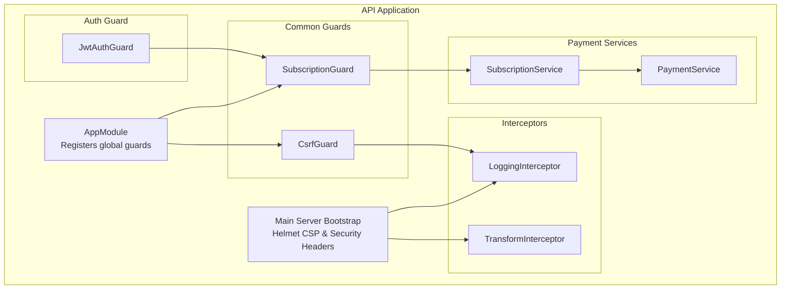
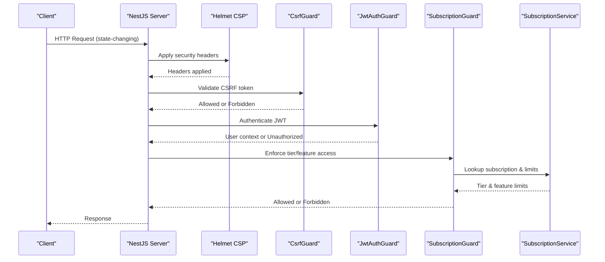
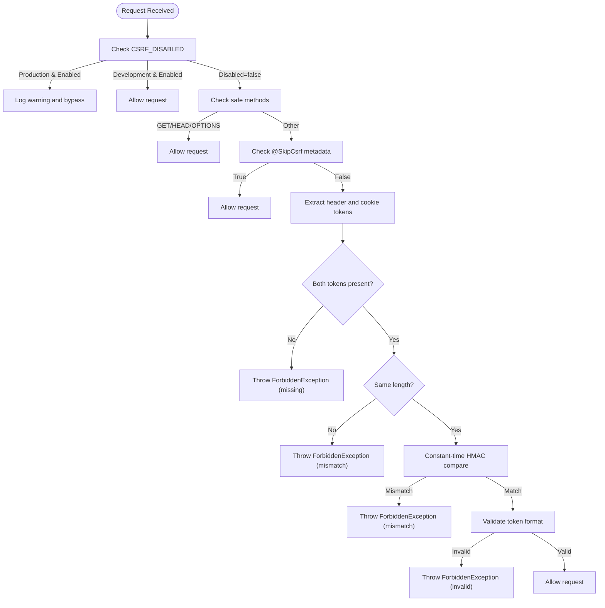
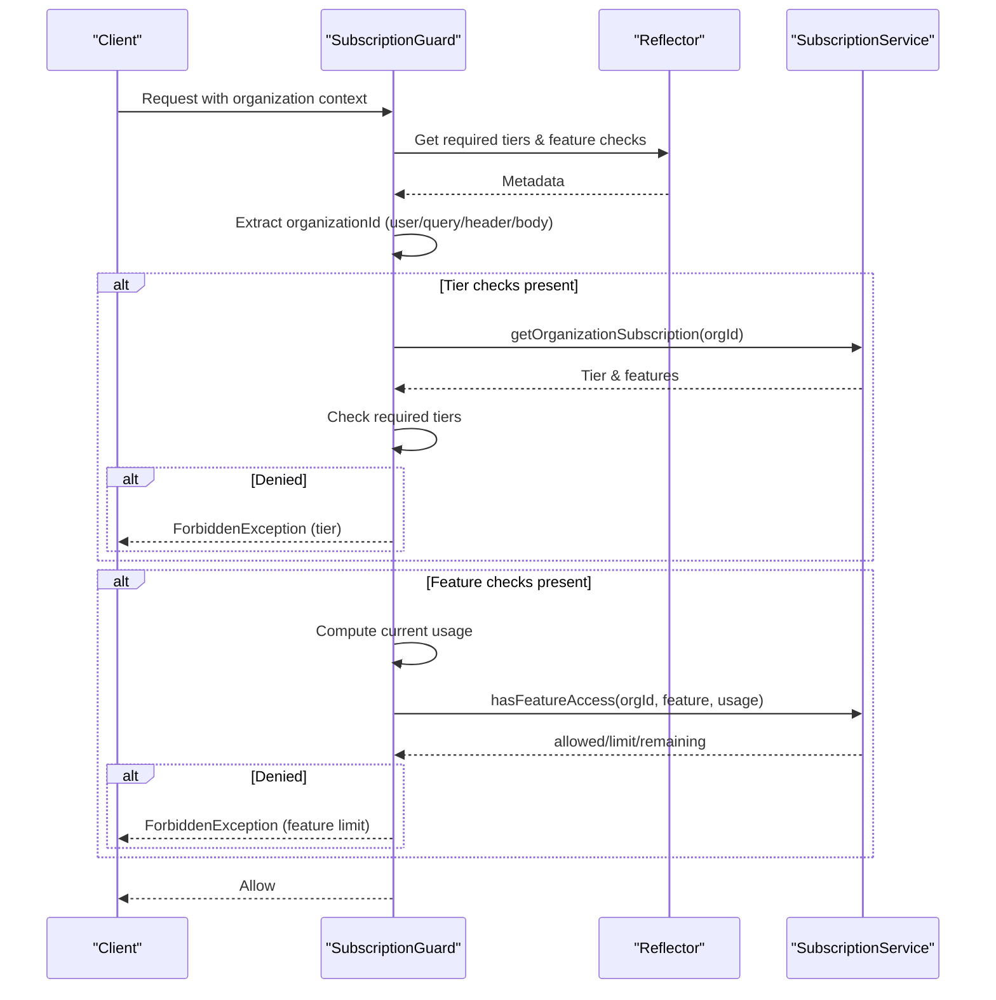
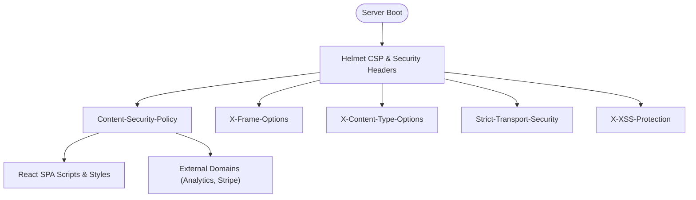
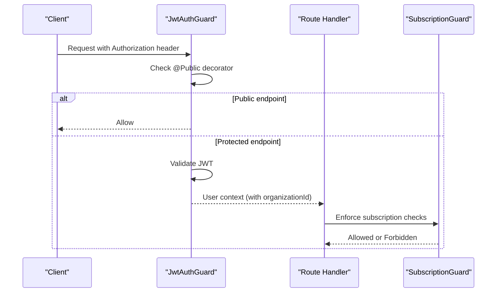
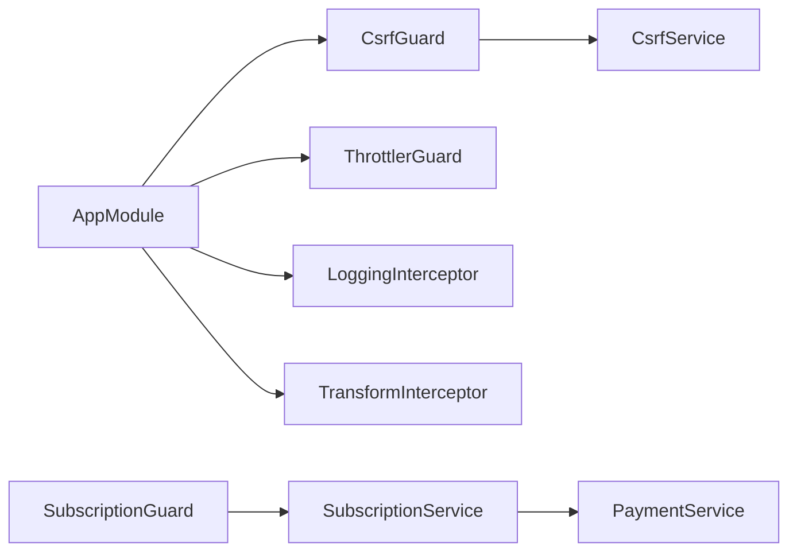

# Security Interceptors

<cite>
**Referenced Files in This Document**
- [csrf.guard.ts](file://apps/api/src/common/guards/csrf.guard.ts)
- [subscription.guard.ts](file://apps/api/src/common/guards/subscription.guard.ts)
- [subscription.service.ts](file://apps/api/src/modules/payment/subscription.service.ts)
- [payment.service.ts](file://apps/api/src/modules/payment/payment.service.ts)
- [jwt-auth.guard.ts](file://apps/api/src/modules/auth/guards/jwt-auth.guard.ts)
- [app.module.ts](file://apps/api/src/app.module.ts)
- [main.ts](file://apps/api/src/main.ts)
- [logging.interceptor.ts](file://apps/api/src/common/interceptors/logging.interceptor.ts)
- [transform.interceptor.ts](file://apps/api/src/common/interceptors/transform.interceptor.ts)
- [csrf.guard.spec.ts](file://apps/api/src/common/guards/csrf.guard.spec.ts)
- [subscription.guard.spec.ts](file://apps/api/src/common/guards/subscription.guard.spec.ts)
- [api-security.spec.ts](file://apps/api/src/common/tests/api-security.spec.ts)
- [input-validation.security.spec.ts](file://apps/api/src/common/tests/input-validation.security.spec.ts)
</cite>

## Table of Contents
1. [Introduction](#introduction)
2. [Project Structure](#project-structure)
3. [Core Components](#core-components)
4. [Architecture Overview](#architecture-overview)
5. [Detailed Component Analysis](#detailed-component-analysis)
6. [Dependency Analysis](#dependency-analysis)
7. [Performance Considerations](#performance-considerations)
8. [Troubleshooting Guide](#troubleshooting-guide)
9. [Conclusion](#conclusion)
10. [Appendices](#appendices)

## Introduction
This document provides comprehensive security interceptor documentation for Quiz-to-Build’s protection mechanisms. It focuses on:
- CSRF guard implementation: token generation, validation, and secure cookie handling
- Subscription guard functionality: premium feature access control, subscription validation, and tier-based permissions
- Security middleware patterns, request validation, and protections against common web vulnerabilities
- Configuration examples, security headers, and compliance considerations
- Bypass scenarios, testing strategies for security guards, and integration with authentication systems
- Troubleshooting guides for common security-related issues and performance impact considerations

## Project Structure
Security interceptors and guards are implemented in the API application under the common guards and interceptors folders. Guards are registered globally in the application module, while middleware and security headers are applied in the main server bootstrap.

**Diagram sources**
- [app.module.ts:118-127](file://apps/api/src/app.module.ts#L118-L127)
- [main.ts:68-101](file://apps/api/src/main.ts#L68-L101)
- [csrf.guard.ts:48-148](file://apps/api/src/common/guards/csrf.guard.ts#L48-L148)
- [subscription.guard.ts:58-174](file://apps/api/src/common/guards/subscription.guard.ts#L58-L174)
- [logging.interceptor.ts:10-55](file://apps/api/src/common/interceptors/logging.interceptor.ts#L10-L55)
- [transform.interceptor.ts:14-31](file://apps/api/src/common/interceptors/transform.interceptor.ts#L14-L31)
- [jwt-auth.guard.ts:14-63](file://apps/api/src/modules/auth/guards/jwt-auth.guard.ts#L14-L63)
- [subscription.service.ts:28-236](file://apps/api/src/modules/payment/subscription.service.ts#L28-L236)
- [payment.service.ts:56-315](file://apps/api/src/modules/payment/payment.service.ts#L56-L315)

**Section sources**
- [app.module.ts:118-127](file://apps/api/src/app.module.ts#L118-L127)
- [main.ts:68-101](file://apps/api/src/main.ts#L68-L101)

## Core Components
- CSRF Guard: Implements Double Submit Cookie pattern with token generation/validation and optional bypass decorators.
- Subscription Guard: Enforces tier-based access and feature usage limits using reflection and subscription service integration.
- Security Middleware: Helmet-based CSP and security headers applied at server bootstrap.
- Authentication Guard: JWT-based guard integrating with subscription guard via user context.
- Interceptors: Logging and response transformation for observability and standardized responses.

**Section sources**
- [csrf.guard.ts:48-148](file://apps/api/src/common/guards/csrf.guard.ts#L48-L148)
- [subscription.guard.ts:58-174](file://apps/api/src/common/guards/subscription.guard.ts#L58-L174)
- [main.ts:68-101](file://apps/api/src/main.ts#L68-L101)
- [jwt-auth.guard.ts:14-63](file://apps/api/src/modules/auth/guards/jwt-auth.guard.ts#L14-L63)
- [logging.interceptor.ts:10-55](file://apps/api/src/common/interceptors/logging.interceptor.ts#L10-L55)
- [transform.interceptor.ts:14-31](file://apps/api/src/common/interceptors/transform.interceptor.ts#L14-L31)

## Architecture Overview
The security architecture integrates global guards and middleware to protect state-changing operations and enforce subscription-based access control. Authentication precedes authorization checks, ensuring user context is available for subscription guard evaluation.

**Diagram sources**
- [main.ts:68-101](file://apps/api/src/main.ts#L68-L101)
- [csrf.guard.ts:66-148](file://apps/api/src/common/guards/csrf.guard.ts#L66-L148)
- [jwt-auth.guard.ts:22-63](file://apps/api/src/modules/auth/guards/jwt-auth.guard.ts#L22-L63)
- [subscription.guard.ts:65-174](file://apps/api/src/common/guards/subscription.guard.ts#L65-L174)
- [subscription.service.ts:37-70](file://apps/api/src/modules/payment/subscription.service.ts#L37-L70)

## Detailed Component Analysis

### CSRF Guard Implementation
The CSRF guard enforces Double Submit Cookie protection:
- Tokens are generated with timestamp, random bytes, and HMAC, then base64-encoded.
- Validation compares header and cookie values using constant-time comparison.
- Optional environment-based bypass and decorator-based route bypass are supported.
- Cookie options are configurable with SameSite strict and secure flags.

**Diagram sources**
- [csrf.guard.ts:66-148](file://apps/api/src/common/guards/csrf.guard.ts#L66-L148)
- [csrf.guard.ts:154-189](file://apps/api/src/common/guards/csrf.guard.ts#L154-L189)

Key behaviors and configuration:
- Environment variables:
  - CSRF_SECRET: Required in production; defaults otherwise.
  - CSRF_DISABLED: Allows bypass in non-production environments.
  - CSRF_TOKEN_MAX_AGE: Token validity in milliseconds.
- Cookie options:
  - HttpOnly: false (client-readable), SameSite: strict, Secure: true in production.
- Decorators:
  - SkipCsrf: Skips CSRF validation for specific routes.

Testing highlights:
- Validates safe methods, missing tokens, length mismatches, HMAC mismatches, and invalid formats.
- Ensures CSRF_DISABLED is ignored in production and respected in development.

**Section sources**
- [csrf.guard.ts:13-190](file://apps/api/src/common/guards/csrf.guard.ts#L13-L190)
- [csrf.guard.ts:196-241](file://apps/api/src/common/guards/csrf.guard.ts#L196-L241)
- [csrf.guard.spec.ts:67-279](file://apps/api/src/common/guards/csrf.guard.spec.ts#L67-L279)
- [csrf.guard.spec.ts:409-432](file://apps/api/src/common/guards/csrf.guard.spec.ts#L409-L432)
- [csrf.guard.spec.ts:434-497](file://apps/api/src/common/guards/csrf.guard.spec.ts#L434-L497)

### Subscription Guard and Feature Access Control
The subscription guard enforces:
- Organization context extraction from JWT user, query, header, or body.
- Tier-based access checks against required tiers.
- Feature-based access checks with usage calculation and limits.

**Diagram sources**
- [subscription.guard.ts:65-174](file://apps/api/src/common/guards/subscription.guard.ts#L65-L174)
- [subscription.service.ts:37-70](file://apps/api/src/modules/payment/subscription.service.ts#L37-L70)
- [subscription.service.ts:170-189](file://apps/api/src/modules/payment/subscription.service.ts#L170-L189)

Additional middleware:
- FeatureUsageMiddleware attaches subscription info to requests and sets usage headers for client awareness.

**Section sources**
- [subscription.guard.ts:58-215](file://apps/api/src/common/guards/subscription.guard.ts#L58-L215)
- [subscription.service.ts:28-236](file://apps/api/src/modules/payment/subscription.service.ts#L28-L236)
- [subscription.guard.spec.ts:15-202](file://apps/api/src/common/guards/subscription.guard.spec.ts#L15-L202)
- [subscription.guard.spec.ts:205-294](file://apps/api/src/common/guards/subscription.guard.spec.ts#L205-L294)

### Security Middleware and Headers
Helmet is used to apply security headers at server bootstrap:
- Content-Security-Policy configured for React SPA with development allowances and external script sources.
- X-Frame-Options, X-Content-Type-Options, Strict-Transport-Security, and X-XSS-Protection are set.
- Cookie attributes enforced by CsrfService align with SameSite strict and secure flags.

**Diagram sources**
- [main.ts:68-101](file://apps/api/src/main.ts#L68-L101)

**Section sources**
- [main.ts:68-101](file://apps/api/src/main.ts#L68-L101)
- [api-security.spec.ts:86-111](file://apps/api/src/common/tests/api-security.spec.ts#L86-L111)
- [input-validation.security.spec.ts:50-75](file://apps/api/src/common/tests/input-validation.security.spec.ts#L50-L75)

### Authentication Integration
JwtAuthGuard integrates with subscription guard by placing user context (including organizationId) into the request before subscription checks occur. It also logs authentication failures for debugging.

**Diagram sources**
- [jwt-auth.guard.ts:22-63](file://apps/api/src/modules/auth/guards/jwt-auth.guard.ts#L22-L63)
- [subscription.guard.ts:96-123](file://apps/api/src/common/guards/subscription.guard.ts#L96-L123)

**Section sources**
- [jwt-auth.guard.ts:14-63](file://apps/api/src/modules/auth/guards/jwt-auth.guard.ts#L14-L63)
- [subscription.guard.ts:96-123](file://apps/api/src/common/guards/subscription.guard.ts#L96-L123)

## Dependency Analysis
- Global registration:
  - CsrfGuard is registered as an application guard alongside ThrottlerGuard.
- Interceptors:
  - LoggingInterceptor and TransformInterceptor are applied globally via NestJS providers.
- Subscription guard depends on SubscriptionService for tier and feature data.
- SubscriptionService depends on PaymentService tier definitions and Stripe integration for payment features.

**Diagram sources**
- [app.module.ts:118-127](file://apps/api/src/app.module.ts#L118-L127)
- [subscription.guard.ts:59-63](file://apps/api/src/common/guards/subscription.guard.ts#L59-L63)
- [subscription.service.ts:28-32](file://apps/api/src/modules/payment/subscription.service.ts#L28-L32)
- [payment.service.ts:56-315](file://apps/api/src/modules/payment/payment.service.ts#L56-L315)

**Section sources**
- [app.module.ts:118-127](file://apps/api/src/app.module.ts#L118-L127)
- [subscription.guard.ts:59-63](file://apps/api/src/common/guards/subscription.guard.ts#L59-L63)
- [subscription.service.ts:28-32](file://apps/api/src/modules/payment/subscription.service.ts#L28-L32)

## Performance Considerations
- CSRF validation overhead:
  - Constant-time comparisons mitigate timing attacks without significant CPU cost.
  - Token format validation adds minimal overhead; consider caching validated tokens if throughput demands.
- Subscription guard:
  - Database lookups for subscription and feature checks introduce latency; implement caching for tier and feature matrices.
  - Feature usage computation should be efficient; precompute usage where possible.
- Helmet and interceptors:
  - Helmet adds negligible overhead; ensure CSP directives are optimized to reduce blocked resources.
  - LoggingInterceptor logs structured events; tune log levels and sampling in high-throughput environments.
- Rate limiting:
  - ThrottlerGuard is configured globally; ensure limits align with expected traffic patterns.

[No sources needed since this section provides general guidance]

## Troubleshooting Guide
Common CSRF issues:
- Missing tokens: Ensure both X-CSRF-Token header and csrf-token cookie are present.
- Token mismatch: Verify header and cookie values match exactly; check for encoding issues.
- Invalid token format: Confirm token was generated by the server and not tampered with.
- CSRF_DISABLED in production: This setting is ignored in production; configure CSRF_SECRET instead.

Subscription guard issues:
- Organization context missing: Provide organizationId via JWT user, query, header, or body.
- Tier access denied: Verify the organization’s current tier meets required tiers.
- Feature limit exceeded: Adjust usage calculation or upgrade subscription.

Security headers and CSP:
- Validate CSP directives for development vs. production differences.
- Confirm SameSite strict and secure cookie flags are aligned with browser expectations.

Testing strategies:
- Unit tests for CSRF guard cover safe methods, missing tokens, length mismatches, HMAC mismatches, and invalid formats.
- Unit tests for subscription guard cover organization extraction, tier checks, and feature access.
- Security tests validate CSP, frame options, content type options, HSTS, and XSS protection.

**Section sources**
- [csrf.guard.spec.ts:67-279](file://apps/api/src/common/guards/csrf.guard.spec.ts#L67-L279)
- [subscription.guard.spec.ts:15-202](file://apps/api/src/common/guards/subscription.guard.spec.ts#L15-L202)
- [api-security.spec.ts:86-111](file://apps/api/src/common/tests/api-security.spec.ts#L86-L111)
- [input-validation.security.spec.ts:50-75](file://apps/api/src/common/tests/input-validation.security.spec.ts#L50-L75)

## Conclusion
Quiz-to-Build employs a layered security model combining CSRF protection, subscription-based access control, robust authentication, and security headers. The implementation emphasizes correctness and resilience, with comprehensive testing and clear configuration pathways. Integrations with authentication and subscription services ensure that access control is consistent and auditable.

[No sources needed since this section summarizes without analyzing specific files]

## Appendices

### Configuration Examples
- CSRF:
  - CSRF_SECRET: Required in production; defaults otherwise.
  - CSRF_DISABLED: Enable only in non-production environments.
  - CSRF_TOKEN_MAX_AGE: Configure token validity period.
- Subscription:
  - Tier definitions and feature limits are defined centrally and consumed by guards and middleware.
- Security headers:
  - Helmet CSP directives configured for React SPA with external domains allowed in production.

**Section sources**
- [csrf.guard.ts:56-64](file://apps/api/src/common/guards/csrf.guard.ts#L56-L64)
- [csrf.guard.ts:201-212](file://apps/api/src/common/guards/csrf.guard.ts#L201-L212)
- [payment.service.ts:10-49](file://apps/api/src/modules/payment/payment.service.ts#L10-L49)
- [main.ts:68-101](file://apps/api/src/main.ts#L68-L101)