# Service Architecture

<cite>
**Referenced Files in This Document**
- [apps/api/src/main.ts](file://apps/api/src/main.ts)
- [apps/api/src/app.module.ts](file://apps/api/src/app.module.ts)
- [apps/api/src/config/configuration.ts](file://apps/api/src/config/configuration.ts)
- [apps/api/src/modules/auth/auth.module.ts](file://apps/api/src/modules/auth/auth.module.ts)
- [apps/api/src/modules/auth/auth.service.ts](file://apps/api/src/modules/auth/auth.service.ts)
- [apps/api/src/modules/document-generator/document-generator.module.ts](file://apps/api/src/modules/document-generator/document-generator.module.ts)
- [apps/api/src/modules/document-generator/services/document-generator.service.ts](file://apps/api/src/modules/document-generator/services/document-generator.service.ts)
- [apps/api/src/common/guards/csrf.guard.ts](file://apps/api/src/common/guards/csrf.guard.ts)
- [apps/api/src/common/interceptors/logging.interceptor.ts](file://apps/api/src/common/interceptors/logging.interceptor.ts)
- [apps/cli/src/index.ts](file://apps/cli/src/index.ts)
- [apps/web/src/main.tsx](file://apps/web/src/main.tsx)
- [apps/web/src/App.tsx](file://apps/web/src/App.tsx)
- [docker/api/Dockerfile](file://docker/api/Dockerfile)
- [infrastructure/terraform/main.tf](file://infrastructure/terraform/main.tf)
- [infrastructure/terraform/modules/container-apps/main.tf](file://infrastructure/terraform/modules/container-apps/main.tf)
- [infrastructure/terraform/modules/database/main.tf](file://infrastructure/terraform/modules/database/main.tf)
- [infrastructure/terraform/modules/cache/main.tf](file://infrastructure/terraform/modules/cache/main.tf)
- [infrastructure/terraform/modules/networking/main.tf](file://infrastructure/terraform/modules/networking/main.tf)
- [infrastructure/terraform/modules/keyvault/main.tf](file://infrastructure/terraform/modules/keyvault/main.tf)
- [infrastructure/terraform/modules/monitoring/main.tf](file://infrastructure/terraform/modules/monitoring/main.tf)
- [infrastructure/terraform/modules/registry/main.tf](file://infrastructure/terraform/modules/registry/main.tf)
</cite>

## Table of Contents
1. [Introduction](#introduction)
2. [Project Structure](#project-structure)
3. [Core Components](#core-components)
4. [Architecture Overview](#architecture-overview)
5. [Detailed Component Analysis](#detailed-component-analysis)
6. [Dependency Analysis](#dependency-analysis)
7. [Performance Considerations](#performance-considerations)
8. [Troubleshooting Guide](#troubleshooting-guide)
9. [Conclusion](#conclusion)
10. [Appendices](#appendices)

## Introduction
This document describes the service architecture of Quiz-to-Build, focusing on the NestJS microservice backend, React frontend, and CLI tool. It explains module organization, dependency injection patterns, layered architecture (controllers, services, DTOs, repositories), inter-service communication, event-driven patterns, asynchronous processing, frontend routing and state management, CLI command patterns, service discovery and load balancing, circuit breakers, caching, queues, background jobs, and deployment/containerization with infrastructure as code.

## Project Structure
The repository follows a monorepo workspace with three primary applications:
- Backend API (NestJS): apps/api
- Frontend (React): apps/web
- CLI tool: apps/cli

Infrastructure is managed via Terraform under infrastructure/terraform. Containerization is defined in docker/.

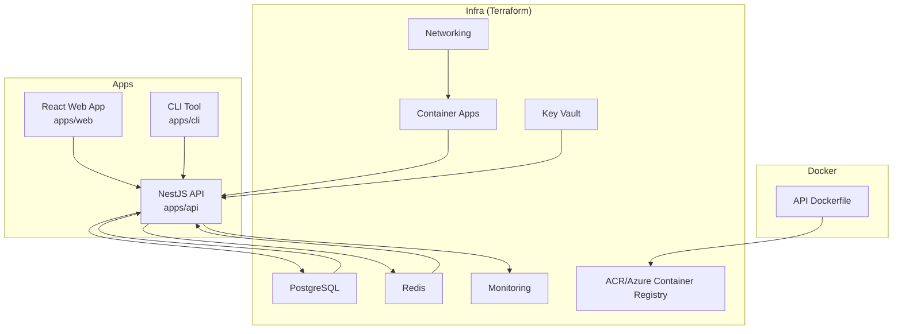

**Diagram sources**
- [apps/api/src/app.module.ts:53-129](file://apps/api/src/app.module.ts#L53-L129)
- [apps/web/src/App.tsx:189-284](file://apps/web/src/App.tsx#L189-L284)
- [apps/cli/src/index.ts:1-31](file://apps/cli/src/index.ts#L1-L31)
- [docker/api/Dockerfile:68-120](file://docker/api/Dockerfile#L68-L120)
- [infrastructure/terraform/main.tf](file://infrastructure/terraform/main.tf)

**Section sources**
- [apps/api/src/app.module.ts:1-130](file://apps/api/src/app.module.ts#L1-L130)
- [apps/web/src/App.tsx:1-284](file://apps/web/src/App.tsx#L1-L284)
- [apps/cli/src/index.ts:1-31](file://apps/cli/src/index.ts#L1-L31)
- [docker/api/Dockerfile:1-120](file://docker/api/Dockerfile#L1-L120)
- [infrastructure/terraform/main.tf](file://infrastructure/terraform/main.tf)

## Core Components
- Bootstrap and middleware pipeline: initializes telemetry, logging, security headers, rate limiting, CORS, compression, Swagger, and graceful shutdown hooks.
- Module composition: central AppModule aggregates feature modules (auth, users, questionnaire, session, adaptive logic, standards, admin, document generator, AI gateway, chat engine, fact extraction, quality scoring, projects, payments, notifications, adapters, idea capture, heatmap).
- Configuration: centralized configuration loader with production safety checks for secrets and CORS.
- Guards and interceptors: CSRF guard, throttling guard, logging interceptor, transform interceptor, and exception filter.
- Feature modules: each domain encapsulated in its own module with controllers, services, DTOs, and repositories via Prisma.

**Section sources**
- [apps/api/src/main.ts:28-329](file://apps/api/src/main.ts#L28-L329)
- [apps/api/src/app.module.ts:53-129](file://apps/api/src/app.module.ts#L53-L129)
- [apps/api/src/config/configuration.ts:87-115](file://apps/api/src/config/configuration.ts#L87-L115)
- [apps/api/src/common/guards/csrf.guard.ts:47-148](file://apps/api/src/common/guards/csrf.guard.ts#L47-L148)
- [apps/api/src/common/interceptors/logging.interceptor.ts:10-56](file://apps/api/src/common/interceptors/logging.interceptor.ts#L10-L56)

## Architecture Overview
The system employs a layered, modular backend with a React SPA frontend and a CLI. The backend uses NestJS dependency injection, guarded by CSRF and throttling, with structured logging and telemetry. Inter-module communication occurs via direct service calls and DTOs. Asynchronous workloads leverage Redis-backed tokens and background processing. The frontend uses React Router, TanStack Query for caching, and Sentry for error boundary reporting.

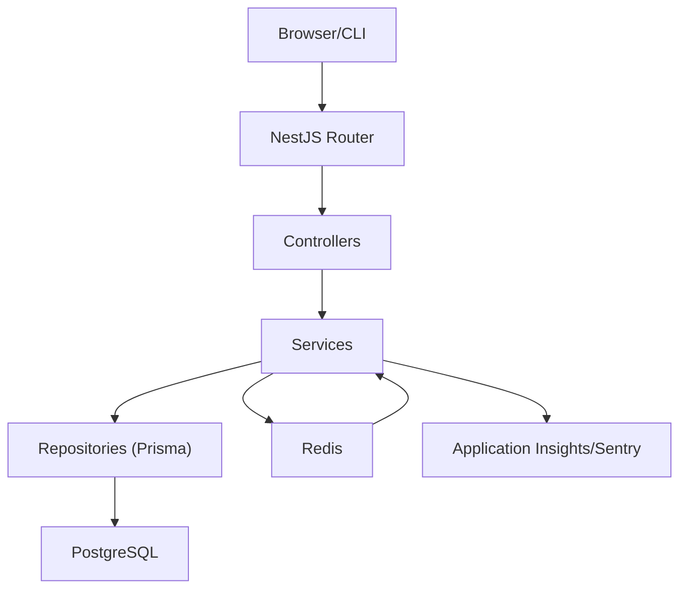

**Diagram sources**
- [apps/api/src/main.ts:10-33](file://apps/api/src/main.ts#L10-L33)
- [apps/api/src/app.module.ts:53-129](file://apps/api/src/app.module.ts#L53-L129)
- [apps/api/src/modules/auth/auth.module.ts:17-51](file://apps/api/src/modules/auth/auth.module.ts#L17-L51)
- [apps/api/src/modules/document-generator/document-generator.module.ts:19-46](file://apps/api/src/modules/document-generator/document-generator.module.ts#L19-L46)

## Detailed Component Analysis

### Backend Bootstrap and Middleware Pipeline
- Initializes Application Insights and Sentry early.
- Uses Pino for structured logging.
- Applies Helmet CSP, HSTS, Permissions-Policy, and cookie parsing.
- Enforces request size limits and CORS with dynamic origin handling.
- Registers global pipes (ValidationPipe), filters (HttpExceptionFilter), and interceptors (Transform, Logging).
- Exposes Swagger UI conditionally.
- Sets global API prefix and registers graceful shutdown hooks.

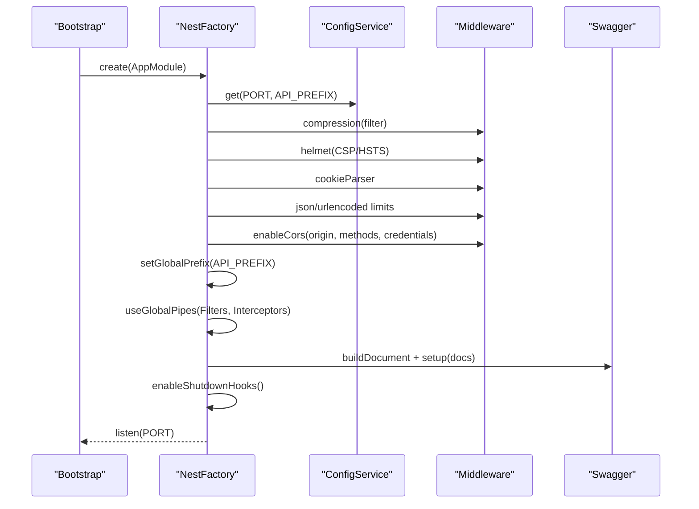

**Diagram sources**
- [apps/api/src/main.ts:28-329](file://apps/api/src/main.ts#L28-L329)

**Section sources**
- [apps/api/src/main.ts:28-329](file://apps/api/src/main.ts#L28-L329)

### Module Organization and Dependency Injection
- AppModule composes feature modules and provides global guards (ThrottlerGuard, CsrfGuard).
- Feature modules declare imports (PrismaModule, ConfigModule), controllers, providers, and exports for cross-module consumption.
- Example: AuthModule configures JWT and Passport strategies; DocumentGeneratorModule orchestrates document generation services.

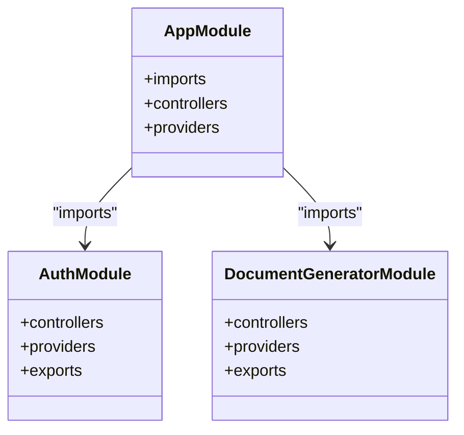

**Diagram sources**
- [apps/api/src/app.module.ts:53-129](file://apps/api/src/app.module.ts#L53-L129)
- [apps/api/src/modules/auth/auth.module.ts:17-51](file://apps/api/src/modules/auth/auth.module.ts#L17-L51)
- [apps/api/src/modules/document-generator/document-generator.module.ts:19-46](file://apps/api/src/modules/document-generator/document-generator.module.ts#L19-L46)

**Section sources**
- [apps/api/src/app.module.ts:53-129](file://apps/api/src/app.module.ts#L53-L129)
- [apps/api/src/modules/auth/auth.module.ts:1-53](file://apps/api/src/modules/auth/auth.module.ts#L1-L53)
- [apps/api/src/modules/document-generator/document-generator.module.ts:1-47](file://apps/api/src/modules/document-generator/document-generator.module.ts#L1-L47)

### Layered Architecture: Controllers, Services, DTOs, Repositories
- Controllers: handle HTTP requests, apply guards, and delegate to services.
- Services: encapsulate business logic, coordinate repositories and external integrations.
- DTOs: validate and transform request/response payloads.
- Repositories: abstracted via PrismaService for database operations.

Example: AuthService handles authentication flows, integrates with PrismaService and RedisService, and emits notifications.

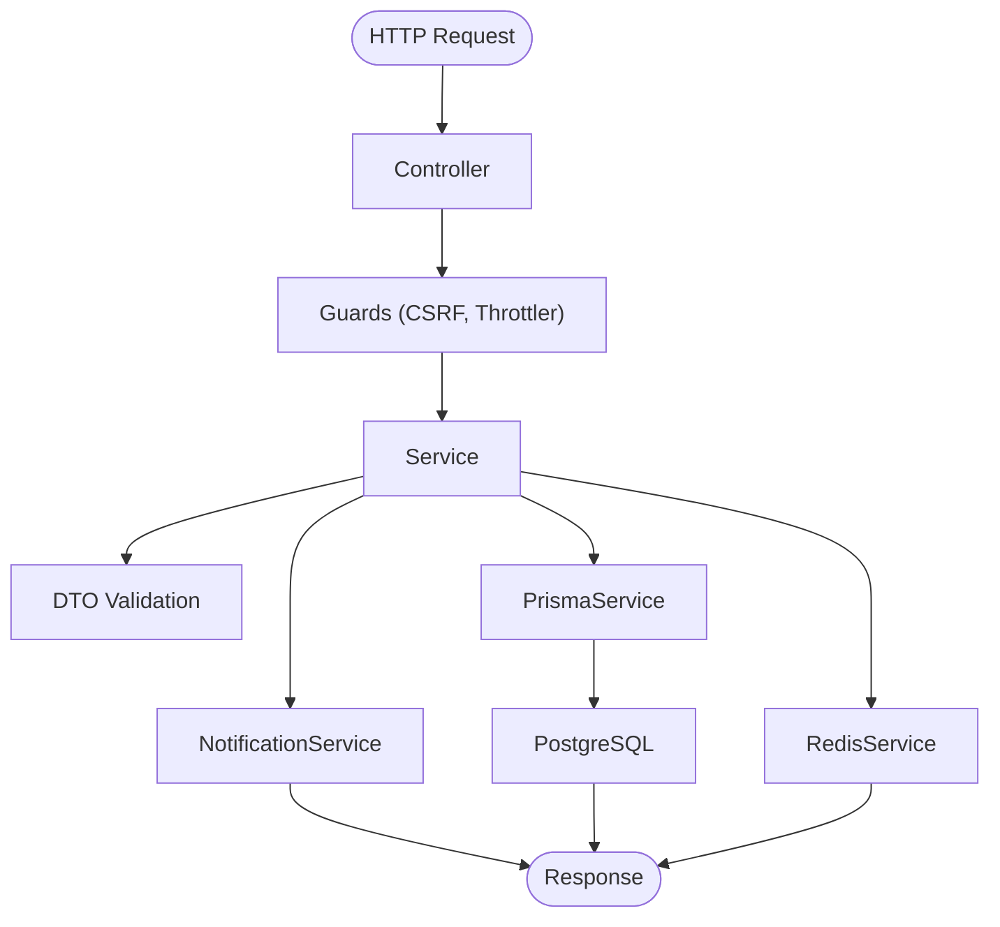

**Diagram sources**
- [apps/api/src/modules/auth/auth.service.ts:37-200](file://apps/api/src/modules/auth/auth.service.ts#L37-L200)
- [apps/api/src/common/guards/csrf.guard.ts:47-148](file://apps/api/src/common/guards/csrf.guard.ts#L47-L148)
- [apps/api/src/common/interceptors/logging.interceptor.ts:10-56](file://apps/api/src/common/interceptors/logging.interceptor.ts#L10-L56)

**Section sources**
- [apps/api/src/modules/auth/auth.service.ts:37-200](file://apps/api/src/modules/auth/auth.service.ts#L37-L200)

### Inter-Service Communication and Asynchronous Processing
- Direct service-to-service calls within the backend.
- Redis-backed refresh tokens and caching for session and rate-limiting state.
- Document generation is orchestrated by DocumentGeneratorService, which coordinates template assembly, AI content generation, building, and storage upload.

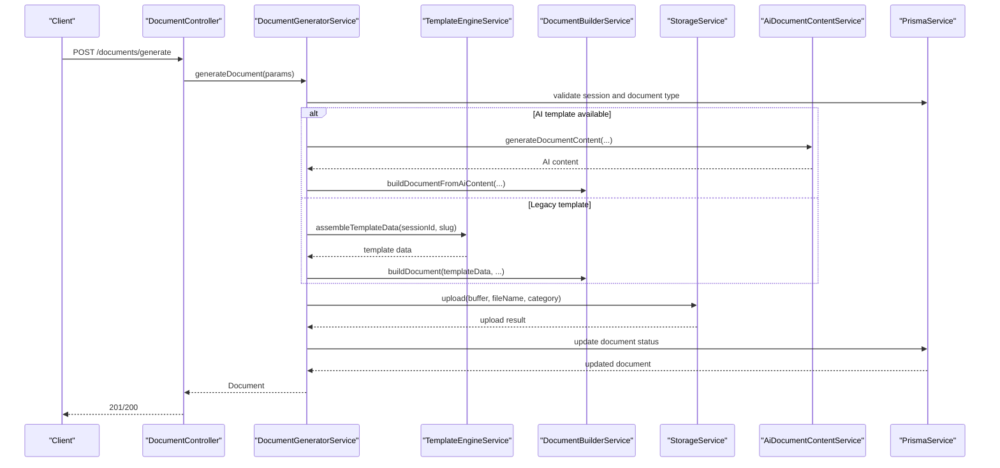

**Diagram sources**
- [apps/api/src/modules/document-generator/services/document-generator.service.ts:21-200](file://apps/api/src/modules/document-generator/services/document-generator.service.ts#L21-L200)
- [apps/api/src/modules/document-generator/document-generator.module.ts:19-46](file://apps/api/src/modules/document-generator/document-generator.module.ts#L19-L46)

**Section sources**
- [apps/api/src/modules/document-generator/services/document-generator.service.ts:21-200](file://apps/api/src/modules/document-generator/services/document-generator.service.ts#L21-L200)

### Event-Driven Patterns and Streaming
- AI Gateway supports streaming responses via Server-Sent Events (SSE) for chat-like experiences.
- Compression middleware excludes streaming endpoints to preserve stream integrity.

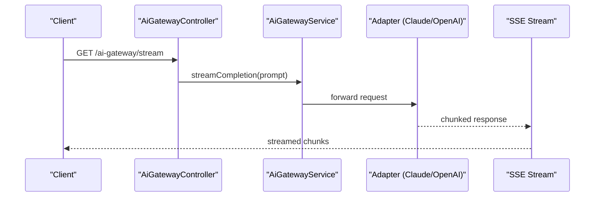

**Diagram sources**
- [apps/api/src/modules/ai-gateway/ai-gateway.module.ts:1-26](file://apps/api/src/modules/ai-gateway/ai-gateway.module.ts#L1-L26)
- [apps/api/src/main.ts:43-67](file://apps/api/src/main.ts#L43-L67)

**Section sources**
- [apps/api/src/modules/ai-gateway/ai-gateway.module.ts:1-26](file://apps/api/src/modules/ai-gateway/ai-gateway.module.ts#L1-L26)
- [apps/api/src/main.ts:43-67](file://apps/api/src/main.ts#L43-L67)

### Frontend Architecture: React, Routing, and State Management
- React SPA bootstrapped with Sentry initialization and Error Boundary.
- React Router with lazy-loaded routes, protected/public route wrappers, and navigation guards.
- TanStack Query for caching, retries, and background refetch strategies.
- Providers for internationalization, accessibility, onboarding, predictive AI, and smart search.

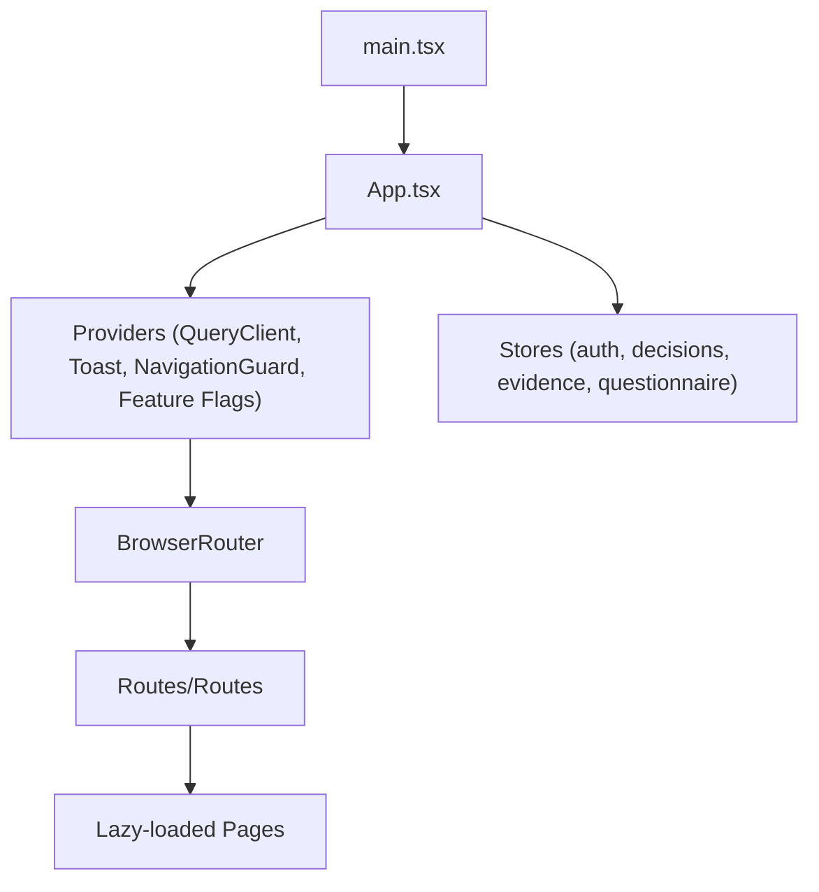

**Diagram sources**
- [apps/web/src/main.tsx:1-23](file://apps/web/src/main.tsx#L1-L23)
- [apps/web/src/App.tsx:189-284](file://apps/web/src/App.tsx#L189-L284)

**Section sources**
- [apps/web/src/main.tsx:1-23](file://apps/web/src/main.tsx#L1-L23)
- [apps/web/src/App.tsx:138-284](file://apps/web/src/App.tsx#L138-L284)

### CLI Tool Architecture and Command Patterns
- Command definition and registration using Commander.
- Commands: readiness score, next question suggestions, heatmap export, configuration, and offline operations.
- Centralized index wires commands into a single CLI entrypoint.

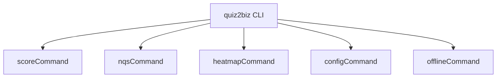

**Diagram sources**
- [apps/cli/src/index.ts:12-31](file://apps/cli/src/index.ts#L12-L31)

**Section sources**
- [apps/cli/src/index.ts:1-31](file://apps/cli/src/index.ts#L1-L31)

### Service Discovery, Load Balancing, and Circuit Breakers
- Service discovery and load balancing are implemented via Azure Container Apps (provisioned by Terraform).
- Circuit breaker patterns are not explicitly present in the backend code; recommended approach is to integrate a library that supports bulkhead/circuit breaker policies around external calls.

**Section sources**
- [infrastructure/terraform/modules/container-apps/main.tf](file://infrastructure/terraform/modules/container-apps/main.tf)

### Caching Strategies and Background Jobs
- Redis is used for:
  - Refresh tokens (logout invalidates token).
  - General caching and rate-limiting state.
- Background jobs are not explicitly implemented in the backend; recommended pattern is to introduce a queue (e.g., Azure Queue Storage) and worker processes to handle long-running tasks.

**Section sources**
- [apps/api/src/modules/auth/auth.service.ts:179-183](file://apps/api/src/modules/auth/auth.service.ts#L179-L183)
- [apps/api/src/config/configuration.ts:45-51](file://apps/api/src/config/configuration.ts#L45-L51)

### Deployment Architecture and Containerization
- Multi-stage Dockerfile for the API:
  - Builder stage generates Prisma client, builds dependencies, prunes dev dependencies.
  - Development stage runs in watch mode.
  - Production stage:
    - Non-root user, health checks, OCI labels, health endpoint integration.
    - Entrypoint script execution.
- Terraform provisions:
  - Container Apps, PostgreSQL, Redis, Networking, Key Vault, Monitoring, and Container Registry.

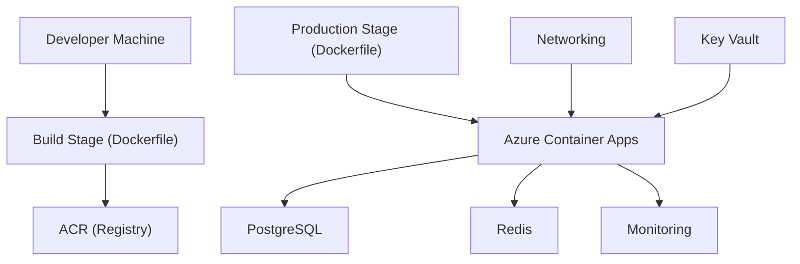

**Diagram sources**
- [docker/api/Dockerfile:1-120](file://docker/api/Dockerfile#L1-L120)
- [infrastructure/terraform/modules/container-apps/main.tf](file://infrastructure/terraform/modules/container-apps/main.tf)
- [infrastructure/terraform/modules/database/main.tf](file://infrastructure/terraform/modules/database/main.tf)
- [infrastructure/terraform/modules/cache/main.tf](file://infrastructure/terraform/modules/cache/main.tf)
- [infrastructure/terraform/modules/networking/main.tf](file://infrastructure/terraform/modules/networking/main.tf)
- [infrastructure/terraform/modules/keyvault/main.tf](file://infrastructure/terraform/modules/keyvault/main.tf)
- [infrastructure/terraform/modules/monitoring/main.tf](file://infrastructure/terraform/modules/monitoring/main.tf)
- [infrastructure/terraform/modules/registry/main.tf](file://infrastructure/terraform/modules/registry/main.tf)

**Section sources**
- [docker/api/Dockerfile:1-120](file://docker/api/Dockerfile#L1-L120)
- [infrastructure/terraform/main.tf](file://infrastructure/terraform/main.tf)

## Dependency Analysis
- AppModule aggregates feature modules and registers global guards and interceptors.
- Feature modules import PrismaModule and ConfigModule, exposing services for cross-module consumption.
- Controllers depend on services; services depend on repositories (PrismaService) and external services (RedisService, NotificationService).

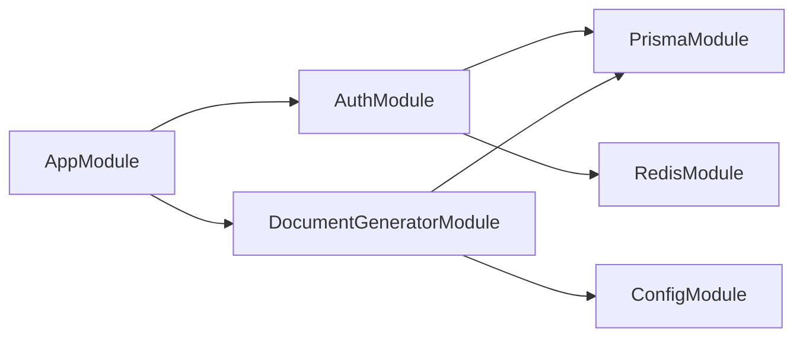

**Diagram sources**
- [apps/api/src/app.module.ts:53-129](file://apps/api/src/app.module.ts#L53-L129)
- [apps/api/src/modules/auth/auth.module.ts:17-51](file://apps/api/src/modules/auth/auth.module.ts#L17-L51)
- [apps/api/src/modules/document-generator/document-generator.module.ts:19-46](file://apps/api/src/modules/document-generator/document-generator.module.ts#L19-L46)

**Section sources**
- [apps/api/src/app.module.ts:53-129](file://apps/api/src/app.module.ts#L53-L129)

## Performance Considerations
- Compression middleware excludes streaming endpoints to maintain SSE integrity.
- ValidationPipe enforces whitelisting and transforms to reduce downstream processing overhead.
- TanStack Query default caching reduces redundant network calls in the frontend.
- Redis caching and token storage minimize repeated database lookups.

[No sources needed since this section provides general guidance]

## Troubleshooting Guide
- CSRF validation failures: ensure both cookie and header tokens are present and match; verify CSRF_SECRET is configured in production.
- Authentication errors: review JWT secrets and refresh token TTL; confirm Redis connectivity for refresh token storage.
- Logging and telemetry: verify Application Insights and Sentry initialization order and configuration.
- Frontend Sentry boundary: SentryErrorBoundary wraps the root to gracefully handle runtime errors.

**Section sources**
- [apps/api/src/common/guards/csrf.guard.ts:47-148](file://apps/api/src/common/guards/csrf.guard.ts#L47-L148)
- [apps/api/src/modules/auth/auth.service.ts:147-183](file://apps/api/src/modules/auth/auth.service.ts#L147-L183)
- [apps/api/src/main.ts:28-329](file://apps/api/src/main.ts#L28-L329)
- [apps/web/src/main.tsx:6-22](file://apps/web/src/main.tsx#L6-L22)

## Conclusion
Quiz-to-Build employs a robust, modular NestJS backend with clear separation of concerns, comprehensive middleware and security layers, and a modern React frontend with sophisticated routing and state management. The architecture leverages Redis for caching and tokens, supports streaming AI responses, and is containerized with multi-stage Docker builds. Infrastructure is provisioned via Terraform for scalability and observability. Recommended enhancements include introducing circuit breakers and a background job queue for long-running tasks.

## Appendices
- Configuration highlights: JWT, Redis, throttling, CORS, email, Claude, tokens expiry, frontend URL.
- Terraform modules: container apps, database, cache, networking, key vault, monitoring, registry.

**Section sources**
- [apps/api/src/config/configuration.ts:87-115](file://apps/api/src/config/configuration.ts#L87-L115)
- [infrastructure/terraform/main.tf](file://infrastructure/terraform/main.tf)