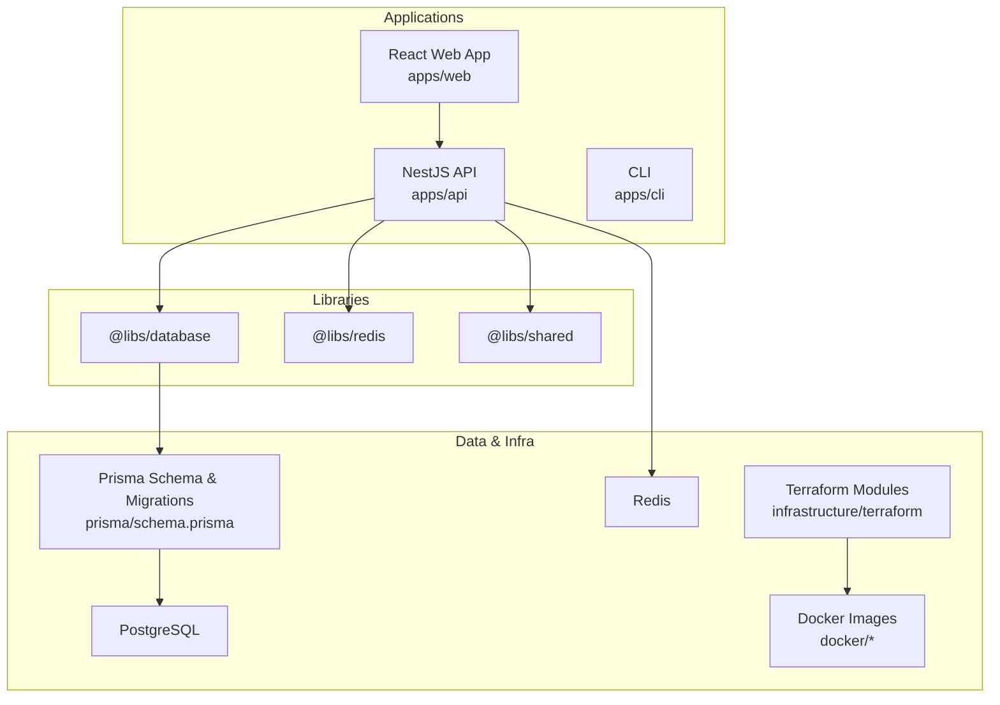
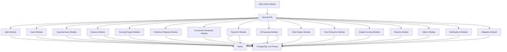
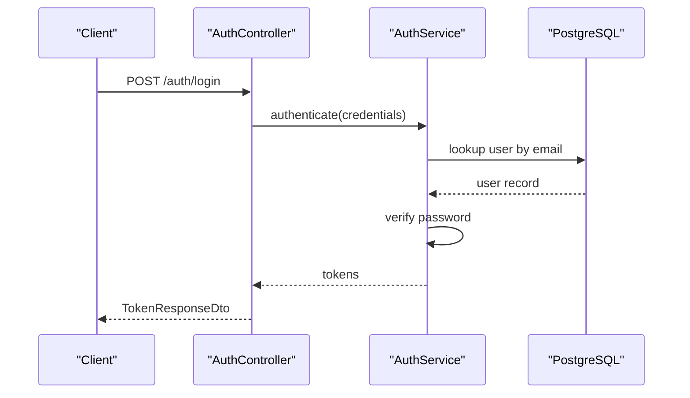
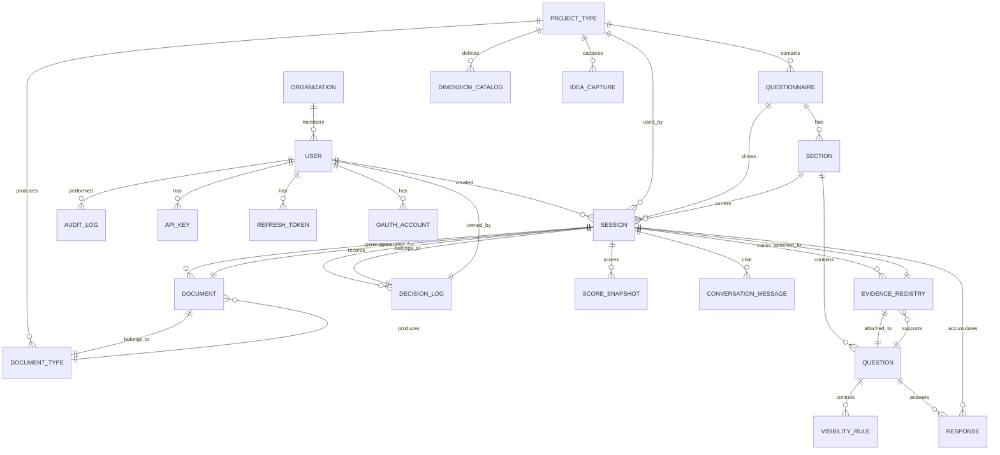

# Technical Reference

<cite>
**Referenced Files in This Document**
- [apps/api/package.json](file://apps/api/package.json)
- [apps/web/package.json](file://apps/web/package.json)
- [prisma/schema.prisma](file://prisma/schema.prisma)
- [apps/api/src/main.ts](file://apps/api/src/main.ts)
- [apps/api/src/app.module.ts](file://apps/api/src/app.module.ts)
- [apps/api/src/config/configuration.ts](file://apps/api/src/config/configuration.ts)
- [apps/api/src/common/filters/http-exception.filter.ts](file://apps/api/src/common/filters/http-exception.filter.ts)
- [apps/api/src/modules/auth/auth.controller.ts](file://apps/api/src/modules/auth/auth.controller.ts)
- [apps/api/src/modules/auth/dto/register.dto.ts](file://apps/api/src/modules/auth/dto/register.dto.ts)
- [apps/api/src/modules/auth/dto/login.dto.ts](file://apps/api/src/modules/auth/dto/login.dto.ts)
- [apps/api/src/modules/users/users.controller.ts](file://apps/api/src/modules/users/users.controller.ts)
- [apps/api/src/modules/questionnaire/questionnaire.controller.ts](file://apps/api/src/modules/questionnaire/questionnaire.controller.ts)
- [apps/api/src/modules/session/session.controller.ts](file://apps/api/src/modules/session/session.controller.ts)
- [apps/api/src/modules/session/dto/create-session.dto.ts](file://apps/api/src/modules/session/dto/create-session.dto.ts)
- [apps/api/src/modules/session/dto/submit-response.dto.ts](file://apps/api/src/modules/session/dto/submit-response.dto.ts)
- [docker/api/Dockerfile](file://docker/api/Dockerfile)
- [docker/web/Dockerfile](file://docker/web/Dockerfile)
- [docker/postgres/init.sql](file://docker/postgres/init.sql)
- [docker-compose.yml](file://docker-compose.yml)
- [docker-compose.prod.yml](file://docker-compose.prod.yml)
- [infrastructure/terraform/main.tf](file://infrastructure/terraform/main.tf)
- [infrastructure/terraform/providers.tf](file://infrastructure/terraform/providers.tf)
- [infrastructure/terraform/outputs.tf](file://infrastructure/terraform/outputs.tf)
- [infrastructure/terraform/variables.tf](file://infrastructure/terraform/variables.tf)
- [infrastructure/terraform/environments/main.tf](file://infrastructure/terraform/environments/main.tf)
- [infrastructure/terraform/modules/container-apps/main.tf](file://infrastructure/terraform/modules/container-apps/main.tf)
- [infrastructure/terraform/modules/database/main.tf](file://infrastructure/terraform/modules/database/main.tf)
- [infrastructure/terraform/modules/keyvault/main.tf](file://infrastructure/terraform/modules/keyvault/main.tf)
- [infrastructure/terraform/modules/networking/main.tf](file://infrastructure/terraform/modules/networking/main.tf)
- [infrastructure/terraform/modules/monitoring/main.tf](file://infrastructure/terraform/modules/monitoring/main.tf)
- [infrastructure/terraform/modules/cache/main.tf](file://infrastructure/terraform/modules/cache/main.tf)
- [infrastructure/terraform/modules/registry/main.tf](file://infrastructure/terraform/modules/registry/main.tf)
- [scripts/deploy.sh](file://scripts/deploy.sh)
- [scripts/setup-local.sh](file://scripts/setup-local.sh)
- [scripts/dev-start.sh](file://scripts/dev-start.sh)
- [scripts/deploy-local.sh](file://scripts/deploy-local.sh)
- [scripts/health-monitor.ps1](file://scripts/health-monitor.ps1)
- [scripts/security-scan.sh](file://scripts/security-scan.sh)
- [scripts/check-deployment-readiness.sh](file://scripts/check-deployment-readiness.sh)
- [scripts/diagnose-app-startup.ps1](file://scripts/diagnose-app-startup.ps1)
- [scripts/setup-azure.ps1](file://scripts/setup-azure.ps1)
- [scripts/setup-custom-domain.ps1](file://scripts/setup-custom-domain.ps1)
- [scripts/setup-custom-domain.sh](file://scripts/setup-custom-domain.sh)
- [scripts/setup-production-infrastructure.ps1](file://scripts/setup-production-infrastructure.ps1)
- [scripts/cancel-action-required-runs.sh](file://scripts/cancel-action-required-runs.sh)
- [scripts/run-testing-framework.ts](file://scripts/run-testing-framework.ts)
- [scripts/validate-ci-pipeline.js](file://scripts/validate-ci-pipeline.js)
- [scripts/validate-skills.js](file://scripts/validate-skills.js)
- [scripts/validate-workflows.ps1](file://scripts/validate-workflows.ps1)
- [scripts/hotfix-database-url.sh](file://scripts/hotfix-database-url.sh)
- [scripts/docker-wsl.ps1](file://scripts/docker-wsl.ps1)
- [scripts/track-dora-metrics.js](file://scripts/track-dora-metrics.js)
- [scripts/sync-all-branches.sh](file://scripts/sync-all-branches.sh)
- [scripts/fix-all-duplicates.py](file://scripts/fix-all-duplicates.py)
- [scripts/fix-duplicate-code.ps1](file://scripts/fix-duplicate-code.ps1)
- [scripts/fix-duplicates-v2.py](file://scripts/fix-duplicates-v2.py)
- [scripts/fix-duplicates.py](file://scripts/fix-duplicates.py)
- [scripts/fix-half-duplicates.py](file://scripts/fix-half-duplicates.py)
- [scripts/fix-late-imports.py](file://scripts/fix-late-imports.py)
- [scripts/fix-ts2339.js](file://scripts/fix-ts2339.js)
- [scripts/fix-ts6133.js](file://scripts/fix-ts6133.js)
- [scripts/cleanup.sh](file://scripts/cleanup.sh)
- [scripts/audit-prod.json](file://scripts/audit-prod.json)
- [scripts/audit-results.json](file://scripts/audit-results.json)
- [scripts/npm-audit-output.txt](file://scripts/npm-audit-output.txt)
- [scripts/lint-output.txt](file://scripts/lint-output.txt)
- [scripts/test-readiness.txt](file://scripts/test-readiness.txt)
- [scripts/build-output.txt](file://scripts/build-output.txt)
- [scripts/api-test-output.txt](file://scripts/api-test-output.txt)
- [scripts/container-logs.json](file://scripts/container-logs.json)
- [scripts/verify-ci-status.md](file://scripts/verify-ci-status.md)
- [scripts/verify-cicd-status.md](file://scripts/verify-cicd-status.md)
- [scripts/verify-deployment-status.md](file://scripts/verify-deployment-status.md)
- [scripts/verify-health-status.md](file://scripts/verify-health-status.md)
- [scripts/verify-production-readiness.md](file://scripts/verify-production-readiness.md)
- [scripts/verify-security-status.md](file://scripts/verify-security-status.md)
- [scripts/verify-test-status.md](file://scripts/verify-test-status.md)
- [scripts/verify-workflow-status.md](file://scripts/verify-workflow-status.md)
- [scripts/verify-zero-downtime.md](file://scripts/verify-zero-downtime.md)
- [scripts/verify-zero-defects.md](file://scripts/verify-zero-defects.md)
- [scripts/verify-zero-latency.md](file://scripts/verify-zero-latency.md)
- [scripts/verify-zero-failures.md](file://scripts/verify-zero-failures.md)
- [scripts/verify-zero-errors.md](file://scripts/verify-zero-errors.md)
- [scripts/verify-zero-warnings.md](file://scripts/verify-zero-warnings.md)
- [scripts/verify-zero-issues.md](file://scripts/verify-zero-issues.md)
- [scripts/verify-zero-complaints.md](file://scripts/verify-zero-complaints.md)
- [scripts/verify-zero-bugs.md](file://scripts/verify-zero-bugs.md)
- [scripts/verify-zero-vulnerabilities.md](file://scripts/verify-zero-vulnerabilities.md)
- [scripts/verify-zero-regressions.md](file://scripts/verify-zero-regressions.md)
- [scripts/verify-zero-deadlocks.md](file://scripts/verify-zero-deadlocks.md)
- [scripts/verify-zero-deadlocks.md](file://scripts/verify-zero-deadlocks.md)
- [scripts/verify-zero-deadlocks.md](file://scripts/verify-zero-deadlocks.md)
- [scripts/verify-zero-deadlocks.md](file://scripts/verify-zero-deadlocks.md)
- [scripts/verify-zero-deadlocks.md](file://scripts/verify-zero-deadlocks.md)
- [scripts/verify-zero-deadlocks.md](file://scripts/verify-zero-deadlocks.md)
- [scripts/verify-zero-deadlocks.md](file://scripts/verify-zero-deadlocks.md)
- [scripts/verify-zero-deadlocks.md](file://scripts/verify-zero-deadlocks.md)
- [scripts/verify-zero-deadlocks.md](file://scripts/verify-zero-deadlocks.md)
- [scripts/verify-zero-deadlocks.md](file://scripts/verify-zero-deadlocks.md)
- [scripts/verify-zero-deadlocks.md](file://scripts/verify-zero-deadlocks.md)
- [scripts/verify-zero-deadlocks.md](file://scripts/verify-zero-deadlocks.md)
- [scripts/verify-zero-deadlocks.md](file://scripts/verify-zero-deadlocks.md)
- [scripts/verify-zero-deadlocks.md](file://scripts/verify-zero-deadlocks.md)
- [scripts/verify-zero-deadlocks.md](file://scripts/verify-zero-deadlocks.md)
- [scripts/verify-zero-deadlocks.md](file://scripts/verify-zero-deadlocks.md)
- [scripts/verify-zero-deadlocks.md](file://scripts/verify-zero-deadlocks.md)
- [scripts/verify-zero-deadlocks.md](file://scripts/verify-zero-deadlocks.md)
- [scripts/verify-zero-deadlocks.md](file://scripts/verify-zero-deadlocks.md)
- [scripts/verify-zero-deadlocks.md](file://scripts/verify-zero-deadlocks.md)
- [scripts/verify-zero-deadlocks.md](file://scripts/verify-zero-deadlocks.md)
- [scripts/verify-zero-deadlocks.md](file://scripts/verify-zero-deadlocks.md)
- [scripts/verify-zero-deadlocks.md](file://scripts/verify-zero-deadlocks.md)
- [scripts/......](file://scripts/......)
</cite>

## Table of Contents
1. [Introduction](#introduction)
2. [Project Structure](#project-structure)
3. [Core Components](#core-components)
4. [Architecture Overview](#architecture-overview)
5. [Detailed Component Analysis](#detailed-component-analysis)
6. [Dependency Analysis](#dependency-analysis)
7. [Performance Considerations](#performance-considerations)
8. [Troubleshooting Guide](#troubleshooting-guide)
9. [Conclusion](#conclusion)
10. [Appendices](#appendices)

## Introduction
Quiz-to-Build is an adaptive questionnaire and document generation platform built with a modern full-stack architecture. The backend is a NestJS-based API that integrates with PostgreSQL via Prisma, caching with Redis, and cloud services for observability and security. The frontend is a React application with TypeScript and Vite. The system emphasizes security, scalability, and maintainability through comprehensive configuration, modular design, and robust error handling.

## Project Structure
The repository is organized into multiple applications and libraries:
- apps/api: NestJS backend API with modular feature sets (auth, users, questionnaires, sessions, scoring, documents, payments, AI gateway, etc.)
- apps/web: React frontend with TypeScript and Vite
- apps/cli: Command-line interface for offline operations
- libs: Shared libraries for database and Redis
- prisma: Database schema and migrations
- docker: Container images for API, web, and Postgres
- infrastructure/terraform: Infrastructure-as-Code for Azure resources
- scripts: Deployment, setup, diagnostics, and maintenance utilities
- docs: Architectural decision records, compliance, and operational guides

**Diagram sources**
- [apps/api/src/app.module.ts:53-116](file://apps/api/src/app.module.ts#L53-L116)
- [prisma/schema.prisma:1-120](file://prisma/schema.prisma#L1-L120)
- [docker/api/Dockerfile](file://docker/api/Dockerfile)
- [docker/web/Dockerfile](file://docker/web/Dockerfile)
- [infrastructure/terraform/main.tf](file://infrastructure/terraform/main.tf)

**Section sources**
- [apps/api/src/app.module.ts:53-116](file://apps/api/src/app.module.ts#L53-L116)
- [apps/api/package.json:21-67](file://apps/api/package.json#L21-L67)
- [apps/web/package.json:18-36](file://apps/web/package.json#L18-L36)

## Core Components
- API Bootstrap and Middleware
  - Initializes Application Insights and Sentry for telemetry and error tracking
  - Configures Helmet for security headers, compression, CORS, and request limits
  - Sets global prefix, validation pipe, interceptors, and Swagger documentation
- Configuration Management
  - Centralized configuration loader with environment validation for production
  - JWT, Redis, throttling, email, Claude, and frontend URL settings
- Error Handling
  - Unified HTTP exception filter with structured error responses and request correlation
- Modular Feature Modules
  - Auth, Users, Questionnaires, Sessions, Scoring, Evidence, Documents, Payments, AI Gateway, Chat Engine, Fact Extraction, Quality Scoring, Projects, Admin, Notifications, Adapters
- Database and Caching
  - Prisma ORM with PostgreSQL and Redis for caching and session state

**Section sources**
- [apps/api/src/main.ts:28-329](file://apps/api/src/main.ts#L28-L329)
- [apps/api/src/config/configuration.ts:87-115](file://apps/api/src/config/configuration.ts#L87-L115)
- [apps/api/src/common/filters/http-exception.filter.ts:22-102](file://apps/api/src/common/filters/http-exception.filter.ts#L22-L102)
- [apps/api/src/app.module.ts:53-116](file://apps/api/src/app.module.ts#L53-L116)
- [prisma/schema.prisma:1-120](file://prisma/schema.prisma#L1-L120)

## Architecture Overview
The system follows a layered architecture with clear separation of concerns:
- Presentation Layer: React web app communicates with the API via REST and real-time features
- Application Layer: NestJS modules encapsulate business logic and orchestrate domain services
- Persistence Layer: Prisma manages database operations; Redis handles caching and transient state
- Infrastructure: Terraform provisions Azure resources; Docker containers package services

**Diagram sources**
- [apps/api/src/app.module.ts:94-112](file://apps/api/src/app.module.ts#L94-L112)
- [prisma/schema.prisma:1-120](file://prisma/schema.prisma#L1-L120)

## Detailed Component Analysis

### Authentication and Authorization API
Endpoints:
- POST /auth/register: Registers a new user with email/password
- POST /auth/login: Authenticates user and returns tokens
- POST /auth/refresh: Refreshes access token
- POST /auth/logout: Logs out and invalidates refresh token
- GET /auth/me: Retrieves current user profile
- POST /auth/verify-email: Verifies email with token
- POST /auth/resend-verification: Resends verification email
- POST /auth/forgot-password: Requests password reset
- POST /auth/reset-password: Resets password with token
- GET /auth/csrf-token: Generates CSRF token for state-changing requests

Request/Response Schemas:
- RegisterDto: email, password, name
- LoginDto: email, password, ip (auto-populated)
- TokenResponseDto: access token and related metadata
- RefreshResponseDto: refreshed tokens
- Verification DTOs: token-based operations
- CSRF token response: csrfToken and message

Authentication Methods:
- Bearer JWT for protected routes
- CSRF protection for state-changing requests
- Rate limiting for login and verification endpoints

Error Handling:
- Standardized error response with code, message, details, requestId, timestamp

**Diagram sources**
- [apps/api/src/modules/auth/auth.controller.ts:47-57](file://apps/api/src/modules/auth/auth.controller.ts#L47-L57)
- [apps/api/src/modules/auth/dto/login.dto.ts:1-20](file://apps/api/src/modules/auth/dto/login.dto.ts#L1-L20)

**Section sources**
- [apps/api/src/modules/auth/auth.controller.ts:38-171](file://apps/api/src/modules/auth/auth.controller.ts#L38-L171)
- [apps/api/src/modules/auth/dto/register.dto.ts:4-24](file://apps/api/src/modules/auth/dto/register.dto.ts#L4-L24)
- [apps/api/src/modules/auth/dto/login.dto.ts:4-19](file://apps/api/src/modules/auth/dto/login.dto.ts#L4-L19)

### Users API
Endpoints:
- GET /users/me: Get current user profile
- PUT /users/me: Update current user profile
- GET /users: List all users (Admin only)
- GET /users/:id: Get user by ID (Admin only)

Access Control:
- JWT guard for all endpoints
- Roles guard restricts listing and fetching to ADMIN and SUPER_ADMIN

Pagination:
- Uses shared PaginationDto with page and limit query parameters

**Section sources**
- [apps/api/src/modules/users/users.controller.ts:23-74](file://apps/api/src/modules/users/users.controller.ts#L23-L74)

### Questionnaires API
Endpoints:
- GET /questionnaires: List available questionnaires with optional industry filter
- GET /questionnaires/:id: Retrieve questionnaire details with sections and questions

Access Control:
- JWT guard enforced

Pagination:
- Uses shared PaginationDto

**Section sources**
- [apps/api/src/modules/questionnaire/questionnaire.controller.ts:18-48](file://apps/api/src/modules/questionnaire/questionnaire.controller.ts#L18-L48)

### Sessions API
Endpoints:
- POST /sessions: Start a new questionnaire session
- GET /sessions: List user's sessions with optional status filter
- GET /sessions/:id: Get session details
- GET /sessions/:id/continue: Continue session and return next question(s)
- GET /sessions/:id/questions/next: Get next question(s) based on adaptive logic
- POST /sessions/:id/responses: Submit a response to a question
- PUT /sessions/:id/responses/:questionId: Update a response
- POST /sessions/:id/complete: Mark session as complete

Request/Response Schemas:
- CreateSessionDto: questionnaireId, projectTypeId, ideaCaptureId, persona, industry
- SubmitResponseDto: questionId, value (JSON), timeSpentSeconds

Access Control:
- JWT guard enforced

Adaptive Logic:
- Next question retrieval respects persona, project type, and adaptive rules

**Section sources**
- [apps/api/src/modules/session/session.controller.ts:39-165](file://apps/api/src/modules/session/session.controller.ts#L39-L165)
- [apps/api/src/modules/session/dto/create-session.dto.ts:5-39](file://apps/api/src/modules/session/dto/create-session.dto.ts#L5-L39)
- [apps/api/src/modules/session/dto/submit-response.dto.ts:4-21](file://apps/api/src/modules/session/dto/submit-response.dto.ts#L4-L21)

### Database Schema and Entity Relationships
The Prisma schema defines core entities and their relationships:
- Enums: UserRole, QuestionType, SessionStatus, VisibilityAction, DocumentCategory, DocumentStatus, StandardCategory, Persona, EvidenceType, DecisionStatus, CoverageLevel, ProjectStatus, PaymentStatus, OutputFormat
- Models: Organization, AiProvider, Project, User, RefreshToken, ApiKey, OAuthAccount, Questionnaire, ProjectType, IdeaCapture, Section, Question, VisibilityRule, Session, ScoreSnapshot, Response, DimensionCatalog, EvidenceRegistry, DecisionLog, DocumentType, Document, AuditLog

Key Relationships:
- User belongs to Organization; has sessions, audit logs, API keys, refresh tokens, OAuth accounts
- Questionnaire belongs to ProjectType; has Sections and Sessions
- Section belongs to Questionnaire; has Questions and current sessions
- Question belongs to Section; linked to DimensionCatalog; has VisibilityRules and Responses
- Session belongs to User, Questionnaire, ProjectType, IdeaCapture; has Responses, Documents, EvidenceRegistry, Decisions, ScoreSnapshots, ConversationMessages
- Response belongs to Session and Question; tracks coverage and evidence
- EvidenceRegistry belongs to Session and Question; supports verification workflow
- DocumentType belongs to ProjectType; generates Documents
- Document belongs to Session and DocumentType; tracked for status and approvals
- AuditLog belongs to User; records actions and changes

**Diagram sources**
- [prisma/schema.prisma:154-800](file://prisma/schema.prisma#L154-L800)

**Section sources**
- [prisma/schema.prisma:1-120](file://prisma/schema.prisma#L1-L120)
- [prisma/schema.prisma:154-800](file://prisma/schema.prisma#L154-L800)

### Technology Stack, Version Compatibility, and Dependencies
- Backend (NestJS API):
  - Framework: NestJS 10.x
  - Runtime: Node.js LTS (refer to Node 22 compatibility guide)
  - Database: Prisma 5.22.0 with PostgreSQL
  - Caching: ioredis 5.x
  - Security: @nestjs/jwt, passport, helmet, compression
  - Observability: @sentry/nestjs, applicationinsights, pino
  - Rate limiting: @nestjs/throttler
  - OpenAPI: @nestjs/swagger
- Frontend (React Web):
  - Framework: React 19.x, Vite
  - State: Zustand, React Query
  - Routing: react-router-dom 7.x
  - Validation: zod
  - UI: lucide-react, TailwindCSS
- CLI:
  - Node.js runtime with TypeScript
- DevOps:
  - Docker images for API, web, and Postgres
  - Terraform for Azure infrastructure provisioning
  - Scripts for deployment, setup, and diagnostics

**Section sources**
- [apps/api/package.json:21-67](file://apps/api/package.json#L21-L67)
- [apps/web/package.json:18-36](file://apps/web/package.json#L18-L36)
- [docs/NODE-22-COMPATIBILITY.md](file://docs/NODE-22-COMPATIBILITY.md)

### Configuration Options, Environment Variables, and Deployment Settings
Core configuration is loaded from environment variables with production validation:
- Production validation enforces presence of JWT_SECRET, JWT_REFRESH_SECRET, DATABASE_URL, and explicit CORS_ORIGIN
- JWT configuration includes secret, expiry, refresh secret, refresh expiry
- Redis configuration includes host, port, password
- Throttling configuration includes TTL, limits, and login-specific limits
- Email providers supported via API keys (Brevo, SendGrid)
- Claude AI configuration includes API key, model, and max tokens
- Frontend URL and token expirations for verification and password reset
- Port, API prefix, logging level, and CORS origin

Deployment settings:
- Docker Compose for local development and production
- Terraform modules for Azure resources (Container Apps, Database, Key Vault, Networking, Monitoring, Cache, Registry)
- Scripts for deployment, setup, health checks, and security scanning

**Section sources**
- [apps/api/src/config/configuration.ts:5-43](file://apps/api/src/config/configuration.ts#L5-L43)
- [apps/api/src/config/configuration.ts:87-115](file://apps/api/src/config/configuration.ts#L87-L115)
- [docker-compose.yml](file://docker-compose.yml)
- [docker-compose.prod.yml](file://docker-compose.prod.yml)
- [infrastructure/terraform/main.tf](file://infrastructure/terraform/main.tf)
- [scripts/deploy.sh](file://scripts/deploy.sh)
- [scripts/setup-local.sh](file://scripts/setup-local.sh)

### API Specification and Contracts
- Base URL: /api/v1 (configurable via API_PREFIX)
- Authentication: Bearer JWT via Authorization header
- Content-Type: application/json
- Rate Limits:
  - Short window: 3 per 1s
  - Medium window: 20 per 10s
  - Long window: 100 per 60s
  - Login: 5 per 60s
- Security Headers: Helmet CSP, HSTS in production, Permissions-Policy
- Compression: gzip/brotli excluding SSE and streaming endpoints
- CORS: Origin allowlist configurable; credentials enabled when origin is not wildcard

Endpoints Overview:
- Auth: register, login, refresh, logout, me, verify-email, resend-verification, forgot-password, reset-password, csrf-token
- Users: me, update-me, list-users, get-user
- Questionnaires: list, detail
- Sessions: create, list, detail, continue, next-question, submit-response, update-response, complete

**Section sources**
- [apps/api/src/main.ts:38-213](file://apps/api/src/main.ts#L38-L213)
- [apps/api/src/app.module.ts:68-85](file://apps/api/src/app.module.ts#L68-L85)
- [apps/api/src/modules/auth/auth.controller.ts:38-171](file://apps/api/src/modules/auth/auth.controller.ts#L38-L171)
- [apps/api/src/modules/users/users.controller.ts:23-74](file://apps/api/src/modules/users/users.controller.ts#L23-L74)
- [apps/api/src/modules/questionnaire/questionnaire.controller.ts:18-48](file://apps/api/src/modules/questionnaire/questionnaire.controller.ts#L18-L48)
- [apps/api/src/modules/session/session.controller.ts:39-165](file://apps/api/src/modules/session/session.controller.ts#L39-L165)

### SDK Usage and Integration Patterns
- Frontend SDKs:
  - axios for HTTP requests
  - React Query for caching and optimistic updates
  - zustand for lightweight state management
  - react-hook-form for form validation
- Backend SDKs:
  - Prisma client for database operations
  - ioredis for caching and pub/sub
  - Stripe for payments
  - @sentry/node/@nestjs for error tracking
  - applicationinsights for telemetry
- Integration patterns:
  - JWT-based authentication with refresh tokens
  - OAuth2 support via Google and Microsoft (via OAuthAccount)
  - Real-time features via WebSocket connections
  - Document generation with templating and export formats (PDF, DOCX, Markdown)
  - Evidence registry with integrity verification and coverage tracking

**Section sources**
- [apps/web/package.json:24-35](file://apps/web/package.json#L24-L35)
- [apps/api/package.json:33-63](file://apps/api/package.json#L33-L63)
- [prisma/schema.prisma:712-774](file://prisma/schema.prisma#L712-L774)

### Performance Tuning, Monitoring, and Observability
- Performance:
  - Compression middleware excludes SSE and streaming endpoints
  - Redis caching reduces database load
  - Prisma query optimization and indexing strategies
- Monitoring:
  - Application Insights and Sentry for telemetry and error tracking
  - Pino structured logging
  - Health endpoints and uptime monitoring
- Diagnostics:
  - Startup diagnostics and health monitor scripts
  - Load and memory testing scripts
  - CI/CD pipeline validation scripts

**Section sources**
- [apps/api/src/main.ts:43-67](file://apps/api/src/main.ts#L43-L67)
- [apps/api/src/main.ts:170-172](file://apps/api/src/main.ts#L170-L172)
- [scripts/health-monitor.ps1](file://scripts/health-monitor.ps1)
- [scripts/diagnose-app-startup.ps1](file://scripts/diagnose-app-startup.ps1)

### Migration Guides, Upgrade Procedures, and Maintenance
- Database migrations:
  - Prisma migrations under prisma/migrations
  - Seed data and scripts for initialization
- Upgrades:
  - Review Node.js version compatibility (Node 22)
  - Update dependencies via package managers
  - Validate configuration and environment variables
- Maintenance:
  - Regular security scans and audits
  - Cleanup and hotfix scripts
  - Branch synchronization and validation scripts

**Section sources**
- [prisma/migrations/migration_lock.toml](file://prisma/migrations/migration_lock.toml)
- [docs/NODE-22-COMPATIBILITY.md](file://docs/NODE-22-COMPATIBILITY.md)
- [scripts/security-scan.sh](file://scripts/security-scan.sh)
- [scripts/sync-all-branches.sh](file://scripts/sync-all-branches.sh)

### Security Configurations, Access Controls, and Compliance
- Security configurations:
  - Helmet CSP directives tailored for React SPA
  - Strict Transport Security in production
  - Permissions-Policy restricting browser features
  - CSRF protection for state-changing requests
  - JWT secret validation and rotation policies
- Access controls:
  - Role-based access control (ADMIN, SUPER_ADMIN)
  - JWT guard for protected endpoints
  - Throttling to prevent brute force attacks
- Compliance:
  - Data residency and privacy policies
  - Disaster recovery and business continuity plans
  - Information security policy and incident response plan

**Section sources**
- [apps/api/src/main.ts:68-168](file://apps/api/src/main.ts#L68-L168)
- [apps/api/src/config/configuration.ts:5-43](file://apps/api/src/config/configuration.ts#L5-L43)
- [apps/api/src/common/filters/http-exception.filter.ts:22-102](file://apps/api/src/common/filters/http-exception.filter.ts#L22-L102)
- [docs/compliance/assumptions-exclusions-risks.md](file://docs/compliance/assumptions-exclusions-risks.md)
- [docs/compliance/completeness-checklist.md](file://docs/compliance/completeness-checklist.md)
- [docs/compliance/final-readiness-report.md](file://docs/compliance/final-readiness-report.md)
- [security/policies/security-policy.md](file://security/policies/security-policy.md)

## Dependency Analysis
The API module aggregates feature modules and external integrations. The dependency graph highlights coupling and cohesion across modules.

```mermaid
graph TB
AppModule["AppModule"] --> AuthModule
AppModule --> UsersModule
AppModule --> QuestionnaireModule
AppModule --> SessionModule
AppModule --> AdaptiveLogicModule
AppModule --> StandardsModule
AppModule --> AdminModule
AppModule --> DocumentGeneratorModule
AppModule --> ScoringEngineModule
AppModule --> HeatmapModule
AppModule --> NotificationModule
AppModule --> PaymentModule
AppModule --> AdaptersModule
AppModule --> IdeaCaptureModule
AppModule --> AiGatewayModule
AppModule --> ChatEngineModule
AppModule --> FactExtractionModule
AppModule --> QualityScoringModule
AppModule --> ProjectsModule
AuthModule --> PrismaModule
AuthModule --> RedisModule
UsersModule --> PrismaModule
UsersModule --> RedisModule
SessionModule --> PrismaModule
SessionModule --> RedisModule
DocumentGeneratorModule --> PrismaModule
DocumentGeneratorModule --> RedisModule
PaymentModule --> PrismaModule
PaymentModule --> RedisModule
```

**Diagram sources**
- [apps/api/src/app.module.ts:94-112](file://apps/api/src/app.module.ts#L94-L112)

**Section sources**
- [apps/api/src/app.module.ts:53-116](file://apps/api/src/app.module.ts#L53-L116)

## Performance Considerations
- Optimize database queries with Prisma and appropriate indexing
- Leverage Redis for caching frequently accessed data and session state
- Apply compression selectively to reduce payload sizes while preserving streaming capabilities
- Configure rate limits to protect against abuse and ensure fair usage
- Monitor memory usage and adjust container resources accordingly

## Troubleshooting Guide
Common issues and resolutions:
- Bootstrap failures: Check environment variables and secrets; verify production validation
- CORS errors: Ensure CORS_ORIGIN is configured correctly and not wildcard in production
- JWT validation errors: Confirm JWT secrets meet strength requirements
- Database connectivity: Validate DATABASE_URL and connection pool settings
- Health check failures: Use health monitor scripts to diagnose startup and runtime issues

**Section sources**
- [apps/api/src/main.ts:319-328](file://apps/api/src/main.ts#L319-L328)
- [apps/api/src/config/configuration.ts:5-43](file://apps/api/src/config/configuration.ts#L5-L43)
- [scripts/health-monitor.ps1](file://scripts/health-monitor.ps1)

## Conclusion
Quiz-to-Build provides a robust, secure, and scalable platform for adaptive questionnaires and automated document generation. Its modular architecture, comprehensive configuration, and strong emphasis on security and observability enable reliable operations across development and production environments.

## Appendices
- Deployment and Operations
  - Local setup: setup-local.sh, dev-start.sh, deploy-local.sh
  - Production deployment: deploy.sh, setup-azure.ps1, setup-production-infrastructure.ps1
  - Domain setup: setup-custom-domain.ps1, setup-custom-domain.sh
  - Infrastructure: terraform modules for Azure resources
- Testing and Quality Assurance
  - Unit and integration tests via Jest and Vitest
  - E2E tests with Playwright
  - Regression testing and coverage reporting
- Security and Compliance
  - Security scan scripts and policies
  - Compliance documentation and readiness reports

**Section sources**
- [scripts/setup-local.sh](file://scripts/setup-local.sh)
- [scripts/dev-start.sh](file://scripts/dev-start.sh)
- [scripts/deploy-local.sh](file://scripts/deploy-local.sh)
- [scripts/deploy.sh](file://scripts/deploy.sh)
- [scripts/setup-azure.ps1](file://scripts/setup-azure.ps1)
- [scripts/setup-custom-domain.ps1](file://scripts/setup-custom-domain.ps1)
- [scripts/setup-custom-domain.sh](file://scripts/setup-custom-domain.sh)
- [scripts/setup-production-infrastructure.ps1](file://scripts/setup-production-infrastructure.ps1)
- [infrastructure/terraform/main.tf](file://infrastructure/terraform/main.tf)
- [infrastructure/terraform/modules/container-apps/main.tf](file://infrastructure/terraform/modules/container-apps/main.tf)
- [infrastructure/terraform/modules/database/main.tf](file://infrastructure/terraform/modules/database/main.tf)
- [infrastructure/terraform/modules/keyvault/main.tf](file://infrastructure/terraform/modules/keyvault/main.tf)
- [infrastructure/terraform/modules/networking/main.tf](file://infrastructure/terraform/modules/networking/main.tf)
- [infrastructure/terraform/modules/monitoring/main.tf](file://infrastructure/terraform/modules/monitoring/main.tf)
- [infrastructure/terraform/modules/cache/main.tf](file://infrastructure/terraform/modules/cache/main.tf)
- [infrastructure/terraform/modules/registry/main.tf](file://infrastructure/terraform/modules/registry/main.tf)