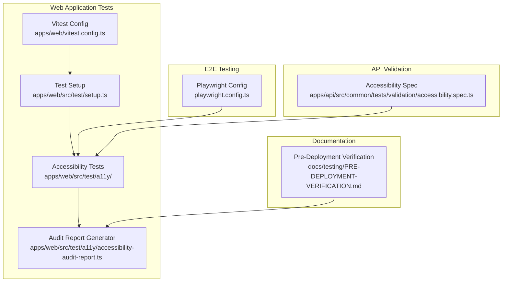
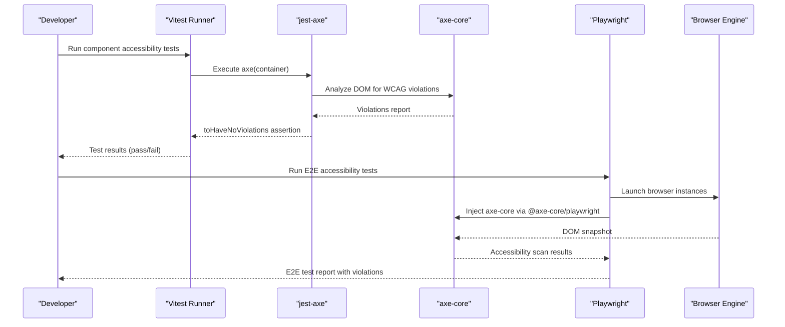
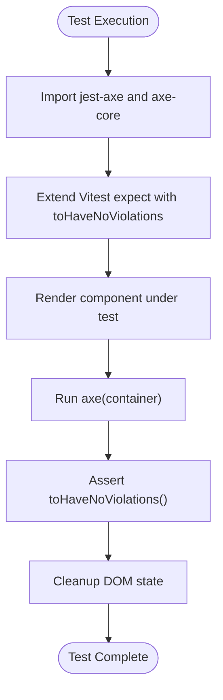
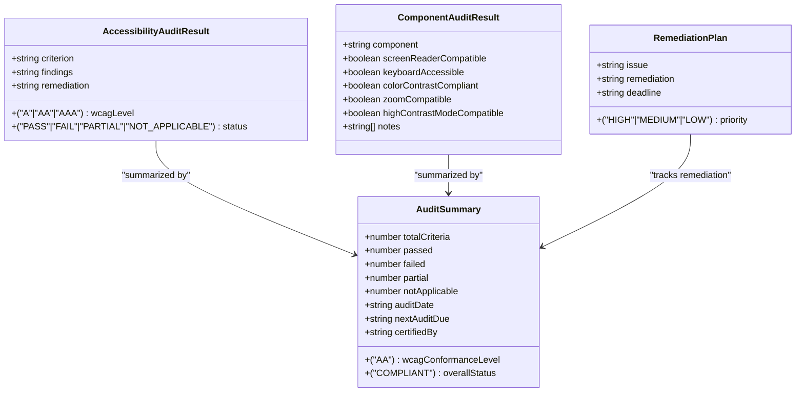
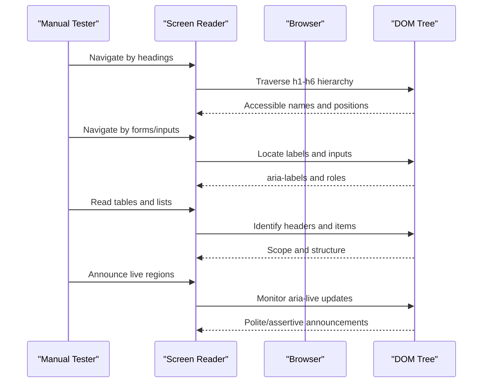
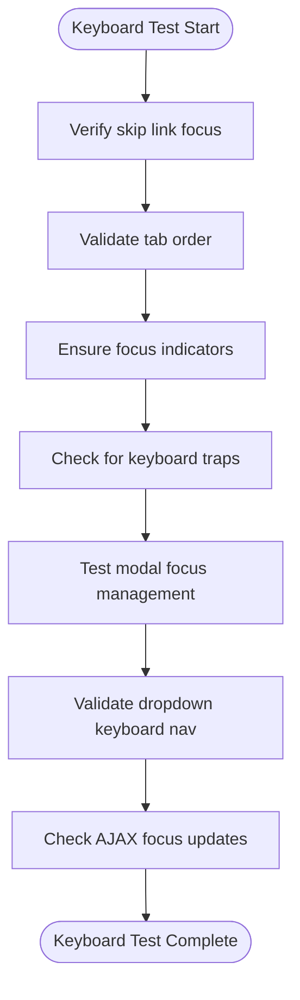
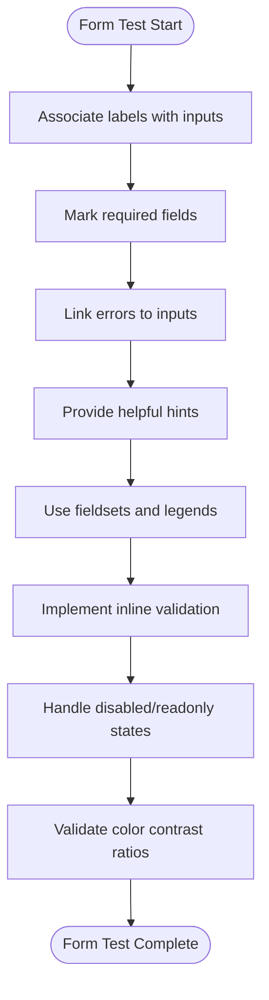
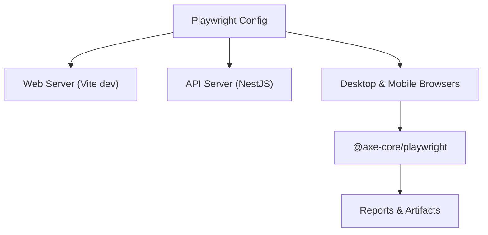
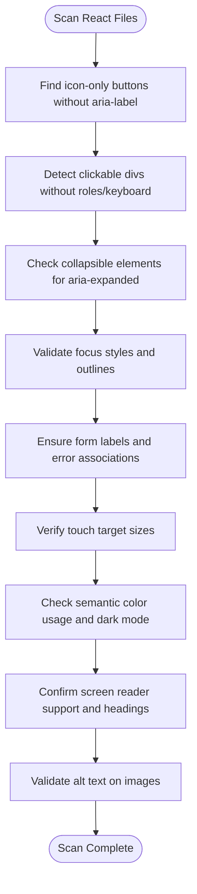
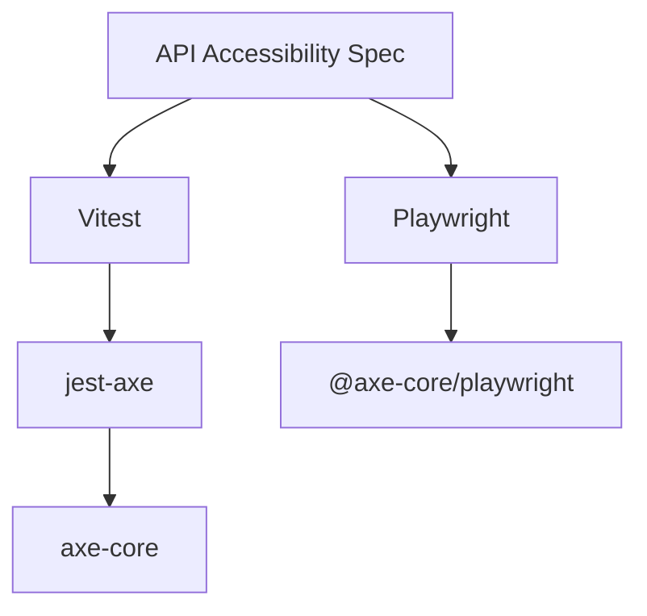

# Accessibility Testing

<cite>
**Referenced Files in This Document**
- [vitest.config.ts](file://apps/web/vitest.config.ts)
- [playwright.config.ts](file://playwright.config.ts)
- [setup.ts](file://apps/web/src/test/setup.ts)
- [accessibility-audit-report.ts](file://apps/web/src/test/a11y/accessibility-audit-report.ts)
- [BillingPage.a11y.test.tsx](file://apps/web/src/test/a11y/BillingPage.a11y.test.tsx)
- [keyboard-navigation.a11y.test.tsx](file://apps/web/src/test/a11y/keyboard-navigation.a11y.test.tsx)
- [screen-reader.a11y.test.tsx](file://apps/web/src/test/a11y/screen-reader.a11y.test.tsx)
- [color-contrast-forms.a11y.test.tsx](file://apps/web/src/test/a11y/color-contrast-forms.a11y.test.tsx)
- [accessibility.spec.ts](file://apps/api/src/common/tests/validation/accessibility.spec.ts)
- [PRE-DEPLOYMENT-VERIFICATION.md](file://docs/testing/PRE-DEPLOYMENT-VERIFICATION.md)
</cite>

## Table of Contents
1. [Introduction](#introduction)
2. [Project Structure](#project-structure)
3. [Core Components](#core-components)
4. [Architecture Overview](#architecture-overview)
5. [Detailed Component Analysis](#detailed-component-analysis)
6. [Dependency Analysis](#dependency-analysis)
7. [Performance Considerations](#performance-considerations)
8. [Troubleshooting Guide](#troubleshooting-guide)
9. [Conclusion](#conclusion)
10. [Appendices](#appendices)

## Introduction
This document defines the accessibility testing framework for Quiz-to-Build, detailing automated audit tools, manual validation procedures, and WCAG 2.2 Level AA compliance verification. It covers screen reader validation, keyboard navigation assessment, and accessibility testing for form controls, navigation elements, and interactive components. The guide also provides guidelines for designing test cases, detecting violations, tracking remediation, integrating accessibility into the development workflow, and maintaining continuous monitoring.

## Project Structure
The accessibility testing suite is integrated into the web application's test configuration and includes dedicated test suites for automated component-level checks and comprehensive manual validation protocols.

**Diagram sources**
- [vitest.config.ts:1-45](file://apps/web/vitest.config.ts#L1-L45)
- [setup.ts:1-72](file://apps/web/src/test/setup.ts#L1-L72)
- [accessibility-audit-report.ts:1-721](file://apps/web/src/test/a11y/accessibility-audit-report.ts#L1-L721)
- [playwright.config.ts:1-133](file://playwright.config.ts#L1-L133)
- [accessibility.spec.ts:1-444](file://apps/api/src/common/tests/validation/accessibility.spec.ts#L1-L444)
- [PRE-DEPLOYMENT-VERIFICATION.md:518-550](file://docs/testing/PRE-DEPLOYMENT-VERIFICATION.md#L518-L550)

**Section sources**
- [vitest.config.ts:1-45](file://apps/web/vitest.config.ts#L1-L45)
- [setup.ts:1-72](file://apps/web/src/test/setup.ts#L1-L72)
- [playwright.config.ts:1-133](file://playwright.config.ts#L1-L133)
- [accessibility.spec.ts:1-444](file://apps/api/src/common/tests/validation/accessibility.spec.ts#L1-L444)
- [PRE-DEPLOYMENT-VERIFICATION.md:518-550](file://docs/testing/PRE-DEPLOYMENT-VERIFICATION.md#L518-L550)

## Core Components
- Automated accessibility testing with jest-axe and axe-core integrated into Vitest for component-level checks.
- E2E accessibility validation using Playwright with @axe-core/playwright for cross-browser coverage.
- Comprehensive manual testing protocols for screen reader compatibility, keyboard navigation, zoom/magnification, and high contrast modes.
- WCAG 2.2 Level AA compliance audit report generator with detailed criteria tracking and remediation planning.
- Static validation of ARIA usage, focus management, form accessibility, and touch target sizes in the API test suite.

Key capabilities:
- Real-time violation detection during component tests.
- Structured audit reporting with pass/fail/partial/not applicable criteria.
- Remediation tracking with priority, issue, and deadline fields.
- Tooling inventory for automated and manual testing.

**Section sources**
- [setup.ts:1-72](file://apps/web/src/test/setup.ts#L1-L72)
- [accessibility-audit-report.ts:12-721](file://apps/web/src/test/a11y/accessibility-audit-report.ts#L12-L721)
- [accessibility.spec.ts:43-442](file://apps/api/src/common/tests/validation/accessibility.spec.ts#L43-L442)

## Architecture Overview
The accessibility testing architecture combines unit-level component tests, E2E browser validation, and static code analysis to ensure inclusive design across the application.

**Diagram sources**
- [vitest.config.ts:7-35](file://apps/web/vitest.config.ts#L7-L35)
- [setup.ts:55-64](file://apps/web/src/test/setup.ts#L55-L64)
- [playwright.config.ts:57-92](file://playwright.config.ts#L57-L92)

## Detailed Component Analysis

### Automated Accessibility Testing Framework
The framework integrates jest-axe with axe-core for automated component-level accessibility validation. The setup extends Vitest's expect with custom matchers and ensures cleanup after each test.

Implementation highlights:
- Custom matcher registration for toHaveNoViolations.
- Polyfills for localStorage and window.matchMedia to support jsdom environment.
- Cleanup hook to reset DOM state between tests.

**Diagram sources**
- [setup.ts:1-72](file://apps/web/src/test/setup.ts#L1-L72)

**Section sources**
- [setup.ts:1-72](file://apps/web/src/test/setup.ts#L1-L72)

### WCAG 2.2 Level AA Compliance Audit
The audit report generator consolidates WCAG criteria results, component-specific audits, and manual testing checklists into a structured compliance document. It includes pass rates, overall status, and remediation planning.

Key elements:
- WCAG criteria tracking with PASS/FAIL/PARTIAL/NOT_APPLICABLE statuses.
- Component audit results covering screen reader compatibility, keyboard accessibility, color contrast, zoom compatibility, and high contrast mode.
- Manual testing checklists for screen reader, keyboard navigation, zoom/magnification, and high contrast mode.
- Remediation plan with priority, issue, remediation steps, and deadlines.

**Diagram sources**
- [accessibility-audit-report.ts:12-635](file://apps/web/src/test/a11y/accessibility-audit-report.ts#L12-L635)

**Section sources**
- [accessibility-audit-report.ts:12-721](file://apps/web/src/test/a11y/accessibility-audit-report.ts#L12-L721)

### Screen Reader Validation
Screen reader tests validate ARIA roles and labels, form accessibility, image alt text, live regions, and expanded/collapsed states. These tests ensure compatibility with NVDA, JAWS, and VoiceOver.

Coverage areas:
- Landmark roles and navigation labeling.
- Form labels, required fields, hints, and error announcements.
- Image alt text and role=img semantics.
- Live regions (status, alert, log, timer, progressbar).
- Expandable widgets (accordion, dropdown menu, details, tree, dialog).

**Diagram sources**
- [screen-reader.a11y.test.tsx:1-786](file://apps/web/src/test/a11y/screen-reader.a11y.test.tsx#L1-L786)

**Section sources**
- [screen-reader.a11y.test.tsx:1-786](file://apps/web/src/test/a11y/screen-reader.a11y.test.tsx#L1-L786)

### Keyboard Navigation Assessment
Keyboard navigation tests verify logical tab order, skip links, focus visibility, absence of keyboard traps, and proper focus management in modals, dropdowns, and AJAX updates.

Key validations:
- Skip link functionality and main content focusability.
- Logical tab order through forms and interactive regions.
- Focus trap in modals and focus restoration.
- Dropdown keyboard navigation with arrow keys and Enter/Escape.
- Error focus management and AJAX result focus.

**Diagram sources**
- [keyboard-navigation.a11y.test.tsx:1-755](file://apps/web/src/test/a11y/keyboard-navigation.a11y.test.tsx#L1-L755)

**Section sources**
- [keyboard-navigation.a11y.test.tsx:1-755](file://apps/web/src/test/a11y/keyboard-navigation.a11y.test.tsx#L1-L755)

### Form Controls and Interactive Components
Form accessibility tests validate labels, required fields, error messages, hints, fieldsets/legends, inline validation, and disabled states. Color contrast tests ensure WCAG AA compliance for text, UI components, and status colors.

Highlights:
- Form labels associated with inputs via htmlFor/id.
- aria-required, aria-invalid, and aria-describedby usage.
- Error summaries and links to specific fields.
- Inline validation with aria-live updates.
- Color contrast calculations and compliance thresholds.
- Disabled and readonly states with proper ARIA attributes.

**Diagram sources**
- [color-contrast-forms.a11y.test.tsx:1-800](file://apps/web/src/test/a11y/color-contrast-forms.a11y.test.tsx#L1-L800)

**Section sources**
- [color-contrast-forms.a11y.test.tsx:1-800](file://apps/web/src/test/a11y/color-contrast-forms.a11y.test.tsx#L1-L800)

### E2E Accessibility Testing
Playwright configuration launches multiple browser instances (Chromium, Firefox, Safari, mobile devices) and runs accessibility scans using @axe-core/playwright. The configuration includes web server startup for both web and API services, artifact collection, and CI-friendly settings.

Key aspects:
- Multi-browser device projects for desktop and mobile.
- Web server orchestration for frontend and backend.
- Trace, screenshot, and video capture on failures.
- Reporter configuration for HTML, JSON, and JUnit outputs.

**Diagram sources**
- [playwright.config.ts:57-132](file://playwright.config.ts#L57-L132)

**Section sources**
- [playwright.config.ts:1-133](file://playwright.config.ts#L1-L133)

### API-Level Accessibility Validation
The API accessibility spec performs static analysis of React components to enforce accessibility best practices:
- ARIA labels for icon-only buttons.
- Role attributes and keyboard handlers for clickable divs.
- aria-expanded on collapsible elements.
- Focus management and visible focus styles.
- Form accessibility and error association.
- Touch target sizes and semantic color usage.
- Screen reader support and heading hierarchy.
- Image alt text requirements.

**Diagram sources**
- [accessibility.spec.ts:43-442](file://apps/api/src/common/tests/validation/accessibility.spec.ts#L43-L442)

**Section sources**
- [accessibility.spec.ts:1-444](file://apps/api/src/common/tests/validation/accessibility.spec.ts#L1-L444)

## Dependency Analysis
The accessibility testing stack relies on several key dependencies and integrations:

- Vitest environment with jsdom for DOM simulation.
- jest-axe and axe-core for automated accessibility scanning.
- Playwright for cross-browser E2E accessibility validation.
- Static analysis in the API spec for codebase-wide compliance checks.

**Diagram sources**
- [setup.ts:55-64](file://apps/web/src/test/setup.ts#L55-L64)
- [playwright.config.ts:57-92](file://playwright.config.ts#L57-L92)
- [accessibility.spec.ts:43-442](file://apps/api/src/common/tests/validation/accessibility.spec.ts#L43-L442)

**Section sources**
- [setup.ts:1-72](file://apps/web/src/test/setup.ts#L1-L72)
- [playwright.config.ts:1-133](file://playwright.config.ts#L1-L133)
- [accessibility.spec.ts:1-444](file://apps/api/src/common/tests/validation/accessibility.spec.ts#L1-L444)

## Performance Considerations
- Keep accessibility tests focused on critical user flows and components to minimize runtime overhead.
- Use targeted selectors and avoid excessive DOM queries in component tests.
- Leverage Playwright's parallel execution for E2E tests while managing resource usage in CI.
- Cache axe-core results where appropriate and avoid redundant scans in the same test run.
- Prefer lightweight assertions (toHaveNoViolations) over complex DOM traversal in unit tests.

## Troubleshooting Guide
Common issues and resolutions:
- Missing ARIA labels on icon-only buttons: Add aria-label or aria-labelledby attributes to provide accessible names.
- Clickable divs without roles: Assign role="button" or similar and implement keyboard event handlers and tabIndex.
- Collapsible elements missing aria-expanded: Ensure aria-expanded reflects the current state (true/false).
- Focus styles removed without replacement: Restore focus-visible styles or use accessible focus rings.
- Form inputs without labels: Associate labels via htmlFor/id or use aria-label; provide aria-describedby for hints and errors.
- Insufficient touch targets: Increase minimum size to at least 44px (or equivalent CSS units).
- Poor color contrast: Adjust colors to meet 4.5:1 for normal text and 3:1 for UI components; use semantic color tokens.
- Missing alt text on images: Provide descriptive alt text for informative images; empty alt for decorative images; role="img" with aria-label for complex images.

**Section sources**
- [accessibility.spec.ts:43-442](file://apps/api/src/common/tests/validation/accessibility.spec.ts#L43-L442)
- [color-contrast-forms.a11y.test.tsx:518-602](file://apps/web/src/test/a11y/color-contrast-forms.a11y.test.tsx#L518-L602)

## Conclusion
Quiz-to-Build employs a robust accessibility testing framework combining automated component-level validation, E2E browser testing, and manual verification procedures. The framework ensures WCAG 2.2 Level AA compliance across forms, navigation, and interactive components, with comprehensive audit reporting and remediation tracking. By integrating accessibility checks into the development workflow and maintaining continuous monitoring, the project upholds inclusive design principles and delivers a high-quality user experience for all users.

## Appendices

### Accessibility Testing Workflow
- Develop: Write component tests with jest-axe assertions and manual test scenarios.
- Validate: Run Vitest component tests locally and in CI.
- Verify: Execute Playwright E2E tests across browsers.
- Document: Generate WCAG audit report and update remediation plan.
- Monitor: Track violations and remediation progress continuously.

### Tools Inventory
- Automated: axe-core, jest-axe, @axe-core/playwright, ESLint jsx-a11y plugin.
- Manual: NVDA, JAWS, VoiceOver, Chrome DevTools, WAVE browser extension.
- Reporting: HTML, JSON, JUnit reporters for test artifacts.

**Section sources**
- [accessibility-audit-report.ts:637-651](file://apps/web/src/test/a11y/accessibility-audit-report.ts#L637-L651)
- [PRE-DEPLOYMENT-VERIFICATION.md:518-550](file://docs/testing/PRE-DEPLOYMENT-VERIFICATION.md#L518-L550)