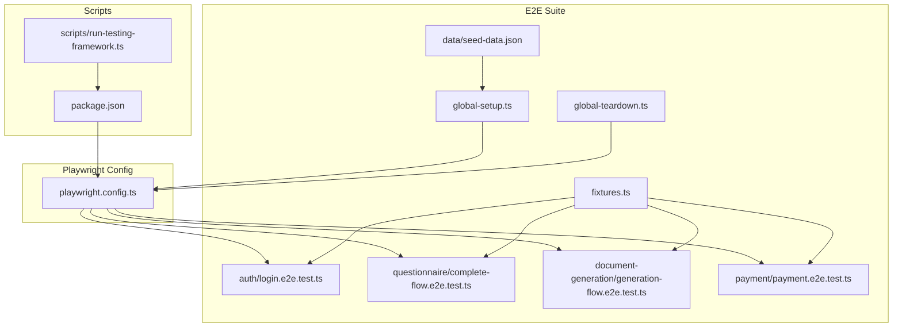
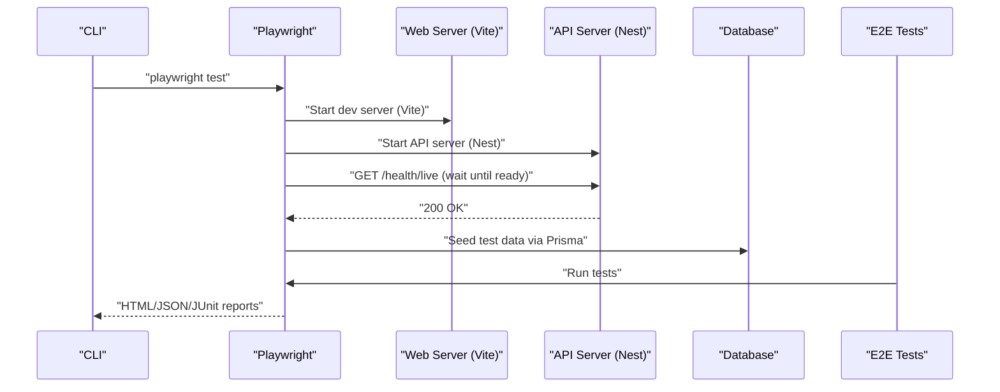
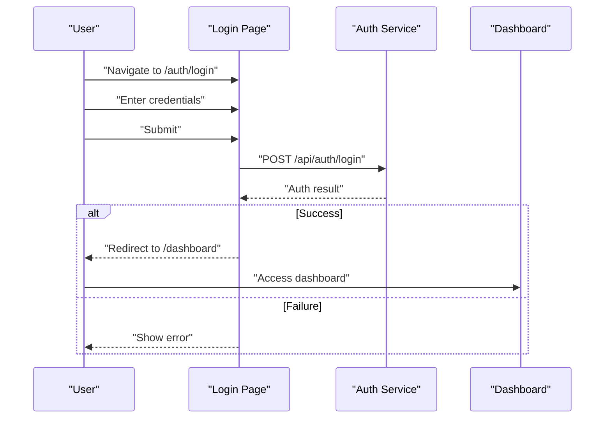
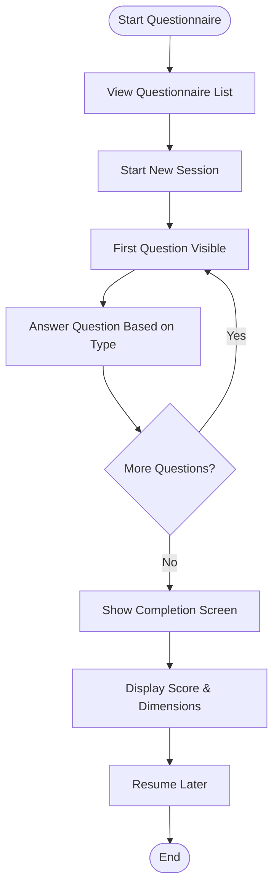
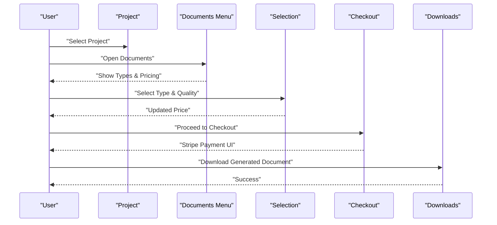
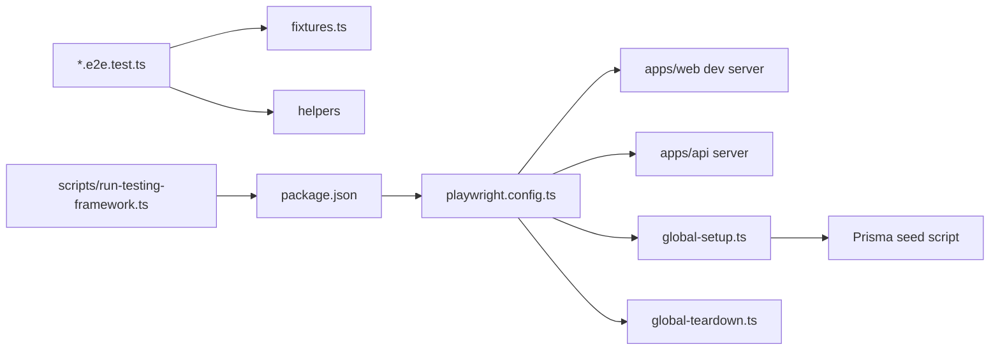

# End-to-End Testing

<cite>
**Referenced Files in This Document**
- [playwright.config.ts](file://playwright.config.ts)
- [global-setup.ts](file://e2e/global-setup.ts)
- [global-teardown.ts](file://e2e/global-teardown.ts)
- [fixtures.ts](file://e2e/fixtures.ts)
- [login.e2e.test.ts](file://e2e/auth/login.e2e.test.ts)
- [complete-flow.e2e.test.ts](file://e2e/questionnaire/complete-flow.e2e.test.ts)
- [generation-flow.e2e.test.ts](file://e2e/document-generation/generation-flow.e2e.test.ts)
- [payment.e2e.test.ts](file://e2e/payment/payment.e2e.test.ts)
- [seed-data.json](file://e2e/data/seed-data.json)
- [package.json](file://package.json)
- [run-testing-framework.ts](file://scripts/run-testing-framework.ts)
- [jest.config.js](file://jest.config.js)
- [jest-e2e.json](file://apps/api/test/jest-e2e.json)
</cite>

## Table of Contents
1. [Introduction](#introduction)
2. [Project Structure](#project-structure)
3. [Core Components](#core-components)
4. [Architecture Overview](#architecture-overview)
5. [Detailed Component Analysis](#detailed-component-analysis)
6. [Dependency Analysis](#dependency-analysis)
7. [Performance Considerations](#performance-considerations)
8. [Troubleshooting Guide](#troubleshooting-guide)
9. [Conclusion](#conclusion)
10. [Appendices](#appendices)

## Introduction
This document provides comprehensive end-to-end testing documentation for Quiz-to-Build’s user journey validation. It explains the Playwright configuration, test scenarios, and automation framework setup. It details E2E test implementation for critical user flows (authentication, questionnaire completion, document generation, and payments), environment management, browser automation, and reporting. It also includes guidelines for writing reliable E2E tests, handling dynamic content, managing test data, execution strategies, parallelization, CI/CD integration, common challenges, debugging techniques, and maintenance approaches.

## Project Structure
The E2E test suite is organized under the e2e directory with feature-based grouping:
- Authentication flows: login, logout, session management, password reset, admin access
- Questionnaire flows: all 11 question types, progress tracking, completion, scoring
- Document generation: document selection, checkout, payment, downloads, previews
- Payment: subscription management, invoices, and Stripe integration placeholders
- Shared fixtures and helpers: reusable test data, API utilities, wait/assert/mocking helpers
- Environment bootstrapping: global setup/teardown for seeding and server readiness

**Diagram sources**
- [playwright.config.ts:1-133](file://playwright.config.ts#L1-L133)
- [login.e2e.test.ts:1-298](file://e2e/auth/login.e2e.test.ts#L1-L298)
- [complete-flow.e2e.test.ts:1-395](file://e2e/questionnaire/complete-flow.e2e.test.ts#L1-L395)
- [generation-flow.e2e.test.ts:1-302](file://e2e/document-generation/generation-flow.e2e.test.ts#L1-L302)
- [payment.e2e.test.ts:1-523](file://e2e/payment/payment.e2e.test.ts#L1-L523)
- [fixtures.ts:1-837](file://e2e/fixtures.ts#L1-L837)
- [global-setup.ts:1-70](file://e2e/global-setup.ts#L1-L70)
- [global-teardown.ts:1-31](file://e2e/global-teardown.ts#L1-L31)
- [seed-data.json:1-54](file://e2e/data/seed-data.json#L1-L54)
- [run-testing-framework.ts:1-479](file://scripts/run-testing-framework.ts#L1-L479)
- [package.json:15-40](file://package.json#L15-L40)

**Section sources**
- [playwright.config.ts:1-133](file://playwright.config.ts#L1-L133)
- [fixtures.ts:1-837](file://e2e/fixtures.ts#L1-L837)
- [global-setup.ts:1-70](file://e2e/global-setup.ts#L1-L70)
- [global-teardown.ts:1-31](file://e2e/global-teardown.ts#L1-L31)
- [seed-data.json:1-54](file://e2e/data/seed-data.json#L1-L54)
- [package.json:15-40](file://package.json#L15-L40)

## Core Components
- Playwright configuration defines test discovery, parallelism, reporters, timeouts, device projects, and automatic web server startup for frontend and API.
- Global setup waits for API health, seeds test data via Prisma, and global teardown cleans up test data.
- Fixtures provide reusable test users, questionnaires, responses, evidence, subscriptions, Stripe test cards, approvals, documents, and sessions. It also exposes helper utilities for login, navigation, answers, API requests, data loading, waiting, mocking, and assertions.
- Feature-specific test suites validate user journeys across authentication, questionnaire flows, document generation, and payment.

Key capabilities:
- Multi-browser projects (Chromium, Firefox, WebKit, mobile devices)
- Trace, screenshot, and video capture on failures
- Automatic server orchestration for local runs
- Extensive fixtures and helper utilities for robust, maintainable tests

**Section sources**
- [playwright.config.ts:7-133](file://playwright.config.ts#L7-L133)
- [global-setup.ts:9-67](file://e2e/global-setup.ts#L9-L67)
- [global-teardown.ts:9-28](file://e2e/global-teardown.ts#L9-L28)
- [fixtures.ts:12-837](file://e2e/fixtures.ts#L12-L837)

## Architecture Overview
The E2E architecture integrates Playwright with the application stack and external services:
- Playwright launches the web app and API server automatically during local runs.
- Tests use fixtures and helpers to interact with UI and APIs.
- Global setup ensures the API is healthy and test data is seeded.
- Reports and artifacts are produced in structured formats for CI/CD consumption.

**Diagram sources**
- [playwright.config.ts:101-123](file://playwright.config.ts#L101-L123)
- [global-setup.ts:18-44](file://e2e/global-setup.ts#L18-L44)
- [package.json:31-35](file://package.json#L31-L35)

## Detailed Component Analysis

### Playwright Configuration
- Test discovery: e2e directory with pattern matching for .e2e.test.ts files.
- Parallelism: fully parallel enabled; CI limits workers to 1; retries on CI.
- Reporters: HTML, JSON, JUnit; artifacts stored under e2e/reports.
- Browser projects: desktop (Chrome, Firefox, Safari) and mobile (Pixel 5, iPhone 12).
- Global setup/teardown: orchestrated via global-setup.ts and global-teardown.ts.
- Web server orchestration: starts apps/web dev server and apps/api server; respects PLAYWRIGHT_NO_WEBSERVER to connect to existing servers.
- Timeouts: test timeout, expect timeout, action/navigation timeouts configured.

Best practices:
- Keep fullyParallel enabled for speed; rely on CI worker limits.
- Use trace/video/screenshot sparingly; enable only on failure to reduce artifact size.
- Prefer explicit waits and selectors over arbitrary sleeps.

**Section sources**
- [playwright.config.ts:8-133](file://playwright.config.ts#L8-L133)

### Global Setup and Teardown
- Global setup:
  - Waits for API health endpoint with retries.
  - Seeds test data via Prisma using a TypeScript seed script.
  - Logs progress and errors for visibility.
- Global teardown:
  - Cleans up test data using the same seed script with a cleanup flag.

Guidelines:
- Ensure API_URL and base URLs are correctly configured.
- Keep seed scripts idempotent to avoid flaky setups.
- Monitor teardown warnings; non-critical failures should not block CI.

**Section sources**
- [global-setup.ts:9-67](file://e2e/global-setup.ts#L9-L67)
- [global-teardown.ts:9-28](file://e2e/global-teardown.ts#L9-L28)

### Fixtures and Helpers
- Users: predefined roles (admin, moderator, user, professional, enterprise) and a dynamically generated new user.
- Questionnaires: metadata for multiple templates.
- Responses: fixtures for all 11 question types.
- Evidence: document, image, code, link, CI artifact examples.
- Subscriptions: FREE, PROFESSIONAL, ENTERPRISE with pricing and features.
- Stripe test cards: multiple card scenarios for payment flows.
- Approvals and documents: workflow and generation fixtures.
- Sessions: active, completed, abandoned session states.
- Helpers:
  - TestHelpers: login, logout, navigate, answer questions, wait for API responses, screenshots, state clearing, file uploads, visibility checks, loading waits.
  - ApiUtils: token retrieval, session creation, response submission, session retrieval, admin cleanup.
  - DataLoader: load fixtures, create test files, random data generators.
  - WaitUtils: network idle, text change, toast, retry actions.
  - MockUtils: route mocking, error injection, slow responses, cleanup.
  - AssertionUtils: element counts, URL checks, local storage, console error detection.

Recommendations:
- Centralize common interactions in helpers to reduce duplication.
- Use typed fixtures to improve readability and maintainability.
- Prefer explicit waits and retries for flaky UI interactions.

**Section sources**
- [fixtures.ts:12-837](file://e2e/fixtures.ts#L12-L837)

### Authentication Flow Tests
Key validations:
- Form presence and OAuth buttons.
- Successful login, invalid credentials, email format validation, missing password.
- Session persistence across reloads, logout behavior, protected route redirects, intended page redirection after login, user info display, session expiration handling.
- Password reset flow: form presence, email sending, validation, navigation, token handling, new password requirements, invalid token.
- Admin access: admin login grants admin panel access; regular user blocked.

Implementation highlights:
- Uses authenticated fixtures to streamline login steps.
- Leverages TestHelpers for consistent navigation and assertions.
- Validates redirects and error messages.

**Diagram sources**
- [login.e2e.test.ts:28-52](file://e2e/auth/login.e2e.test.ts#L28-L52)
- [fixtures.ts:396-416](file://e2e/fixtures.ts#L396-L416)

**Section sources**
- [login.e2e.test.ts:8-194](file://e2e/auth/login.e2e.test.ts#L8-L194)
- [fixtures.ts:396-416](file://e2e/fixtures.ts#L396-L416)

### Questionnaire Flow Tests
Coverage:
- Questionnaire list display and starting a session.
- Progress counters and navigation.
- All 11 question types: Boolean, Scale, Text, Single Choice, Multiple Choice, Dropdown, Percentage, Date, Number, Matrix, File Upload.
- Skipping optional questions, best practice guidance, progress updates.
- Completion: completion screen, score display, dimension breakdown, heatmap, resuming sessions.
- Validation: required questions, percentage range, text minimum length.

Implementation highlights:
- Dynamic question type handling with targeted locators.
- File upload simulation with buffered content.
- Resilient progress assertions.

**Diagram sources**
- [complete-flow.e2e.test.ts:26-260](file://e2e/questionnaire/complete-flow.e2e.test.ts#L26-L260)

**Section sources**
- [complete-flow.e2e.test.ts:8-395](file://e2e/questionnaire/complete-flow.e2e.test.ts#L8-L395)

### Document Generation Flow Tests
Coverage:
- Document menu: available types, pricing, quality levels, availability indicators.
- Selection: document type and quality level selection, price updates.
- Checkout: navigation to payment, Stripe iframe presence.
- Generated documents: list, download buttons.
- Preview: document preview modal.
- Formats: multiple download formats (PDF, DOCX).

Implementation highlights:
- Helper functions for login and project navigation.
- Robust selectors for dynamic content and Stripe frames.

**Diagram sources**
- [generation-flow.e2e.test.ts:28-251](file://e2e/document-generation/generation-flow.e2e.test.ts#L28-L251)

**Section sources**
- [generation-flow.e2e.test.ts:1-302](file://e2e/document-generation/generation-flow.e2e.test.ts#L1-L302)

### Payment Flow Tests
Coverage:
- Billing page: current plan, subscription details for paid users, upgrade options for free users.
- Upgrade flow: pricing tiers, feature comparison placeholder, checkout initiation placeholder.
- Checkout process: Stripe form presence, payment with test cards, declined card handling, validation, coupon code, invalid coupon.
- Subscription management: manage subscription options, update payment method, change billing cycle, cancel subscription, downgrade options.
- Invoice history: invoice list, download PDF placeholder, filtering, detail view.
- Feature gating: upgrade prompts for premium features, usage limits display.
- Enterprise contact: contact form and submission.
- Error recovery: payment failure and retry, 3D Secure authentication.

Notes:
- Many checkout and management features are currently marked as skipped; tests serve as placeholders for future implementation.

**Section sources**
- [payment.e2e.test.ts:21-523](file://e2e/payment/payment.e2e.test.ts#L21-L523)

## Dependency Analysis
- Playwright configuration depends on:
  - apps/web dev server (Vite) for frontend
  - apps/api server (Nest) for backend
  - Prisma seed scripts for test data
- Tests depend on fixtures and helpers for:
  - Authentication flows
  - Questionnaire interactions
  - Document generation and payment workflows
- Scripts integrate Playwright with the universal testing framework for CI/CD.

**Diagram sources**
- [playwright.config.ts:101-123](file://playwright.config.ts#L101-L123)
- [global-setup.ts:49-64](file://e2e/global-setup.ts#L49-L64)
- [global-teardown.ts:12-25](file://e2e/global-teardown.ts#L12-L25)
- [fixtures.ts:1-837](file://e2e/fixtures.ts#L1-L837)
- [run-testing-framework.ts:272-285](file://scripts/run-testing-framework.ts#L272-L285)
- [package.json:31-35](file://package.json#L31-L35)

**Section sources**
- [playwright.config.ts:101-123](file://playwright.config.ts#L101-L123)
- [run-testing-framework.ts:272-285](file://scripts/run-testing-framework.ts#L272-L285)
- [package.json:31-35](file://package.json#L31-L35)

## Performance Considerations
- Parallelism: fully parallel enabled; CI worker limit reduces contention.
- Retries: CI enables retries to mitigate flakiness.
- Artifacts: trace, video, and screenshots on failure increase runtime; scope to failing tests only.
- Network waits: use explicit waits and route mocking judiciously to avoid unnecessary delays.
- Data seeding: keep seed scripts efficient and idempotent to minimize setup time.

## Troubleshooting Guide
Common issues and resolutions:
- API not ready:
  - Symptom: setup fails with timeout.
  - Resolution: verify API_URL and health endpoint; ensure apps/api server starts successfully.
- Flaky UI interactions:
  - Symptom: intermittent failures on dynamic content.
  - Resolution: use WaitUtils, explicit waits, and TestHelpers; avoid hard-coded sleeps.
- Selector instability:
  - Symptom: tests fail due to changing selectors.
  - Resolution: prefer data-testid attributes; centralize selectors in helpers.
- Mobile viewport issues:
  - Symptom: layout differences on mobile projects.
  - Resolution: adjust viewport sizes; test on multiple device projects.
- Artifact bloat:
  - Symptom: large reports and videos.
  - Resolution: disable video/trace except on failure; archive selectively.
- Data cleanup:
  - Symptom: test data persists across runs.
  - Resolution: ensure global-teardown runs and seed cleanup logic is effective.

**Section sources**
- [global-setup.ts:18-44](file://e2e/global-setup.ts#L18-L44)
- [fixtures.ts:645-694](file://e2e/fixtures.ts#L645-L694)

## Conclusion
The Quiz-to-Build E2E testing framework leverages Playwright with a robust configuration, centralized fixtures, and comprehensive test suites covering authentication, questionnaire flows, document generation, and payment workflows. The setup/teardown pipeline ensures consistent environments, while helpers and utilities promote reliability and maintainability. By following the guidelines and troubleshooting strategies outlined here, teams can effectively validate user journeys, integrate with CI/CD, and sustain high-quality automated UI validation.

## Appendices

### Test Execution Strategies and CI/CD Integration
- Local runs:
  - Headless: npm run test:e2e
  - Headed: npm run test:e2e:headed
  - UI mode: npm run test:e2e:ui
  - Manual servers: PLAYWRIGHT_NO_WEBSERVER=1 npm run test:e2e:local
- Reporting:
  - Open HTML report: npm run test:e2e:report
- CI:
  - Use npm run test:e2e in CI; leverage workers=1 and retries=2 for stability.
  - Publish reports/artifacts from e2e/reports and e2e/test-results.
- Universal testing framework:
  - Pre-deploy: npm run test:framework:pre
  - Post-deploy: npm run test:framework:post
  - Quick smoke: npm run test:framework:quick

**Section sources**
- [package.json:31-35](file://package.json#L31-L35)
- [run-testing-framework.ts:427-479](file://scripts/run-testing-framework.ts#L427-L479)

### Guidelines for Writing Reliable E2E Tests
- Use fixtures for test data and helpers for common actions.
- Prefer explicit waits and selectors; avoid brittle text-based selectors.
- Isolate tests; rely on global setup/teardown for environment preparation.
- Mock external services when appropriate; use MockUtils for controlled scenarios.
- Keep tests focused on user journeys; group related flows in describe blocks.
- Capture screenshots and traces only on failure to reduce noise.

### Managing Test Data
- Seed data via Prisma using global setup; ensure idempotency.
- Use DataLoader for dynamic test files and random data generation.
- Clean up test data in global teardown to prevent cross-test contamination.

### Handling Dynamic Content
- Use TestHelpers.waitForLoading and WaitUtils for network idle and element visibility.
- Employ MockUtils to simulate API responses and errors.
- Validate dynamic content with AssertionUtils for robust checks.

### Debugging Techniques
- Enable headed mode for interactive debugging.
- Use trace and video captures on first retry to inspect failures.
- Inspect console errors with AssertionUtils.assertNoConsoleErrors.
- Leverage Playwright UI mode for visual debugging.