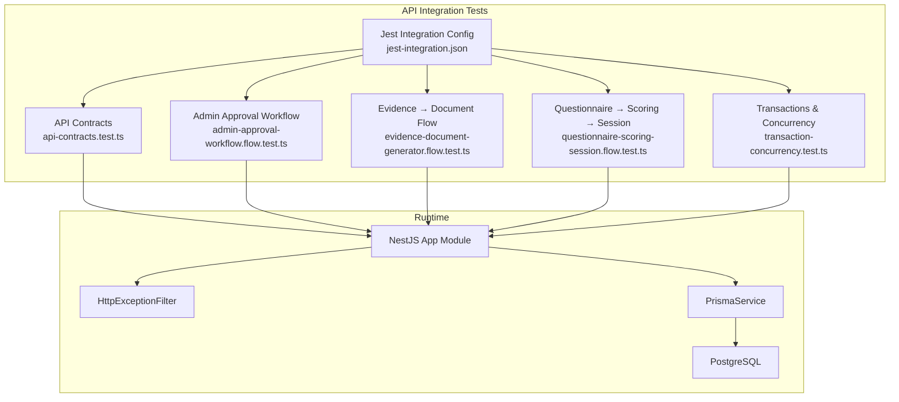
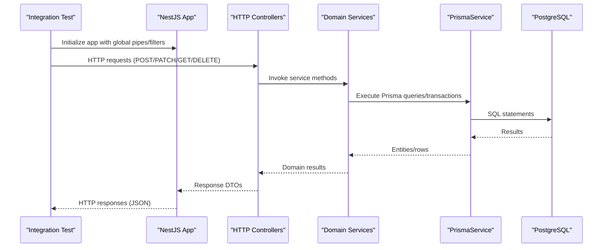
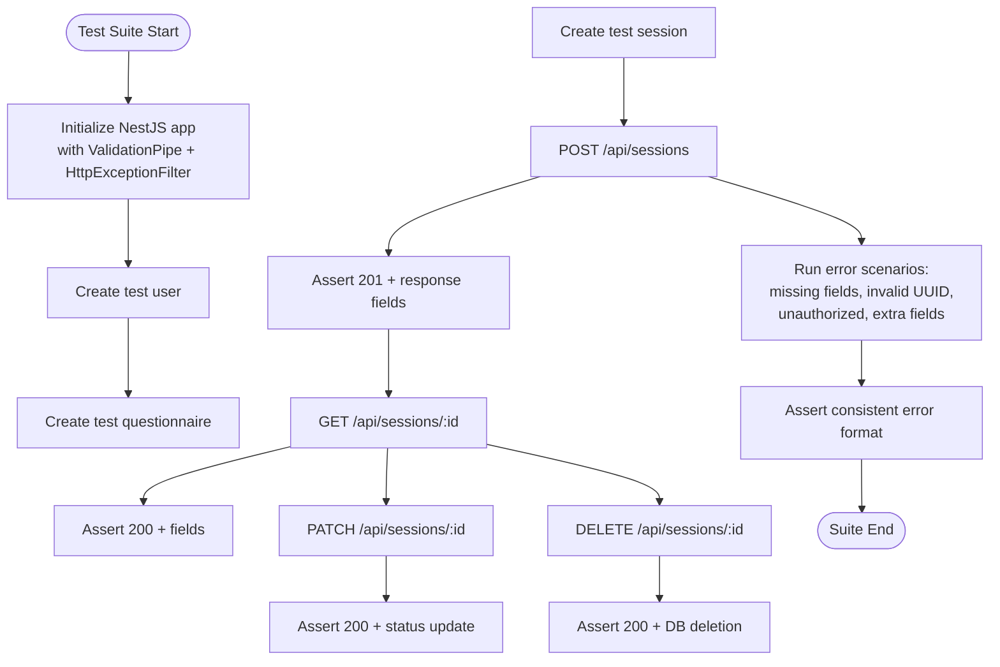
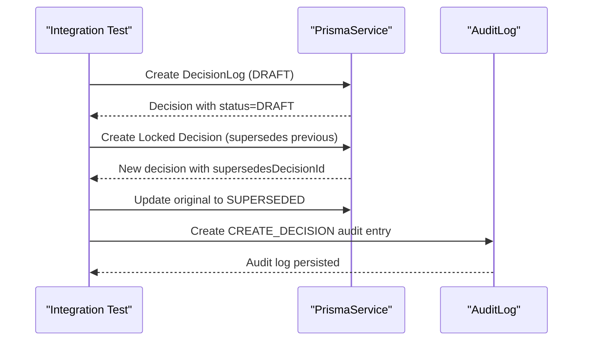
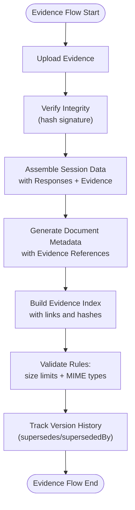
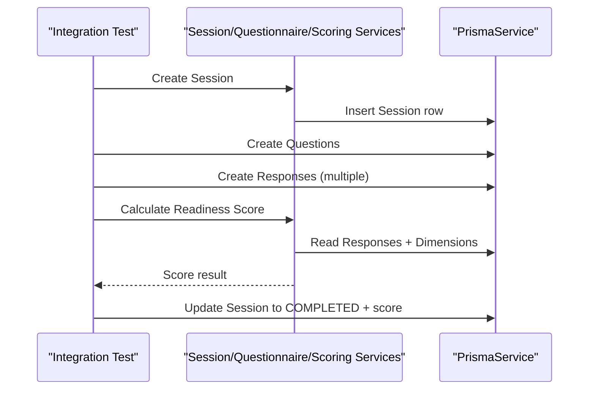
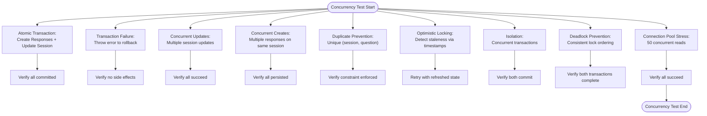
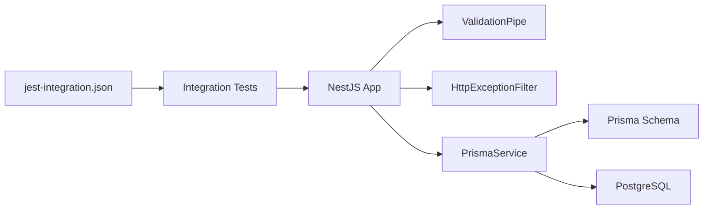

# Integration Testing

<cite>
**Referenced Files in This Document**
- [api-contracts.test.ts](file://apps/api/test/integration/api-contracts.test.ts)
- [admin-approval-workflow.flow.test.ts](file://apps/api/test/integration/admin-approval-workflow.flow.test.ts)
- [evidence-document-generator.flow.test.ts](file://apps/api/test/integration/evidence-document-generator.flow.test.ts)
- [questionnaire-scoring-session.flow.test.ts](file://apps/api/test/integration/questionnaire-scoring-session.flow.test.ts)
- [transaction-concurrency.test.ts](file://apps/api/test/integration/transaction-concurrency.test.ts)
- [jest-integration.json](file://apps/api/test/jest-integration.json)
- [jest-e2e.json](file://apps/api/test/jest-e2e.json)
- [http-exception.filter.ts](file://apps/api/src/common/filters/http-exception.filter.ts)
- [prisma.service.ts](file://libs/database/src/prisma.service.ts)
- [prisma.config.ts](file://prisma/prisma.config.ts)
- [schema.prisma](file://prisma/schema.prisma)
</cite>

## Table of Contents
1. [Introduction](#introduction)
2. [Project Structure](#project-structure)
3. [Core Components](#core-components)
4. [Architecture Overview](#architecture-overview)
5. [Detailed Component Analysis](#detailed-component-analysis)
6. [Dependency Analysis](#dependency-analysis)
7. [Performance Considerations](#performance-considerations)
8. [Troubleshooting Guide](#troubleshooting-guide)
9. [Conclusion](#conclusion)
10. [Appendices](#appendices)

## Introduction
This document defines the integration testing strategy for Quiz-to-Build. It covers the integration test suite that validates API contracts, database interactions, and cross-service workflows. It explains test scenarios for workflow validation, transaction handling, and concurrency, along with environment setup, test data preparation, cleanup, and execution guidance. It also addresses performance, isolation, monitoring, and debugging approaches tailored to the system’s NestJS-based API, Prisma ORM, and PostgreSQL backend.

## Project Structure
The integration tests reside under the API application’s test directory and are configured via Jest. They exercise real database operations and service integrations, validating end-to-end flows across modules such as sessions, scoring, evidence registry, and document generation.

**Diagram sources**
- [jest-integration.json:1-27](file://apps/api/test/jest-integration.json#L1-L27)
- [api-contracts.test.ts:1-419](file://apps/api/test/integration/api-contracts.test.ts#L1-L419)
- [admin-approval-workflow.flow.test.ts:1-247](file://apps/api/test/integration/admin-approval-workflow.flow.test.ts#L1-L247)
- [evidence-document-generator.flow.test.ts:1-534](file://apps/api/test/integration/evidence-document-generator.flow.test.ts#L1-L534)
- [questionnaire-scoring-session.flow.test.ts:1-435](file://apps/api/test/integration/questionnaire-scoring-session.flow.test.ts#L1-L435)
- [transaction-concurrency.test.ts:1-654](file://apps/api/test/integration/transaction-concurrency.test.ts#L1-L654)
- [http-exception.filter.ts:1-102](file://apps/api/src/common/filters/http-exception.filter.ts#L1-L102)
- [prisma.service.ts:1-119](file://libs/database/src/prisma.service.ts#L1-L119)

**Section sources**
- [jest-integration.json:1-27](file://apps/api/test/jest-integration.json#L1-L27)
- [jest-e2e.json:1-21](file://apps/api/test/jest-e2e.json#L1-L21)

## Core Components
- API Contracts: Validates HTTP endpoint contracts, strict request validation, error response formats, content-type headers, pagination, and CORS behavior.
- Admin Approval Workflow: Documents expected behavior for DecisionLog append-only workflow and audit trails.
- Evidence → Document Flow: Exercises evidence ingestion, integrity verification, and document generation metadata composition.
- Questionnaire → Scoring → Session: Exercises session lifecycle, response coverage, scoring engine integration, and progress tracking.
- Transactions & Concurrency: Validates atomic transactions, rollbacks, concurrent writes, optimistic locking, isolation, and deadlock prevention.

**Section sources**
- [api-contracts.test.ts:1-419](file://apps/api/test/integration/api-contracts.test.ts#L1-L419)
- [admin-approval-workflow.flow.test.ts:1-247](file://apps/api/test/integration/admin-approval-workflow.flow.test.ts#L1-L247)
- [evidence-document-generator.flow.test.ts:1-534](file://apps/api/test/integration/evidence-document-generator.flow.test.ts#L1-L534)
- [questionnaire-scoring-session.flow.test.ts:1-435](file://apps/api/test/integration/questionnaire-scoring-session.flow.test.ts#L1-L435)
- [transaction-concurrency.test.ts:1-654](file://apps/api/test/integration/transaction-concurrency.test.ts#L1-L654)

## Architecture Overview
Integration tests run against a real NestJS application instance and a live PostgreSQL database. Prisma manages database connectivity and connection pooling. Error handling is standardized via a global exception filter that ensures consistent error responses.

**Diagram sources**
- [api-contracts.test.ts:26-43](file://apps/api/test/integration/api-contracts.test.ts#L26-L43)
- [http-exception.filter.ts:26-82](file://apps/api/src/common/filters/http-exception.filter.ts#L26-L82)
- [prisma.service.ts:73-97](file://libs/database/src/prisma.service.ts#L73-L97)

## Detailed Component Analysis

### API Contracts Integration Tests
These tests validate HTTP endpoint contracts and middleware behavior:
- Strict validation: rejects unknown properties and enforces field presence and types.
- Authentication: requires bearer tokens for protected endpoints.
- Error responses: ensure consistent error shape across 4xx/5xx.
- Content-type: enforce JSON request/response media types.
- Pagination: validate query parameter handling and response metadata.
- CORS: verify preflight and response headers.

**Diagram sources**
- [api-contracts.test.ts:26-76](file://apps/api/test/integration/api-contracts.test.ts#L26-L76)
- [api-contracts.test.ts:78-152](file://apps/api/test/integration/api-contracts.test.ts#L78-L152)
- [api-contracts.test.ts:154-275](file://apps/api/test/integration/api-contracts.test.ts#L154-L275)
- [api-contracts.test.ts:277-417](file://apps/api/test/integration/api-contracts.test.ts#L277-L417)

**Section sources**
- [api-contracts.test.ts:1-419](file://apps/api/test/integration/api-contracts.test.ts#L1-L419)
- [http-exception.filter.ts:1-102](file://apps/api/src/common/filters/http-exception.filter.ts#L1-L102)

### Admin Approval Workflow Integration Tests
These tests document the DecisionLog append-only workflow and audit trail recording:
- Append-only transitions: DRAFT → LOCKED, and LOCKED → SUPERSEDED via superseding entries.
- Status-only updates: Original decision marked as superseded.
- Audit logging: Admin actions recorded with changes and context.

**Diagram sources**
- [admin-approval-workflow.flow.test.ts:101-206](file://apps/api/test/integration/admin-approval-workflow.flow.test.ts#L101-L206)

**Section sources**
- [admin-approval-workflow.flow.test.ts:1-247](file://apps/api/test/integration/admin-approval-workflow.flow.test.ts#L1-L247)

### Evidence → Document Generator Flow Integration Tests
These tests validate the end-to-end flow from evidence ingestion to document generation:
- Evidence upload with metadata and integrity flag.
- Integrity verification and signature assignment.
- Session assembly with responses and evidence for document generation.
- Multiple evidence items per question and version history tracking.
- Validation rules: file size limits and allowed MIME types.
- Document generation metadata composition and indexing.

**Diagram sources**
- [evidence-document-generator.flow.test.ts:134-237](file://apps/api/test/integration/evidence-document-generator.flow.test.ts#L134-L237)
- [evidence-document-generator.flow.test.ts:284-327](file://apps/api/test/integration/evidence-document-generator.flow.test.ts#L284-L327)
- [evidence-document-generator.flow.test.ts:398-479](file://apps/api/test/integration/evidence-document-generator.flow.test.ts#L398-L479)
- [evidence-document-generator.flow.test.ts:481-532](file://apps/api/test/integration/evidence-document-generator.flow.test.ts#L481-L532)

**Section sources**
- [evidence-document-generator.flow.test.ts:1-534](file://apps/api/test/integration/evidence-document-generator.flow.test.ts#L1-L534)

### Questionnaire → Scoring → Session Integration Tests
These tests validate the lifecycle from session creation to scoring completion:
- Session creation and status transitions.
- Question creation with severity and dimension keys.
- Response creation with coverage levels and scores.
- Scoring engine calculation and score persistence.
- Progress tracking and completion workflows.

**Diagram sources**
- [questionnaire-scoring-session.flow.test.ts:97-209](file://apps/api/test/integration/questionnaire-scoring-session.flow.test.ts#L97-L209)
- [questionnaire-scoring-session.flow.test.ts:251-377](file://apps/api/test/integration/questionnaire-scoring-session.flow.test.ts#L251-L377)
- [questionnaire-scoring-session.flow.test.ts:379-433](file://apps/api/test/integration/questionnaire-scoring-session.flow.test.ts#L379-L433)

**Section sources**
- [questionnaire-scoring-session.flow.test.ts:1-435](file://apps/api/test/integration/questionnaire-scoring-session.flow.test.ts#L1-L435)

### Transactions & Concurrency Integration Tests
These tests validate database transaction semantics and concurrent operations:
- Atomic transactions: commit or rollback all-or-none.
- Nested operations within a transaction.
- Concurrent writes: last-write-wins semantics and idempotent updates.
- Unique constraints: duplicate prevention for session+question combinations.
- Race conditions: concurrent reads during writes and delete conflicts.
- Optimistic locking: detect staleness via timestamps and retry patterns.
- Isolation: read-after-write consistency and concurrent transaction isolation.
- Deadlock prevention: consistent lock ordering across transactions.
- Connection pool: high concurrency handling and proper connection release.

**Diagram sources**
- [transaction-concurrency.test.ts:107-242](file://apps/api/test/integration/transaction-concurrency.test.ts#L107-L242)
- [transaction-concurrency.test.ts:244-358](file://apps/api/test/integration/transaction-concurrency.test.ts#L244-L358)
- [transaction-concurrency.test.ts:360-424](file://apps/api/test/integration/transaction-concurrency.test.ts#L360-L424)
- [transaction-concurrency.test.ts:426-501](file://apps/api/test/integration/transaction-concurrency.test.ts#L426-L501)
- [transaction-concurrency.test.ts:503-568](file://apps/api/test/integration/transaction-concurrency.test.ts#L503-L568)
- [transaction-concurrency.test.ts:570-622](file://apps/api/test/integration/transaction-concurrency.test.ts#L570-L622)
- [transaction-concurrency.test.ts:624-652](file://apps/api/test/integration/transaction-concurrency.test.ts#L624-L652)

**Section sources**
- [transaction-concurrency.test.ts:1-654](file://apps/api/test/integration/transaction-concurrency.test.ts#L1-L654)

## Dependency Analysis
- Test harness: Jest configuration for integration tests with TypeScript transformation and module name mapping to internal libraries.
- Application runtime: Global ValidationPipe and HttpExceptionFilter applied to NestJS app instances used by tests.
- Database runtime: PrismaService manages connection pooling, slow query logging, and test-time database cleaning utilities.
- Schema: Prisma schema defines enums, models, and relationships validated by integration tests.

**Diagram sources**
- [jest-integration.json:1-27](file://apps/api/test/jest-integration.json#L1-L27)
- [http-exception.filter.ts:26-82](file://apps/api/src/common/filters/http-exception.filter.ts#L26-L82)
- [prisma.service.ts:25-41](file://libs/database/src/prisma.service.ts#L25-L41)
- [schema.prisma:1-200](file://prisma/schema.prisma#L1-L200)

**Section sources**
- [jest-integration.json:1-27](file://apps/api/test/jest-integration.json#L1-L27)
- [http-exception.filter.ts:1-102](file://apps/api/src/common/filters/http-exception.filter.ts#L1-L102)
- [prisma.service.ts:1-119](file://libs/database/src/prisma.service.ts#L1-L119)
- [prisma.config.ts:1-14](file://prisma/prisma.config.ts#L1-L14)
- [schema.prisma:1-200](file://prisma/schema.prisma#L1-L200)

## Performance Considerations
- Connection pooling: PrismaService configures connection limits and timeouts; tune via environment variables for test concurrency.
- Slow query detection: Prisma logs slow queries to assist in identifying bottlenecks during heavy integration loads.
- Transaction batching: Prefer batched inserts/updates within transactions to reduce round trips.
- Concurrency patterns: Use Promise.all for independent operations; ensure consistent ordering to avoid deadlocks.
- Test timeouts: Increase Jest testTimeout for long-running flows; balance with CI pipeline constraints.

[No sources needed since this section provides general guidance]

## Troubleshooting Guide
- Error response format: Confirm global exception filter applies consistent error shapes across endpoints.
- Database connectivity: Verify DATABASE_URL and connection pool parameters; ensure PostgreSQL is reachable.
- Test isolation: Use dedicated test users and questionnaire IDs; clean up resources in afterAll blocks.
- Transaction failures: Inspect rollback behavior and verify no partial state persists.
- Concurrency conflicts: Re-run flaky tests; adjust ordering or retries; validate unique constraints.
- Logging: Enable debug logs in development; monitor slow query warnings from Prisma.

**Section sources**
- [http-exception.filter.ts:1-102](file://apps/api/src/common/filters/http-exception.filter.ts#L1-L102)
- [prisma.service.ts:73-97](file://libs/database/src/prisma.service.ts#L73-L97)
- [transaction-concurrency.test.ts:162-209](file://apps/api/test/integration/transaction-concurrency.test.ts#L162-L209)

## Conclusion
The integration test suite comprehensively validates Quiz-to-Build’s API contracts, database transactions, and cross-service workflows. By leveraging real database operations, strict validation, and robust concurrency patterns, the suite ensures correctness, reliability, and maintainability of core business processes. Adopt the recommended environment setup, cleanup procedures, and debugging practices to sustain high-quality integration testing.

[No sources needed since this section summarizes without analyzing specific files]

## Appendices

### Integration Test Environment Setup
- Database: Ensure PostgreSQL is running and DATABASE_URL is set; Prisma config resolves the URL for migrations and seeding.
- NestJS app: Tests initialize a minimal NestJS application with global pipes and filters to mirror production behavior.
- Jest configuration: Use the integration Jest config to resolve internal library aliases and enable TypeScript transformation.

**Section sources**
- [prisma.config.ts:8-12](file://prisma/prisma.config.ts#L8-L12)
- [prisma.service.ts:46-71](file://libs/database/src/prisma.service.ts#L46-L71)
- [jest-integration.json:18-22](file://apps/api/test/jest-integration.json#L18-L22)

### Test Data Preparation and Cleanup
- Create isolated test entities: users, questionnaires, sections, questions, and sessions.
- Seed minimal data required for each scenario; avoid cross-test contamination.
- Clean up in reverse dependency order to satisfy foreign key constraints.
- Use transactional cleanup patterns where appropriate to ensure rollback on failure.

**Section sources**
- [api-contracts.test.ts:47-76](file://apps/api/test/integration/api-contracts.test.ts#L47-L76)
- [admin-approval-workflow.flow.test.ts:89-99](file://apps/api/test/integration/admin-approval-workflow.flow.test.ts#L89-L99)
- [evidence-document-generator.flow.test.ts:116-131](file://apps/api/test/integration/evidence-document-generator.flow.test.ts#L116-L131)
- [questionnaire-scoring-session.flow.test.ts:85-95](file://apps/api/test/integration/questionnaire-scoring-session.flow.test.ts#L85-L95)
- [transaction-concurrency.test.ts:95-105](file://apps/api/test/integration/transaction-concurrency.test.ts#L95-L105)

### Execution, Monitoring, and Debugging
- Execution: Run integration tests with Jest using the integration configuration; increase testTimeout for heavy suites.
- Monitoring: Observe Prisma slow query logs and NestJS error logs for anomalies.
- Debugging: Temporarily lower log levels in development; inspect error responses from the exception filter; validate database state post-test.

**Section sources**
- [jest-integration.json:24-26](file://apps/api/test/jest-integration.json#L24-L26)
- [prisma.service.ts:84-90](file://libs/database/src/prisma.service.ts#L84-L90)
- [http-exception.filter.ts:56-79](file://apps/api/src/common/filters/http-exception.filter.ts#L56-L79)