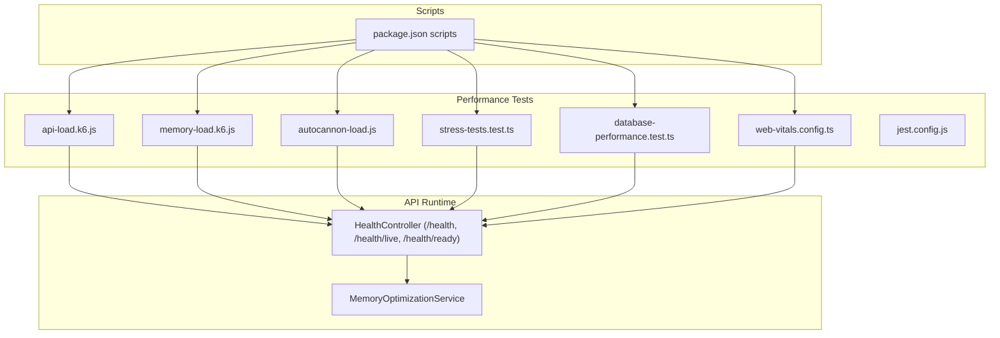
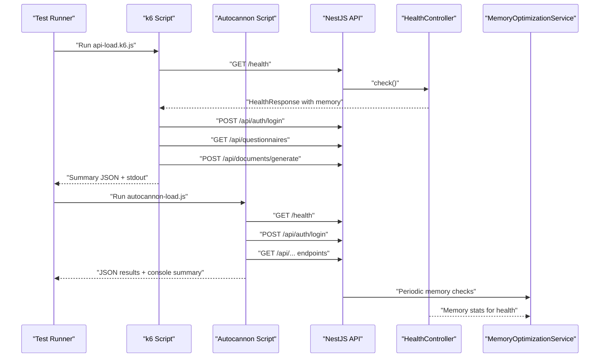
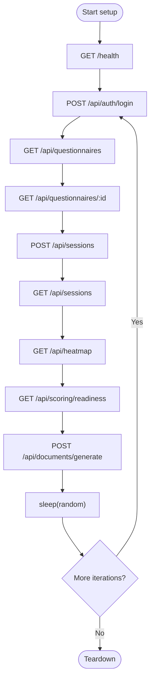
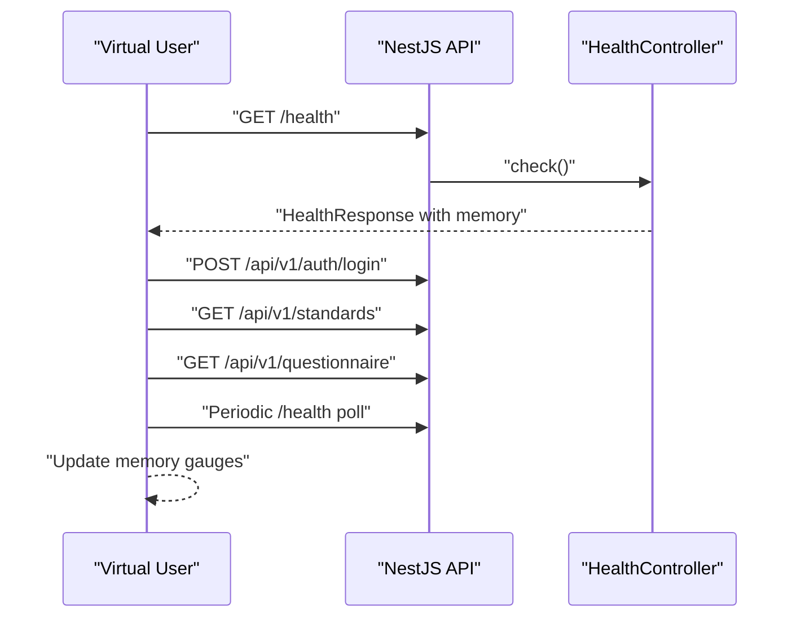
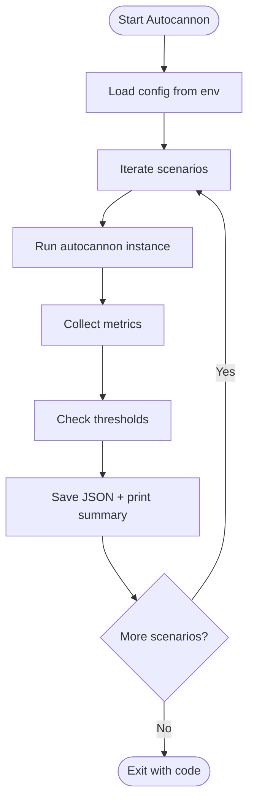
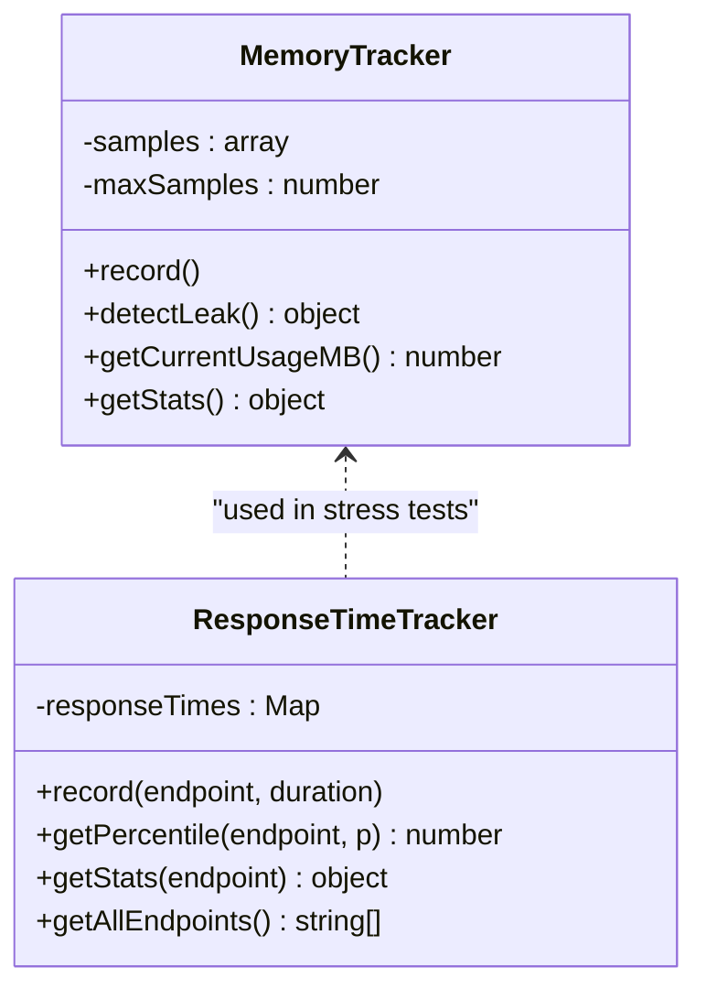
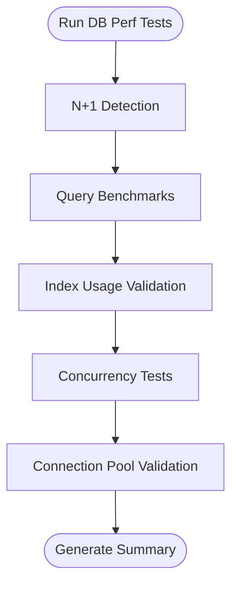
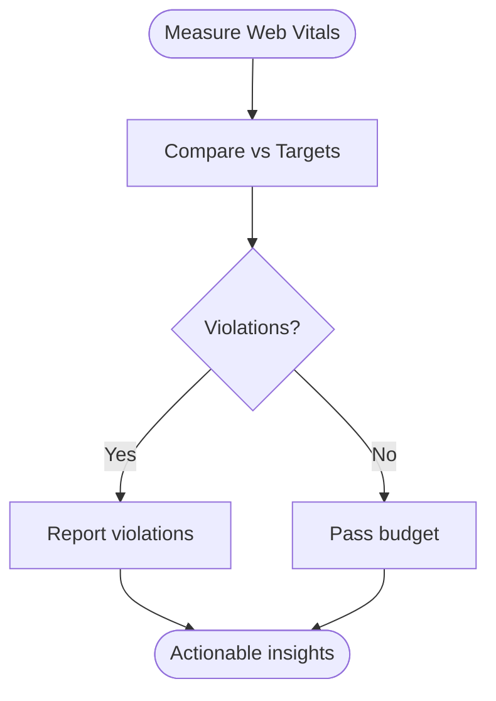
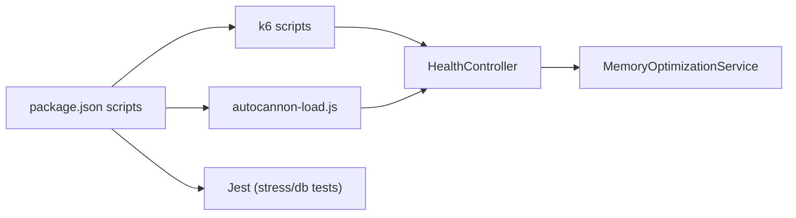

# Performance & Load Testing

<cite>
**Referenced Files in This Document**
- [api-load.k6.js](file://test/performance/api-load.k6.js)
- [memory-load.k6.js](file://test/performance/memory-load.k6.js)
- [autocannon-load.js](file://test/performance/autocannon-load.js)
- [stress-tests.test.ts](file://test/performance/stress-tests.test.ts)
- [database-performance.test.ts](file://test/performance/database-performance.test.ts)
- [web-vitals.config.ts](file://test/performance/web-vitals.config.ts)
- [jest.config.js](file://test/performance/jest.config.js)
- [package.json](file://package.json)
- [memory-optimization.service.ts](file://apps/api/src/common/services/memory-optimization.service.ts)
- [health.controller.ts](file://apps/api/src/health.controller.ts)
- [memory-test.json](file://test/performance/results/memory-test.json)
</cite>

## Table of Contents
1. [Introduction](#introduction)
2. [Project Structure](#project-structure)
3. [Core Components](#core-components)
4. [Architecture Overview](#architecture-overview)
5. [Detailed Component Analysis](#detailed-component-analysis)
6. [Dependency Analysis](#dependency-analysis)
7. [Performance Considerations](#performance-considerations)
8. [Troubleshooting Guide](#troubleshooting-guide)
9. [Conclusion](#conclusion)
10. [Appendices](#appendices)

## Introduction
This document provides comprehensive guidance for performance and load testing of Quiz-to-Build’s backend API and frontend. It covers k6-based API load and memory tests, Node.js-based autocannon load tests, stress and database performance suites, and web vitals performance budgets. It explains scenarios, load patterns, thresholds, metrics collection, monitoring, and result analysis. It also includes practical guidance for environment setup, baseline establishment, regression testing, optimization strategies, capacity planning, scalability validation, and continuous performance monitoring.

## Project Structure
Performance testing artifacts are organized under the test/performance directory and complemented by NestJS health endpoints and memory optimization utilities.

**Diagram sources**
- [api-load.k6.js:1-303](file://test/performance/api-load.k6.js#L1-L303)
- [memory-load.k6.js:1-174](file://test/performance/memory-load.k6.js#L1-L174)
- [autocannon-load.js:1-337](file://test/performance/autocannon-load.js#L1-L337)
- [stress-tests.test.ts:1-525](file://test/performance/stress-tests.test.ts#L1-L525)
- [database-performance.test.ts:1-391](file://test/performance/database-performance.test.ts#L1-L391)
- [web-vitals.config.ts:1-132](file://test/performance/web-vitals.config.ts#L1-L132)
- [jest.config.js:1-27](file://test/performance/jest.config.js#L1-L27)
- [package.json:15-66](file://package.json#L15-L66)
- [health.controller.ts:68-141](file://apps/api/src/health.controller.ts#L68-L141)
- [memory-optimization.service.ts:12-212](file://apps/api/src/common/services/memory-optimization.service.ts#L12-L212)

**Section sources**
- [package.json:15-66](file://package.json#L15-L66)
- [jest.config.js:1-27](file://test/performance/jest.config.js#L1-L27)

## Core Components
- k6 API load tests: Multi-scenario orchestration (smoke, load, stress, spike) with custom metrics and thresholds.
- k6 memory load tests: Sustained load with memory gauge metrics and health endpoint polling.
- Autocannon load tests: Node.js-based load runner with scenario definitions and result reporting.
- Stress tests: Simulated ramp-up, memory leak detection, response-time percentiles, and database profiling.
- Database performance tests: N+1 detection, query benchmarks, index usage, and connection pool validation.
- Web vitals configuration: Performance budgets and validators for Core Web Vitals and resource budgets.
- Health endpoints and memory optimization: Expose memory metrics and apply runtime memory management.

**Section sources**
- [api-load.k6.js:13-97](file://test/performance/api-load.k6.js#L13-L97)
- [memory-load.k6.js:10-38](file://test/performance/memory-load.k6.js#L10-L38)
- [autocannon-load.js:13-87](file://test/performance/autocannon-load.js#L13-L87)
- [stress-tests.test.ts:10-18](file://test/performance/stress-tests.test.ts#L10-L18)
- [database-performance.test.ts:32-55](file://test/performance/database-performance.test.ts#L32-L55)
- [web-vitals.config.ts:8-52](file://test/performance/web-vitals.config.ts#L8-L52)
- [health.controller.ts:19-141](file://apps/api/src/health.controller.ts#L19-L141)
- [memory-optimization.service.ts:12-212](file://apps/api/src/common/services/memory-optimization.service.ts#L12-L212)

## Architecture Overview
The performance test suite integrates with the API runtime via health endpoints and memory metrics. k6 and Node.js-based tools send requests to the API, collect metrics, and enforce thresholds. Stress and database tests validate internal behavior and query plans.

**Diagram sources**
- [api-load.k6.js:106-148](file://test/performance/api-load.k6.js#L106-L148)
- [autocannon-load.js:95-170](file://test/performance/autocannon-load.js#L95-L170)
- [health.controller.ts:75-141](file://apps/api/src/health.controller.ts#L75-L141)
- [memory-optimization.service.ts:28-107](file://apps/api/src/common/services/memory-optimization.service.ts#L28-L107)

## Detailed Component Analysis

### k6 API Load Tests
- Scenarios:
  - Smoke: constant 10 VUs for 1 minute.
  - Load: ramping to 100 VUs over 7 minutes, steady 100 VUs for 5 minutes, ramp down.
  - Stress: ramping to 500 VUs over 7 minutes, steady 500 VUs for 5 minutes, ramp down.
  - Spike: ramps to 1000 VUs for 3 minutes, then ramps down.
- Metrics:
  - Custom: error rate, API response time, DB query time, successful/failed request counters.
  - Built-in: http_req_duration thresholds (p95/p99/avg).
- Endpoints exercised:
  - Health check, authentication, questionnaire list/detail, session create/list, scoring, heatmap, document generation.
- Environment variables:
  - API_URL, AUTH_TOKEN.
- Outputs:
  - JSON summary and formatted stdout.

**Diagram sources**
- [api-load.k6.js:106-238](file://test/performance/api-load.k6.js#L106-L238)

**Section sources**
- [api-load.k6.js:13-97](file://test/performance/api-load.k6.js#L13-L97)
- [api-load.k6.js:106-238](file://test/performance/api-load.k6.js#L106-L238)
- [api-load.k6.js:248-303](file://test/performance/api-load.k6.js#L248-L303)

### k6 Memory Load Tests
- Scenario:
  - Constant 50 VUs for 1 minute with periodic memory checks.
- Metrics:
  - API response time, memory usage (MB and percent).
- Thresholds:
  - HTTP latency, error rate, memory usage percent.
- Memory tracking:
  - Polls /health for memory fields and updates gauges.
- Output:
  - JSON summary and formatted stdout.

**Diagram sources**
- [memory-load.k6.js:46-109](file://test/performance/memory-load.k6.js#L46-L109)
- [health.controller.ts:119-141](file://apps/api/src/health.controller.ts#L119-L141)

**Section sources**
- [memory-load.k6.js:10-38](file://test/performance/memory-load.k6.js#L10-L38)
- [memory-load.k6.js:46-109](file://test/performance/memory-load.k6.js#L46-L109)
- [memory-load.k6.js:112-174](file://test/performance/memory-load.k6.js#L112-L174)

### Autocannon Load Tests
- Scenarios:
  - Health check, authentication, questionnaire list, session list, heatmap, readiness score.
- Configurable environment:
  - API_URL, DURATION, CONNECTIONS, PIPELINING.
- Metrics collected:
  - Requests/sec, latency (avg/p50/p90/p95/p99), throughput, errors/timeouts, status code buckets.
- Thresholds:
  - Error rate < 1%, RPS per scenario, P95 latency per scenario, average latency < 200ms.
- Output:
  - JSON results file and console summary.

**Diagram sources**
- [autocannon-load.js:95-170](file://test/performance/autocannon-load.js#L95-L170)
- [autocannon-load.js:175-212](file://test/performance/autocannon-load.js#L175-L212)
- [autocannon-load.js:261-287](file://test/performance/autocannon-load.js#L261-L287)

**Section sources**
- [autocannon-load.js:13-87](file://test/performance/autocannon-load.js#L13-L87)
- [autocannon-load.js:175-212](file://test/performance/autocannon-load.js#L175-L212)
- [autocannon-load.js:261-287](file://test/performance/autocannon-load.js#L261-L287)

### Stress Tests
- Purpose:
  - Gradually increase load to find breaking points, detect memory leaks, and profile response times.
- Features:
  - MemoryTracker with linear regression for leak detection.
  - ResponseTimeTracker for percentiles.
  - Simulated request durations with concurrency factor and jitter.
- Thresholds:
  - Max safe users, memory thresholds (MB), response time thresholds (ms).
- Database profiling:
  - N+1 detection via query pattern analysis.
  - Index usage expectations and slow query identification.

**Diagram sources**
- [stress-tests.test.ts:33-98](file://test/performance/stress-tests.test.ts#L33-L98)
- [stress-tests.test.ts:103-150](file://test/performance/stress-tests.test.ts#L103-L150)

**Section sources**
- [stress-tests.test.ts:10-18](file://test/performance/stress-tests.test.ts#L10-L18)
- [stress-tests.test.ts:33-98](file://test/performance/stress-tests.test.ts#L33-L98)
- [stress-tests.test.ts:103-150](file://test/performance/stress-tests.test.ts#L103-L150)

### Database Performance Tests
- N+1 Detection:
  - Validates expected query counts for session-with-responses and similar patterns.
- Query Benchmarks:
  - Single and list operations thresholds for various record counts.
- Index Usage:
  - Required indexes per table and verification of query plans.
- Concurrency:
  - Benchmarks for concurrent write and create operations.
- Connection Pool:
  - Validates pool configuration and saturation behavior.

**Diagram sources**
- [database-performance.test.ts:126-147](file://test/performance/database-performance.test.ts#L126-L147)
- [database-performance.test.ts:152-201](file://test/performance/database-performance.test.ts#L152-L201)
- [database-performance.test.ts:206-248](file://test/performance/database-performance.test.ts#L206-L248)
- [database-performance.test.ts:292-335](file://test/performance/database-performance.test.ts#L292-L335)

**Section sources**
- [database-performance.test.ts:32-55](file://test/performance/database-performance.test.ts#L32-L55)
- [database-performance.test.ts:126-147](file://test/performance/database-performance.test.ts#L126-L147)
- [database-performance.test.ts:152-201](file://test/performance/database-performance.test.ts#L152-L201)
- [database-performance.test.ts:206-248](file://test/performance/database-performance.test.ts#L206-L248)
- [database-performance.test.ts:292-335](file://test/performance/database-performance.test.ts#L292-L335)

### Web Vitals Performance Budgets
- Targets:
  - Core Web Vitals thresholds (FCP, LCP, TTI, CLS, FID, TBT).
  - Resource budgets (JS, CSS, Images, Fonts, Total).
- Page-specific budgets:
  - Per-route overrides for homepage, login, dashboard, questionnaire.
- Validator:
  - Compares measured metrics against targets and reports violations.

**Diagram sources**
- [web-vitals.config.ts:84-119](file://test/performance/web-vitals.config.ts#L84-L119)

**Section sources**
- [web-vitals.config.ts:8-52](file://test/performance/web-vitals.config.ts#L8-L52)
- [web-vitals.config.ts:57-79](file://test/performance/web-vitals.config.ts#L57-L79)
- [web-vitals.config.ts:84-119](file://test/performance/web-vitals.config.ts#L84-L119)

## Dependency Analysis
- Test orchestration:
  - package.json scripts invoke k6, Node.js, Jest, and LHCI.
- Test runtime dependencies:
  - k6 scripts depend on API health endpoints and memory fields.
  - Autocannon script depends on API endpoints and environment variables.
  - Stress and DB tests run in Node/Jest environment.
- Health and memory:
  - HealthController exposes memory fields consumed by k6 memory tests.
  - MemoryOptimizationService provides runtime memory management and stats.

**Diagram sources**
- [package.json:15-66](file://package.json#L15-L66)
- [health.controller.ts:119-141](file://apps/api/src/health.controller.ts#L119-L141)
- [memory-optimization.service.ts:119-149](file://apps/api/src/common/services/memory-optimization.service.ts#L119-L149)

**Section sources**
- [package.json:15-66](file://package.json#L15-L66)
- [health.controller.ts:119-141](file://apps/api/src/health.controller.ts#L119-L141)
- [memory-optimization.service.ts:119-149](file://apps/api/src/common/services/memory-optimization.service.ts#L119-L149)

## Performance Considerations
- API load testing:
  - Use k6 scenarios to simulate realistic traffic patterns and spikes.
  - Enforce latency and error-rate thresholds to define SLOs.
- Memory testing:
  - Monitor heap usage via health endpoint and enforce memory thresholds.
  - Combine with runtime memory optimization service for proactive management.
- Database performance:
  - Detect N+1 queries and ensure proper indexing.
  - Benchmark query performance across scales and validate connection pool sizing.
- Frontend performance:
  - Apply web vitals budgets and validate against measured metrics.
- Continuous monitoring:
  - Integrate k6 and autocannon into CI with pass/fail thresholds.
  - Store results and compare against baselines for regression detection.

[No sources needed since this section provides general guidance]

## Troubleshooting Guide
- k6 memory test shows high memory usage:
  - Verify /health exposes memory fields and thresholds are met.
  - Review MemoryOptimizationService logs for warnings/critical events.
- Autocannon failures:
  - Confirm API_URL, AUTH_TOKEN, and endpoint availability.
  - Inspect JSON results for error and timeout counts.
- Stress test leaks:
  - Use MemoryTracker leak detection and reduce allocations or improve cleanup.
- DB slow queries:
  - Review N+1 patterns and add indexes as recommended.
- Web vitals violations:
  - Optimize asset sizes and rendering performance to meet targets.

**Section sources**
- [memory-load.k6.js:46-62](file://test/performance/memory-load.k6.js#L46-L62)
- [memory-optimization.service.ts:84-107](file://apps/api/src/common/services/memory-optimization.service.ts#L84-L107)
- [autocannon-load.js:175-212](file://test/performance/autocannon-load.js#L175-L212)
- [database-performance.test.ts:126-147](file://test/performance/database-performance.test.ts#L126-L147)
- [web-vitals.config.ts:84-119](file://test/performance/web-vitals.config.ts#L84-L119)

## Conclusion
The performance test suite provides robust coverage for API load, memory stability, database efficiency, and frontend performance budgets. By enforcing thresholds, collecting actionable metrics, and integrating with CI, teams can establish baselines, detect regressions, and validate scalability and capacity. Operationalize continuous performance monitoring and automate performance testing to sustain high reliability.

[No sources needed since this section summarizes without analyzing specific files]

## Appendices

### A. Environment Setup and Execution
- Install dependencies:
  - k6 for API load tests.
  - Node.js for autocannon and Jest-based tests.
- Configure environment variables:
  - API_URL, AUTH_TOKEN (for k6), DURATION, CONNECTIONS, PIPELINING (for autocannon).
- Run tests:
  - API load: k6 run test/performance/api-load.k6.js
  - Memory load: k6 run test/performance/memory-load.k6.js
  - Autocannon: node test/performance/autocannon-load.js
  - Stress/DB tests: npm run test:performance
  - Combined: npm run test:perf (autocannon + Lighthouse)

**Section sources**
- [package.json:41-44](file://package.json#L41-L44)
- [api-load.k6.js:25-26](file://test/performance/api-load.k6.js#L25-L26)
- [autocannon-load.js:14-17](file://test/performance/autocannon-load.js#L14-L17)

### B. Baseline Establishment and Regression Testing
- Establish baselines:
  - Capture k6 and autocannon results for representative traffic.
  - Record web vitals metrics per page.
- Regression detection:
  - Compare current results against baselines.
  - Fail CI when thresholds exceed predefined tolerance.

**Section sources**
- [api-load.k6.js:85-96](file://test/performance/api-load.k6.js#L85-L96)
- [autocannon-load.js:175-212](file://test/performance/autocannon-load.js#L175-L212)
- [web-vitals.config.ts:37-52](file://test/performance/web-vitals.config.ts#L37-L52)

### C. Performance Optimization Strategies
- API:
  - Optimize endpoints, reduce payload sizes, implement caching.
- Database:
  - Add missing indexes, refactor N+1 queries, tune connection pools.
- Memory:
  - Leverage MemoryOptimizationService, monitor thresholds, trigger GC hints.
- Frontend:
  - Meet web vitals budgets, optimize assets, defer non-critical resources.

**Section sources**
- [database-performance.test.ts:367-390](file://test/performance/database-performance.test.ts#L367-L390)
- [memory-optimization.service.ts:68-107](file://apps/api/src/common/services/memory-optimization.service.ts#L68-L107)
- [web-vitals.config.ts:37-52](file://test/performance/web-vitals.config.ts#L37-L52)

### D. Capacity Planning and Scalability Validation
- Use ramping scenarios to identify breaking points.
- Validate memory usage remains below thresholds under sustained load.
- Confirm database query performance degrades gracefully and can be improved with indexes and batching.

**Section sources**
- [stress-tests.test.ts:182-277](file://test/performance/stress-tests.test.ts#L182-L277)
- [memory-load.k6.js:33-37](file://test/performance/memory-load.k6.js#L33-L37)
- [database-performance.test.ts:152-201](file://test/performance/database-performance.test.ts#L152-L201)

### E. Continuous Performance Monitoring and Automation
- Integrate k6 and autocannon into CI pipelines.
- Publish results and summaries for historical tracking.
- Gate deployments on performance thresholds.

**Section sources**
- [package.json:41-44](file://package.json#L41-L44)
- [api-load.k6.js:248-253](file://test/performance/api-load.k6.js#L248-L253)
- [autocannon-load.js:261-287](file://test/performance/autocannon-load.js#L261-L287)

### F. Example Results Reference
- Memory test result example:
  - Timestamp, test metadata, metrics, and threshold outcomes.

**Section sources**
- [memory-test.json:1-13](file://test/performance/results/memory-test.json#L1-L13)