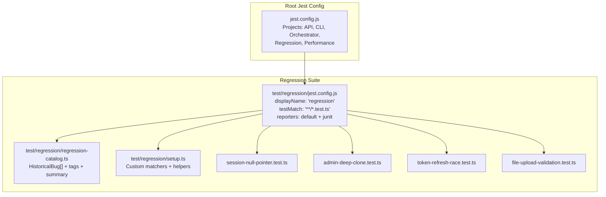
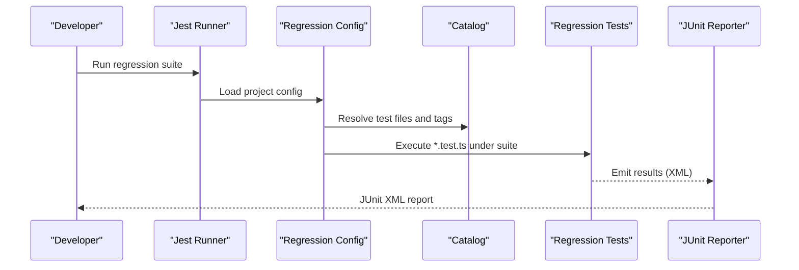
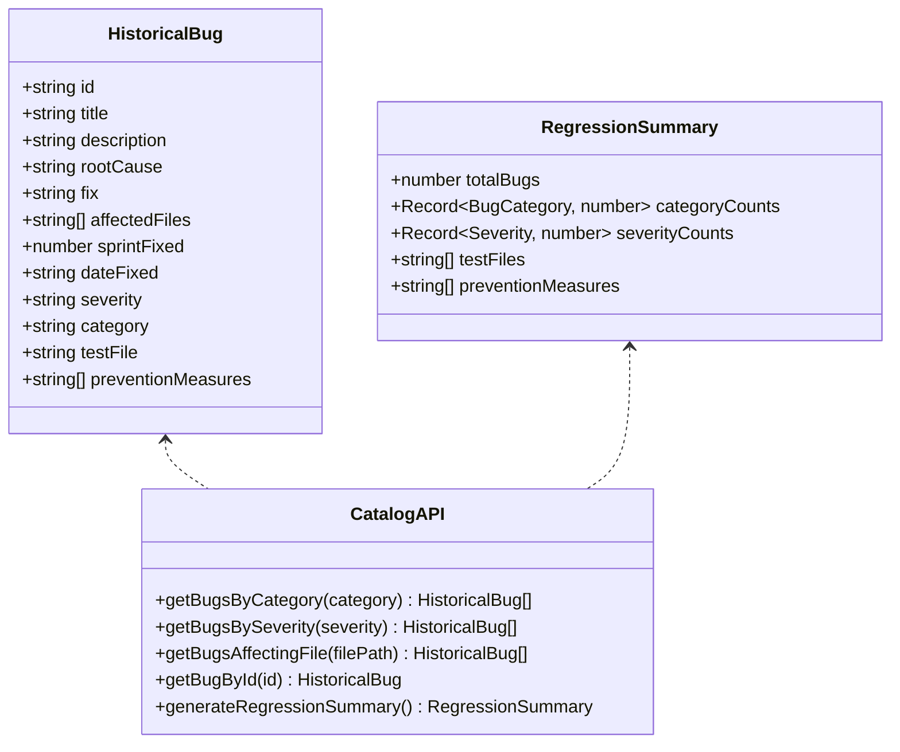
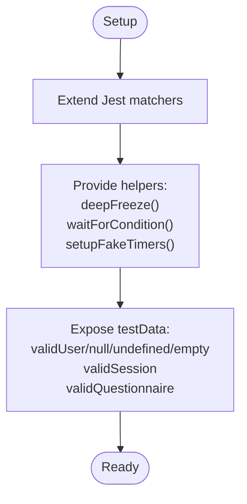
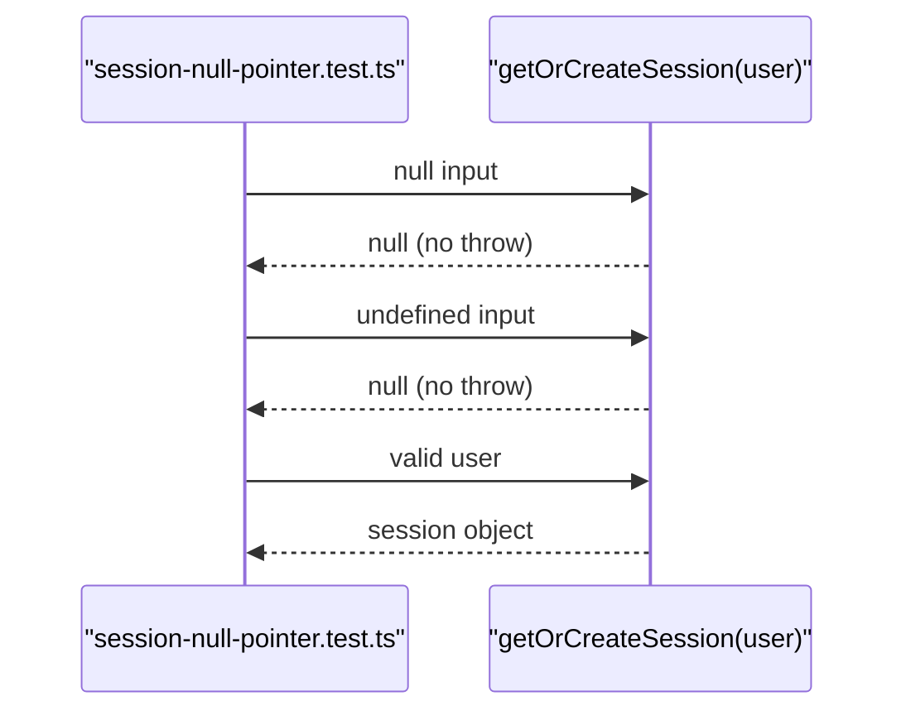
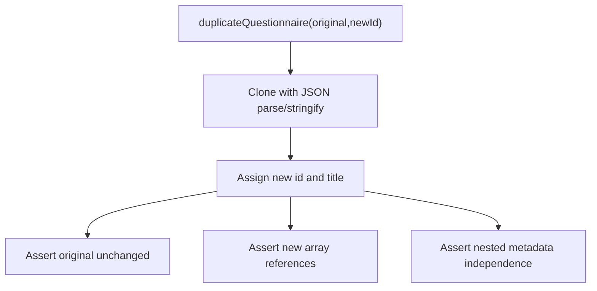
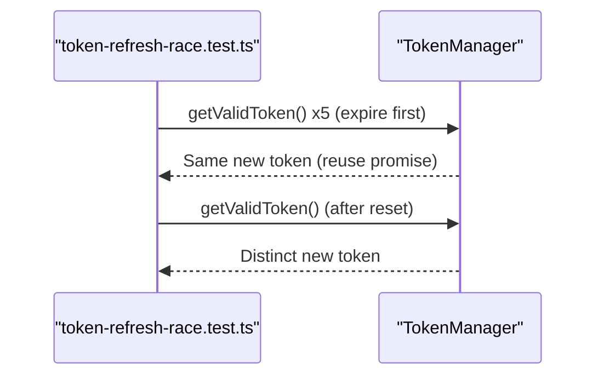
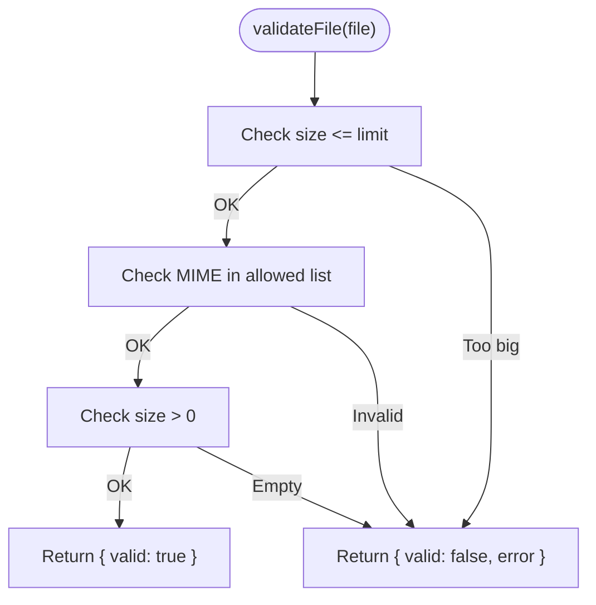
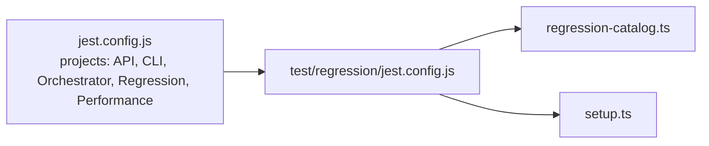

# Regression Testing

<cite>
**Referenced Files in This Document**
- [regression-catalog.ts](file://test/regression/regression-catalog.ts)
- [setup.ts](file://test/regression/setup.ts)
- [jest.config.js](file://test/regression/jest.config.js)
- [jest.config.js](file://jest.config.js)
- [session-null-pointer.test.ts](file://test/regression/session-null-pointer.test.ts)
- [admin-deep-clone.test.ts](file://test/regression/admin-deep-clone.test.ts)
- [token-refresh-race.test.ts](file://test/regression/token-refresh-race.test.ts)
- [file-upload-validation.test.ts](file://test/regression/file-upload-validation.test.ts)
- [COMPREHENSIVE-TESTING-METHODOLOGY.md](file://docs/testing/COMPREHENSIVE-TESTING-METHODOLOGY.md)
</cite>

## Table of Contents
1. [Introduction](#introduction)
2. [Project Structure](#project-structure)
3. [Core Components](#core-components)
4. [Architecture Overview](#architecture-overview)
5. [Detailed Component Analysis](#detailed-component-analysis)
6. [Dependency Analysis](#dependency-analysis)
7. [Performance Considerations](#performance-considerations)
8. [Troubleshooting Guide](#troubleshooting-guide)
9. [Conclusion](#conclusion)
10. [Appendices](#appendices)

## Introduction
This document defines Quiz-to-Build’s systematic regression testing approach to prevent recurring defects. It catalogs regression tests, organizes them by historical bugs, and prescribes automated execution, prioritization, scheduling, and result interpretation. It also provides strategies for maintaining the regression suite, handling false positives/negatives, integrating with CI/CD, and measuring effectiveness for continuous improvement.

## Project Structure
The regression testing system is organized as a dedicated Jest project with:
- A regression catalog that enumerates historical bugs and their prevention measures
- A shared setup module for custom matchers, helpers, and test data
- Focused test suites that replicate past failures and guard against recurrence
- A Jest configuration tailored for regression execution and reporting

**Diagram sources**
- [jest.config.js:11-17](file://jest.config.js#L11-L17)
- [jest.config.js:11-53](file://test/regression/jest.config.js#L11-L53)
- [regression-catalog.ts:40-264](file://test/regression/regression-catalog.ts#L40-L264)
- [setup.ts:12-170](file://test/regression/setup.ts#L12-L170)
- [session-null-pointer.test.ts:1-67](file://test/regression/session-null-pointer.test.ts#L1-L67)
- [admin-deep-clone.test.ts:1-129](file://test/regression/admin-deep-clone.test.ts#L1-L129)
- [token-refresh-race.test.ts:1-137](file://test/regression/token-refresh-race.test.ts#L1-L137)
- [file-upload-validation.test.ts:1-190](file://test/regression/file-upload-validation.test.ts#L1-L190)

**Section sources**
- [jest.config.js:11-17](file://jest.config.js#L11-L17)
- [jest.config.js:11-53](file://test/regression/jest.config.js#L11-L53)
- [regression-catalog.ts:40-264](file://test/regression/regression-catalog.ts#L40-L264)
- [setup.ts:12-170](file://test/regression/setup.ts#L12-L170)

## Core Components
- Regression catalog: Defines HistoricalBug entries with metadata, categories, severities, affected files, and associated test files. Provides utilities to filter bugs and generate summaries.
- Test tags and filtering: Tagging system enables targeted runs by bug ID, category, severity, and special markers (critical path, security fix, performance fix).
- Shared setup: Registers custom matchers (e.g., immutability checks), helper utilities (deep freeze, fake timers, wait helpers), and reusable test data.
- Regression Jest configuration: Isolates the regression suite, sets reporters, coverage focus, and timeouts.

Key capabilities:
- Filter bugs by category/severity/file
- Generate a regression summary with counts and prevention measures
- Enforce fail-fast behavior and produce JUnit-compatible XML for CI integration
- Collect coverage for historically problematic files

**Section sources**
- [regression-catalog.ts:10-264](file://test/regression/regression-catalog.ts#L10-L264)
- [regression-catalog.ts:273-336](file://test/regression/regression-catalog.ts#L273-L336)
- [regression-catalog.ts:353-376](file://test/regression/regression-catalog.ts#L353-L376)
- [regression-catalog.ts:385-425](file://test/regression/regression-catalog.ts#L385-L425)
- [setup.ts:25-77](file://test/regression/setup.ts#L25-L77)
- [setup.ts:86-131](file://test/regression/setup.ts#L86-L131)
- [jest.config.js:11-53](file://test/regression/jest.config.js#L11-L53)

## Architecture Overview
The regression testing architecture centers on a catalog-driven approach:
- Each historical bug maps to a dedicated test file that asserts the fix remains effective
- Tests are tagged to enable selective execution and reporting
- The regression Jest project runs independently and integrates with CI via JUnit XML

**Diagram sources**
- [jest.config.js:11-53](file://test/regression/jest.config.js#L11-L53)
- [regression-catalog.ts:353-376](file://test/regression/regression-catalog.ts#L353-L376)
- [regression-catalog.ts:408-425](file://test/regression/regression-catalog.ts#L408-L425)

## Detailed Component Analysis

### Regression Catalog and Tagging
The catalog enumerates historical bugs with:
- Unique identifiers and titles
- Descriptions, root causes, and fixes
- Affected files, sprint/date fixed, severity, and category
- Associated test file and prevention measures

Utilities:
- Filter by category/severity/file
- Summarize totals and prevention measures
- Generate Jest tags for targeted execution

**Diagram sources**
- [regression-catalog.ts:10-36](file://test/regression/regression-catalog.ts#L10-L36)
- [regression-catalog.ts:338-344](file://test/regression/regression-catalog.ts#L338-L344)
- [regression-catalog.ts:273-298](file://test/regression/regression-catalog.ts#L273-L298)

**Section sources**
- [regression-catalog.ts:40-264](file://test/regression/regression-catalog.ts#L40-L264)
- [regression-catalog.ts:273-336](file://test/regression/regression-catalog.ts#L273-L336)
- [regression-catalog.ts:385-425](file://test/regression/regression-catalog.ts#L385-L425)

### Shared Setup: Matchers, Helpers, and Test Data
The setup module:
- Extends Jest with custom matchers (e.g., immutability checks)
- Provides helpers for race-condition simulation and deterministic waits
- Supplies shared test data for null/undefined edge cases

**Diagram sources**
- [setup.ts:25-77](file://test/regression/setup.ts#L25-L77)
- [setup.ts:86-131](file://test/regression/setup.ts#L86-L131)
- [setup.ts:137-161](file://test/regression/setup.ts#L137-L161)

**Section sources**
- [setup.ts:25-77](file://test/regression/setup.ts#L25-L77)
- [setup.ts:86-131](file://test/regression/setup.ts#L86-L131)
- [setup.ts:137-161](file://test/regression/setup.ts#L137-L161)

### Regression Test Examples

#### Session Null Pointer (BUG-001)
Focus: Defensive null checks in session creation
- Validates null/undefined/empty id handling
- Ensures no exceptions are thrown and appropriate null returns

**Diagram sources**
- [session-null-pointer.test.ts:10-20](file://test/regression/session-null-pointer.test.ts#L10-L20)

**Section sources**
- [session-null-pointer.test.ts:1-67](file://test/regression/session-null-pointer.test.ts#L1-L67)

#### Admin Deep Clone (BUG-003)
Focus: Prevent mutation of original objects via deep cloning
- Asserts immutability of original questionnaire
- Verifies independent array/object references
- Confirms nested metadata cloning

**Diagram sources**
- [admin-deep-clone.test.ts:10-22](file://test/regression/admin-deep-clone.test.ts#L10-L22)

**Section sources**
- [admin-deep-clone.test.ts:1-129](file://test/regression/admin-deep-clone.test.ts#L1-L129)

#### Token Refresh Race Condition (BUG-006)
Focus: Single-threaded token refresh to avoid conflicts
- Simulates concurrent requests reusing the same refresh promise
- Validates identical tokens across concurrent calls
- Ensures sequential refreshes produce distinct tokens

**Diagram sources**
- [token-refresh-race.test.ts:10-64](file://test/regression/token-refresh-race.test.ts#L10-L64)

**Section sources**
- [token-refresh-race.test.ts:1-137](file://test/regression/token-refresh-race.test.ts#L1-L137)

#### File Upload Validation (BUG-007)
Focus: Server-side enforcement of size/type constraints
- Validates per-file and batch size limits
- Ensures rejection of disallowed MIME types and empty files

**Diagram sources**
- [file-upload-validation.test.ts:20-50](file://test/regression/file-upload-validation.test.ts#L20-L50)

**Section sources**
- [file-upload-validation.test.ts:1-190](file://test/regression/file-upload-validation.test.ts#L1-L190)

## Dependency Analysis
- The root Jest configuration aggregates multiple projects, including the regression suite.
- The regression suite depends on:
  - The catalog for test file mapping and tag generation
  - The setup module for matchers and helpers
  - Internal API modules for coverage focus on historically problematic files

**Diagram sources**
- [jest.config.js:11-17](file://jest.config.js#L11-L17)
- [jest.config.js:11-53](file://test/regression/jest.config.js#L11-L53)
- [regression-catalog.ts:40-264](file://test/regression/regression-catalog.ts#L40-L264)
- [setup.ts:12-170](file://test/regression/setup.ts#L12-L170)

**Section sources**
- [jest.config.js:11-17](file://jest.config.js#L11-L17)
- [jest.config.js:11-53](file://test/regression/jest.config.js#L11-L53)
- [regression-catalog.ts:40-264](file://test/regression/regression-catalog.ts#L40-L264)
- [setup.ts:12-170](file://test/regression/setup.ts#L12-L170)

## Performance Considerations
- Regression tests are configured with a generous timeout to accommodate complex scenarios (e.g., race conditions).
- Coverage collection focuses on files historically affected by bugs to keep reports meaningful and fast.
- The suite is designed to fail fast to surface regressions quickly.

Recommendations:
- Keep regression tests focused and deterministic
- Prefer mocking and controlled environments to avoid flakiness
- Use fake timers for time-dependent tests to reduce variability

**Section sources**
- [jest.config.js:44-46](file://test/regression/jest.config.js#L44-L46)
- [regression-catalog.ts:372-376](file://test/regression/regression-catalog.ts#L372-L376)

## Troubleshooting Guide
Common issues and resolutions:
- False negatives due to missing tags
  - Ensure tests are annotated with the appropriate regression tags so they are included in targeted runs.
- Flaky tests from timing/race conditions
  - Use provided helpers (fake timers, wait helpers) and deterministic mocks.
- Coverage gaps
  - Add affected files to the coverage collection list in the regression config.
- Interpreting JUnit XML
  - Review the generated XML for failed test suites and individual test cases to pinpoint failing areas.

Guidelines:
- Treat any regression failure as critical and block deployments until resolved
- Re-run targeted regression suites by tag to confirm fixes
- Maintain prevention measures documented in the catalog to avoid reintroducing bugs

**Section sources**
- [regression-catalog.ts:385-425](file://test/regression/regression-catalog.ts#L385-L425)
- [setup.ts:86-131](file://test/regression/setup.ts#L86-L131)
- [jest.config.js:22-23](file://test/regression/jest.config.js#L22-L23)

## Conclusion
Quiz-to-Build’s regression testing framework systematically prevents historical bugs from recurring by:
- Cataloging bugs with actionable metadata and prevention measures
- Organizing tests around specific regressions with clear tagging
- Automating execution with JUnit reporting and fail-fast behavior
- Providing shared utilities to ensure robust, deterministic validations

Adopting the strategies and practices outlined here will strengthen system stability, accelerate feedback loops, and improve long-term maintainability.

## Appendices

### Regression Testing Strategies
- Critical functionality: Prioritize tests covering null safety, deep cloning, concurrency, and security boundaries.
- Data integrity: Use immutability checks and deep-freeze helpers to detect unintended mutations.
- Business logic: Validate API contracts and response shapes to prevent integration drift.

**Section sources**
- [COMPREHENSIVE-TESTING-METHODOLOGY.md:13-111](file://docs/testing/COMPREHENSIVE-TESTING-METHODOLOGY.md#L13-L111)
- [COMPREHENSIVE-TESTING-METHODOLOGY.md:114-282](file://docs/testing/COMPREHENSIVE-TESTING-METHODOLOGY.md#L114-L282)
- [COMPREHENSIVE-TESTING-METHODOLOGY.md:283-481](file://docs/testing/COMPREHENSIVE-TESTING-METHODOLOGY.md#L283-L481)

### Test Case Prioritization and Execution Scheduling
- Prioritize by severity and category from the regression catalog
- Schedule nightly regression runs and pre-deploy regression gates
- Use tag-based filtering to run subsets (e.g., security fixes, performance fixes)

**Section sources**
- [regression-catalog.ts:273-298](file://test/regression/regression-catalog.ts#L273-L298)
- [regression-catalog.ts:385-425](file://test/regression/regression-catalog.ts#L385-L425)

### CI/CD Integration and Reporting
- The regression suite emits JUnit XML for CI consumption
- Integrate with CI to run regression tests and publish artifacts

**Section sources**
- [jest.config.js:28-31](file://test/regression/jest.config.js#L28-L31)

### Maintaining Regression Test Suites
- Keep the catalog updated with new bugs and prevention measures
- Regularly review and retire obsolete tests
- Ensure test data and helpers evolve with product changes

**Section sources**
- [regression-catalog.ts:40-264](file://test/regression/regression-catalog.ts#L40-L264)
- [setup.ts:137-161](file://test/regression/setup.ts#L137-L161)

### Measuring Effectiveness and Continuous Improvement
- Track regression rates, mean time to detect/recurrence intervals
- Monitor CI failure rates and flakiness metrics
- Iterate on catalog depth and test coverage based on findings

[No sources needed since this section provides general guidance]