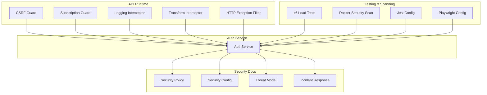
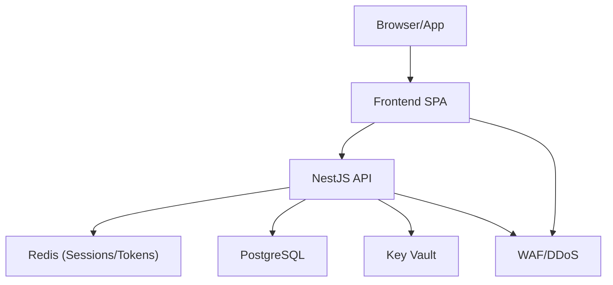
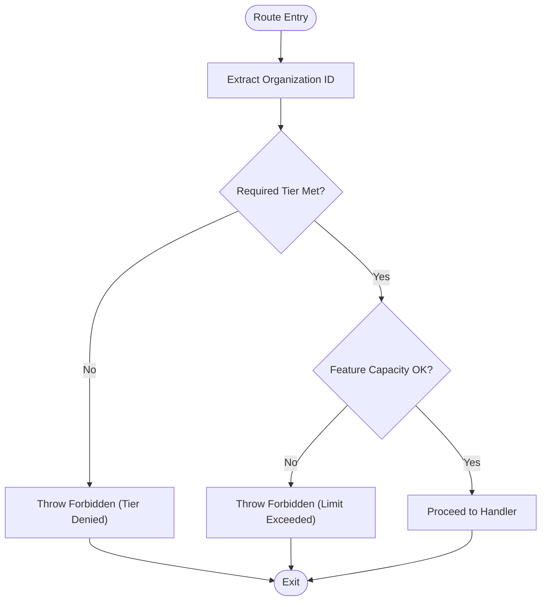
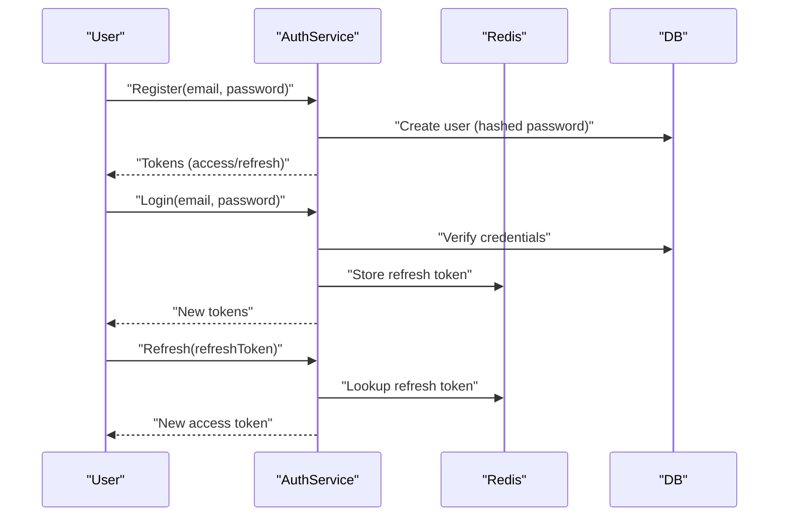
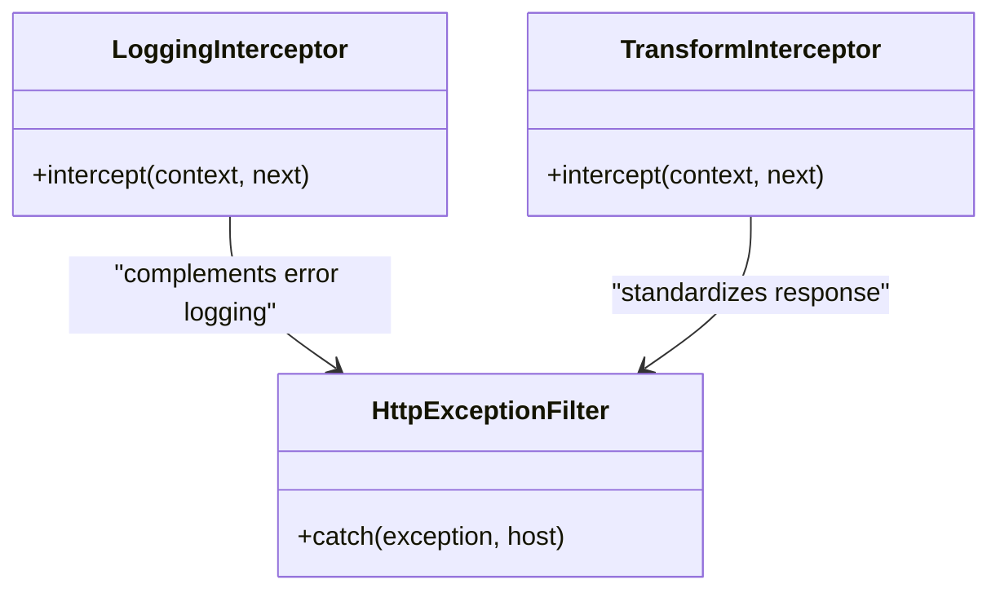
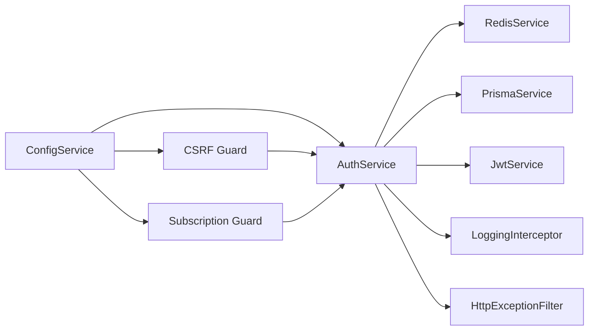

# Security Testing

<cite>
**Referenced Files in This Document**
- [SECURITY.md](file://SECURITY.md)
- [security-policy.md](file://security/policies/security-policy.md)
- [security-config.md](file://security/config/security-config.md)
- [threat-model.md](file://docs/security/threat-model.md)
- [incident-response-runbook.md](file://docs/security/incident-response-runbook.md)
- [security-scan.sh](file://scripts/security-scan.sh)
- [csrf.guard.ts](file://apps/api/src/common/guards/csrf.guard.ts)
- [subscription.guard.ts](file://apps/api/src/common/guards/subscription.guard.ts)
- [logging.interceptor.ts](file://apps/api/src/common/interceptors/logging.interceptor.ts)
- [transform.interceptor.ts](file://apps/api/src/common/interceptors/transform.interceptor.ts)
- [http-exception.filter.ts](file://apps/api/src/common/filters/http-exception.filter.ts)
- [auth.service.ts](file://apps/api/src/modules/auth/auth.service.ts)
- [api-load.k6.js](file://test/performance/api-load.k6.js)
- [jest.config.js](file://jest.config.js)
- [playwright.config.ts](file://playwright.config.ts)
</cite>

## Table of Contents
1. [Introduction](#introduction)
2. [Project Structure](#project-structure)
3. [Core Components](#core-components)
4. [Architecture Overview](#architecture-overview)
5. [Detailed Component Analysis](#detailed-component-analysis)
6. [Dependency Analysis](#dependency-analysis)
7. [Performance Considerations](#performance-considerations)
8. [Troubleshooting Guide](#troubleshooting-guide)
9. [Conclusion](#conclusion)
10. [Appendices](#appendices)

## Introduction
This document defines a comprehensive security testing strategy for Quiz-to-Build. It consolidates the project’s security posture, threat model, and defensive controls with practical testing methodologies for vulnerability assessment, penetration testing, and continuous security validation. It also outlines API security testing, authentication and authorization validation, input validation and injection protections, and integration with CI/CD and compliance frameworks.

## Project Structure
Security testing spans multiple layers:
- API runtime protections (guards, interceptors, filters)
- Authentication and authorization services
- Security configuration and policies
- Threat model and incident response runbooks
- Automated security scanning and performance/load testing
- E2E and integration testing configurations



**Diagram sources**
- [csrf.guard.ts:48-148](file://apps/api/src/common/guards/csrf.guard.ts#L48-L148)
- [subscription.guard.ts:58-174](file://apps/api/src/common/guards/subscription.guard.ts#L58-L174)
- [logging.interceptor.ts:11-55](file://apps/api/src/common/interceptors/logging.interceptor.ts#L11-L55)
- [transform.interceptor.ts:15-31](file://apps/api/src/common/interceptors/transform.interceptor.ts#L15-L31)
- [http-exception.filter.ts:23-101](file://apps/api/src/common/filters/http-exception.filter.ts#L23-L101)
- [auth.service.ts:38-507](file://apps/api/src/modules/auth/auth.service.ts#L38-L507)
- [security-policy.md:1-54](file://security/policies/security-policy.md#L1-L54)
- [security-config.md:1-93](file://security/config/security-config.md#L1-L93)
- [threat-model.md:1-227](file://docs/security/threat-model.md#L1-L227)
- [incident-response-runbook.md:1-507](file://docs/security/incident-response-runbook.md#L1-L507)
- [api-load.k6.js:1-303](file://test/performance/api-load.k6.js#L1-L303)
- [security-scan.sh:1-74](file://scripts/security-scan.sh#L1-L74)
- [jest.config.js:1-26](file://jest.config.js#L1-L26)
- [playwright.config.ts:1-133](file://playwright.config.ts#L1-L133)

**Section sources**
- [security-policy.md:1-54](file://security/policies/security-policy.md#L1-L54)
- [security-config.md:1-93](file://security/config/security-config.md#L1-L93)
- [threat-model.md:1-227](file://docs/security/threat-model.md#L1-L227)
- [incident-response-runbook.md:1-507](file://docs/security/incident-response-runbook.md#L1-L507)
- [api-load.k6.js:1-303](file://test/performance/api-load.k6.js#L1-L303)
- [security-scan.sh:1-74](file://scripts/security-scan.sh#L1-L74)
- [jest.config.js:1-26](file://jest.config.js#L1-L26)
- [playwright.config.ts:1-133](file://playwright.config.ts#L1-L133)

## Core Components
- CSRF protection: Double submit cookie pattern with constant-time token validation and optional route skipping.
- Subscription-based authorization: Tier and feature gating with usage checks and rate limits aligned to tiers.
- Authentication service: JWT issuance, refresh token rotation, bcrypt password hashing, and secure token storage.
- Logging and error handling: Structured HTTP logging, standardized error responses, and correlation IDs.
- Security configuration: Rate limits, JWT settings, password policy, CORS, security headers, and audit logging.

**Section sources**
- [csrf.guard.ts:48-148](file://apps/api/src/common/guards/csrf.guard.ts#L48-L148)
- [subscription.guard.ts:58-174](file://apps/api/src/common/guards/subscription.guard.ts#L58-L174)
- [auth.service.ts:38-507](file://apps/api/src/modules/auth/auth.service.ts#L38-L507)
- [logging.interceptor.ts:11-55](file://apps/api/src/common/interceptors/logging.interceptor.ts#L11-L55)
- [http-exception.filter.ts:23-101](file://apps/api/src/common/filters/http-exception.filter.ts#L23-L101)
- [security-config.md:3-92](file://security/config/security-config.md#L3-L92)

## Architecture Overview
The security architecture integrates runtime protections, centralized configuration, and observability.



**Diagram sources**
- [threat-model.md:18-49](file://docs/security/threat-model.md#L18-L49)
- [security-policy.md:37-46](file://security/policies/security-policy.md#L37-L46)

## Detailed Component Analysis

### CSRF Protection
- Implements double-submit cookie pattern with header and cookie token validation.
- Uses constant-time comparison to prevent timing attacks.
- Provides a decorator to skip CSRF for specific routes (e.g., webhooks).
- Enforces non-root container runtime and validates CSRF secret configuration in production.

```mermaid
sequenceDiagram
participant C as "Client"
participant A as "API"
participant G as "CSRF Guard"
C->>A : "GET /resource"
A-->>C : "Set-Cookie : csrf-token=...; HttpOnly=false"
C->>A : "POST /resource<br/>X-CSRF-Token : ..."
A->>G : "Validate header vs cookie"
G-->>A : "OK or Forbidden"
A-->>C : "Response"
```

**Diagram sources**
- [csrf.guard.ts:66-148](file://apps/api/src/common/guards/csrf.guard.ts#L66-L148)

**Section sources**
- [csrf.guard.ts:13-148](file://apps/api/src/common/guards/csrf.guard.ts#L13-L148)
- [security-scan.sh:46-62](file://scripts/security-scan.sh#L46-L62)

### Subscription-Based Authorization
- Enforces tier-based access via metadata decorators.
- Validates feature usage against tier limits and usage calculators.
- Attaches subscription info to requests and exposes usage headers.



**Diagram sources**
- [subscription.guard.ts:65-174](file://apps/api/src/common/guards/subscription.guard.ts#L65-L174)

**Section sources**
- [subscription.guard.ts:13-174](file://apps/api/src/common/guards/subscription.guard.ts#L13-L174)

### Authentication and Token Management
- Registers users with bcrypt-hashed passwords and emits verification tokens.
- Issues JWT access tokens and refresh tokens with rotation and Redis-backed persistence.
- Implements secure password reset with token expiry and refresh token invalidation.



**Diagram sources**
- [auth.service.ts:64-247](file://apps/api/src/modules/auth/auth.service.ts#L64-L247)

**Section sources**
- [auth.service.ts:38-507](file://apps/api/src/modules/auth/auth.service.ts#L38-L507)
- [security-config.md:19-30](file://security/config/security-config.md#L19-L30)

### Logging, Interceptors, and Error Handling
- Structured HTTP logging with correlation IDs and request metadata.
- Standardized error responses with error codes and request IDs.
- Response transformation to a consistent envelope.



**Diagram sources**
- [logging.interceptor.ts:11-55](file://apps/api/src/common/interceptors/logging.interceptor.ts#L11-L55)
- [transform.interceptor.ts:15-31](file://apps/api/src/common/interceptors/transform.interceptor.ts#L15-L31)
- [http-exception.filter.ts:23-101](file://apps/api/src/common/filters/http-exception.filter.ts#L23-L101)

**Section sources**
- [logging.interceptor.ts:11-55](file://apps/api/src/common/interceptors/logging.interceptor.ts#L11-L55)
- [transform.interceptor.ts:15-31](file://apps/api/src/common/interceptors/transform.interceptor.ts#L15-L31)
- [http-exception.filter.ts:23-101](file://apps/api/src/common/filters/http-exception.filter.ts#L23-L101)

### Security Configuration and Policies
- Rate limiting: general, login, and authenticated API limits.
- JWT configuration: algorithms, expiration, and refresh token rotation.
- Password policy: bcrypt rounds and minimum length.
- CORS: allowed origins and credentials per environment.
- Security headers: Helmet defaults for CSP, HSTS, XSS filter, etc.
- Audit logging: enabled events, retention, and excluded paths.

**Section sources**
- [security-config.md:3-92](file://security/config/security-config.md#L3-L92)
- [security-policy.md:18-53](file://security/policies/security-policy.md#L18-L53)

### Threat Model and Incident Response
- STRIDE-based threat model covering spoofing, tampering, repudiation, information disclosure, denial of service, and elevation of privilege.
- Mitigations include short-lived tokens, rate limiting, immutable storage, and tenant isolation.
- Incident response runbook defines severity levels, phases, containment, eradication, recovery, and post-incident review.

**Section sources**
- [threat-model.md:55-166](file://docs/security/threat-model.md#L55-L166)
- [incident-response-runbook.md:19-507](file://docs/security/incident-response-runbook.md#L19-L507)

## Dependency Analysis
Runtime security depends on:
- Guards and interceptors rely on configuration services and request context.
- Auth service depends on database, Redis, and notification services.
- Security scanning and load tests integrate with CI/CD and external tools.



**Diagram sources**
- [csrf.guard.ts:52-64](file://apps/api/src/common/guards/csrf.guard.ts#L52-L64)
- [subscription.guard.ts:59-63](file://apps/api/src/common/guards/subscription.guard.ts#L59-L63)
- [auth.service.ts:46-52](file://apps/api/src/modules/auth/auth.service.ts#L46-L52)

**Section sources**
- [csrf.guard.ts:52-64](file://apps/api/src/common/guards/csrf.guard.ts#L52-L64)
- [subscription.guard.ts:59-63](file://apps/api/src/common/guards/subscription.guard.ts#L59-L63)
- [auth.service.ts:46-52](file://apps/api/src/modules/auth/auth.service.ts#L46-L52)

## Performance Considerations
- Load testing with k6 simulates concurrent users across health checks, authentication, questionnaire operations, sessions, scoring engine, and document generation.
- Thresholds enforce latency and error rates; results are exported for analysis.
- CI/CD can leverage these tests to gate deployments and detect regressions.

**Section sources**
- [api-load.k6.js:29-97](file://test/performance/api-load.k6.js#L29-L97)
- [api-load.k6.js:119-238](file://test/performance/api-load.k6.js#L119-L238)

## Troubleshooting Guide
Common security testing issues and resolutions:
- CSRF validation failures: ensure both cookie and header tokens are present and match; verify SameSite and secure cookie flags.
- Tier/feature access denials: confirm organization context extraction and tier/feature limits; inspect usage headers.
- Authentication errors: verify JWT expiry, refresh token rotation, and Redis connectivity; check bcrypt rounds and password policies.
- Logging gaps: confirm interceptor wiring and request ID propagation; validate error filter behavior.
- Security scan warnings: address root user containers, sensitive files, and npm audit findings.

**Section sources**
- [csrf.guard.ts:95-148](file://apps/api/src/common/guards/csrf.guard.ts#L95-L148)
- [subscription.guard.ts:100-174](file://apps/api/src/common/guards/subscription.guard.ts#L100-L174)
- [auth.service.ts:147-183](file://apps/api/src/modules/auth/auth.service.ts#L147-L183)
- [logging.interceptor.ts:14-55](file://apps/api/src/common/interceptors/logging.interceptor.ts#L14-L55)
- [http-exception.filter.ts:26-82](file://apps/api/src/common/filters/http-exception.filter.ts#L26-L82)
- [security-scan.sh:46-67](file://scripts/security-scan.sh#L46-L67)

## Conclusion
Quiz-to-Build’s security testing framework combines runtime protections, robust authentication and authorization, comprehensive logging and error handling, and validated configurations. By integrating threat modeling, incident response, automated scanning, and performance/load testing, the project maintains a strong security posture suitable for continuous delivery and compliance.

## Appendices

### Security Testing Methodologies and Procedures
- Penetration testing: use the STRIDE threat model to guide manual assessments; validate CSRF, IDOR, and injection vectors; leverage incident response playbooks for containment and remediation.
- Vulnerability scanning: run Docker Scout scans, npm audit, and Trivy in CI; review security-scan.sh outputs and address findings.
- API security testing: validate JWT lifecycle, refresh token rotation, and subscription-based rate limits; test CSRF guard behavior across safe and unsafe methods.
- Input validation and injection prevention: enforce strict DTO validation, parameterized queries via Prisma, and sanitize logs to prevent information disclosure.
- Security regression testing: include k6 load tests and Playwright E2E tests in CI; monitor thresholds and error rates; automate security scan reports.

**Section sources**
- [threat-model.md:169-187](file://docs/security/threat-model.md#L169-L187)
- [incident-response-runbook.md:113-281](file://docs/security/incident-response-runbook.md#L113-L281)
- [security-scan.sh:27-67](file://scripts/security-scan.sh#L27-L67)
- [api-load.k6.js:29-97](file://test/performance/api-load.k6.js#L29-L97)
- [playwright.config.ts:1-133](file://playwright.config.ts#L1-L133)

### Security Test Case Design Guidelines
- Authentication validation: verify login failures, lockouts, and password reset flows; test token expiry and refresh rotation.
- Authorization testing: assert tier-based access, feature limits, and usage-based restrictions; simulate cross-tenant access attempts.
- API security: test CSRF guard with missing tokens, mismatched tokens, and route skips; validate security headers and CORS policies.
- Input validation and injection: craft malicious payloads to test parameterized queries and response filtering; monitor audit logs for anomalies.

**Section sources**
- [auth.service.ts:104-145](file://apps/api/src/modules/auth/auth.service.ts#L104-L145)
- [subscription.guard.ts:128-174](file://apps/api/src/common/guards/subscription.guard.ts#L128-L174)
- [csrf.guard.ts:66-148](file://apps/api/src/common/guards/csrf.guard.ts#L66-L148)
- [security-config.md:43-75](file://security/config/security-config.md#L43-L75)

### CI/CD Integration and Compliance Validation
- CI/CD integration: configure Jest projects, Playwright web servers, and k6 load tests; run security-scan.sh and npm audit as pipeline steps.
- Compliance validation: align with ISO/IEC 27001, OWASP Top 10, and NIST SSDF; maintain audit logs and incident response documentation.

**Section sources**
- [jest.config.js:11-17](file://jest.config.js#L11-L17)
- [playwright.config.ts:104-123](file://playwright.config.ts#L104-L123)
- [api-load.k6.js:1-303](file://test/performance/api-load.k6.js#L1-L303)
- [security-policy.md:49-54](file://security/policies/security-policy.md#L49-L54)