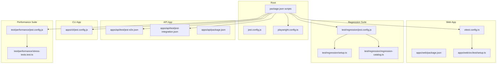
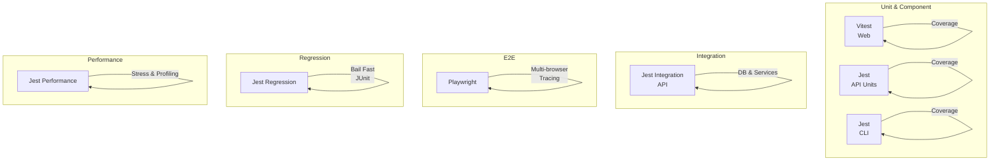
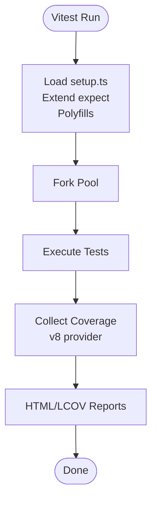
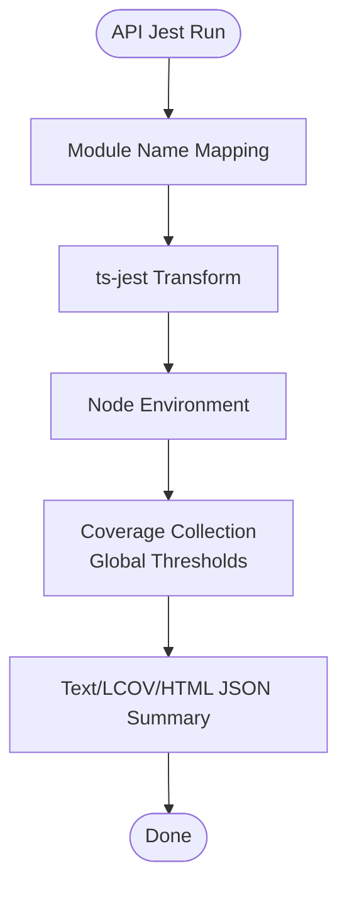
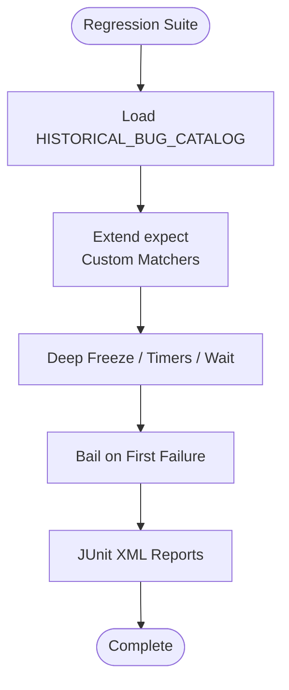
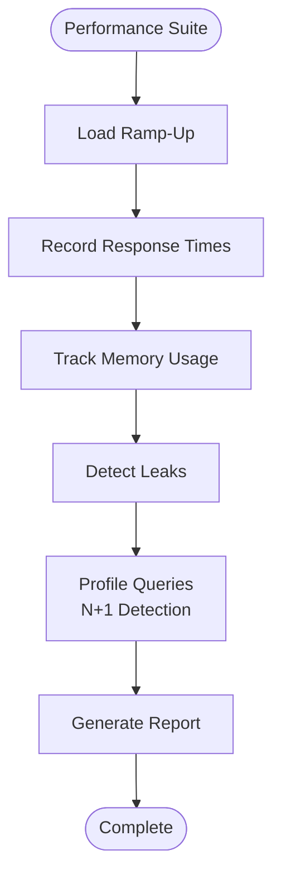
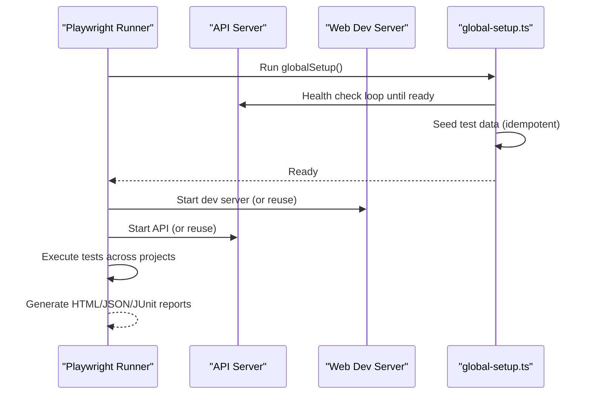
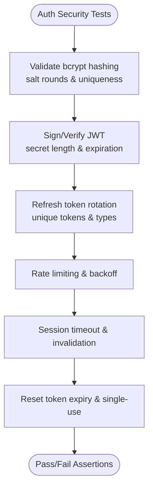
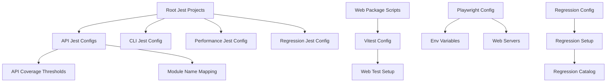

# Testing & Quality Assurance

<cite>
**Referenced Files in This Document**
- [jest.config.js](file://jest.config.js)
- [playwright.config.ts](file://playwright.config.ts)
- [apps/web/vitest.config.ts](file://apps/web/vitest.config.ts)
- [apps/api/test/jest-e2e.json](file://apps/api/test/jest-e2e.json)
- [apps/api/test/jest-integration.json](file://apps/api/test/jest-integration.json)
- [apps/cli/jest.config.js](file://apps/cli/jest.config.js)
- [test/performance/jest.config.js](file://test/performance/jest.config.js)
- [test/regression/jest.config.js](file://test/regression/jest.config.js)
- [apps/web/src/test/setup.ts](file://apps/web/src/test/setup.ts)
- [test/regression/setup.ts](file://test/regression/setup.ts)
- [apps/web/package.json](file://apps/web/package.json)
- [apps/api/package.json](file://apps/api/package.json)
- [package.json](file://package.json)
- [apps/api/src/modules/auth/tests/auth.security.test.ts](file://apps/api/src/modules/auth/tests/auth.security.test.ts)
- [apps/api/test/integration/admin-approval-workflow.flow.test.ts](file://apps/api/test/integration/admin-approval-workflow.flow.test.ts)
- [test/regression/regression-catalog.ts](file://test/regression/regression-catalog.ts)
- [test/performance/stress-tests.test.ts](file://test/performance/stress-tests.test.ts)
- [e2e/global-setup.ts](file://e2e/global-setup.ts)
</cite>

## Table of Contents
1. [Introduction](#introduction)
2. [Project Structure](#project-structure)
3. [Core Components](#core-components)
4. [Architecture Overview](#architecture-overview)
5. [Detailed Component Analysis](#detailed-component-analysis)
6. [Dependency Analysis](#dependency-analysis)
7. [Performance Considerations](#performance-considerations)
8. [Troubleshooting Guide](#troubleshooting-guide)
9. [Conclusion](#conclusion)
10. [Appendices](#appendices)

## Introduction
This document defines the comprehensive testing and quality assurance strategy for Quiz-to-Build. It covers unit, integration, E2E, and regression testing across the monorepo’s applications and libraries. It explains the testing frameworks (Jest, Vitest, Playwright), their configurations, quality metrics, coverage requirements, performance testing, automated pipelines, quality gates, and best practices. It also addresses accessibility, security, and performance benchmarking, and provides guidelines for writing effective tests, maintaining test suites, and interpreting results.

## Project Structure
The repository uses a monorepo with multiple apps and libs. Testing is organized per-app and per-suite:
- Unit and component tests for the web app use Vitest with JSDOM and coverage thresholds.
- API tests use Jest for unit/spec and separate configs for integration and E2E.
- CLI tests use Jest with focused coverage thresholds.
- Regression and performance tests live under dedicated suites with tailored Jest configs.
- E2E tests use Playwright with multi-browser projects, tracing, and artifact reporting.

**Diagram sources**
- [package.json:15-66](file://package.json#L15-L66)
- [jest.config.js:9-25](file://jest.config.js#L9-L25)
- [playwright.config.ts:1-133](file://playwright.config.ts#L1-L133)
- [apps/web/vitest.config.ts:1-45](file://apps/web/vitest.config.ts#L1-L45)
- [apps/api/test/jest-e2e.json:1-21](file://apps/api/test/jest-e2e.json#L1-L21)
- [apps/api/test/jest-integration.json:1-27](file://apps/api/test/jest-integration.json#L1-L27)
- [apps/cli/jest.config.js:1-31](file://apps/cli/jest.config.js#L1-L31)
- [test/regression/jest.config.js:1-54](file://test/regression/jest.config.js#L1-L54)
- [test/regression/setup.ts:1-170](file://test/regression/setup.ts#L1-L170)
- [test/regression/regression-catalog.ts:1-442](file://test/regression/regression-catalog.ts#L1-L442)
- [test/performance/jest.config.js:1-27](file://test/performance/jest.config.js#L1-L27)
- [test/performance/stress-tests.test.ts:1-525](file://test/performance/stress-tests.test.ts#L1-L525)

**Section sources**
- [jest.config.js:9-25](file://jest.config.js#L9-L25)
- [playwright.config.ts:1-133](file://playwright.config.ts#L1-L133)
- [apps/web/vitest.config.ts:1-45](file://apps/web/vitest.config.ts#L1-L45)
- [apps/api/test/jest-e2e.json:1-21](file://apps/api/test/jest-e2e.json#L1-L21)
- [apps/api/test/jest-integration.json:1-27](file://apps/api/test/jest-integration.json#L1-L27)
- [apps/cli/jest.config.js:1-31](file://apps/cli/jest.config.js#L1-L31)
- [test/performance/jest.config.js:1-27](file://test/performance/jest.config.js#L1-L27)
- [test/regression/jest.config.js:1-54](file://test/regression/jest.config.js#L1-L54)

## Core Components
- Vitest (Web): Runs unit and component tests with JSDOM, setup for localStorage and matchMedia polyfills, jest-axe matchers for accessibility, and coverage thresholds.
- Jest (API): Standard Jest configuration with coverage thresholds, module name mapping, and separate configs for integration and E2E.
- Jest (CLI): Isolated coverage for specific modules with strict thresholds.
- Jest (Regression): Dedicated suite with bail-on-first, JUnit reporting, and custom matchers/helpers.
- Jest (Performance): Long-running tests with module resolution and verbose output.
- Playwright (E2E): Multi-project browser testing, tracing, screenshots, video, and automatic web server startup for local runs.

Key quality metrics and thresholds:
- Web coverage: 80% statements, branches, functions, lines.
- API global coverage: 80% statements, branches, functions, lines.
- CLI coverage: targeted to specific modules with higher thresholds.
- Regression: bail on first failure; JUnit XML for CI integration.
- Performance: memory thresholds, response time percentiles, N+1 query detection.

**Section sources**
- [apps/web/vitest.config.ts:19-34](file://apps/web/vitest.config.ts#L19-L34)
- [apps/api/package.json:123-130](file://apps/api/package.json#L123-L130)
- [apps/cli/jest.config.js:18-29](file://apps/cli/jest.config.js#L18-L29)
- [test/regression/jest.config.js:22-29](file://test/regression/jest.config.js#L22-L29)
- [test/performance/jest.config.js:21-22](file://test/performance/jest.config.js#L21-L22)
- [apps/web/src/test/setup.ts:55-64](file://apps/web/src/test/setup.ts#L55-L64)

## Architecture Overview
The testing architecture spans unit, integration, E2E, and regression domains with framework-specific configurations and runners.

**Diagram sources**
- [apps/web/vitest.config.ts:1-45](file://apps/web/vitest.config.ts#L1-L45)
- [apps/api/package.json:88-142](file://apps/api/package.json#L88-L142)
- [apps/cli/jest.config.js:1-31](file://apps/cli/jest.config.js#L1-L31)
- [apps/api/test/jest-integration.json:1-27](file://apps/api/test/jest-integration.json#L1-L27)
- [playwright.config.ts:1-133](file://playwright.config.ts#L1-L133)
- [test/regression/jest.config.js:1-54](file://test/regression/jest.config.js#L1-L54)
- [test/performance/jest.config.js:1-27](file://test/performance/jest.config.js#L1-L27)

## Detailed Component Analysis

### Vitest (Web) Configuration and Setup
- Environment: JSDOM with global setup for DOM APIs and jest-axe matchers.
- Coverage: v8 provider, HTML/LCOV reports, 80% thresholds.
- Aliasing and environment flags for deterministic test runs.
- LocalStorage and matchMedia polyfills for accurate component testing.

**Diagram sources**
- [apps/web/vitest.config.ts:7-35](file://apps/web/vitest.config.ts#L7-L35)
- [apps/web/src/test/setup.ts:1-72](file://apps/web/src/test/setup.ts#L1-L72)

**Section sources**
- [apps/web/vitest.config.ts:1-45](file://apps/web/vitest.config.ts#L1-L45)
- [apps/web/src/test/setup.ts:1-72](file://apps/web/src/test/setup.ts#L1-L72)
- [apps/web/package.json:12-16](file://apps/web/package.json#L12-L16)

### Jest (API) Configuration
- Root Jest config delegates to app-specific configs.
- API Jest config includes coverage thresholds, module name mapping, and transform settings.
- Separate configs for integration and E2E with isolated caches and module mapping.

**Diagram sources**
- [apps/api/package.json:88-142](file://apps/api/package.json#L88-L142)
- [apps/api/test/jest-e2e.json:13-18](file://apps/api/test/jest-e2e.json#L13-L18)
- [apps/api/test/jest-integration.json:18-22](file://apps/api/test/jest-integration.json#L18-L22)

**Section sources**
- [jest.config.js:11-16](file://jest.config.js#L11-L16)
- [apps/api/package.json:88-142](file://apps/api/package.json#L88-L142)
- [apps/api/test/jest-e2e.json:1-21](file://apps/api/test/jest-e2e.json#L1-L21)
- [apps/api/test/jest-integration.json:1-27](file://apps/api/test/jest-integration.json#L1-L27)

### Jest (CLI) Configuration
- Node environment, ts-jest transform, and strict coverage thresholds for targeted modules.
- Resets mocks and restores them to avoid cross-test contamination.

**Section sources**
- [apps/cli/jest.config.js:1-31](file://apps/cli/jest.config.js#L1-L31)

### Regression Testing Suite
- Dedicated Jest project with bail-on-first failure, JUnit XML reporting, and verbose output.
- Custom matchers for immutability and null safety.
- Shared test helpers: deep freeze, wait-for-condition, fake timers.
- Regression catalog enumerates historical bugs with categories, severities, and prevention measures.

**Diagram sources**
- [test/regression/jest.config.js:22-30](file://test/regression/jest.config.js#L22-L30)
- [test/regression/setup.ts:34-77](file://test/regression/setup.ts#L34-L77)
- [test/regression/regression-catalog.ts:40-264](file://test/regression/regression-catalog.ts#L40-L264)

**Section sources**
- [test/regression/jest.config.js:1-54](file://test/regression/jest.config.js#L1-L54)
- [test/regression/setup.ts:1-170](file://test/regression/setup.ts#L1-L170)
- [test/regression/regression-catalog.ts:1-442](file://test/regression/regression-catalog.ts#L1-L442)

### Performance Testing Suite
- Long-running tests with module resolution and verbose output.
- Memory tracker detects growth trends and leak potential.
- Response time trackers compute percentiles and distributions.
- Query profiling simulates EXPLAIN ANALYZE and identifies N+1 patterns.

**Diagram sources**
- [test/performance/jest.config.js:1-27](file://test/performance/jest.config.js#L1-L27)
- [test/performance/stress-tests.test.ts:33-98](file://test/performance/stress-tests.test.ts#L33-L98)
- [test/performance/stress-tests.test.ts:103-150](file://test/performance/stress-tests.test.ts#L103-L150)
- [test/performance/stress-tests.test.ts:327-443](file://test/performance/stress-tests.test.ts#L327-L443)

**Section sources**
- [test/performance/jest.config.js:1-27](file://test/performance/jest.config.js#L1-L27)
- [test/performance/stress-tests.test.ts:1-525](file://test/performance/stress-tests.test.ts#L1-L525)

### E2E Testing with Playwright
- Multi-project configuration for desktop and mobile browsers.
- Automatic web server startup for API and Web apps, with reuseExistingServer logic.
- Tracing, screenshots on failure, video on first retry, and HTML/JSON/JUnit reporters.
- Global setup waits for API readiness and seeds test data.

**Diagram sources**
- [playwright.config.ts:94-132](file://playwright.config.ts#L94-L132)
- [playwright.config.ts:107-123](file://playwright.config.ts#L107-L123)
- [e2e/global-setup.ts:9-67](file://e2e/global-setup.ts#L9-L67)

**Section sources**
- [playwright.config.ts:1-133](file://playwright.config.ts#L1-L133)
- [e2e/global-setup.ts:1-70](file://e2e/global-setup.ts#L1-L70)

### Security Testing Examples
- Authentication security tests validate bcrypt hashing, JWT signing/verification, refresh token rotation, brute force protections, session security, and password reset security.
- These tests demonstrate strong assertions on cryptographic primitives and security controls.

**Diagram sources**
- [apps/api/src/modules/auth/tests/auth.security.test.ts:74-207](file://apps/api/src/modules/auth/tests/auth.security.test.ts#L74-L207)
- [apps/api/src/modules/auth/tests/auth.security.test.ts:273-334](file://apps/api/src/modules/auth/tests/auth.security.test.ts#L273-L334)
- [apps/api/src/modules/auth/tests/auth.security.test.ts:336-365](file://apps/api/src/modules/auth/tests/auth.security.test.ts#L336-L365)
- [apps/api/src/modules/auth/tests/auth.security.test.ts:367-399](file://apps/api/src/modules/auth/tests/auth.security.test.ts#L367-L399)

**Section sources**
- [apps/api/src/modules/auth/tests/auth.security.test.ts:1-401](file://apps/api/src/modules/auth/tests/auth.security.test.ts#L1-L401)

### Accessibility Testing
- Vitest setup integrates jest-axe and @testing-library/jest-dom for accessibility assertions.
- Tests can assert no axe violations using custom matchers.

**Section sources**
- [apps/web/src/test/setup.ts:55-64](file://apps/web/src/test/setup.ts#L55-L64)

### Integration Testing Example
- Integration tests demonstrate database-backed flows, including append-only decision logs and audit trails.
- These tests use NestJS TestingModule and PrismaService to validate business logic.

**Section sources**
- [apps/api/test/integration/admin-approval-workflow.flow.test.ts:1-247](file://apps/api/test/integration/admin-approval-workflow.flow.test.ts#L1-L247)

## Dependency Analysis
- Root Jest config aggregates projects for API, CLI, orchestrator, regression, and performance.
- API package.json defines coverage thresholds and module name mapping for libs.
- Web package.json defines Vitest scripts and devDependencies for testing.
- Playwright config depends on environment variables for base URLs and web server commands.
- Regression suite depends on the regression catalog and shared setup.

**Diagram sources**
- [jest.config.js:11-16](file://jest.config.js#L11-L16)
- [apps/api/package.json:123-139](file://apps/api/package.json#L123-L139)
- [apps/web/package.json:6-16](file://apps/web/package.json#L6-L16)
- [apps/web/vitest.config.ts:1-45](file://apps/web/vitest.config.ts#L1-L45)
- [apps/web/src/test/setup.ts:1-72](file://apps/web/src/test/setup.ts#L1-L72)
- [playwright.config.ts:104-123](file://playwright.config.ts#L104-L123)
- [test/regression/jest.config.js:20-35](file://test/regression/jest.config.js#L20-L35)
- [test/regression/setup.ts:1-170](file://test/regression/setup.ts#L1-L170)
- [test/regression/regression-catalog.ts:1-442](file://test/regression/regression-catalog.ts#L1-L442)

**Section sources**
- [jest.config.js:9-25](file://jest.config.js#L9-L25)
- [apps/api/package.json:88-142](file://apps/api/package.json#L88-L142)
- [apps/web/package.json:6-16](file://apps/web/package.json#L6-L16)
- [apps/web/vitest.config.ts:1-45](file://apps/web/vitest.config.ts#L1-L45)
- [apps/web/src/test/setup.ts:1-72](file://apps/web/src/test/setup.ts#L1-L72)
- [playwright.config.ts:104-123](file://playwright.config.ts#L104-L123)
- [test/regression/jest.config.js:20-35](file://test/regression/jest.config.js#L20-L35)
- [test/regression/setup.ts:1-170](file://test/regression/setup.ts#L1-L170)
- [test/regression/regression-catalog.ts:1-442](file://test/regression/regression-catalog.ts#L1-L442)

## Performance Considerations
- Use Vitest’s fork pool and JSDOM for efficient component tests.
- Prefer isolated Jest configs for integration/E2E to avoid cache pollution.
- Apply coverage thresholds consistently across suites to maintain quality.
- Use Playwright tracing and video sparingly in CI; enable only on failure or retries.
- Monitor memory growth and response time percentiles in performance tests; address N+1 queries and slow database queries.

[No sources needed since this section provides general guidance]

## Troubleshooting Guide
- Vitest setup failures: ensure localStorage and matchMedia polyfills are applied; confirm setup.ts is loaded.
- Jest coverage gaps: verify collectCoverageFrom patterns and module name mapping; check for excluded files.
- Playwright flakiness: reduce workers in CI; enable trace/screenshot/video on first retry; validate globalSetup health checks.
- Regression suite stalls: bail on first failure prevents long runs; use JUnit reports to parse failures quickly.
- Performance test timeouts: increase testTimeout for long-running stress tests; monitor memory thresholds.

**Section sources**
- [apps/web/src/test/setup.ts:7-53](file://apps/web/src/test/setup.ts#L7-L53)
- [apps/web/vitest.config.ts:10-18](file://apps/web/vitest.config.ts#L10-L18)
- [apps/api/test/jest-e2e.json:18-19](file://apps/api/test/jest-e2e.json#L18-L19)
- [apps/api/test/jest-integration.json:23-24](file://apps/api/test/jest-integration.json#L23-L24)
- [playwright.config.ts:20-24](file://playwright.config.ts#L20-L24)
- [playwright.config.ts:38-45](file://playwright.config.ts#L38-L45)
- [test/regression/jest.config.js:22-23](file://test/regression/jest.config.js#L22-L23)
- [test/performance/jest.config.js:21-22](file://test/performance/jest.config.js#L21-L22)

## Conclusion
Quiz-to-Build employs a layered testing strategy with Vitest for web unit/component tests, Jest for API units/integration/E2E and CLI tests, Playwright for robust E2E across browsers, and dedicated suites for regression and performance. Coverage thresholds, custom matchers, and CI-friendly reporting ensure quality gates. The documented practices and configurations provide a scalable foundation for continuous testing and monitoring.

[No sources needed since this section summarizes without analyzing specific files]

## Appendices

### Automated Testing Pipeline and Quality Gates
- Scripts orchestrate testing across workspaces and apps.
- E2E tests require API readiness and seed data via global setup.
- Coverage thresholds act as quality gates; CI can gate deployments on thresholds and test outcomes.

**Section sources**
- [package.json:15-66](file://package.json#L15-L66)
- [e2e/global-setup.ts:18-44](file://e2e/global-setup.ts#L18-L44)

### Best Practices and Guidelines
- Write focused unit tests with minimal external dependencies; mock services/libraries.
- Use Vitest setup to normalize environment and enable accessibility assertions.
- Keep integration tests database-backed and deterministic; use seed data.
- Design E2E tests for stability; leverage tracing and artifacts for diagnostics.
- Maintain regression tests for historical bugs; tag and categorize by severity.
- Define performance baselines and monitor percentiles; refactor slow queries and memory leaks.

[No sources needed since this section provides general guidance]