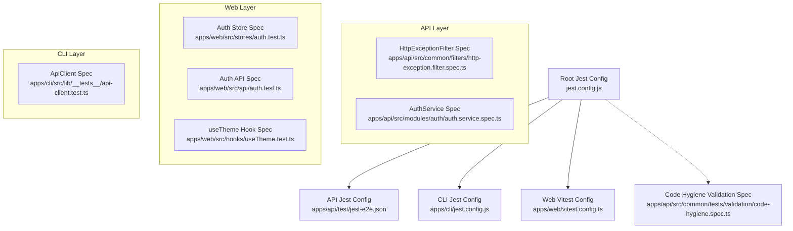
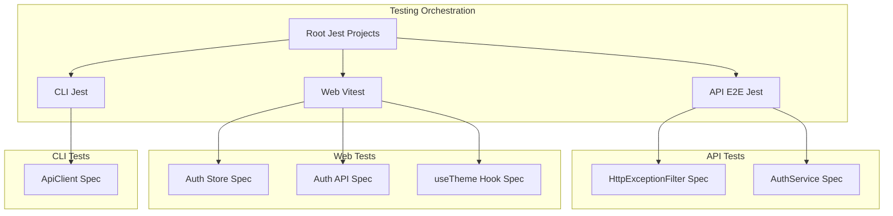
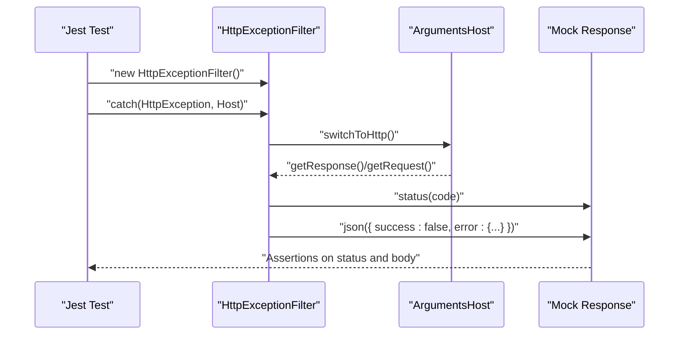
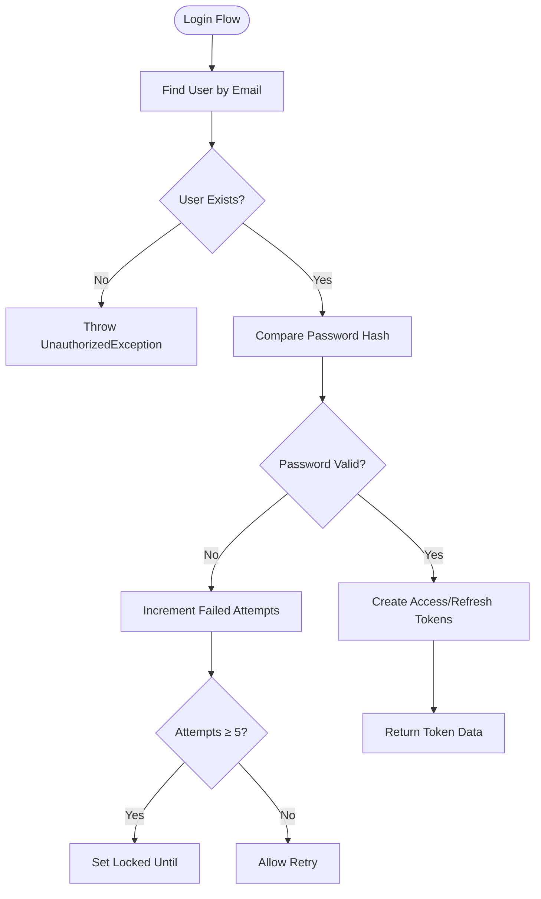
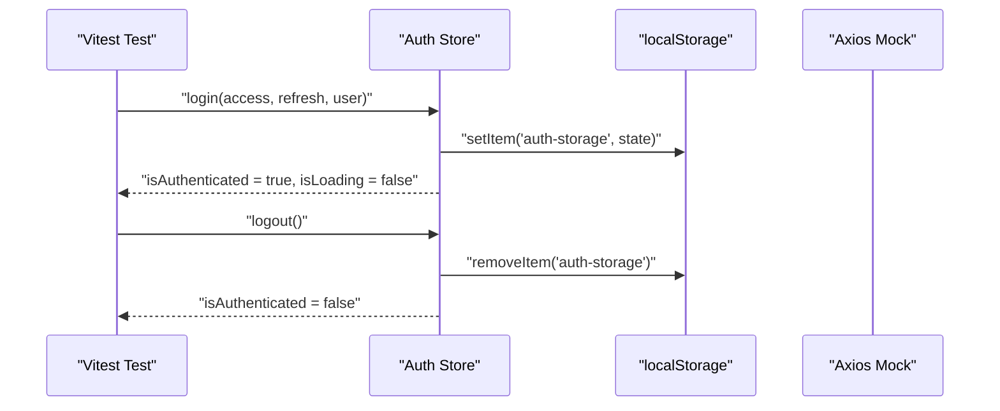
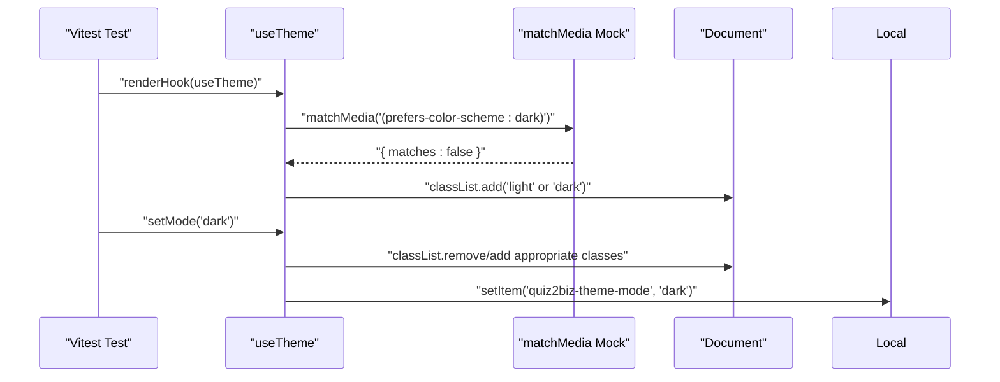
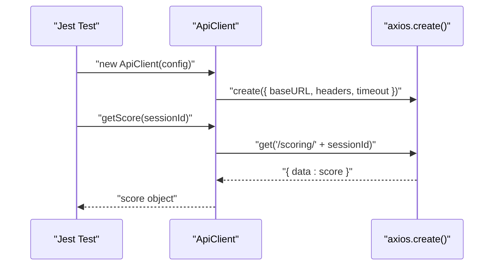
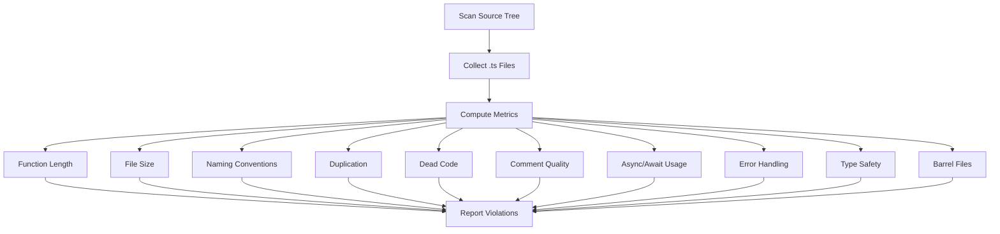
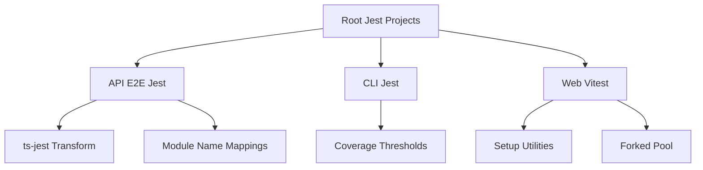

# Unit Testing Framework

<cite>
**Referenced Files in This Document**
- [jest.config.js](file://jest.config.js)
- [apps/api/test/jest-e2e.json](file://apps/api/test/jest-e2e.json)
- [apps/cli/jest.config.js](file://apps/cli/jest.config.js)
- [apps/web/vitest.config.ts](file://apps/web/vitest.config.ts)
- [apps/web/src/test/setup.ts](file://apps/web/src/test/setup.ts)
- [apps/api/src/common/filters/http-exception.filter.spec.ts](file://apps/api/src/common/filters/http-exception.filter.spec.ts)
- [apps/api/src/modules/auth/auth.service.spec.ts](file://apps/api/src/modules/auth/auth.service.spec.ts)
- [apps/web/src/stores/auth.test.ts](file://apps/web/src/stores/auth.test.ts)
- [apps/web/src/api/auth.test.ts](file://apps/web/src/api/auth.test.ts)
- [apps/web/src/hooks/useTheme.test.ts](file://apps/web/src/hooks/useTheme.test.ts)
- [apps/cli/src/lib/__tests__/api-client.test.ts](file://apps/cli/src/lib/__tests__/api-client.test.ts)
- [apps/api/src/common/tests/validation/code-hygiene.spec.ts](file://apps/api/src/common/tests/validation/code-hygiene.spec.ts)
</cite>

## Table of Contents
1. [Introduction](#introduction)
2. [Project Structure](#project-structure)
3. [Core Components](#core-components)
4. [Architecture Overview](#architecture-overview)
5. [Detailed Component Analysis](#detailed-component-analysis)
6. [Dependency Analysis](#dependency-analysis)
7. [Performance Considerations](#performance-considerations)
8. [Troubleshooting Guide](#troubleshooting-guide)
9. [Conclusion](#conclusion)
10. [Appendices](#appendices)

## Introduction
This document provides comprehensive unit testing documentation for Quiz-to-Build's testing framework. It covers Jest and Vitest configurations, test structure patterns, and mocking strategies across the API (NestJS), CLI, and Web (React/Vite) applications. It explains how to implement unit tests for API services, controllers, and web components, details testing utilities and helper functions, and outlines guidelines for writing effective unit tests, test isolation, assertion patterns, coverage requirements, and continuous integration testing. It also addresses common scenarios, edge cases, and debugging techniques.

## Project Structure
The repository employs a monorepo-like structure with separate testing frameworks per application:
- Root Jest configuration coordinates multi-project testing.
- API uses Jest with ts-jest and E2E-specific settings.
- CLI uses Jest with isolated coverage and strict thresholds.
- Web uses Vitest with React Testing Library and comprehensive coverage reporting.

**Diagram sources**
- [jest.config.js:1-26](file://jest.config.js#L1-L26)
- [apps/api/test/jest-e2e.json:1-21](file://apps/api/test/jest-e2e.json#L1-L21)
- [apps/cli/jest.config.js:1-31](file://apps/cli/jest.config.js#L1-L31)
- [apps/web/vitest.config.ts:1-45](file://apps/web/vitest.config.ts#L1-L45)
- [apps/api/src/common/filters/http-exception.filter.spec.ts:1-236](file://apps/api/src/common/filters/http-exception.filter.spec.ts#L1-L236)
- [apps/api/src/modules/auth/auth.service.spec.ts:1-800](file://apps/api/src/modules/auth/auth.service.spec.ts#L1-L800)
- [apps/web/src/stores/auth.test.ts:1-212](file://apps/web/src/stores/auth.test.ts#L1-L212)
- [apps/web/src/api/auth.test.ts:1-144](file://apps/web/src/api/auth.test.ts#L1-L144)
- [apps/web/src/hooks/useTheme.test.ts:1-294](file://apps/web/src/hooks/useTheme.test.ts#L1-L294)
- [apps/cli/src/lib/__tests__/api-client.test.ts:1-243](file://apps/cli/src/lib/__tests__/api-client.test.ts#L1-L243)
- [apps/api/src/common/tests/validation/code-hygiene.spec.ts:1-464](file://apps/api/src/common/tests/validation/code-hygiene.spec.ts#L1-L464)

**Section sources**
- [jest.config.js:1-26](file://jest.config.js#L1-L26)
- [apps/api/test/jest-e2e.json:1-21](file://apps/api/test/jest-e2e.json#L1-L21)
- [apps/cli/jest.config.js:1-31](file://apps/cli/jest.config.js#L1-L31)
- [apps/web/vitest.config.ts:1-45](file://apps/web/vitest.config.ts#L1-L45)

## Core Components
- Root Jest configuration defines multi-project testing scope and timeouts.
- API E2E configuration sets transform, module mapping, and cache for NestJS-style tests.
- CLI Jest configuration enforces clean mocks and strict coverage thresholds for targeted modules.
- Web Vitest configuration enables jsdom, setup files, coverage thresholds, and forked worker pools for React components.

Key capabilities:
- Isolated coverage collection to prevent mock pollution.
- Strict coverage thresholds for critical modules.
- Comprehensive frontend coverage with LCOV and HTML reporters.
- Setup utilities for DOM APIs and accessibility testing.

**Section sources**
- [jest.config.js:1-26](file://jest.config.js#L1-L26)
- [apps/api/test/jest-e2e.json:1-21](file://apps/api/test/jest-e2e.json#L1-L21)
- [apps/cli/jest.config.js:1-31](file://apps/cli/jest.config.js#L1-L31)
- [apps/web/vitest.config.ts:1-45](file://apps/web/vitest.config.ts#L1-L45)

## Architecture Overview
The testing architecture separates concerns by application layer while sharing common patterns:
- API layer tests validate services and filters using NestJS testing utilities and Jest mocks.
- Web layer tests validate React components, hooks, stores, and API clients using Vitest and React Testing Library.
- CLI layer tests validate HTTP clients and configuration using Jest mocks.

**Diagram sources**
- [jest.config.js:10-17](file://jest.config.js#L10-L17)
- [apps/api/test/jest-e2e.json:10-17](file://apps/api/test/jest-e2e.json#L10-L17)
- [apps/cli/jest.config.js:14-29](file://apps/cli/jest.config.js#L14-L29)
- [apps/web/vitest.config.ts:19-34](file://apps/web/vitest.config.ts#L19-L34)

## Detailed Component Analysis

### API Testing: Filters and Services
API tests demonstrate robust mocking and assertion patterns:
- HttpExceptionFilter spec validates error response shapes, status code mapping, and edge cases (missing headers, unknown error types).
- AuthService spec demonstrates comprehensive unit testing of business logic, including registration, login, token refresh, logout, email verification, password reset, and failed login handling with Redis and database mocks.

**Diagram sources**
- [apps/api/src/common/filters/http-exception.filter.spec.ts:34-184](file://apps/api/src/common/filters/http-exception.filter.spec.ts#L34-L184)

**Diagram sources**
- [apps/api/src/modules/auth/auth.service.spec.ts:168-244](file://apps/api/src/modules/auth/auth.service.spec.ts#L168-L244)

**Section sources**
- [apps/api/src/common/filters/http-exception.filter.spec.ts:1-236](file://apps/api/src/common/filters/http-exception.filter.spec.ts#L1-L236)
- [apps/api/src/modules/auth/auth.service.spec.ts:1-800](file://apps/api/src/modules/auth/auth.service.spec.ts#L1-L800)

### Web Testing: Stores, Hooks, and API Clients
Web tests showcase modern frontend testing patterns:
- Auth store tests validate state transitions, persistence to localStorage, token refresh logic, and partial persistence behavior.
- Auth API tests validate HTTP client interactions, endpoint routing, and error propagation.
- Theme hook tests validate system preference detection, localStorage persistence, and DOM class toggling.

**Diagram sources**
- [apps/web/src/stores/auth.test.ts:112-158](file://apps/web/src/stores/auth.test.ts#L112-L158)

**Diagram sources**
- [apps/web/src/hooks/useTheme.test.ts:57-81](file://apps/web/src/hooks/useTheme.test.ts#L57-L81)
- [apps/web/src/hooks/useTheme.test.ts:179-204](file://apps/web/src/hooks/useTheme.test.ts#L179-L204)

**Section sources**
- [apps/web/src/stores/auth.test.ts:1-212](file://apps/web/src/stores/auth.test.ts#L1-L212)
- [apps/web/src/api/auth.test.ts:1-144](file://apps/web/src/api/auth.test.ts#L1-L144)
- [apps/web/src/hooks/useTheme.test.ts:1-294](file://apps/web/src/hooks/useTheme.test.ts#L1-L294)

### CLI Testing: HTTP Client
CLI tests validate HTTP client construction and API interactions:
- ApiClient spec verifies axios instance creation with proper base URL and headers, and validates GET/POST operations for various endpoints with filtering options.

**Diagram sources**
- [apps/cli/src/lib/__tests__/api-client.test.ts:83-103](file://apps/cli/src/lib/__tests__/api-client.test.ts#L83-L103)

**Section sources**
- [apps/cli/src/lib/__tests__/api-client.test.ts:1-243](file://apps/cli/src/lib/__tests__/api-client.test.ts#L1-L243)

### Code Hygiene Validation
The code hygiene spec performs static analysis on TypeScript source files to enforce maintainability and readability standards, including:
- Function length limits, file size limits, naming conventions, duplication detection, dead code identification, comment quality, async/await usage, error handling, type safety, and module organization.

**Diagram sources**
- [apps/api/src/common/tests/validation/code-hygiene.spec.ts:19-463](file://apps/api/src/common/tests/validation/code-hygiene.spec.ts#L19-L463)

**Section sources**
- [apps/api/src/common/tests/validation/code-hygiene.spec.ts:1-464](file://apps/api/src/common/tests/validation/code-hygiene.spec.ts#L1-L464)

## Dependency Analysis
Testing dependencies and relationships:
- Root Jest configuration aggregates projects for coordinated execution.
- API E2E configuration depends on ts-jest transform and module name mapping for shared libraries.
- CLI Jest configuration isolates coverage to specific modules and enforces thresholds.
- Web Vitest configuration relies on setup files for DOM polyfills and accessibility matchers.

**Diagram sources**
- [jest.config.js:10-17](file://jest.config.js#L10-L17)
- [apps/api/test/jest-e2e.json:10-17](file://apps/api/test/jest-e2e.json#L10-L17)
- [apps/cli/jest.config.js:18-29](file://apps/cli/jest.config.js#L18-L29)
- [apps/web/vitest.config.ts:13-18](file://apps/web/vitest.config.ts#L13-L18)

**Section sources**
- [jest.config.js:1-26](file://jest.config.js#L1-L26)
- [apps/api/test/jest-e2e.json:1-21](file://apps/api/test/jest-e2e.json#L1-L21)
- [apps/cli/jest.config.js:1-31](file://apps/cli/jest.config.js#L1-L31)
- [apps/web/vitest.config.ts:1-45](file://apps/web/vitest.config.ts#L1-L45)

## Performance Considerations
- Use forked pools in Vitest to isolate DOM-heavy tests and improve stability.
- Prefer isolated coverage collection to reduce mock state cross-contamination.
- Keep test suites focused and fast; avoid heavy filesystem or network operations in unit tests.
- Use targeted mocks to minimize overhead and improve determinism.

## Troubleshooting Guide
Common issues and resolutions:
- Mock pollution: Ensure cleanMocks/resetMocks/restoreMocks are enabled and used consistently.
- DOM-related failures: Confirm setup.ts polyfills localStorage and matchMedia for jsdom.
- Accessibility test failures: Verify jest-axe matchers are extended and used appropriately.
- E2E timeouts: Increase testTimeout in E2E configs when necessary.
- Coverage thresholds: Adjust thresholds carefully and document rationale for exceptions.

**Section sources**
- [apps/web/src/test/setup.ts:1-72](file://apps/web/src/test/setup.ts#L1-L72)
- [apps/web/vitest.config.ts:19-34](file://apps/web/vitest.config.ts#L19-L34)
- [apps/api/test/jest-e2e.json:18-19](file://apps/api/test/jest-e2e.json#L18-L19)

## Conclusion
Quiz-to-Build’s testing framework leverages Jest and Vitest to deliver comprehensive unit testing across API, CLI, and Web layers. The configurations emphasize isolation, coverage, and maintainability, while the test suites demonstrate robust mocking strategies and assertion patterns. By following the guidelines and leveraging the provided utilities, contributors can write reliable, efficient, and well-isolated unit tests that scale with the project.

## Appendices

### Guidelines for Writing Effective Unit Tests
- Focus on behavior, not implementation details.
- Use descriptive test names and group related assertions.
- Keep tests small and deterministic; avoid external dependencies.
- Prefer pure functions and inject dependencies for easy mocking.
- Assert the smallest possible outcome to reduce brittleness.

### Test Isolation Principles
- Clear and reset mocks between tests.
- Avoid shared mutable state; initialize fresh contexts per test.
- Use dedicated setup/teardown hooks to prepare and clean state.

### Assertion Patterns
- Use equality, type, and shape assertions consistently.
- Validate error conditions and edge cases explicitly.
- For asynchronous code, assert promise resolution/rejection and timing.

### Test Coverage Requirements
- Enforce coverage thresholds for critical modules.
- Track coverage via LCOV and HTML reports.
- Regularly review coverage gaps and prioritize high-risk areas.

### Continuous Integration Testing
- Run unit tests as part of CI pipelines.
- Fail builds on coverage threshold breaches.
- Integrate E2E and integration tests alongside unit tests.