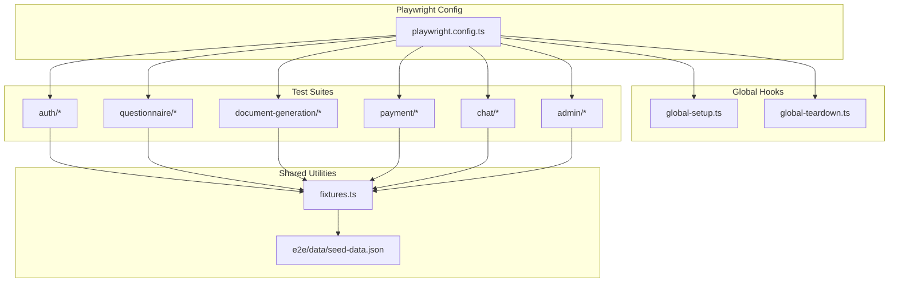
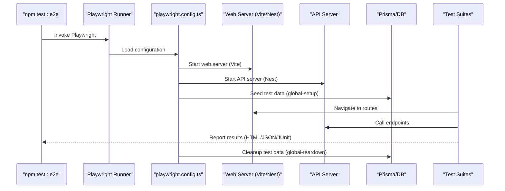
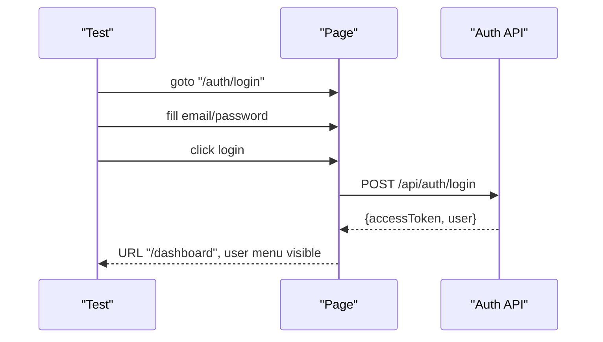
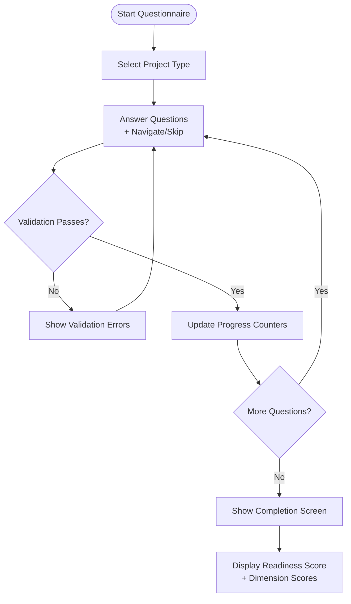
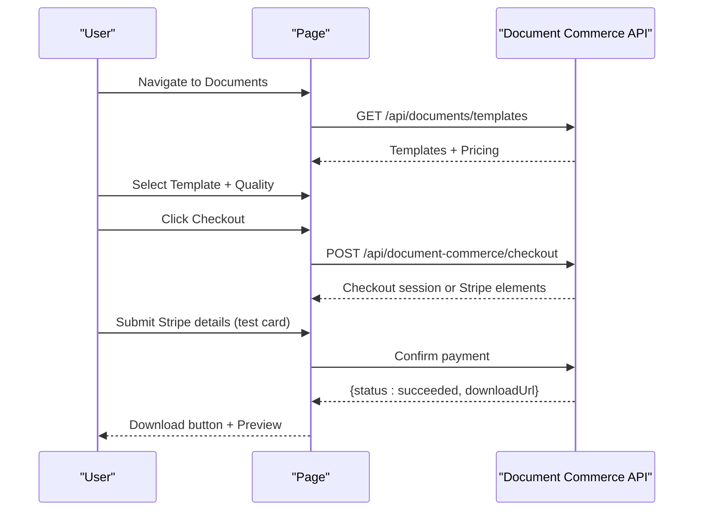
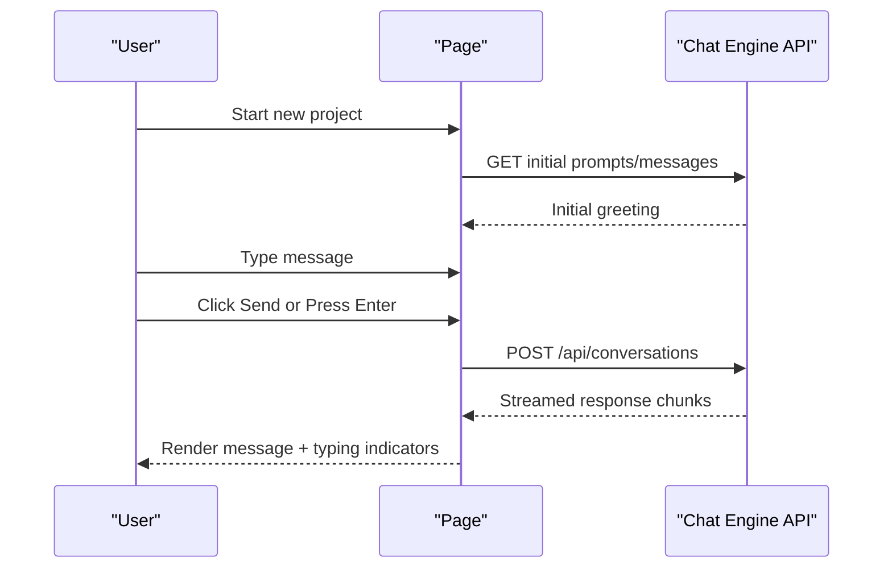
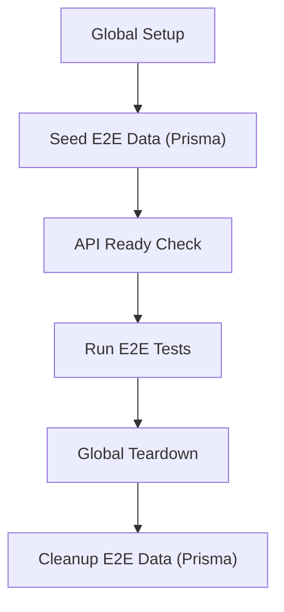
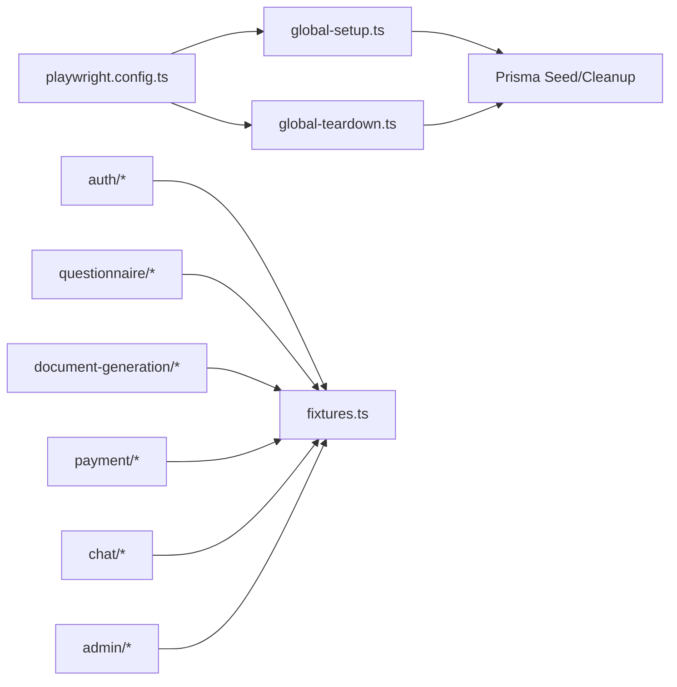

# End-to-End Testing

<cite>
**Referenced Files in This Document**
- [playwright.config.ts](file://playwright.config.ts)
- [package.json](file://package.json)
- [global-setup.ts](file://e2e/global-setup.ts)
- [global-teardown.ts](file://e2e/global-teardown.ts)
- [fixtures.ts](file://e2e/fixtures.ts)
- [login.e2e.test.ts](file://e2e/auth/login.e2e.test.ts)
- [complete-flow.e2e.test.ts](file://e2e/questionnaire/complete-flow.e2e.test.ts)
- [session-flow.e2e.test.ts](file://e2e/questionnaire/session-flow.e2e.test.ts)
- [adaptive.e2e.test.ts](file://e2e/questionnaire/adaptive.e2e.test.ts)
- [generation-flow.e2e.test.ts](file://e2e/document-generation/generation-flow.e2e.test.ts)
- [payment.e2e.test.ts](file://e2e/payment/payment.e2e.test.ts)
- [chat-flow.e2e.test.ts](file://e2e/chat/chat-flow.e2e.test.ts)
- [dashboard.e2e.test.ts](file://e2e/admin/dashboard.e2e.test.ts)
- [seed-data.json](file://e2e/data/seed-data.json)
</cite>

## Table of Contents
1. [Introduction](#introduction)
2. [Project Structure](#project-structure)
3. [Core Components](#core-components)
4. [Architecture Overview](#architecture-overview)
5. [Detailed Component Analysis](#detailed-component-analysis)
6. [Dependency Analysis](#dependency-analysis)
7. [Performance Considerations](#performance-considerations)
8. [Troubleshooting Guide](#troubleshooting-guide)
9. [Conclusion](#conclusion)
10. [Appendices](#appendices)

## Introduction
This document provides comprehensive end-to-end testing guidance for Quiz-to-Build using Playwright. It explains configuration, environment management, test data handling, and robust testing strategies across authentication, questionnaire flows, document generation, payments, chat, and admin workflows. It also covers page object modeling, element locators, cross-browser/mobile testing, responsive design validation, and debugging techniques including screenshots and videos.

## Project Structure
The E2E suite is organized under the e2e directory with focused suites per domain:
- Authentication: login, logout, session persistence, password reset
- Questionnaire: session lifecycle, question types, adaptive logic, completion
- Document generation: document selection, checkout, downloads, previews
- Payments: billing, upgrade flow, Stripe integration patterns
- Chat: conversational UI, streaming, error handling
- Admin: dashboard, approvals, user management (placeholder tests)

**Diagram sources**
- [playwright.config.ts:1-133](file://playwright.config.ts#L1-L133)
- [global-setup.ts:1-70](file://e2e/global-setup.ts#L1-L70)
- [global-teardown.ts:1-31](file://e2e/global-teardown.ts#L1-L31)
- [fixtures.ts:1-837](file://e2e/fixtures.ts#L1-L837)
- [seed-data.json:1-54](file://e2e/data/seed-data.json#L1-L54)

**Section sources**
- [playwright.config.ts:1-133](file://playwright.config.ts#L1-L133)
- [package.json:31-36](file://package.json#L31-L36)

## Core Components
- Playwright configuration defines test directories, projects, timeouts, reporters, and web server orchestration.
- Global setup waits for API readiness and seeds test data via Prisma.
- Global teardown cleans up seeded data.
- Fixtures provide reusable users, questionnaires, responses, subscriptions, Stripe test cards, and helpers for page interactions, API utilities, mocking, assertions, and wait helpers.

Key capabilities:
- Parallel test execution with controlled workers on CI.
- Multi-browser projects (Chromium, Firefox, WebKit) plus mobile devices.
- Trace, screenshot, and video collection on first retry.
- Automatic web server startup for frontend and API.

**Section sources**
- [playwright.config.ts:7-133](file://playwright.config.ts#L7-L133)
- [global-setup.ts:9-67](file://e2e/global-setup.ts#L9-L67)
- [global-teardown.ts:9-28](file://e2e/global-teardown.ts#L9-L28)
- [fixtures.ts:12-837](file://e2e/fixtures.ts#L12-L837)

## Architecture Overview
The E2E architecture integrates Playwright with the Quiz-to-Build stack:
- Playwright runs tests against the local development server (Vite) and NestJS API.
- Tests use data fixtures and helper utilities for consistent interactions.
- Global hooks ensure a clean, seeded environment before tests and cleanup afterward.

**Diagram sources**
- [playwright.config.ts:101-123](file://playwright.config.ts#L101-L123)
- [global-setup.ts:49-64](file://e2e/global-setup.ts#L49-L64)
- [global-teardown.ts:12-25](file://e2e/global-teardown.ts#L12-L25)
- [package.json:31-36](file://package.json#L31-L36)

## Detailed Component Analysis

### Playwright Configuration and Environment Management
- Projects: Chromium, Firefox, Safari, Pixel 5, iPhone 12.
- Timeouts: action, navigation, test, expect.
- Artifacts: HTML, JSON, JUnit reports; traces, screenshots on failure, videos on first retry.
- Web server: starts Vite (frontend) and Nest (API) automatically unless disabled.
- Global hooks: setup and teardown orchestrate seeding and cleanup.

Best practices:
- Use CI-friendly workers and retries.
- Leverage trace/video/screenshot for debugging failed tests.
- Keep baseURL configurable via environment variable.

**Section sources**
- [playwright.config.ts:57-133](file://playwright.config.ts#L57-L133)
- [package.json:31-36](file://package.json#L31-L36)

### Authentication Workflows
Tests cover:
- Form presence and validation (email format, required fields).
- Successful login, session persistence, logout, and redirects.
- Password reset initiation and token-based reset flow.
- Admin-only access checks.

Patterns:
- Use data-testid attributes for reliable selectors.
- Helpers for login/logout and navigation.
- Assertions for URL transitions and UI elements.

**Diagram sources**
- [login.e2e.test.ts:28-41](file://e2e/auth/login.e2e.test.ts#L28-L41)
- [fixtures.ts:428-443](file://e2e/fixtures.ts#L428-L443)

**Section sources**
- [login.e2e.test.ts:8-194](file://e2e/auth/login.e2e.test.ts#L8-L194)
- [fixtures.ts:396-443](file://e2e/fixtures.ts#L396-L443)

### Questionnaire Workflows
Coverage includes:
- Starting a new session from project types.
- Answering all 11 question types (boolean, scale, text, single/multiple choice, dropdown, percentage, date, number, matrix, file upload).
- Navigation, skipping optional questions, best practices guidance.
- Progress tracking, completion screen, score display, heatmap.
- Validation rules (required, ranges, lengths).
- Adaptive logic: conditional questions, section visibility, branching, skip reasons.

**Diagram sources**
- [complete-flow.e2e.test.ts:26-260](file://e2e/questionnaire/complete-flow.e2e.test.ts#L26-L260)
- [adaptive.e2e.test.ts:18-101](file://e2e/questionnaire/adaptive.e2e.test.ts#L18-L101)

**Section sources**
- [complete-flow.e2e.test.ts:8-395](file://e2e/questionnaire/complete-flow.e2e.test.ts#L8-L395)
- [session-flow.e2e.test.ts:16-242](file://e2e/questionnaire/session-flow.e2e.test.ts#L16-L242)
- [adaptive.e2e.test.ts:8-354](file://e2e/questionnaire/adaptive.e2e.test.ts#L8-L354)

### Document Generation and Checkout
Focus areas:
- Document menu discovery, pricing, quality levels, availability based on facts.
- Selection flow, price calculation, checkout initiation.
- Generated documents listing, download buttons, preview modal.
- Stripe integration patterns (test cards, 3D Secure, error handling).

**Diagram sources**
- [generation-flow.e2e.test.ts:28-212](file://e2e/document-generation/generation-flow.e2e.test.ts#L28-L212)
- [payment.e2e.test.ts:124-192](file://e2e/payment/payment.e2e.test.ts#L124-L192)

**Section sources**
- [generation-flow.e2e.test.ts:28-302](file://e2e/document-generation/generation-flow.e2e.test.ts#L28-L302)
- [payment.e2e.test.ts:21-523](file://e2e/payment/payment.e2e.test.ts#L21-L523)

### Chat and Real-Time Features
Scenarios:
- Chat interface presence, message input, send button, initial AI greeting.
- Sending messages, receiving AI responses, Enter key submission.
- Message history persistence across reloads, conversation threading.
- Message limit indicators, quality score updates, error handling (network failures).
- Streaming indicators and typing animations.

**Diagram sources**
- [chat-flow.e2e.test.ts:35-139](file://e2e/chat/chat-flow.e2e.test.ts#L35-L139)

**Section sources**
- [chat-flow.e2e.test.ts:1-337](file://e2e/chat/chat-flow.e2e.test.ts#L1-L337)

### Admin Workflows
Current state:
- Many admin routes are placeholders with skip markers indicating roadmap features.
- Functional tests exist for admin login access control and denying non-admins.

Recommendation:
- Implement missing routes and enable tests progressively.
- Use fixtures for admin/moderator roles and approval requests.

**Section sources**
- [dashboard.e2e.test.ts:8-444](file://e2e/admin/dashboard.e2e.test.ts#L8-L444)

### Page Object Modeling and Element Locators
Recommended patterns:
- Centralize selectors in fixtures or dedicated page objects.
- Use data-testid attributes for deterministic selectors.
- Group related interactions into helper classes (TestHelpers, ApiUtils, WaitUtils, MockUtils, AssertionUtils).
- Prefer semantic roles (buttons, textbox, dialog) alongside test ids.

Examples of locator strategies:
- `[data-testid="login-button"]`, `[data-testid="email-input"]`
- `[data-testid="question-text"]`, `[data-testid="submit-answer"]`
- `[data-testid="document-card"]`, `[data-testid="checkout-button"]`
- `[data-testid="user-menu"]`, `[data-testid="logout-button"]`

**Section sources**
- [fixtures.ts:422-528](file://e2e/fixtures.ts#L422-L528)
- [login.e2e.test.ts:13-98](file://e2e/auth/login.e2e.test.ts#L13-L98)
- [complete-flow.e2e.test.ts:47-195](file://e2e/questionnaire/complete-flow.e2e.test.ts#L47-L195)

### Cross-Browser and Mobile Testing
Projects configured for:
- Desktop: Chromium, Firefox, Safari
- Mobile: Pixel 5, iPhone 12

Guidance:
- Run subsets on headed mode for debugging.
- Use smaller viewport sizes to emulate mobile.
- Validate critical flows on all desktop browsers; prioritize mobile for navigation and touch interactions.

**Section sources**
- [playwright.config.ts:57-92](file://playwright.config.ts#L57-L92)

### Responsive Design and Device Testing
- Use device emulations for mobile.
- Validate navigation menus, input fields, and actionable elements at different widths.
- Capture screenshots for visual regressions.

**Section sources**
- [playwright.config.ts:48-48](file://playwright.config.ts#L48-L48)

### Test Data Management and User Sessions
- Global setup seeds test data via Prisma using a seed script.
- Global teardown invokes cleanup script.
- Fixtures provide predefined users, questionnaires, responses, subscriptions, and Stripe test cards.
- Helpers support API-driven creation of sessions and responses.

**Diagram sources**
- [global-setup.ts:49-64](file://e2e/global-setup.ts#L49-L64)
- [global-teardown.ts:12-25](file://e2e/global-teardown.ts#L12-L25)
- [fixtures.ts:12-837](file://e2e/fixtures.ts#L12-L837)

**Section sources**
- [global-setup.ts:9-67](file://e2e/global-setup.ts#L9-L67)
- [global-teardown.ts:9-28](file://e2e/global-teardown.ts#L9-L28)
- [seed-data.json:1-54](file://e2e/data/seed-data.json#L1-L54)

### Debugging, Screenshots, and Videos
- Traces, screenshots on failure, and videos on first retry are enabled.
- Use Playwright Inspector and UI mode for interactive debugging.
- Reports are exported in HTML, JSON, and JUnit formats for CI integration.

**Section sources**
- [playwright.config.ts:38-45](file://playwright.config.ts#L38-L45)
- [package.json:33-36](file://package.json#L33-L36)

## Dependency Analysis
High-level dependencies:
- Playwright configuration depends on global hooks and test suites.
- Test suites depend on fixtures and shared helpers.
- Global hooks depend on Prisma seed/cleanup scripts.
- Package scripts orchestrate Playwright execution and reporting.

**Diagram sources**
- [playwright.config.ts:94-123](file://playwright.config.ts#L94-L123)
- [global-setup.ts:49-64](file://e2e/global-setup.ts#L49-L64)
- [global-teardown.ts:12-25](file://e2e/global-teardown.ts#L12-L25)
- [fixtures.ts:1-837](file://e2e/fixtures.ts#L1-L837)

**Section sources**
- [playwright.config.ts:94-123](file://playwright.config.ts#L94-L123)
- [package.json:31-36](file://package.json#L31-L36)

## Performance Considerations
- Keep retries minimal on CI; rely on deterministic fixtures and seeded data.
- Use expect timeouts judiciously; prefer explicit waits for dynamic content.
- Parallel workers: limit on CI to avoid resource contention.
- Avoid heavy file uploads in CI; mock or use small test assets.

## Troubleshooting Guide
Common issues and resolutions:
- API not ready: global setup enforces health checks; ensure API_URL and ports are correct.
- Flaky selectors: prefer data-testid attributes; avoid brittle text/content selectors.
- Network failures: use MockUtils to stub endpoints; verify error surfaces gracefully.
- Session issues: leverage TestHelpers.login/logout; clear state when needed.
- Mobile/device quirks: adjust viewport and interactions; test on target devices/emulators.

Debugging tips:
- Enable headed mode for visual inspection.
- Inspect traces and videos for failed tests.
- Use Playwright Inspector to explore DOM and interactions.

**Section sources**
- [global-setup.ts:18-44](file://e2e/global-setup.ts#L18-L44)
- [fixtures.ts:699-746](file://e2e/fixtures.ts#L699-L746)
- [chat-flow.e2e.test.ts:292-310](file://e2e/chat/chat-flow.e2e.test.ts#L292-L310)

## Conclusion
The Quiz-to-Build E2E suite leverages Playwright’s robust configuration, global hooks, and shared fixtures to deliver reliable, cross-browser, and mobile-tested workflows. By focusing on deterministic selectors, comprehensive validation, and structured helpers, teams can confidently validate authentication, questionnaire experiences, document generation, payments, chat, and admin functionalities.

## Appendices

### Quick Commands
- Run all E2E tests locally: `npm run test:e2e`
- Run with headed browser: `npm run test:e2e:headed`
- Run UI mode: `npm run test:e2e:ui`
- Show report: `npm run test:e2e:report`
- Install browsers: `npm run test:e2e:install`

**Section sources**
- [package.json:31-36](file://package.json#L31-L36)