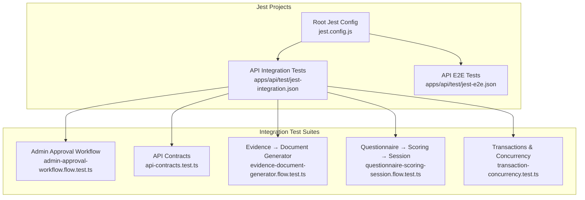
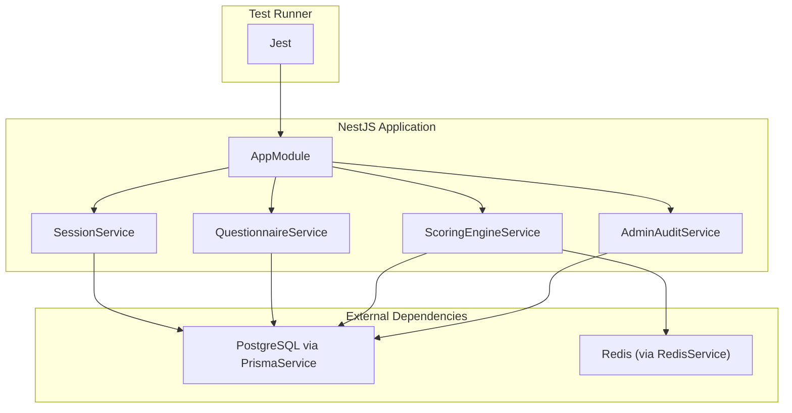
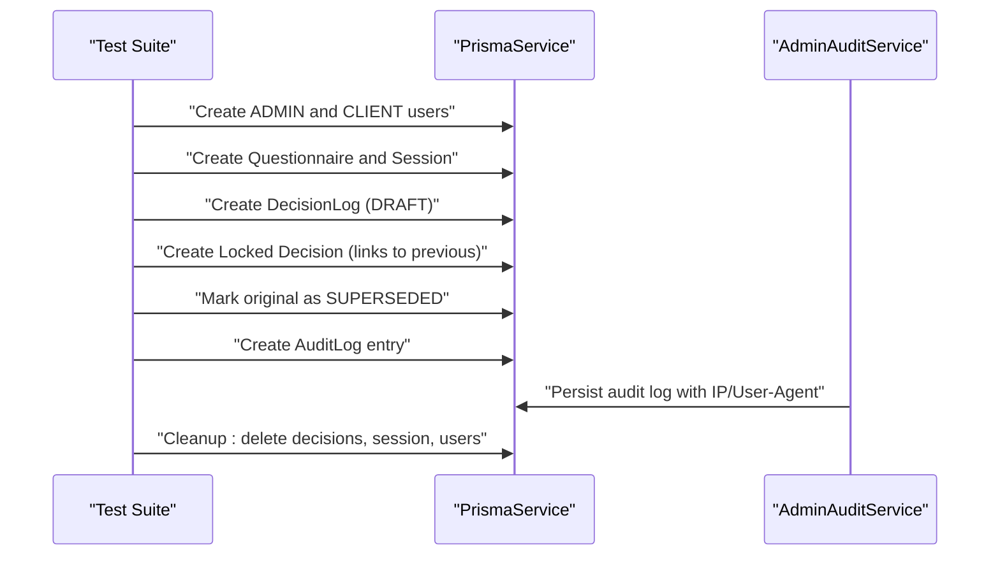
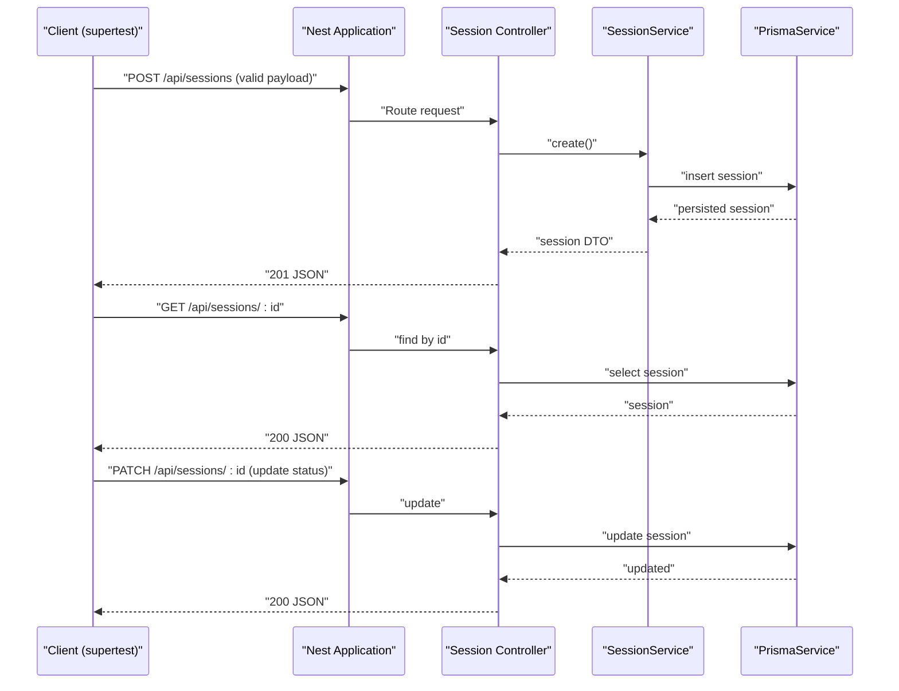
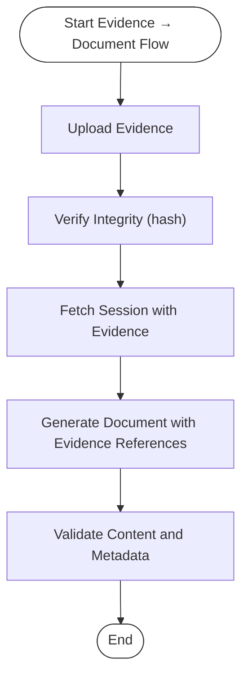
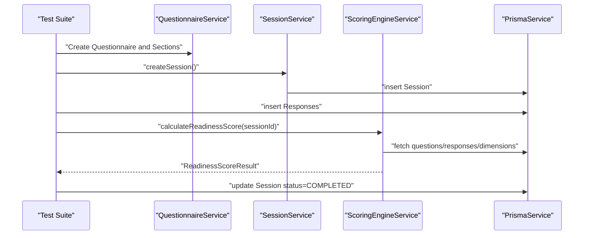
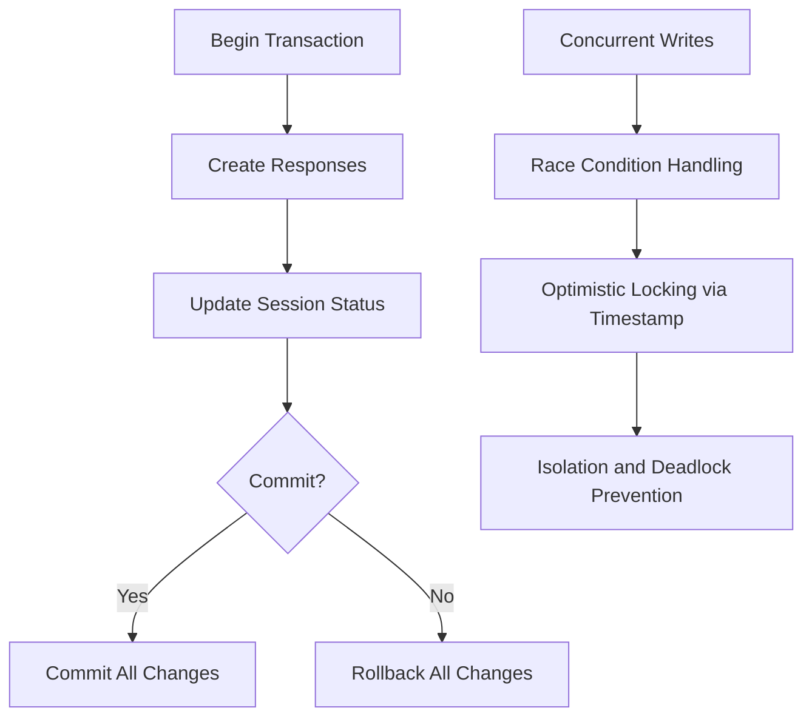
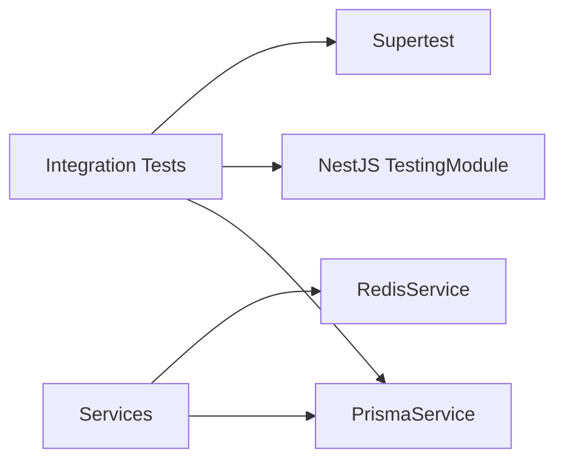

# Integration Testing

<cite>
**Referenced Files in This Document**
- [admin-approval-workflow.flow.test.ts](file://apps/api/test/integration/admin-approval-workflow.flow.test.ts)
- [api-contracts.test.ts](file://apps/api/test/integration/api-contracts.test.ts)
- [evidence-document-generator.flow.test.ts](file://apps/api/test/integration/evidence-document-generator.flow.test.ts)
- [questionnaire-scoring-session.flow.test.ts](file://apps/api/test/integration/questionnaire-scoring-session.flow.test.ts)
- [transaction-concurrency.test.ts](file://apps/api/test/integration/transaction-concurrency.test.ts)
- [jest-integration.json](file://apps/api/test/jest-integration.json)
- [jest-e2e.json](file://apps/api/test/jest-e2e.json)
- [jest.config.js](file://jest.config.js)
- [session.service.ts](file://apps/api/src/modules/session/session.service.ts)
- [questionnaire.service.ts](file://apps/api/src/modules/questionnaire/questionnaire.service.ts)
- [scoring-engine.service.ts](file://apps/api/src/modules/scoring-engine/scoring-engine.service.ts)
- [admin-audit.service.ts](file://apps/api/src/modules/admin/services/admin-audit.service.ts)
- [prisma.service.ts](file://libs/database/src/prisma.service.ts)
- [configuration.ts](file://apps/api/src/config/configuration.ts)
</cite>

## Table of Contents
1. [Introduction](#introduction)
2. [Project Structure](#project-structure)
3. [Core Components](#core-components)
4. [Architecture Overview](#architecture-overview)
5. [Detailed Component Analysis](#detailed-component-analysis)
6. [Dependency Analysis](#dependency-analysis)
7. [Performance Considerations](#performance-considerations)
8. [Troubleshooting Guide](#troubleshooting-guide)
9. [Conclusion](#conclusion)
10. [Appendices](#appendices)

## Introduction
This document describes the integration testing framework and patterns used in Quiz-to-Build’s backend API. It focuses on end-to-end workflows, database-backed tests, and API contract validation using Jest. The tests exercise complex multi-module flows such as questionnaire scoring sessions, evidence ingestion and document generation, admin audit trails, and transaction/concurrency scenarios. Guidance is included for database seeding/cleanup, test data management, and strategies for authenticating, processing payments, and integrating with external systems.

## Project Structure
The integration tests reside under apps/api/test/integration and are configured via Jest project-specific configurations. The root Jest configuration aggregates multiple projects, including API, CLI, and libraries.

**Diagram sources**
- [jest.config.js:1-26](file://jest.config.js#L1-L26)
- [jest-integration.json:1-27](file://apps/api/test/jest-integration.json#L1-L27)
- [jest-e2e.json:1-21](file://apps/api/test/jest-e2e.json#L1-L21)

**Section sources**
- [jest.config.js:1-26](file://jest.config.js#L1-L26)
- [jest-integration.json:1-27](file://apps/api/test/jest-integration.json#L1-L27)
- [jest-e2e.json:1-21](file://apps/api/test/jest-e2e.json#L1-L21)

## Core Components
- Database connectivity: PrismaService provides a pooled, configurable client and a cleanDatabase utility for test isolation.
- Service orchestration: SessionService delegates to query and mutation services; QuestionnaireService exposes questionnaires and sections; ScoringEngineService computes readiness scores and caches results.
- Audit and admin: AdminAuditService logs administrative actions with request metadata.
- Configuration: configuration.ts validates production environment variables and builds runtime settings.

These components form the backbone of integration tests that validate real database operations, cross-service interactions, and API contracts.

**Section sources**
- [prisma.service.ts:1-119](file://libs/database/src/prisma.service.ts#L1-L119)
- [session.service.ts:1-116](file://apps/api/src/modules/session/session.service.ts#L1-L116)
- [questionnaire.service.ts:1-200](file://apps/api/src/modules/questionnaire/questionnaire.service.ts#L1-L200)
- [scoring-engine.service.ts:1-200](file://apps/api/src/modules/scoring-engine/scoring-engine.service.ts#L1-L200)
- [admin-audit.service.ts:1-58](file://apps/api/src/modules/admin/services/admin-audit.service.ts#L1-L58)
- [configuration.ts:1-115](file://apps/api/src/config/configuration.ts#L1-L115)

## Architecture Overview
The integration tests instantiate NestJS modules with real database connections and external dependencies (e.g., Redis caching in scoring). They validate:
- End-to-end workflows spanning multiple modules
- Database transactions and concurrency
- API contracts via supertest against a running application
- Audit and admin workflows

**Diagram sources**
- [session.service.ts:30-50](file://apps/api/src/modules/session/session.service.ts#L30-L50)
- [questionnaire.service.ts:66-68](file://apps/api/src/modules/questionnaire/questionnaire.service.ts#L66-L68)
- [scoring-engine.service.ts:54-64](file://apps/api/src/modules/scoring-engine/scoring-engine.service.ts#L54-L64)
- [admin-audit.service.ts:15-19](file://apps/api/src/modules/admin/services/admin-audit.service.ts#L15-L19)
- [prisma.service.ts:20-41](file://libs/database/src/prisma.service.ts#L20-L41)

## Detailed Component Analysis

### Admin Approval Workflow Integration
This suite documents the append-only DecisionLog pattern and admin audit logging. It creates users, questionnaires, sessions, and decisions, then verifies status transitions and audit entries.

**Diagram sources**
- [admin-approval-workflow.flow.test.ts:34-99](file://apps/api/test/integration/admin-approval-workflow.flow.test.ts#L34-L99)
- [admin-audit.service.ts:21-44](file://apps/api/src/modules/admin/services/admin-audit.service.ts#L21-L44)

**Section sources**
- [admin-approval-workflow.flow.test.ts:1-247](file://apps/api/test/integration/admin-approval-workflow.flow.test.ts#L1-L247)
- [admin-audit.service.ts:1-58](file://apps/api/src/modules/admin/services/admin-audit.service.ts#L1-L58)

### API Contract Testing
This suite validates HTTP endpoints for sessions using supertest against a running application instance. It checks request/response shapes, validation, error formats, headers, pagination, and CORS behavior.

**Diagram sources**
- [api-contracts.test.ts:26-76](file://apps/api/test/integration/api-contracts.test.ts#L26-L76)
- [session.service.ts:80-94](file://apps/api/src/modules/session/session.service.ts#L80-L94)

**Section sources**
- [api-contracts.test.ts:1-419](file://apps/api/test/integration/api-contracts.test.ts#L1-L419)
- [session.service.ts:1-116](file://apps/api/src/modules/session/session.service.ts#L1-L116)

### Evidence → Document Generator Flow
This suite simulates uploading evidence, verifying integrity, and generating documents that reference verified evidence. It exercises Prisma relations and documents the expected metadata and references.

**Diagram sources**
- [evidence-document-generator.flow.test.ts:133-237](file://apps/api/test/integration/evidence-document-generator.flow.test.ts#L133-L237)

**Section sources**
- [evidence-document-generator.flow.test.ts:1-534](file://apps/api/test/integration/evidence-document-generator.flow.test.ts#L1-L534)

### Questionnaire → Scoring → Session Flow
This suite validates the end-to-end flow from creating a session, answering questions, calculating readiness scores, and completing the session. It also covers scoring sensitivity to severity and response changes.

**Diagram sources**
- [questionnaire-scoring-session.flow.test.ts:97-209](file://apps/api/test/integration/questionnaire-scoring-session.flow.test.ts#L97-L209)
- [scoring-engine.service.ts:70-164](file://apps/api/src/modules/scoring-engine/scoring-engine.service.ts#L70-L164)

**Section sources**
- [questionnaire-scoring-session.flow.test.ts:1-435](file://apps/api/test/integration/questionnaire-scoring-session.flow.test.ts#L1-L435)
- [scoring-engine.service.ts:1-200](file://apps/api/src/modules/scoring-engine/scoring-engine.service.ts#L1-L200)

### Transactions & Concurrency
This suite exercises atomic transactions, rollback semantics, concurrent writes, race conditions, optimistic locking, isolation levels, and connection pool behavior.

**Diagram sources**
- [transaction-concurrency.test.ts:107-242](file://apps/api/test/integration/transaction-concurrency.test.ts#L107-L242)
- [transaction-concurrency.test.ts:360-424](file://apps/api/test/integration/transaction-concurrency.test.ts#L360-L424)

**Section sources**
- [transaction-concurrency.test.ts:1-654](file://apps/api/test/integration/transaction-concurrency.test.ts#L1-L654)

## Dependency Analysis
Integration tests depend on:
- NestJS testing module to bootstrap services and database
- PrismaService for database operations and cleanup
- Supertest for API contract validation
- Redis for caching in scoring workflows

**Diagram sources**
- [prisma.service.ts:20-41](file://libs/database/src/prisma.service.ts#L20-L41)
- [scoring-engine.service.ts:54-64](file://apps/api/src/modules/scoring-engine/scoring-engine.service.ts#L54-L64)

**Section sources**
- [prisma.service.ts:1-119](file://libs/database/src/prisma.service.ts#L1-L119)
- [scoring-engine.service.ts:1-200](file://apps/api/src/modules/scoring-engine/scoring-engine.service.ts#L1-L200)

## Performance Considerations
- Use Jest project isolation to parallelize suites while keeping database contention manageable.
- Prefer transactional test steps to reduce round trips and maintain consistency.
- Leverage caching (Redis) in scoring to minimize repeated computation across tests.
- Keep test data minimal and scoped to reduce query and transaction overhead.

## Troubleshooting Guide
Common issues and remedies:
- Database connectivity failures: Ensure DATABASE_URL is set and reachable; verify connection pool parameters.
- Missing environment variables in production-like contexts: configuration.ts enforces strict validation for secrets and CORS.
- Test timeouts: Increase Jest testTimeout in project configs if heavy transactions or concurrent operations are involved.
- Cleanup failures: Use PrismaService.cleanDatabase only in controlled test environments; otherwise rely on suite-level teardown.

**Section sources**
- [configuration.ts:5-43](file://apps/api/src/config/configuration.ts#L5-L43)
- [prisma.service.ts:99-117](file://libs/database/src/prisma.service.ts#L99-L117)
- [jest-integration.json:24](file://apps/api/test/jest-integration.json#L24)
- [jest-e2e.json:19](file://apps/api/test/jest-e2e.json#L19)

## Conclusion
The integration test suite validates Quiz-to-Build’s end-to-end workflows, database transactions, and API contracts. By leveraging NestJS modules, Prisma, and Redis, the tests ensure correctness across complex multi-service flows. The documented patterns provide a blueprint for extending coverage to authentication, payment processing, and external registry integrations.

## Appendices

### Testing Patterns and Examples
- Database transactions and rollbacks: See atomic transaction and rollback assertions.
- Concurrency and race conditions: See concurrent updates and optimistic locking demonstrations.
- API contract validation: See endpoint-level tests for create, read, update, delete, pagination, and error responses.
- Cross-module dependencies: See scoring engine integration with Redis and Prisma.
- Audit and admin workflows: See append-only decision lifecycle and audit logging.

**Section sources**
- [transaction-concurrency.test.ts:107-242](file://apps/api/test/integration/transaction-concurrency.test.ts#L107-L242)
- [transaction-concurrency.test.ts:360-424](file://apps/api/test/integration/transaction-concurrency.test.ts#L360-L424)
- [api-contracts.test.ts:78-404](file://apps/api/test/integration/api-contracts.test.ts#L78-L404)
- [scoring-engine.service.ts:54-64](file://apps/api/src/modules/scoring-engine/scoring-engine.service.ts#L54-L64)
- [admin-approval-workflow.flow.test.ts:183-206](file://apps/api/test/integration/admin-approval-workflow.flow.test.ts#L183-L206)