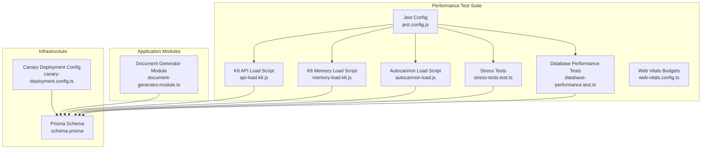
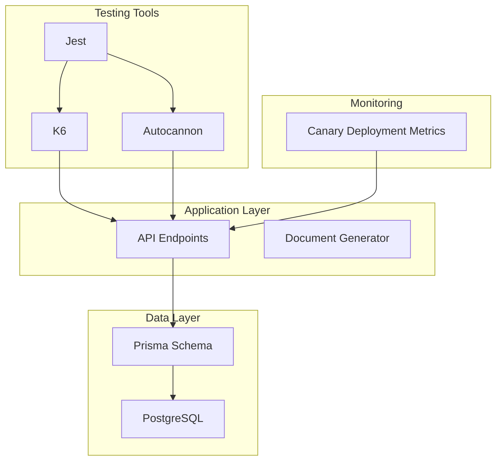
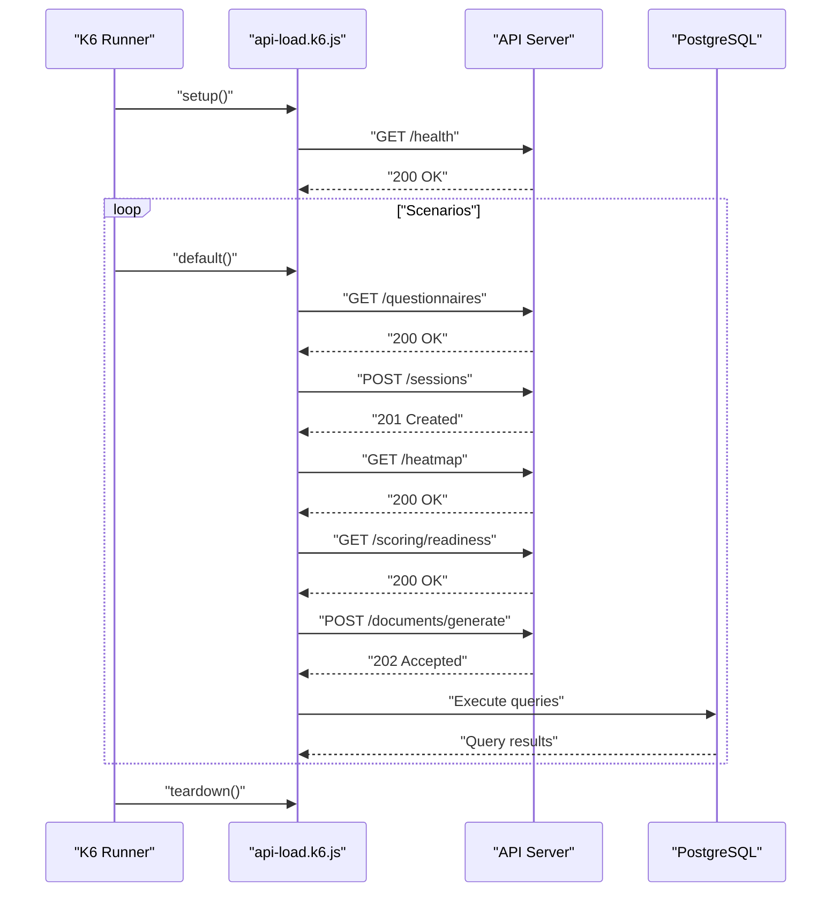
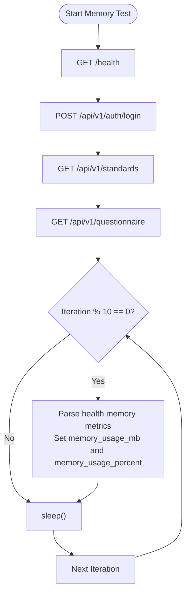
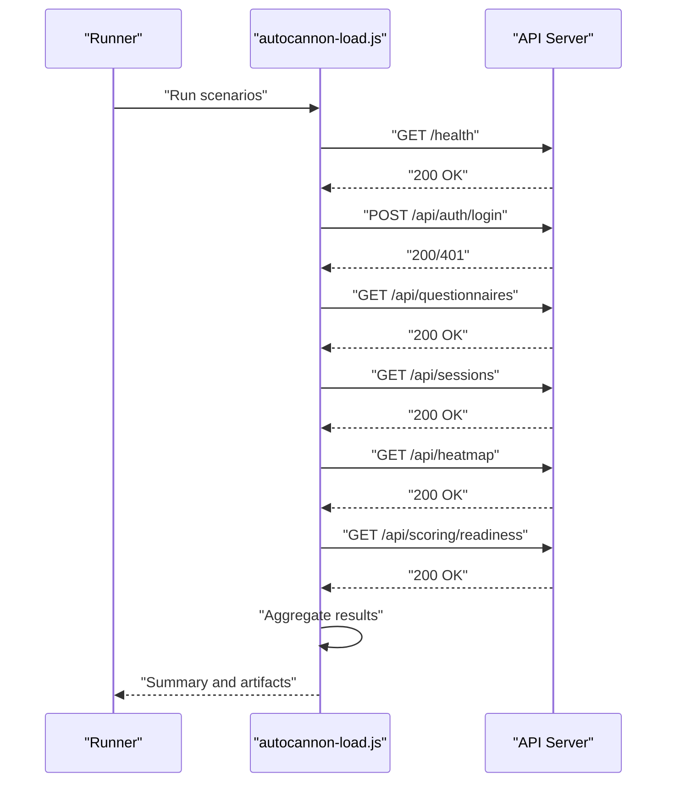
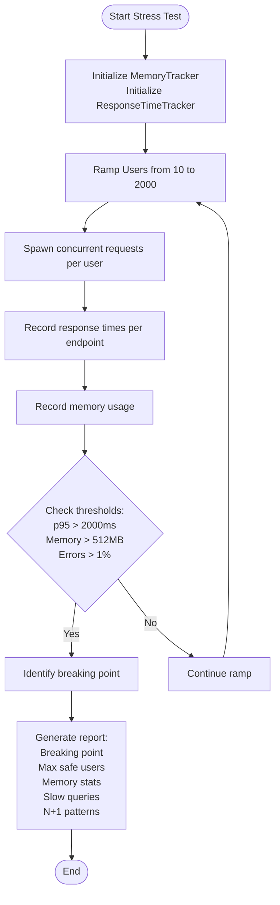
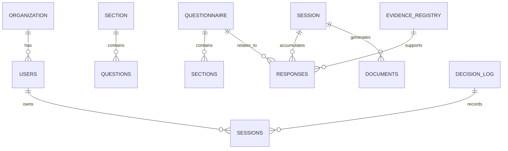
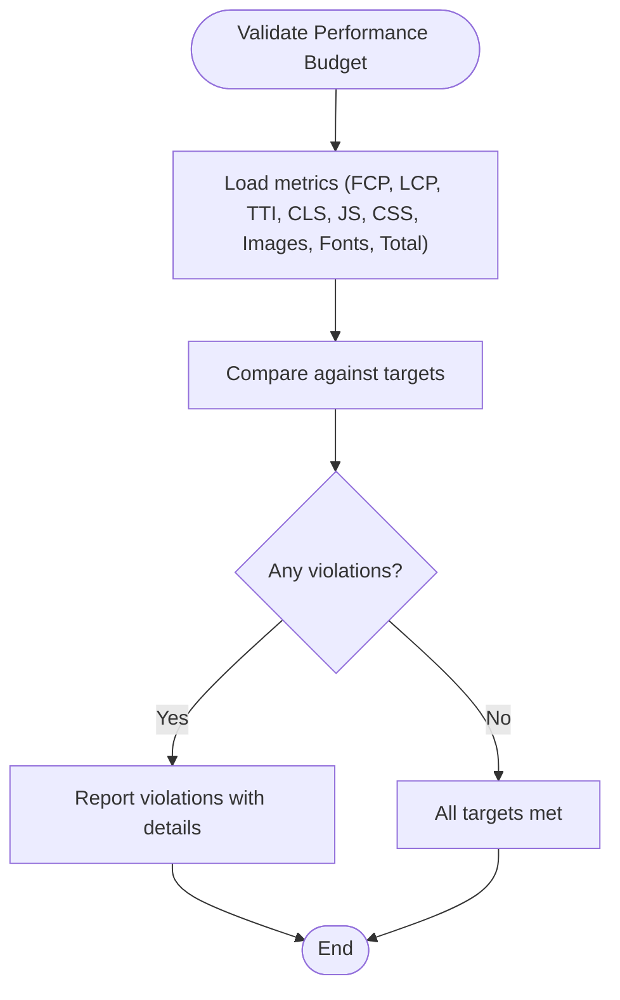
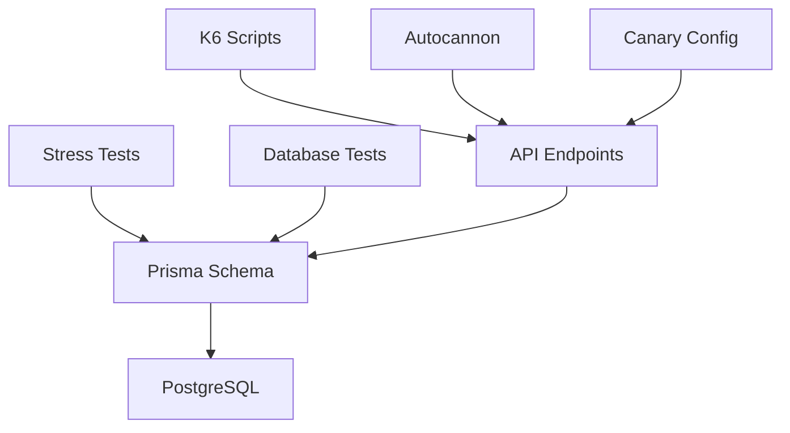

# Performance Testing

<cite>
**Referenced Files in This Document**
- [api-load.k6.js](file://test/performance/api-load.k6.js)
- [memory-load.k6.js](file://test/performance/memory-load.k6.js)
- [stress-tests.test.ts](file://test/performance/stress-tests.test.ts)
- [database-performance.test.ts](file://test/performance/database-performance.test.ts)
- [autocannon-load.js](file://test/performance/autocannon-load.js)
- [jest.config.js](file://test/performance/jest.config.js)
- [web-vitals.config.ts](file://test/performance/web-vitals.config.ts)
- [package.json](file://package.json)
- [document-generator.module.ts](file://apps/api/src/modules/document-generator/document-generator.module.ts)
- [schema.prisma](file://prisma/schema.prisma)
- [canary-deployment.config.ts](file://apps/api/src/config/canary-deployment.config.ts)
</cite>

## Table of Contents
1. [Introduction](#introduction)
2. [Project Structure](#project-structure)
3. [Core Components](#core-components)
4. [Architecture Overview](#architecture-overview)
5. [Detailed Component Analysis](#detailed-component-analysis)
6. [Dependency Analysis](#dependency-analysis)
7. [Performance Considerations](#performance-considerations)
8. [Troubleshooting Guide](#troubleshooting-guide)
9. [Conclusion](#conclusion)
10. [Appendices](#appendices)

## Introduction
This document provides comprehensive performance testing guidance for Quiz-to-Build, focusing on scalability and load testing strategies. It covers K6-based API load testing, memory leak detection, database performance validation, and stress testing methodologies. It also includes examples of load test scenarios for questionnaire processing, document generation under load, and concurrent user sessions. Guidance is provided for performance metrics collection, bottleneck identification, optimization strategies, baseline establishment, resource monitoring, capacity planning, database query optimization testing, and caching effectiveness validation.

## Project Structure
The performance testing suite is organized under the test/performance directory and integrates with the broader test ecosystem via Jest configuration and npm scripts. The suite includes:
- K6 scripts for API and memory load testing
- Node.js-based autocannon load tests
- Stress and database performance tests
- Web Vitals performance budgets
- Jest configuration for performance suites

**Diagram sources**
- [api-load.k6.js:1-303](file://test/performance/api-load.k6.js#L1-L303)
- [memory-load.k6.js:1-174](file://test/performance/memory-load.k6.js#L1-L174)
- [autocannon-load.js:1-337](file://test/performance/autocannon-load.js#L1-L337)
- [stress-tests.test.ts:1-525](file://test/performance/stress-tests.test.ts#L1-L525)
- [database-performance.test.ts:1-391](file://test/performance/database-performance.test.ts#L1-L391)
- [web-vitals.config.ts:1-132](file://test/performance/web-vitals.config.ts#L1-L132)
- [jest.config.js:1-27](file://test/performance/jest.config.js#L1-L27)
- [document-generator.module.ts:1-47](file://apps/api/src/modules/document-generator/document-generator.module.ts#L1-L47)
- [schema.prisma:1-800](file://prisma/schema.prisma#L1-L800)
- [canary-deployment.config.ts:603-650](file://apps/api/src/config/canary-deployment.config.ts#L603-L650)

**Section sources**
- [api-load.k6.js:1-303](file://test/performance/api-load.k6.js#L1-L303)
- [memory-load.k6.js:1-174](file://test/performance/memory-load.k6.js#L1-L174)
- [autocannon-load.js:1-337](file://test/performance/autocannon-load.js#L1-L337)
- [stress-tests.test.ts:1-525](file://test/performance/stress-tests.test.ts#L1-L525)
- [database-performance.test.ts:1-391](file://test/performance/database-performance.test.ts#L1-L391)
- [web-vitals.config.ts:1-132](file://test/performance/web-vitals.config.ts#L1-L132)
- [jest.config.js:1-27](file://test/performance/jest.config.js#L1-L27)

## Core Components
- K6 API Load Script: Implements smoke, load, stress, and spike scenarios with custom metrics and thresholds for API endpoints including authentication, questionnaire operations, session management, scoring engine, and document generation.
- K6 Memory Load Script: Validates memory stability under sustained load using health endpoint metrics and custom gauges for memory usage percentage and MB.
- Autocannon Load Script: Provides Node.js-based load testing with configurable connections, pipelining, and scenario thresholds for health checks, authentication, and key API endpoints.
- Stress Tests: Simulates increasing load to identify breaking points, detects memory leaks via linear regression, profiles database queries, and validates response time distributions.
- Database Performance Tests: Benchmarks query performance thresholds, verifies index usage, detects N+1 patterns, and validates connection pool configuration.
- Web Vitals Budgets: Defines performance budgets for Core Web Vitals and resource sizes to guide frontend performance baselines.
- Jest Configuration: Sets up the test environment for performance suites with extended timeouts and module resolution.

**Section sources**
- [api-load.k6.js:1-303](file://test/performance/api-load.k6.js#L1-L303)
- [memory-load.k6.js:1-174](file://test/performance/memory-load.k6.js#L1-L174)
- [autocannon-load.js:1-337](file://test/performance/autocannon-load.js#L1-L337)
- [stress-tests.test.ts:1-525](file://test/performance/stress-tests.test.ts#L1-L525)
- [database-performance.test.ts:1-391](file://test/performance/database-performance.test.ts#L1-L391)
- [web-vitals.config.ts:1-132](file://test/performance/web-vitals.config.ts#L1-L132)
- [jest.config.js:1-27](file://test/performance/jest.config.js#L1-L27)

## Architecture Overview
The performance testing architecture integrates multiple tools and frameworks:
- K6 for cloud-native load testing with custom metrics and thresholds
- Node.js autocannon for lightweight, scriptable load tests
- Jest for orchestrating performance suites and custom test runners
- Prisma schema for database modeling and query optimization validation
- Canary deployment configuration for health checks and metrics collection

**Diagram sources**
- [api-load.k6.js:1-303](file://test/performance/api-load.k6.js#L1-L303)
- [autocannon-load.js:1-337](file://test/performance/autocannon-load.js#L1-L337)
- [document-generator.module.ts:1-47](file://apps/api/src/modules/document-generator/document-generator.module.ts#L1-L47)
- [schema.prisma:1-800](file://prisma/schema.prisma#L1-L800)
- [canary-deployment.config.ts:603-650](file://apps/api/src/config/canary-deployment.config.ts#L603-L650)

## Detailed Component Analysis

### K6 API Load Testing
The K6 script defines multiple scenarios:
- Smoke test: 10 VUs for 1 minute to validate basic functionality
- Load test: ramping VUs with staged targets to 100 VUs over 10 minutes
- Stress test: ramping VUs to 500 VUs with sustained load
- Spike test: sudden spikes to 1000 VUs for short durations

Key metrics include custom error rate, API response time, and database query time trends. Thresholds enforce response time and error rate targets.

**Diagram sources**
- [api-load.k6.js:1-303](file://test/performance/api-load.k6.js#L1-L303)

**Section sources**
- [api-load.k6.js:1-303](file://test/performance/api-load.k6.js#L1-L303)

### K6 Memory Load Testing
The memory load script focuses on sustained memory usage validation:
- Constant VU load for 5 minutes
- Periodic memory checks via health endpoint metrics
- Custom gauges for memory usage MB and percentage
- Thresholds to keep memory usage below 70%

**Diagram sources**
- [memory-load.k6.js:1-174](file://test/performance/memory-load.k6.js#L1-L174)

**Section sources**
- [memory-load.k6.js:1-174](file://test/performance/memory-load.k6.js#L1-L174)

### Autocannon Load Testing
The Node.js-based autocannon script provides:
- Configurable duration, connections, and pipelining
- Scenario definitions for health checks, authentication, and key endpoints
- Threshold validation for error rates, RPS, and latency percentiles
- Results serialization and summary reporting

**Diagram sources**
- [autocannon-load.js:1-337](file://test/performance/autocannon-load.js#L1-L337)

**Section sources**
- [autocannon-load.js:1-337](file://test/performance/autocannon-load.js#L1-L337)

### Stress Tests and Bottleneck Identification
The stress tests suite:
- Gradually increases load to identify breaking points
- Detects memory leaks using linear regression on heap usage samples
- Profiles database queries and validates index usage
- Identifies potential N+1 query patterns

**Diagram sources**
- [stress-tests.test.ts:1-525](file://test/performance/stress-tests.test.ts#L1-L525)

**Section sources**
- [stress-tests.test.ts:1-525](file://test/performance/stress-tests.test.ts#L1-L525)

### Database Performance Validation
Database performance tests validate:
- Query performance benchmarks across different record counts
- Index usage verification for critical tables
- N+1 query detection and prevention
- Connection pool configuration and concurrency limits

**Diagram sources**
- [schema.prisma:1-800](file://prisma/schema.prisma#L1-L800)

**Section sources**
- [database-performance.test.ts:1-391](file://test/performance/database-performance.test.ts#L1-L391)
- [schema.prisma:1-800](file://prisma/schema.prisma#L1-L800)

### Web Vitals Performance Budgets
Web Vitals budgets define performance targets for frontend metrics and resource sizes to ensure a high-quality user experience.

**Diagram sources**
- [web-vitals.config.ts:1-132](file://test/performance/web-vitals.config.ts#L1-L132)

**Section sources**
- [web-vitals.config.ts:1-132](file://test/performance/web-vitals.config.ts#L1-L132)

## Dependency Analysis
Performance testing components interact with the application and database layers as follows:
- K6 scripts depend on API endpoints and database queries defined in the Prisma schema
- Autocannon script depends on API endpoints and health checks configured in the canary deployment configuration
- Stress and database performance tests rely on Prisma schema models and query patterns
- Web Vitals budgets provide frontend performance baselines

**Diagram sources**
- [api-load.k6.js:1-303](file://test/performance/api-load.k6.js#L1-L303)
- [autocannon-load.js:1-337](file://test/performance/autocannon-load.js#L1-L337)
- [stress-tests.test.ts:1-525](file://test/performance/stress-tests.test.ts#L1-L525)
- [database-performance.test.ts:1-391](file://test/performance/database-performance.test.ts#L1-L391)
- [schema.prisma:1-800](file://prisma/schema.prisma#L1-L800)
- [canary-deployment.config.ts:603-650](file://apps/api/src/config/canary-deployment.config.ts#L603-L650)

**Section sources**
- [api-load.k6.js:1-303](file://test/performance/api-load.k6.js#L1-L303)
- [autocannon-load.js:1-337](file://test/performance/autocannon-load.js#L1-L337)
- [stress-tests.test.ts:1-525](file://test/performance/stress-tests.test.ts#L1-L525)
- [database-performance.test.ts:1-391](file://test/performance/database-performance.test.ts#L1-L391)
- [schema.prisma:1-800](file://prisma/schema.prisma#L1-L800)
- [canary-deployment.config.ts:603-650](file://apps/api/src/config/canary-deployment.config.ts#L603-L650)

## Performance Considerations
- Establish performance baselines using K6 smoke tests and autocannon scenarios
- Monitor resource utilization during load tests and correlate with database query performance
- Identify bottlenecks by analyzing response time percentiles and error rates
- Optimize database queries with proper indexing and by eliminating N+1 patterns
- Validate caching effectiveness for frequently accessed data
- Plan capacity based on breaking points and sustainable load thresholds
- Use Web Vitals budgets to ensure frontend performance remains within acceptable ranges

## Troubleshooting Guide
- K6 thresholds failing: Review custom metrics and adjust thresholds based on observed p95/p99 response times
- Memory leaks: Use memory load script and stress tests to detect growth trends; investigate heap usage patterns
- Database slowdowns: Validate index usage and query plans; optimize slow queries and reduce unnecessary scans
- Canary deployment failures: Check health check endpoints and rollback triggers for error rates and latency thresholds

**Section sources**
- [api-load.k6.js:85-96](file://test/performance/api-load.k6.js#L85-L96)
- [memory-load.k6.js:33-37](file://test/performance/memory-load.k6.js#L33-L37)
- [stress-tests.test.ts:235-243](file://test/performance/stress-tests.test.ts#L235-L243)
- [canary-deployment.config.ts:120-133](file://apps/api/src/config/canary-deployment.config.ts#L120-L133)

## Conclusion
The performance testing suite provides a robust foundation for validating Quiz-to-Build scalability and reliability. By combining K6 API load testing, memory load validation, autocannon scenarios, stress and database performance tests, and Web Vitals budgets, teams can establish baselines, monitor resource utilization, identify bottlenecks, and plan capacity effectively. Regular performance validation ensures consistent user experience and supports informed optimization decisions.

## Appendices
- Running performance tests:
  - K6 API load: set API_URL and run the K6 script
  - K6 memory load: configure API_URL and run the memory script
  - Autocannon load: configure API_URL, duration, connections, and pipelining
  - Stress and database tests: run via Jest configuration
- Environment variables:
  - API_URL: target API endpoint
  - AUTH_TOKEN: bearer token for protected endpoints
  - DURATION, CONNECTIONS, PIPELINING: autocannon parameters
- Metrics and thresholds:
  - K6 custom metrics include error rate, API response time, and memory usage
  - Autocannon thresholds include error rate, RPS, and latency percentiles
  - Stress test thresholds include response time and memory usage
  - Web Vitals budgets define acceptable frontend performance ranges

**Section sources**
- [package.json:15-66](file://package.json#L15-L66)
- [api-load.k6.js:24-26](file://test/performance/api-load.k6.js#L24-L26)
- [memory-load.k6.js:20-21](file://test/performance/memory-load.k6.js#L20-L21)
- [autocannon-load.js:13-17](file://test/performance/autocannon-load.js#L13-L17)
- [web-vitals.config.ts:37-52](file://test/performance/web-vitals.config.ts#L37-L52)