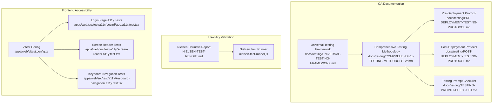
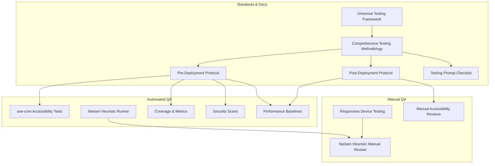
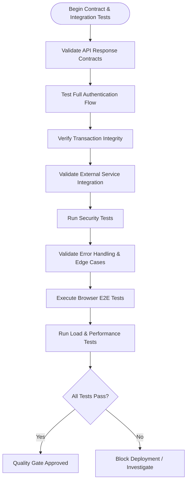
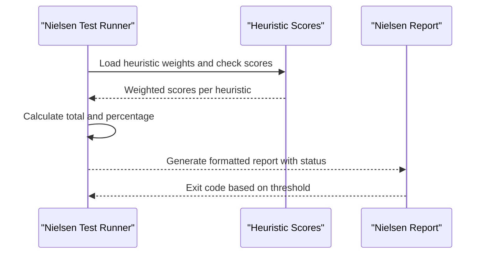
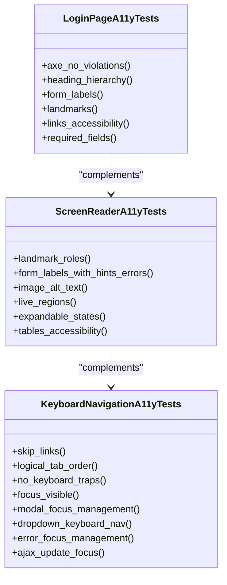
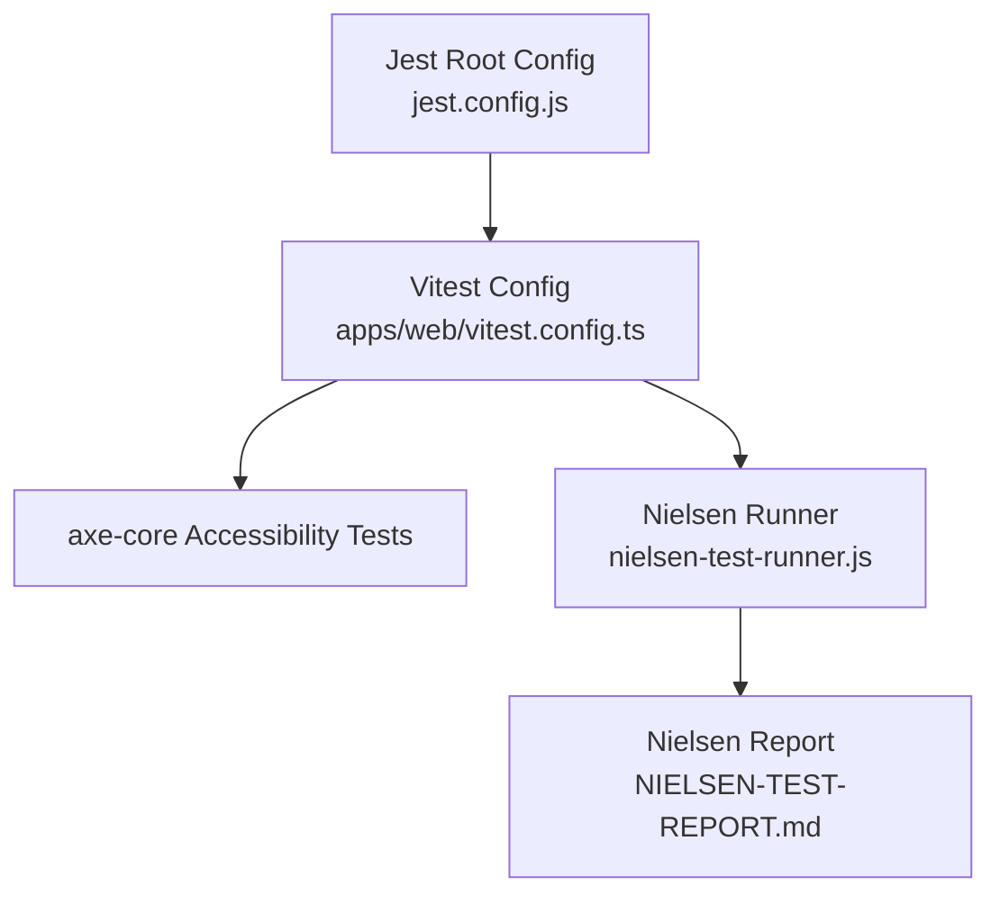

# Quality Assurance

<cite>
**Referenced Files in This Document**
- [COMPREHENSIVE-TESTING-METHODOLOGY.md](file://docs/testing/COMPREHENSIVE-TESTING-METHODOLOGY.md)
- [UNIVERSAL-TESTING-FRAMEWORK.md](file://docs/testing/UNIVERSAL-TESTING-FRAMEWORK.md)
- [TESTING-PROMPT-CHECKLIST.md](file://docs/testing/TESTING-PROMPT-CHECKLIST.md)
- [PRE-DEPLOYMENT-TESTING-PROTOCOL.md](file://docs/testing/PRE-DEPLOYMENT-TESTING-PROTOCOL.md)
- [POST-DEPLOYMENT-TESTING-PROTOCOL.md](file://docs/testing/POST-DEPLOYMENT-TESTING-PROTOCOL.md)
- [NIELSEN-TEST-REPORT.md](file://NIELSEN-TEST-REPORT.md)
- [nielsen-test-runner.js](file://nielsen-test-runner.js)
- [LoginPage.a11y.test.tsx](file://apps/web/src/test/a11y/LoginPage.a11y.test.tsx)
- [screen-reader.a11y.test.tsx](file://apps/web/src/test/a11y/screen-reader.a11y.test.tsx)
- [keyboard-navigation.a11y.test.tsx](file://apps/web/src/test/a11y/keyboard-navigation.a11y.test.tsx)
- [vitest.config.ts](file://apps/web/vitest.config.ts)
- [jest.config.js](file://jest.config.js)
</cite>

## Table of Contents
1. [Introduction](#introduction)
2. [Project Structure](#project-structure)
3. [Core Components](#core-components)
4. [Architecture Overview](#architecture-overview)
5. [Detailed Component Analysis](#detailed-component-analysis)
6. [Dependency Analysis](#dependency-analysis)
7. [Performance Considerations](#performance-considerations)
8. [Troubleshooting Guide](#troubleshooting-guide)
9. [Conclusion](#conclusion)
10. [Appendices](#appendices)

## Introduction
This document presents Quiz-to-Build’s holistic quality assurance approach that extends beyond traditional unit and integration tests. It consolidates:
- Accessibility testing with axe-core and manual validation
- Nielsen heuristic-based usability validation
- Responsive design testing across devices
- A universal testing framework and standardized checklists
- Quality gates, code quality metrics, static analysis, and continuous monitoring
- Guidance for implementing quality standards, coverage requirements, and defect tracking

The goal is to provide a practical, repeatable methodology that ensures robustness, inclusivity, usability, and reliability across the entire system lifecycle.

## Project Structure
The QA artifacts are organized across three primary domains:
- Universal testing methodology and checklists
- Nielsen heuristic validation
- Frontend accessibility tests (axe-core, screen reader, keyboard navigation)

**Diagram sources**
- [UNIVERSAL-TESTING-FRAMEWORK.md:1-518](file://docs/testing/UNIVERSAL-TESTING-FRAMEWORK.md#L1-L518)
- [COMPREHENSIVE-TESTING-METHODOLOGY.md:1-1134](file://docs/testing/COMPREHENSIVE-TESTING-METHODOLOGY.md#L1-L1134)
- [PRE-DEPLOYMENT-TESTING-PROTOCOL.md:1-1401](file://docs/testing/PRE-DEPLOYMENT-TESTING-PROTOCOL.md#L1-L1401)
- [POST-DEPLOYMENT-TESTING-PROTOCOL.md:1-1133](file://docs/testing/POST-DEPLOYMENT-TESTING-PROTOCOL.md#L1-L1133)
- [TESTING-PROMPT-CHECKLIST.md:1-482](file://docs/testing/TESTING-PROMPT-CHECKLIST.md#L1-L482)
- [NIELSEN-TEST-REPORT.md:1-277](file://NIELSEN-TEST-REPORT.md#L1-L277)
- [nielsen-test-runner.js:1-235](file://nielsen-test-runner.js#L1-L235)
- [vitest.config.ts:1-45](file://apps/web/vitest.config.ts#L1-L45)
- [LoginPage.a11y.test.tsx:1-175](file://apps/web/src/test/a11y/LoginPage.a11y.test.tsx#L1-L175)
- [screen-reader.a11y.test.tsx:1-786](file://apps/web/src/test/a11y/screen-reader.a11y.test.tsx#L1-L786)
- [keyboard-navigation.a11y.test.tsx:1-755](file://apps/web/src/test/a11y/keyboard-navigation.a11y.test.tsx#L1-L755)

**Section sources**
- [UNIVERSAL-TESTING-FRAMEWORK.md:1-518](file://docs/testing/UNIVERSAL-TESTING-FRAMEWORK.md#L1-L518)
- [COMPREHENSIVE-TESTING-METHODOLOGY.md:1-1134](file://docs/testing/COMPREHENSIVE-TESTING-METHODOLOGY.md#L1-L1134)
- [PRE-DEPLOYMENT-TESTING-PROTOCOL.md:1-1401](file://docs/testing/PRE-DEPLOYMENT-TESTING-PROTOCOL.md#L1-L1401)
- [POST-DEPLOYMENT-TESTING-PROTOCOL.md:1-1133](file://docs/testing/POST-DEPLOYMENT-TESTING-PROTOCOL.md#L1-L1133)
- [TESTING-PROMPT-CHECKLIST.md:1-482](file://docs/testing/TESTING-PROMPT-CHECKLIST.md#L1-L482)
- [NIELSEN-TEST-REPORT.md:1-277](file://NIELSEN-TEST-REPORT.md#L1-L277)
- [nielsen-test-runner.js:1-235](file://nielsen-test-runner.js#L1-L235)
- [vitest.config.ts:1-45](file://apps/web/vitest.config.ts#L1-L45)
- [LoginPage.a11y.test.tsx:1-175](file://apps/web/src/test/a11y/LoginPage.a11y.test.tsx#L1-L175)
- [screen-reader.a11y.test.tsx:1-786](file://apps/web/src/test/a11y/screen-reader.a11y.test.tsx#L1-L786)
- [keyboard-navigation.a11y.test.tsx:1-755](file://apps/web/src/test/a11y/keyboard-navigation.a11y.test.tsx#L1-L755)

## Core Components
- Universal Testing Framework: Provides a technology-agnostic methodology, pre/post-deployment checklists, CI/CD pipeline template, and quality gates.
- Comprehensive Testing Methodology: Defines contract, integration, security, error handling, and end-to-end testing patterns with concrete examples.
- Nielsen Heuristic Validation: Automated scoring and manual assessment of usability across 10 heuristics with a production-ready threshold.
- Frontend Accessibility Suite: Automated axe-core tests, screen reader compatibility, and keyboard navigation tests for WCAG 2.2 AA compliance.
- Quality Gates: Static analysis, code coverage thresholds, security scans, and performance baselines.

**Section sources**
- [UNIVERSAL-TESTING-FRAMEWORK.md:1-518](file://docs/testing/UNIVERSAL-TESTING-FRAMEWORK.md#L1-L518)
- [COMPREHENSIVE-TESTING-METHODOLOGY.md:1-1134](file://docs/testing/COMPREHENSIVE-TESTING-METHODOLOGY.md#L1-L1134)
- [NIELSEN-TEST-REPORT.md:1-277](file://NIELSEN-TEST-REPORT.md#L1-L277)
- [nielsen-test-runner.js:1-235](file://nielsen-test-runner.js#L1-L235)
- [LoginPage.a11y.test.tsx:1-175](file://apps/web/src/test/a11y/LoginPage.a11y.test.tsx#L1-L175)
- [screen-reader.a11y.test.tsx:1-786](file://apps/web/src/test/a11y/screen-reader.a11y.test.tsx#L1-L786)
- [keyboard-navigation.a11y.test.tsx:1-755](file://apps/web/src/test/a11y/keyboard-navigation.a11y.test.tsx#L1-L755)

## Architecture Overview
The QA architecture integrates documentation-driven standards with automated tooling and human validation:

**Diagram sources**
- [UNIVERSAL-TESTING-FRAMEWORK.md:1-518](file://docs/testing/UNIVERSAL-TESTING-FRAMEWORK.md#L1-L518)
- [COMPREHENSIVE-TESTING-METHODOLOGY.md:1-1134](file://docs/testing/COMPREHENSIVE-TESTING-METHODOLOGY.md#L1-L1134)
- [PRE-DEPLOYMENT-TESTING-PROTOCOL.md:1-1401](file://docs/testing/PRE-DEPLOYMENT-TESTING-PROTOCOL.md#L1-L1401)
- [POST-DEPLOYMENT-TESTING-PROTOCOL.md:1-1133](file://docs/testing/POST-DEPLOYMENT-TESTING-PROTOCOL.md#L1-L1133)
- [TESTING-PROMPT-CHECKLIST.md:1-482](file://docs/testing/TESTING-PROMPT-CHECKLIST.md#L1-L482)
- [NIELSEN-TEST-REPORT.md:1-277](file://NIELSEN-TEST-REPORT.md#L1-L277)
- [nielsen-test-runner.js:1-235](file://nielsen-test-runner.js#L1-L235)

## Detailed Component Analysis

### Universal Testing Framework
- Covers 21 bug categories, 10 pre-deployment phases, and 10 post-deployment phases.
- Provides CI/CD pipeline templates and language-specific implementations.
- Includes quality gates: code coverage thresholds, security scans, and performance baselines.

Implementation highlights:
- Pre-deployment quality gates: linting, type checking, security audits, unit/integration/contract/E2E/performance/accessibility tests.
- Post-deployment monitoring: health checks, error rates, performance trends, real user monitoring, and rollback triggers.

**Section sources**
- [UNIVERSAL-TESTING-FRAMEWORK.md:1-518](file://docs/testing/UNIVERSAL-TESTING-FRAMEWORK.md#L1-L518)
- [PRE-DEPLOYMENT-TESTING-PROTOCOL.md:1-1401](file://docs/testing/PRE-DEPLOYMENT-TESTING-PROTOCOL.md#L1-L1401)
- [POST-DEPLOYMENT-TESTING-PROTOCOL.md:1-1133](file://docs/testing/POST-DEPLOYMENT-TESTING-PROTOCOL.md#L1-L1133)

### Comprehensive Testing Methodology
- Contract testing validates response wrappers, JWT structure, and schema stability.
- Integration testing covers authentication flows, database transactions, and external service resilience.
- Security testing includes rate limiting, input validation, CSRF/CORS, and token lifecycle.
- Error handling and edge cases ensure consistent error responses and boundary condition handling.
- End-to-end browser testing validates real user journeys and frontend-backend contract alignment.
- Performance testing with k6 load scripts and thresholds.

**Diagram sources**
- [COMPREHENSIVE-TESTING-METHODOLOGY.md:1-1134](file://docs/testing/COMPREHENSIVE-TESTING-METHODOLOGY.md#L1-L1134)

**Section sources**
- [COMPREHENSIVE-TESTING-METHODOLOGY.md:1-1134](file://docs/testing/COMPREHENSIVE-TESTING-METHODOLOGY.md#L1-L1134)

### Nielsen Heuristic Validation
- Automated scoring engine aggregates heuristic scores and produces a production-ready assessment.
- The system achieved a 94.20% score (threshold: 91%), exceeding the minimum for production.
- Areas of excellence include system status visibility, error recovery, and consistency; improvement opportunities include customization and documentation depth.

**Diagram sources**
- [nielsen-test-runner.js:1-235](file://nielsen-test-runner.js#L1-L235)
- [NIELSEN-TEST-REPORT.md:1-277](file://NIELSEN-TEST-REPORT.md#L1-L277)

**Section sources**
- [NIELSEN-TEST-REPORT.md:1-277](file://NIELSEN-TEST-REPORT.md#L1-L277)
- [nielsen-test-runner.js:1-235](file://nielsen-test-runner.js#L1-L235)

### Frontend Accessibility Suite
Automated accessibility tests validate WCAG 2.2 AA compliance using axe-core and manual verification for screen reader and keyboard navigation.

**Diagram sources**
- [LoginPage.a11y.test.tsx:1-175](file://apps/web/src/test/a11y/LoginPage.a11y.test.tsx#L1-L175)
- [screen-reader.a11y.test.tsx:1-786](file://apps/web/src/test/a11y/screen-reader.a11y.test.tsx#L1-L786)
- [keyboard-navigation.a11y.test.tsx:1-755](file://apps/web/src/test/a11y/keyboard-navigation.a11y.test.tsx#L1-L755)

Examples of automated accessibility testing:
- Automated axe-core checks for WCAG 2.2 AA compliance
- Screen reader compatibility validations for landmarks, labels, live regions, and tables
- Keyboard navigation tests for skip links, tab order, focus management, and dynamic content

**Section sources**
- [LoginPage.a11y.test.tsx:1-175](file://apps/web/src/test/a11y/LoginPage.a11y.test.tsx#L1-L175)
- [screen-reader.a11y.test.tsx:1-786](file://apps/web/src/test/a11y/screen-reader.a11y.test.tsx#L1-L786)
- [keyboard-navigation.a11y.test.tsx:1-755](file://apps/web/src/test/a11y/keyboard-navigation.a11y.test.tsx#L1-L755)

### Quality Gates and Continuous Monitoring
- Pre-deployment gates: lint/type checks, security scans, unit/integration/contract/E2E/performance/accessibility, and documentation completeness.
- Post-deployment monitoring: immediate health checks, smoke tests, error rate comparisons, performance baselines, real user monitoring, and rollback triggers.
- CI/CD integration: universal pipeline template with language-specific commands and thresholds.

**Section sources**
- [UNIVERSAL-TESTING-FRAMEWORK.md:449-495](file://docs/testing/UNIVERSAL-TESTING-FRAMEWORK.md#L449-L495)
- [PRE-DEPLOYMENT-TESTING-PROTOCOL.md:1-1401](file://docs/testing/PRE-DEPLOYMENT-TESTING-PROTOCOL.md#L1-L1401)
- [POST-DEPLOYMENT-TESTING-PROTOCOL.md:1-1133](file://docs/testing/POST-DEPLOYMENT-TESTING-PROTOCOL.md#L1-L1133)

## Dependency Analysis
The QA system relies on:
- Vitest/JSDOM for frontend unit and integration tests
- axe-core for automated accessibility scanning
- Jest configuration for root project orchestration
- Nielsen runner for heuristic scoring
- CI/CD templates for automation

**Diagram sources**
- [vitest.config.ts:1-45](file://apps/web/vitest.config.ts#L1-L45)
- [jest.config.js:1-26](file://jest.config.js#L1-L26)
- [nielsen-test-runner.js:1-235](file://nielsen-test-runner.js#L1-L235)
- [NIELSEN-TEST-REPORT.md:1-277](file://NIELSEN-TEST-REPORT.md#L1-L277)

**Section sources**
- [vitest.config.ts:1-45](file://apps/web/vitest.config.ts#L1-L45)
- [jest.config.js:1-26](file://jest.config.js#L1-L26)
- [nielsen-test-runner.js:1-235](file://nielsen-test-runner.js#L1-L235)
- [NIELSEN-TEST-REPORT.md:1-277](file://NIELSEN-TEST-REPORT.md#L1-L277)

## Performance Considerations
- Use k6 load scripts to establish response time thresholds and error rate baselines.
- Monitor CPU/memory/disk utilization and database performance post-deployment.
- Track real user metrics (Core Web Vitals) and geographic performance variations.
- Maintain bundle size budgets and analyze tree-shaking effectiveness.

[No sources needed since this section provides general guidance]

## Troubleshooting Guide
Common QA issues and resolutions:
- Flaky tests: Investigate timing dependencies, ensure deterministic setup/teardown, and avoid shared mutable state.
- Coverage drops: Verify coverage thresholds and ensure new code paths are instrumented.
- Accessibility violations: Address axe-core findings promptly; prioritize critical and serious violations.
- Performance regressions: Compare p95/p99 latencies and error rates against baselines; investigate slow endpoints and database queries.
- Post-deployment incidents: Use rollback triggers for health failures, critical error spikes, and security misconfigurations.

**Section sources**
- [TESTING-PROMPT-CHECKLIST.md:449-462](file://docs/testing/TESTING-PROMPT-CHECKLIST.md#L449-L462)
- [POST-DEPLOYMENT-TESTING-PROTOCOL.md:60-116](file://docs/testing/POST-DEPLOYMENT-TESTING-PROTOCOL.md#L60-L116)

## Conclusion
Quiz-to-Build’s QA framework combines rigorous documentation standards, automated testing, and human validation to ensure high-quality releases. By adhering to the universal testing framework, leveraging Nielsen heuristics, enforcing accessibility and responsive design, and implementing robust quality gates, the project maintains reliability, usability, and inclusivity across environments and devices.

[No sources needed since this section summarizes without analyzing specific files]

## Appendices

### Implementation Playbooks
- Pre-Deployment Checklist: Static analysis, security scans, unit/integration/contract/E2E/performance/accessibility, documentation, infrastructure readiness, and stakeholder approvals.
- Post-Deployment Monitoring: Immediate health checks, smoke tests, error rate tracking, performance baselines, real user monitoring, and rollback procedures.

**Section sources**
- [UNIVERSAL-TESTING-FRAMEWORK.md:179-271](file://docs/testing/UNIVERSAL-TESTING-FRAMEWORK.md#L179-L271)
- [PRE-DEPLOYMENT-TESTING-PROTOCOL.md:1-1401](file://docs/testing/PRE-DEPLOYMENT-TESTING-PROTOCOL.md#L1-L1401)
- [POST-DEPLOYMENT-TESTING-PROTOCOL.md:1-1133](file://docs/testing/POST-DEPLOYMENT-TESTING-PROTOCOL.md#L1-L1133)