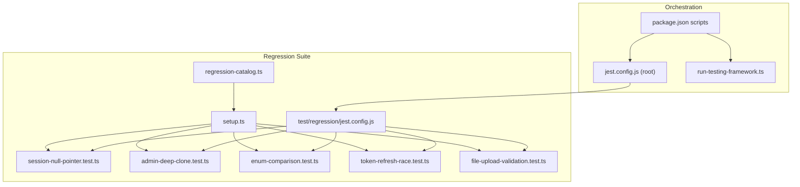
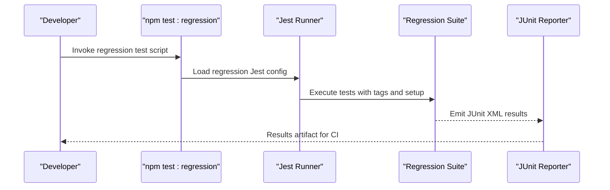
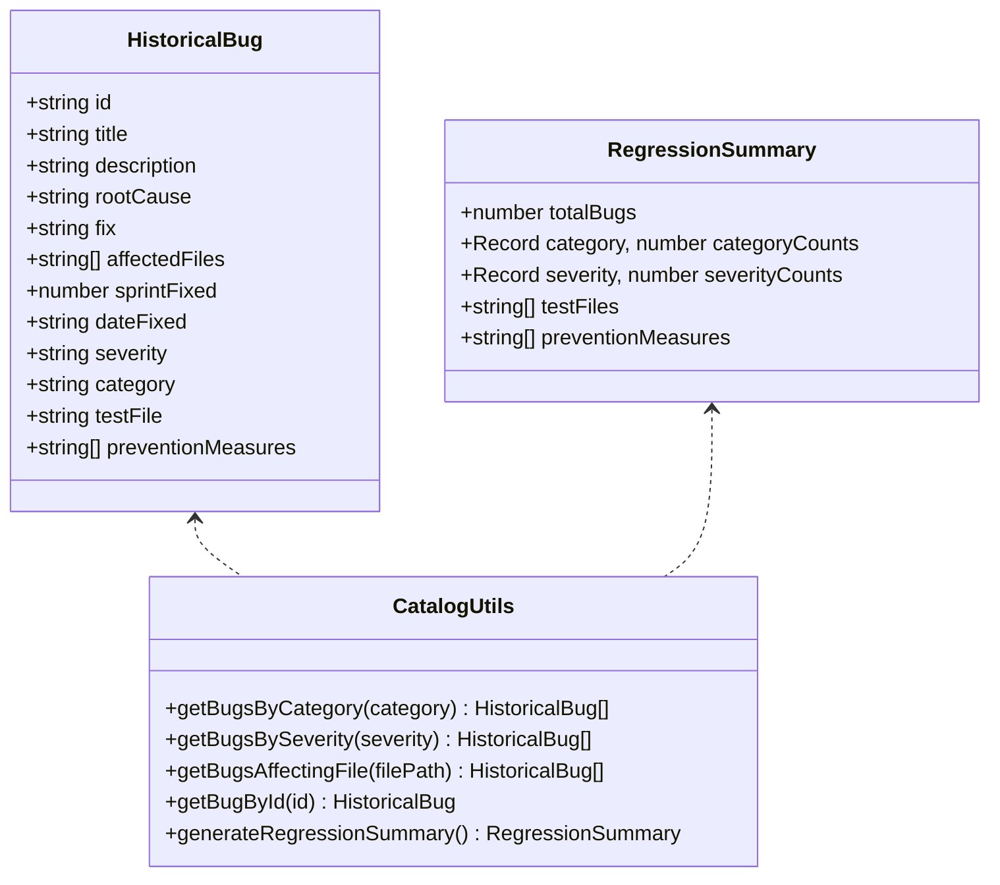
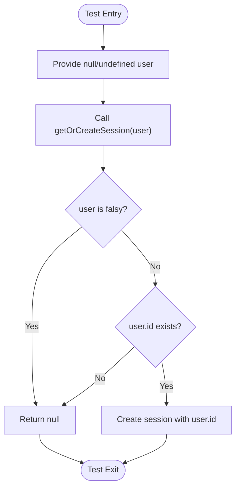
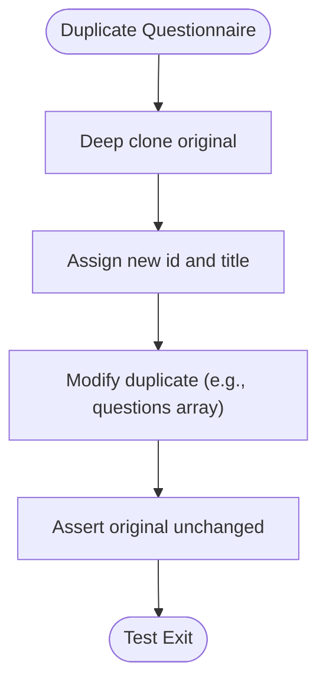
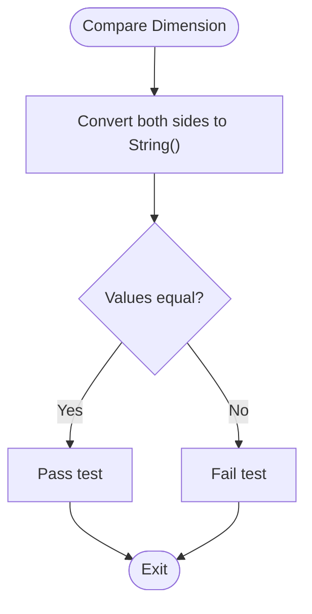
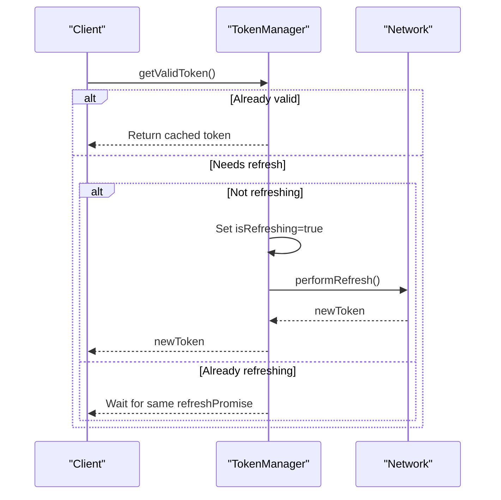
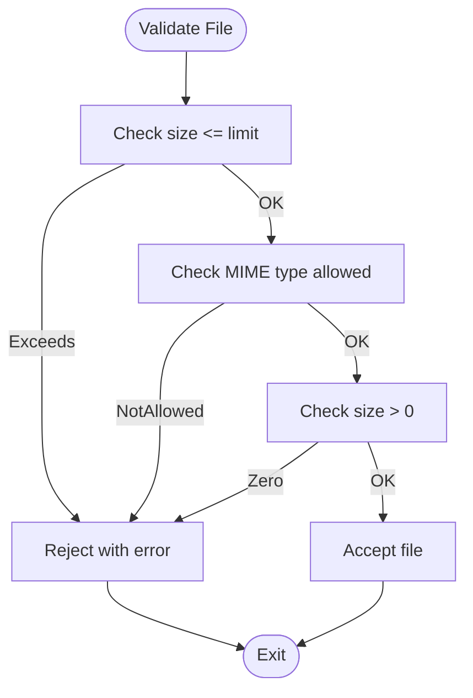
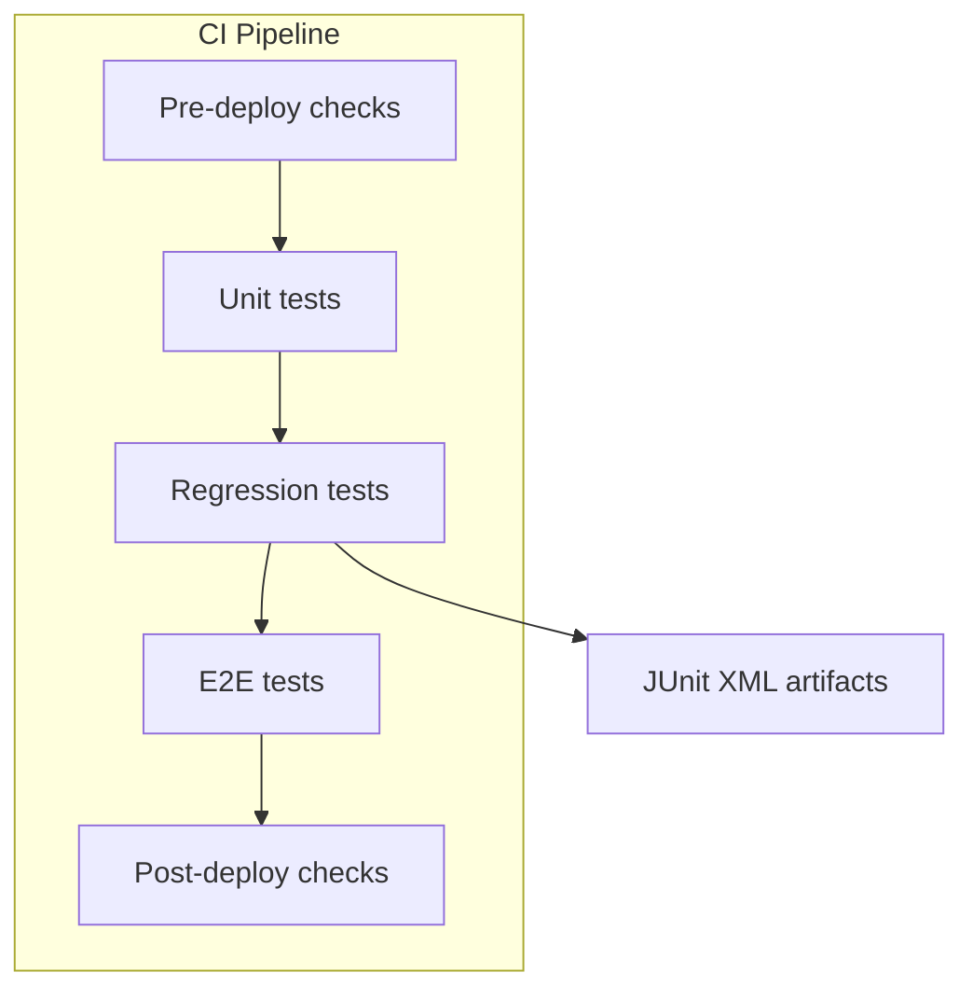
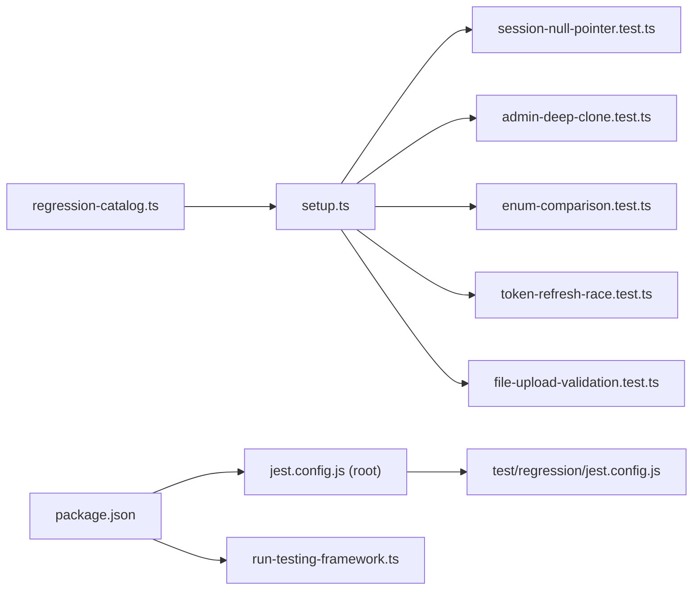

# Regression Testing

<cite>
**Referenced Files in This Document**
- [regression-catalog.ts](file://test/regression/regression-catalog.ts)
- [setup.ts](file://test/regression/setup.ts)
- [jest.config.js](file://test/regression/jest.config.js)
- [admin-deep-clone.test.ts](file://test/regression/admin-deep-clone.test.ts)
- [enum-comparison.test.ts](file://test/regression/enum-comparison.test.ts)
- [session-null-pointer.test.ts](file://test/regression/session-null-pointer.test.ts)
- [token-refresh-race.test.ts](file://test/regression/token-refresh-race.test.ts)
- [file-upload-validation.test.ts](file://test/regression/file-upload-validation.test.ts)
- [run-testing-framework.ts](file://scripts/run-testing-framework.ts)
- [jest.config.js](file://jest.config.js)
- [package.json](file://package.json)
- [transaction-concurrency.test.ts](file://apps/api/test/integration/transaction-concurrency.test.ts)
- [api-contracts.test.ts](file://apps/api/test/integration/api-contracts.test.ts)
</cite>

## Table of Contents
1. [Introduction](#introduction)
2. [Project Structure](#project-structure)
3. [Core Components](#core-components)
4. [Architecture Overview](#architecture-overview)
5. [Detailed Component Analysis](#detailed-component-analysis)
6. [Dependency Analysis](#dependency-analysis)
7. [Performance Considerations](#performance-considerations)
8. [Troubleshooting Guide](#troubleshooting-guide)
9. [Conclusion](#conclusion)
10. [Appendices](#appendices)

## Introduction
This document describes Quiz-to-Build’s systematic regression testing approach to prevent feature regressions. It covers the regression test catalog organization, test case prioritization via tags and categories, automated execution, and strategies for critical bug fixes, security patches, and feature enhancements. It also explains the regression test framework setup, test data management, execution scheduling, and continuous integration readiness. Examples include race conditions, null pointer exceptions, and enum comparison issues. Guidance is included for maintaining regression tests, updating test cases, and analyzing coverage.

## Project Structure
The regression testing system is organized under a dedicated test suite with:
- A regression catalog that enumerates historical bugs and maps them to targeted tests
- A setup module providing custom matchers, helpers, and shared test data
- Individual regression test files that validate specific historical issues
- A Jest configuration tailored for regression execution and reporting
- A universal testing framework script to orchestrate pre/post-deployment checks and integrate regression testing

**Diagram sources**
- [regression-catalog.ts:1-442](file://test/regression/regression-catalog.ts#L1-L442)
- [setup.ts:1-170](file://test/regression/setup.ts#L1-L170)
- [jest.config.js:1-54](file://test/regression/jest.config.js#L1-L54)
- [session-null-pointer.test.ts:1-67](file://test/regression/session-null-pointer.test.ts#L1-L67)
- [admin-deep-clone.test.ts:1-129](file://test/regression/admin-deep-clone.test.ts#L1-L129)
- [enum-comparison.test.ts:1-129](file://test/regression/enum-comparison.test.ts#L1-L129)
- [token-refresh-race.test.ts:1-137](file://test/regression/token-refresh-race.test.ts#L1-L137)
- [file-upload-validation.test.ts:1-190](file://test/regression/file-upload-validation.test.ts#L1-L190)
- [jest.config.js:1-26](file://jest.config.js#L1-L26)
- [package.json:15-66](file://package.json#L15-L66)
- [run-testing-framework.ts:1-479](file://scripts/run-testing-framework.ts#L1-L479)

**Section sources**
- [regression-catalog.ts:1-442](file://test/regression/regression-catalog.ts#L1-L442)
- [setup.ts:1-170](file://test/regression/setup.ts#L1-L170)
- [jest.config.js:1-54](file://test/regression/jest.config.js#L1-L54)
- [jest.config.js:1-26](file://jest.config.js#L1-L26)
- [package.json:15-66](file://package.json#L15-L66)
- [run-testing-framework.ts:1-479](file://scripts/run-testing-framework.ts#L1-L479)

## Core Components
- Regression catalog: Defines historical bugs, categories, severities, affected files, and associated test files. Provides utilities to summarize and filter bugs.
- Test setup: Registers custom matchers (e.g., immutability checks), helper functions (deep freeze, wait-for-condition, fake timers), and shared test data.
- Regression tests: Focused tests for each historical bug, covering null handling, deep cloning, enum comparisons, race conditions, and security validations.
- Jest configuration: Isolated regression suite with JUnit reporting, bail-on-first-failure mode, and coverage focus on historically problematic files.
- Orchestration: Root Jest projects and package scripts to run regression tests independently and as part of broader testing frameworks.

Key capabilities:
- Tagging system for regression tests by bug ID, category, and severity
- Critical-path and security/performance-fix tags
- Coverage collection focused on files with prior defects
- Custom matchers to assert immutability and null-safe behavior

**Section sources**
- [regression-catalog.ts:10-442](file://test/regression/regression-catalog.ts#L10-L442)
- [setup.ts:25-170](file://test/regression/setup.ts#L25-L170)
- [jest.config.js:11-53](file://test/regression/jest.config.js#L11-L53)

## Architecture Overview
The regression testing architecture centers on a catalog-driven approach:
- Each historical bug maps to a dedicated test file
- Tests are tagged for easy filtering and prioritization
- The suite runs in isolation with focused coverage and JUnit reporting
- The universal testing framework integrates regression checks into pre/post-deployment pipelines

**Diagram sources**
- [jest.config.js:11-53](file://test/regression/jest.config.js#L11-L53)
- [package.json:29-30](file://package.json#L29-L30)

## Detailed Component Analysis

### Regression Catalog Organization
The catalog organizes historical bugs with:
- Unique identifiers and titles
- Descriptions, root causes, and fixes
- Affected files, sprints, dates, and severity
- Categories (e.g., null-reference, async-race-condition, security)
- Prevention measures and associated test files
- Utility functions to filter by category/severity/file and to generate summaries

**Diagram sources**
- [regression-catalog.ts:10-344](file://test/regression/regression-catalog.ts#L10-L344)

**Section sources**
- [regression-catalog.ts:40-264](file://test/regression/regression-catalog.ts#L40-L264)

### Test Case Prioritization and Tagging
The tagging system enables prioritization:
- Per-bug tags (@regression:BUG-XXX)
- Category tags (@category:...)
- Severity tags (@severity:...)
- Special tags for critical-path, security-fix, and performance-fix tests

Filters and tag discovery are supported to run subsets of regression tests.

**Section sources**
- [regression-catalog.ts:385-425](file://test/regression/regression-catalog.ts#L385-L425)

### Test Data Management and Helpers
Shared test data and helpers ensure consistent, repeatable tests:
- Immutable test fixtures via deep-freeze
- Wait-for-condition utilities for asynchronous checks
- Fake timers for deterministic race-condition tests
- Predefined test subjects (users, sessions, questionnaires)

**Section sources**
- [setup.ts:99-170](file://test/regression/setup.ts#L99-L170)

### Automated Regression Execution
- Standalone execution via npm script
- Root Jest projects include the regression suite
- JUnit reporter configured for CI integration
- Bail-on-first-failure mode to fail fast

**Section sources**
- [package.json:29-30](file://package.json#L29-L30)
- [jest.config.js:11-17](file://jest.config.js#L11-L17)
- [jest.config.js:22-23](file://test/regression/jest.config.js#L22-L23)

### Regression Test Strategies

#### Null Pointer Exceptions
- Validates graceful handling of null/undefined inputs
- Ensures early null checks before property access
- Tests edge cases (empty objects, whitespace-only IDs)

**Diagram sources**
- [session-null-pointer.test.ts:10-20](file://test/regression/session-null-pointer.test.ts#L10-L20)

**Section sources**
- [session-null-pointer.test.ts:22-51](file://test/regression/session-null-pointer.test.ts#L22-L51)

#### Data Mutability and Deep Cloning
- Ensures duplication logic produces independent copies
- Prevents mutation of original objects and nested arrays
- Uses deep cloning to isolate test subjects

**Diagram sources**
- [admin-deep-clone.test.ts:10-22](file://test/regression/admin-deep-clone.test.ts#L10-L22)

**Section sources**
- [admin-deep-clone.test.ts:24-70](file://test/regression/admin-deep-clone.test.ts#L24-L70)

#### Enum Comparison Issues
- Handles Prisma runtime strings vs TypeScript enum types
- Enforces explicit string conversion for reliable comparisons
- Includes type guards and filter tests

**Diagram sources**
- [enum-comparison.test.ts:23-29](file://test/regression/enum-comparison.test.ts#L23-L29)

**Section sources**
- [enum-comparison.test.ts:40-82](file://test/regression/enum-comparison.test.ts#L40-L82)

#### Race Conditions (Token Refresh)
- Implements a mutex-style queue to serialize refresh operations
- Validates that concurrent requests receive the same token
- Ensures sequential refreshes produce distinct tokens

**Diagram sources**
- [token-refresh-race.test.ts:10-64](file://test/regression/token-refresh-race.test.ts#L10-L64)

**Section sources**
- [token-refresh-race.test.ts:66-98](file://test/regression/token-refresh-race.test.ts#L66-L98)

#### Security Patches (File Upload Validation)
- Enforces server-side file size limits and allowed MIME types
- Rejects empty files and validates batch totals
- Documents accepted and rejected content types

**Diagram sources**
- [file-upload-validation.test.ts:20-50](file://test/regression/file-upload-validation.test.ts#L20-L50)

**Section sources**
- [file-upload-validation.test.ts:52-98](file://test/regression/file-upload-validation.test.ts#L52-L98)

### Continuous Integration and Quality Gates
- Root Jest projects include the regression suite for isolated execution
- Package scripts expose a dedicated regression test command
- The universal testing framework integrates regression checks into pre/post-deployment phases
- JUnit reporter output supports CI parsing and quality gates

**Diagram sources**
- [jest.config.js:11-17](file://jest.config.js#L11-L17)
- [package.json:29-30](file://package.json#L29-L30)
- [run-testing-framework.ts:126-285](file://scripts/run-testing-framework.ts#L126-L285)

**Section sources**
- [jest.config.js:1-26](file://jest.config.js#L1-L26)
- [package.json:15-66](file://package.json#L15-L66)
- [run-testing-framework.ts:126-285](file://scripts/run-testing-framework.ts#L126-L285)

## Dependency Analysis
- Regression tests depend on the catalog for bug metadata and on setup for matchers/helpers
- The root Jest configuration aggregates the regression suite with other suites
- Package scripts provide entry points for standalone regression execution and integration via the universal testing framework

**Diagram sources**
- [regression-catalog.ts:1-442](file://test/regression/regression-catalog.ts#L1-L442)
- [setup.ts:1-170](file://test/regression/setup.ts#L1-L170)
- [jest.config.js:1-54](file://test/regression/jest.config.js#L1-L54)
- [jest.config.js:1-26](file://jest.config.js#L1-L26)
- [package.json:15-66](file://package.json#L15-L66)
- [run-testing-framework.ts:1-479](file://scripts/run-testing-framework.ts#L1-L479)

**Section sources**
- [regression-catalog.ts:1-442](file://test/regression/regression-catalog.ts#L1-L442)
- [setup.ts:1-170](file://test/regression/setup.ts#L1-L170)
- [jest.config.js:1-54](file://test/regression/jest.config.js#L1-L54)
- [jest.config.js:1-26](file://jest.config.js#L1-L26)
- [package.json:15-66](file://package.json#L15-L66)
- [run-testing-framework.ts:1-479](file://scripts/run-testing-framework.ts#L1-L479)

## Performance Considerations
- Regression tests are configured with longer timeouts than unit tests to accommodate complex scenarios (e.g., race conditions)
- Coverage focuses on files historically affected by bugs to reduce overhead
- JUnit reporting enables CI dashboards and trend analysis

**Section sources**
- [jest.config.js:44-45](file://test/regression/jest.config.js#L44-L45)
- [regression-catalog.ts:372-376](file://test/regression/regression-catalog.ts#L372-L376)

## Troubleshooting Guide
Common issues and resolutions:
- Null pointer exceptions: Add explicit null checks and use the provided matcher to assert null-safe behavior
- Data mutation: Use deep-freeze helpers and assert immutability with the provided matcher
- Enum comparison failures: Apply explicit string conversion and type guards
- Race conditions: Introduce mutex/queue patterns and deterministic fake timers for reproducible tests
- Security bypasses: Enforce server-side validation and reject invalid inputs

**Section sources**
- [setup.ts:34-77](file://test/regression/setup.ts#L34-L77)
- [session-null-pointer.test.ts:22-51](file://test/regression/session-null-pointer.test.ts#L22-L51)
- [admin-deep-clone.test.ts:24-70](file://test/regression/admin-deep-clone.test.ts#L24-L70)
- [enum-comparison.test.ts:22-29](file://test/regression/enum-comparison.test.ts#L22-L29)
- [token-refresh-race.test.ts:66-98](file://test/regression/token-refresh-race.test.ts#L66-L98)
- [file-upload-validation.test.ts:20-50](file://test/regression/file-upload-validation.test.ts#L20-L50)

## Conclusion
Quiz-to-Build’s regression testing framework systematically prevents regressions by cataloging historical bugs, organizing targeted tests, and enforcing prioritization via tags. The setup provides robust matchers and helpers, while the configuration ensures fast failure and CI-ready reporting. The approach is extensible for critical bug fixes, security patches, and feature enhancements, and integrates seamlessly with CI/CD quality gates.

## Appendices

### Regression Test Execution Commands
- Run regression suite: npm run test:regression
- Run via root Jest projects: npx jest --config test/regression/jest.config.js
- Integrate with universal framework: npm run test:framework:pre or npm run test:framework:post

**Section sources**
- [package.json:29-30](file://package.json#L29-L30)
- [jest.config.js:11-17](file://test/regression/jest.config.js#L11-L17)
- [run-testing-framework.ts:427-479](file://scripts/run-testing-framework.ts#L427-L479)

### Related Integration and Contract Tests
While not regression-specific, integration tests for concurrency and API contracts complement regression testing by validating runtime correctness and contract adherence.

**Section sources**
- [transaction-concurrency.test.ts:1-654](file://apps/api/test/integration/transaction-concurrency.test.ts#L1-L654)
- [api-contracts.test.ts:1-419](file://apps/api/test/integration/api-contracts.test.ts#L1-L419)