# Testing Strategy

<cite>
**Referenced Files in This Document**
- [apps/api/package.json](file://apps/api/package.json)
- [apps/api/test/jest-e2e.json](file://apps/api/test/jest-e2e.json)
- [apps/api/test/jest-integration.json](file://apps/api/test/jest-integration.json)
- [apps/web/package.json](file://apps/web/package.json)
- [apps/web/vitest.config.ts](file://apps/web/vitest.config.ts)
- [apps/web/src/test/setup.ts](file://apps/web/src/test/setup.ts)
- [apps/web/src/api/auth.test.ts](file://apps/web/src/api/auth.test.ts)
- [apps/web/src/stores/auth.test.ts](file://apps/web/src/stores/auth.test.ts)
- [apps/web/src/hooks/useTheme.test.ts](file://apps/web/src/hooks/useTheme.test.ts)
- [playwright.config.ts](file://playwright.config.ts)
- [e2e/global-setup.ts](file://e2e/global-setup.ts)
- [e2e/global-teardown.ts](file://e2e/global-teardown.ts)
- [test/performance/jest.config.js](file://test/performance/jest.config.js)
- [test/regression/jest.config.js](file://test/regression/jest.config.js)
- [test/regression/setup.ts](file://test/regression/setup.ts)
- [test/regression/regression-catalog.ts](file://test/regression/regression-catalog.ts)
- [test/performance/api-load.k6.js](file://test/performance/api-load.k6.js)
- [test/performance/memory-load.k6.js](file://test/performance/memory-load.k6.js)
- [test/performance/database-performance.test.ts](file://test/performance/database-performance.test.ts)
- [test/performance/stress-tests.test.ts](file://test/performance/stress-tests.test.ts)
- [test/performance/web-vitals.config.ts](file://test/performance/web-vitals.config.ts)
- [scripts/security-scan.sh](file://scripts/security-scan.sh)
- [scripts/run-testing-framework.ts](file://scripts/run-testing-framework.ts)
- [scripts/validate-ci-pipeline.js](file://scripts/validate-ci-pipeline.js)
- [.lighthouserc.json](file://.lighthouserc.json)
- [sonar-project.properties](file://sonar-project.properties)
</cite>

## Table of Contents
1. [Introduction](#introduction)
2. [Project Structure](#project-structure)
3. [Core Components](#core-components)
4. [Architecture Overview](#architecture-overview)
5. [Detailed Component Analysis](#detailed-component-analysis)
6. [Dependency Analysis](#dependency-analysis)
7. [Performance Considerations](#performance-considerations)
8. [Troubleshooting Guide](#troubleshooting-guide)
9. [Conclusion](#conclusion)
10. [Appendices](#appendices)

## Introduction
This document defines Quiz-to-Build’s multi-layered testing strategy across unit, integration, end-to-end, performance, regression, accessibility, security, and CI/CD quality gates. It consolidates the existing tooling and patterns present in the repository to provide a unified, actionable guide for contributors and stakeholders.

## Project Structure
The testing ecosystem spans three primary layers:
- Backend (NestJS API): Jest-based unit and integration tests, plus E2E tests.
- Frontend (React/Vite): Vitest-based unit tests and accessibility assertions.
- End-to-End and Performance: Playwright for browser automation and K6 for load testing.

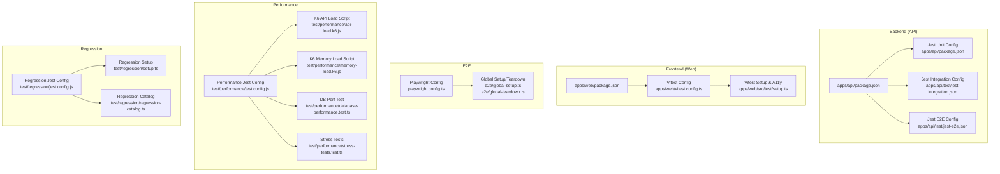

**Diagram sources**
- [apps/api/package.json:1-144](file://apps/api/package.json#L1-L144)
- [apps/api/test/jest-integration.json:1-27](file://apps/api/test/jest-integration.json#L1-L27)
- [apps/api/test/jest-e2e.json:1-21](file://apps/api/test/jest-e2e.json#L1-L21)
- [apps/web/package.json:1-75](file://apps/web/package.json#L1-L75)
- [apps/web/vitest.config.ts:1-45](file://apps/web/vitest.config.ts#L1-L45)
- [apps/web/src/test/setup.ts:1-72](file://apps/web/src/test/setup.ts#L1-L72)
- [playwright.config.ts:1-133](file://playwright.config.ts#L1-L133)
- [e2e/global-setup.ts:1-70](file://e2e/global-setup.ts#L1-L70)
- [e2e/global-teardown.ts:1-31](file://e2e/global-teardown.ts#L1-L31)
- [test/performance/jest.config.js:1-27](file://test/performance/jest.config.js#L1-L27)
- [test/performance/api-load.k6.js](file://test/performance/api-load.k6.js)
- [test/performance/memory-load.k6.js](file://test/performance/memory-load.k6.js)
- [test/performance/database-performance.test.ts](file://test/performance/database-performance.test.ts)
- [test/performance/stress-tests.test.ts](file://test/performance/stress-tests.test.ts)
- [test/regression/jest.config.js:1-54](file://test/regression/jest.config.js#L1-L54)
- [test/regression/setup.ts:1-170](file://test/regression/setup.ts#L1-L170)
- [test/regression/regression-catalog.ts](file://test/regression/regression-catalog.ts)

**Section sources**
- [apps/api/package.json:1-144](file://apps/api/package.json#L1-L144)
- [apps/web/package.json:1-75](file://apps/web/package.json#L1-L75)
- [playwright.config.ts:1-133](file://playwright.config.ts#L1-L133)
- [test/performance/jest.config.js:1-27](file://test/performance/jest.config.js#L1-L27)
- [test/regression/jest.config.js:1-54](file://test/regression/jest.config.js#L1-L54)

## Core Components
- Backend unit and integration testing with Jest:
  - Unit tests configured via Jest in the API package with TypeScript transformation and coverage thresholds.
  - Integration tests use a dedicated Jest configuration under the API test directory.
  - E2E tests use a separate Jest configuration for end-to-end specs.
- Frontend unit testing with Vitest:
  - React components, hooks, stores, and API clients are tested with Vitest and JSDOM.
  - Accessibility assertions are enabled via jest-axe and custom setup.
- End-to-end testing with Playwright:
  - Multi-browser projects, parallel execution, and artifact collection.
  - Automated web server startup for both frontend and backend during test runs.
- Performance testing:
  - Jest-based performance suites with custom configs.
  - K6 scripts for API and memory load testing.
  - Database performance and stress tests.
- Regression testing:
  - Isolated Jest suite with fail-fast behavior, JUnit reporting, and custom matchers.
- Security and compliance:
  - Security scanning script and CI pipeline validation utilities.
- Reporting and observability:
  - HTML, JSON, and JUnit reporters for E2E.
  - SonarQube project properties for static analysis.
  - Lighthouse configuration for accessibility metrics.

**Section sources**
- [apps/api/package.json:88-142](file://apps/api/package.json#L88-L142)
- [apps/api/test/jest-integration.json:1-27](file://apps/api/test/jest-integration.json#L1-L27)
- [apps/api/test/jest-e2e.json:1-21](file://apps/api/test/jest-e2e.json#L1-L21)
- [apps/web/package.json:1-75](file://apps/web/package.json#L1-L75)
- [apps/web/vitest.config.ts:1-45](file://apps/web/vitest.config.ts#L1-L45)
- [apps/web/src/test/setup.ts:1-72](file://apps/web/src/test/setup.ts#L1-L72)
- [playwright.config.ts:1-133](file://playwright.config.ts#L1-L133)
- [test/performance/jest.config.js:1-27](file://test/performance/jest.config.js#L1-L27)
- [test/regression/jest.config.js:1-54](file://test/regression/jest.config.js#L1-L54)
- [test/regression/setup.ts:1-170](file://test/regression/setup.ts#L1-L170)
- [scripts/security-scan.sh](file://scripts/security-scan.sh)
- [scripts/validate-ci-pipeline.js](file://scripts/validate-ci-pipeline.js)
- [sonar-project.properties](file://sonar-project.properties)
- [.lighthouserc.json](file://.lighthouserc.json)

## Architecture Overview
The testing architecture integrates multiple tools and suites to cover functional correctness, user workflows, performance, and reliability.

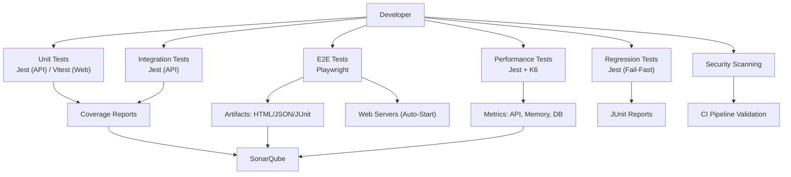

**Diagram sources**
- [apps/api/package.json:13-18](file://apps/api/package.json#L13-L18)
- [apps/web/package.json:12-16](file://apps/web/package.json#L12-L16)
- [playwright.config.ts:27-31](file://playwright.config.ts#L27-L31)
- [playwright.config.ts:101-123](file://playwright.config.ts#L101-L123)
- [test/performance/jest.config.js:1-27](file://test/performance/jest.config.js#L1-L27)
- [test/performance/api-load.k6.js](file://test/performance/api-load.k6.js)
- [test/performance/memory-load.k6.js](file://test/performance/memory-load.k6.js)
- [test/performance/database-performance.test.ts](file://test/performance/database-performance.test.ts)
- [test/regression/jest.config.js:28-30](file://test/regression/jest.config.js#L28-L30)
- [scripts/security-scan.sh](file://scripts/security-scan.sh)
- [scripts/validate-ci-pipeline.js](file://scripts/validate-ci-pipeline.js)
- [sonar-project.properties](file://sonar-project.properties)

## Detailed Component Analysis

### Backend Unit Testing (Jest)
- Test runner and coverage:
  - Scripts invoke Jest with coverage and watch modes.
  - Coverage thresholds enforce maintainable test coverage.
  - Module name mapping resolves monorepo aliases.
- Organization:
  - Specs colocated with source under src.
  - Dedicated integration and E2E configs for specialized needs.

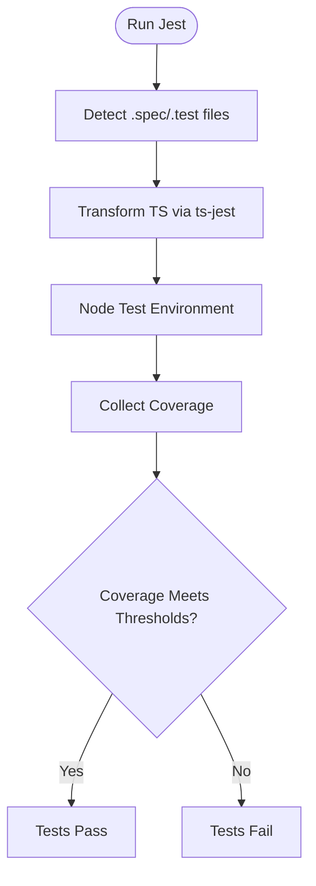

**Diagram sources**
- [apps/api/package.json:13-18](file://apps/api/package.json#L13-L18)
- [apps/api/package.json:107-130](file://apps/api/package.json#L107-L130)

**Section sources**
- [apps/api/package.json:13-18](file://apps/api/package.json#L13-L18)
- [apps/api/package.json:88-142](file://apps/api/package.json#L88-L142)

### Backend Integration Testing (Jest)
- Dedicated integration configuration:
  - Rooted at the integration test directory.
  - Module name mapping for libs and internal modules.
  - Verbose output and increased timeouts for complex flows.

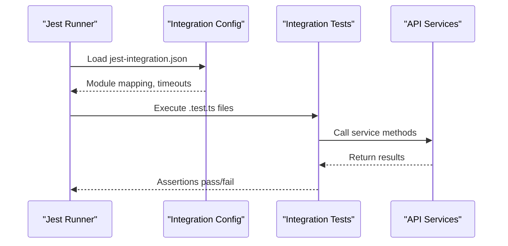

**Diagram sources**
- [apps/api/test/jest-integration.json:1-27](file://apps/api/test/jest-integration.json#L1-L27)

**Section sources**
- [apps/api/test/jest-integration.json:1-27](file://apps/api/test/jest-integration.json#L1-L27)

### Backend E2E Testing (Jest)
- E2E configuration:
  - Node-based environment for API-focused E2E specs.
  - Module name mapping for shared libraries.
  - Cache directory and extended timeouts.

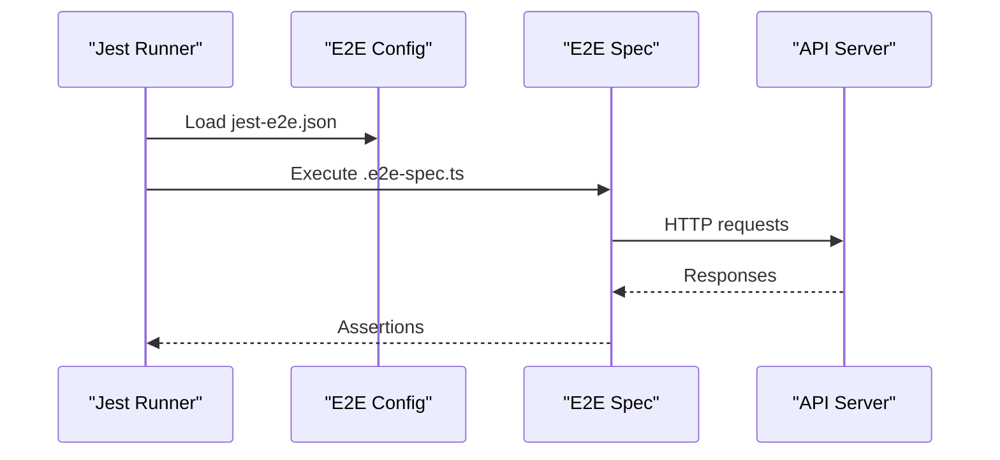

**Diagram sources**
- [apps/api/test/jest-e2e.json:1-21](file://apps/api/test/jest-e2e.json#L1-L21)

**Section sources**
- [apps/api/test/jest-e2e.json:1-21](file://apps/api/test/jest-e2e.json#L1-L21)

### Frontend Unit Testing (Vitest)
- Test runner and environment:
  - JSDOM environment simulates DOM APIs.
  - Setup file configures jest-dom matchers and jest-axe for accessibility.
  - Coverage thresholds and reporters for CI-friendly reporting.
- Test organization:
  - Tests for API clients, stores, hooks, and components.
  - Mocks isolate external dependencies (axios, local storage, matchMedia).

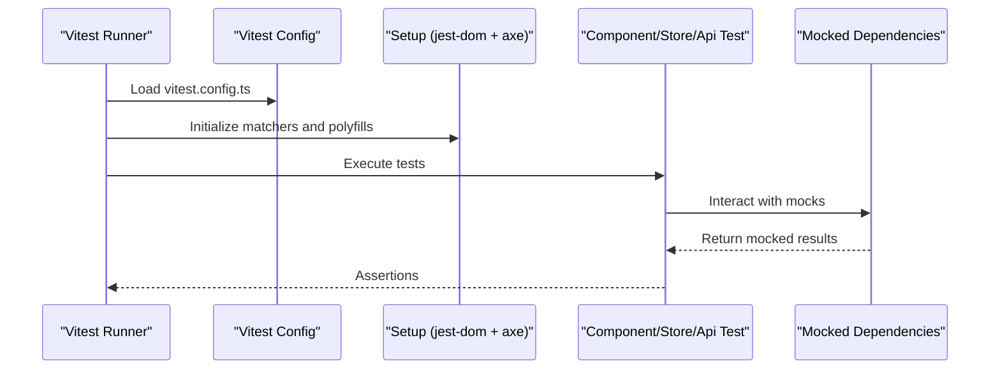

**Diagram sources**
- [apps/web/vitest.config.ts:1-45](file://apps/web/vitest.config.ts#L1-L45)
- [apps/web/src/test/setup.ts:1-72](file://apps/web/src/test/setup.ts#L1-L72)

**Section sources**
- [apps/web/package.json:12-16](file://apps/web/package.json#L12-L16)
- [apps/web/vitest.config.ts:1-45](file://apps/web/vitest.config.ts#L1-L45)
- [apps/web/src/test/setup.ts:1-72](file://apps/web/src/test/setup.ts#L1-L72)

### Frontend API Client and Store Testing Examples
- API client tests:
  - Mock axios-based client and assert HTTP calls and payloads.
  - Validate error propagation and response shaping.
- Store tests:
  - Mock axios and logger to verify state transitions and persistence.
  - Validate localStorage persistence and hydration behavior.
- Hook tests:
  - Control matchMedia and localStorage to validate theme behavior and document class toggling.

```mermaid
classDiagram
class AuthApiTests {
+register()
+login()
+logout()
+verifyEmail()
+resendVerification()
+forgotPassword()
+resetPassword()
+getMe()
}
class AuthStoreTests {
+setUser()
+setAccessToken()
+setTokens()
+login()
+logout()
+setLoading()
+persistPartialize()
}
class ThemeHookTests {
+useTheme()
+usePrefersDarkMode()
+setMode()
+toggleTheme()
}
AuthApiTests --> "Mocked Axios" : "uses"
AuthStoreTests --> "Mocked Axios" : "uses"
AuthStoreTests --> "Mocked Logger" : "uses"
ThemeHookTests --> "matchMedia Polyfill" : "uses"
```

**Diagram sources**
- [apps/web/src/api/auth.test.ts:1-144](file://apps/web/src/api/auth.test.ts#L1-L144)
- [apps/web/src/stores/auth.test.ts:1-212](file://apps/web/src/stores/auth.test.ts#L1-L212)
- [apps/web/src/hooks/useTheme.test.ts:1-294](file://apps/web/src/hooks/useTheme.test.ts#L1-L294)

**Section sources**
- [apps/web/src/api/auth.test.ts:1-144](file://apps/web/src/api/auth.test.ts#L1-L144)
- [apps/web/src/stores/auth.test.ts:1-212](file://apps/web/src/stores/auth.test.ts#L1-L212)
- [apps/web/src/hooks/useTheme.test.ts:1-294](file://apps/web/src/hooks/useTheme.test.ts#L1-L294)

### End-to-End Testing (Playwright)
- Configuration:
  - Parallel execution across desktop and mobile devices.
  - Artifacts: HTML report, JSON results, JUnit XML.
  - Auto-start web servers for frontend and backend.
- Lifecycle:
  - Global setup waits for API readiness and seeds test data.
  - Global teardown cleans up seeded data.

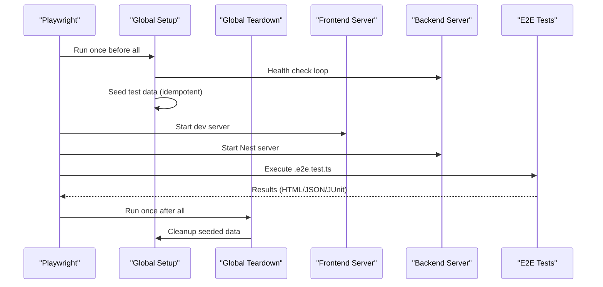

**Diagram sources**
- [playwright.config.ts:1-133](file://playwright.config.ts#L1-L133)
- [e2e/global-setup.ts:1-70](file://e2e/global-setup.ts#L1-L70)
- [e2e/global-teardown.ts:1-31](file://e2e/global-teardown.ts#L1-L31)

**Section sources**
- [playwright.config.ts:1-133](file://playwright.config.ts#L1-L133)
- [e2e/global-setup.ts:1-70](file://e2e/global-setup.ts#L1-L70)
- [e2e/global-teardown.ts:1-31](file://e2e/global-teardown.ts#L1-L31)

### Performance Testing (Jest + K6 + DB)
- Jest-based performance suite:
  - Custom Jest config for performance tests with module mapping and extended timeouts.
- K6 load testing:
  - API load script and memory load script for throughput and resource profiling.
- Database performance:
  - Dedicated test suite for database performance validations.
- Stress tests:
  - Additional stress scenarios to validate resilience.

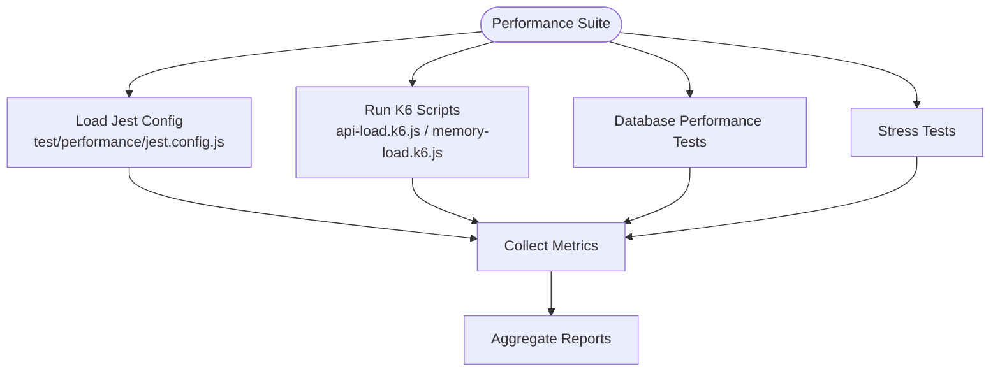

**Diagram sources**
- [test/performance/jest.config.js:1-27](file://test/performance/jest.config.js#L1-L27)
- [test/performance/api-load.k6.js](file://test/performance/api-load.k6.js)
- [test/performance/memory-load.k6.js](file://test/performance/memory-load.k6.js)
- [test/performance/database-performance.test.ts](file://test/performance/database-performance.test.ts)
- [test/performance/stress-tests.test.ts](file://test/performance/stress-tests.test.ts)

**Section sources**
- [test/performance/jest.config.js:1-27](file://test/performance/jest.config.js#L1-L27)
- [test/performance/api-load.k6.js](file://test/performance/api-load.k6.js)
- [test/performance/memory-load.k6.js](file://test/performance/memory-load.k6.js)
- [test/performance/database-performance.test.ts](file://test/performance/database-performance.test.ts)
- [test/performance/stress-tests.test.ts](file://test/performance/stress-tests.test.ts)

### Regression Testing
- Isolation and reporting:
  - Dedicated Jest config with fail-fast behavior and JUnit reporter.
  - Setup includes custom matchers for immutability and null safety.
- Catalog-driven testing:
  - Regression catalog associates tests with historical bugs and tags.

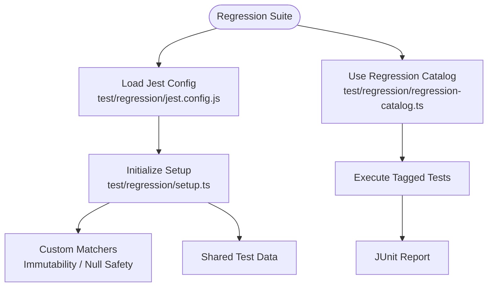

**Diagram sources**
- [test/regression/jest.config.js:1-54](file://test/regression/jest.config.js#L1-L54)
- [test/regression/setup.ts:1-170](file://test/regression/setup.ts#L1-L170)
- [test/regression/regression-catalog.ts](file://test/regression/regression-catalog.ts)

**Section sources**
- [test/regression/jest.config.js:1-54](file://test/regression/jest.config.js#L1-L54)
- [test/regression/setup.ts:1-170](file://test/regression/setup.ts#L1-L170)
- [test/regression/regression-catalog.ts](file://test/regression/regression-catalog.ts)

### Accessibility Testing and UX Validation
- Accessibility:
  - jest-axe matcher integrated in Vitest setup for automated WCAG checks.
  - LocalStorage and matchMedia polyfills enable accurate DOM simulation.
- UX validation:
  - Playwright projects include mobile devices to validate responsive behavior.
  - Lighthouse configuration supports automated accessibility metrics.

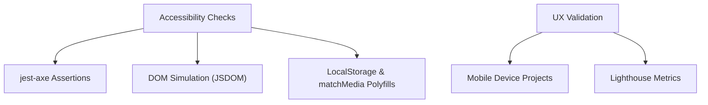

**Diagram sources**
- [apps/web/src/test/setup.ts:1-72](file://apps/web/src/test/setup.ts#L1-L72)
- [playwright.config.ts:58-92](file://playwright.config.ts#L58-L92)
- [.lighthouserc.json](file://.lighthouserc.json)

**Section sources**
- [apps/web/src/test/setup.ts:1-72](file://apps/web/src/test/setup.ts#L1-L72)
- [playwright.config.ts:58-92](file://playwright.config.ts#L58-L92)
- [.lighthouserc.json](file://.lighthouserc.json)

### Security Testing and Compliance
- Security scanning:
  - Dedicated script for security scans integrated into CI workflows.
- CI pipeline validation:
  - Utility validates CI pipeline health and readiness.

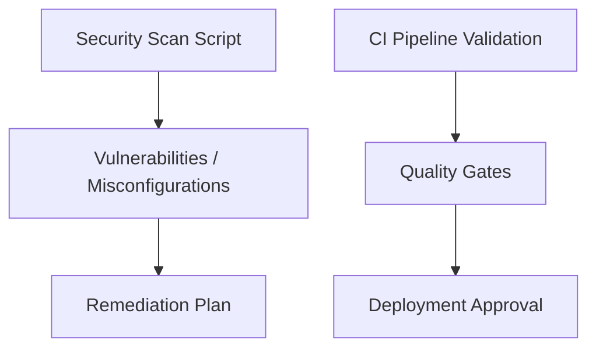

**Diagram sources**
- [scripts/security-scan.sh](file://scripts/security-scan.sh)
- [scripts/validate-ci-pipeline.js](file://scripts/validate-ci-pipeline.js)

**Section sources**
- [scripts/security-scan.sh](file://scripts/security-scan.sh)
- [scripts/validate-ci-pipeline.js](file://scripts/validate-ci-pipeline.js)

### Test Data Management
- E2E seeding:
  - Global setup invokes a seed script to prepare test data idempotently.
  - Global teardown triggers cleanup to keep environments pristine.

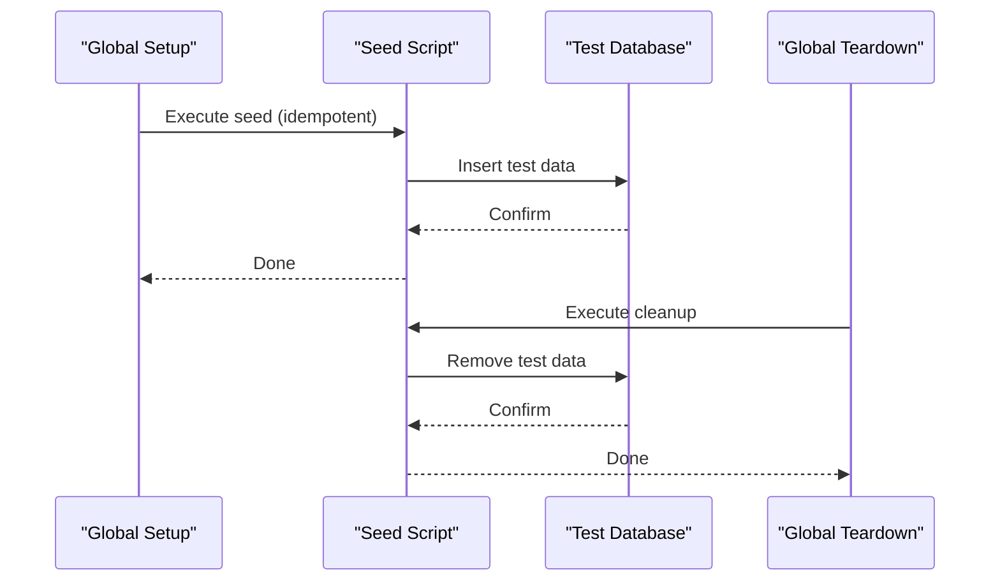

**Diagram sources**
- [e2e/global-setup.ts:49-64](file://e2e/global-setup.ts#L49-L64)
- [e2e/global-teardown.ts:12-25](file://e2e/global-teardown.ts#L12-L25)

**Section sources**
- [e2e/global-setup.ts:49-64](file://e2e/global-setup.ts#L49-L64)
- [e2e/global-teardown.ts:12-25](file://e2e/global-teardown.ts#L12-L25)

### Continuous Integration and Quality Gates
- Reporting:
  - E2E reports include HTML, JSON, and JUnit for CI consumption.
- Static analysis:
  - SonarQube project properties enable static analysis and quality gates.
- CI validation:
  - Pipeline validator ensures CI readiness and consistency.

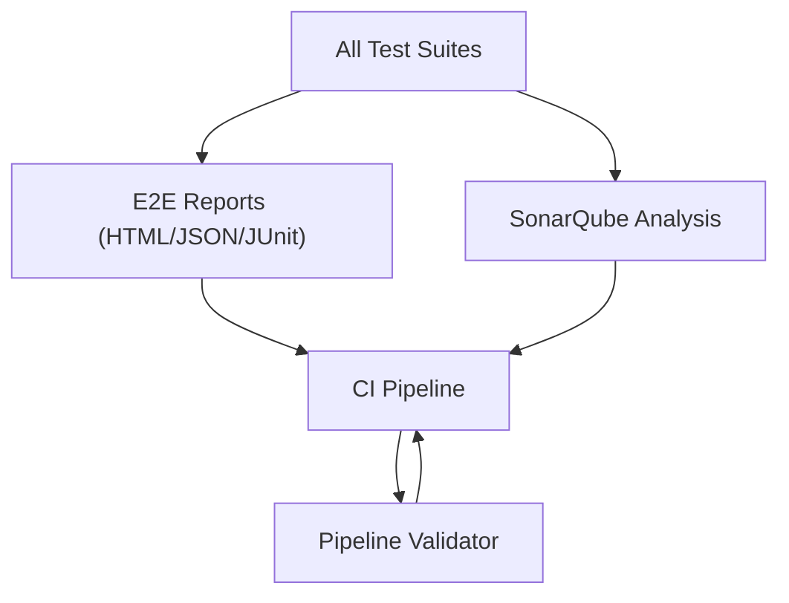

**Diagram sources**
- [playwright.config.ts:27-31](file://playwright.config.ts#L27-L31)
- [sonar-project.properties](file://sonar-project.properties)
- [scripts/validate-ci-pipeline.js](file://scripts/validate-ci-pipeline.js)

**Section sources**
- [playwright.config.ts:27-31](file://playwright.config.ts#L27-L31)
- [sonar-project.properties](file://sonar-project.properties)
- [scripts/validate-ci-pipeline.js](file://scripts/validate-ci-pipeline.js)

## Dependency Analysis
- Internal module mapping:
  - Jest configurations map monorepo aliases for libs and internal modules.
- Frontend test setup:
  - Vitest setup extends expect with jest-dom and jest-axe matchers.
- E2E lifecycle:
  - Playwright manages web server lifecycles and artifact generation.

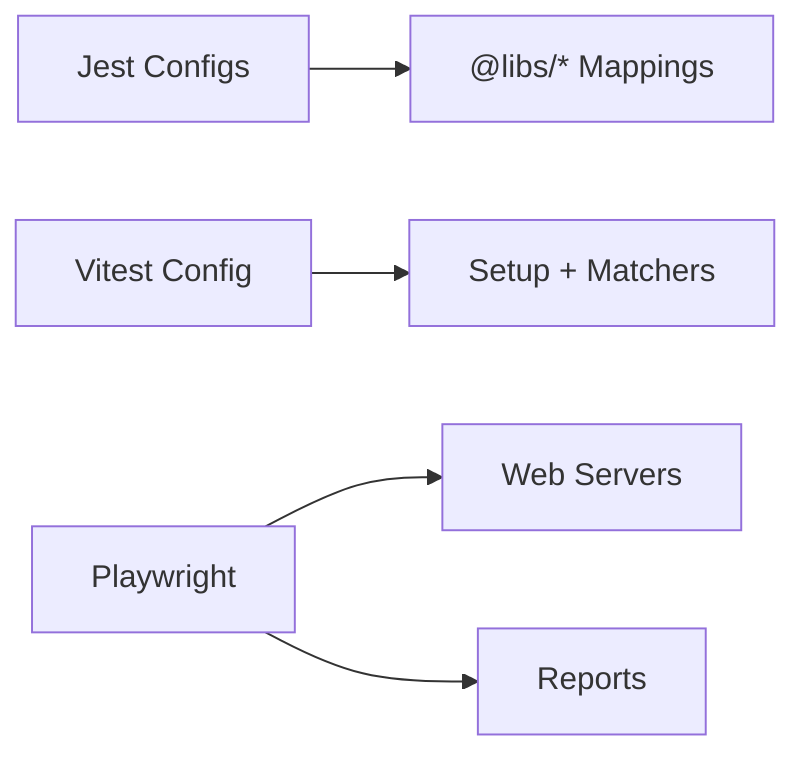

**Diagram sources**
- [apps/api/test/jest-integration.json:18-22](file://apps/api/test/jest-integration.json#L18-L22)
- [apps/api/test/jest-e2e.json:13-17](file://apps/api/test/jest-e2e.json#L13-L17)
- [apps/web/vitest.config.ts:36-40](file://apps/web/vitest.config.ts#L36-L40)
- [apps/web/src/test/setup.ts:55-64](file://apps/web/src/test/setup.ts#L55-L64)
- [playwright.config.ts:101-123](file://playwright.config.ts#L101-L123)
- [playwright.config.ts:27-31](file://playwright.config.ts#L27-L31)

**Section sources**
- [apps/api/test/jest-integration.json:18-22](file://apps/api/test/jest-integration.json#L18-L22)
- [apps/api/test/jest-e2e.json:13-17](file://apps/api/test/jest-e2e.json#L13-L17)
- [apps/web/vitest.config.ts:36-40](file://apps/web/vitest.config.ts#L36-L40)
- [apps/web/src/test/setup.ts:55-64](file://apps/web/src/test/setup.ts#L55-L64)
- [playwright.config.ts:101-123](file://playwright.config.ts#L101-L123)
- [playwright.config.ts:27-31](file://playwright.config.ts#L27-L31)

## Performance Considerations
- Backend performance:
  - Use Jest-based performance suite for targeted microbenchmarks.
  - K6 scripts for realistic load profiles and resource saturation.
- Frontend performance:
  - Leverage Vitest coverage thresholds to ensure efficient rendering paths.
  - Use Lighthouse configuration for accessibility and performance metrics.
- Database performance:
  - Dedicated DB performance tests to validate queries and connection pooling.

[No sources needed since this section provides general guidance]

## Troubleshooting Guide
- Jest coverage failures:
  - Review coverage thresholds and ensure tests target covered files.
- Vitest setup issues:
  - Verify jest-dom and jest-axe matchers are registered in setup.
  - Confirm localStorage and matchMedia polyfills are applied.
- Playwright flakiness:
  - Increase timeouts and retries in CI.
  - Use trace and video capture for diagnostics.
- Regression test failures:
  - Use fail-fast behavior to isolate regressions quickly.
  - Inspect JUnit reports for failing test details.

**Section sources**
- [apps/api/package.json:123-130](file://apps/api/package.json#L123-L130)
- [apps/web/src/test/setup.ts:55-64](file://apps/web/src/test/setup.ts#L55-L64)
- [playwright.config.ts:17-24](file://playwright.config.ts#L17-L24)
- [playwright.config.ts:125-131](file://playwright.config.ts#L125-L131)
- [test/regression/jest.config.js:22-23](file://test/regression/jest.config.js#L22-L23)

## Conclusion
Quiz-to-Build’s testing strategy combines robust unit, integration, E2E, performance, regression, accessibility, and security practices. The documented configurations and examples provide a clear path to maintain quality, accelerate feedback loops, and sustain long-term reliability across the stack.

[No sources needed since this section summarizes without analyzing specific files]

## Appendices

### Example Test Case Design Patterns
- API client tests:
  - Define payloads and expected responses.
  - Mock HTTP methods and assert call signatures.
  - Propagate and assert error conditions.
- Store tests:
  - Initialize store to known state.
  - Mock external dependencies (axios, logger).
  - Assert state transitions and persistence.
- Hook tests:
  - Control environment APIs (matchMedia, localStorage).
  - Validate resolved themes and DOM class application.

**Section sources**
- [apps/web/src/api/auth.test.ts:28-47](file://apps/web/src/api/auth.test.ts#L28-L47)
- [apps/web/src/stores/auth.test.ts:112-137](file://apps/web/src/stores/auth.test.ts#L112-L137)
- [apps/web/src/hooks/useTheme.test.ts:57-81](file://apps/web/src/hooks/useTheme.test.ts#L57-L81)

### Mocking Strategies
- Frontend:
  - Use Vitest mocks for axios and logger.
  - Apply polyfills for localStorage and matchMedia.
- Backend:
  - Use Jest mocks for service dependencies.
  - Leverage module name mapping for internal modules.

**Section sources**
- [apps/web/src/stores/auth.test.ts:4-26](file://apps/web/src/stores/auth.test.ts#L4-L26)
- [apps/web/src/test/setup.ts:7-35](file://apps/web/src/test/setup.ts#L7-L35)
- [apps/api/test/jest-integration.json:18-22](file://apps/api/test/jest-integration.json#L18-L22)

### Test Data Management
- E2E:
  - Idempotent seeding and cleanup via global setup/teardown.
- Regression:
  - Shared test data helpers for consistent assertions.

**Section sources**
- [e2e/global-setup.ts:49-64](file://e2e/global-setup.ts#L49-L64)
- [e2e/global-teardown.ts:12-25](file://e2e/global-teardown.ts#L12-L25)
- [test/regression/setup.ts:137-161](file://test/regression/setup.ts#L137-L161)

### Testing Infrastructure and CI/CD Integration
- Scripts:
  - Centralized testing framework runner and CI pipeline validator.
- Reporting:
  - E2E HTML/JSON/JUnit reports for CI consumption.
- Static analysis:
  - SonarQube project properties for quality gates.

**Section sources**
- [scripts/run-testing-framework.ts](file://scripts/run-testing-framework.ts)
- [scripts/validate-ci-pipeline.js](file://scripts/validate-ci-pipeline.js)
- [playwright.config.ts:27-31](file://playwright.config.ts#L27-L31)
- [sonar-project.properties](file://sonar-project.properties)