# Unit Testing

<cite>
**Referenced Files in This Document**
- [jest.config.js](file://jest.config.js)
- [apps/api/test/jest-e2e.json](file://apps/api/test/jest-e2e.json)
- [apps/api/nest-cli.json](file://apps/api/nest-cli.json)
- [apps/api/src/common/guards/csrf.guard.spec.ts](file://apps/api/src/common/guards/csrf.guard.spec.ts)
- [apps/api/src/common/interceptors/logging.interceptor.spec.ts](file://apps/api/src/common/interceptors/logging.interceptor.spec.ts)
- [apps/api/src/common/interceptors/transform.interceptor.spec.ts](file://apps/api/src/common/interceptors/transform.interceptor.spec.ts)
- [apps/api/src/common/filters/http-exception.filter.spec.ts](file://apps/api/src/common/filters/http-exception.filter.spec.ts)
- [apps/api/src/common/services/memory-optimization.service.spec.ts](file://apps/api/src/common/services/memory-optimization.service.spec.ts)
- [apps/api/src/config/configuration.spec.ts](file://apps/api/src/config/configuration.spec.ts)
- [apps/api/src/modules/auth/auth.service.spec.ts](file://apps/api/src/modules/auth/auth.service.spec.ts)
- [apps/api/src/modules/adapters/github.adapter.spec.ts](file://apps/api/src/modules/adapters/github.adapter.spec.ts)
- [apps/api/src/modules/chat-engine/chat-engine.service.spec.ts](file://apps/api/src/modules/chat-engine/chat-engine.service.spec.ts)
- [apps/api/src/modules/admin/admin.module.ts](file://apps/api/src/modules/admin/admin.module.ts)
</cite>

## Table of Contents
1. [Introduction](#introduction)
2. [Project Structure](#project-structure)
3. [Core Components](#core-components)
4. [Architecture Overview](#architecture-overview)
5. [Detailed Component Analysis](#detailed-component-analysis)
6. [Dependency Analysis](#dependency-analysis)
7. [Performance Considerations](#performance-considerations)
8. [Troubleshooting Guide](#troubleshooting-guide)
9. [Conclusion](#conclusion)

## Introduction
This document provides comprehensive unit testing guidance for Quiz-to-Build’s backend services and libraries. It focuses on Jest configuration for NestJS modules, service testing patterns, and mock strategies. It covers testing business logic services, validation functions, and utility classes, along with testing approaches for database services, authentication modules, and integration adapters. It also includes examples of testing async operations, error handling, and dependency injection scenarios, alongside mocking strategies for external dependencies, database connections, and Redis services. Finally, it outlines test organization patterns, naming conventions, assertion techniques, and guidance for guards, interceptors, and middleware components.

## Project Structure
The repository organizes tests primarily alongside source code using NestJS conventions. Root-level Jest configuration coordinates multiple projects, while app-specific Jest configurations define module resolution and test environments. E2E tests are configured separately with dedicated project settings.

Key characteristics:
- Root Jest coordinates multiple projects: apps/api, apps/cli, libs/orchestrator, test/regression, test/performance.
- Apps/api uses a Nest CLI configuration that enables SWC compilation and type checking settings.
- E2E tests for apps/api use a separate Jest configuration with module name mapping for libs and a longer timeout.

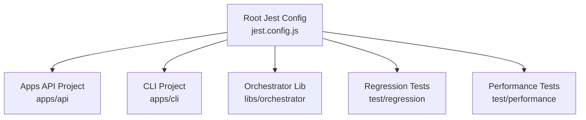

**Diagram sources**
- [jest.config.js:1-26](file://jest.config.js#L1-L26)

**Section sources**
- [jest.config.js:1-26](file://jest.config.js#L1-L26)
- [apps/api/nest-cli.json:1-12](file://apps/api/nest-cli.json#L1-L12)
- [apps/api/test/jest-e2e.json:1-21](file://apps/api/test/jest-e2e.json#L1-L21)

## Core Components
This section highlights the core testing patterns demonstrated across the codebase, focusing on:
- Guard testing with environment-driven behavior and reflection metadata.
- Interceptor testing for request logging and response transformation.
- Filter testing for standardized error responses.
- Utility service testing with timers and memory metrics.
- Configuration testing for environment-driven defaults and type coercion.
- Service testing for authentication flows, including Redis and database interactions.
- Adapter testing for external API integrations with global fetch mocks.
- Chat engine service testing for project limits, prompts, and AI gateway interactions.

Examples of tested components:
- CsrfGuard and CsrfService with token generation and validation.
- LoggingInterceptor and TransformInterceptor for request lifecycle and response shaping.
- HttpExceptionFilter for consistent error payloads.
- MemoryOptimizationService for GC hints, cache management, and memory thresholds.
- Configuration loader for environment variables and defaults.
- AuthService for registration, login, refresh, logout, and password reset flows.
- GitHubAdapter for mapping GitHub API resources to internal evidence models.
- ChatEngineService for chat status, message retrieval, and sending messages with AI gateway integration.

**Section sources**
- [apps/api/src/common/guards/csrf.guard.spec.ts:1-498](file://apps/api/src/common/guards/csrf.guard.spec.ts#L1-L498)
- [apps/api/src/common/interceptors/logging.interceptor.spec.ts:1-151](file://apps/api/src/common/interceptors/logging.interceptor.spec.ts#L1-L151)
- [apps/api/src/common/interceptors/transform.interceptor.spec.ts:1-171](file://apps/api/src/common/interceptors/transform.interceptor.spec.ts#L1-L171)
- [apps/api/src/common/filters/http-exception.filter.spec.ts:1-236](file://apps/api/src/common/filters/http-exception.filter.spec.ts#L1-L236)
- [apps/api/src/common/services/memory-optimization.service.spec.ts:1-405](file://apps/api/src/common/services/memory-optimization.service.spec.ts#L1-L405)
- [apps/api/src/config/configuration.spec.ts:1-243](file://apps/api/src/config/configuration.spec.ts#L1-L243)
- [apps/api/src/modules/auth/auth.service.spec.ts:1-800](file://apps/api/src/modules/auth/auth.service.spec.ts#L1-L800)
- [apps/api/src/modules/adapters/github.adapter.spec.ts:1-800](file://apps/api/src/modules/adapters/github.adapter.spec.ts#L1-L800)
- [apps/api/src/modules/chat-engine/chat-engine.service.spec.ts:1-261](file://apps/api/src/modules/chat-engine/chat-engine.service.spec.ts#L1-L261)

## Architecture Overview
The testing architecture leverages NestJS TestingModule to construct minimal application contexts per test suite. Providers are overridden with mocks for external dependencies (database, Redis, JWT, Config, Notifications). RxJS streams are used for interceptors, and global timers are controlled for services that rely on periodic checks.

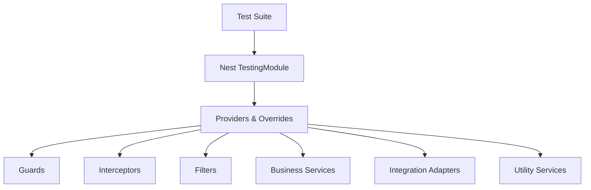

**Diagram sources**
- [apps/api/src/common/guards/csrf.guard.spec.ts:32-46](file://apps/api/src/common/guards/csrf.guard.spec.ts#L32-L46)
- [apps/api/src/common/interceptors/logging.interceptor.spec.ts:8-13](file://apps/api/src/common/interceptors/logging.interceptor.spec.ts#L8-L13)
- [apps/api/src/common/interceptors/transform.interceptor.spec.ts:5-12](file://apps/api/src/common/interceptors/transform.interceptor.spec.ts#L5-L12)
- [apps/api/src/common/filters/http-exception.filter.spec.ts:4-11](file://apps/api/src/common/filters/http-exception.filter.spec.ts#L4-L11)
- [apps/api/src/common/services/memory-optimization.service.spec.ts:10-18](file://apps/api/src/common/services/memory-optimization.service.spec.ts#L10-L18)
- [apps/api/src/config/configuration.spec.ts:6-13](file://apps/api/src/config/configuration.spec.ts#L6-L13)
- [apps/api/src/modules/auth/auth.service.spec.ts:88-104](file://apps/api/src/modules/auth/auth.service.spec.ts#L88-L104)
- [apps/api/src/modules/adapters/github.adapter.spec.ts:27-38](file://apps/api/src/modules/adapters/github.adapter.spec.ts#L27-L38)
- [apps/api/src/modules/chat-engine/chat-engine.service.spec.ts:36-76](file://apps/api/src/modules/chat-engine/chat-engine.service.spec.ts#L36-L76)

## Detailed Component Analysis

### Guards: CSRF Guard and Service
Testing strategy:
- Construct TestingModule with providers for ConfigService and Reflector.
- Override ConfigService.get to simulate environment flags (CSRF_SECRET, CSRF_DISABLED).
- Use mockReflector.get to simulate @SkipCsrf decorator presence.
- Create ExecutionContext mocks with method, headers, and cookies.
- Validate allow/deny behavior for safe methods, disabled CSRF, and token mismatches.
- Test token generation format and HMAC validation.

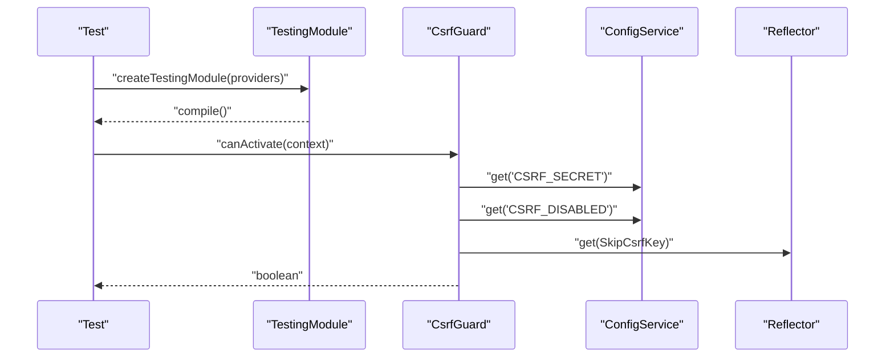

**Diagram sources**
- [apps/api/src/common/guards/csrf.guard.spec.ts:32-46](file://apps/api/src/common/guards/csrf.guard.spec.ts#L32-L46)
- [apps/api/src/common/guards/csrf.guard.spec.ts:48-65](file://apps/api/src/common/guards/csrf.guard.spec.ts#L48-L65)
- [apps/api/src/common/guards/csrf.guard.spec.ts:67-279](file://apps/api/src/common/guards/csrf.guard.spec.ts#L67-L279)

Key assertions:
- Safe HTTP methods bypass CSRF checks.
- CSRF disabled via environment allows POST without tokens.
- Tokens must match between header and cookie and pass HMAC validation.
- Decorator metadata disables CSRF for annotated handlers.

**Section sources**
- [apps/api/src/common/guards/csrf.guard.spec.ts:13-407](file://apps/api/src/common/guards/csrf.guard.spec.ts#L13-L407)

### Interceptors: Logging and Transform
Testing strategy:
- Create ExecutionContext mocks with request/response objects and headers.
- Wrap RxJS streams with CallHandler.handle returning either success or error.
- Spy on logger methods to assert logged fields and timing.
- Verify response transformation to ApiResponse with meta including timestamp and request ID.

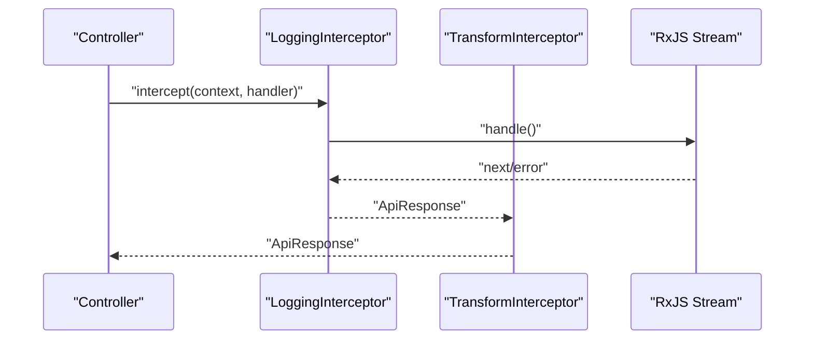

**Diagram sources**
- [apps/api/src/common/interceptors/logging.interceptor.spec.ts:57-149](file://apps/api/src/common/interceptors/logging.interceptor.spec.ts#L57-L149)
- [apps/api/src/common/interceptors/transform.interceptor.spec.ts:27-169](file://apps/api/src/common/interceptors/transform.interceptor.spec.ts#L27-L169)

Assertions:
- LoggingInterceptor logs method, URL, status code, duration, and request ID; handles both success and error paths.
- TransformInterceptor wraps data into ApiResponse with success flag, data, and meta including timestamp and request ID.

**Section sources**
- [apps/api/src/common/interceptors/logging.interceptor.spec.ts:8-151](file://apps/api/src/common/interceptors/logging.interceptor.spec.ts#L8-L151)
- [apps/api/src/common/interceptors/transform.interceptor.spec.ts:1-171](file://apps/api/src/common/interceptors/transform.interceptor.spec.ts#L1-L171)

### Filters: HTTP Exception Filter
Testing strategy:
- Instantiate HttpExceptionFilter and mock ArgumentsHost with request/response.
- Test mapping of HttpException responses (string/object/array) to standardized error payloads.
- Validate fallbacks for missing request IDs and unmapped status codes.

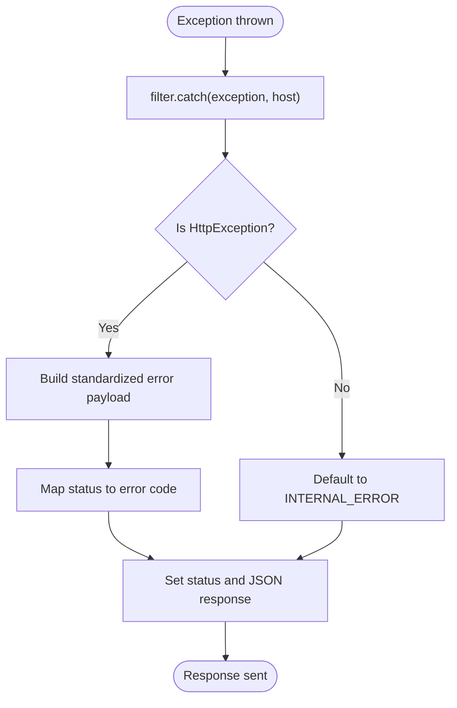

**Diagram sources**
- [apps/api/src/common/filters/http-exception.filter.spec.ts:34-184](file://apps/api/src/common/filters/http-exception.filter.spec.ts#L34-L184)

**Section sources**
- [apps/api/src/common/filters/http-exception.filter.spec.ts:1-236](file://apps/api/src/common/filters/http-exception.filter.spec.ts#L1-L236)

### Services: Memory Optimization
Testing strategy:
- Use fake timers to control periodic checks and cache TTL.
- Mock process.memoryUsage to simulate memory thresholds.
- Spy on global.gc to verify GC hints are invoked.
- Validate cache behavior with WeakRef dereferencing and expiration.

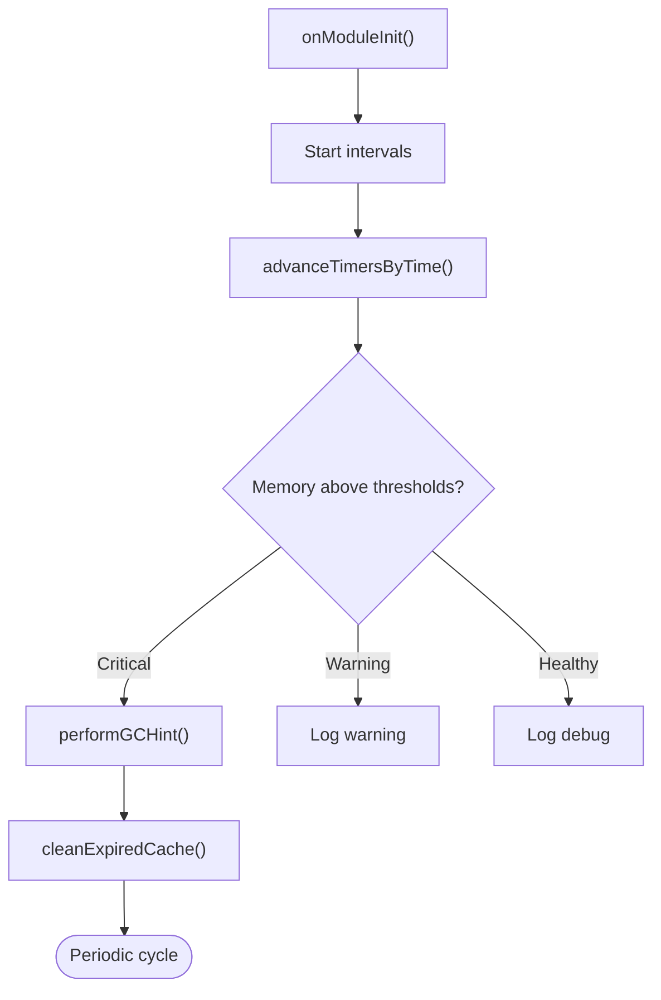

**Diagram sources**
- [apps/api/src/common/services/memory-optimization.service.spec.ts:190-239](file://apps/api/src/common/services/memory-optimization.service.spec.ts#L190-L239)
- [apps/api/src/common/services/memory-optimization.service.spec.ts:270-311](file://apps/api/src/common/services/memory-optimization.service.spec.ts#L270-L311)

**Section sources**
- [apps/api/src/common/services/memory-optimization.service.spec.ts:1-405](file://apps/api/src/common/services/memory-optimization.service.spec.ts#L1-L405)

### Configuration: Environment-driven Defaults
Testing strategy:
- Reset modules and environment per test to avoid cross-contamination.
- Delete environment variables to assert default values.
- Set environment variables to assert override behavior.
- Validate type coercion for numeric and tokenized values.

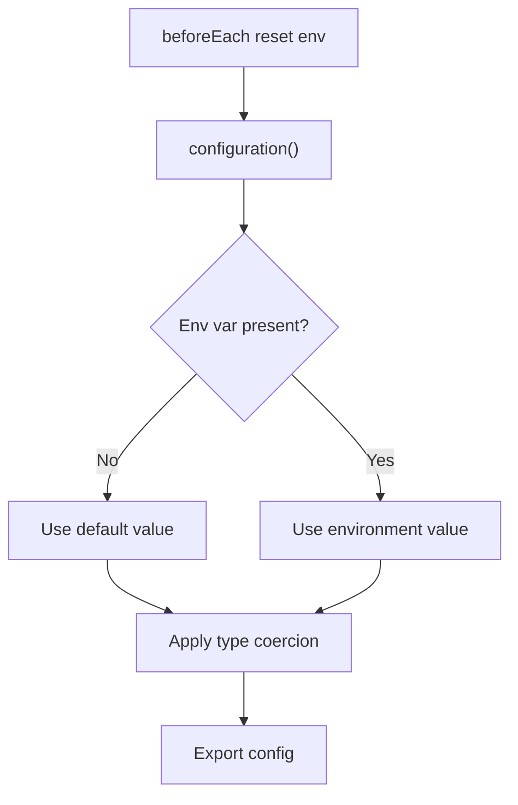

**Diagram sources**
- [apps/api/src/config/configuration.spec.ts:6-13](file://apps/api/src/config/configuration.spec.ts#L6-L13)
- [apps/api/src/config/configuration.spec.ts:15-119](file://apps/api/src/config/configuration.spec.ts#L15-L119)
- [apps/api/src/config/configuration.spec.ts:121-213](file://apps/api/src/config/configuration.spec.ts#L121-L213)

**Section sources**
- [apps/api/src/config/configuration.spec.ts:1-243](file://apps/api/src/config/configuration.spec.ts#L1-L243)

### Authentication: Service Testing Patterns
Testing strategy:
- Mock PrismaService, JwtService, ConfigService, RedisService, and NotificationService.
- Use jest.mock for bcrypt and uuid to isolate hashing and token generation.
- Test registration, login, refresh, logout, verification, password reset, and validation flows.
- Assert error handling for invalid credentials, locked accounts, and deleted users.
- Validate Redis operations for refresh tokens and token TTL parsing.

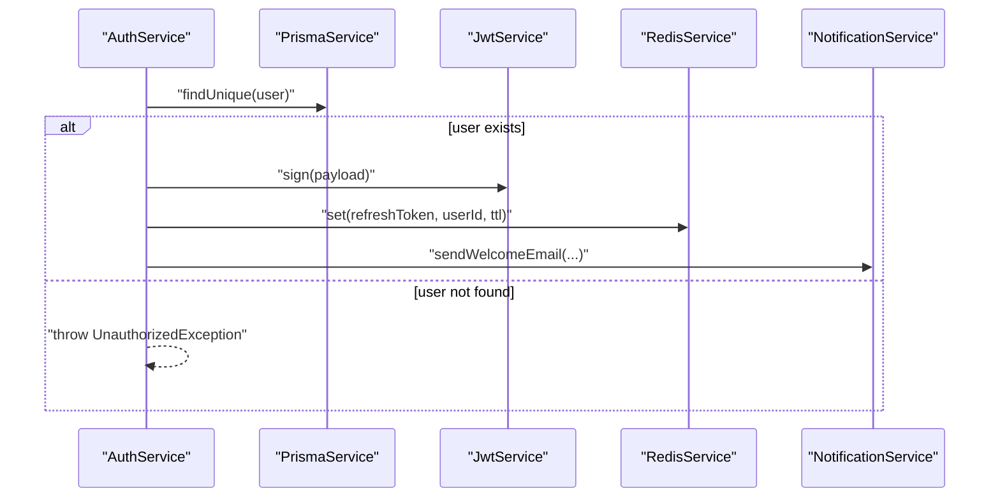

**Diagram sources**
- [apps/api/src/modules/auth/auth.service.spec.ts:88-104](file://apps/api/src/modules/auth/auth.service.spec.ts#L88-L104)
- [apps/api/src/modules/auth/auth.service.spec.ts:110-166](file://apps/api/src/modules/auth/auth.service.spec.ts#L110-L166)
- [apps/api/src/modules/auth/auth.service.spec.ts:168-244](file://apps/api/src/modules/auth/auth.service.spec.ts#L168-L244)
- [apps/api/src/modules/auth/auth.service.spec.ts:246-294](file://apps/api/src/modules/auth/auth.service.spec.ts#L246-L294)

**Section sources**
- [apps/api/src/modules/auth/auth.service.spec.ts:1-800](file://apps/api/src/modules/auth/auth.service.spec.ts#L1-L800)

### Adapters: External API Integration
Testing strategy:
- Global fetch is mocked to simulate network responses and errors.
- Test mapping of GitHub API resources to internal evidence models.
- Validate headers, pagination, and error handling for HTTP and network failures.
- Confirm SBOM detection heuristics and artifact filtering.

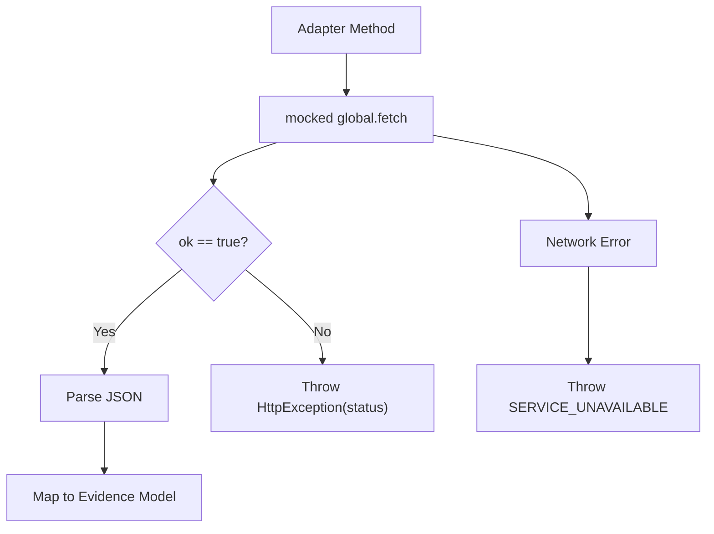

**Diagram sources**
- [apps/api/src/modules/adapters/github.adapter.spec.ts:27-38](file://apps/api/src/modules/adapters/github.adapter.spec.ts#L27-L38)
- [apps/api/src/modules/adapters/github.adapter.spec.ts:43-66](file://apps/api/src/modules/adapters/github.adapter.spec.ts#L43-L66)
- [apps/api/src/modules/adapters/github.adapter.spec.ts:120-241](file://apps/api/src/modules/adapters/github.adapter.spec.ts#L120-L241)

**Section sources**
- [apps/api/src/modules/adapters/github.adapter.spec.ts:1-800](file://apps/api/src/modules/adapters/github.adapter.spec.ts#L1-L800)

### Chat Engine: Limits and Prompts
Testing strategy:
- Mock PrismaService for project and chat message operations.
- Mock AiGatewayService for AI generation and streaming.
- Mock PromptBuilderService for system and limit-related prompts.
- Validate chat status computation, message retrieval with pagination, and send flow with limit enforcement and error rollback.

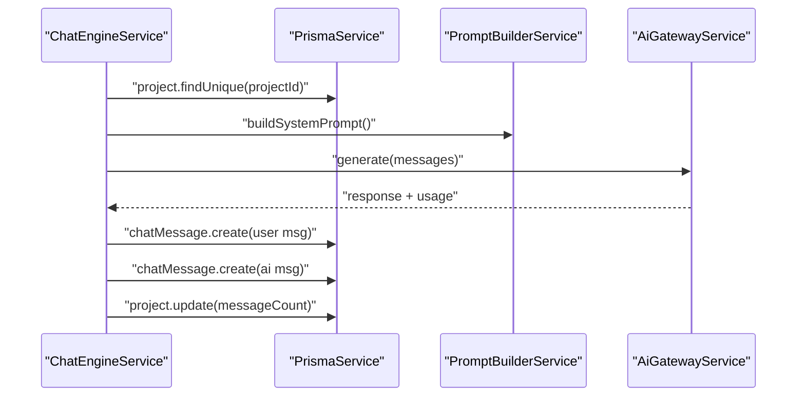

**Diagram sources**
- [apps/api/src/modules/chat-engine/chat-engine.service.spec.ts:36-76](file://apps/api/src/modules/chat-engine/chat-engine.service.spec.ts#L36-L76)
- [apps/api/src/modules/chat-engine/chat-engine.service.spec.ts:166-233](file://apps/api/src/modules/chat-engine/chat-engine.service.spec.ts#L166-L233)

**Section sources**
- [apps/api/src/modules/chat-engine/chat-engine.service.spec.ts:1-261](file://apps/api/src/modules/chat-engine/chat-engine.service.spec.ts#L1-L261)

### Conceptual Overview
This section provides general guidance applicable across components:
- Use TestingModule to bootstrap minimal NestJS contexts per test suite.
- Prefer provider overrides with jest.fn or jest.mock for external dependencies.
- For async flows, use Promise-based returns or RxJS streams with subscribe assertions.
- For DI scenarios, inject providers via module.get and assert behavior through public methods.
- For guards, interceptors, and filters, create ExecutionContext mocks and assert side effects (headers, response shapes, logging).

[No sources needed since this section doesn't analyze specific source files]

## Dependency Analysis
This section analyzes how tests depend on each other and external systems:
- Root Jest configuration coordinates multiple projects and sets a global test timeout.
- E2E configuration defines module name mapping for libs and a longer timeout suitable for integration tests.
- Service tests depend on provider overrides to isolate external systems (database, Redis, JWT, Config, Notifications).
- Adapter tests depend on global fetch mocks to simulate external API behavior.
- Utility and guard tests rely on environment variables and reflection metadata.

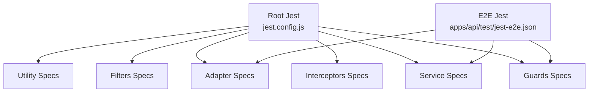

**Diagram sources**
- [jest.config.js:11-17](file://jest.config.js#L11-L17)
- [apps/api/test/jest-e2e.json:13-18](file://apps/api/test/jest-e2e.json#L13-L18)

**Section sources**
- [jest.config.js:1-26](file://jest.config.js#L1-L26)
- [apps/api/test/jest-e2e.json:1-21](file://apps/api/test/jest-e2e.json#L1-L21)

## Performance Considerations
- Use fake timers for services relying on periodic intervals to control execution and reduce flakiness.
- Mock expensive operations (external APIs, hashing, encryption) to speed up tests.
- Avoid real database connections in unit tests; prefer provider overrides with jest.fn.
- Keep test suites focused and fast by isolating concerns and minimizing cross-suite dependencies.

[No sources needed since this section provides general guidance]

## Troubleshooting Guide
Common issues and resolutions:
- Environment-dependent behavior: Reset process.env and modules between tests to avoid cross-contamination.
  - Example: [apps/api/src/config/configuration.spec.ts:6-13](file://apps/api/src/config/configuration.spec.ts#L6-L13)
- Missing request IDs in interceptors: Ensure ExecutionContext mocks include headers; otherwise, requestId will be undefined.
  - Example: [apps/api/src/common/interceptors/transform.interceptor.spec.ts:61-73](file://apps/api/src/common/interceptors/transform.interceptor.spec.ts#L61-L73)
- CSRF guard failures: Verify token generation, HMAC validation, and environment flags; ensure @SkipCsrf decorator metadata is set.
  - Example: [apps/api/src/common/guards/csrf.guard.spec.ts:98-132](file://apps/api/src/common/guards/csrf.guard.spec.ts#L98-L132)
- Adapter network errors: Mock global.fetch to simulate HTTP and network failures; assert SERVICE_UNAVAILABLE mapping.
  - Example: [apps/api/src/modules/adapters/github.adapter.spec.ts:230-240](file://apps/api/src/modules/adapters/github.adapter.spec.ts#L230-L240)
- Authentication flows: Validate Redis TTL parsing and refresh token storage; ensure error handling for invalid or expired tokens.
  - Example: [apps/api/src/modules/auth/auth.service.spec.ts:246-294](file://apps/api/src/modules/auth/auth.service.spec.ts#L246-L294)

**Section sources**
- [apps/api/src/config/configuration.spec.ts:6-13](file://apps/api/src/config/configuration.spec.ts#L6-L13)
- [apps/api/src/common/interceptors/transform.interceptor.spec.ts:61-73](file://apps/api/src/common/interceptors/transform.interceptor.spec.ts#L61-L73)
- [apps/api/src/common/guards/csrf.guard.spec.ts:98-132](file://apps/api/src/common/guards/csrf.guard.spec.ts#L98-L132)
- [apps/api/src/modules/adapters/github.adapter.spec.ts:230-240](file://apps/api/src/modules/adapters/github.adapter.spec.ts#L230-L240)
- [apps/api/src/modules/auth/auth.service.spec.ts:246-294](file://apps/api/src/modules/auth/auth.service.spec.ts#L246-L294)

## Conclusion
The Quiz-to-Build backend employs robust unit testing patterns leveraging NestJS TestingModule, targeted provider overrides, and RxJS streams. Guards, interceptors, filters, services, adapters, and utilities are comprehensively covered with environment-driven tests, async operation validations, and error handling demonstrations. By following the outlined strategies—especially around mocking external dependencies, controlling timers, and structuring test suites—you can maintain reliable and maintainable unit tests across the backend.