# Troubleshooting & Maintenance

<cite>
**Referenced Files in This Document**
- [configuration.ts](file://apps/api/src/config/configuration.ts)
- [logger.config.ts](file://apps/api/src/config/logger.config.ts)
- [alerting-rules.config.ts](file://apps/api/src/config/alerting-rules.config.ts)
- [incident-response.config.ts](file://apps/api/src/config/incident-response.config.ts)
- [disaster-recovery.config.ts](file://apps/api/src/config/disaster-recovery.config.ts)
- [uptime-monitoring.config.ts](file://apps/api/src/config/uptime-monitoring.config.ts)
- [appinsights.config.ts](file://apps/api/src/config/appinsights.config.ts)
- [sentry.config.ts](file://apps/api/src/config/sentry.config.ts)
- [auth.service.ts](file://apps/api/src/modules/auth/auth.service.ts)
- [diagnose-app-startup.ps1](file://scripts/diagnose-app-startup.ps1)
- [health-monitor.ps1](file://scripts/health-monitor.ps1)
- [security-scan.sh](file://scripts/security-scan.sh)
- [cleanup.sh](file://scripts/cleanup.sh)
- [deploy-local.sh](file://scripts/deploy-local.sh)
- [setup-local.sh](file://scripts/setup-local.sh)
</cite>

## Table of Contents
1. [Introduction](#introduction)
2. [Project Structure](#project-structure)
3. [Core Components](#core-components)
4. [Architecture Overview](#architecture-overview)
5. [Detailed Component Analysis](#detailed-component-analysis)
6. [Dependency Analysis](#dependency-analysis)
7. [Performance Considerations](#performance-considerations)
8. [Troubleshooting Guide](#troubleshooting-guide)
9. [Conclusion](#conclusion)
10. [Appendices](#appendices)

## Introduction
This document provides comprehensive troubleshooting and maintenance guidance for Quiz-to-Build operations. It covers startup diagnostics, database connectivity, authentication failures, performance bottlenecks, monitoring and alerting, incident response, disaster recovery, security maintenance, and operational runbooks. It leverages the repository’s configuration, scripts, and service implementations to deliver practical, code-backed procedures for reliable operations.

## Project Structure
The API application centralizes configuration for environment validation, logging, monitoring, alerting, incident response, and uptime monitoring. Scripts support local deployment, health monitoring, startup diagnostics, and security scanning. Authentication logic integrates with Redis for refresh tokens and database persistence for robust session lifecycle management.

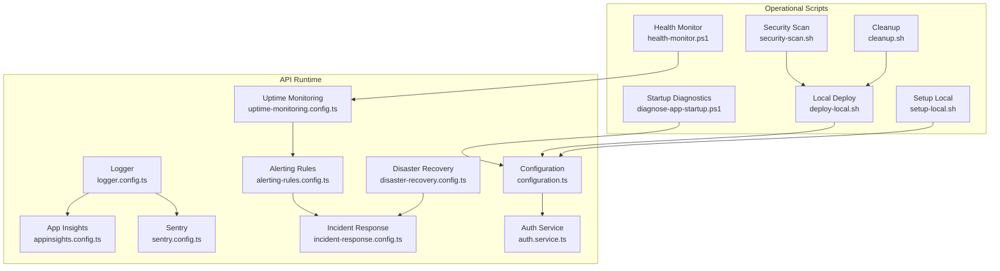

**Diagram sources**
- [configuration.ts:1-115](file://apps/api/src/config/configuration.ts#L1-L115)
- [logger.config.ts:1-62](file://apps/api/src/config/logger.config.ts#L1-L62)
- [appinsights.config.ts:1-610](file://apps/api/src/config/appinsights.config.ts#L1-L610)
- [sentry.config.ts:1-228](file://apps/api/src/config/sentry.config.ts#L1-L228)
- [uptime-monitoring.config.ts:1-379](file://apps/api/src/config/uptime-monitoring.config.ts#L1-L379)
- [alerting-rules.config.ts:1-772](file://apps/api/src/config/alerting-rules.config.ts#L1-L772)
- [incident-response.config.ts:1-800](file://apps/api/src/config/incident-response.config.ts#L1-L800)
- [disaster-recovery.config.ts:1-791](file://apps/api/src/config/disaster-recovery.config.ts#L1-L791)
- [auth.service.ts:1-507](file://apps/api/src/modules/auth/auth.service.ts#L1-L507)
- [diagnose-app-startup.ps1:1-164](file://scripts/diagnose-app-startup.ps1#L1-L164)
- [health-monitor.ps1:1-195](file://scripts/health-monitor.ps1#L1-L195)
- [security-scan.sh:1-74](file://scripts/security-scan.sh#L1-L74)
- [deploy-local.sh:1-359](file://scripts/deploy-local.sh#L1-L359)
- [setup-local.sh:1-189](file://scripts/setup-local.sh#L1-L189)
- [cleanup.sh:1-103](file://scripts/cleanup.sh#L1-L103)

**Section sources**
- [configuration.ts:1-115](file://apps/api/src/config/configuration.ts#L1-L115)
- [logger.config.ts:1-62](file://apps/api/src/config/logger.config.ts#L1-L62)
- [uptime-monitoring.config.ts:1-379](file://apps/api/src/config/uptime-monitoring.config.ts#L1-L379)
- [alerting-rules.config.ts:1-772](file://apps/api/src/config/alerting-rules.config.ts#L1-L772)
- [incident-response.config.ts:1-800](file://apps/api/src/config/incident-response.config.ts#L1-L800)
- [disaster-recovery.config.ts:1-791](file://apps/api/src/config/disaster-recovery.config.ts#L1-L791)
- [appinsights.config.ts:1-610](file://apps/api/src/config/appinsights.config.ts#L1-L610)
- [sentry.config.ts:1-228](file://apps/api/src/config/sentry.config.ts#L1-L228)
- [auth.service.ts:1-507](file://apps/api/src/modules/auth/auth.service.ts#L1-L507)
- [diagnose-app-startup.ps1:1-164](file://scripts/diagnose-app-startup.ps1#L1-L164)
- [health-monitor.ps1:1-195](file://scripts/health-monitor.ps1#L1-L195)
- [security-scan.sh:1-74](file://scripts/security-scan.sh#L1-L74)
- [deploy-local.sh:1-359](file://scripts/deploy-local.sh#L1-L359)
- [setup-local.sh:1-189](file://scripts/setup-local.sh#L1-L189)
- [cleanup.sh:1-103](file://scripts/cleanup.sh#L1-L103)

## Core Components
- Configuration and environment validation ensure production hardening (JWT secrets, CORS, database URL).
- Logging configuration supports correlation IDs and redaction for security.
- Monitoring and alerting define thresholds, escalation, and notification channels.
- Incident response defines severity, runbooks, and on-call schedules.
- Disaster recovery defines RTO/RPO, backup/restore, PITR, and failover procedures.
- Uptime monitoring defines health endpoints, SLAs, and external monitoring integration.
- Application Insights and Sentry provide telemetry, performance, and error tracking.
- Authentication service manages tokens, refresh tokens, and security controls.

**Section sources**
- [configuration.ts:1-115](file://apps/api/src/config/configuration.ts#L1-L115)
- [logger.config.ts:1-62](file://apps/api/src/config/logger.config.ts#L1-L62)
- [alerting-rules.config.ts:1-772](file://apps/api/src/config/alerting-rules.config.ts#L1-L772)
- [incident-response.config.ts:1-800](file://apps/api/src/config/incident-response.config.ts#L1-L800)
- [disaster-recovery.config.ts:1-791](file://apps/api/src/config/disaster-recovery.config.ts#L1-L791)
- [uptime-monitoring.config.ts:1-379](file://apps/api/src/config/uptime-monitoring.config.ts#L1-L379)
- [appinsights.config.ts:1-610](file://apps/api/src/config/appinsights.config.ts#L1-L610)
- [sentry.config.ts:1-228](file://apps/api/src/config/sentry.config.ts#L1-L228)
- [auth.service.ts:1-507](file://apps/api/src/modules/auth/auth.service.ts#L1-L507)

## Architecture Overview
The system integrates runtime configuration, logging, telemetry, monitoring, alerting, and incident management. Scripts automate local deployment, health checks, diagnostics, and security scanning. Authentication relies on Redis for refresh tokens and database persistence for auditability.

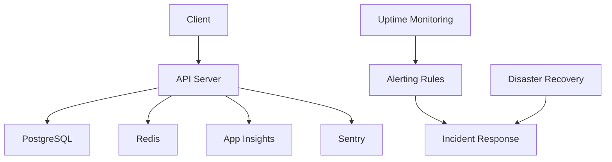

**Diagram sources**
- [configuration.ts:1-115](file://apps/api/src/config/configuration.ts#L1-L115)
- [appinsights.config.ts:1-610](file://apps/api/src/config/appinsights.config.ts#L1-L610)
- [sentry.config.ts:1-228](file://apps/api/src/config/sentry.config.ts#L1-L228)
- [uptime-monitoring.config.ts:1-379](file://apps/api/src/config/uptime-monitoring.config.ts#L1-L379)
- [alerting-rules.config.ts:1-772](file://apps/api/src/config/alerting-rules.config.ts#L1-L772)
- [incident-response.config.ts:1-800](file://apps/api/src/config/incident-response.config.ts#L1-L800)
- [disaster-recovery.config.ts:1-791](file://apps/api/src/config/disaster-recovery.config.ts#L1-L791)
- [auth.service.ts:1-507](file://apps/api/src/modules/auth/auth.service.ts#L1-L507)

## Detailed Component Analysis

### Configuration and Environment Hardening
- Validates production environment variables and JWT secrets.
- Builds Redis, JWT, throttling, email, and Claude configurations.
- Enforces strict CORS and logging levels.

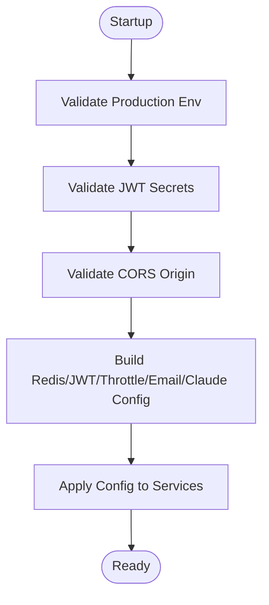

**Diagram sources**
- [configuration.ts:1-115](file://apps/api/src/config/configuration.ts#L1-L115)

**Section sources**
- [configuration.ts:1-115](file://apps/api/src/config/configuration.ts#L1-L115)

### Logging and Correlation
- Structured logging with correlation IDs via request IDs.
- Redacts sensitive headers and cookies.
- Switches transport based on environment.

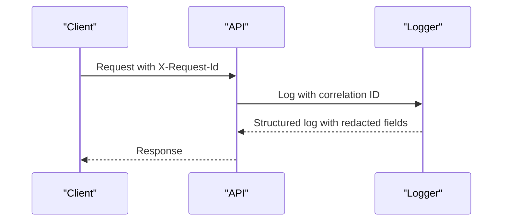

**Diagram sources**
- [logger.config.ts:1-62](file://apps/api/src/config/logger.config.ts#L1-L62)

**Section sources**
- [logger.config.ts:1-62](file://apps/api/src/config/logger.config.ts#L1-L62)

### Monitoring and Alerting
- Alerting rules define thresholds for error rates, performance, security, business, and resource metrics.
- Notification channels include email, Slack, Teams, PagerDuty, SMS, and webhooks.
- Escalation policies vary by severity.

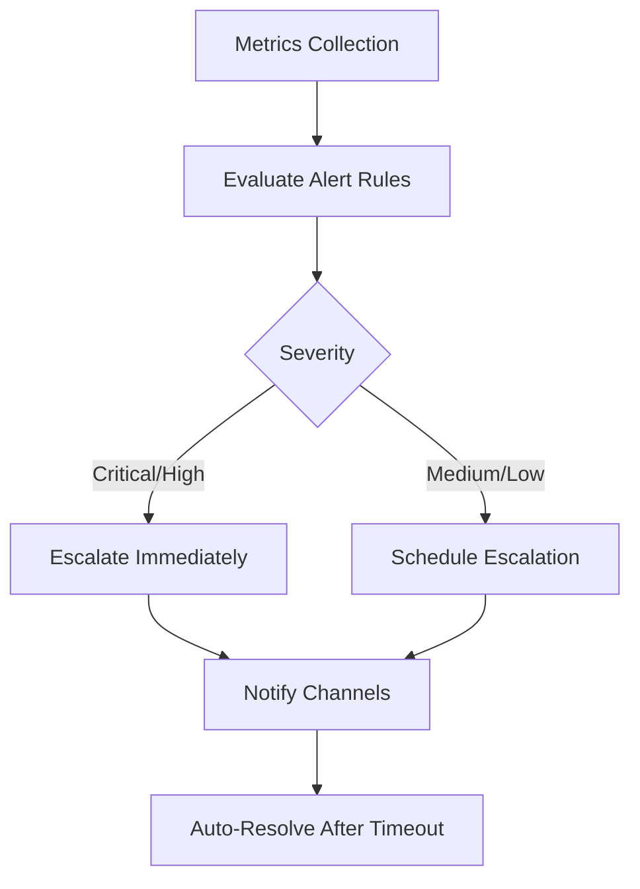

**Diagram sources**
- [alerting-rules.config.ts:1-772](file://apps/api/src/config/alerting-rules.config.ts#L1-L772)

**Section sources**
- [alerting-rules.config.ts:1-772](file://apps/api/src/config/alerting-rules.config.ts#L1-L772)

### Incident Response
- Defines severity levels, escalation paths, on-call schedules, and runbooks.
- Includes runbooks for production outages, high error rates, security incidents, and database issues.

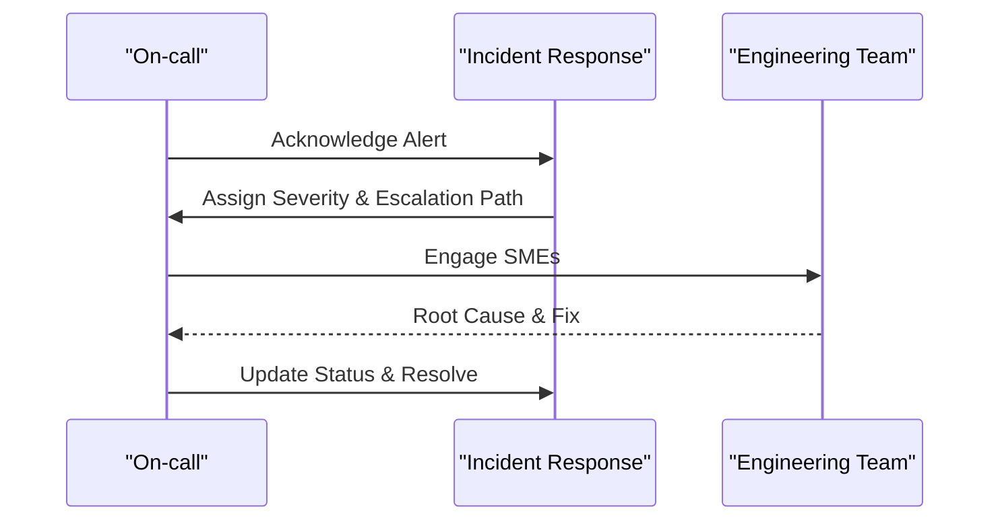

**Diagram sources**
- [incident-response.config.ts:1-800](file://apps/api/src/config/incident-response.config.ts#L1-L800)

**Section sources**
- [incident-response.config.ts:1-800](file://apps/api/src/config/incident-response.config.ts#L1-L800)

### Disaster Recovery
- Targets RTO/RPO, backup types, PITR, and failover modes.
- Procedures include region failover, database PITR, and full system restore.

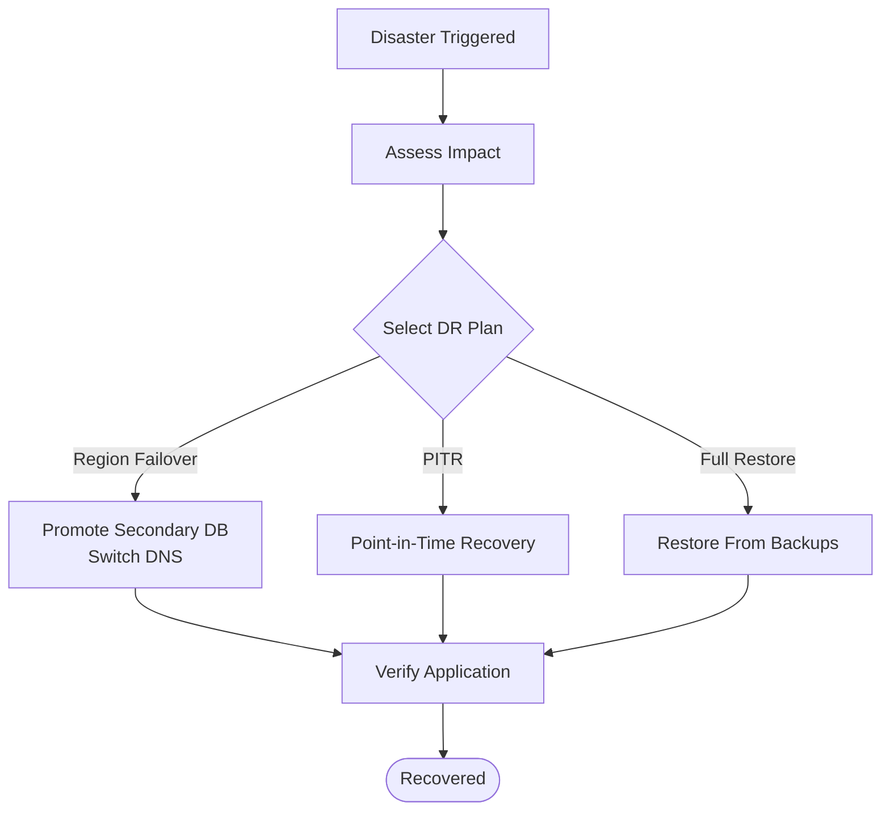

**Diagram sources**
- [disaster-recovery.config.ts:1-791](file://apps/api/src/config/disaster-recovery.config.ts#L1-L791)

**Section sources**
- [disaster-recovery.config.ts:1-791](file://apps/api/src/config/disaster-recovery.config.ts#L1-L791)

### Uptime Monitoring and SLAs
- Health endpoints for live, ready, and full checks.
- External uptime monitoring integration and alert thresholds.
- SLA targets and maintenance windows.

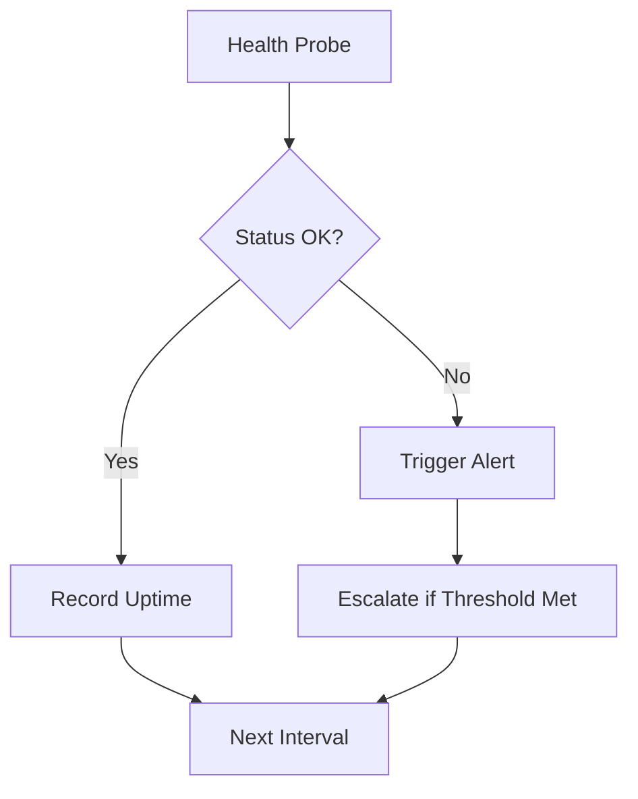

**Diagram sources**
- [uptime-monitoring.config.ts:1-379](file://apps/api/src/config/uptime-monitoring.config.ts#L1-L379)

**Section sources**
- [uptime-monitoring.config.ts:1-379](file://apps/api/src/config/uptime-monitoring.config.ts#L1-L379)

### Application Telemetry (App Insights and Sentry)
- App Insights tracks requests, dependencies, exceptions, and custom metrics.
- Sentry captures errors, performance, and user context with filtering and sampling.

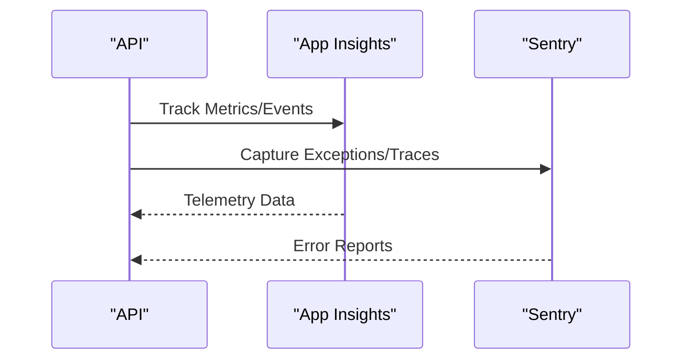

**Diagram sources**
- [appinsights.config.ts:1-610](file://apps/api/src/config/appinsights.config.ts#L1-L610)
- [sentry.config.ts:1-228](file://apps/api/src/config/sentry.config.ts#L1-L228)

**Section sources**
- [appinsights.config.ts:1-610](file://apps/api/src/config/appinsights.config.ts#L1-L610)
- [sentry.config.ts:1-228](file://apps/api/src/config/sentry.config.ts#L1-L228)

### Authentication and Session Management
- Registration, login, token generation, refresh, logout, and verification flows.
- Refresh tokens stored in Redis with TTL and audit trail in DB.
- Password reset with token expiry and token invalidation.

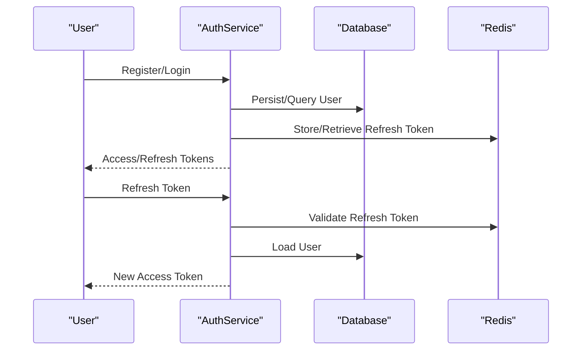

**Diagram sources**
- [auth.service.ts:1-507](file://apps/api/src/modules/auth/auth.service.ts#L1-L507)

**Section sources**
- [auth.service.ts:1-507](file://apps/api/src/modules/auth/auth.service.ts#L1-L507)

## Dependency Analysis
- Configuration depends on environment variables and builds runtime configs for Redis, JWT, throttling, email, and Claude.
- Logging depends on configuration for log levels and transport.
- Monitoring and alerting depend on uptime monitoring definitions and alert rules.
- Incident response and disaster recovery depend on each other for coordinated recovery.
- Authentication depends on database and Redis for persistence and caching.
- Scripts depend on Azure CLI and Docker for diagnostics, monitoring, and deployment.

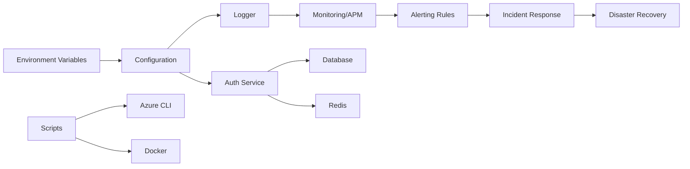

**Diagram sources**
- [configuration.ts:1-115](file://apps/api/src/config/configuration.ts#L1-L115)
- [logger.config.ts:1-62](file://apps/api/src/config/logger.config.ts#L1-L62)
- [alerting-rules.config.ts:1-772](file://apps/api/src/config/alerting-rules.config.ts#L1-L772)
- [incident-response.config.ts:1-800](file://apps/api/src/config/incident-response.config.ts#L1-L800)
- [disaster-recovery.config.ts:1-791](file://apps/api/src/config/disaster-recovery.config.ts#L1-L791)
- [auth.service.ts:1-507](file://apps/api/src/modules/auth/auth.service.ts#L1-L507)
- [diagnose-app-startup.ps1:1-164](file://scripts/diagnose-app-startup.ps1#L1-L164)
- [health-monitor.ps1:1-195](file://scripts/health-monitor.ps1#L1-L195)
- [deploy-local.sh:1-359](file://scripts/deploy-local.sh#L1-L359)

**Section sources**
- [configuration.ts:1-115](file://apps/api/src/config/configuration.ts#L1-L115)
- [auth.service.ts:1-507](file://apps/api/src/modules/auth/auth.service.ts#L1-L507)
- [diagnose-app-startup.ps1:1-164](file://scripts/diagnose-app-startup.ps1#L1-L164)
- [health-monitor.ps1:1-195](file://scripts/health-monitor.ps1#L1-L195)
- [deploy-local.sh:1-359](file://scripts/deploy-local.sh#L1-L359)

## Performance Considerations
- Use App Insights and Sentry to track response times, throughput, and error rates.
- Tune JWT expiration and refresh token TTLs to balance security and UX.
- Optimize database queries and consider read replicas for high-read workloads.
- Monitor Redis memory usage and eviction policies.
- Implement circuit breakers and retries for external API calls.

[No sources needed since this section provides general guidance]

## Troubleshooting Guide

### Startup Problems
Common symptoms: container fails to start, health endpoint returns errors, missing environment variables, or secrets not found.

Recommended actions:
- Run startup diagnostics script to check Container App status, logs, environment variables, database, Redis, health endpoint, and Key Vault secrets.
- Validate production configuration for required environment variables and JWT secrets.
- Inspect logs for stack traces and error messages.

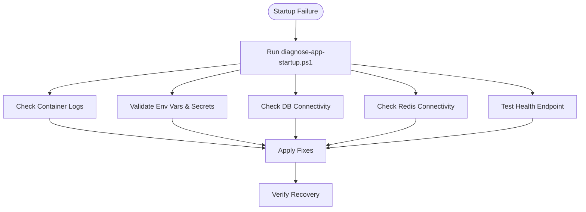

**Diagram sources**
- [diagnose-app-startup.ps1:1-164](file://scripts/diagnose-app-startup.ps1#L1-L164)
- [configuration.ts:1-115](file://apps/api/src/config/configuration.ts#L1-L115)

**Section sources**
- [diagnose-app-startup.ps1:1-164](file://scripts/diagnose-app-startup.ps1#L1-L164)
- [configuration.ts:1-115](file://apps/api/src/config/configuration.ts#L1-L115)

### Database Connectivity Issues
Symptoms: readiness probe fails, database unreachable, connection pool exhaustion.

Recommended actions:
- Verify database server status and connectivity.
- Check active connections and long-running queries.
- Scale compute resources if under heavy load.
- Initiate failover if primary is unrecoverable.
- Validate connection strings and credentials.

**Section sources**
- [disaster-recovery.config.ts:1-791](file://apps/api/src/config/disaster-recovery.config.ts#L1-L791)

### Authentication Failures
Symptoms: invalid credentials, account locked, invalid/expired refresh tokens, email verification failures.

Recommended actions:
- Check failed login attempts and lockouts.
- Verify refresh token presence in Redis and DB.
- Regenerate tokens and invalidate stale ones.
- Re-send verification emails and reset passwords securely.

**Section sources**
- [auth.service.ts:1-507](file://apps/api/src/modules/auth/auth.service.ts#L1-L507)

### Performance Bottlenecks
Symptoms: high response times, slow database queries, high CPU/memory usage, throughput drops.

Recommended actions:
- Use App Insights and Sentry to identify slow endpoints and dependencies.
- Review database query performance and add indexes as needed.
- Scale infrastructure or optimize caching strategies.
- Monitor Redis memory and tune eviction policies.

**Section sources**
- [appinsights.config.ts:1-610](file://apps/api/src/config/appinsights.config.ts#L1-L610)
- [sentry.config.ts:1-228](file://apps/api/src/config/sentry.config.ts#L1-L228)

### Security Incidents
Symptoms: brute force attempts, unauthorized access, suspicious activity, critical error spikes.

Recommended actions:
- Isolate affected systems and revoke compromised credentials.
- Preserve forensic evidence and conduct root cause analysis.
- Remediate vulnerabilities and re-validate security posture.
- Notify stakeholders per compliance requirements.

**Section sources**
- [incident-response.config.ts:1-800](file://apps/api/src/config/incident-response.config.ts#L1-L800)
- [alerting-rules.config.ts:1-772](file://apps/api/src/config/alerting-rules.config.ts#L1-L772)

### Emergency Response and Rollback
- Activate DR procedures for region failover or database PITR.
- Use rollback strategies for deployments (feature flags, blue/green, canary).
- Follow runbooks for production outages and high error rates.

**Section sources**
- [disaster-recovery.config.ts:1-791](file://apps/api/src/config/disaster-recovery.config.ts#L1-L791)
- [incident-response.config.ts:1-800](file://apps/api/src/config/incident-response.config.ts#L1-L800)

### Maintenance Procedures
- Database optimization: analyze slow queries, add indexes, vacuum/analyze, consider read replicas.
- Cache management: monitor memory usage, configure eviction policies, snapshot regularly.
- System cleanup: use cleanup script to destroy resources during teardown.

**Section sources**
- [cleanup.sh:1-103](file://scripts/cleanup.sh#L1-L103)

### Monitoring and Alerting
- Configure alerting rules and notification channels.
- Use health-monitor.ps1 for continuous health checks and alerts.
- Integrate external uptime monitoring and status pages.

**Section sources**
- [alerting-rules.config.ts:1-772](file://apps/api/src/config/alerting-rules.config.ts#L1-L772)
- [health-monitor.ps1:1-195](file://scripts/health-monitor.ps1#L1-L195)
- [uptime-monitoring.config.ts:1-379](file://apps/api/src/config/uptime-monitoring.config.ts#L1-L379)

### Capacity Planning
- Track SLA metrics and allowed downtime.
- Monitor response times and throughput trends.
- Plan infrastructure scaling based on growth projections.

**Section sources**
- [uptime-monitoring.config.ts:1-379](file://apps/api/src/config/uptime-monitoring.config.ts#L1-L379)

### Security Maintenance and Compliance
- Run security scans on Docker images.
- Patch dependencies and monitor CVEs.
- Maintain compliance with policies and audits.

**Section sources**
- [security-scan.sh:1-74](file://scripts/security-scan.sh#L1-L74)

### Operational Runbooks and Escalation
- Use incident response runbooks for standardized procedures.
- Follow escalation policies for critical and high-severity issues.
- Maintain on-call schedules and communication channels.

**Section sources**
- [incident-response.config.ts:1-800](file://apps/api/src/config/incident-response.config.ts#L1-L800)

### Backup and Recovery
- Validate backup configurations and retention policies.
- Perform periodic restore tests and PITR validation.
- Execute full system restore drills regularly.

**Section sources**
- [disaster-recovery.config.ts:1-791](file://apps/api/src/config/disaster-recovery.config.ts#L1-L791)

## Conclusion
This guide consolidates troubleshooting and maintenance practices grounded in the repository’s configuration, scripts, and services. By following the outlined workflows—startup diagnostics, authentication checks, performance tuning, incident response, and disaster recovery—you can maintain a resilient and observable Quiz-to-Build platform.

[No sources needed since this section summarizes without analyzing specific files]

## Appendices

### Diagnostic Tools and Scripts
- Startup diagnostics: [diagnose-app-startup.ps1:1-164](file://scripts/diagnose-app-startup.ps1#L1-L164)
- Health monitoring: [health-monitor.ps1:1-195](file://scripts/health-monitor.ps1#L1-L195)
- Security scanning: [security-scan.sh:1-74](file://scripts/security-scan.sh#L1-L74)
- Local deployment: [deploy-local.sh:1-359](file://scripts/deploy-local.sh#L1-L359)
- Local setup: [setup-local.sh:1-189](file://scripts/setup-local.sh#L1-L189)
- Cleanup: [cleanup.sh:1-103](file://scripts/cleanup.sh#L1-L103)

**Section sources**
- [diagnose-app-startup.ps1:1-164](file://scripts/diagnose-app-startup.ps1#L1-L164)
- [health-monitor.ps1:1-195](file://scripts/health-monitor.ps1#L1-L195)
- [security-scan.sh:1-74](file://scripts/security-scan.sh#L1-L74)
- [deploy-local.sh:1-359](file://scripts/deploy-local.sh#L1-L359)
- [setup-local.sh:1-189](file://scripts/setup-local.sh#L1-L189)
- [cleanup.sh:1-103](file://scripts/cleanup.sh#L1-L103)