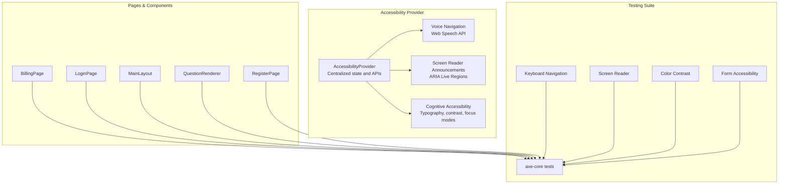
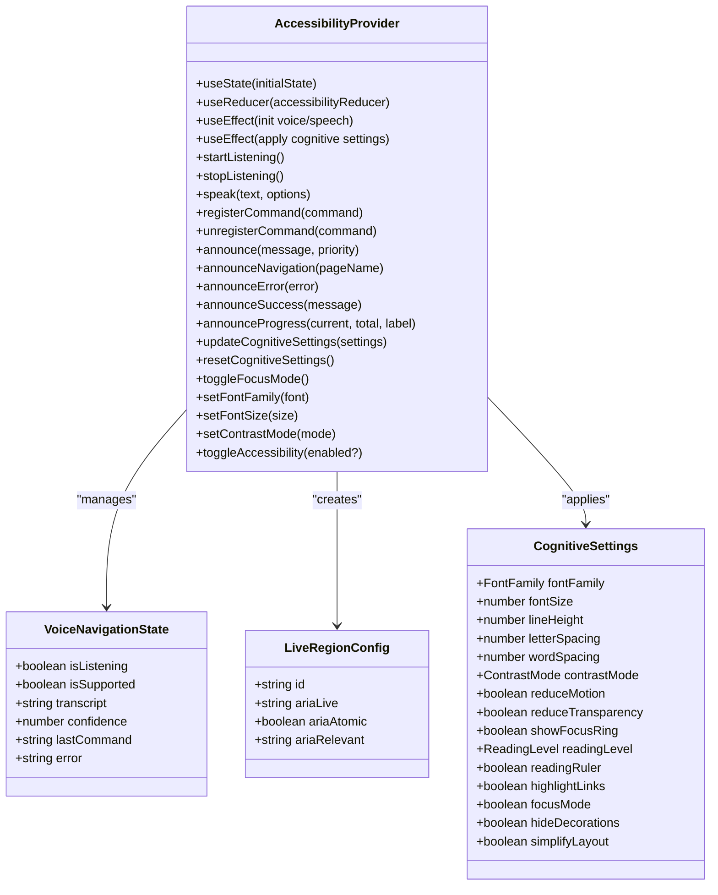
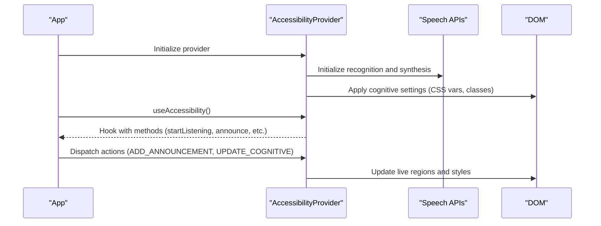
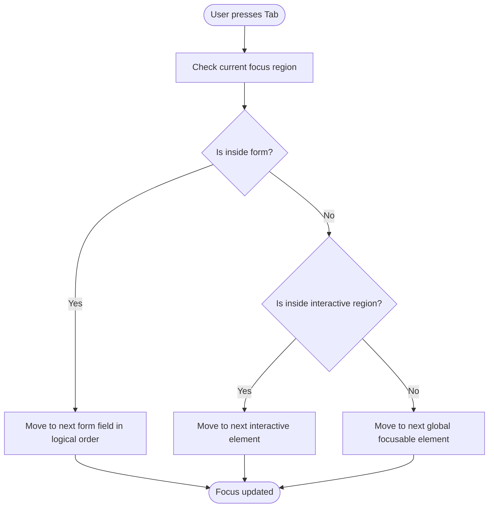
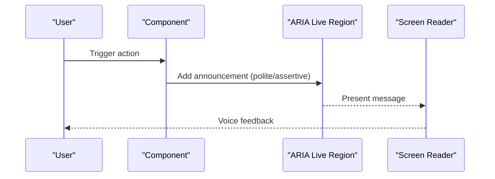
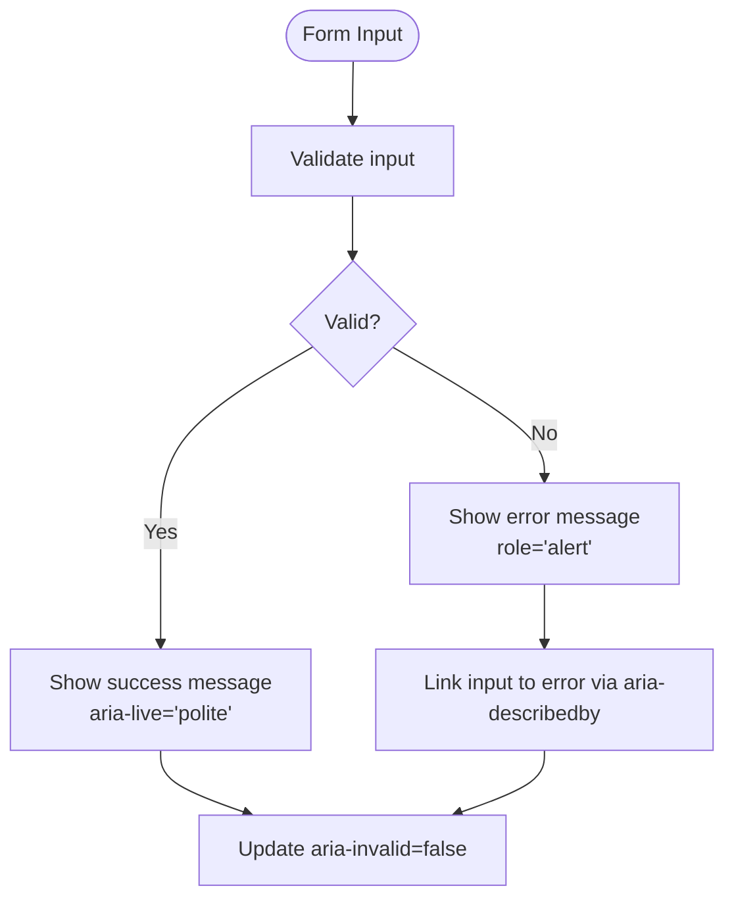
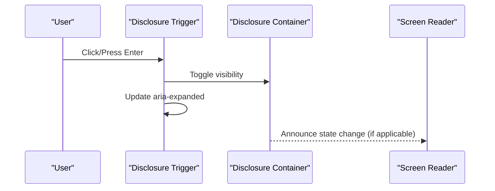
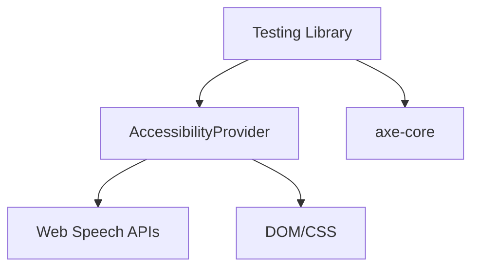

# Accessibility & UX Guidelines

<cite>
**Referenced Files in This Document**
- [Accessibility.tsx](file://apps/web/src/components/accessibility/Accessibility.tsx)
- [index.ts](file://apps/web/src/components/accessibility/index.ts)
- [BillingPage.a11y.test.tsx](file://apps/web/src/test/a11y/BillingPage.a11y.test.tsx)
- [LoginPage.a11y.test.tsx](file://apps/web/src/test/a11y/LoginPage.a11y.test.tsx)
- [MainLayout.a11y.test.tsx](file://apps/web/src/test/a11y/MainLayout.a11y.test.tsx)
- [keyboard-navigation.a11y.test.tsx](file://apps/web/src/test/a11y/keyboard-navigation.a11y.test.tsx)
- [screen-reader.a11y.test.tsx](file://apps/web/src/test/a11y/screen-reader.a11y.test.tsx)
- [color-contrast-forms.a11y.test.tsx](file://apps/web/src/test/a11y/color-contrast-forms.a11y.test.tsx)
- [QuestionRenderer.a11y.test.tsx](file://apps/web/src/test/a11y/QuestionRenderer.a11y.test.tsx)
- [RegisterPage.a11y.test.tsx](file://apps/web/src/test/a11y/RegisterPage.a11y.test.tsx)
</cite>

## Table of Contents
1. [Introduction](#introduction)
2. [Project Structure](#project-structure)
3. [Core Components](#core-components)
4. [Architecture Overview](#architecture-overview)
5. [Detailed Component Analysis](#detailed-component-analysis)
6. [Dependency Analysis](#dependency-analysis)
7. [Performance Considerations](#performance-considerations)
8. [Troubleshooting Guide](#troubleshooting-guide)
9. [Conclusion](#conclusion)

## Introduction
This document provides comprehensive accessibility and user experience guidelines for the Quiz-to-Build application. It consolidates WCAG 2.2 AA compliance measures, keyboard navigation patterns, and screen reader support implementations. It also covers focus management, ARIA attributes usage, semantic HTML practices, UX patterns (tooltips, breadcrumbs, confirmation dialogs, error handling), progressive disclosure techniques, form validation feedback, loading states, testing methodologies (automated with axe-core and manual testing), inclusive design principles, cognitive accessibility features, and internationalization support. The guidance is grounded in the existing accessibility implementation and test suites in the repository.

## Project Structure
The accessibility system is built around a centralized provider and supporting test suites that validate WCAG 2.2 AA compliance across key pages and components. The structure emphasizes:
- Centralized accessibility provider with voice navigation, screen reader announcements, and cognitive accessibility controls
- Comprehensive test suites validating keyboard navigation, screen reader compatibility, color contrast, and form accessibility
- Reusable patterns for modals, live regions, landmarks, and progressive disclosure

**Diagram sources**
- [Accessibility.tsx:1-1067](file://apps/web/src/components/accessibility/Accessibility.tsx#L1-L1067)
- [BillingPage.a11y.test.tsx:1-636](file://apps/web/src/test/a11y/BillingPage.a11y.test.tsx#L1-L636)
- [LoginPage.a11y.test.tsx:1-175](file://apps/web/src/test/a11y/LoginPage.a11y.test.tsx#L1-L175)
- [MainLayout.a11y.test.tsx:1-457](file://apps/web/src/test/a11y/MainLayout.a11y.test.tsx#L1-L457)
- [keyboard-navigation.a11y.test.tsx:1-755](file://apps/web/src/test/a11y/keyboard-navigation.a11y.test.tsx#L1-L755)
- [screen-reader.a11y.test.tsx:1-786](file://apps/web/src/test/a11y/screen-reader.a11y.test.tsx#L1-L786)
- [color-contrast-forms.a11y.test.tsx:1-859](file://apps/web/src/test/a11y/color-contrast-forms.a11y.test.tsx#L1-L859)
- [QuestionRenderer.a11y.test.tsx:1-458](file://apps/web/src/test/a11y/QuestionRenderer.a11y.test.tsx#L1-L458)
- [RegisterPage.a11y.test.tsx:1-322](file://apps/web/src/test/a11y/RegisterPage.a11y.test.tsx#L1-L322)

**Section sources**
- [Accessibility.tsx:1-1067](file://apps/web/src/components/accessibility/Accessibility.tsx#L1-L1067)
- [index.ts:1-6](file://apps/web/src/components/accessibility/index.ts#L1-L6)

## Core Components
The central accessibility system provides:
- Voice navigation with Web Speech Recognition and Speech Synthesis
- Screen reader announcements via ARIA live regions
- Cognitive accessibility controls (typography, contrast, motion preferences, focus mode)
- Global state persisted to localStorage for user preferences

Key capabilities:
- Voice command registration and execution
- Polite and assertive announcements for dynamic content
- Dynamic CSS custom properties for typography and contrast adjustments
- Focus management helpers for modals, errors, and AJAX updates

**Section sources**
- [Accessibility.tsx:1-1067](file://apps/web/src/components/accessibility/Accessibility.tsx#L1-L1067)

## Architecture Overview
The accessibility architecture centers on a provider that exposes hooks and utilities for voice, screen reader, and cognitive accessibility features. Pages and components consume these utilities to ensure consistent, accessible behavior.

**Diagram sources**
- [Accessibility.tsx:1-1067](file://apps/web/src/components/accessibility/Accessibility.tsx#L1-L1067)

**Section sources**
- [Accessibility.tsx:1-1067](file://apps/web/src/components/accessibility/Accessibility.tsx#L1-L1067)

## Detailed Component Analysis

### Accessibility Provider and Hooks
The provider encapsulates state transitions, lifecycle management for speech APIs, and DOM effects for cognitive accessibility. It exports a hook for consuming accessibility features across the application.

Implementation highlights:
- Reducer manages voice, live regions, announcements, and cognitive settings
- Speech recognition initialized once and reused across components
- Cognitive settings applied via CSS custom properties and body classes
- Persistent storage for user preferences

**Diagram sources**
- [Accessibility.tsx:1-1067](file://apps/web/src/components/accessibility/Accessibility.tsx#L1-L1067)

**Section sources**
- [Accessibility.tsx:1-1067](file://apps/web/src/components/accessibility/Accessibility.tsx#L1-L1067)

### Keyboard Navigation Patterns
The keyboard navigation tests validate:
- Logical tab order in forms
- Skip links for bypassing navigation
- Focus management in modals, dropdowns, and AJAX updates
- No keyboard traps in interactive regions
- Focus indicators and programmatic focus behavior

UX patterns:
- Skip link positioned as the first focusable element
- Auto-focus on modal open and Escape key handling
- Arrow keys for dropdown navigation
- Programmatic focus on error messages and loaded content

**Diagram sources**
- [keyboard-navigation.a11y.test.tsx:1-755](file://apps/web/src/test/a11y/keyboard-navigation.a11y.test.tsx#L1-L755)

**Section sources**
- [keyboard-navigation.a11y.test.tsx:1-755](file://apps/web/src/test/a11y/keyboard-navigation.a11y.test.tsx#L1-L755)

### Screen Reader Support
Screen reader tests validate:
- Landmark roles and regions
- ARIA labels and roles for forms, images, and widgets
- Live regions (status, alert, log, progress)
- Expanded/collapsed states for accordions, menus, and dialogs
- Table accessibility with captions and headers

Implementation patterns:
- Role-based announcements for dynamic content
- Proper labeling for images and icons
- aria-live regions for status updates
- aria-expanded and aria-controls for expandable widgets

**Diagram sources**
- [screen-reader.a11y.test.tsx:1-786](file://apps/web/src/test/a11y/screen-reader.a11y.test.tsx#L1-L786)
- [Accessibility.tsx:574-628](file://apps/web/src/components/accessibility/Accessibility.tsx#L574-L628)

**Section sources**
- [screen-reader.a11y.test.tsx:1-786](file://apps/web/src/test/a11y/screen-reader.a11y.test.tsx#L1-L786)
- [Accessibility.tsx:574-628](file://apps/web/src/components/accessibility/Accessibility.tsx#L574-L628)

### Color Contrast and Form Accessibility
Color contrast tests validate WCAG 2.2 AA ratios for:
- Normal text (4.5:1)
- Large text/UI (3:1)
- Status colors on colored backgrounds (4.5:1)

Form accessibility tests validate:
- Required fields with aria-required
- Error messages with role="alert"
- Hints linked via aria-describedby
- Inline validation feedback
- Disabled and readonly states

**Diagram sources**
- [color-contrast-forms.a11y.test.tsx:1-859](file://apps/web/src/test/a11y/color-contrast-forms.a11y.test.tsx#L1-L859)

**Section sources**
- [color-contrast-forms.a11y.test.tsx:1-859](file://apps/web/src/test/a11y/color-contrast-forms.a11y.test.tsx#L1-L859)

### UX Patterns and Progressive Disclosure
Patterns validated by tests:
- Tooltips: aria-describedby linking
- Breadcrumbs: navigation landmarks
- Confirmation dialogs: aria-modal and focus management
- Error handling: error summaries and role="alert"
- Progressive disclosure: accordion, dropdown, details/summary

**Diagram sources**
- [MainLayout.a11y.test.tsx:1-457](file://apps/web/src/test/a11y/MainLayout.a11y.test.tsx#L1-L457)
- [QuestionRenderer.a11y.test.tsx:1-458](file://apps/web/src/test/a11y/QuestionRenderer.a11y.test.tsx#L1-L458)

**Section sources**
- [MainLayout.a11y.test.tsx:1-457](file://apps/web/src/test/a11y/MainLayout.a11y.test.tsx#L1-L457)
- [QuestionRenderer.a11y.test.tsx:1-458](file://apps/web/src/test/a11y/QuestionRenderer.a11y.test.tsx#L1-L458)

### Page-Level Accessibility Examples

#### Billing Page
- Uses role="main", landmarks, and accessible navigation
- Live regions for usage updates and status
- Alert roles for warnings and error states
- Loading states with aria-busy and aria-live

**Section sources**
- [BillingPage.a11y.test.tsx:1-636](file://apps/web/src/test/a11y/BillingPage.a11y.test.tsx#L1-L636)

#### Login Page
- Proper heading hierarchy and main landmark
- Accessible form labels and required field indication
- Social login grouping with role="group"
- Skip link pattern

**Section sources**
- [LoginPage.a11y.test.tsx:1-175](file://apps/web/src/test/a11y/LoginPage.a11y.test.tsx#L1-L175)

#### Registration Page
- Password requirements announced via aria-describedby and aria-live
- Autocomplete attributes for security and usability
- Accessible navigation to login

**Section sources**
- [RegisterPage.a11y.test.tsx:1-322](file://apps/web/src/test/a11y/RegisterPage.a11y.test.tsx#L1-L322)

## Dependency Analysis
The accessibility system integrates with:
- Web Speech APIs for voice navigation and synthesis
- DOM manipulation for applying cognitive accessibility settings
- React hooks for state management and lifecycle events
- Testing libraries for automated validation (axe-core, Testing Library)

**Diagram sources**
- [Accessibility.tsx:1-1067](file://apps/web/src/components/accessibility/Accessibility.tsx#L1-L1067)
- [keyboard-navigation.a11y.test.tsx:1-755](file://apps/web/src/test/a11y/keyboard-navigation.a11y.test.tsx#L1-L755)
- [screen-reader.a11y.test.tsx:1-786](file://apps/web/src/test/a11y/screen-reader.a11y.test.tsx#L1-L786)

**Section sources**
- [Accessibility.tsx:1-1067](file://apps/web/src/components/accessibility/Accessibility.tsx#L1-L1067)

## Performance Considerations
- Minimize frequent re-renders when updating live regions to avoid excessive DOM churn
- Debounce or throttle voice command processing to prevent repeated actions
- Use CSS custom properties for cognitive settings to leverage GPU acceleration
- Avoid heavy computations in focus management handlers

## Troubleshooting Guide
Common issues and resolutions:
- Voice commands not recognized: verify browser support for SpeechRecognition and permissions
- Screen reader not announcing: ensure aria-live regions are present and updated correctly
- Focus lost in modals: confirm autoFocus and Escape key handling are implemented
- Color contrast failures: adjust color pairs to meet WCAG 2.2 AA ratios

Testing checklist:
- Run axe-core tests for each page and component
- Manually test keyboard navigation and screen reader announcements
- Validate focus management in dynamic content scenarios
- Verify cognitive accessibility settings apply consistently

**Section sources**
- [keyboard-navigation.a11y.test.tsx:1-755](file://apps/web/src/test/a11y/keyboard-navigation.a11y.test.tsx#L1-L755)
- [screen-reader.a11y.test.tsx:1-786](file://apps/web/src/test/a11y/screen-reader.a11y.test.tsx#L1-L786)
- [color-contrast-forms.a11y.test.tsx:1-859](file://apps/web/src/test/a11y/color-contrast-forms.a11y.test.tsx#L1-L859)

## Conclusion
The Quiz-to-Build application implements a robust accessibility framework centered on a comprehensive provider, validated by extensive test suites covering keyboard navigation, screen reader compatibility, color contrast, and form accessibility. By following the guidelines and patterns outlined here, developers can maintain WCAG 2.2 AA compliance while delivering inclusive, user-friendly experiences across all pages and components.