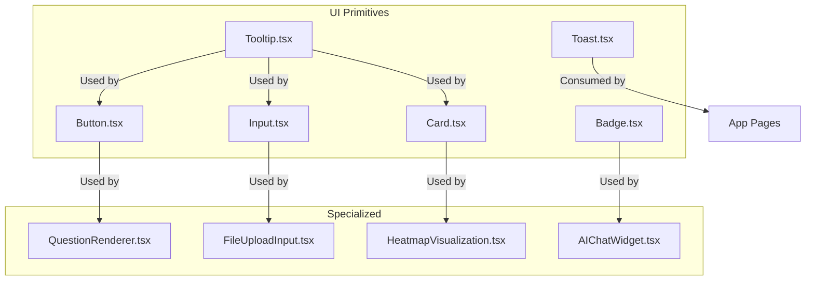
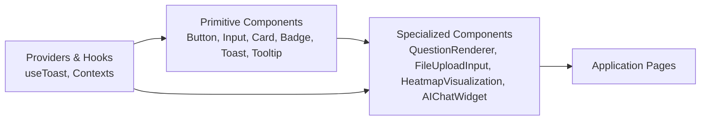
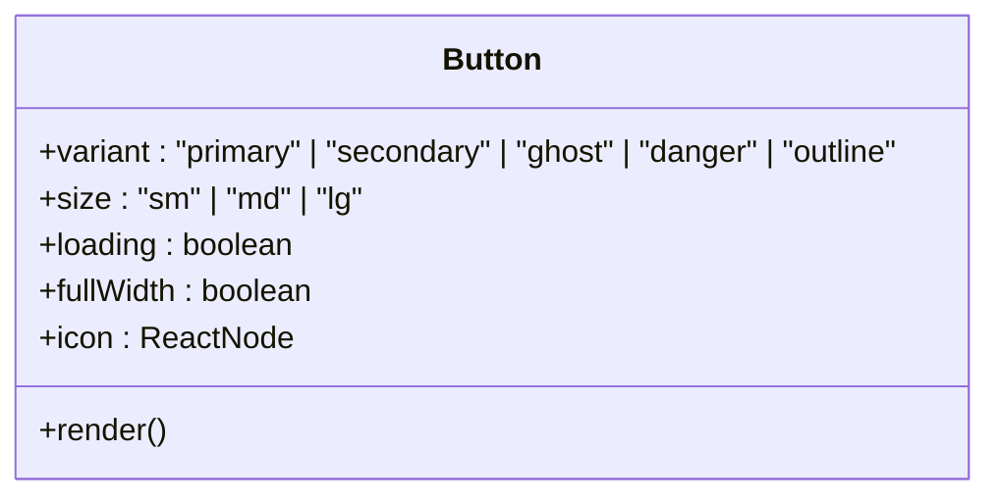
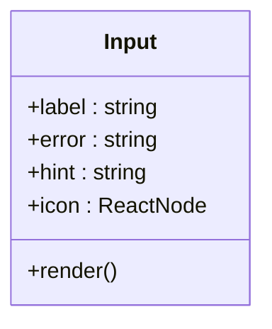
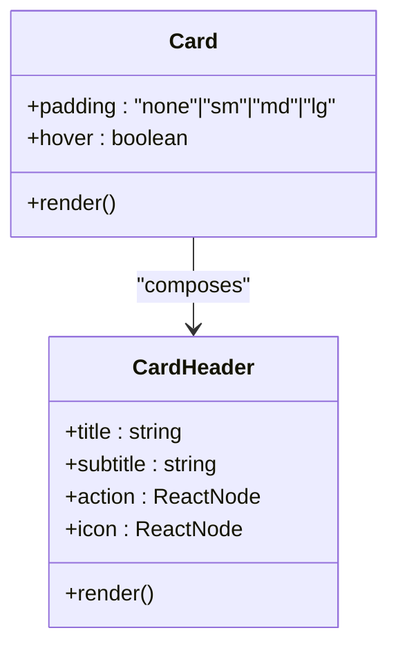
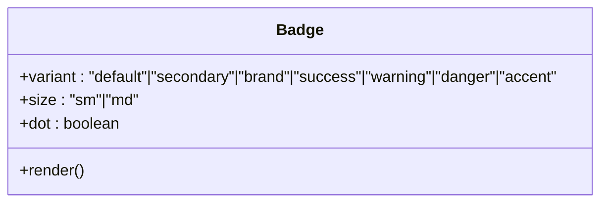
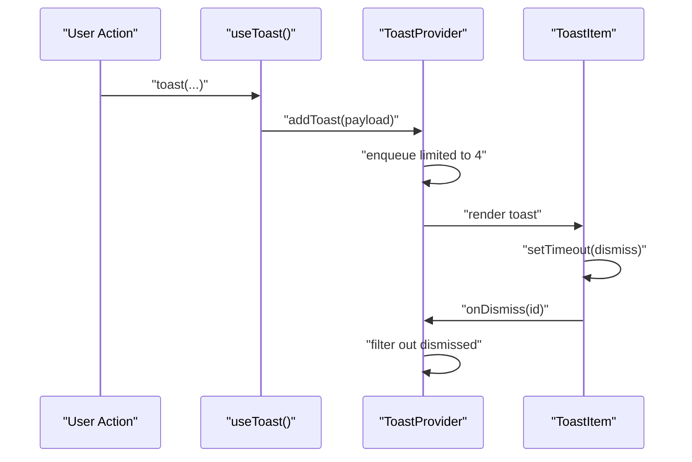
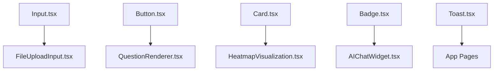

# Component Library

<cite>
**Referenced Files in This Document**
- [Button.tsx](file://apps/web/src/components/ui/Button.tsx)
- [Input.tsx](file://apps/web/src/components/ui/Input.tsx)
- [Card.tsx](file://apps/web/src/components/ui/Card.tsx)
- [Badge.tsx](file://apps/web/src/components/ui/Badge.tsx)
- [Toast.tsx](file://apps/web/src/components/ui/Toast.tsx)
- [QuestionRenderer.tsx](file://apps/web/src/components/questionnaire/QuestionRenderer.tsx)
- [FileUploadInput.tsx](file://apps/web/src/components/ui/FileUploadInput.tsx)
- [HeatmapVisualization.tsx](file://apps/web/src/components/analytics/HeatmapVisualization.tsx)
- [AIChatWidget.tsx](file://apps/web/src/components/ai/AIChatWidget.tsx)
- [Tooltip.tsx](file://apps/web/src/components/ui/Tooltip.tsx)
</cite>

## Table of Contents
1. [Introduction](#introduction)
2. [Project Structure](#project-structure)
3. [Core Components](#core-components)
4. [Architecture Overview](#architecture-overview)
5. [Detailed Component Analysis](#detailed-component-analysis)
6. [Dependency Analysis](#dependency-analysis)
7. [Performance Considerations](#performance-considerations)
8. [Accessibility and UX](#accessibility-and-ux)
9. [Styling and Theming](#styling-and-theming)
10. [Usage Examples and Best Practices](#usage-examples-and-best-practices)
11. [Troubleshooting Guide](#troubleshooting-guide)
12. [Conclusion](#conclusion)

## Introduction
This document describes the reusable UI component library used across Quiz-to-Build’s web application. It covers core components (Button, Input, Card, Badge, Toast, Tooltip), specialized components (QuestionRenderer, FileUploadInput, HeatmapVisualization, AIChatWidget), and provides guidance on composition patterns, customization, accessibility, and styling. The goal is to enable consistent, accessible, and maintainable UI development aligned with the project’s design system.

## Project Structure
The UI components are organized under the web application’s component tree. The core UI primitives live in the ui directory, while specialized components reside in domain-specific folders such as questionnaire, analytics, and ai.

**Diagram sources**
- [Button.tsx:1-100](file://apps/web/src/components/ui/Button.tsx#L1-L100)
- [Input.tsx:1-69](file://apps/web/src/components/ui/Input.tsx#L1-L69)
- [Card.tsx:1-62](file://apps/web/src/components/ui/Card.tsx#L1-L62)
- [Badge.tsx:1-66](file://apps/web/src/components/ui/Badge.tsx#L1-L66)
- [Toast.tsx:1-123](file://apps/web/src/components/ui/Toast.tsx#L1-L123)
- [Tooltip.tsx](file://apps/web/src/components/ui/Tooltip.tsx)
- [QuestionRenderer.tsx](file://apps/web/src/components/questionnaire/QuestionRenderer.tsx)
- [FileUploadInput.tsx](file://apps/web/src/components/ui/FileUploadInput.tsx)
- [HeatmapVisualization.tsx](file://apps/web/src/components/analytics/HeatmapVisualization.tsx)
- [AIChatWidget.tsx](file://apps/web/src/components/ai/AIChatWidget.tsx)

**Section sources**
- [Button.tsx:1-100](file://apps/web/src/components/ui/Button.tsx#L1-L100)
- [Input.tsx:1-69](file://apps/web/src/components/ui/Input.tsx#L1-L69)
- [Card.tsx:1-62](file://apps/web/src/components/ui/Card.tsx#L1-L62)
- [Badge.tsx:1-66](file://apps/web/src/components/ui/Badge.tsx#L1-L66)
- [Toast.tsx:1-123](file://apps/web/src/components/ui/Toast.tsx#L1-L123)
- [QuestionRenderer.tsx](file://apps/web/src/components/questionnaire/QuestionRenderer.tsx)
- [FileUploadInput.tsx](file://apps/web/src/components/ui/FileUploadInput.tsx)
- [HeatmapVisualization.tsx](file://apps/web/src/components/analytics/HeatmapVisualization.tsx)
- [AIChatWidget.tsx](file://apps/web/src/components/ai/AIChatWidget.tsx)

## Core Components
This section documents the foundational UI primitives with their props, variants, states, and usage patterns.

### Button
- Purpose: Action trigger with multiple visual variants, sizes, and loading state.
- Props:
  - variant: primary | secondary | ghost | danger | outline
  - size: sm | md | lg
  - loading: boolean
  - fullWidth: boolean
  - icon: ReactNode
  - Inherits standard button attributes (disabled, aria-*)
- States and Behaviors:
  - Disabled when either disabled or loading is true.
  - Loading displays an inline spinner; icon is hidden during loading.
  - Focus-visible ring and hover states per variant.
- Accessibility:
  - Inherits native button semantics; supports aria attributes via spread.
- Composition:
  - Used widely across forms, modals, and navigation.

**Section sources**
- [Button.tsx:12-97](file://apps/web/src/components/ui/Button.tsx#L12-L97)

### Input
- Purpose: Text input with optional label, icon, hint/error messaging, and validation integration.
- Props:
  - label: string
  - error: string
  - hint: string
  - icon: ReactNode
  - Inherits standard input attributes (required, aria-*, etc.)
- Accessibility:
  - Associates label with input via htmlFor/id.
  - Sets aria-invalid and aria-describedby for assistive tech.
- Composition:
  - Often composed with form wrappers and validation libraries.

**Section sources**
- [Input.tsx:9-66](file://apps/web/src/components/ui/Input.tsx#L9-L66)

### Card
- Purpose: Container with optional header, padding, and hover elevation.
- Props:
  - padding: none | sm | md | lg
  - hover: boolean
  - Inherits standard div attributes
- Composition:
  - CardHeader provides a standardized header area with optional icon and action.

**Section sources**
- [Card.tsx:9-62](file://apps/web/src/components/ui/Card.tsx#L9-L62)

### Badge
- Purpose: Status or metadata indicator with dot mode and multiple variants.
- Props:
  - variant: default | secondary | brand | success | warning | danger | accent
  - size: sm | md
  - dot: boolean
  - children: ReactNode
- Composition:
  - Used within lists, cards, and indicators.

**Section sources**
- [Badge.tsx:12-65](file://apps/web/src/components/ui/Badge.tsx#L12-L65)

### Toast
- Purpose: Non-blocking notifications with provider pattern and typed messages.
- Props:
  - ToastProvider: children
  - ToastItem: toast, onDismiss
- Types and Icons:
  - success, error, warning, info mapped to icons and styles.
- Behavior:
  - Auto-dismiss after duration (default ~4s); limited to last 4 toasts.
  - Dismissible via close button; exposed via useToast hook.
- Accessibility:
  - Role="alert" on toast item; suitable for screen readers.

**Section sources**
- [Toast.tsx:10-122](file://apps/web/src/components/ui/Toast.tsx#L10-L122)

### Tooltip
- Purpose: Inline tooltip for contextual help or labeling.
- Notes:
  - Component exists in the UI directory; typical props include content, position, and trigger element.
  - Intended to be composed with interactive elements like Button or Input.

**Section sources**
- [Tooltip.tsx](file://apps/web/src/components/ui/Tooltip.tsx)

## Architecture Overview
The component library follows a layered approach:
- Primitive components (Button, Input, Card, Badge, Toast, Tooltip) provide atomic UI building blocks.
- Specialized components (QuestionRenderer, FileUploadInput, HeatmapVisualization, AIChatWidget) compose primitives to deliver domain-specific functionality.
- Provider patterns (ToastProvider) centralize cross-cutting concerns like notifications.

[No sources needed since this diagram shows conceptual workflow, not actual code structure]

## Detailed Component Analysis

### Button Analysis
- Implementation highlights:
  - Variant and size maps define consistent styles.
  - clsx composes base, variant, size, and conditional classes.
  - Loading state toggles icon rendering and disables interaction.
- Accessibility:
  - Inherits button semantics; supports disabled state and focus-visible rings.
- Composition patterns:
  - Icon buttons, loading states, and full-width layouts.

**Diagram sources**
- [Button.tsx:9-18](file://apps/web/src/components/ui/Button.tsx#L9-L18)

**Section sources**
- [Button.tsx:20-97](file://apps/web/src/components/ui/Button.tsx#L20-L97)

### Input Analysis
- Implementation highlights:
  - Optional label, icon, hint, and error messaging.
  - Dynamic aria attributes for assistive technologies.
  - Conditional padding for icon presence.
- Accessibility:
  - Proper labeling and error announcements via aria-invalid and aria-describedby.

**Diagram sources**
- [Input.tsx:9-14](file://apps/web/src/components/ui/Input.tsx#L9-L14)

**Section sources**
- [Input.tsx:16-66](file://apps/web/src/components/ui/Input.tsx#L16-L66)

### Card Analysis
- Implementation highlights:
  - Padding presets and optional hover elevation.
  - CardHeader provides a consistent header layout with icon and action slot.
- Composition:
  - Cards often wrap forms, analytics panels, and lists.

**Diagram sources**
- [Card.tsx:9-12](file://apps/web/src/components/ui/Card.tsx#L9-L12)
- [Card.tsx:37-61](file://apps/web/src/components/ui/Card.tsx#L37-L61)

**Section sources**
- [Card.tsx:21-62](file://apps/web/src/components/ui/Card.tsx#L21-L62)

### Badge Analysis
- Implementation highlights:
  - Dot mode for compact indicators.
  - Variant and size maps for consistent styling.
- Composition:
  - Used in lists, status chips, and counters.

**Diagram sources**
- [Badge.tsx:12-18](file://apps/web/src/components/ui/Badge.tsx#L12-L18)

**Section sources**
- [Badge.tsx:45-65](file://apps/web/src/components/ui/Badge.tsx#L45-L65)

### Toast Analysis
- Implementation highlights:
  - useToast hook exposes convenience methods for each toast type.
  - ToastProvider manages queue, auto-dismiss timers, and DOM placement.
  - Role="alert" ensures accessibility.
- Behavior:
  - Limited to last 4 toasts; dismissible and configurable duration.

**Diagram sources**
- [Toast.tsx:89-122](file://apps/web/src/components/ui/Toast.tsx#L89-L122)

**Section sources**
- [Toast.tsx:28-122](file://apps/web/src/components/ui/Toast.tsx#L28-L122)

### Tooltip Analysis
- Implementation highlights:
  - Typically accepts content, placement, and trigger element.
  - Composed with interactive primitives to enhance usability.
- Accessibility:
  - Should integrate with aria-describedby or aria-label for screen readers.

**Section sources**
- [Tooltip.tsx](file://apps/web/src/components/ui/Tooltip.tsx)

### Specialized Components

#### QuestionRenderer
- Purpose: Renders questionnaire questions with appropriate input types and validation.
- Composition:
  - Uses Input, Button, and other primitives to present dynamic questionnaires.
- Extensibility:
  - Accepts question schema and renders appropriate controls.

**Section sources**
- [QuestionRenderer.tsx](file://apps/web/src/components/questionnaire/QuestionRenderer.tsx)

#### FileUploadInput
- Purpose: File selection with preview and validation.
- Composition:
  - Builds upon Input to provide file-specific UX.
- Extensibility:
  - Supports drag-and-drop, previews, and error messaging.

**Section sources**
- [FileUploadInput.tsx](file://apps/web/src/components/ui/FileUploadInput.tsx)

#### HeatmapVisualization
- Purpose: Visualizes activity or engagement data.
- Composition:
  - Uses Card for container and layout primitives for grid/overlay.
- Extensibility:
  - Accepts data arrays and renders cells with color scales.

**Section sources**
- [HeatmapVisualization.tsx](file://apps/web/src/components/analytics/HeatmapVisualization.tsx)

#### AIChatWidget
- Purpose: Chat interface for AI assistance.
- Composition:
  - Uses Badge for status indicators and Input/Button for message entry.
- Extensibility:
  - Integrates with chat services and handles streaming responses.

**Section sources**
- [AIChatWidget.tsx](file://apps/web/src/components/ai/AIChatWidget.tsx)

## Dependency Analysis
- Internal dependencies:
  - QuestionRenderer composes Input and Button.
  - FileUploadInput composes Input.
  - HeatmapVisualization composes Card.
  - AIChatWidget composes Badge and Input/Button.
- External dependencies:
  - clsx for conditional class composition.
  - lucide-react icons for Toast and Tooltip visuals.
- Providers:
  - ToastProvider encapsulates state and DOM placement.

**Diagram sources**
- [Input.tsx:1-69](file://apps/web/src/components/ui/Input.tsx#L1-L69)
- [Button.tsx:1-100](file://apps/web/src/components/ui/Button.tsx#L1-L100)
- [Card.tsx:1-62](file://apps/web/src/components/ui/Card.tsx#L1-L62)
- [Badge.tsx:1-66](file://apps/web/src/components/ui/Badge.tsx#L1-L66)
- [Toast.tsx:1-123](file://apps/web/src/components/ui/Toast.tsx#L1-L123)
- [QuestionRenderer.tsx](file://apps/web/src/components/questionnaire/QuestionRenderer.tsx)
- [FileUploadInput.tsx](file://apps/web/src/components/ui/FileUploadInput.tsx)
- [HeatmapVisualization.tsx](file://apps/web/src/components/analytics/HeatmapVisualization.tsx)
- [AIChatWidget.tsx](file://apps/web/src/components/ai/AIChatWidget.tsx)

**Section sources**
- [Button.tsx:1-100](file://apps/web/src/components/ui/Button.tsx#L1-L100)
- [Input.tsx:1-69](file://apps/web/src/components/ui/Input.tsx#L1-L69)
- [Card.tsx:1-62](file://apps/web/src/components/ui/Card.tsx#L1-L62)
- [Badge.tsx:1-66](file://apps/web/src/components/ui/Badge.tsx#L1-L66)
- [Toast.tsx:1-123](file://apps/web/src/components/ui/Toast.tsx#L1-L123)
- [QuestionRenderer.tsx](file://apps/web/src/components/questionnaire/QuestionRenderer.tsx)
- [FileUploadInput.tsx](file://apps/web/src/components/ui/FileUploadInput.tsx)
- [HeatmapVisualization.tsx](file://apps/web/src/components/analytics/HeatmapVisualization.tsx)
- [AIChatWidget.tsx](file://apps/web/src/components/ai/AIChatWidget.tsx)

## Performance Considerations
- Prefer variant and size maps for consistent hashing and minimal re-renders.
- Limit concurrent toasts to reduce DOM churn.
- Defer heavy computations in tooltips and chat widgets to background threads where possible.
- Use memoization for frequently changing props in specialized components.

[No sources needed since this section provides general guidance]

## Accessibility and UX
- Keyboard Navigation:
  - Buttons and inputs are keyboard operable; ensure focus order is logical.
  - Tooltips should not trap focus; use aria-live regions for dynamic content.
- Screen Reader Compatibility:
  - Inputs set aria-invalid and aria-describedby for error and hint announcements.
  - Toasts use role="alert" for immediate feedback.
- Focus Management:
  - Focus-visible rings are applied per variant; ensure sufficient contrast.
- Interaction Feedback:
  - Hover and active states are defined; ensure sufficient contrast and visible feedback.

**Section sources**
- [Input.tsx:37-38](file://apps/web/src/components/ui/Input.tsx#L37-L38)
- [Toast.tsx:72-72](file://apps/web/src/components/ui/Toast.tsx#L72-L72)

## Styling and Theming
- Design System Tokens:
  - Colors use semantic tokens (brand, surface, success, danger, warning, accent).
- CSS Variables:
  - Theme-aware tokens are referenced via class names; ensure dark mode classes are applied consistently.
- Overrides:
  - Pass className to primitives to extend styles; avoid inline styles for themeable properties.
- Provider Placement:
  - ToastProvider mounts to a fixed container; ensure z-index and positioning align with app layout.

**Section sources**
- [Button.tsx:20-36](file://apps/web/src/components/ui/Button.tsx#L20-L36)
- [Input.tsx:39-49](file://apps/web/src/components/ui/Input.tsx#L39-L49)
- [Card.tsx:24-26](file://apps/web/src/components/ui/Card.tsx#L24-L26)
- [Badge.tsx:20-43](file://apps/web/src/components/ui/Badge.tsx#L20-L43)
- [Toast.tsx:113-119](file://apps/web/src/components/ui/Toast.tsx#L113-L119)

## Usage Examples and Best Practices
- Composition Patterns:
  - Wrap QuestionRenderer with Card for structured sections.
  - Pair FileUploadInput with Input for supplementary text fields.
  - Use Badge to indicate status inside AIChatWidget.
- Prop Interfaces:
  - Always pass explicit variant and size for predictable styling.
  - Use loading on Button to prevent duplicate submissions.
- Extension Guidelines:
  - Extend primitives by composing them; avoid duplicating styles.
  - Add className for targeted overrides; keep overrides scoped.
- Animation and Transitions:
  - Leverage existing transition durations and easing for smooth UX.
  - Toasts animate in; ensure timing matches user expectations.

[No sources needed since this section provides general guidance]

## Troubleshooting Guide
- Toast not appearing:
  - Ensure ToastProvider wraps the application root.
  - Verify z-index and fixed positioning are not overridden.
- Input label or error not announced:
  - Confirm id and aria-describedby are set correctly.
  - Ensure error prop is truthy when validation fails.
- Button disabled unexpectedly:
  - Check both disabled and loading props; loading implies disabled.
- Tooltip not visible:
  - Confirm trigger element receives focus and tooltip is attached to the DOM.

**Section sources**
- [Toast.tsx:89-122](file://apps/web/src/components/ui/Toast.tsx#L89-L122)
- [Input.tsx:17-66](file://apps/web/src/components/ui/Input.tsx#L17-L66)
- [Button.tsx:53-53](file://apps/web/src/components/ui/Button.tsx#L53-L53)

## Conclusion
The component library emphasizes consistency, accessibility, and composability. By leveraging primitive components and provider patterns, teams can build complex UIs efficiently while maintaining a coherent design system. Specialized components encapsulate domain logic and reuse primitives for predictable behavior and easy maintenance.