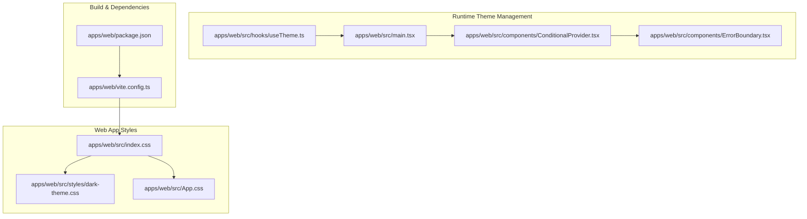
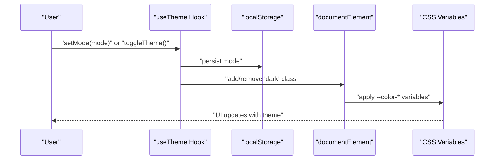
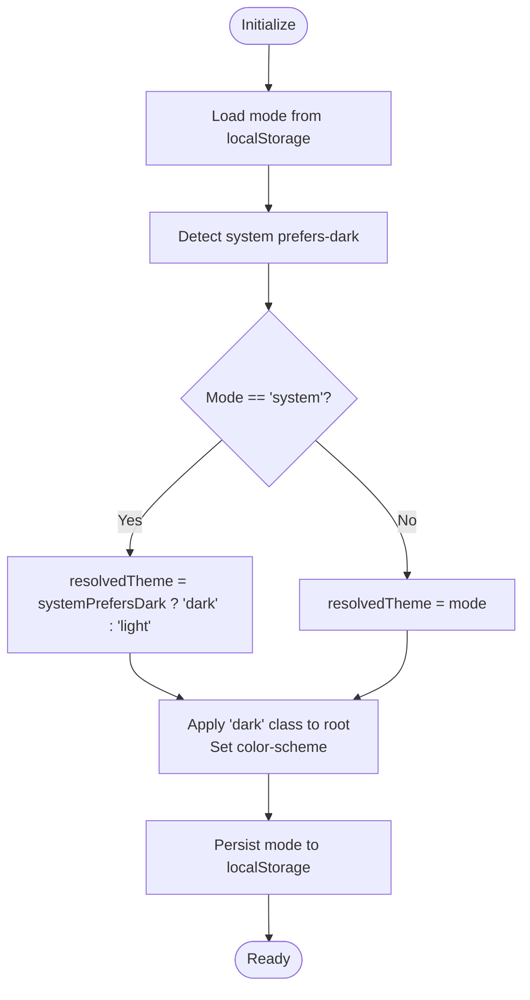
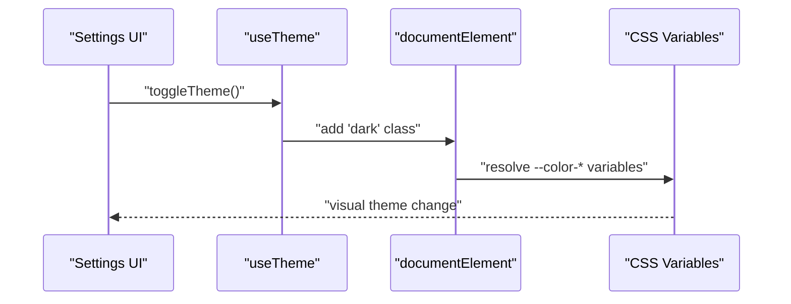
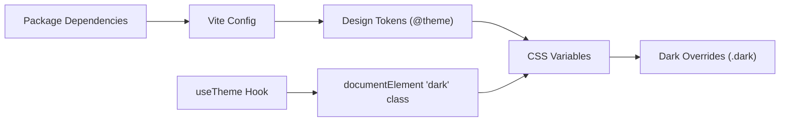

# Design System & Theming

<cite>
**Referenced Files in This Document**
- [index.css](file://apps/web/src/index.css)
- [dark-theme.css](file://apps/web/src/styles/dark-theme.css)
- [App.css](file://apps/web/src/App.css)
- [useTheme.ts](file://apps/web/src/hooks/useTheme.ts)
- [main.tsx](file://apps/web/src/main.tsx)
- [ConditionalProvider.tsx](file://apps/web/src/components/ConditionalProvider.tsx)
- [ErrorBoundary.tsx](file://apps/web/src/components/ErrorBoundary.tsx)
- [vite.config.ts](file://apps/web/vite.config.ts)
- [package.json](file://apps/web/package.json)
</cite>

## Table of Contents
1. [Introduction](#introduction)
2. [Project Structure](#project-structure)
3. [Core Components](#core-components)
4. [Architecture Overview](#architecture-overview)
5. [Detailed Component Analysis](#detailed-component-analysis)
6. [Dependency Analysis](#dependency-analysis)
7. [Performance Considerations](#performance-considerations)
8. [Troubleshooting Guide](#troubleshooting-guide)
9. [Conclusion](#conclusion)
10. [Appendices](#appendices)

## Introduction
This document describes the design system and theming framework for Quiz-to-Build. It covers design tokens (colors, typography, spacing, border radius), dark/light theme implementation, theme switching mechanics, CSS custom properties usage, component styling approaches, responsive design and mobile-first principles, brand guidelines, accessibility and contrast considerations, customization workflows, cross-browser compatibility, and performance optimizations.

## Project Structure
The design system is primarily implemented in the web application under apps/web/src. Key files include:
- Design tokens and base styles: apps/web/src/index.css
- Dark theme overrides: apps/web/src/styles/dark-theme.css
- Application-wide styles: apps/web/src/App.css
- Theme management hook: apps/web/src/hooks/useTheme.ts
- Root application entry: apps/web/src/main.tsx
- Conditional provider and error boundary components: apps/web/src/components/*
- Build configuration: apps/web/vite.config.ts
- Package dependencies: apps/web/package.json

**Diagram sources**
- [index.css](file://apps/web/src/index.css)
- [dark-theme.css](file://apps/web/src/styles/dark-theme.css)
- [App.css](file://apps/web/src/App.css)
- [useTheme.ts](file://apps/web/src/hooks/useTheme.ts)
- [main.tsx](file://apps/web/src/main.tsx)
- [ConditionalProvider.tsx](file://apps/web/src/components/ConditionalProvider.tsx)
- [ErrorBoundary.tsx](file://apps/web/src/components/ErrorBoundary.tsx)
- [vite.config.ts](file://apps/web/vite.config.ts)
- [package.json](file://apps/web/package.json)

**Section sources**
- [index.css](file://apps/web/src/index.css)
- [dark-theme.css](file://apps/web/src/styles/dark-theme.css)
- [App.css](file://apps/web/src/App.css)
- [useTheme.ts](file://apps/web/src/hooks/useTheme.ts)
- [main.tsx](file://apps/web/src/main.tsx)
- [ConditionalProvider.tsx](file://apps/web/src/components/ConditionalProvider.tsx)
- [ErrorBoundary.tsx](file://apps/web/src/components/ErrorBoundary.tsx)
- [vite.config.ts](file://apps/web/vite.config.ts)
- [package.json](file://apps/web/package.json)

## Core Components
This section documents the design tokens and foundational styling used across the application.

- Color palette
  - Brand colors: 50–900 scale derived from a purple/blue family
  - Accent colors: complementary purple tones
  - Surface (neutral) colors: warm gray scale inverted for dark mode
  - Status colors: success (green), warning (amber/yellow), danger (red)
  - Focus ring: brand color for keyboard navigation

- Typography
  - Sans-serif stack with Inter as the primary font family

- Spacing and radius
  - Consistent radius values for small, medium, large, extra-large, and 2x-large
  - Shadow scales for subtle, card, elevated, floating, and overlay effects

- Animations
  - Fade-in, slide-up, slide-in-right, scale-in, and shimmer animations

- Base styles
  - Body background and text color driven by surface tokens
  - Smooth scrolling behavior
  - Global focus-visible ring with brand color and small border radius

These tokens are defined in the Tailwind v4 @theme block and consumed via CSS custom properties. Dark mode adjusts surface, brand, accent, status, and shadow tokens, along with component-specific overrides for inputs, buttons, tables, and scrollbars.

**Section sources**
- [index.css](file://apps/web/src/index.css)
- [dark-theme.css](file://apps/web/src/styles/dark-theme.css)
- [App.css](file://apps/web/src/App.css)

## Architecture Overview
The theming architecture combines static design tokens with dynamic runtime theme resolution and persistence.

**Diagram sources**
- [useTheme.ts](file://apps/web/src/hooks/useTheme.ts)
- [index.css](file://apps/web/src/index.css)
- [dark-theme.css](file://apps/web/src/styles/dark-theme.css)

## Detailed Component Analysis

### Theme Management Hook (useTheme)
The useTheme hook centralizes theme state, system preference detection, and persistence. It supports three modes: light, dark, and system. The resolved theme is computed based on the selected mode and current system preference. The hook applies the appropriate class to the root element and persists the user's choice.

Key behaviors:
- Initializes from localStorage or defaults to system
- Listens to system preference changes via matchMedia
- Computes resolved theme (light or dark)
- Applies 'dark' class to documentElement and sets color-scheme
- Exposes setters and toggles for external components

**Diagram sources**
- [useTheme.ts](file://apps/web/src/hooks/useTheme.ts)

**Section sources**
- [useTheme.ts](file://apps/web/src/hooks/useTheme.ts)

### Dark Theme Overrides
The dark-theme.css file defines CSS custom properties for dark mode and provides targeted component overrides. It:
- Declares dark-mode color variables for surfaces, brand, accent, and status
- Adjusts shadows for better depth perception in dark contexts
- Overrides base styles for inputs, buttons, tables, and scrollbars
- Adds transitions for smooth theme switching and sets color-scheme to dark

These overrides are scoped under the .dark class and applied when the root element has the 'dark' class.

**Section sources**
- [dark-theme.css](file://apps/web/src/styles/dark-theme.css)

### Base Styles and Tokens
The index.css file establishes the design system tokens using Tailwind v4 @theme and defines base styles:
- Color tokens for brand, accent, surface, success, warning, and danger
- Typography and radius tokens
- Shadow scales and animation keyframes
- Base body background/text colors
- Smooth scrolling and global focus ring

App.css provides additional application-level styles for layout, animations, and general presentation.

**Section sources**
- [index.css](file://apps/web/src/index.css)
- [App.css](file://apps/web/src/App.css)

### Theme Switching Mechanism
Theme switching is implemented at runtime:
- The hook manages state and persistence
- The root element receives the 'dark' class when resolvedTheme is dark
- CSS variables update automatically due to cascade
- Transitions are applied for visual continuity

**Diagram sources**
- [useTheme.ts](file://apps/web/src/hooks/useTheme.ts)
- [index.css](file://apps/web/src/index.css)
- [dark-theme.css](file://apps/web/src/styles/dark-theme.css)

## Dependency Analysis
The design system depends on:
- CSS custom properties for tokenization
- Tailwind v4 @theme for centralized token definition
- React hooks for runtime theme management
- Browser APIs for system preference detection
- Build tooling for CSS processing

**Diagram sources**
- [index.css](file://apps/web/src/index.css)
- [dark-theme.css](file://apps/web/src/styles/dark-theme.css)
- [useTheme.ts](file://apps/web/src/hooks/useTheme.ts)
- [vite.config.ts](file://apps/web/vite.config.ts)
- [package.json](file://apps/web/package.json)

**Section sources**
- [index.css](file://apps/web/src/index.css)
- [dark-theme.css](file://apps/web/src/styles/dark-theme.css)
- [useTheme.ts](file://apps/web/src/hooks/useTheme.ts)
- [vite.config.ts](file://apps/web/vite.config.ts)
- [package.json](file://apps/web/package.json)

## Performance Considerations
- CSS custom properties enable efficient theme switching without re-rendering components
- Minimal JavaScript overhead through a lightweight hook and localStorage persistence
- Tailwind v4 @theme consolidates tokens to reduce CSS bloat
- Transitions are applied only to relevant properties for smoothness without heavy animations
- Smooth scrolling reduces layout thrashing during navigation

[No sources needed since this section provides general guidance]

## Troubleshooting Guide
Common issues and resolutions:
- Theme not persisting across sessions
  - Verify localStorage key usage and availability in the browser
  - Confirm the hook writes and reads the correct key consistently

- Theme does not switch on system preference change
  - Ensure matchMedia listeners are registered and cleaned up properly
  - Check that the resolved theme recomputes when system preference changes

- Dark mode visual regressions
  - Validate that the 'dark' class is present on the root element
  - Confirm dark overrides are loaded and not overridden by other styles

- Focus visibility issues
  - Ensure the global focus ring is visible against both light and dark backgrounds
  - Verify brand color tokens are correctly applied

**Section sources**
- [useTheme.ts](file://apps/web/src/hooks/useTheme.ts)
- [dark-theme.css](file://apps/web/src/styles/dark-theme.css)
- [index.css](file://apps/web/src/index.css)

## Conclusion
Quiz-to-Build employs a clean, maintainable design system centered on CSS custom properties and Tailwind v4 @theme. The runtime theme hook integrates seamlessly with CSS variables to deliver a smooth, accessible, and customizable experience across light and dark modes. The approach emphasizes performance, simplicity, and scalability for future extensions.

[No sources needed since this section summarizes without analyzing specific files]

## Appendices

### Design Tokens Reference
- Colors
  - Brand: 50–900 scale
  - Accent: 50–700 scale
  - Surface: 50–900 scale
  - Status: success (50–700), warning (50–600), danger (50–600)
- Typography
  - Font family: Inter
- Spacing and Radius
  - Radius: sm, md, lg, xl, 2xl
- Shadows
  - xs, card, elevated, float, overlay
- Animations
  - fade-in, slide-up, slide-in-right, scale-in, shimmer

**Section sources**
- [index.css](file://apps/web/src/index.css)

### Accessibility and Contrast
- Focus rings use brand color for high visibility
- Dark mode adjusts surface and status colors for sufficient contrast
- Scrollbar styling improves readability and usability in dark mode
- Smooth transitions enhance perceived performance and reduce motion sensitivity

**Section sources**
- [index.css](file://apps/web/src/index.css)
- [dark-theme.css](file://apps/web/src/styles/dark-theme.css)

### Responsive Design and Mobile-First Principles
- Base styles define global behavior and animations
- Tailwind utilities support responsive variants
- No explicit breakpoint definitions were found in the analyzed files; responsiveness relies on Tailwind’s default behavior

**Section sources**
- [App.css](file://apps/web/src/App.css)
- [index.css](file://apps/web/src/index.css)

### Cross-Browser Compatibility
- CSS custom properties are widely supported in modern browsers
- matchMedia is used for system preference detection
- color-scheme property is applied for improved native controls in dark mode
- Ensure vendor prefixes are not required for the implemented features

**Section sources**
- [useTheme.ts](file://apps/web/src/hooks/useTheme.ts)
- [dark-theme.css](file://apps/web/src/styles/dark-theme.css)

### Extending the Design System
- Add new tokens in the @theme block
- Provide dark-mode adjustments in dark-theme.css
- Use the useTheme hook to manage and persist user preferences
- Apply the 'dark' class to the root element for theme activation

**Section sources**
- [index.css](file://apps/web/src/index.css)
- [dark-theme.css](file://apps/web/src/styles/dark-theme.css)
- [useTheme.ts](file://apps/web/src/hooks/useTheme.ts)