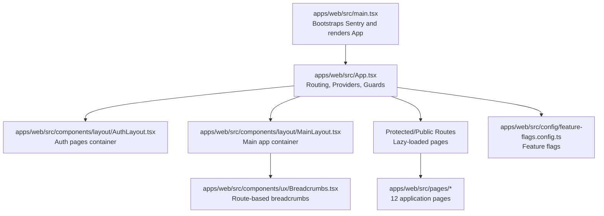
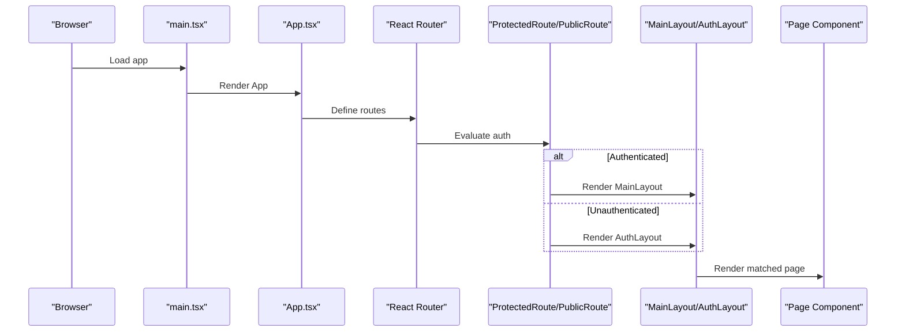
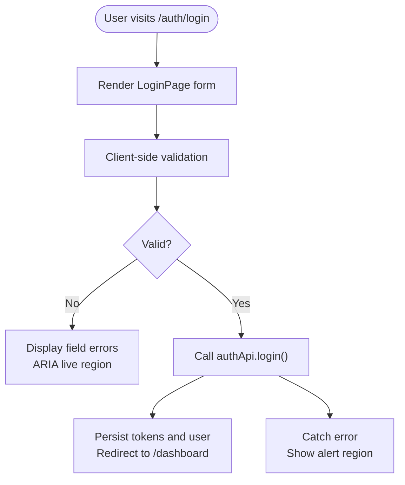
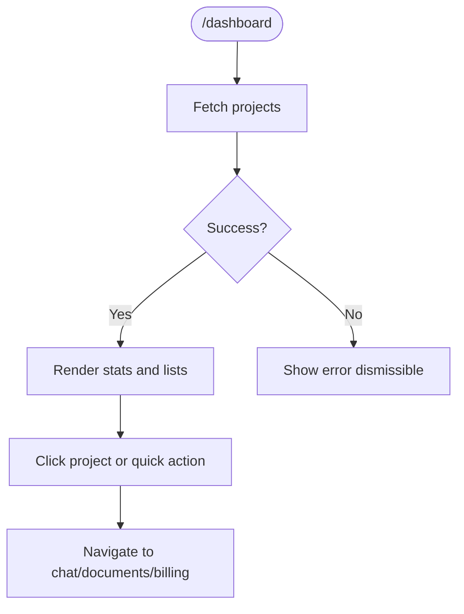
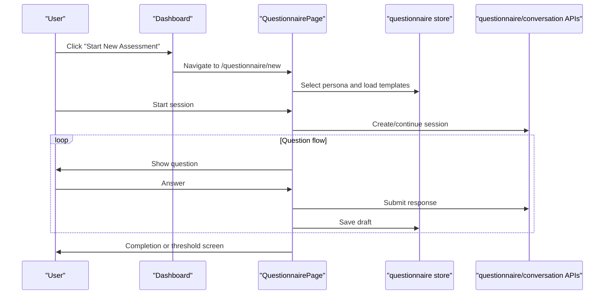
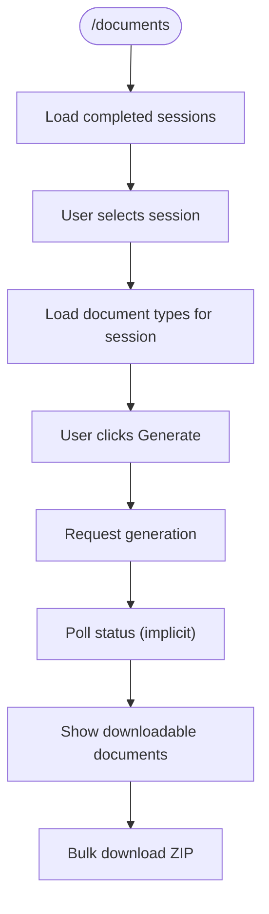
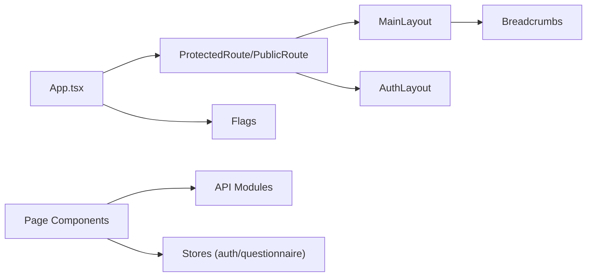

# Page Designs & Layouts

<cite>
**Referenced Files in This Document**
- [App.tsx](file://apps/web/src/App.tsx)
- [main.tsx](file://apps/web/src/main.tsx)
- [MainLayout.tsx](file://apps/web/src/components/layout/MainLayout.tsx)
- [AuthLayout.tsx](file://apps/web/src/components/layout/AuthLayout.tsx)
- [Breadcrumbs.tsx](file://apps/web/src/components/ux/Breadcrumbs.tsx)
- [feature-flags.config.ts](file://apps/web/src/config/feature-flags.config.ts)
- [DashboardPage.tsx](file://apps/web/src/pages/dashboard/DashboardPage.tsx)
- [LoginPage.tsx](file://apps/web/src/pages/auth/LoginPage.tsx)
- [QuestionnairePage.tsx](file://apps/web/src/pages/questionnaire/QuestionnairePage.tsx)
- [DocumentsPage.tsx](file://apps/web/src/pages/documents/DocumentsPage.tsx)
- [WIREFRAMES.md](file://WIREFRAMES.md)
</cite>

## Table of Contents
1. [Introduction](#introduction)
2. [Project Structure](#project-structure)
3. [Core Components](#core-components)
4. [Architecture Overview](#architecture-overview)
5. [Detailed Component Analysis](#detailed-component-analysis)
6. [Dependency Analysis](#dependency-analysis)
7. [Performance Considerations](#performance-considerations)
8. [Troubleshooting Guide](#troubleshooting-guide)
9. [Conclusion](#conclusion)
10. [Appendices](#appendices)

## Introduction
This document provides comprehensive page design documentation for the Quiz-to-Build application. It covers all 12 application pages, including authentication, dashboard, questionnaire flows, document management, and administrative interfaces. The guide explains layout components (MainLayout, AuthLayout), navigation patterns, user journey maps, page transitions, responsive breakpoints, mobile-first design principles, page-specific components, data loading states, error handling patterns, and accessibility compliance. It also offers guidelines for maintaining consistent page design patterns and extending existing layouts.

## Project Structure
The web application is a React single-page application structured around:
- Routing and providers in the root App component
- Layout wrappers for authenticated and unauthenticated experiences
- Feature flags controlling visibility of legacy and experimental features
- Page-level components organized under pages/
- Reusable layout and UX components under components/

**Diagram sources**
- [main.tsx:1-23](file://apps/web/src/main.tsx#L1-L23)
- [App.tsx:189-284](file://apps/web/src/App.tsx#L189-L284)
- [AuthLayout.tsx:9-90](file://apps/web/src/components/layout/AuthLayout.tsx#L9-L90)
- [MainLayout.tsx:72-366](file://apps/web/src/components/layout/MainLayout.tsx#L72-L366)
- [Breadcrumbs.tsx:55-160](file://apps/web/src/components/ux/Breadcrumbs.tsx#L55-L160)
- [feature-flags.config.ts:13-37](file://apps/web/src/config/feature-flags.config.ts#L13-L37)

**Section sources**
- [App.tsx:189-284](file://apps/web/src/App.tsx#L189-L284)
- [main.tsx:1-23](file://apps/web/src/main.tsx#L1-L23)

## Core Components
- App routing and providers:
  - ProtectedRoute and PublicRoute wrappers enforce authentication and prevent authenticated users from accessing auth pages.
  - Suspense fallback provides a loading spinner during lazy route loads.
  - Providers include QueryClientProvider, ToastProvider, NavigationGuardProvider, ConditionalProviders for accessibility, i18n, onboarding, AI predictive errors, and AI smart search.
- Layouts:
  - AuthLayout: centered card with trust signals, skip link, and footer.
  - MainLayout: responsive sidebar with collapsible navigation, top header with breadcrumbs, theme toggle, notifications, and footer.
- Breadcrumbs:
  - Route-based mapping computes breadcrumbs for dashboard, questionnaire, billing, help, and admin sections.
- Feature flags:
  - Controls visibility of legacy modules, AI chat widget, onboarding, accessibility, i18n, AI suggestions, predictive errors, and smart search.

**Section sources**
- [App.tsx:149-187](file://apps/web/src/App.tsx#L149-L187)
- [App.tsx:201-281](file://apps/web/src/App.tsx#L201-L281)
- [AuthLayout.tsx:9-90](file://apps/web/src/components/layout/AuthLayout.tsx#L9-L90)
- [MainLayout.tsx:72-366](file://apps/web/src/components/layout/MainLayout.tsx#L72-L366)
- [Breadcrumbs.tsx:55-160](file://apps/web/src/components/ux/Breadcrumbs.tsx#L55-L160)
- [feature-flags.config.ts:13-37](file://apps/web/src/config/feature-flags.config.ts#L13-L37)

## Architecture Overview
The application uses React Router v6 with lazy loading and guarded routes. Providers encapsulate cross-cutting concerns like state management, error boundaries, analytics, and feature flags. The MainLayout composes the sidebar, header, breadcrumbs, and page content area, while AuthLayout provides a streamlined experience for login and registration.

**Diagram sources**
- [main.tsx:16-22](file://apps/web/src/main.tsx#L16-L22)
- [App.tsx:202-271](file://apps/web/src/App.tsx#L202-L271)
- [App.tsx:149-187](file://apps/web/src/App.tsx#L149-L187)
- [MainLayout.tsx:72-366](file://apps/web/src/components/layout/MainLayout.tsx#L72-L366)
- [AuthLayout.tsx:9-90](file://apps/web/src/components/layout/AuthLayout.tsx#L9-L90)

## Detailed Component Analysis

### Authentication Pages
- LoginPage
  - Features: Zod validation, controlled form with live error announcements, password reveal toggle, OAuth buttons, “Forgot password” link, and sign-up link.
  - Accessibility: ARIA live regions, aria-invalid, aria-describedby, and skip link.
  - Data loading: Controlled by react-hook-form submission state.
  - Error handling: Displays server-side error messages in an alert region.
- Register, Forgot Password, Reset Password, Email Verification, OAuth Callback
  - Managed via lazy-loaded routes under /auth with AuthLayout wrapper.

**Diagram sources**
- [LoginPage.tsx:24-50](file://apps/web/src/pages/auth/LoginPage.tsx#L24-L50)
- [App.tsx:206-220](file://apps/web/src/App.tsx#L206-L220)

**Section sources**
- [LoginPage.tsx:24-190](file://apps/web/src/pages/auth/LoginPage.tsx#L24-L190)
- [App.tsx:206-220](file://apps/web/src/App.tsx#L206-L220)

### Dashboard
- Purpose: Project-centric overview with stats, active/completed projects, quick actions, and readiness score visualization.
- Layout: Responsive grid with sidebar actions and animated entries.
- Data loading: Fetches projects with error handling and skeleton loaders.
- Accessibility: Keyboard-friendly interactions, ARIA roles, and focus management.

**Diagram sources**
- [DashboardPage.tsx:153-177](file://apps/web/src/pages/dashboard/DashboardPage.tsx#L153-L177)
- [DashboardPage.tsx:205-502](file://apps/web/src/pages/dashboard/DashboardPage.tsx#L205-L502)

**Section sources**
- [DashboardPage.tsx:153-502](file://apps/web/src/pages/dashboard/DashboardPage.tsx#L153-L502)

### Questionnaire Flow
- Persona selection and questionnaire list for new sessions.
- Active session with progress bar, readiness score, autosave banner, and AI follow-up.
- Navigation controls: Previous, Skip, Submit; optional AI suggestions provider.
- Data loading: Uses questionnaire store and API hooks; handles loading, error, and completion states.

**Diagram sources**
- [QuestionnairePage.tsx:48-321](file://apps/web/src/pages/questionnaire/QuestionnairePage.tsx#L48-L321)
- [QuestionnairePage.tsx:323-750](file://apps/web/src/pages/questionnaire/QuestionnairePage.tsx#L323-L750)

**Section sources**
- [QuestionnairePage.tsx:48-750](file://apps/web/src/pages/questionnaire/QuestionnairePage.tsx#L48-L750)

### Documents Management
- Session selector for completed projects.
- Document type grid with generation actions and bulk download.
- Data loading: Lists document types scoped to session; handles fallbacks and errors.

**Diagram sources**
- [DocumentsPage.tsx:47-161](file://apps/web/src/pages/documents/DocumentsPage.tsx#L47-L161)
- [DocumentsPage.tsx:165-378](file://apps/web/src/pages/documents/DocumentsPage.tsx#L165-L378)

**Section sources**
- [DocumentsPage.tsx:47-378](file://apps/web/src/pages/documents/DocumentsPage.tsx#L47-L378)

### Additional Pages (Overview)
- Heatmap, Evidence, Decisions, Policy Pack, Billing, Invoices, Upgrade, Privacy, Terms, Help, Idea Capture, Chat, Document Menu, Document Preview, Fact Review, Workspace, New Project Flow, Review Queue, Document Review, MFA Setup, Profile, Analytics Dashboard, Session Comparison
  - Covered by routes in App.tsx under MainLayout (protected) and public routes for privacy/terms/help.
  - Many pages leverage the MainLayout’s breadcrumbs and responsive sidebar.

**Section sources**
- [App.tsx:222-267](file://apps/web/src/App.tsx#L222-L267)

## Dependency Analysis
- Routing and guards:
  - ProtectedRoute/PublicRoute wrap MainLayout/AuthLayout respectively.
  - OAuth callback routes are defined before /auth to ensure proper matching.
- Layout dependencies:
  - MainLayout depends on Breadcrumbs for route-based navigation.
  - Both layouts use feature flags for conditional rendering (e.g., AI chat widget).
- Page-level dependencies:
  - Dashboard uses project API and UI skeletons.
  - Questionnaire uses questionnaire store and conversation APIs.
  - Documents uses document APIs and questionnaire store for session context.

**Diagram sources**
- [App.tsx:202-271](file://apps/web/src/App.tsx#L202-L271)
- [MainLayout.tsx:48-70](file://apps/web/src/components/layout/MainLayout.tsx#L48-L70)
- [Breadcrumbs.tsx:55-160](file://apps/web/src/components/ux/Breadcrumbs.tsx#L55-L160)
- [feature-flags.config.ts:13-37](file://apps/web/src/config/feature-flags.config.ts#L13-L37)

**Section sources**
- [App.tsx:202-271](file://apps/web/src/App.tsx#L202-L271)

## Performance Considerations
- Lazy loading: All pages are lazy-loaded with Suspense fallback to reduce initial bundle size.
- React Query: Centralized caching and retries with a 5-minute stale time and disabled window focus refetch.
- Feature flags: Disable heavy features behind flags to avoid unnecessary overhead.
- Skeletons and placeholders: Used in Dashboard and Documents to improve perceived performance.

[No sources needed since this section provides general guidance]

## Troubleshooting Guide
- Authentication failures:
  - LoginPage displays server-side error messages in an alert region with assertive live region semantics.
  - Verify form validation and network connectivity.
- Route protection:
  - ProtectedRoute redirects unauthenticated users to /auth/login.
  - PublicRoute redirects authenticated users away from /auth.
- Layout issues:
  - MainLayout uses a skip link and focus-visible styles; ensure keyboard navigation works.
  - Breadcrumbs rely on route patterns; verify DEFAULT_ROUTE_MAPPINGS for new routes.
- Feature flags:
  - Some features (e.g., AI chat widget) are gated by feature flags; confirm environment variables.

**Section sources**
- [LoginPage.tsx:64-79](file://apps/web/src/pages/auth/LoginPage.tsx#L64-L79)
- [App.tsx:149-187](file://apps/web/src/App.tsx#L149-L187)
- [MainLayout.tsx:101-121](file://apps/web/src/components/layout/MainLayout.tsx#L101-L121)
- [Breadcrumbs.tsx:55-160](file://apps/web/src/components/ux/Breadcrumbs.tsx#L55-L160)
- [feature-flags.config.ts:6-11](file://apps/web/src/config/feature-flags.config.ts#L6-L11)

## Conclusion
The Quiz-to-Build application employs a clean separation of concerns with robust routing, layout components, and feature flags. The MainLayout and AuthLayout provide consistent navigation and accessibility, while page components encapsulate domain-specific logic and data loading. The documented patterns enable maintainable extensions and consistent user experiences across all 12 application pages.

[No sources needed since this section summarizes without analyzing specific files]

## Appendices

### Page Inventory and Wireframes
- Authentication
  - Login, Register, Forgot Password, Reset Password, Email Verification, OAuth Callback
  - AuthLayout provides a centered card with trust signals and skip link.
- Dashboard
  - Stats grid, active/completed projects, quick actions, readiness score visualization.
- Questionnaire
  - Persona selection, questionnaire list, adaptive flow, progress tracking, autosave, AI follow-up.
- Documents
  - Session selector, document type grid, generation actions, bulk download.
- Additional Pages
  - Heatmap, Evidence, Decisions, Policy Pack, Billing, Invoices, Upgrade, Privacy, Terms, Help, Idea Capture, Chat, Document Menu, Document Preview, Fact Review, Workspace, New Project Flow, Review Queue, Document Review, MFA Setup, Profile, Analytics Dashboard, Session Comparison
  - Covered by routes under MainLayout with breadcrumbs.

**Section sources**
- [App.tsx:206-267](file://apps/web/src/App.tsx#L206-L267)
- [WIREFRAMES.md:217-543](file://WIREFRAMES.md#L217-L543)

### Navigation Patterns and User Journeys
- From Dashboard to Questionnaire:
  - Start New Assessment → Persona selection → Template selection → Question flow → Completion.
- From Questionnaire to Documents:
  - Completion screen → Generate Documents → Select session → Choose document type → Download.
- From Dashboard to Billing:
  - Quick action → Manage Billing → View usage → Upgrade/Cancel.

**Section sources**
- [DashboardPage.tsx:310-372](file://apps/web/src/pages/dashboard/DashboardPage.tsx#L310-L372)
- [QuestionnairePage.tsx:343-372](file://apps/web/src/pages/questionnaire/QuestionnairePage.tsx#L343-L372)
- [DocumentsPage.tsx:168-215](file://apps/web/src/pages/documents/DocumentsPage.tsx#L168-L215)

### Responsive Breakpoints and Mobile-First Principles
- Sidebar behavior:
  - Collapsible on desktop; mobile overlay with backdrop and close affordance.
  - Collapsed state reduces sidebar width to 68px.
- Header:
  - Mobile hamburger menu, breadcrumbs above actions, theme toggle, notifications, user avatar.
- Grids and cards:
  - Responsive grids adjust column counts based on viewport; skeleton loaders improve perceived performance.
- Accessibility:
  - Skip links, ARIA live regions, focus management, and keyboard navigation support.

**Section sources**
- [MainLayout.tsx:124-199](file://apps/web/src/components/layout/MainLayout.tsx#L124-L199)
- [MainLayout.tsx:305-344](file://apps/web/src/components/layout/MainLayout.tsx#L305-L344)
- [DashboardPage.tsx:244-280](file://apps/web/src/pages/dashboard/DashboardPage.tsx#L244-L280)
- [DocumentsPage.tsx:316-371](file://apps/web/src/pages/documents/DocumentsPage.tsx#L316-L371)

### Accessibility Compliance and Screen Reader Support
- WCAG 2.4.1 Skip Links: Present in both AuthLayout and MainLayout.
- ARIA live regions: LoginPage uses polite and assertive regions for status and errors.
- Focus management: Buttons, inputs, and interactive elements receive visible focus.
- Semantic markup: Breadcrumb component uses nav and ol with schema.org microdata.

**Section sources**
- [MainLayout.tsx:101-107](file://apps/web/src/components/layout/MainLayout.tsx#L101-L107)
- [AuthLayout.tsx:18-24](file://apps/web/src/components/layout/AuthLayout.tsx#L18-L24)
- [LoginPage.tsx:59-78](file://apps/web/src/pages/auth/LoginPage.tsx#L59-L78)
- [Breadcrumbs.tsx:274-294](file://apps/web/src/components/ux/Breadcrumbs.tsx#L274-L294)

### Guidelines for Consistent Page Design and Extensions
- Use MainLayout for authenticated pages; AuthLayout for login/registration/password flows.
- Implement route-based breadcrumbs via DEFAULT_ROUTE_MAPPINGS for consistent navigation.
- Apply feature flags for experimental features; keep legacy modules behind flags.
- Maintain responsive grids and skeleton loaders for data-heavy pages.
- Ensure every interactive element has appropriate ARIA attributes and keyboard support.
- Extend pages by composing reusable components (Cards, Buttons, EmptyState, Skeletons) and leveraging stores and APIs consistently.

**Section sources**
- [MainLayout.tsx:32-45](file://apps/web/src/components/layout/MainLayout.tsx#L32-L45)
- [Breadcrumbs.tsx:55-160](file://apps/web/src/components/ux/Breadcrumbs.tsx#L55-L160)
- [feature-flags.config.ts:13-37](file://apps/web/src/config/feature-flags.config.ts#L13-L37)